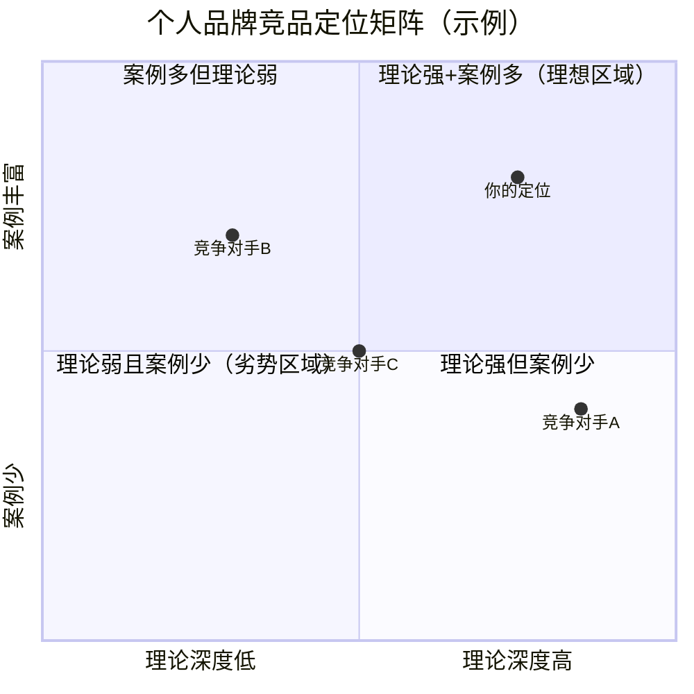
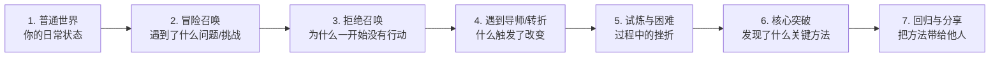
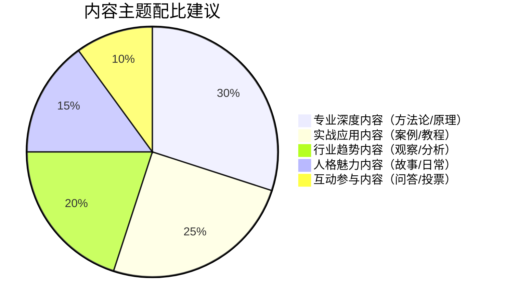

# 练习方法：打造个人品牌的实操训练

个人品牌不是"想"出来的，而是"练"出来的。前文的理论模型告诉你"为什么有效"，核心技巧告诉你"怎么做"，但真正把知识转化为能力的唯一路径是**反复练习**。

神经科学研究表明，任何复杂的认知技能——包括品牌定位、故事叙述、危机沟通——都需要通过"刻意练习"（deliberate practice，心理学家安德斯·埃里克森提出）才能内化为直觉反应。刻意练习有三个关键特征：**明确的目标**、**即时的反馈**、**重复的修正**。本章的七个练习正是围绕这三个特征设计的。

### 练习体系总览

七个练习覆盖个人品牌建设的完整闭环，从诊断到执行、从内部建设到外部传播：

| 编号 | 练习名称 | 核心能力 | 难度等级 | 建议频率 |
|------|---------|---------|---------|---------|
| 1 | 品牌审计 | 诊断与评估 | ★★☆☆☆ | 每季度 |
| 2 | 品牌定位画布 | 战略定位 | ★★★☆☆ | 每半年 |
| 3 | 个人故事打磨 | 叙事表达 | ★★★★☆ | 每月 |
| 4 | 内容日历制定 | 系统输出 | ★★★☆☆ | 每月 |
| 5 | 电梯演讲练习 | 即时表达 | ★★☆☆☆ | 每周 |
| 6 | 社交媒体一致性检查 | 形象管理 | ★★☆☆☆ | 每月 |
| 7 | 危机模拟演练 | 应急沟通 | ★★★★★ | 每季度 |

**建议的练习顺序**：从练习1（品牌审计）开始，建立认知基线，再依次完成练习2和3确定"说什么"，练习4和5解决"怎么说"，练习6管理"在哪说"，练习7应对"万一出事怎么办"。

***

## 练习一：自我品牌审计

### 为什么要做品牌审计

品牌审计是所有品牌工作的起点。正如企业管理者不会在不了解财务状况的情况下做战略规划，个人品牌的建设也必须从"摸清家底"开始。品牌审计的核心目的是回答三个问题：**别人现在怎么看我？我想让别人怎么看我？两者之间的差距是什么？**

品牌审计本质上是一个信息收集和差距分析的过程。你需要从"外部可见信息"和"他人主观认知"两个维度交叉验证，才能获得对自身品牌现状的准确判断。仅凭自我感觉或单一来源的信息做判断，是品牌建设中最常见的认知陷阱。

### 第一步：数字足迹审查

在百度、Google、知乎、微博、抖音、小红书、LinkedIn等平台上搜索自己的名字（以及常用的网名/ID），用以下评分表系统记录：

**数字足迹评分卡**

| 评估维度 | 评分标准 | 你的得分（1-5） |
|---------|---------|----------------|
| **可见度** | 搜索结果中有多少条与你相关的内容？0条=1分，10条以上=5分 | |
| **一致性** | 各平台上传达的形象是否一致？完全不同=1分，高度统一=5分 | |
| **专业性** | 搜索结果是否体现你的专业能力？全是生活碎片=1分，专业内容为主=5分 | |
| **时效性** | 搜索结果是否最新？全是3年前的=1分，近3个月有更新=5分 | |
| **可控性** | 第一页结果中有多少是你主动发布的？全部不可控=1分，完全可控=5分 | |
| **负面信息** | 是否有负面内容？有明确负面=1分，全是正面/中性=5分 | |

**评分解读**：
- **24-30分**：数字品牌基础扎实，进入优化阶段
- **18-23分**：基础尚可，需要系统提升
- **12-17分**：存在明显短板，需要紧急补课
- **6-11分**：数字品牌几乎空白或存在严重问题，需要从零开始建设

### 第二步：他人认知调研

找5-10个了解你的人（涵盖不同圈层：同事、朋友、客户、合作伙伴、行业同行），进行一对一的简短调研。注意：不要在群聊中问，也不要发问卷——面对面或一对一电话交流才能获得真诚的反馈。

**标准化调研问题清单**

**问题1：认知锚点测试**
"提到[你的名字]，你脑海中浮现的第一个词或画面是什么？"

这个问题用的是心理学中的"自由联想"技术。不要给选项，不要引导，让对方说出最原始的反应。记录下来的词就是你的"认知锚点"——这是别人对你的第一印象。

**问题2：能力标签提取**
"在你看来，我最擅长的三件事是什么？"

对比所有人给出的答案。如果超过70%的人提到了相同的两件事，说明你的品牌已经形成了稳定的"能力标签"。如果答案高度分散，说明你的品牌认知还不清晰。

**问题3：差异化感知**
"如果要向一个不认识我的人介绍我，你会怎么说？和介绍其他人有什么不同？"

这个问题测试的是你在他人眼中的"独特性"。如果对方说"你和XX很像"，说明你的差异化不够明确。如果对方能说出你的独特之处，说明品牌定位有效。

**问题4：改进建议**
"如果要让我的个人品牌更强，你有什么建议？"

这个问题往往能获得最有价值的洞察。关注那些你自己看不到的盲区。

**问题5：信任度评估**
"如果我推荐一个产品或课程，你会因为'是我推荐的'就去了解吗？"

这个问题直接测试你的品牌信任度。如果对方犹豫或直接说"不会"，说明品牌信任还没有建立。

### 第三步：差距分析与行动计划

将第一步和第二步的结果汇总到一张差距分析表中：

| 维度 | 当前状态（实际认知） | 目标状态（期望认知） | 差距大小（1-5） | 优先级 | 具体行动 |
|------|-------------------|-------------------|----------------|-------|---------|
| 专业能力 | | | | | |
| 人格特质 | | | | | |
| 内容质量 | | | | | |
| 社交形象 | | | | | |
| 行业影响力 | | | | | |

**差距大小的判断标准**：
- **1分**：几乎没有差距，维持现状即可
- **2分**：微小差距，细节调整
- **3分**：明显差距，需要专项提升
- **4分**：较大差距，需要系统重建
- **5分**：截然相反，需要从认知层面重新定位

**行动优先级**：差距大且对目标受众重要的维度优先处理。不要试图同时解决所有问题——品牌建设是长期工程，聚焦2-3个最高优先级的差距开始行动。

### 常见陷阱

**陷阱一：只看线上不看线下**
很多人的品牌存在于线下（行业口碑、同事评价），但线上几乎空白。数字审计只是品牌审计的一个维度，不能代表全部。

**陷阱二：只问同类型的人**
如果你只问同事，得到的是"职场品牌"的反馈。要获得全面的认知，必须覆盖不同的关系圈层。

**陷阱三：一次审计就定终身**
品牌认知会随着你的行为和内容输出不断变化。每季度进行一次审计，追踪认知的变化趋势，才能及时调整策略。

***

## 练习二：品牌定位画布

### 为什么需要结构化定位

品牌定位不是灵光一闪的灵感，而是一个结构化的思考过程。哈佛商学院教授道格拉斯·霍尔特（Douglas Holt）在《文化战略》中指出，成功的品牌定位需要同时满足三个条件：**真实的能力基础**、**明确的受众需求**、**独特的价值差异**。三者缺一不可。

品牌定位画布是一个将这三个条件可视化、结构化的工具。它帮助你避免两个最常见的定位错误：一是"自嗨式定位"——只考虑自己想说什么，不考虑受众需要听什么；二是"跟风式定位"——定位和别人雷同，缺乏独特性。

### 核心工具：定位画布模板

准备一张大纸或白板，画出以下框架，逐一填写：

┌─────────────────────────────────────────┐
│               品牌定位画布                  │
├─────────────────────────────────────────┤
│ 一、能力清单（我的核心竞争力）               │
│                                           │
│ 硬技能（可量化/可验证的专业能力）：           │
│ 1. ________________                       │
│ 2. ________________                       │
│ 3. ________________                       │
│                                           │
│ 软技能（人际/思维/领导力等）：               │
│ 1. ________________                       │
│ 2. ________________                       │
│                                           │
│ 独特经历（他人难以复制的人生经历）：           │
│ 1. ________________                       │
│ 2. ________________                       │
├─────────────────────────────────────────┤
│ 二、热情诊断（我真正热爱什么）               │
│                                           │
│ 测试方法：回忆过去3年，什么事情让你           │
│ 废寝忘食、不计报酬也愿意做的？               │
│                                           │
│ 1. ________________                       │
│ 2. ________________                       │
│ 3. ________________                       │
│                                           │
│ 排除法：你擅长但并不热爱的事情：             │
│ ________________                          │
│ （这类事情可以用来赚钱，但不应该成为          │
│   你的品牌核心，因为你很难长期坚持）          │
├─────────────────────────────────────────┤
│ 三、受众痛点分析                            │
│                                           │
│ 我最想服务的人群：___________________       │
│                                           │
│ 他们最大的3个痛点：                         │
│ 1. ________________                       │
│ 2. ________________                       │
│ 3. ________________                       │
│                                           │
│ 他们现有的解决方案是什么？                   │
│ ________________                          │
│ 这些方案的不足是什么？                      │
│ ________________                          │
├─────────────────────────────────────────┤
│ 四、差异化定位                              │
│                                           │
│ 市场上做类似事情的人有谁？                   │
│ ________________                          │
│ 他们的定位是什么？                          │
│ ________________                          │
│ 我和他们最大的不同是什么？                   │
│ ________________                          │
│ 这个不同是否对受众有价值？                   │
│ ________________                          │
├─────────────────────────────────────────┤
│ 五、品牌声明（一句话）                       │
│                                           │
│ 格式：我帮助 [目标受众]                     │
│       通过 [核心方法/独特价值]               │
│       实现 [具体成果]。                     │
│                                           │
│ 你的品牌声明：                              │
│ ________________________________________  │
│ ________________________________________  │
└─────────────────────────────────────────┘

### 品牌声明的检验标准

写出品牌声明后，用以下五个问题检验它是否合格：

**检验一：具体性测试**
去掉品牌声明中的具体信息后，这个声明是否还能适用于别人？如果能，说明不够具体。

- ❌ "我帮助创业者提升沟通能力"——太通用
- ✅ "我帮助B2B技术创业者通过结构化演讲训练实现融资路演成功率翻倍"——足够具体

**检验二：吸引力测试**
找到5个目标受众代表，让他们阅读你的品牌声明。问他们："你听完之后，想了解更多吗？"如果超过60%的人说"想"，说明吸引力达标。

**检验三：可信度测试**
你的品牌声明中的承诺是否有证据支撑？如果你说"帮助客户提升40%的业绩"，你需要准备好案例和数据来支撑这个说法。

**检验四：差异化测试**
搜索你的品牌声明关键词，看看有多少人说的是类似的话。如果搜索结果中前10条就有3条以上和你的声明高度相似，说明差异化不足。

**检验五：持久性测试**
这个定位是否能支撑你未来3-5年的发展？如果市场变化或你的兴趣转移，这个定位是否仍然适用？过于狭隘的定位可能很快过时，过于宽泛的定位则缺乏力量。

### 进阶：竞品定位矩阵

在明确自己的定位后，画一个二维矩阵图来可视化你和竞争对手的位置关系。选择两个对目标受众最重要的维度（例如"专业深度"vs"实用易用性"，"理论严谨"vs"案例丰富"）作为X轴和Y轴，将你和所有已知的竞争对手标在图上。

目标是找到一个竞争对手少且受众需求大的空白区域作为你的定位。如果理想区域已经有强竞争者占据，考虑选择一个差异化的维度组合，或者在现有维度上做到极致。

***

## 练习三：个人故事打磨

### 为什么故事比数据更有说服力

斯坦福大学市场营销学教授詹妮弗·阿克（Jennifer Aaker）的研究表明，故事比纯数据的**记忆留存率高22倍**。在个人品牌的语境中，这意味着：别人可能会忘记你说过什么观点，但不会忘记你讲过的故事。

个人故事不是自传，不是经历罗列。好的品牌故事是一个**精心设计的认知框架**，它让听众在你的经历中看到自己的影子，从而建立情感连接和信任。

### 第一步：挖掘关键素材

在写故事之前，先用以下表格挖掘素材。每个问题都要写出具体的细节，不要用概括性的语言：

**素材挖掘工作表**

| 素材类别 | 具体内容 | 为什么重要 |
|---------|---------|-----------|
| **至暗时刻**：你人生中最低谷的一次经历是什么？ | | 体现真实性和韧性 |
| **觉醒时刻**：你意识到需要改变的那个瞬间是什么？ | | 建立共鸣（受众也有类似困境） |
| **第一次尝试**：你最初是怎么尝试解决问题的？失败了几次？ | | 展示过程，避免"天才叙事" |
| **转折点**：你发现了什么关键洞见或方法？ | | 引出你的核心价值主张 |
| **验证时刻**：你的方法第一次奏效的场景是什么？ | | 提供具体证据 |
| **放大成果**：这个方法带来了什么可量化的改变？ | | 增加可信度 |
| **传承意愿**：你为什么想把这个方法教给别人？ | | 建立使命感 |

### 第二步：运用英雄之旅框架

约瑟夫·坎贝尔在《千面英雄》中提出的"英雄之旅"（Hero's Journey）是最经典的故事结构。将这个框架简化为个人品牌故事的七个步骤：

**模板填写示例**：

> "五年前（普通世界），我和大多数产品经理一样，靠直觉和经验做决策。直到（冒险召唤）我负责的一个重要项目上线后用户流失率高达70%，我才意识到自己根本不了解用户。（拒绝召唤）我当时觉得这是市场的问题，不是我的问题。直到（转折）我偶然接触到行为心理学，发现用户的决策模式有明确的规律可循。（试炼）我花了整整一年时间学习心理学、做用户实验，前15次实验全部失败。（突破）第16次，我终于找到了一个将心理学模型嵌入产品设计流程的方法。（回归）现在，我把这套方法教给产品经理，帮助他们用科学而非直觉来做产品决策。"

### 第三步：制作多时间版本

同一个故事需要准备三个不同长度的版本，用于不同场景：

**30秒版本（电梯演讲/社交破冰）**
- 只保留"困境→转折→成果"三个要素
- 一个金句收尾
- 练习要求：不看稿，自然地说出来

**2分钟版本（社交场合/一对一交流）**
- 保留"普通世界→困境→转折→突破→成果"
- 增加一个具体的细节或数据
- 练习要求：注意节奏，在转折处制造悬念

**5分钟版本（演讲开场/播客采访）**
- 保留完整的七个步骤
- 增加情感描写和对话还原
- 练习要求：注意情感起伏，避免全程平淡

### 故事打磨的五个核心原则

**原则一：具体胜过抽象**
- ❌ "我经历了很多困难"
- ✅ "连续三个月，每天凌晨两点还在改方案，第17次被客户拒绝"

**原则二：脆弱建立连接**
适度展示你的脆弱面（失败、迷茫、恐惧），反而能建立更深层的信任。布琳·布朗（Brené Brown）在《脆弱的力量》中论证了这一点：完美的人令人仰望但难以亲近，真实的人令人信任并产生共鸣。

**原则三：数字增加可信度**
- ❌ "效果显著提升"
- ✅ "用户转化率从3.2%提升到了11.7%，在三个月内增长了266%"

**原则四：悬念维持注意力**
在故事中设置"钩子"——"如果当时我做了那个决定，就不会有后来的一切了……"让听众产生好奇，想知道后面发生了什么。

**原则五：结尾要有"降落"**
故事的结尾要清晰地连接到你的品牌价值主张。听众听完故事后应该明确知道："这个人能帮我解决什么问题"。

### 常见陷阱

**陷阱一：把故事讲成了简历**
罗列"我做了A，然后做了B，又做了C"不是故事。故事要有冲突、有转折、有情感。

**陷阱二：过度戏剧化**
为了吸引注意力而夸大事实，最终会伤害信任。真实的故事不需要夸张，细节本身就是力量。

**陷阱三：忽略受众视角**
你的故事对于听众有什么意义？如果你的故事只讲了自己的经历而没有连接到受众的需求，那只是自说自话。

***

## 练习四：内容日历制定

### 为什么需要系统化的内容输出

零散的内容输出是个人品牌建设中最大的效率杀手。今天发一篇行业观察，下周分享一个生活感悟，下个月又转发一条新闻——这种无序的内容输出不仅无法建立清晰的品牌形象，反而会让受众困惑"这个人到底是做什么的？"

系统化的内容输出需要三个要素：**主题矩阵**（说什么）、**日历规划**（什么时候说）、**素材管理**（从哪里获取素材）。

### 第一步：构建内容主题矩阵

围绕你的品牌定位，确定3-5个核心内容主题。一个好的主题矩阵需要同时满足三个条件：**与品牌定位相关**、**你能持续产出**、**受众有需求**。

以"数据驱动的营销专家"为例：

| 主题类型 | 具体主题 | 内容形式示例 | 品牌价值 |
|---------|---------|------------|---------|
| 专业深度 | 数据分析方法论 | 长文、系列课程 | 建立专业权威 |
| 实战应用 | 营销案例深度解读 | 图文、视频拆解 | 证明实操能力 |
| 前沿趋势 | 行业趋势观察 | 观点短文、播客 | 展示前瞻性思维 |
| 实用技巧 | 工具使用教程 | 短视频、图文教程 | 增加实用价值 |
| 人格魅力 | 个人成长故事 | 随笔、Vlog | 建立情感连接 |

**配比原则**：专业内容占50%-60%（建立权威），生活/人格内容占15%-20%（建立连接），互动内容占10%-15%（促进参与）。具体比例根据平台特性调整——LinkedIn偏专业，小红书偏生活，微信公众号居中。

### 第二步：制定月度发布日历

每月初花1小时规划当月内容，按周分配：

**月度内容日历模板**

| 周次 | 周一 | 周三 | 周五 | 周末 |
|------|------|------|------|------|
| 第1周 | 专业方法论长文 | 案例分析 | 趋势观察短文 | 互动话题 |
| 第2周 | 实操教程 | 行业数据解读 | 个人故事/感悟 | 粉丝问答 |
| 第3周 | 工具评测 | 方法论系列（续） | 热点点评 | 周末随笔 |
| 第4周 | 月度复盘 | 案例分析 | 下月预告 | 互动投票 |

**发布时间优化**：
- 微信公众号：工作日早上7:30-8:30（通勤时间）或晚上9:00-10:00（睡前时间）
- 知乎/微博：中午12:00-13:00（午休时间）
- 小红书/抖音：晚上7:00-9:00（黄金时段）
- LinkedIn：工作日上午9:00-11:00

注意：以上是通用建议，你应根据自己的受众数据分析最佳发布时间。

### 第三步：建立素材管理系统

内容生产的最大瓶颈不是写作能力，而是**素材积累**。你需要一个随时可用的素材库：

**素材分类体系**

| 素材类别 | 来源渠道 | 记录方式 | 使用场景 |
|---------|---------|---------|---------|
| 行业新闻 | RSS订阅、行业媒体 | 截图+链接+一句话点评 | 趋势观察、热点评论 |
| 数据报告 | 艾瑞、QuestMobile、麦肯锡 | 关键数据摘录 | 增强文章可信度 |
| 受众问题 | 评论区、私信、社群 | 原文记录+问题分类 | 选题来源、FAQ内容 |
| 个人经历 | 日常工作、生活 | 简短日记（3句话内） | 故事素材、人格内容 |
| 优秀案例 | 同行内容、竞品分析 | 链接+亮点笔记 | 案例分析、学习参考 |
| 灵感闪现 | 任何时刻 | 语音备忘/速记 | 未来选题储备 |

**工具推荐**：
- **Notion**：适合需要高度自定义的用户，数据库+看板+日历一体化
- **飞书文档**：适合团队协作场景，多维表格功能强大
- **Flomo**：极简的卡片式记录，适合灵感快速捕捉
- **微信收藏+标签**：最低门槛的素材管理方式，适合碎片化收集
- **Obsidian**：适合喜欢Markdown的用户，双向链接功能便于知识关联

### 内容生产效率提升技巧

**技巧一：批量创作法**
不要每天临时想写什么。选一个集中时间（例如周末下午），一次性产出一周的内容草稿，平时只需要修改润色和发布。批量创作的效率是随写随发的3-5倍。

**技巧二：一鱼多吃法**
一个核心内容可以拆分为多种形式：一篇3000字的深度文章 → 5条短文/金句卡片 → 1个10分钟演讲 → 3条短视频脚本 → 1份社群讨论话题。一次深度思考，多平台多次使用。

**技巧三：内容复利法**
定期回顾你的历史内容。一篇6个月前写的文章，可以加入新的数据和案例重新发布；一个过去讲过的观点，可以在新的事件背景下重新解读。好的内容不会过期，只是需要新鲜的包装。

***

## 练习五：电梯演讲练习

### 为什么电梯演讲如此重要

电梯演讲（Elevator Pitch）得名于一个假设场景：你在电梯里偶遇一位重要人物，你只有30秒（电梯从一楼到顶层的时间）来传达你的核心价值。这个场景虽然极端，但现实中的情况与此类似——社交场合的初次见面、会议间隙的寒暄、社群里的自我介绍，你获得的关注窗口通常不超过30秒。

心理学中的"首因效应"（primacy effect）告诉我们，人们对你的第一印象在接触的前7秒内就形成了，且难以改变。电梯演讲就是你在7秒内建立正面第一印象的武器。

### 第一步：撰写电梯演讲稿

**四要素框架**

| 要素 | 说明 | 示例 |
|------|------|------|
| 身份定位 | 用一个具体的标签定义你是谁 | "我是一个专注B2B SaaS领域的增长策略师" |
| 价值主张 | 你能为受众解决什么问题 | "我帮助SaaS企业找到可持续的增长引擎" |
| 差异化 | 你和同类人有什么不同 | "我的方法结合了数据分析和用户心理学" |
| 可信证据 | 一个具体的成果数据 | "过去两年帮助12家SaaS企业实现了ARR翻倍" |

**完整示例**：

> "我叫李明，是一个用心理学视角做产品的互联网人。我帮助产品经理通过心理学工具真正理解用户需求，而不是靠拍脑袋。过去两年，我帮助超过50家企业优化了产品体验，用户满意度平均提升了40%。"

**不同场景的变体**：

| 场景 | 侧重点 | 示例调整 |
|------|-------|---------|
| 行业会议 | 专业深度 | 突出方法论和行业数据 |
| 社交聚会 | 亲和力 | 突出故事和人格魅力 |
| 求职面试 | 能力匹配 | 突出与岗位相关的成果 |
| 融资路演 | 市场潜力 | 突出市场规模和增长数据 |
| 媒体采访 | 故事性 | 突出独特的经历和观点 |

### 第二步：刻意练习流程

**练习一：镜前练习（第1-3天）**
- 对着镜子朗读20遍
- 观察自己的表情、手势、眼神
- 录音回听，检查语速和停顿
- 目标：脱稿、自然、不卡顿

**练习二：录音/录像回放（第4-7天）**
- 用手机录下自己说电梯演讲的视频
- 回放时关注：语速是否适中（每分钟180-200字为宜）、是否有多余的口头禅（"那个""就是""嗯"）、表情是否自然自信、是否有不必要的小动作
- 每次回放标注3个需要改进的点，下一次练习时重点改进

**练习三：真人模拟（第2-3周）**
- 找3-5个不同关系类型的人（朋友、同事、陌生人）进行实战练习
- 每次演练后询问对方：
  - "你记住了什么？"（测试记忆点）
  - "你听完想了解更多吗？"（测试吸引力）
  - "你有什么疑问？"（测试清晰度）
- 根据反馈迭代优化

**练习四：实战应用（第4周起）**
- 在真实的社交场合使用你的电梯演讲
- 每次使用后记录：对方的反应是什么？对话是否继续了？对方提出了什么问题？
- 每两周回顾一次记录，总结优化方向

### 电梯演讲的常见错误

**错误一：信息过载**
试图在30秒内塞入所有信息。30秒只够传达一个核心信息，不要贪多。如果你的信息超过3个要点，砍到1个。

**错误二：过于谦虚或过于自信**
- ❌ "我也没什么特别的，就是做了几年产品……"（过度谦虚会让人觉得你缺乏自信）
- ❌ "我是国内最顶级的产品专家……"（过度自信会让人反感）
- ✅ "我专注于用数据驱动产品决策，过去两年帮助10多家企业提升了产品转化率"（客观陈述事实）

**错误三：没有"钩子"**
电梯演讲的结尾应该是一个开放性的钩子，引导对方继续提问。例如："最近我在研究一个很有意思的课题——为什么80%的产品功能用户从来不使用。"这比"这就是我做的事情"要有效得多。

**错误四：千篇一律**
在不同场合使用完全相同的电梯演讲。好的电梯演讲有一个稳定的"核心"，但会根据场景和对象做适当调整。

***

## 练习六：社交媒体一致性检查

### 为什么一致性是品牌的基础

品牌管理大师大卫·阿克（David Aaker）在《管理品牌资产》中指出，品牌一致性的核心作用是**降低认知成本**。当受众在不同平台上看到的你都是"同一个人"时，他们对你的认知会逐渐固化为一个清晰的标签。反之，如果每个平台上的你都不一样，受众会困惑"这个人到底是做什么的"，你的品牌认知就无法积累。

一致性不等于完全相同。正确的策略是**核心一致，形式适配**——品牌定位、价值主张、人格特质保持一致，但内容形式、表达风格、发布频率根据平台特性做调整。

### 第一步：全平台账号盘点

列出你所有活跃的社交媒体账号，包括但不限于：

| 平台 | 账号名称 | 粉丝/好友数 | 更新频率 | 主要内容类型 |
|------|---------|------------|---------|------------|
| 微信朋友圈 | | | | |
| 微信公众号 | | | | |
| 微博 | | | | |
| 知乎 | | | | |
| 小红书 | | | | |
| 抖音 | | | | |
| B站 | | | | |
| LinkedIn | | | | |
| Twitter/X | | | | |
| GitHub | | | | |
| 个人网站/博客 | | | | |
| 其他：_____ | | | | |

### 第二步：一致性检查清单

逐一检查每个平台的以下要素，标记"一致"或"不一致"：

**视觉一致性检查**

| 检查项 | 标准 | 平台1 | 平台2 | 平台3 | 问题记录 |
|-------|------|-------|-------|-------|---------|
| 头像 | 是否使用同一张或风格一致的头像？ | | | | |
| 封面/背景图 | 是否风格统一、传达一致的品牌调性？ | | | | |
| 色彩风格 | 发布的图片/视频是否有统一的色调？ | | | | |
| 字体/排版 | 长文的排版风格是否一致？ | | | | |

**内容一致性检查**

| 检查项 | 标准 | 平台1 | 平台2 | 平台3 | 问题记录 |
|-------|------|-------|-------|-------|---------|
| 自我介绍 | 各平台的简介是否传达相同的品牌定位？ | | | | |
| 核心关键词 | 你的专业标签在各平台是否一致？ | | | | |
| 内容主题 | 发布内容是否围绕相同的核心主题？ | | | | |
| 价值观表达 | 你的观点和立场是否前后一致？ | | | | |
| 语气风格 | 说话的语气和调性是否一致？ | | | | |

**行为一致性检查**

| 检查项 | 标准 | 平台1 | 平台2 | 平台3 | 问题记录 |
|-------|------|-------|-------|-------|---------|
| 更新频率 | 是否有稳定的内容发布节奏？ | | | | |
| 互动方式 | 回复评论和私信的态度是否一致？ | | | | |
| 转发/推荐 | 转发的内容是否与你的品牌调性一致？ | | | | |
| 社群行为 | 在社群中的参与方式是否与公开形象一致？ | | | | |

### 第三步：制定个人品牌规范手册

根据检查结果，制定一份简洁的"个人品牌规范手册"。这不是给团队看的企业品牌手册，而是给自己的行为准则：

**个人品牌规范手册模板**

一、品牌定位（一句话）
_______________________________________________

二、核心关键词（3-5个）
________  ________  ________  ________  ________

三、视觉规范
  - 头像：________（指定一张照片或风格描述）
  - 封面图风格：________
  - 主色调：________

四、各平台策略
  - 微信公众号：________（内容类型+频率）
  - 知乎：________（内容类型+频率）
  - 小红书：________（内容类型+频率）
  - LinkedIn：________（内容类型+频率）
  - ……

五、内容红线（绝不说/不做的事）
  1. ________________________________________
  2. ________________________________________
  3. ________________________________________

六、互动准则
  - 对待批评：________
  - 对待求助：________
  - 对待合作邀约：________

### 常见陷阱

**陷阱一：强求各平台完全一样**
不同平台有不同的内容特性和用户习惯。在LinkedIn上发学术论文风格的内容、在抖音上发LinkedIn风格的长文，都是错误的做法。核心一致不等于形式照搬。

**陷阱二：忽视"僵尸账号"**
你注册了但长期不更新的账号，可能在搜索结果中出现，传达的信息是"这个人不活跃"或"这个领域不是他的重点"。要么定期更新，要么注销/设为私密。

**陷阱三：忽视评论区的言行**
很多人只关注自己发布的内容，却忽略了在别人的内容下面的评论。你在热门帖子下面的每一条评论，都是你品牌的一部分。确保你的评论风格和你的品牌定位一致。

***

## 练习七：危机模拟演练

### 为什么要提前演练危机

哈佛商学院的研究显示，品牌危机发生后的**第一个24小时**决定了危机的最终走向。在真实危机面前，你的反应时间以小时计，甚至以分钟计。如果没有提前准备，绝大多数人会在压力下做出错误决策——要么过度防御，要么沉默不语，要么情绪失控。

危机模拟演练的目的不是"背诵标准答案"，而是**训练在压力下保持冷静思考的能力**。就像消防演习不期望你学会灭火，而是期望你在真正遇到火灾时不慌乱、知道逃生路线。

### 第一步：建立危机场景库

根据你的品牌特性和行业环境，建立一个包含10-15个可能的危机场景的清单：

**通用危机场景**

| 场景编号 | 危机类型 | 具体描述 | 发生概率（高/中/低） | 影响程度（高/中/低） |
|---------|---------|---------|-------------------|-------------------|
| 1 | 专业质疑 | 有人公开质疑你的专业能力和资质 | | |
| 2 | 言行翻车 | 你过去的言论被挖出来重新审视 | | |
| 3 | 竞对攻击 | 竞争对手发布攻击性内容 | | |
| 4 | 内容争议 | 你的内容被指抄袭/数据造假/观点偏激 | | |
| 5 | 合作方问题 | 你的合作方/推荐的产品出了问题 | | |
| 6 | 隐私泄露 | 你的私人信息被公开传播 | | |
| 7 | 团队问题 | 你的团队成员出现不当行为 | | |
| 8 | 信任危机 | 你的承诺/预测未兑现 | | |
| 9 | 舆论反转 | 曾经支持你的群体转而批评你 | | |
| 10 | 恶意造谣 | 有人散布关于你的虚假信息 | | |

### 第二步：为每个场景制定响应框架

**危机响应五步法**

**第一步：即时评估（0-2小时）**
- 事实是什么？（不带情感地列出客观事实）
- 影响范围有多大？（多少人关注？传播到了哪里？）
- 是否需要立即回应？（有些危机"冷处理"比"热回应"效果更好）
- 有没有我没有掌握的信息？（在回应前确保你了解全部情况）

**第二步：立场确定（2-6小时）**
- 这件事的责任归属：完全是我的错 / 部分是我的错 / 不是我的错
- 我的回应态度：真诚道歉 / 承认不足+改进计划 / 澄清事实 / 法律维权
- 核心回应信息（不超过3条）：我最需要传达的3个要点是什么？

**第三步：回应执行（6-24小时）**
- 回应渠道选择：在哪里回应最合适？（原帖评论区/个人主页/媒体声明）
- 回应内容撰写：结构为"承认事实→表达态度→提出行动→展望未来"
- 回应时间选择：工作日白天发布还是晚上发布？

**第四步：持续跟进（1-7天）**
- 监控舆论走向：公众的情绪是平息了还是在继续发酵？
- 二次回应判断：是否需要追加回应？
- 行动兑现：你承诺的改进措施是否真的在执行？

**第五步：品牌修复（1-6个月）**
- 系统性地输出正面内容，稀释负面认知
- 寻找第三方背书（行业权威、合作伙伴的正面评价）
- 总结经验教训，完善品牌的"免疫系统"

### 第三步：模拟演练执行

**演练流程**

1. **选择一个场景**：从你的场景库中选一个"高概率×高影响"的场景
2. **设置场景细节**：具体化危机的细节——谁发起了攻击？在哪里发的？内容是什么？有多少人转发？
3. **选择角色扮演者**：找一个了解你品牌的人扮演"攻击者"或"质疑者"
4. **开始模拟**：角色扮演者发起攻击，你在15分钟内做出第一轮回应
5. **复盘评估**：对照下面的评分表评估你的表现
6. **迭代优化**：根据评估结果调整你的回应策略，重新演练

**危机回应能力评分表**

| 评估维度 | 优秀（5分） | 合格（3分） | 需改进（1分） |
|---------|------------|-----------|-------------|
| **冷静程度** | 全程保持理性，不情绪化 | 偶尔情绪波动但能自控 | 情绪失控、攻击对方或过度防御 |
| **回应速度** | 在合理时间内做出适当回应 | 回应偏晚但质量尚可 | 沉默太久或仓促回应 |
| **信息准确** | 基于事实回应，不编造不回避 | 大部分基于事实，细节有偏差 | 回避核心问题或提供错误信息 |
| **态度得体** | 真诚、谦逊、有担当 | 态度尚可但略显生硬 | 傲慢、推诿或过度自责 |
| **策略清晰** | 有明确的回应策略和步骤 | 有基本策略但执行混乱 | 毫无策略，被对方牵着走 |
| **后续规划** | 有清晰的后续行动和修复计划 | 有基本的后续想法 | 只顾眼前，没有后续规划 |

### 危机沟通中的心理锚定技巧

在压力环境下，人的认知能力会显著下降。以下技巧可以帮助你在危机中保持清醒：

**技巧一：STOP法则**
- **S**（Stop）：停下来，不要立刻反应
- **T**（Take a breath）：深呼吸三次，降低应激反应
- **O**（Observe）：客观观察发生了什么，不带情绪判断
- **P**（Proceed）：在冷静状态下做出回应决策

**技巧二：48小时法则**
如果你不确定该怎么回应，给自己至少48小时的思考时间（除非危机在持续恶化需要立即止损）。很多危机在48小时后会自然降温，而仓促的回应往往让事情更糟。

**技巧三：第三方视角**
想象你是一个完全不了解事情背景的旁观者，看到了整个事件的来龙去脉。这个"第三方"会怎么评价你的回应？这个视角能帮助你跳出情绪，做出更客观的判断。

### 常见陷阱

**陷阱一：危机来了才想对策**
没有任何预案的危机应对，本质上就是"赌博"。在你品牌还小的时候就开始做危机演练，不要等到品牌做大了再补课。

**陷阱二：只演练"完美回应"**
演练的目的是暴露问题，不是表演成功。刻意选择你最没信心的、最难应对的场景进行演练，才能真正提升能力。

**陷阱三：忽视情感维度**
危机沟通不只是信息传递，更是情感管理。你的回应不仅要"有道理"，还要"有温度"。一个逻辑完美但缺乏同理心的回应，往往会适得其反。

***

## 练习计划：如何将七个练习融入日常

### 90天品牌建设训练计划

将七个练习按优先级和依赖关系编排为一个90天的训练计划：

**第1-2周：品牌认知建立**
- 完成练习一（品牌审计）
- 产出：品牌现状诊断报告、差距分析表

**第3-4周：品牌战略定位**
- 完成练习二（品牌定位画布）
- 产出：品牌声明、竞品定位矩阵

**第5-8周：核心内容打磨**
- 完成练习三（个人故事打磨）和练习四（内容日历制定）
- 产出：3个版本的个人故事、月度内容日历、素材库

**第9-12周：传播与维护**
- 完成练习五（电梯演讲）、练习六（社交媒体一致性检查）、练习七（危机模拟演练）
- 产出：电梯演讲稿、品牌规范手册、危机响应预案

**第13周起：进入日常维护模式**

### 日常维护频率建议

| 练习 | 日常频率 | 每次耗时 | 优先级 |
|------|---------|---------|-------|
| 品牌审计 | 每季度1次 | 2-3小时 | 中 |
| 品牌定位画布 | 每半年更新 | 1-2小时 | 中 |
| 故事打磨 | 每月优化1次 | 30分钟 | 高 |
| 内容日历 | 每月初制定 | 1小时 | 高 |
| 电梯演讲 | 每周练习2次 | 10分钟 | 高 |
| 一致性检查 | 每月1次 | 30分钟 | 中 |
| 危机演练 | 每季度1次 | 1-2小时 | 低（但不可跳过） |

### 进阶：从练习到习惯

当以上七个练习都完成至少一轮后，品牌建设就不再是"需要专门做的事情"，而是融入日常沟通中的自然习惯：

- **每次社交前**：花30秒想一想"今天我想传达什么品牌信息"
- **每次发布内容前**：检查"这个内容是否和我的品牌定位一致"
- **每次遇到质疑时**：调用危机演练中的思维框架来回应
- **每月回顾一次**：这个月我的品牌认知有没有向目标方向移动

> **本节要点**：品牌建设不是一次性的项目，而是一套需要持续练习的能力体系。七个练习覆盖了品牌建设的完整闭环——审计、定位、故事、内容、社交、一致性、危机。90天完成首轮系统训练后，进入日常维护模式，让品牌建设成为你的第二天性。
