# 本章小结

***

## 全章知识地图

本章围绕"沟通与个人品牌"这一主题，从理论认知到实操落地，构建了一条完整的知识链路。以下思维导图展示了各节之间的逻辑关系——理论基础回答"为什么"，核心技巧回答"怎么做"，实战案例回答"做成什么样"，常见误区回答"哪里容易翻车"，练习方法回答"怎么练"，深度拓展回答"还能深挖什么"。

```mermaid
graph TD
    A[沟通与个人品牌] --> B[理论基础]
    A --> C[核心技巧]
    A --> D[实战案例]
    A --> E[常见误区]
    A --> F[练习方法]
    A --> G[深度拓展]

    B --> B1[什么是个人品牌]
    B --> B2[理论模型]
    B --> B3[生命周期]
    B --> B4[沟通的核心地位]
    B --> B5[信任机制]
    B --> B6[数字化挑战]
    B --> B7[衡量指标]

    C --> C1[品牌定位]
    C --> C2[故事打造]
    C --> C3[传播策略]
    C --> C4[内容输出]
    C --> C5[社群运营]
    C --> C6[人设管理]
    C --> C7[公众认知]
    C --> C8[危机沟通]
    C --> C9[长期经营]

    D --> D1[从职员到行业IP]
    D --> D2[素人到百万粉]
    D --> D3[危机正面应对]
    D --> D4[完美人设崩塌]
    D --> D5[B2B技术影响力]
    D --> D6[播客品牌创业]

    style A fill:#1a1a2e,stroke:#e94560,color:#fff
    style B fill:#16213e,stroke:#0f3460,color:#fff
    style C fill:#16213e,stroke:#0f3460,color:#fff
    style D fill:#16213e,stroke:#0f3460,color:#fff
    style E fill:#16213e,stroke:#0f3460,color:#fff
    style F fill:#16213e,stroke:#0f3460,color:#fff
    style G fill:#16213e,stroke:#0f3460,color:#fff
```

***

## 核心要点回顾

### 一、个人品牌的本质

- 个人品牌是你**不在场时，别人如何谈论你**——它不取决于你说了什么，而取决于别人记住了什么、传播了什么
- 个人品牌的构成五要素：专业能力（你做什么）、价值主张（你为什么独特）、人格特质（你是谁）、视觉识别（你看起来怎样）、传播一致性（你是否始终如一）
- 个人品牌不是"包装"，而是**真实价值的系统化表达**——包装是把60分的东西说成90分，品牌是把90分的东西用60分的人也能理解的方式说出来
- 品牌资产的四个维度：知名度（别人知不知道你）、联想（想到你联想到什么）、感知质量（别人觉得你水平如何）、忠诚度（别人会不会持续选择你）
- 认知心理学基础：首因效应（第一印象的持久影响力）、近因效应（最近一次接触的印象权重最高）、光环效应（一个优点放大整体评价）、社会认同（别人的选择影响我的选择）、确认偏误（人们倾向于寻找支持已有判断的信息）
- 从经济学角度看，个人品牌是一种**信号机制**，解决劳动力市场和商业合作中的信息不对称问题。根据迈克尔·斯宾塞的信号理论，品牌越强，信息搜索成本越低，市场匹配效率越高

### 二、品牌定位

- 运用**三环定位法**（能力、热情、市场需求的交集）找到你的独特定位——三个圆环的交集区就是你的最佳品牌切入点
- 用一句话品牌声明浓缩你的价值：**"我帮助[目标受众]通过[核心方法]实现[渴望的结果]"**——这句话应该能在10秒内让陌生人理解你的价值
- 差异化是品牌脱颖而出的关键——**方法论差异化**（你用什么独特方法解决问题）、**经历差异化**（你有什么别人没有的经历）、**风格差异化**（你的表达方式有什么特点）、**受众差异化**（你服务的人群有什么特殊性）、**组合差异化**（你将哪些看似不相关的领域交叉融合）
- 定位的核心原则：**窄比宽好，深比浅好，第一比更好好**——宁可在细分领域做到第一，也不要在大领域做到第十
- 定位不是一成不变的：随着能力提升和市场变化，定位可以迭代升级，但每次迭代都要有明确的理由和过渡策略

### 三、故事打造

- 运用**英雄之旅框架**打造个人品牌故事，这是约瑟夫·坎贝尔在《千面英雄》中总结的人类文明中最经典的叙事结构
- 故事的七步结构：平凡世界（你的起点）→召唤与拒绝（转折点的出现和你的犹豫）→跨越门槛（决定改变的那一刻）→考验与磨难（过程中遇到的困难）→关键突破（顿悟或转折）→归来（带着收获回到日常）→新使命（你要帮助别人完成同样的旅程）
- 构建**三层嵌套**的故事体系：使命故事（为什么做这件事——回答"你为什么值得信任"）、专业故事（怎么做到的——回答"你有什么本事"）、日常故事（正在做什么——回答"你现在还在做吗"）
- 故事能让听众的大脑"体验"你的经历，而不只是"了解"你的经历——神经科学研究表明，听故事时大脑会释放催产素（增强信任和共情），而听数据时大脑只有语言处理区域被激活。人们记住故事的概率是记住数据的22倍
- 好故事的检验标准：能不能在2分钟内讲完？听的人会不会追问"后来呢？"能不能让人复述给别人听？

### 四、内容输出

- **写作**是品牌的地基——最有"复利效应"的形式，一篇好文章可以持续带来曝光和信任三到五年。写作还能倒逼思考深度，把模糊的经验变成清晰的方法论
- **演讲**是品牌的加速器——建立信任最快的方式，因为演讲是实时的、不可编辑的、全方位的。听众不仅接收信息，还在评估你的自信程度、专业深度和人格魅力
- **视频**是品牌的放大器——信息密度高（文字+声音+画面+表情同时传递）、情感传递强、算法推荐友好。短视频适合扩大知名度，长视频适合建立深度信任
- 建立内容金字塔：底层（高频日常互动，60%——行业观点、日常分享、热点评论）→中层（方法论教程，30%——系统化的经验总结、操作指南）→顶层（深度洞察，10%——原创研究、行业预判、思想领导力）
- 保持稳定的输出频率比偶尔的爆款更重要——品牌建设的"复利效应"需要时间积累。每周输出一篇高质量内容，持续一年，效果远超一个月产出四篇然后停更三个月
- 内容日历的制定原则：围绕品牌定位确定内容支柱（3-5个核心话题），每个支柱下规划具体选题，确保内容既有专业深度又有人格温度

### 五、社群运营

- 社群的核心价值不是"流量池"，而是"信任场"——流量可以买，信任只能挣
- 社群沟通四原则：**平等而非居高临下**（你不是在"教导"而是在"交流"）、**引导而非灌输**（提出好问题比给出标准答案更有价值）、**筛选而非追求规模**（100个对的人比10000个路人有价值）、**规则先行**（明确的社群规范是健康社群的基础设施）
- 一个50人的高质量社群，价值远超一个5000人的沉默群——关键指标不是人数，而是互动率、问题解决率和成员留存率
- 社群运营的核心动作：定期发起有价值的讨论话题、及时回应成员的问题和分享、创造成员之间的连接机会（而不只是你和成员之间的连接）、定期清理不活跃或破坏规则的成员
- 社群生命周期管理：创建期（种子用户招募和文化奠基）→成长期（规模扩展和规则强化）→成熟期（价值深化和成员自治）→衰退期（焕新迭代或优雅关闭）

### 六、传播与维护

- 遵循**涟漪模型**从内向外扩展影响力——核心圈（至亲密友，5-15人，你最信任的智囊团）→第一圈（同事同行，50-150人，日常互动的圈子）→第二圈（行业社群，500-1500人，你活跃的垂直社区）→第三圈（公域平台，5000-50000人，你的社交媒体受众）→第四圈（泛公众，不限，媒体报道和跨圈传播）
- 触发口碑传播的四个机制：**超预期体验**（别人预期你做到70分，你做到了95分）、**社交货币**（分享你的内容能让分享者显得有见识或有品位）、**情感共振**（你的故事或观点触动了别人的情感）、**实用价值**（你的内容对别人有直接的实际帮助）
- 社交媒体运营遵循**一致性法则**——核心定位和价值观在所有平台保持一致，但表达形式适配不同平台的特性和用户习惯。知乎适合深度长文，抖音适合短小精悍的观点，小红书适合图文并茂的经验分享，微信公众号适合系统化的内容沉淀
- 人设管理的"三不原则"：**不造假**（可以突出重点但不能编造事实）、**不冲突**（线上线下、不同平台之间不能自相矛盾）、**不过度**（适度展示比无死角曝光更有利于长期品牌建设）
- 品牌危机应对四步法：**快速回应**（24小时内做出初步回应，沉默是最差的策略）→**深度反思**（真诚承认问题，不推诿不甩锅）→**行动修复**（用具体行动证明改变，而非只用语言承诺）→**持续回归**（用持续的正面行动重建信任，信任修复的时间通常是信任建立时间的三到五倍）
- 公众认知管理四个层面：**搜索引擎**（确保搜索你名字时出现的前三个结果是你希望别人看到的）、**社交媒体**（各平台形象统一且专业）、**线下口碑**（你的真实行为是否与线上形象一致）、**危机认知**（别人在搜索你时是否会看到负面信息）

***

## 各节关键收获速查表

| 节次 | 核心主题 | 一句话收获 | 关键工具/框架 |
|------|----------|-----------|--------------|
| 理论基础·一 | 什么是个人品牌 | 品牌不是包装，是真实价值的系统化表达 | 品牌五要素模型 |
| 理论基础·二 | 理论模型 | 品牌建设需要学术理论指导，不能只靠直觉 | 阿克品牌资产模型、定位理论 |
| 理论基础·三 | 生命周期 | 品牌有诞生、成长、成熟、衰退四个阶段，每个阶段策略不同 | 品牌生命周期曲线 |
| 理论基础·四 | 沟通的核心地位 | 沟通是品牌建设的唯一载体，所有品牌行为本质都是沟通 | 沟通-品牌关系模型 |
| 理论基础·五 | 信任机制 | 信任=能力×善意×正直÷自我导向 | 信任四要素公式 |
| 理论基础·六 | 数字化挑战 | AI时代信息过载，真相比以往任何时候都更重要 | 数字化品牌挑战清单 |
| 理论基础·七 | 衡量指标 | 不能衡量就不能管理，品牌需要可量化的评估体系 | 品牌健康度指标体系 |
| 核心技巧·一 | 品牌定位 | 窄比宽好，深比浅好，第一比更好好 | 三环定位法、品牌声明模板 |
| 核心技巧·二 | 故事打造 | 人们记住故事的概率是记住数据的22倍 | 英雄之旅七步框架 |
| 核心技巧·三 | 传播策略 | 从内向外逐层扩展，而非一开始就追求全网爆发 | 涟漪模型、口碑四机制 |
| 核心技巧·四 | 内容输出 | 写作是地基，演讲是加速器，视频是放大器 | 内容金字塔、内容日历 |
| 核心技巧·五 | 社群运营 | 50人的高质量社群胜过5000人的沉默群 | 社群四原则、生命周期管理 |
| 核心技巧·六 | 人设管理 | 一致性是信任的基础，但一致性不等于僵化 | 三不原则、平台适配策略 |
| 核心技巧·七 | 公众认知 | 主动引导认知，而非被动接受评价 | 认知管理四层面 |
| 核心技巧·八 | 危机沟通 | 快速回应、深度反思、行动修复、持续回归 | 危机应对四步法 |
| 核心技巧·九 | 长期经营 | 品牌是终身事业，需要持续投入和迭代 | 长期经营策略框架 |
| 实战案例·一 | 李明的跃迁之路 | 从普通职员到行业IP，关键是持续输出+差异化定位 | — |
| 实战案例·二 | 张薇的短视频之路 | 素人到百万粉，内容质量和算法理解缺一不可 | — |
| 实战案例·三 | 王强的危机应对 | 危机处理得好，反而能强化品牌信任 | — |
| 实战案例·四 | 完美人设崩塌 | 过度包装的代价远大于不包装 | — |
| 实战案例·五 | 陈工的技术影响力 | B2B领域个人品牌靠深度而非广度 | — |
| 实战案例·六 | 小林的播客创业 | 播客是建立深度信任的高效媒介 | — |

***

## 一句话总结

> 个人品牌的终极公式：**品牌影响力 = 真实价值 × 持续输出 × 时间**。没有捷径，但有方法。三个因素缺一不可——只有能力没有输出，别人不知道你；只有输出没有能力，品牌不可持续；两者都有但时间不够，品牌无法形成。这个公式中，乘法关系意味着任何一个因素为零，结果都是零。所以，今天就开始，从你最薄弱的那个因素入手。

***

## 自检清单：你的个人品牌处于什么阶段？

完成本章学习后，用以下清单评估你当前的品牌建设状态。每项1分，总分越高说明品牌基础越扎实。

### 基础层（0-5分：品牌萌芽期）

- [ ] 我能用一句话说清楚自己是做什么的、有什么独特价值
- [ ] 我知道自己和同领域其他人的核心差异在哪里
- [ ] 我能在2分钟内讲出一个有感染力的个人故事
- [ ] 我了解目标受众最关心的问题和痛点
- [ ] 我知道自己在哪些平台上应该保持活跃

### 进阶层（6-10分：品牌成长期）

- [ ] 我有固定的内容输出节奏（至少每周一次）
- [ ] 我在至少一个平台上积累了100个以上的真实关注者
- [ ] 搜索我的名字时，前三条结果是我希望别人看到的
- [ ] 我有3个以上了解我的人能准确描述我的专业领域
- [ ] 我有明确的品牌声明并且在所有平台保持一致

### 成熟层（11-15分：品牌成熟期）

- [ ] 我已经建立了至少一个有活跃互动的社群（50人以上）
- [ ] 我的内容被同领域的人主动引用或转发
- [ ] 我收到过因个人品牌而来的职业机会或商业合作
- [ ] 我有应对品牌危机的预案和演练经验
- [ ] 我的品牌价值可以用具体的经济指标衡量（咨询费、课程收入、演讲邀请等）

***

## 行动指南

### 今天就做（5分钟）

1. 在百度、知乎、微博上搜索自己的名字，看看搜索结果传达了什么印象——记录前三条结果分别是什么内容、传达了什么信号
2. 找3个了解你的朋友，问他们："提到我，你首先想到什么词？"——把他们的回答记录下来，对比你自己的预期
3. 写出你的一句话品牌声明——"我帮助______通过______实现______"——不需要完美，先写出来，后续再迭代

### 本周完成（2小时）

1. 完成**品牌定位画布**，明确你的核心定位和差异化策略——用三环定位法找到能力、热情、市场需求的交集
2. 用英雄之旅框架写出你的**个人品牌故事**（2分钟版本），然后对着镜子练习5遍——重点打磨"跨越门槛"和"关键突破"两个环节，这是故事最有感染力的部分
3. 制定本月的**内容日历**——围绕品牌定位规划4周的内容主题，确保底层（日常互动）、中层（方法论）、顶层（深度洞察）的比例约为6:3:1

### 本月完成（10小时）

1. 在至少一个平台上发布3篇围绕品牌定位的内容——第一篇测试受众反应，第二篇根据反馈调整，第三篇形成稳定风格
2. 完成一次**电梯演讲**的实战测试——在真实的社交场合使用30秒版本，记录对方的反应和追问，据此优化
3. 进行一次**危机模拟演练**——列出3个最可能发生的危机场景，为每个场景制定完整的应对策略（谁回应、多快回应、回应什么内容、后续行动是什么）
4. 完成社交媒体**一致性检查**——打开你所有活跃的社交平台，检查头像、简介、内容风格是否统一，列出需要调整的地方并逐一修改

### 本季度完成（30小时）

1. 建立一个50人以上的品牌相关社群，制定社群规则和运营节奏
2. 完成至少一次公开演讲或线上分享，建立"实时信任"
3. 进行一次全面的品牌审计——搜索结果、社交平台、他人反馈、内容产出量、互动数据五个维度逐一评估
4. 制定下一季度的品牌建设目标和内容计划

***

## 跨章关联

本章的知识不是孤立的，它与本书其他章节有着密切的联系：

| 关联章节 | 关联点 | 如何结合 |
|----------|--------|----------|
| 第三章·倾听 | 品牌定位的前提是理解受众需求，这需要深度倾听能力 | 在做品牌定位前，先通过倾听了解目标受众的真实痛点 |
| 第八章·演讲 | 演讲是品牌加速器，第八章的技巧直接服务于品牌传播 | 把第八章的演讲框架应用到个人品牌的公开表达中 |
| 第十章·故事 | 故事打造的核心技巧在第十章有更详细的展开 | 将第十章的叙事技巧与英雄之旅框架结合使用 |
| 第十五章·说服 | 品牌传播本质上是一种说服过程 | 用说服的六大原则（互惠、承诺、社会认同、权威、喜好、稀缺）强化品牌传播效果 |
| 第二十章·社交媒体 | 社交媒体是品牌传播的主战场 | 结合第二十章的平台运营技巧管理品牌在各平台的呈现 |
| 第二十四章·领导力 | 个人品牌是领导力的外在表现 | 领导力越强，个人品牌越有说服力；品牌越强，领导力越容易被认可 |

***

## 常见误区速查

本章"常见误区"一节详细分析了十个陷阱，以下是速查清单——在品牌建设过程中定期对照检查：

1. **过度包装**：60分的能力说成90分，一旦被识破，信任归零且为负
2. **定位模糊**：什么都想说等于什么都没说，受众记不住你
3. **急于求成**：三个月看不到效果就放弃，品牌建设的复利效应需要至少一年才能显现
4. **盲目模仿**：照搬别人的风格和策略，失去了自己的独特性
5. **只建不维护**：品牌不是一次性工程，需要持续投入和迭代
6. **忽视负面反馈**：负面反馈是品牌改进的最宝贵信息源
7. **平台依赖**：把所有鸡蛋放在一个平台的篮子里，平台规则一变就全军覆没
8. **人设与真人脱节**：线上形象和线下行为差距太大，迟早会翻车
9. **忽视危机预案**：没有预案的品牌在危机来临时手足无措
10. **把粉丝数当品牌力**：10万僵尸粉不如1000个真正的支持者

***

## 进阶阅读推荐

| 书名 | 作者 | 推荐理由 | 适合阶段 |
|------|------|----------|----------|
| 《定位》 | 杰克·特劳特、艾·里斯 | 品牌定位的经典之作，理解"心智占位"的底层逻辑。本书的核心观点——"成为第一"——是个人品牌定位的黄金法则 | 入门必读 |
| 《千粉理论》 | 凯文·凯利 | 理解"1000个铁杆粉丝"的价值，帮助你建立正确的品牌目标观——不需要百万粉丝，只需要1000个愿意付费的忠实支持者 | 入门必读 |
| 《英雄之旅》 | 约瑟夫·坎贝尔 | 故事叙事的经典框架，打造个人品牌故事的必读书。理解了英雄之旅，你就掌握了人类最底层的叙事密码 | 入门必读 |
| 《影响力》 | 罗伯特·西奥迪尼 | 理解影响力的六大原则（互惠、承诺一致、社会认同、权威、喜好、稀缺），适用于所有品牌传播场景 | 进阶阅读 |
| 《内容营销》 | 乔·普利兹 | 内容营销的系统方法论，从战略到执行的完整指南，帮助你把零散的内容输出升级为系统化的内容战略 | 进阶阅读 |
| 《人人都在晒，凭什么你出彩》 | 奥斯汀·克莱恩 | 创意工作者的自我营销指南，实操性强，教你如何在不"营销自己"的前提下让别人发现你 | 进阶阅读 |
| 《故事经济学》 | 罗伯特·麦基 | 理解故事在商业和个人品牌中的巨大力量，教你如何用故事驱动品牌增长 | 深度阅读 |
| 《思考，快与慢》 | 丹尼尔·卡尼曼 | 理解人类决策的心理机制，帮助你更精准地设计品牌传播策略 | 深度阅读 |
| 《疯传》 | 乔纳·伯杰 | 深入分析内容病毒式传播的六大因素（STEPPS模型），为品牌传播提供科学依据 | 深度阅读 |

***

## 关键术语索引

| 术语 | 英文 | 定义 |
|------|------|------|
| 个人品牌 | Personal Branding | 一个人在特定受众心智中形成的独特认知总和 |
| 三环定位法 | Three-Circle Positioning | 能力、热情、市场需求的交集定位法 |
| 品牌声明 | Brand Statement | 一句话浓缩品牌价值主张的表述 |
| 英雄之旅 | Hero's Journey | 约瑟夫·坎贝尔提出的经典叙事结构，包含七个核心环节 |
| 品牌资产 | Brand Equity | 品牌知名度、联想、感知质量和忠诚度的总和 |
| 涟漪模型 | Ripple Model | 从核心圈向外逐层扩展的传播模型，共四层 |
| 口碑传播 | Word of Mouth | 通过他人的主动推荐来传播品牌价值 |
| 人设管理 | Persona Management | 在社交媒体上保持一致且真实的个人形象 |
| 认知管理 | Perception Management | 主动引导而非被动接受外界对自己的评价 |
| 首因效应 | Primacy Effect | 人们对最先接收到的信息印象最深的心理现象 |
| 光环效应 | Halo Effect | 对某一方面的正面评价溢出到其他方面的心理现象 |
| 社交货币 | Social Currency | 分享内容能让分享者显得有见识或有品位的价值 |
| 信号机制 | Signaling Mechanism | 经济学中用于解决信息不对称的策略 |
| 内容金字塔 | Content Pyramid | 底层60%日常互动+中层30%方法论+顶层10%深度洞察的内容配比模型 |
| 品牌生命周期 | Brand Life Cycle | 品牌从诞生、成长、成熟到衰退的完整过程 |

***

> **下一章预告**：第二十八章将探讨职场中一个不可回避的话题——**职场政治与沟通**。我们将学习如何在复杂的组织环境中，通过有效的沟通策略来理解权力动态、建立联盟、保护自己，并最终实现职业目标。职场政治不是"要不要参与"的选择题，而是"如何智慧地应对"的必答题。
