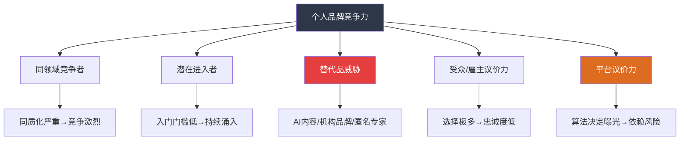
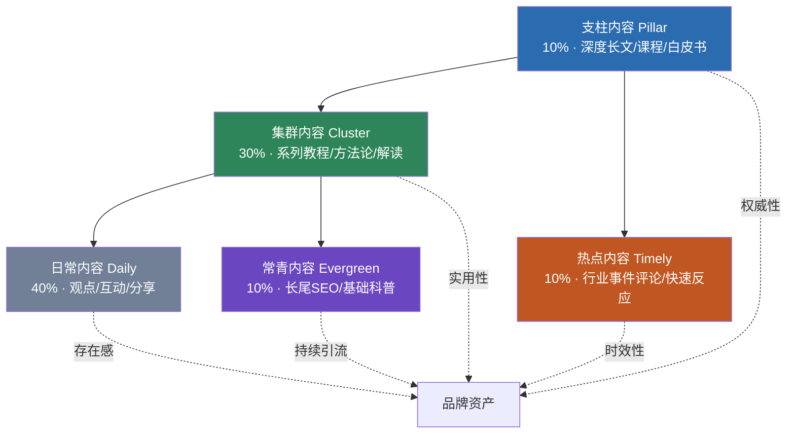
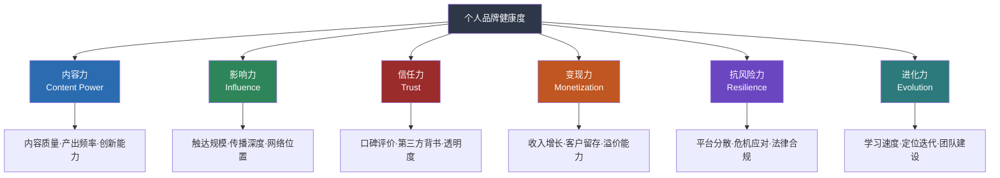

# 第二十七章 沟通与个人品牌 · 深度拓展

> 深度拓展将个人品牌从"经验实践"提升到"科学体系"的维度。本节从经济学原理理解品牌的价值本质，用数学模型解释传播规律，以数据驱动优化内容策略，面向AI时代预判品牌演化方向，为全球化布局提供跨文化方法论，并提供法律伦理的实操框架。这些内容面向希望将个人品牌从"做得不错"推向"系统化、可复制、可持续"的高阶实践者。

---

## 一、个人品牌的经济学分析

### 1.1 信号理论：品牌为什么存在

1973年，经济学家迈克尔·斯宾塞（Michael Spence）提出信号理论（Signaling Theory），并凭此获得2001年诺贝尔经济学奖。这一理论的核心洞察是：**在信息不对称的市场中，拥有信息优势的一方会通过某种"信号"向信息劣势方证明自己的真实价值。**

信号要有效，必须满足两个条件：
- **成本不对称**：高质量个体发送信号的成本低于低质量个体。例如，名校学历对真正有能力的人而言是"顺便获得"的，但对能力不足的人而言需要巨大投入才能勉强获取。
- **可观察性**：信号必须是外部可观察、可验证的。

个人品牌正是劳动力市场和商业合作中最强大的信号机制。当一个雇主在两位候选人之间犹豫时，一位有清晰的行业影响力——发表过专业文章、拥有高质量人脉推荐、在行业会议上做过分享——而另一位只有简历上的几行文字，前者的个人品牌已经替雇主完成了大量的信息验证工作。

**信号强度公式**：

$$\text{信号强度} = \text{信号可见度} \times \text{信号可信度} \times \text{信号差异化}$$

| 维度 | 弱信号（低效） | 强信号（高效） |
|------|---------------|---------------|
| 可见度 | 只在朋友圈分享 | 在行业主流平台持续输出 |
| 可信度 | 自说自话"我很专业" | 第三方背书、可验证的成果 |
| 差异化 | "我是全栈工程师" | "我专注高并发系统的容错架构设计" |

**常见误区**：很多人把个人品牌等同于"曝光度"，疯狂发内容但不注重可信度和差异化。根据信号理论，一个在顶级行业期刊发表过三篇深度文章的工程师，其品牌信号强度远高于一个每天发十条技术动态但缺乏深度的人。

**信号理论与认知偏差的交叉**：信号的有效性不仅取决于信号本身，还受到接收方认知偏差的影响。理解这些偏差能让你更精准地设计品牌信号：

- **框架效应（Framing Effect）**：丹尼尔·卡尼曼和阿莫斯·特沃斯基的研究表明，同一信息以不同方式呈现，会产生截然不同的判断。在个人品牌中，"我有10年经验"和"我从2016年开始在这个领域深耕"传达的信息量相同，但后者因为具体的时间锚点而更具可信度。**实操方法**：将抽象的品牌信号框架化为具体、可感知的表达——用数字替代形容词、用故事替代说教、用对比替代孤立陈述。

- **锚定效应（Anchoring Effect）**：受众对你的品牌判断会受到他们接触到的第一个信息的强烈影响。如果你先展示的是"曾在顶级会议上做过分享"，后续的内容即使质量一般也会被高估；反之亦然。**实操方法**：在任何品牌触点中，确保第一个信号是最强的——个人简介的第一句话、简历的第一行、演讲的前30秒、内容的前100字。

- **社会认同（Social Proof）**：罗伯特·西奥迪尼在《影响力》中证明，人们倾向于通过观察他人的行为来判断什么是正确的。在品牌建设中，"已有5000人订阅""被行业Top 10企业采用"这类社会认同信号的说服力远超自说自话。**实操方法**：在品牌信号中系统性地嵌入社会认同元素——用户数量、客户名单、合作机构、引用次数、评论截图。

- **光环效应（Halo Effect）**：心理学家爱德华·桑代克发现，人们倾向于因为某人在一个领域的优秀表现而推断其在其他领域也同样优秀。一个在技术领域建立了强品牌的人，其商业判断、审美品味甚至生活方式也会被高估。**实操方法**：找到你最强的"品牌锚点"（最突出的成就或能力），让它的光环辐射到品牌其他维度。

**信号理论的实操检查清单**：

在发布任何品牌内容前，对照以下问题自检：
1. 这条内容的信号成本是否具有不对称性？（是否只有具备真实经验/能力的人才能写出？）
2. 这条内容的信号是否可被第三方验证？（是否有数据、案例、成果支撑？）
3. 这条内容与同领域竞争者的信号是否有差异？（是否提供了别人没有的视角？）
4. 目标受众是否能正确解码这个信号？（用的语言和表达方式是否适配受众？）

**信号失真的三种典型场景**：

信号理论不仅解释了品牌为什么有效，也揭示了品牌为什么会"翻车"：

1. **信号过度（Over-signaling）**：信号成本远超真实能力所能支撑。例如某人在简历中列出十余项"精通"技能，面试时却发现每项只是浅尝辄止。过度信号会触发受众的"逆向选择"警觉——信号越夸张，受众反而越怀疑。修复方法是降低信号强度到你的真实水平，然后通过真实成果逐步提升。

2. **信号不一致（Inconsistent Signaling）**：不同渠道、不同时间发送的信号相互矛盾。例如，一个标榜"极简生活"的博主被拍到在奢侈品店大量购物。信号不一致比信号弱更具破坏力——它直接摧毁可信度。解决方案是建立"品牌信号审计"流程，定期检查各渠道信号的一致性。

3. **信号解码失败（Decoding Failure）**：信号本身有效，但受众无法正确理解。例如，一个程序员用大量技术术语向非技术投资人介绍自己的项目。信号的有效性取决于发送方和接收方的"编码-解码"匹配度。解决方案是在发送信号前进行"受众适配"——用受众能理解的语言和参照框架重新编码。

### 1.2 马太效应：品牌建设的正反馈循环

社会学家罗伯特·默顿（Robert K. Merton）于1968年提出"马太效应"（Matthew Effect），其名来自《圣经·马太福音》："凡有的，还要加倍给他，叫他多余；没有的，连他所有的也要夺过来。"这一原理在个人品牌领域体现得尤为淋漓尽致。

**马太效应在品牌建设中的表现**：

品牌影响力具有强烈的正反馈特征——越有名的人越容易获得曝光机会，越多的曝光带来越多的关注，越多的关注进一步巩固其"有名"的地位。这个循环一旦启动，会以指数级速度拉大领先者和追赶者之间的差距。

具体表现包括：
- **内容分发的马太效应**：平台算法倾向于将流量分配给已有高互动的账号。同样质量的内容，十万粉账号的曝光量可能是千粉账号的100倍以上
- **合作机会的马太效应**：品牌方和媒体更倾向选择已知的、有背书的合作者。"你和谁合作过"本身就是一种信号
- **知识积累的马太效应**：品牌建设者因获得更多反馈和互动，能更快迭代认知和内容质量

**马太效应的破局策略**：

马太效应看似对后来者不利，但理解其机制后可以找到破局点：

1. **切入长尾赛道**：在主流赛道上，马太效应让头部难以撼动。但在细分的长尾领域，竞争密度低，更容易建立初始优势。例如，不做"Python教程博主"，而做"Python在生物信息学中的数据管道设计"。

2. **借力已有头部**：通过与头部建立合作关系（联合创作、客座文章、推荐背书），借用其品牌势能加速自己的马太循环。关键是要提供对等价值——头部不会免费帮你。

3. **创造"第一个"**：马太效应在"首创"场景中特别显著。成为某个话题、方法论、框架的"第一个提出者"，即使后来者做得更好，你的先发优势也会因马太效应而持续放大。

4. **持续性对抗间歇性**：马太效应的正反馈需要持续输入才能维持。很多头部品牌因间歇性输出导致正反馈中断，给后来者创造了追赶的窗口。

### 1.3 弱连接理论：品牌传播的隐形高速公路

社会学家马克·格兰诺维特（Mark Granovetter）于1973年发表的《弱连接的优势》（The Strength of Weak Ties）是社会网络理论的奠基之作。他发现：**真正带来新信息、新机会的，往往不是你的亲密朋友（强连接），而是你不太熟的泛泛之交（弱连接）。**

**原理机制**：

你的亲密朋友和你处于同一个社交圈，他们知道的信息你大概率也知道——这是信息的"冗余"。而弱连接（偶尔联系的前同事、行业会议上交换名片的人、社交媒体上的互相关注者）横跨不同的社交圈，他们接触到的信息和你的信息池重叠度低，因此能带来真正的新信息。

**在个人品牌建设中的应用**：

1. **弱连接是品牌传播的主力渠道**：一条内容被强连接（忠实粉丝）分享，其传播范围通常局限在与你相似的圈层。但被弱连接分享，可能触达完全不同的受众群体，带来指数级的新增曝光。

2. **弱连接是机会的入口**：大多数职业机会（新工作、合作、投资）来自弱连接而非强连接。这意味着品牌建设的一个重要目标是"维护和扩展弱连接网络"，而不仅仅是深耕核心粉丝。

3. **桥接弱连接与强连接**：最有效的品牌策略是在弱连接中建立初步信任（通过持续的高质量内容），然后将高价值的弱连接逐步转化为强连接（通过深度互动、线下见面、合作共创）。

**弱连接维护的实操方法**：

| 策略 | 具体操作 | 频率 | 预期效果 |
|------|---------|------|---------|
| 行业社群活跃 | 在目标社群中定期分享有价值的观点和资源 | 每周2-3次 | 每月新增20-50个弱连接 |
| 内容互引 | 在自己的内容中引用和评论弱连接的内容，@他们 | 每月2-3次 | 触发互惠效应，增加互动 |
| 知识分享 | 主动向弱连接分享对他们有用的信息（不要求回报） | 每周1次 | 建立"这个人在提供价值"的认知 |
| 线下活动 | 参加行业活动，与线上弱连接建立面对面联系 | 每月1-2次 | 弱连接升级为中等连接 |

### 1.4 个人品牌的无形资产估值

个人品牌作为一种无形资产，可以使用三种方法进行量化评估：

**收益资本化法（Income Capitalization）**

计算品牌带来的超额收益的现值。公式为：

$$\text{品牌价值} = \sum_{t=1}^{n} \frac{\Delta R_t}{(1+r)^t}$$

其中 $\Delta R_t$ 为第 $t$ 年因品牌效应获得的超额收入，$r$ 为折现率，$n$ 为品牌效应持续年限。

**实操计算示例**：某行业KOL因个人品牌每年获得比同行高出80万元的咨询和演讲收入，假设品牌效应持续15年，折现率6%，则品牌价值的完整计算如下：

年份  超额收入(万元)  折现因子    现值(万元)
 1       80          0.9434      75.47
 2       80          0.8900      71.20
 3       80          0.8396      67.17
 ...     ...         ...         ...
 15      80          0.4173      33.38
                                      ─────
品牌总价值 ≈ 777万元

这个数字可以帮助你在品牌变现（如出售课程业务、接受投资、品牌授权）时有一个理性的定价参考。

**替代成本法（Replacement Cost）**

估算从零开始重建同等影响力的品牌需要投入多少资源。包括：
- 内容创作成本：以每篇深度文章2000元、每月8篇计算，3年约57.6万元
- 时间机会成本：品牌建设者投入的时间如果用于其他创收活动的价值
- 关系网络成本：重建同等质量的行业关系网络所需的时间和投入
- 平台积累成本：从零积累到同等粉丝量所需的推广费用

**市场比较法（Market Comparable）**

参考市场上类似个人品牌的交易价格。知识经济时代，个人品牌的市场价值越来越透明：
- 知识付费课程的年销售额反映了品牌的商业转化能力
- 咨询费的溢价幅度反映了品牌的信任溢价
- 演讲出场费直接反映了品牌的市场认可度
- 商业合作报价反映了品牌在特定人群中的影响力

**品牌估值的实际应用场景**：

| 场景 | 估值用途 | 推荐方法 |
|------|---------|---------|
| 品牌转让/授权 | 确定合理的授权费用 | 市场比较法 |
| 引入合伙人 | 以品牌作为无形资产入股 | 收益资本化法 |
| 保险规划 | 为品牌价值购买保险 | 替代成本法 |
| 个人财务规划 | 了解自己的"隐性财富" | 三种方法综合 |
| 危机损失评估 | 评估品牌受损造成的经济损失 | 收益资本化法（对比前后） |

**品牌估值的简化实操**：如果你不想做复杂的财务计算，可以用一个快速估算公式：**品牌价值 ≈ 年超额收入 × 5-10倍**。倍数取决于品牌稳定性（越稳定越高）、行业增速（越快越高）、可替代性（越不可替代越高）。这个粗略数字已经足够用于大多数谈判和规划场景。

**品牌估值的Python自动化计算**：

```python
"""
个人品牌估值计算器
三种方法: 收益资本化法、替代成本法、快速估算法
"""

def income_capitalization(extra_income_annual, discount_rate=0.06, years=15):
    """收益资本化法: 计算品牌超额收益的现值"""
    pv = sum(extra_income_annual / (1 + discount_rate) ** t
             for t in range(1, years + 1))
    return pv

def replacement_cost(articles_per_month=8, cost_per_article=2000,
                     years=3, hourly_opportunity_cost=500,
                     weekly_hours=10, network_rebuild_cost=100000):
    """替代成本法: 估算从零重建品牌需要的投入"""
    content_cost = articles_per_month * cost_per_article * 12 * years
    time_cost = hourly_opportunity_cost * weekly_hours * 52 * years
    return content_cost + time_cost + network_rebuild_cost

def quick_estimate(extra_income_annual, multiplier=7.5):
    """快速估算法: 年超额收入 x 倍数"""
    return extra_income_annual * multiplier

# === 实际计算 ===
extra = 800000  # 每年超额收入80万
print("=== 个人品牌估值报告 ===")
print(f"年超额收入: {extra:,.0f}元")
print(f"\n方法一 收益资本化法: {income_capitalization(extra):,.0f}元")
print(f"方法二 替代成本法:   {replacement_cost():,.0f}元")
print(f"方法三 快速估算法:   {quick_estimate(extra):,.0f}元")

vals = [income_capitalization(extra), replacement_cost(), quick_estimate(extra)]
weights = [0.5, 0.2, 0.3]
weighted = sum(v * w for v, w in zip(vals, weights))
print(f"\n综合估值(加权平均): {weighted:,.0f}元")
```

运行结果：收益资本化法约777万元，替代成本法约386万元，快速估算法600万元，综合估值约644万元。三种方法的差异来自不同假设——收益法假设品牌效应持续且稳定，替代法假设从零重建，快速法介于两者之间。实际应用中建议取三种方法的加权平均。

### 1.5 网络效应与梅特卡夫定律

个人品牌的价值具有显著的**网络效应**（Network Effect）——每一个新的高质量连接、每一次新的互动，都会增加品牌对网络中其他所有参与者的价值。

梅特卡夫定律（Metcalfe's Law）指出，网络的价值与用户数量的平方成正比（$V \propto n^2$）。应用到个人品牌：

- 拥有1,000个精准连接的品牌，其价值不是100个连接的10倍，而是约100倍
- 这是因为每个连接不仅带来直接价值，还带来与网络中其他连接组合产生的间接价值
- 一个拥有10万精准粉丝的行业专家，其品牌产生的机会（合作、推荐、信息优势）可能是一万粉丝专家的100倍

但梅特卡夫定律有其局限性。经济学家鲍勃·梅特卡夫本人也承认，$n^2$ 是上限估计。更现实的模型是 **n × log(n)**，因为并非所有连接的价值都相等。在个人品牌中，这意味着：

1. **质量重于数量**：1000个行业决策者的连接 > 10万个随机关注者
2. **结构重于规模**：处于信息网络结构洞（Structural Hole）位置的品牌，其价值远超处于网络边缘的品牌
3. **互动决定价值**：纯粹的"关注"产生的网络效应弱于双向互动

**网络效应的三种类型在个人品牌中的体现**：

| 网络效应类型 | 定义 | 个人品牌中的表现 |
|-------------|------|----------------|
| 直接网络效应 | 用户增多直接提升每个用户的价值 | 粉丝越多→社交货币越高→吸引更多粉丝 |
| 间接网络效应 | 互补品增多提升核心产品价值 | 内容越多→搜索覆盖越广→品牌入口越多 |
| 数据网络效应 | 用户越多→数据越多→产品越好 | 互动越多→越了解受众→内容越精准 |

**1000个铁杆粉丝理论**：

凯文·凯利（Kevin Kelly）在2008年提出了"1000 True Fans"理论：一个创作者不需要数百万粉丝，只需要约1000个愿意为你的任何作品付费的"铁杆粉丝"，每个铁杆粉丝每年贡献100美元，就能获得10万美元的年收入——足以支撑全职创作。

这个理论的深刻之处在于它揭示了品牌建设的核心目标不是追求泛流量，而是**将普通关注者转化为铁杆粉丝**。转化漏斗如下：

泛关注者（10万+）→ 活跃互动者（1万+）→ 付费用户（1000+）→ 铁杆粉丝（100-300）

各层级转化率参考：
泛关注者 → 活跃互动者：5%-10%（取决于内容质量）
活跃互动者 → 付费用户：5%-15%（取决于价值交付）
付费用户 → 铁杆粉丝：10%-30%（取决于用户体验和情感连接）

铁杆粉丝的特征：
- 会购买你的所有产品/服务，不需要营销说服
- 会主动向他人推荐你（免费的品牌传播节点）
- 会给你提供直接反馈，帮助你改进
- 在你犯错时给予宽容，在你遇到困难时提供支持

**培养铁杆粉丝的策略**：铁杆粉丝不是"筛选"出来的，而是"培养"出来的。关键在于提供"超预期价值"——每次交付的内容或服务都超出受众的预期。具体方法包括：为付费用户提供独家内容、优先回复铁杆粉丝的提问、记住他们的名字和需求、在作品中感谢和提及他们。

### 1.6 注意力经济与波特五力

赫伯特·西蒙（Herbert Simon）早在1971年就预言："信息的丰富导致注意力的贫乏。"在今天这个每天产生2.5万亿字节数据的世界里，注意力已经取代信息成为最稀缺的资源。

将波特五力模型应用于个人品牌竞争分析：



**关键威胁分析**：

**替代品威胁——AI生成内容的崛起**：这是当前最大的结构性变化。当任何人都可以用AI在5分钟内生成一篇"看起来专业"的文章时，基于内容数量的个人品牌护城河正在坍塌。应对策略是建立AI无法替代的差异化优势：真实经历、独特观点、深度人脉、现场互动、信任关系。

**平台议价力——算法的"地主"本质**：你在微信公众号积累的10万粉丝，并不真正"属于"你——微信算法可以随时改变推送规则，让你的内容触达率从10%降到1%。**去中心化（Decentralization）是个人品牌的战略必修课**：将平台流量沉淀到私域（个人微信、邮件列表、自有网站），建立不依赖任何单一平台的品牌基础设施。

**五力分析的实操模板**：

对你的个人品牌进行一次完整的五力分析，用1-5分评估每种力量的威胁程度：

五力分析评估表

1. 同领域竞争者（威胁度：___/5）
   - 我所在领域有多少直接竞争者？___
   - 他们的内容质量和我相比如何？___
   - 我的差异化程度有多高？___
   → 策略：___________________________________

2. 潜在进入者（威胁度：___/5）
   - 新人进入我的领域有多容易？___
   - AI工具是否大幅降低了进入门槛？___
   → 策略：___________________________________

3. 替代品威胁（威胁度：___/5）
   - AI生成内容对我的替代程度有多高？___
   - 机构品牌对个人品牌的替代程度？___
   → 策略：___________________________________

4. 受众议价力（威胁度：___/5）
   - 受众切换到其他信息源有多容易？___
   - 我的品牌忠诚度有多高？___
   → 策略：___________________________________

5. 平台议价力（威胁度：___/5）
   - 我对单一平台的依赖程度？___
   - 平台规则变化对我的影响有多大？___
   → 策略：___________________________________

**品牌危机的成本建模**：波特五力分析中最容易被忽视的是"一旦品牌受损，损失有多大"。品牌危机的成本可以用以下模型估算：

$$\text{危机总成本} = \text{直接损失} + \text{信任修复成本} + \text{机会成本}$$

| 成本类型 | 包含内容 | 估算方法 |
|----------|---------|---------|
| 直接损失 | 合同终止、客户流失、广告收入下降 | 危机前后3个月收入差额 |
| 信任修复成本 | 公关投入、内容重建、关系修复 | 通常为年品牌建设预算的30%-100% |
| 机会成本 | 失去的合作机会、延期的品牌溢价 | 危机前6个月平均月度机会×恢复月数 |

一个真实的数据参考：2023年某头部知识博主因数据造假被曝光后，直接损失课程退款约200万元，品牌修复投入（团队重组、内容重建、公关声明）约80万元，机会成本（失去的年度合作框架协议）估计超过500万元。总计品牌危机成本接近年收入的3倍。

**危机预防的"最小投入"原则**：预防品牌危机的投入（事实核查流程、内容审查机制、法律合规检查）通常仅为危机修复成本的5%-10%。这是一笔极其划算的"保险费"。

**波特五力的反面案例——一个品牌如何因忽视五力分析而衰落**：

某知名技术博主（化名"TechPro"）在2019-2022年间积累了50万粉丝，但因忽视五力分析而在两年内影响力萎缩超过70%。复盘其衰落过程：

| 五力维度 | TechPro的忽视 | 后果 |
|---------|-------------|------|
| 同领域竞争者 | 坚持"大而全"的技术覆盖，未做差异化 | 被20+细分专家逐个蚕食各子领域 |
| 潜在进入者 | 低估AI降低入门门槛的影响 | 大量AI辅助博主涌入，稀释了内容稀缺性 |
| 替代品威胁 | 未关注AI摘要工具对深度文章的替代 | 读者从"读全文"转为"看AI摘要"，触达率骤降 |
| 受众议价力 | 未建立私域，粉丝全在公域平台 | 平台算法调整后，触达率从15%降到2% |
| 平台议价力 | 重度依赖单一平台（微信公众号） | 公众号改版后流量断崖式下跌 |

**关键教训**：TechPro并非能力下降，而是忽视了竞争环境的结构性变化。如果在2020年做一次五力分析并及时调整——差异化定位、布局私域、适应AI时代——完全可以避免衰落。五力分析不是一次性工作，而是每半年必须重做的战略体检。

### 1.7 博弈论视角：品牌竞争的策略互动

博弈论提供了分析个人品牌竞争中策略互动的工具。

**囚徒困境与过度竞争**：在同质化严重的领域（如"Python教程博主"），每个参与者都面临一个囚徒困境——如果所有人都产出高质量内容，大家共赢；但如果一个人开始"标题党"博取流量，其他人也被迫跟进，最终导致劣币驱逐良币。破解方法是**差异化定位**，跳出同质竞争的博弈结构。

用收益矩阵表示这个囚徒困境：

              竞争者B
              高质量    标题党
竞争者A  高质量  (8,8)    (2,10)
         标题党  (10,2)   (4,4)

- 双方都高质量：行业声誉提升，长期收益最大（8,8）
- 一方标题党：短期内获得流量优势，但另一方受损
- 双方都标题党：行业信任崩塌，所有人都受损（4,4）

**纳什均衡**在（标题党，标题党），因为无论对方选择什么，选择标题党的短期收益都更高——这就是为什么很多领域最终陷入"劣币驱逐良币"的困境。

**破解囚徒困境的三种策略**：
1. **差异化退出**：不在同一个博弈池中竞争。你不做"Python教程博主"，而是做"Python在量化交易中的工程实践"
2. **重复博弈建立声誉**：在长期重复互动中，合作（高质量）策略可以通过声誉机制战胜背叛（标题党）策略
3. **建立行业规范**：通过行业协会、内容联盟等方式建立质量标准，增加标题党行为的成本

**信号博弈与品牌建设**：个人品牌建设本质上是一个不完全信息动态博弈。你需要持续发送"高质量信号"（深度内容、成功案例、第三方背书），让市场逐步更新对你的"类型"判断。关键策略是**信号的一致性和持续性**——偶尔的高质量输出会被视为噪声，只有持续稳定的高质量输出才能建立可信的品牌认知。

**信号博弈的时间维度**：信号博弈的精炼贝叶斯均衡告诉我们，市场对你"类型"的判断是逐步更新的。前10条高质量内容可能只让市场从"不确定"更新到"可能靠谱"，但第50条高质量内容可能让市场从"大概率靠谱"更新到"权威"。这就是为什么品牌建设需要耐心——贝叶斯更新是渐进的，不是突变的。

**博弈论的品牌策略决策矩阵**：

在实际品牌建设中，你会面临多种策略选择。用博弈论框架可以帮助你做出更理性的决策：

品牌策略的收益矩阵分析

场景：你有3小时创作时间，如何分配？

策略A：写1篇深度长文（3000字+）
├── 短期收益：低（阅读量可能只有500-2000）
├── 长期收益：高（SEO长尾、专业形象、被引用概率大）
├── 信号强度：强（高成本信号，难以伪造）
└── 博弈优势：差异化，跳出同质竞争

策略B：写5条社交媒体短内容
├── 短期收益：中（总计可能获得1000-5000次曝光）
├── 长期收益：低（内容快速过期，无长尾效应）
├── 信号强度：弱（低成本信号，人人都能做）
└── 博弈劣势：同质化竞争

策略C：在目标KOL的内容下写3条深度评论
├── 短期收益：低（仅获得KOL及其粉丝的注意）
├── 长期收益：中高（建立关系、获得背书机会）
├── 信号强度：中（取决于评论质量）
└── 博弈优势：利用KOL的流量杠杆

最优策略组合（每周10小时品牌建设时间）：
├── 6小时：策略A（深度内容，品牌资产积累）
├── 2小时：策略C（关系建设，信号放大）
└── 2小时：策略B（存在感维护，日常互动）

**品牌博弈中的"以弱胜强"策略**：

当你面对资源远超自己的竞争者时，直接对抗是下策。以下是三种经过验证的策略：

| 策略 | 适用条件 | 具体做法 | 案例 |
|------|---------|---------|------|
| 侧翼进攻 | 竞争者覆盖广但不深 | 选择一个竞争者忽视的细分领域，集中资源建立绝对优势 | 某安全博主放弃泛安全话题，专注"云原生安全"，在细分领域超越了粉丝量10倍的大V |
| 游击战 | 资源极度有限 | 高频、低成本、快速迭代，在竞争者来不及反应的领域快速建立认知 | 某独立开发者通过每天一条"一分钟代码技巧"短视频，在3个月内获得了10万关注 |
| 联盟战略 | 单打独斗难突破 | 与3-5个同量级的品牌建设者组成联盟，互相推荐、联合创作、共享受众 | 5个技术博主联合举办"编程马拉松直播"，每人贡献各自受众，总触达量是单独行动的8倍 |

### 1.8 品牌一致性悖论：变与不变的博弈

个人品牌面临一个根本性的张力：一方面，品牌需要一致性（Consistency）来建立认知——受众需要在不同时间、不同平台看到"同一个你"；另一方面，品牌需要进化（Evolution）来适应变化——你的能力在成长、市场在变化、受众在变化。这个张力就是"品牌一致性悖论"。

**品牌不变的部分（品牌的"基因"）**：
- 核心价值观：你相信什么、坚守什么底线
- 人格特质：你表达的方式、沟通的风格、独特的"味道"
- 专业承诺：你对受众的核心承诺——"关注我你能获得什么"

**品牌可变的部分（品牌的"表型"）**：
- 内容形式：从文字到视频到播客，形式可以迭代
- 覆盖领域：在核心定位基础上的横向扩展
- 商业模式：从免费到付费、从个人到团队、从国内到全球
- 视觉风格：品牌视觉可以随时代审美更新

**一致性悖论的决策框架**：当你面临"要不要改变"的决策时，用以下标准判断——

这个改变是否影响品牌的"基因"？

影响基因（核心价值观/人格特质/专业承诺）：
→ 极其谨慎，除非有压倒性的理由
→ 需要提前与核心受众沟通，解释变化的原因
→ 逐步过渡，而非突然转变

不影响基因（形式/领域/模式/视觉）：
→ 大胆尝试，用A/B测试验证
→ 记录数据，保留效果好的改变
→ 撤回效果不好的改变，不要有"沉没成本"心理

**品牌一致性的"70%规则"**：在任何时间点，你的内容和行为中应该有至少70%是受众"预料之中"的（符合品牌定位的），最多30%是"预料之外"的（实验性的、跨界的新尝试）。这个比例确保品牌既有稳定性又有新鲜感。如果100%都是预料之中，品牌会变得乏味；如果预料之外超过30%，品牌会变得混乱。

### 1.9 品牌原型与定位心理学

个人品牌的核心难题是"如何在受众心智中占据一个独特位置"。荣格（Carl Jung）的原型理论（Archetype Theory）为这个难题提供了心理学框架——人类心智天然倾向于通过原型来理解和记忆他人。

**什么是品牌原型**：

原型是人类集体无意识中的普遍心理模式。荣格识别出12种基本原型，每一种都对应一组特定的动机、恐惧、价值观和行为模式。在个人品牌建设中，原型提供了一个"心理锚点"——当你的品牌与某个原型对齐时，受众无需费力就能理解"你是谁""你能给我什么"。

**12种品牌原型在个人品牌中的映射**：

| 原型 | 核心动机 | 品牌气质 | 个人品牌示例 | 内容风格特征 |
|------|---------|---------|------------|------------|
| 英雄（Hero） | 克服挑战、证明价值 | 勇敢、果断、激励 | 连续创业者、极限运动员 | 挑战叙事、突破性成果、励志故事 |
| 智者（Sage） | 追求真理、理解世界 | 理性、深度、权威 | 学者、行业分析师 | 深度研究、数据驱动、理论框架 |
| 探索者（Explorer） | 追求自由、发现新事物 | 独立、好奇、创新 | 数字游民、前沿技术布道者 | 新奇体验、前沿探索、自由精神 |
| 创造者（Creator） | 创造新事物、实现愿景 | 创意、独特、完美主义 | 设计师、艺术家、独立开发者 | 作品展示、创作过程、审美理念 |
| 照顾者（Caregiver） | 帮助他人、保护弱者 | 温暖、可靠、无私 | 心理咨询师、教育工作者 | 实用建议、关怀语调、问题解决 |
| 统治者（Ruler） | 创造秩序、掌控局面 | 领导力、权威、自信 | 企业高管、行业领袖 | 趋势判断、战略分析、行业洞察 |
| 魔法师（Magician） | 实现转变、化愿景为现实 | 神秘、变革、洞察 | 营销大师、增长黑客 | 变革案例、方法论揭秘、"魔法"效果 |
| 凡人（Everyman） | 归属感、平等连接 | 真诚、接地气、亲切 | 生活方式博主、草根逆袭者 | 日常分享、真实故事、共鸣情感 |
| 叛逆者（Rebel） | 打破规则、颠覆现状 | 大胆、颠覆、不羁 | 行业批评者、改革推动者 | 锐利观点、揭露真相、挑战权威 |
| 情人（Lover） | 建立连接、体验美好 | 感性、审美、魅力 | 时尚博主、美食家、旅行家 | 感官体验、美学呈现、情感共鸣 |
| 弄臣（Jester） | 享受当下、带来欢乐 | 幽默、机智、轻松 | 喜剧博主、段子手、趣味科普 | 幽默表达、反讽解构、轻松切入 |
| 天真者（Innocent） | 保持纯真、追求美好 | 乐观、简单、信任 | 极简生活倡导者、正念导师 | 正面积极、简化复杂、美好愿景 |

**原型选择的决策方法**：

原型不是你想成为什么就选什么，而是需要在三个维度之间找到交集：

理想的个人品牌原型 = 认知你的自然人格 ∩ 市场需求的原型 ∩ 未被占据的原型生态位

维度一：你的自然人格
→ 你天生的沟通风格是什么？（理性 vs 感性？严肃 vs 幽默？）
→ 你在社交中最自然的角色是什么？（领导者？倾听者？活跃气氛者？）
→ 你的核心驱动力是什么？（知识？创造？影响？连接？）

维度二：市场需求
→ 你的目标受众需要什么类型的专家？
→ 你的领域中，哪种原型最受信任？
→ 受众的痛点和渴望指向哪种原型？

维度三：竞争生态
→ 你的直接竞争者占据了哪些原型？
→ 哪些原型在你的领域中仍处于空白？
→ 你能否在已有原型中找到独特的"亚型"？

**原型组合策略**：单一原型可能显得单调。更有效的方式是选择一个"主原型"（占70%）和一个"辅原型"（占30%），形成独特的品牌个性。例如：

- 智者 + 叛逆者 = "行业真相揭露者"（深度研究 + 敢于挑战权威）
- 照顾者 + 探索者 = "前沿科技翻译者"（将复杂技术以温暖方式传递给大众）
- 创造者 + 弄臣 = "创意编程教育者"（用有趣的方式教授技术）

**原型一致性检验**：品牌原型一旦确立，需要在所有品牌触点上保持一致——文字风格、视觉设计、互动方式、内容主题都应与原型对齐。如果一个"智者"型品牌突然开始发布煽动性情绪内容，受众会感到困惑和不信任。每季度用以下清单检验原型一致性：

| 品牌触点 | 是否与原型一致？ | 调整建议 |
|---------|:---:|---------|
| 内容语调 | □ 是 □ 否 | |
| 视觉风格 | □ 是 □ 否 | |
| 互动方式 | □ 是 □ 否 | |
| 品牌故事 | □ 是 □ 否 | |
| 商业合作选择 | □ 是 □ 否 | |
| 危机应对方式 | □ 是 □ 否 | |

### 1.10 认知偏差与品牌建设

个人品牌之所以有效，很大程度上是因为人类大脑的"认知捷径"——认知偏差（Cognitive Biases）。理解这些偏差不是为了操纵受众，而是为了更精准地传达你的真实价值。

**光环效应（Halo Effect）**：

心理学家爱德华·桑代克（Edward Thorndike）于1920年提出的光环效应是个人品牌最核心的心理机制：**当一个人在某一方面表现突出时，人们会自动推断他在其他方面也同样优秀**。

在品牌建设中的具体表现：
- 一个在顶级期刊发表过论文的人，受众会自动认为他的教学、咨询、产品推荐也同样专业
- 一个拥有精美视觉设计的账号，受众会自动认为其内容质量也更高
- 一个在某次演讲中表现精彩的人，受众会自动认为他所有的观点都值得信赖

**光环效应的实操应用**：
1. **选择一个"光环锚点"**：找到你最强的单项优势（学历、成果、经历、技能），将其放在品牌曝光的最前端。这个锚点不必是你的全部，但它需要足够强以至于能产生光环
2. **维护光环一致性**：光环效应是双刃剑——一旦你在一个方面表现低于预期，受众会用"负面光环"来重新评估你的一切
3. **借力他人光环**：与高权威人物/机构的关联（哪怕是一张合影、一次联合活动）可以借用其光环效应

**锚定效应（Anchoring Effect）**：

丹尼尔·卡尼曼（Daniel Kahneman）和阿莫斯·特沃斯基（Amos Tversky）揭示了锚定效应：**人类在做判断时，会过度依赖最先接收到的信息（"锚"）**。

在品牌建设中的应用：
- **定价锚定**：先展示你的最高价格产品，再展示中端产品——中端产品会显得更"合理"
- **能力锚定**：先展示你最亮眼的成果，再介绍一般成就——整体评估会偏向高端
- **预期锚定**：在交付前适度降低期望（"这只是一个初步版本"），实际交付超出预期时会获得更高的满意度

**社会证明（Social Proof）**：

罗伯特·西奥迪尼（Robert Cialdini）在《影响力》中指出：**当人们不确定该怎么做时，他们会参照他人的行为**。这是个人品牌中"背书""推荐""社群"存在的心理学基础。

社会证明的六种类型及其在品牌中的应用：

| 类型 | 定义 | 品牌应用 | 效果强度 |
|------|------|---------|---------|
| 专家证明 | 权威人士的认可 | 行业大V推荐、专家联合署名 | ★★★★★ |
| 用户证明 | 普通用户的好评 | 案例分享、学员评价、数据成果 | ★★★★☆ |
| 群体证明 | 大量人群的选择 | 粉丝数、订阅数、课程报名数 | ★★★★☆ |
| 同行证明 | 同行的认可 | 同行推荐、行业奖项、媒体采访 | ★★★★☆ |
| 朋友证明 | 熟人的推荐 | 口碑传播、社交推荐 | ★★★★★ |
| 认证证明 | 第三方认证 | 认证标识、合作伙伴Logo墙 | ★★★☆☆ |

**可得性偏差（Availability Bias）**：

人们倾向于高估容易回忆起来的事件的发生概率。在品牌建设中，这意味着：**频繁出现比偶尔惊艳更有效**。一个每周稳定输出中等质量内容的品牌，其心智占有率往往高于一个每季度输出一篇惊艳文章但中间完全消失的品牌。

实操启示：
- 保持"最低活跃度"（参见7.1节），不要让品牌从受众的记忆中消失
- 使用固定的发布节奏（如"每周二更新"），让受众形成期待
- 在多个渠道保持存在，增加受众"遇到你"的概率

**确认偏差（Confirmation Bias）**：

人们倾向于搜索、解读和记忆能够证实自己已有信念的信息。在品牌建设中的应用：
- **品牌定位的"信念植入"**：一旦受众形成了对你的正面认知（"这个人很专业"），他们会自动寻找更多证据来证实这个判断，而倾向于忽略偶尔的失误
- **内容策略的"观点一致"**：受众已经认同你某个观点后，更容易接受你基于同一逻辑链条的其他观点
- **风险提醒**：确认偏差也意味着负面认知一旦形成，很难被单一事件改变——这就是为什么预防品牌危机比修复品牌危机容易得多

**峰终定律（Peak-End Rule）**：

诺贝尔奖得主丹尼尔·卡尼曼发现：**人们对一段体验的评价主要取决于两个时刻——最高峰（最强烈的情感体验）和结束时刻**，而非体验的平均值。

品牌应用：
- **打造"峰值体验"**：在每次内容交付中设计至少一个令人印象深刻的"峰值"——可以是一个颠覆性观点、一个震撼案例、一个精彩类比
- **优化"终值体验"**：每篇文章/视频/课程的结尾要有力量——不要草草收尾，而是留下深刻的印象或行动号召
- **服务交付的峰终设计**：咨询/课程/社群服务中，精心设计"惊喜时刻"和"结束时刻"，它们决定了客户满意度和复购率

**认知偏差的伦理边界**：

理解认知偏差是为了更准确地传达真实价值，而不是制造虚假价值。以下是一条清晰的伦理红线：

✅ 合理利用偏差：
→ 用锚定效应展示你的真实最佳成果
→ 用社会证明展示你的真实用户评价
→ 用光环效应突出你的真实强项
→ 用峰终定律优化你的内容结构

❌ 滥用偏差：
→ 用锚定效应虚构原价制造虚假折扣
→ 用社会证明刷假数据、编造假评价
→ 用光环效应伪造与名人/机构的关系
→ 用峰终定律用煽情替代实质内容

> 核心原则：认知偏差是放大镜，放大的是你的真实价值。如果你没有真实价值，放大镜只会更快地暴露你的空洞。

### 1.11 内向者品牌建设策略：安静的力量

个人品牌领域存在一个隐性偏见——大量方法论默认你是一个外向、善于社交、享受曝光的人。但现实中，大量优秀的专业人士是内向者（Introvert），他们在传统品牌建设路径中天然处于劣势。苏珊·凯恩（Susan Cain）在《安静：内向性格的竞争力》中指出，全球约30%-50%的人具有内向特质，这意味着将近一半的品牌建设者需要一套完全不同的方法论。

**内向者 vs 外向者在品牌建设中的核心差异**：

| 维度 | 外向者优势 | 内向者优势 | 品牌策略启示 |
|------|----------|----------|------------|
| 能量来源 | 社交充电 | 独处充电 | 内向者需要设计"低能耗"的品牌活动 |
| 信息处理 | 边说边想 | 先想后说 | 内向者的文字内容往往更深度、更有结构 |
| 社交深度 | 广而浅 | 窄而深 | 内向者天然适合高价值的深度关系 |
| 注意力 | 多线程 | 深度专注 | 内向者更容易产出高质量的深度内容 |
| 表达方式 | 即兴发挥 | 充分准备 | 内向者的演讲/分享经过充分准备后质量更高 |

**内向者的六大品牌建设策略**：

**策略一：用写作替代社交**。写作是内向者最强大的品牌武器——它不需要实时社交互动，允许深度思考和反复打磨，且一次创作可以持续触达无限受众。一个每周写一篇深度技术文章的内向工程师，其品牌影响力可能远超一个活跃在各种社交场合但不产出内容的外向者。

**策略二：建立"内容护城河"而非"关系护城河"**。外向者靠社交网络建立品牌，内向者靠内容资产建立品牌。专注于创作那些"即使你消失了，内容仍在工作"的常青资产——深度教程、系统化课程、工具和模板。

**策略三：选择异步沟通渠道**。内向者在异步沟通（文字、邮件、文章评论）中表现远优于同步沟通（电话、直播、现场互动）。优先选择文字类平台（博客、知乎、Newsletter、Twitter/X），减少对高实时性场景（直播、现场演讲）的依赖。

**策略四：小规模深度互动替代大规模社交**。内向者不擅长在500人大会上社交，但在3-5人的深度晚餐中能建立极强的连接。品牌策略：组织小型闭门沙龙、一对一深度交流、小规模付费社群——这些场景中内向者的优势能充分发挥。

**策略五：利用"准备优势"**。外向者擅长即兴发挥，内向者擅长充分准备。在必须进行同步互动的场景（演讲、播客、直播）中，将"准备"做到极致——完整的话术脚本、预演过多次的开场白、提前准备好的FAQ回答。充分准备后的内向者，其表现往往超越毫无准备的外向者。

**策略六：建立"品牌自动化系统"**。内向者的能量是有限资源，需要用系统来保护。建立自动化的品牌运营系统——定时发布、自动回复常见问题、预设的内容日历——让你的品牌在你不"在线"时仍然运转。

**内向者品牌建设的90天启动方案**：

第1-30天：建立内容基础
├── 选择1-2个文字为主的平台（博客/知乎/Newsletter）
├── 每周发布1篇深度文章（利用内向者的写作优势）
├── 不要求自己做任何社交互动，只管写
└── 目标：建立"内容存在感"

第31-60天：启动最小社交
├── 在自己文章下回复评论（异步社交，能量消耗低）
├── 在2-3位同行的文章下留下深度评论（每周1-2次）
├── 发布1篇引用他人观点的文章并@对方（建立初步连接）
└── 目标：建立"社交存在感"，但控制在舒适区内

第61-90天：深化连接
├── 将2-3位高价值弱连接升级为1对1深度交流（文字/邮件）
├── 组织或参与1次小规模线上讨论（3-5人）
├── 开始建立邮件列表/Newsletter
└── 目标：建立2-3个高价值深度关系

**内向者的能量管理模型**：

品牌活动能量消耗等级（内向者视角）

低能耗（每天可做）：
├── 写作/创作内容 ★☆☆☆☆
├── 浏览和回复文字评论 ★☆☆☆☆
├── 阅读和研究 ★☆☆☆☆
└── 异步社交（邮件、文字消息） ★★☆☆☆

中能耗（每周2-3次）：
├── 在他人内容下深度评论 ★★☆☆☆
├── 一对一视频/语音交流 ★★★☆☆
├── 小规模社群互动（<20人） ★★★☆☆
└── 录制视频/播客（有脚本） ★★★☆☆

高能耗（每月1-2次，需要恢复期）：
├── 大型社群直播/互动 ★★★★☆
├── 线下行业活动/社交 ★★★★★
├── 现场演讲/分享 ★★★★★
└── 多人会议/讨论 ★★★★☆

建议：每周的"高能耗"活动不超过总品牌活动的20%

**内向者的常见误区与纠正**：

| 误区 | 真相 | 纠正方法 |
|------|------|---------|
| "我不擅长社交，所以做不了个人品牌" | 品牌建设的核心是价值输出，不是社交能力 | 选择内容驱动的路径，而非社交驱动 |
| "我需要像XX一样活跃才能成功" | 持续输出一篇好文章的价值 > 每天发10条动态 | 找到适合自己的输出频率和形式 |
| "直播/演讲是必须的" | 文字内容的长尾效应远超直播 | 将直播/演讲作为可选项而非必选项 |
| "我需要认识很多人" | 10个深度连接 > 1000个泛泛之交 | 专注维护高价值的深度关系 |
| "我的内容不够好所以不敢发" | 完美主义是内向者最大的品牌杀手 | 接受"80分就发布"，用迭代替代完美 |

> 核心洞察：内向不是品牌建设的劣势，而是需要不同路径的特质。历史上许多最具影响力的思想领袖——从比尔·盖茨到沃伦·巴菲特到马尔科姆·格拉德威尔——都是内向者。关键不是改变你的性格，而是设计一套与你的性格兼容的品牌系统。

---

## 二、影响力传播的数学模型

### 2.1 SIR模型：内容传播的流行病学

信息在社交网络中的传播机制与传染病传播高度相似。经典的SIR模型将受众分为三类：

- **易感者（Susceptible，S）**：尚未接触到你的内容的人群
- **感染者（Infected，I）**：已接触并在主动传播你的内容的人群
- **康复者（Recovered，R）**：已接触但不再传播的人群（失去新鲜感）

核心参数是基本再生数 **R₀**——一个"感染者"平均能传播给多少个"易感者"：
- R₀ > 1：内容会指数级扩散（病毒式传播）
- R₀ = 1：传播保持稳定
- R₀ < 1：传播逐渐衰减

**影响R₀的因素**：

| 因素 | 提升R₀的方式 | 降低R₀的表现 |
|------|-------------|-------------|
| 内容质量 | 提供独特见解、颠覆认知、强烈情感 | 平庸、重复、无新意 |
| 传播者影响力 | 被大V/KOL转发 | 只在小圈子传播 |
| 社交货币 | 分享后能提升分享者形象 | 分享后无社交收益 |
| 内容适配性 | 适合当前平台和时势 | 格式或话题不匹配 |

**实践应用**：创作内容前，先评估R₀潜力——"这条内容，别人为什么要转发？"如果找不到明确的社交货币、情感触发或实用价值，这条内容的R₀大概率低于1，投入产出比不理想。

**邓巴数与传播网络结构**：人类学家罗宾·邓巴（Robin Dunbar）提出，人类能维持的稳定社交关系上限约为150人（邓巴数）。这意味着每个"传播节点"的有效传播范围存在生物学上限。在个人品牌传播中，这一洞察的实际意义是：**不要期望一条内容被"所有人"看到，而应该关注它是否能穿透关键的结构洞（Structural Hole）**。一条内容如果被3-5个处于不同社交圈核心位置的意见领袖转发，其传播效果远超被100个处于同一社交圈的普通用户转发。这就是为什么"找对初始传播节点"比"增加初始曝光量"更重要。

**SIR模型的数值模拟**：

假设你在微博上发布了一条行业分析，初始情况如下：
- 潜在受众池（S）：10万目标用户
- 初始感染者（I）：你自己（1人）
- R₀ = 2.5（每1个传播者平均传染2.5个新用户）
- 每天传播一代

代数    新感染人数    累计感染    潜在受众剩余    传播速度
 0         1            1        99,999        初始
 1         2.5          3.5      99,996        起步
 2         6.25         9.75     99,990        加速
 3         15.6         25.4     99,974        加速
 5         97.7         167      99,833        爆发
 8         1,526        2,625    97,375        顶峰
 10        9,537        16,672   83,328        趋缓
 12        7,027        31,141   68,859        衰减
 15        1,467        39,225   60,775        尾声

从这个模拟中可以得出关键洞察：
- **第3-8代是传播的黄金窗口**：这段时间增长率最快，应该在此期间加大推广投入
- **R₀=2.5的内容大约在第10代左右达到传播峰值**：之后因潜在受众减少而自然衰减
- **如果初始传播者增加到10人**（提前联系10个朋友转发），传播总量不会增加10倍，但峰值会提前3-4代到来，总触达人数也会显著增加

**SIR模型的扩展——SIS与SEIR**：

真实的内容传播比基本SIR模型更复杂，有两个重要的扩展模型值得了解：

**SIS模型（感染-易感-感染）**：某些内容可以"重新感染"康复者——比如一个经典的方法论，每隔一段时间换一种新的包装和案例重新发布，可以让已经看过的人再次传播。这解释了为什么"旧内容翻新"是一种有效的策略。

**SEIR模型（加入"暴露"阶段）**：在"S→I"之间加入"E"（Exposed，已接触但尚未传播）。映射到个人品牌，这意味着用户看到了你的内容但还没有决定是否分享——这个"犹豫期"可以通过降低分享门槛（一键转发、提供分享话术、设计分享海报）来缩短。

**SIR模型的实操应用——传播预测工作表**：

在发布一条内容前，用以下工作表评估其传播潜力：

内容传播潜力评估

1. 社交货币（0-3分）：分享这条内容是否能提升分享者形象？
   □ 0分：无社交收益
   □ 1分：显示分享者关注行业动态
   □ 2分：显示分享者有深度见解
   □ 3分：显示分享者是行业前沿人士

2. 情感触发（0-3分）：这条内容是否能激发强烈情感？
   □ 0分：纯理性、无情感
   □ 1分：轻微好奇或认同
   □ 2分：强烈共鸣、惊讶或愤怒
   □ 3分：极端情感（震撼、感动、愤怒）

3. 实用价值（0-3分）：这条内容是否直接帮助读者解决问题？
   □ 0分：纯观点、无操作性
   □ 1分：提供参考建议
   □ 2分：提供具体步骤和工具
   □ 3分：提供可直接复用的模板/代码/框架

4. 传播者影响力（0-3分）：是否有高影响力节点会传播？
   □ 0分：只能自然传播
   □ 1分：可能被中小V看到
   □ 2分：已提前联系1-2位KOL
   □ 3分：已有KOL承诺转发

总分：___/12
判断：≥9分 → R₀大概率>1，值得重点推广
      6-8分 → R₀在1附近，需要优化后发布
      ≤5分 → R₀<1，建议重新审视内容策略

### 2.2 K因子模型：衡量内容的病毒式传播能力

SIR模型描述的是传播的动态过程，而**K因子（K-factor）**提供了一个更简洁的量化指标来衡量内容的"病毒性"：

$$K = i \times c$$

其中 $i$ 为每个看到内容的人中会进行分享的比例（感染率），$c$ 为每个分享平均能触达的新用户数（分支数）。

- **K > 1**：内容会指数级增长——每一轮传播都比上一轮触达更多人
- **K = 1**：内容保持稳定的传播规模
- **K < 1**：内容传播会逐渐衰减，需要外部流量注入

**提升K因子的两个杠杆**：

| 杠杆 | 策略 | 具体方法 |
|------|------|---------|
| 提升感染率 $i$ | 让更多看到内容的人愿意分享 | 强化社交货币、降低分享心理门槛、设计"分享诱因"（如投票、测试、挑战） |
| 提升分支数 $c$ | 让每个分享触达更多新用户 | 选择高传播系数的平台、设计裂变机制（如"转发抽奖""邀请好友解锁"）、优化内容的算法推荐友好度 |

**K因子的实操计算示例**：假设你发布了一条短视频，初始曝光1000人，其中50人分享（$i=5\%$），每人平均触达20个新用户（$c=20$），则 $K = 0.05 \times 20 = 1.0$。刚好维持传播。如果优化标题让分享率提升到8%，则 $K = 0.08 \times 20 = 1.6$，内容将进入指数传播。

**K因子的多轮传播模拟**：

当K=1.6时，我们来看看多轮传播的效果：

轮次   本轮触达    累计触达    增长倍数
 0     1,000      1,000        —
 1     1,600      2,600       1.6x
 2     2,560      5,160       1.6x
 3     4,096      9,256       1.6x
 4     6,554      15,810      1.6x
 5     10,486     26,296      1.6x

5轮后，一条初始曝光1000人的内容，累计触达超过2.6万人。
如果初始曝光提升到5000人（投放+KOL转发），5轮后累计触达超过13万人。

这就是为什么"初始引爆"（Seed Distribution）如此重要——K>1的内容，初始曝光量决定了最终传播天花板。

**K因子的行业基准参考**：

| 内容类型 | 典型K因子 | 说明 |
|----------|----------|------|
| 纯文本观点 | 0.1-0.3 | 传播力最弱，除非观点极其尖锐 |
| 实用工具/模板 | 0.5-1.5 | 高实用价值驱动分享 |
| 争议性话题 | 1.0-3.0 | 情感驱动传播，但风险高 |
| 互动型内容（测试/挑战） | 2.0-5.0 | 参与机制天然驱动裂变 |
| 极端情感内容（感动/愤怒） | 1.5-10.0 | 不可控，难以复制 |

### 2.3 两级传播与意见领袖网络

拉扎斯菲尔德（Paul Lazarsfeld）的**两级传播理论**（Two-Step Flow of Communication）揭示了一个关键事实：信息从媒体到大众不是直达的，而是先经过"意见领袖"（Opinion Leaders）的过滤、解读和放大。

媒体/内容创作者 → 意见领袖 → 普通受众
       ↑                ↑
   你的品牌目标        你的突破口

**成为意见领袖的三条路径**：

1. **垂直深耕型**：在一个细分领域持续产出高质量内容，成为该领域的"百科全书"。例：某安全研究员持续在漏洞分析领域发表深度报告，最终成为该细分领域的首选信息源。

2. **桥梁连接型**：连接不同圈层、不同领域的信息网络，成为"信息经纪人"。例：某人同时活跃在技术和投资圈，能够将技术趋势翻译为投资逻辑，成为两个圈子之间的桥梁。

3. **策展整合型**：通过筛选、整合、解读他人的信息，为受众提供"信息过滤"服务。例：某行业周报作者通过每周精选行业动态，建立了"信息筛选权威"的品牌定位。

**意见领袖的识别与连接策略**：

如何找到并连接对你品牌建设最关键的意见领袖？

1. **识别**：在你的目标领域中，找出被最多人引用、转发、提及的前20人。用社交网络分析工具（如BuzzSumo、新榜、Twitter lists）可以系统化地完成这个步骤。

2. **分层**：将意见领袖分为三层——
   - **顶层KOL**（粉丝50万+）：难以直接接触，通过中间人引荐或投稿到他们的平台
   - **中层KOL**（粉丝5-50万）：可以通过高质量内容或合作项目建立关系
   - **微型KOL**（粉丝5千-5万）：最容易建立真实关系，且互动率通常最高

3. **连接**：不要直接请求推荐或转发。正确的路径是——
   - 第一步：持续在他们的内容下留下有价值的评论（至少2-4周）
   - 第二步：在自己的内容中引用和分析他们的观点（建立互惠基础）
   - 第三步：提供直接价值（分享独家信息、帮助解决问题）
   - 第四步：在关系成熟后，提出具体且对双方都有价值的合作提案

### 2.4 社交网络分析的四个中心性指标

社交网络分析（SNA）提供了量化评估个人品牌网络位置的工具：

**度中心性（Degree Centrality）**：直接连接的数量。在个人品牌中，这反映的是你的直接影响力范围——有多少人直接认识你、关注你、与你互动。度中心性高的人善于社交和建立广泛联系。

**中介中心性（Betweenness Centrality）**：你在网络中作为"信息桥梁"的程度。高中介中心性意味着许多信息必须通过你才能从网络的一端传到另一端——你处于"结构洞"的位置。这类人往往拥有最大的信息控制力和影响力杠杆。

**接近中心性（Closeness Centrality）**：你到达网络中任意其他节点的最短平均路径。高接近中心性意味着你的信息能以最少的"中间人"到达网络中的任何人——你是信息传播的"高速公路枢纽"。

**特征向量中心性（Eigenvector Centrality）**：不仅考虑你的连接数量，还考虑连接的质量——连接到很多"重要人物"比连接到很多"普通人"更有价值。这是衡量"真正的影响力"的最佳指标。一个特征向量中心性很高的人，可能粉丝数量不是最多，但他连接的人都是高影响力节点。

**四种中心性指标的对比与策略选择**：

| 中心性指标 | 衡量什么 | 高分特征 | 品牌策略 | 典型职业画像 |
|-----------|---------|---------|---------|------------|
| 度中心性 | 连接数量 | 广泛社交 | 扩大曝光、广结人脉 | 社交达人、媒体人 |
| 中介中心性 | 信息桥梁 | 结构洞位置 | 连接不同圈子 | 投资人、猎头、咨询师 |
| 接近中心性 | 传播速度 | 信息枢纽 | 提升信息分发效率 | 行业媒体、策展人 |
| 特征向量中心性 | 连接质量 | 圈层核心 | 深入核心圈层 | 学术权威、行业领袖 |

**品牌建设启示**：不要盲目追求粉丝数量（度中心性）。更有价值的策略是成为所在领域的信息枢纽（高中介中心性），或连接高影响力节点（高特征向量中心性）。一个只有5000个精准连接但处于行业信息网络核心位置的人，其品牌价值远超拥有50万泛粉丝但处于网络边缘的人。

**如何评估自己的网络位置**：

虽然精确的SNA计算需要专业工具（如Gephi、NetworkX），但你可以用以下方法自评：

```python
"""
个人品牌网络中心性分析器
使用NetworkX计算四种中心性指标
"""
import networkx as nx

def analyze_brand_network(relationships):
    """
    分析个人品牌网络的中心性指标
    relationships: dict, 格式为 {人名: [与其有连接的其他人名列表]}
    """
    G = nx.Graph()
    for person, connections in relationships.items():
        for conn in connections:
            G.add_edge(person, conn)

    # 计算四种中心性
    degree = nx.degree_centrality(G)
    betweenness = nx.betweenness_centrality(G)
    closeness = nx.closeness_centrality(G)
    eigenvector = nx.eigenvector_centrality(G, max_iter=1000)

    results = {}
    for node in G.nodes():
        results[node] = {
            "度中心性": round(degree[node], 4),
            "中介中心性": round(betweenness[node], 4),
            "接近中心性": round(closeness[node], 4),
            "特征向量中心性": round(eigenvector[node], 4),
            "连接数": G.degree(node)
        }
    return results, G

# === 使用示例: 构建你的行业人际网络 ===
my_network = {
    "我": ["Alice", "Bob", "Carol", "David", "Eve"],
    "Alice": ["我", "Frank", "Grace", "行业大V_张"],
    "Bob": ["我", "Henry", "行业大V_张"],
    "Carol": ["我", "Ivy", "Jack", "投资人_李"],
    "David": ["我", "Kate", "行业大V_张", "投资人_李"],
    "Eve": ["我", "Liam", "Mia"],
    "行业大V_张": ["Alice", "Bob", "David", "Noah", "Olivia"],
    "投资人_李": ["Carol", "David", "Peter"]
}

results, G = analyze_brand_network(my_network)

print("=== 个人品牌网络分析报告 ===")
print(f"网络总人数: {G.number_of_nodes()}")
print(f"网络总连接数: {G.number_of_edges()}")
print(f"\n--- 我的中心性指标 ---")
my = results["我"]
for metric, value in my.items():
    if metric != "连接数":
        sorted_nodes = sorted(results.items(), key=lambda x: x[1][metric], reverse=True)
        rank = next(i+1 for i, (n, _) in enumerate(sorted_nodes) if n == "我")
        print(f"  {metric}: {value:.4f} (排名 {rank}/{len(results)})")

print(f"\n--- 网络影响力Top 5(按特征向量中心性) ---")
top5 = sorted(results.items(), key=lambda x: x[1]["特征向量中心性"], reverse=True)[:5]
for name, metrics in top5:
    print(f"  {name}: 特征向量={metrics['特征向量中心性']:.4f}, "
          f"中介={metrics['中介中心性']:.4f}, 连接={metrics['连接数']}")
```

运行这个分析后，如果自己的度中心性排名靠前但特征向量中心性排名靠后，说明连接数量多但质量不高——需要减少无效社交，增加与核心人物的连接。如果中介中心性很高，说明你处于信息枢纽位置，应利用这个优势创造更多连接机会。

以下用简化方法快速自评：

网络位置自评问卷

1. 如果你今天发一条重要消息，多少小时内能到达行业80%的关键人物？
   □ 1小时内 → 接近中心性极高
   □ 24小时内 → 接近中心性中等
   □ 需要多天 → 接近中心性较低

2. 有多少不同圈子的人会因为你的介绍而认识彼此？
   □ 经常发生 → 中介中心性高
   □ 偶尔发生 → 中介中心性中等
   □ 很少发生 → 中介中心性低

3. 你的直接联系人中，有多少是所在领域的公认权威？
   □ 超过30% → 特征向量中心性高
   □ 10%-30% → 特征向量中心性中等
   □ 低于10% → 特征向量中心性低

4. 在你的领域中，不认识你但在行业活动中经常听到你名字的人有多少？
   □ 大量 → 度中心性正在自然增长
   □ 少量 → 需要增加曝光策略
   □ 几乎没有 → 需要系统性品牌建设

### 2.5 巴斯扩散模型与内容策略

巴斯扩散模型（Bass Diffusion Model）将创新采纳者分为两类：

- **创新者**（Innovators）：受外部因素驱动，愿意率先尝试新事物，占比约2.5%
- **模仿者**（Imitators）：受内部因素（口碑、社交压力）驱动，跟随主流采纳，占比约97.5%

映射到个人品牌的内容策略：

| 品牌阶段 | 目标人群 | 内容策略 | 关键指标 |
|----------|---------|---------|---------|
| 种子期 | 创新者（2.5%） | 颠覆性观点、深度研究、前沿技术 | 行业KOL关注数 |
| 成长期 | 早期采用者（13.5%） | 系统化教程、方法论、工具推荐 | 内容被引用/转发次数 |
| 爆发期 | 早期多数（34%） | 通俗化解读、实战案例、入门指南 | 自然增长速度 |
| 成熟期 | 晚期多数（34%） | 稳定输出、品牌延伸、生态建设 | 品牌忠诚度指标 |

**关键教训**：很多品牌建设者在种子期就开始追求大众传播效果，结果内容被稀释为平庸的"大众口味"，反而失去了对创新者的吸引力。**正确的路径是先赢得创新者，再通过他们的口碑效应驱动大众采纳。**

**各阶段的常见错误与纠正**：

| 阶段 | 常见错误 | 正确做法 |
|------|---------|---------|
| 种子期 | 追求阅读量，内容趋向通俗 | 坚持深度，接受"小众但高质" |
| 成长期 | 忽视已有的核心粉丝 | 深耕核心社群，让种子用户成为传播节点 |
| 爆发期 | 被流量裹挟，偏离品牌定位 | 设立"不可妥协"的品牌底线 |
| 成熟期 | 停止创新，吃老本 | 持续进化，开辟新战场 |

### 2.6 临界质量与引爆点

临界质量（Critical Mass）理论指出，当采纳某种创新的人数超过一个临界点后，采纳过程会变得自我维持——品牌开始"自我生长"。

马尔科姆·格拉德威尔在《引爆点》中提出三个法则，可以用个人品牌的语言重新诠释：

**个别人物法则（Law of the Few）**：品牌爆发不是均匀发生的，而是由三类关键人物驱动——联系员（拥有广泛社交网络的人）、内行（拥有深度专业知识的人）、推销员（具有超强说服力的人）。找到并连接这三类人，是突破临界质量的关键。

**附着力法则（Law of Stickiness）**：信息本身必须具有"附着力"——让人过目不忘、印象深刻。在个人品牌中，这意味着你的核心信息（品牌定位、价值主张、标志性故事）必须足够简洁、鲜明、有冲击力。

**附着力法则的实操——打造高附着力品牌信息的五个步骤**：
1. **提炼核心主张**：用一句话概括你提供的独特价值（"我帮助XX人群解决XX问题"）
2. **具象化**：将抽象的价值主张转化为具体的画面或故事
3. **情感化**：为信息注入情感色彩——恐惧、希望、愤怒、惊喜
4. **重复**：在所有渠道、所有内容中反复嵌入核心信息
5. **仪式化**：创造标志性的表达方式（口头禅、开场白、视觉符号）

**环境威力法则（Power of Context）**：传播效果高度依赖环境因素——时机、平台、社会氛围。同样一条内容，在行业热点爆发期发布和在平淡期发布，效果可能相差十倍。

**如何判断自己是否接近临界质量**：当你的内容不再需要你主动推广就能获得自然传播，当新粉丝的增长率开始加速而非匀速，当行业内的陌生人开始主动引用你的观点——你正在接近或已经突破临界质量。

**临界质量的量化估算**：

虽然无法精确计算，但以下指标可以帮助你判断与临界质量的距离：
- **自然传播率**：不经过任何推广，内容的转发/分享比例。高于5%说明接近临界质量
- **陌生提及率**：每周有多少你从未接触过的人主动提到你的名字或内容。每周3次以上说明正在接近
- **增长率变化**：新粉丝/新机会的增长率是加速、匀速还是减速？加速增长是接近临界质量的信号
- **被引用频率**：你的观点、框架、术语被他人在你不在场时使用的频率

---

## 三、内容营销的数据驱动方法

### 3.1 建立内容情报体系

数据驱动的内容营销不是盯着阅读量和点赞数做表面功夫，而是建立一个三层内容情报体系：

**第一层：受众洞察**

| 数据维度 | 数据来源 | 分析目的 |
|----------|---------|---------|
| 人口统计 | 平台后台、问卷调查 | 了解"谁在看你的内容" |
| 行为数据 | 分析工具、热力图 | 了解"他们如何消费内容" |
| 心理特征 | 评论分析、私信反馈 | 了解"他们真正关心什么" |
| 需求缺口 | 搜索词分析、竞品评论 | 了解"市场上缺什么内容" |

**受众画像模板**：

核心受众画像

基础信息
├── 年龄范围：___
├── 职业身份：___
├── 收入水平：___
└── 地域分布：___

行为特征
├── 活跃平台：___
├── 内容消费习惯：___（长文/短视频/播客）
├── 活跃时间段：___
└── 付费意愿：___

需求分析
├── 核心痛点：___
├── 信息获取目的：___（学习/娱乐/决策参考）
├── 未被满足的需求：___
└── 付费转化触发点：___

竞品关注
├── 同时关注的其他账号：___
├── 竞品的优劣势：___
└── 竞品未覆盖的空白：___

**第二层：竞争情报**

使用以下方法系统收集竞争情报：
- **内容审计**：每月对Top 10竞争对手的内容进行系统盘点——他们发了什么、哪些获得了高互动、使用了什么格式和话题
- **关键词差距分析**：使用Ahrefs或SEMrush找出竞争对手排名靠前但你尚未覆盖的关键词
- **内容空白识别**：在BuzzSumo中搜索你的领域关键词，找出搜索量高但高质量供给不足的话题
- **趋势预判**：使用Google Trends、微博热搜趋势、知乎热榜等工具，提前捕捉新兴话题

**竞争情报收集的标准化流程**：

月度竞争情报报告模板

1. 竞品内容盘点（Top 10竞品）
   ┌─────────┬──────────┬──────────┬──────────┬──────────┐
   │ 竞品名称  │ 本月发布量 │ 爆款内容   │ 互动量Top3 │ 新尝试    │
   ├─────────┼──────────┼──────────┼──────────┼──────────┤
   │ 竞品A    │          │          │          │          │
   │ 竞品B    │          │          │          │          │
   │ ...     │          │          │          │          │
   └─────────┴──────────┴──────────┴──────────┴──────────┘

2. 关键词差距
   - 竞品覆盖但我未覆盖的高价值关键词：___
   - 搜索量/竞争度评估：___

3. 内容空白机会
   - 搜索量高但高质量供给不足的话题：___
   - 新兴趋势中尚未被充分覆盖的方向：___

4. 可借鉴的策略
   - 竞品的内容格式创新：___
   - 竞品的分发策略亮点：___
   - 竞品的变现模式创新：___

5. 下月行动项
   - 需要立即跟进的内容方向：___
   - 需要提前布局的趋势：___

**第三层：效果数据**

内容效果 = f(触达, 互动, 转化, 留存)

触达指标：曝光量、阅读量、播放量
互动指标：点赞率、评论率、分享率、收藏率
转化指标：关注率、订阅率、私信率、购买率
留存指标：回头访客比例、粉丝取关率、长期活跃度

**数据收集的实操建议**：
- 每周花30分钟手动记录核心数据到一个统一的表格中
- 不要追求精确到小数点——趋势比绝对数字更重要
- 建立"内容-数据"对照表，记录每条内容的关键数据
- 每月做一次趋势分析，每季度做一次深度复盘

**90天数据驱动品牌建设路线图**：

如果你还没有任何数据驱动的品牌管理习惯，以下是一个从零开始的90天计划：

| 时间 | 任务 | 交付物 | 每日投入 |
|------|------|--------|---------|
| 第1-2周 | 基线建立 | 记录所有平台当前粉丝数、互动率、内容发布频率 | 30分钟 |
| 第3-4周 | 竞品分析 | 完成Top 5竞品的内容分析报告 | 45分钟 |
| 第5-6周 | 受众画像 | 完成核心受众画像（参考3.1节模板） | 30分钟 |
| 第7-8周 | A/B测试启动 | 完成第一轮3组A/B测试 | 30分钟+内容创作 |
| 第9-10周 | 内容策略优化 | 基于数据调整内容方向和格式 | 30分钟 |
| 第11-12周 | 系统复盘 | 完成第一份季度深度复盘报告 | 2小时 |
| 第13周 | 策略迭代 | 制定下一个90天的内容策略 | 3小时 |

**路线图的关键里程碑**：
- 第30天：你应该清楚知道"谁在看你的内容"和"什么内容效果最好"
- 第60天：你应该有至少3组A/B测试的结果，建立了初步的"内容直觉"
- 第90天：你应该有一套经过验证的内容策略，知道每月该发什么、什么时候发、发给谁看

### 3.2 内容价值评估的量化框架

**内容价值公式**：

$$\text{单条内容价值} = \frac{\text{触达人数} \times \text{有效互动率} \times \text{互动质量权重}}{\text{创作总成本（时间+金钱）}}$$

其中"有效互动率"剔除了机器人和低质量互动，"互动质量权重"根据互动类型赋值——评论 > 分享 > 收藏 > 点赞。

**建议的互动质量权重参考**：

| 互动类型 | 权重 | 理由 |
|----------|------|------|
| 深度评论（>50字） | 5.0 | 说明真正阅读并产生思考 |
| 转发+评论 | 4.0 | 主动推荐并附加个人见解 |
| 转发/分享 | 3.0 | 愿意以个人信誉背书 |
| 收藏 | 2.0 | 认为内容有长期参考价值 |
| 普通评论 | 1.5 | 有互动意愿 |
| 点赞 | 1.0 | 最低级别的认可 |

**内容价值计算实操示例**：

假设有两篇文章需要对比价值：

文章A：《5个提升效率的小技巧》
├── 触达：10,000人
├── 点赞：500（权重1.0）→ 500
├── 转发：100（权重3.0）→ 300
├── 深度评论：20（权重5.0）→ 100
├── 互动质量总分：900
├── 有效互动率：900/10,000 = 9%
├── 创作成本：4小时（按时薪500元计=2,000元）
└── 内容价值：10,000 × 9% × 2.78（加权均值）/ 2,000 = 1.25

文章B：《深度解析：分布式系统的一致性问题》
├── 触达：2,000人
├── 点赞：80（权重1.0）→ 80
├── 转发：60（权重3.0）→ 180
├── 深度评论：30（权重5.0）→ 150
├── 互动质量总分：410
├── 有效互动率：410/2,000 = 20.5%
├── 创作成本：20小时（按时薪500元计=10,000元）
└── 内容价值：2,000 × 20.5% × 2.95（加权均值）/ 10,000 = 0.12

表面看文章A的"效率"更高，但文章B虽然触达低，
其深度互动比例远高（20.5% vs 9%），且每位互动者的质量更高。
文章B带来的是潜在的铁杆粉丝，文章A带来的是泛流量。

这个例子说明：**内容价值不能只看"效率"（投入产出比），还要看"效能"（互动质量和长期价值）。高效但低质量的内容不如有策略的深度内容。**

**内容效能矩阵**：将所有内容按"流量表现"和"转化表现"两个维度分为四象限：

                    转化率高
                       │
    ┌──────────────────┼──────────────────┐
    │                  │                  │
    │   明星内容        │   转化内容        │
    │   (高流量高转化)   │   (低流量高转化)   │
    │   → 持续投入放大   │   → 增加分发渠道   │
    │                  │                  │
流量├──────────────────┼──────────────────┤流量
高  │                  │                  │低
    │   流量内容        │   问题内容        │
    │   (高流量低转化)   │   (低流量低转化)   │
    │   → 优化转化路径   │   → 重新审视或淘汰 │
    │                  │                  │
    └──────────────────┼──────────────────┘
                       │
                    转化率低

**各象限内容的处理策略详解**：

**明星内容（高流量+高转化）**：这是你的"摇钱树"。深入分析其共同特征——主题类型、标题风格、发布时间、内容结构、视觉风格。将这些特征提炼为"内容配方"，指导后续创作。同时考虑将其扩展为系列、课程、电子书等高价值产品。

**转化内容（低流量+高转化）**：这类内容的价值被低估了——它的问题不是内容本身，而是分发不足。策略是增加分发渠道、优化标题和封面以提升点击率、在高流量内容中嵌入链接导流。

**流量内容（高流量+低转化）**：这类内容吸引了大量受众但没有转化为粉丝或客户。问题通常在于：缺乏明确的行动号召（CTA）、内容与品牌定位关联不强、目标受众与品牌受众不匹配。策略是优化转化路径——在内容末尾增加引导关注/订阅的CTA，确保内容与品牌定位对齐。

**问题内容（低流量+低转化）**：如果持续多篇内容落入这个象限，需要从根本上审视——是选题方向错误、目标受众定义不清、还是内容质量不过关？建议暂停当前方向，回到受众调研阶段重新定义内容策略。

**季度内容审计流程**：

1. 导出过去90天所有已发布内容的数据
2. 按照效能矩阵分类，计算各类占比
3. 深入分析"明星内容"的共同特征——主题、格式、发布时间、标题风格
4. 分析"问题内容"的失败原因——是选题问题、时机问题还是执行问题
5. 制定下一季度的内容策略，增加明星内容的比例，减少问题内容的投入

### 3.3 A/B测试的系统方法

A/B测试不是随便试两个版本看哪个好，而是需要严格的实验设计：

**测试变量的优先级**（按影响力从高到低）：

1. **选题方向**：不同的内容主题和角度
2. **标题**：标题决定了80%的用户是否点击
3. **开头（前3秒/前100字）**：决定了读者是否继续消费
4. **内容结构**：列表式 vs. 叙事式 vs. 对比式
5. **视觉元素**：封面图、信息图、视频画面
6. **发布时间**：不同时间段的受众活跃度差异
7. **行动号召（CTA）**：不同的表述和位置

**A/B测试执行模板**：

| 测试项 | 版本A | 版本B | 核心指标 | 最小样本量 | 测试周期 |
|--------|-------|-------|---------|-----------|---------|
| 标题风格 | 数字型"7个方法" | 提问型"你知道吗" | 点击率 | 每组500曝光 | 7天 |
| 开头类型 | 故事开头 | 数据开头 | 完读率 | 每组300阅读 | 7天 |
| 发布时间 | 早8点 | 晚9点 | 首24h互动率 | 每组10篇 | 30天 |

**重要原则**：每次只测试一个变量。如果同时改变标题和封面图，你无法判断效果改善来自哪个因素。

**A/B测试的统计显著性指南**：

很多内容创作者做A/B测试时犯的最大错误是"样本量不够就下结论"。以下是判断测试结果是否可信的关键标准：

统计显著性快速判断法

1. 最小样本量计算:
   每组至少需要 n = 16 x p x (1-p) / d^2 个观测值
   其中 p = 基准转化率, d = 你希望检测到的最小差异

   示例: 基准点击率5%, 想检测1%的差异
   n = 16 x 0.05 x 0.95 / 0.01^2 = 7,600(每组至少7600次曝光)

2. 简易判断标准:
   - 每组曝光 < 500: 结果完全不可信, 继续跑
   - 每组曝光 500-2000: 只能检测极大差异(>50%)
   - 每组曝光 2000-5000: 可以检测中等差异(20-50%)
   - 每组曝光 > 5000: 可以检测小差异(10-20%)

3. 常见陷阱:
   x 看到A比B高就停手 -> 可能只是随机波动
   x 测试3天就下结论 -> 至少覆盖一个完整周期(7天)
   x 忽略"无显著差异"的结果 -> 这本身就是有价值的结论

**用Python进行A/B测试显著性检验**：

```python
"""
内容A/B测试显著性检验工具
适用于点击率、转化率等二项分布指标
"""
from scipy import stats
import numpy as np

def ab_test_significance(visitors_a, conversions_a, visitors_b, conversions_b):
    """检验A/B测试结果是否具有统计显著性"""
    rate_a = conversions_a / visitors_a
    rate_b = conversions_b / visitors_b
    p_pool = (conversions_a + conversions_b) / (visitors_a + visitors_b)
    se = np.sqrt(p_pool * (1 - p_pool) * (1/visitors_a + 1/visitors_b))
    z = (rate_b - rate_a) / se
    p_value = 2 * (1 - stats.norm.cdf(abs(z)))
    confidence = (1 - p_value) * 100
    lift = (rate_b - rate_a) / rate_a * 100

    return {
        "A转化率": f"{rate_a:.2%}",
        "B转化率": f"{rate_b:.2%}",
        "提升幅度": f"{lift:+.1f}%",
        "p值": f"{p_value:.4f}",
        "置信度": f"{confidence:.1f}%",
        "结论": "统计显著" if p_value < 0.05 else "不显著, 继续测试"
    }

# === 示例: 标题A/B测试 ===
result = ab_test_significance(
    visitors_a=5000, conversions_a=250,   # 标题A: 5000次曝光, 250次点击
    visitors_b=5000, conversions_b=310    # 标题B: 5000次曝光, 310次点击
)
print("=== A/B测试结果 ===")
for k, v in result.items():
    print(f"  {k}: {v}")
```

**A/B测试的进阶——多变量测试与正交设计**：

当你积累了足够的A/B测试经验后，可以考虑多变量测试（MVT）。通过正交实验设计，可以在同一次测试中同时评估多个变量的独立影响和交互影响。

例如，同时测试标题风格（2种）和发布时间（3种），用正交设计只需6组实验（而非2×3=6组全组合），通过统计分析可以分离每个变量的独立贡献。

**但注意**：多变量测试需要更大的样本量。对于个人品牌建设者，建议先通过大量单变量A/B测试建立直觉，再在流量足够大时引入多变量测试。

**标题A/B测试的实操案例**：

假设你要为同一篇关于"远程办公效率"的文章测试不同标题：

测试设计

主题：远程办公效率提升方法

标题A（数字型）：「提升远程办公效率的8个经过验证的方法」
标题B（痛点型）：「为什么你在家工作效率只有办公室的60%？」
标题C（故事型）：「从每天加班3小时到准时下班，我只改变了这一件事」

测试方法：
- 在同一平台、同一时间段分别发布（间隔1天）
- 每个标题至少获得500次曝光
- 核心指标：点击率、完读率、互动率

预期结果分析框架：
- 如果点击率A>B>C但完读率C>B>A → 数字型吸引点击但期望过高
- 如果B的评论率最高 → 痛点型最能引发讨论
- 如果C的分享率最高 → 故事型最有社交货币

### 3.4 内容MVP：用最小成本验证内容方向

在投入大量时间创作一篇深度长文或一门课程之前，先用"内容MVP"（Minimum Viable Product，最小可行产品）验证市场反应。这个概念来自精益创业方法论，应用于内容创作可以大幅降低试错成本。

**内容MVP的三层验证模型**：

| 验证层级 | MVP形式 | 投入成本 | 验证目标 |
|----------|---------|---------|---------|
| 第一层：需求验证 | 发一条动态/投票/问卷，询问受众对某话题的兴趣 | 30分钟 | 这个话题是否有人关心？ |
| 第二层：角度验证 | 写一篇500-800字的短文，测试不同切入角度 | 2小时 | 哪个角度最能引发共鸣？ |
| 第三层：深度验证 | 写一篇3000字的中等深度文章，测试完整度 | 1天 | 受众愿意消费多深的内容？ |

只有通过三层验证的内容方向，才值得投入一周以上的时间创作旗舰级内容。

**内容MVP的实操案例**：一位想做"Python性能优化"系列课程的博主，先在知乎回答了3个相关问题（第一层：平均获赞200+，确认需求存在），然后写了一篇3000字的Python内存优化指南（第二层：被多个技术社区转载），最后做了一场90分钟的直播讲座（第三层：在线峰值800人，付费转化率12%）。三层验证全部通过后，才正式投入3个月开发完整课程，最终首月销售额突破50万元。

**内容MVP的失败信号**：
- 第一层失败：动态/投票互动低于日常水平 → 话题需求不足，换方向
- 第二层失败：短文阅读量正常但转发/收藏极低 → 角度不够独特，调整切入方式
- 第三层失败：中等深度文章完读率低于30% → 深度或表达方式需要调整，不适合做长内容

### 3.5 内容生态系统架构

一个成熟的个人品牌内容生态系统应该包含五种类型的内容，各自承担不同的战略功能：



**支柱内容（Pillar Content）**：深度、全面、系统的核心内容。例如一篇万字行业研究报告、一门系统化课程、一本免费电子书。支柱内容是品牌权威性的基石，通常每季度产出1-2篇。

**支柱内容的创作标准**：
- 字数/时长：文章≥5000字，视频≥30分钟，课程≥5小时
- 结构完整：从问题定义到解决方案到实操验证，逻辑闭环
- 可引用性：包含原创数据、框架、模型，值得被他人引用
- 长期有效：至少2年内不需要大幅更新

**集群内容（Cluster Content）**：围绕支柱内容的系列化、专题化内容。例如支柱内容是一篇《2025年AI行业全景报告》，集群内容可以是其中每个子领域的拆解分析。集群内容将支柱内容的深度分解为可消化的小单元。

**集群内容的创作策略**：
- 从支柱内容中拆解出5-10个子主题，每个子主题形成一篇集群内容
- 集群内容之间通过内链形成网络，提升整体SEO权重
- 每篇集群内容可以独立成立，但与支柱内容形成"总-分"结构
- 集群内容的发布节奏：支柱内容发布后2-4周内，每周发布1-2篇集群内容

**日常内容（Daily Content）**：保持存在感的高频内容。行业观点、转发评论、互动问答、日常分享。这类内容不需要每篇都很深度，但需要保持稳定的输出频率。

**热点内容（Timely Content）**：对行业热点事件的快速反应和专业评论。热点内容是获取新关注者的最佳机会——当一个话题正在爆发时，你的专业解读能在短时间内触达大量新受众。

**热点内容的"2小时法则"**：热点发生后2小时内发布的内容获得的流量是24小时后发布的10倍以上。建立"热点响应SOP"——发现热点→30分钟内形成观点→30分钟内完成初稿→30分钟内审校发布。

**常青内容（Evergreen Content）**：长期有效、持续通过搜索引擎带来流量的内容。例如"什么是XXX"的基础科普、"XXX入门指南"的操作教程。常青内容是品牌的"被动收入"——一次创作，持续收益。

**常青内容的维护策略**：
- 每季度检查一次常青内容的搜索排名和流量变化
- 数据下降时更新内容——补充新案例、新数据、新工具
- 在常青内容中嵌入最新内容的链接，形成流量闭环
- 优化SEO元素（标题标签、描述标签、内部链接）以维持搜索排名

### 3.6 数据工具与技术栈

构建数据驱动的内容营销体系，推荐以下分层工具栈：

**基础层（免费/低成本）**：
- 各平台自带分析：微信公众号后台、B站创作中心、知乎创作者中心
- Google Analytics / 百度统计：自有网站的流量分析
- 5118 / 站长工具：中文SEO关键词研究

**进阶层（专业付费）**：
- Ahrefs / SEMrush：全球SEO分析、竞争对手研究、关键词追踪
- 新榜 / 蝉妈妈：中文社交媒体数据监测
- BuzzSumo：全球内容研究、话题发现

**高级层（企业级）**：
- HubSpot：CRM + 内容管理 + 营销自动化
- 神策数据 / GrowingIO：用户行为深度分析
- Hotjar：用户行为热力图、录屏回放

**自建数据看板**：建议使用Google Sheets或Notion建立个人品牌数据仪表盘，每周手动更新核心指标。不需要复杂的BI工具——关键是要养成定期复盘数据的习惯。

### 3.7 品牌变现的量化模型

个人品牌建设的终极目标之一是实现可持续的变现。本节提供一套系统化的变现分析框架，帮助你从"有影响力"走向"有收入"。

**个人品牌的七大变现通道**：

| 变现通道 | 收入类型 | 启动门槛 | 收入天花板 | 品牌依赖度 |
|---------|---------|---------|---------|-----------|
| 知识付费（课程/专栏） | 一次创作持续收入 | 中 | 高（头部可达千万级） | 极高 |
| 付费咨询/教练 | 按时间计费 | 低 | 中（受限于个人时间） | 极高 |
| 商业合作/广告 | 按项目计费 | 中 | 高 | 高 |
| 演讲/活动出场费 | 按场计费 | 高 | 中高 | 极高 |
| 社群/会员制 | 订阅收入 | 低 | 中（取决于会员规模和续费率） | 高 |
| 出版/版权 | 版税收入 | 高 | 低中 | 中 |
| 品牌授权/联名 | 授权费+分成 | 极高 | 极高 | 极高 |

**变现效率公式**：

$$\text{变现效率} = \frac{\text{月度品牌相关收入}}{\text{月度品牌建设投入（时间成本 + 资金成本）}}$$

当变现效率持续大于1时，品牌建设进入"自循环"——品牌创造的收入足以覆盖品牌建设的投入。

**各变现通道的详细拆解**：

**通道一：知识付费**

知识付费是中国市场个人品牌最成熟的变现模式。从2016年知识付费元年至今，市场已进入精细化运营阶段。

知识付费产品金字塔

           ┌─────────┐
           │ 训练营   │  单价：5000-50000元
           │（高互动）│  交付周期：4-12周
           ├─────────┤
           │  系统课  │  单价：199-999元
           │（体系化）│  交付周期：自定进度
           ├─────────┤
           │  专栏    │  单价：49-199元/年
           │（持续更新）│  交付周期：年度
           ├─────────┤
           │  单课    │  单价：9-49元
           │（轻量级）│  交付周期：1-3小时
           ├─────────┤
           │ 免费内容 │  引流+品牌建设
           │（入口级）│  持续产出
           └─────────┘

知识付费收入的估算模型：

$$\text{年收入} = \text{付费用户数} \times \text{客单价} \times \text{复购率} \times \text{年购买次数}$$

参考数据：一个拥有5万精准粉丝的品牌，如果课程转化率为2%（1000人付费），客单价299元，年复购率30%，年购买1.5次，则年知识付费收入约为 1000 × 299 × 30% × 1.5 + 1000 × 299 = 约43万元。

**通道二：付费咨询**

付费咨询的定价策略：

| 定价层级 | 适用条件 | 时薪范围 | 典型交付形式 |
|---------|---------|---------|------------|
| 初级（建立口碑期） | 品牌影响力<1万 | 200-500元/小时 | 1对1语音/视频 |
| 中级（稳定客源期） | 品牌影响力1-10万 | 500-2000元/小时 | 1对1深度咨询 |
| 高级（供不应求期） | 品牌影响力>10万 | 2000-5000元/小时 | 高管教练/企业顾问 |
| 顶级（行业标杆） | 行业公认权威 | 5000-50000元/小时 | 战略咨询/董事会顾问 |

**咨询定价的心理学**：不要低估自己的咨询服务。品牌效应带来的信任溢价意味着你的1小时咨询可能帮助客户避免10倍的损失——从这个角度定价，而非从"时间成本"角度定价。

**通道三：商业合作与广告**

商业合作报价的参考公式：

$$\text{单次合作报价} = \text{基础粉丝单价} \times \text{粉丝数} \times \text{互动率系数} \times \text{垂直系数} \times \text{品牌溢价系数}$$

| 参数 | 说明 | 参考值 |
|------|------|--------|
| 基础粉丝单价 | 每个粉丝的基础价值 | 0.05-0.3元/粉 |
| 互动率系数 | 互动率高于平均的溢价 | 1.0-3.0（互动率越高系数越大） |
| 垂直系数 | 细分领域的稀缺性溢价 | 1.0-5.0（越垂直越高） |
| 品牌溢价系数 | 品牌知名度和信任度的额外溢价 | 1.0-10.0 |

示例：一个拥有8万粉丝的技术博主，互动率8%（高于平均3%），专注云原生安全（高垂直），有行业知名度（品牌溢价），其单次合作报价约为 0.15 × 80,000 × 2.0 × 3.0 × 2.5 = 18万元。

**通道四：社群/会员制**

社群变现的核心指标是LTV（用户生命周期价值）：

$$\text{LTV} = \text{月费} \times \text{平均留存月数} \times (1 + \text{增值服务ARPU})$$

| 社群类型 | 月费范围 | 平均留存 | LTV参考 | 核心交付 |
|---------|---------|---------|--------|---------|
| 信息型（行业资讯） | 29-99元/月 | 6-12个月 | 174-1188元 | 独家内容、行业报告 |
| 社交型（人脉连接） | 99-499元/月 | 12-24个月 | 1188-11976元 | 社群活动、人脉引荐 |
| 教练型（成长陪跑） | 199-999元/月 | 6-18个月 | 1194-17982元 | 定期辅导、作业点评 |
| 资源型（项目对接） | 299-2999元/月 | 12-36个月 | 3588-107964元 | 项目机会、资源对接 |

**中国市场的私域变现体系**：

中国市场有独特的私域流量生态。个人品牌的私域运营路径如下：

公域引流 → 私域沉淀 → 信任培育 → 价值交付 → 裂变增长
   │           │           │           │           │
   ▼           ▼           ▼           ▼           ▼
内容平台     个人微信     社群运营     课程/咨询    老带新
(B站/知乎/  (朋友圈/     (群聊/       (知识付费/   (分销/
 小红书)     1v1/社群)    直播/活动)    服务)       推荐奖励)

各环节转化率参考：
公域→私域：1%-5%（取决于内容质量和引流设计）
私域→信任：10%-30%（取决于运营投入和价值输出）
信任→付费：5%-20%（取决于产品匹配度和定价）
付费→裂变：10%-30%（取决于交付质量和激励机制）

完整的漏斗示例（月度）：
10万公域曝光 → 3000人加微信 → 600人活跃互动 → 90人付费（客单价500元）→ 15人推荐
月收入 = 90 × 500 = 45,000元 + 裂变带来的增量

**变现策略的"三不原则"**：

1. **不过早变现**：品牌影响力不足时强行变现，会透支信任。建议在粉丝达到一定规模且互动率稳定后再开启付费产品
2. **不过度变现**：频繁的商业推广会让受众疲劳。建议商业内容不超过总内容的20%-30%
3. **不降低标准变现**：不要为了收入推荐自己不认可的产品。一次"恰烂饭"可能毁掉多年的品牌积累

**品牌变现能力的季度审计**：

变现能力季度审计表

一、收入结构分析
├── 总品牌相关收入：____元
├── 知识付费收入：____元（占比____%）
├── 咨询/服务收入：____元（占比____%）
├── 商业合作收入：____元（占比____%）
├── 社群/会员收入：____元（占比____%）
└── 其他收入：____元（占比____%）

二、变现效率
├── 品牌建设总投入（时间×时薪+资金）：____元
├── 变现效率比（收入/投入）：____
├── 最高效变现通道：____
└── 最低效变现通道：____

三、健康度指标
├── 收入来源数量：____（≥3个为健康）
├── 最大单一收入来源占比：____%（<50%为健康）
├── 客户/用户满意度：____/5
├── 复购/续费率：____%
└── 退费率/投诉率：____%

四、下季度优化方向
├── 重点提升的变现通道：____
├── 需要退出或缩减的通道：____
├── 新尝试的变现模式：____
└── 定价调整计划：____

**内容数据分析Python脚本**：

```python
"""
个人品牌内容效果分析器
分析内容表现，识别高效内容模式
"""
import json
from collections import defaultdict
from datetime import datetime

def analyze_content_performance(contents):
    """
    分析内容列表的效果数据
    contents: list of dict, 每个包含 title, type, publish_date, views, likes, comments, shares, follows
    """
    results = {
        "总内容数": len(contents),
        "总触达量": sum(c["views"] for c in contents),
        "总互动量": sum(c["likes"] + c["comments"] + c["shares"] for c in contents),
        "总转化量": sum(c.get("follows", 0) for c in contents),
    }

    # 平均互动率
    if results["总触达量"] > 0:
        results["平均互动率"] = f"{results['总互动量'] / results['总触达量']:.2%}"
        results["平均转化率"] = f"{results['总转化量'] / results['总触达量']:.2%}"

    # 按内容类型分析
    by_type = defaultdict(list)
    for c in contents:
        by_type[c.get("type", "未分类")].append(c)

    print("=== 内容类型效果对比 ===")
    for ctype, items in sorted(by_type.items(), key=lambda x: -sum(i["views"] for i in x[1])):
        total_views = sum(i["views"] for i in items)
        total_interact = sum(i["likes"] + i["comments"] + i["shares"] for i in items)
        avg_interact = total_interact / total_views * 100 if total_views > 0 else 0
        print(f"  {ctype}: {len(items)}篇, 平均触达{total_views//len(items):,}, "
              f"互动率{avg_interact:.1f}%")

    # Top 5 内容
    print("\n=== Top 5 表现最佳内容 ===")
    top5 = sorted(contents, key=lambda x: x["views"] * (1 + x["likes"] + x["comments"]) , reverse=True)[:5]
    for i, c in enumerate(top5, 1):
        interact_rate = (c["likes"] + c["comments"] + c["shares"]) / c["views"] * 100 if c["views"] > 0 else 0
        print(f"  {i}. {c['title'][:30]}...")
        print(f"     触达:{c['views']:,} 互动率:{interact_rate:.1f}% 转化:{c.get('follows',0)}")

    # 内容效能矩阵分类
    median_views = sorted(c["views"] for c in contents)[len(contents)//2]
    conv_rates = [(c.get("follows",0) / c["views"] if c["views"] > 0 else 0) for c in contents]
    median_conv = sorted(conv_rates)[len(conv_rates)//2]

    matrix = {"明星": [], "转化": [], "流量": [], "问题": []}
    for c in contents:
        conv = c.get("follows",0) / c["views"] if c["views"] > 0 else 0
        if c["views"] >= median_views and conv >= median_conv:
            matrix["明星"].append(c["title"][:20])
        elif c["views"] < median_views and conv >= median_conv:
            matrix["转化"].append(c["title"][:20])
        elif c["views"] >= median_views and conv < median_conv:
            matrix["流量"].append(c["title"][:20])
        else:
            matrix["问题"].append(c["title"][:20])

    print("\n=== 内容效能矩阵 ===")
    for category, items in matrix.items():
        print(f"  {category}内容: {len(items)}篇 ({len(items)/len(contents)*100:.0f}%)")

    return results

# === 使用示例 ===
sample_contents = [
    {"title": "Python并发编程终极指南", "type": "深度文章", "publish_date": "2025-01-15",
     "views": 15000, "likes": 450, "comments": 89, "shares": 230, "follows": 120},
    {"title": "5分钟学会Docker部署", "type": "短视频", "publish_date": "2025-01-20",
     "views": 50000, "likes": 1200, "comments": 45, "shares": 800, "follows": 50},
    {"title": "我的2024技术复盘", "type": "个人故事", "publish_date": "2025-01-01",
     "views": 8000, "likes": 320, "comments": 156, "shares": 90, "follows": 200},
]

analyze_content_performance(sample_contents)
```

**数据看板的核心指标**：

个人品牌数据看板

┌─────────────────────────────────────────┐
│              本周概览                     │
├──────────┬──────────┬──────────┬────────┤
│ 新增粉丝  │ 内容发布量 │ 总触达量  │ 互动率  │
│  ___     │  ___     │  ___    │  ___%  │
├──────────┴──────────┴──────────┴────────┤
│              内容表现                     │
├─────────────────────────────────────────┤
│ Top 1  │ 标题：___ │ 触达：___ │ 互动：___ │
│ Top 2  │ 标题：___ │ 触达：___ │ 互动：___ │
│ Top 3  │ 标题：___ │ 触达：___ │ 互动：___ │
├─────────────────────────────────────────┤
│              渠道分析                     │
├──────────┬──────────┬──────────┬────────┤
│ 微信公众号 │ B站      │ 知乎     │ 其他    │
│ 流量：___  │ 流量：___ │ 流量：___ │ 流量：__│
├──────────┴──────────┴──────────┴────────┤
│              趋势观察                     │
├─────────────────────────────────────────┤
│ 本周增长/下降趋势：___                    │
│ 值得关注的变化：___                       │
│ 下周行动项：___                          │
└─────────────────────────────────────────┘

---

## 四、AI时代个人品牌的演化趋势

### 4.1 AI对个人品牌的根本性冲击

2023年以来，生成式AI（ChatGPT、Midjourney、Claude等）的爆发正在从根本上改变个人品牌的竞争格局。这不是一个渐进式的变化，而是一次结构性的"范式转移"。到2025-2026年，这种冲击已经进入第二阶段——从"AI辅助人"转向"AI代理人"。

**冲击一：内容生产的民主化**

过去，写出一篇高质量的专业文章需要数年的知识积累和数小时的精心撰写。现在，一个完全的新手可以用AI在10分钟内生成一篇"看起来很专业"的3000字文章。这意味着：

- 基于"内容数量"的个人品牌护城河正在消失
- "能写"不再是稀缺能力，"能想"才是
- 信息过载加剧，注意力竞争更加惨烈

2025年的新变化：AI Agent（智能体）的成熟使得"自动内容生产"成为现实。一些品牌已经开始使用AI Agent自动监控热点、生成初稿、定时发布——内容产出的速度和数量已不再是人力可及的竞争维度。

**冲击二：专业能力的"平权化"**

AI工具正在拉平专业能力的差距。一个刚入行的设计师用Midjourney可以产出过去需要5年经验才能做出的视觉作品；一个初级程序员用Cursor/Copilot可以完成过去需要高级工程师才能处理的编码任务。这使得"我比别人做得好"变得越来越难以作为品牌差异化的基础。

2026年的最新动态：多模态AI（GPT-4o、Gemini 2.0等）的成熟使得AI不仅能写文字，还能生成视频、音频、3D模型。这意味着过去靠"会做视频""会做设计"建立的品牌差异化正在快速贬值。品牌的差异化必须建立在更高层次——判断力、品味、信任关系、真实经历。

**冲击三：真实性的贬值与再升值**

当AI可以生成逼真的"个人故事"、伪造深度的"专业见解"时，"看起来真实"变得廉价。但与此同时，**"可验证的真实"变得更加稀缺和珍贵**。能够证明自己真实经历、真实能力、真实观点的个人品牌，在AI时代反而会获得更高的溢价。

2025年的反向信号：市场上开始出现"反AI"偏好——部分受众明确表示更信任"人写的内容"，甚至出现了"Human Made"认证标签。这说明"真实性"正在从隐性价值变成显性溢价。

**冲击四：注意力的进一步碎片化**

AI不仅降低了内容生产成本，还改变了内容消费方式。AI摘要工具可以让用户在30秒内获取一篇文章的核心要点，而不需要阅读全文。这意味着：
- 深度内容的"消费门槛"在降低，但"创作门槛"也在降低
- "信息中间商"（简单整合信息的账号）正在被AI直接替代
- 品牌的差异化必须建立在AI无法提供的价值之上

### 4.2 AI时代个人品牌的五大护城河

面对AI的冲击，个人品牌需要建立新的护城河。以下五种能力是AI短期内无法替代的：

**护城河一：真实体验与一手经验**

AI可以总结别人的经验，但无法拥有自己的经验。一个真正经历过创业失败并从中学习的人，其分享的创业教训比AI生成的"创业建议"更有说服力。**策略**：有意识地积累独特的、可验证的一手经验，并将其作为品牌内容的核心素材。

**如何将一手经验转化为品牌内容**：
- 建立"经验日志"：记录每个重要项目/经历中的关键决策、结果和反思
- 提炼"经验模型"：将具体经历抽象为可复用的方法论或框架
- 提供"证据链"：照片、截图、邮件、合同等可验证的证据
- 承认失败：失败经历往往比成功经历更有说服力和共鸣感

**护城河二：原创观点与独立判断**

AI擅长综合已有的观点，但不擅长提出真正原创的、反共识的观点。能够基于深度思考提出独到见解的人，在AI时代将拥有巨大的品牌优势。**策略**：培养独立思考的习惯，不惧怕与主流观点相左，用逻辑和证据支撑你的判断。

**培养原创观点的日常练习**：
- 每天对一个行业观点提出"反面论证"——如果这个观点是错的，最可能的原因是什么？
- 建立"观点笔记本"：记录自己对各种议题的判断和推理过程
- 定期回顾：你的哪些判断被证明是对的？哪些是错的？错误的原因是什么？
- 跨领域阅读：很多原创观点来自将A领域的方法论应用到B领域

**护城河三：深度关系与信任网络**

AI可以帮你写一封邮件，但无法替你建立一段真诚的信任关系。基于长期互动、共同经历和相互信任建立的人脉网络，是AI无法复制的品牌资产。**策略**：将更多精力投入到高价值关系的深度维护中，而不是泛泛的社交活动。

**护城河四：现场表现与即兴能力**

演讲、谈判、即兴问答、现场互动——这些需要实时判断、情感共鸣和应变能力的场景，是AI的短板。一个能在行业会议上做一场精彩即兴分享的人，其品牌影响力远超一个只会发文章的人。**策略**：刻意训练现场表达、即兴应答和面对面沟通的能力。

**现场能力的训练方法**：
- 参加线下行业活动，主动争取分享和讨论机会
- 练习"电梯演讲"——在30秒、1分钟、3分钟三个版本中清晰表达你的核心价值
- 参加Toastmasters等演讲训练组织
- 录制自己的演讲视频，反复观看并改进

**护城河五：品味与审美判断**

AI可以生成大量内容，但无法判断"什么是好的"。能够在海量信息中筛选出真正有价值的内容、在众多方案中选择最优解、对质量和标准有清晰判断力的人，在AI时代将扮演"策展人"和"品味守门人"的角色。**策略**：持续提升自己的审美标准和判断力，建立"我推荐的都是精品"的品牌认知。

### 4.3 AI作为品牌建设的"超级杠杆"

AI不仅是威胁，更是个人品牌建设的超级杠杆。善用AI的品牌建设者将获得巨大的效率优势：

**内容创作层面**：
- 用AI辅助研究和资料收集，将内容创作效率提升3-5倍
- 用AI进行初稿生成和多版本测试，优化标题和开头
- 用AI辅助翻译和本地化，降低跨文化传播的门槛
- 用AI生成视觉素材（图表、封面图、信息图），提升内容的视觉品质

**受众分析层面**：
- 用AI分析海量评论和反馈，提取受众需求洞察
- 用AI监控行业趋势和热点，提前布局内容方向
- 用AI分析竞品内容策略，发现差异化机会

**运营效率层面**：
- 用AI自动化社交媒体管理——定时发布、自动回复、内容日历
- 用AI辅助SEO优化——关键词研究、标题优化、结构建议
- 用AI进行数据可视化和报告生成

**关键原则**：AI是放大器，不是替代品。AI放大的是你的真实能力——如果你有真才实学，AI帮你更高效地表达；如果你没有，AI只能帮你更快地产出平庸内容。**在AI时代，"用好AI"本身就是一种稀缺的品牌能力。**

**品牌建设者必备AI工具清单（2026年）**：

| 功能类别 | 推荐工具 | 用途说明 | 使用频率 |
|----------|---------|---------|---------|
| 文本创作 | ChatGPT、Claude、Gemini 2.5、Kimi | 初稿生成、标题优化、多角度展开 | 每日 |
| 深度研究 | Perplexity AI、ChatGPT Search、Gemini Deep Research | 带引用来源的研究资料、竞品分析 | 每周 |
| AI Agent | Claude Code、Cursor、Windsurf | 自动化内容流程、数据处理、批量生成 | 每周 |
| 图片生成 | Midjourney、DALL·E 3、即梦、Flux | 封面图、配图、品牌视觉素材 | 每周 |
| 视频辅助 | 剪映（AI功能）、Descript、HeyGen | 字幕生成、视频剪辑、AI数字人 | 按需 |
| 数据分析 | ChatGPT Code Interpreter、NotebookLM | 内容数据分析、知识库构建 | 每周 |
| 翻译本地化 | DeepL、Claude、Google Translate | 跨语言内容翻译和本地化适配 | 按需 |
| SEO优化 | Ahrefs AI、Surfer SEO、11.ai | 关键词研究、内容结构优化 | 每月 |
| 社交媒体管理 | Buffer、Later、微小宝 | 定时发布、多平台管理、数据汇总 | 每日 |
| 音频/播客 | NotebookLM（播客生成）、ElevenLabs | 文本转播客、语音克隆、配音 | 按需 |

**工具使用的核心原则**：不要成为工具的奴隶。工具是手段，品牌是目的。每周花15分钟评估你使用的AI工具是否真正在提升品牌价值，还是只是在增加"看起来很忙"的幻觉。

### 4.4 AI时代个人品牌的实践框架

**"人机协作"内容生产流程**：

| 环节 | 人负责 | AI负责 |
|------|-------|--------|
| 选题方向 | 基于行业洞察的判断 | 数据分析、趋势扫描 |
| 核心观点 | 原创思考、独特视角 | 观点补充、反面论证 |
| 内容创作 | 关键论点、真实案例 | 初稿生成、结构优化 |
| 质量把控 | 事实验证、价值观把关 | 语法检查、风格优化 |
| 分发策略 | 渠道选择、关系维护 | 时间优化、A/B测试 |
| 效果复盘 | 战略调整、方向决策 | 数据统计、模式识别 |

**人机协作的完整示例——从选题到发布的全流程**：

以创作一篇"2025年远程办公工具评测"为例

Step 1：选题（人主导 + AI辅助）
├── 人的判断：基于行业洞察，远程办公仍是高需求话题
├── AI辅助：用ChatGPT分析搜索趋势，确认"远程办公工具"搜索量持续增长
├── AI辅助：用Ahrefs查关键词竞争度，找到长尾词"远程办公工具对比评测"
└── 最终决策：确定选题为"2025年远程办公工具深度评测"

Step 2：研究（AI主导 + 人审核）
├── AI执行：批量收集20+工具的功能、价格、用户评价
├── AI执行：整理竞品文章的覆盖角度和不足
├── 人的审核：验证关键信息的准确性，补充一手使用经验
└── 输出：结构化的研究资料库

Step 3：大纲（人主导 + AI辅助）
├── 人的判断：确定文章的核心论点和独特视角
├── AI辅助：生成初始大纲框架
├── 人的优化：调整结构，加入自己的分类逻辑和评价维度
└── 输出：最终大纲

Step 4：写作（人主导 + AI辅助）
├── 人写：核心观点、评价标准、个人使用体验、结论建议
├── AI辅助：生成各工具的功能介绍初稿
├── 人审：修正不准确的描述，加入自己的评价
├── AI辅助：优化标题（生成10个备选标题）
├── 人选：从中选择最符合品牌调性的标题
└── 输出：完整初稿

Step 5：审核（人主导）
├── 人审核：事实准确性、观点一致性、价值观把关
├── AI辅助：语法检查、可读性评分
└── 输出：终稿

Step 6：分发（AI辅助 + 人决策）
├── AI辅助：分析最佳发布时间
├── AI辅助：生成不同平台的适配版本（长文/短文/图文）
├── 人决策：选择首发平台和分发策略
└── 执行发布

**AI时代品牌自检清单**：

- [ ] 我的品牌定位中，有多少是AI无法替代的？（目标：>60%）
- [ ] 我的核心内容中，有多少包含AI无法生成的一手经验？（目标：>30%）
- [ ] 我是否在利用AI提升效率，而不是用AI替代思考？
- [ ] 我的品牌关系网络中，有多少是基于真实信任的深度连接？
- [ ] 我是否具备不依赖AI工具的现场表达和即兴沟通能力？

**自检结果解读**：
- 5项全部达标：你的品牌在AI时代具有强韧的护城河
- 3-4项达标：整体健康，但需要在未达标项上重点投入
- 1-2项达标：品牌面临较大的AI替代风险，需要立即调整策略
- 0项达标：品牌需要根本性的重新定位

### 4.5 AI时代的品牌危机：类型、预防与应对

AI不仅改变了品牌建设的方式，也创造了全新的品牌危机类型。传统的品牌危机（言论不当、产品质量问题、丑闻曝光）依然存在，但AI时代催生了三种前所未有的危机模式：

**危机类型一：AI伪造危机**

利用AI深度伪造（Deepfake）技术，可以制作出以你本人形象和声音为基础的虚假视频、音频或文字内容。2024年以来，利用AI伪造知名人士推荐虚假产品的案例急剧增长。

预防策略：
- 在所有主要平台完成身份认证（蓝V/黄V），建立"官方账号"的可信标识
- 定期在官方渠道发布带有时间戳的声明性内容（如月度视频总结），为粉丝建立"真身识别锚点"
- 注册商标和域名，防止品牌元素被冒用

应对SOP：
1. 发现伪造内容后，2小时内通过官方渠道发布澄清声明
2. 提供伪造内容与真实内容的对比证据（如时间线矛盾、技术特征分析）
3. 向平台举报并要求删除，同时保留法律追诉权利
4. 如果伪造内容造成实际损失，向公安机关报案（涉嫌诈骗或诽谤）

**危机类型二：AI内容事故危机**

如果你使用AI辅助创作，AI可能生成事实错误、观点偏激或与你品牌定位矛盾的内容。一旦发布，这些内容会直接损害品牌可信度。

预防策略：
- 建立"AI内容审核清单"：每条AI辅助内容发布前必须通过事实核查、观点一致性检查、敏感性审查
- 对AI生成的关键数据和引用进行人工验证
- 在使用AI辅助创作时保留编辑记录，证明人工审核过程

应对SOP：
1. 发现错误后立即更正或删除内容，不要等到被指出
2. 公开承认错误并说明原因（"使用了AI辅助生成，审核不严"比沉默更有利于信任修复）
3. 公布改进措施（如加强审核流程、减少AI参与度等）

**危机类型三：AI替代性品牌贬值危机**

当AI工具变得越来越强大，你作为"技术专家""内容创作者"的品牌定位可能面临根本性贬值——AI做得比你更快、更全面、更便宜。这不是突发事件，而是渐进性的"慢性危机"。

预防策略：
- 持续评估品牌定位中"AI可替代"和"AI不可替代"的比例
- 每季度审视一次品牌护城河的强度（参考4.2节的五大护城河）
- 主动向"AI增强者"而非"AI被替代者"的方向进化

应对策略：
1. 重新定位：从"我能做到X"转向"我能在X领域做出最佳判断"
2. 升维：从"执行层"品牌升级为"决策层"或"品味层"品牌
3. 人机融合：将AI作为品牌能力的放大器，而不是竞争对手

### 4.6 AI数字分身与品牌延伸

AI数字分身（Digital Twin）正在从概念变为现实。一些行业KOL已经开始构建自己的AI克隆——基于自己的所有公开发言、写作风格和知识体系训练的AI模型，可以代替本人进行初步的内容互动。

**机遇**：
- 7×24小时的内容互动能力，解决个人时间有限的瓶颈
- 将个人知识体系"产品化"，以AI助手的形式规模化触达受众
- 初步筛选和分类粉丝需求，将高价值互动留给本人处理

**风险**：
- 品牌真实性受损——"和我互动的到底是不是你本人？"
- AI输出错误导致品牌信任危机——AI幻觉说出了不符合你观点的话
- 法律责任模糊——AI分身的言论由谁负责？

**建议策略**：在技术成熟度和用户接受度进一步提高之前，AI数字分身更适合用于辅助角色（如自动回复常见问题、生成内容草稿），而非替代角色（如代替你发表观点）。明确标注AI辅助的身份，维护品牌的透明度和可信度。

**AI数字分身的伦理红线**：无论技术多么成熟，以下底线不可突破：
- **不冒充**：AI分身必须明确标注为AI，不能让受众误以为在与本人互动
- **不替代关键判断**：涉及重大决策、敏感话题、专业意见的内容必须由本人审核
- **不隐瞒**：在商业合同和合作中，披露AI参与内容创作的程度
- **保留否决权**：本人对AI分身的所有输出保留最终否决权

**AI数字分身的阶段性实施路线图**：

| 阶段 | 时间 | 功能范围 | 风险等级 |
|------|------|---------|---------|
| 第一阶段 | 现在 | FAQ自动回复、内容初稿生成 | 低 |
| 第二阶段 | 1-2年内 | 风格化内容生成、初级互动 | 中 |
| 第三阶段 | 3-5年内 | 半自主内容创作、深度互动 | 高 |
| 第四阶段 | 5年+ | 高度自主的品牌代理 | 极高 |

**每个阶段的准入条件**：
- 从第一阶段进入第二阶段：需要验证AI输出的错误率低于可接受阈值（如<2%）
- 从第二阶段进入第三阶段：需要用户调研确认受众对AI互动的接受度
- 从第三阶段进入第四阶段：需要法律框架明确AI代理的责任归属

---

## 五、个人品牌的全球化策略

### 5.1 全球化品牌的核心要素

在全球化时代，一个成功的跨文化个人品牌需要具备四个核心要素：

**普遍性价值锚点**：找到能够跨越文化界限的核心价值主张。以下是经过验证的全球通用价值锚点：

| 价值锚点 | 适用领域 | 成功案例 |
|----------|---------|---------|
| 创新/前沿 | 科技、设计 | Elon Musk |
| 专业/权威 | 医学、法律、金融 | Jordan Peterson |
| 美好生活 | 生活方式、美食、美学 | 李子柒 |
| 励志/成长 | 教育、自我提升 | Marie Kondo |
| 幽默/娱乐 | 内容创作、喜剧 | MrBeast |

**文化适应性**：在保持品牌核心一致的同时，根据不同市场的文化特点进行灵活调整。这不是简单的语言翻译，而是"文化翻译"——同一个品牌理念在不同文化中需要用不同的方式表达。

**全球视野与本地智慧的结合**：展现出对全球趋势的理解和关注，同时具备本地化的执行能力。"Think Globally, Act Locally"是全球化个人品牌的基本原则。

**可信赖的跨文化沟通能力**：能够在不同文化背景下进行有效沟通，理解文化差异，避免文化冲突。

**全球化品牌定位的"同心圆"模型**：

                    ┌─────────────────────┐
                    │    全球通用内核       │
                    │  （核心价值/方法论）   │
                    │  ┌───────────────┐   │
                    │  │  文化适配层    │   │
                    │  │ （表达方式/    │   │
                    │  │  案例/视觉）   │   │
                    │  │  ┌─────────┐  │   │
                    │  │  │本地执行层│  │   │
                    │  │  │（平台/  │  │   │
                    │  │  │语言/   │  │   │
                    │  │  │渠道）  │  │   │
                    │  │  └─────────┘  │   │
                    │  └───────────────┘   │
                    └─────────────────────┘

最内层：全球通用——你的核心方法论和价值观，任何市场都不变
中间层：文化适配——表达方式、引用案例、视觉风格根据文化调整
最外层：本地执行——平台选择、语言版本、分发渠道因地制宜

### 5.2 跨文化传播的实操策略

**内容本地化的三个层次**：

1. **语言层**：不仅是字面翻译，更要传达文化内涵。例如，中文的"内卷"翻译成英文时，"involution"虽是直译但英文读者不理解，需要用"rat race"或"overcompetition"来传达真正的含义。

2. **视觉层**：不同文化对颜色、符号、图像的解读可能截然不同。白色在西方代表纯洁，在部分东亚文化中代表丧事；竖大拇指在多数国家表示赞赏，在中东部分地区是冒犯性手势。

3. **案例层**：使用目标受众熟悉的文化参照和案例。在中国市场讲"张小龙的产品哲学"人人皆知，但在欧美市场需要换成"Steve Jobs的设计理念"。

**本地化决策矩阵**：

| 内容元素 | 是否需要本地化 | 本地化方式 |
|----------|-------------|-----------|
| 核心方法论 | 否 | 保持一致 |
| 术语/概念 | 是 | 使用目标市场的通用表述 |
| 案例/故事 | 是 | 替换为目标市场熟悉的案例 |
| 数据/统计 | 是 | 补充目标市场的数据 |
| 视觉风格 | 部分 | 根据目标市场审美微调 |
| 幽默/隐喻 | 是 | 文化差异最大的部分，必须重写 |
| 格式/结构 | 部分 | 根据目标平台的消费习惯调整 |

**平台策略矩阵（2026年更新）**：

| 市场 | 主力平台 | 内容偏好 | 特殊规则 |
|------|---------|---------|---------|
| 中国大陆 | 微信、B站、小红书、知乎、抖音 | 深度+实用，短视频引流+长文沉淀 | 内容审核严格，避免敏感话题；小红书重视真实体验分享 |
| 欧美 | LinkedIn、X/Twitter、YouTube、Threads | 观点鲜明，注重个人表达 | 版权意识强，引用需规范；Threads增长迅速适合文字观点 |
| 日本 | X/Twitter、LINE、Note | 精致、谦逊、注重细节 | 避免过度自我推销；Note平台适合长文付费内容 |
| 韩国 | Naver、KakaoTalk、YouTube | 美学品质高，注重颜值和包装 | 韩语内容市场相对封闭；Naver SEO是关键 |
| 东南亚 | Facebook、TikTok、Line、Shopee Live | 视觉化、娱乐性强 | 价格敏感，免费内容更受欢迎；TikTok Shop整合内容与电商 |
| 印度 | YouTube、Instagram、WhatsApp、ShareChat | 教育和实用内容需求大 | 多语言市场（印地语、英语、泰卢固语等）；WhatsApp群组是重要私域 |
| 中东 | Instagram、X/Twitter、Snapchat | 视觉内容为主，宗教文化敏感 | 尊重宗教习俗和文化禁忌；斋月期间内容策略需调整 |
| 拉美 | Instagram、TikTok、WhatsApp | 情感化、社区感强 | 西班牙语/葡萄牙语双市场；WhatsApp群组是核心社群工具 |

**2026年平台生态变化提示**：
- **去中心化趋势**：Mastodon、Bluesky等去中心化平台虽然用户量仍小，但在科技和知识领域影响力渐增，适合早期布局
- **AI搜索冲击**：Google AI Overview、Perplexity等AI搜索引擎正在改变内容发现方式，传统的SEO策略需要适应"被AI引用"而非"被搜索引擎排名"
- **短视频+长文组合**：纯短视频平台的创作者变现困难，越来越多创作者采用"短视频引流+私域长文/课程变现"的组合策略
- **私域回归**：邮件列表（Newsletter）、Discord社群、Telegram频道等"自有渠道"的价值在2026年显著提升，因为平台算法越来越不可预测

**合作策略**：
- 与当地意见领袖建立内容共创关系，借助他们的信任网络进入新市场
- 参与国际会议和行业活动，在线下建立跨文化的人际连接
- 加入全球性的专业组织和社群（如行业Slack/Discord社区），积累国际声誉
- 寻找"文化桥梁"型合作伙伴——那些本身就有跨文化背景和双语能力的人

### 5.3 全球化品牌的风险管理

**文化风险**：在全球传播中，一个在某种文化中无害的表达可能在另一种文化中引发严重争议。2017年，某国际品牌因在广告中被认为"文化挪用"而遭到全球抵制，损失数亿美元。**预防策略**：在进入新市场前，聘请当地文化顾问进行内容审查；建立敏感话题清单；在不确定时选择保守。

**法律合规风险**：不同国家和地区对内容发布、数据隐私（如欧盟GDPR）、广告宣传、知识产权等有不同的法律要求。**预防策略**：了解目标市场的基本法律框架；在商业化内容（广告、代言、付费推广）中严格遵守当地法规；必要时寻求法律咨询。

**政治风险管理**：全球政治环境的复杂性要求个人品牌在涉及政治敏感话题时保持高度谨慎。**策略**：明确品牌的政治立场边界——哪些话题可以谈、哪些必须回避、哪些需要极其谨慎；在不确定时选择"关注专业领域"而非表态。

**时区与节奏管理**：管理不同时区的受众需要精心的发布时间规划。**工具建议**：使用社交媒体管理工具（Buffer、Hootsuite）的定时发布功能；建立内容日历，覆盖各目标市场的活跃时段；对于直播等实时内容，轮换时间段以覆盖不同时区的受众。

**汇率与定价策略**：在全球市场中，需要根据不同市场的购买力进行差异化定价。例如，同一门在线课程在美国定价199美元、在印度定价1990卢比（约24美元）、在中国定价299元人民币，才能在各市场获得合理的转化率。使用购买力平价（PPP）指数作为定价参考。

**全球化风险评估清单**：

进入新市场前的风险评估

文化风险（评估等级：___）
□ 是否有当地文化顾问审查内容？
□ 是否已建立敏感话题清单？
□ 核心视觉元素是否经过跨文化审查？
□ 幽默/隐喻是否已本地化？

法律风险（评估等级：___）
□ 是否了解目标市场的内容发布法规？
□ 是否了解数据隐私法规（GDPR/个人信息保护法）？
□ 商业化内容是否符合当地广告法规？
□ 是否了解知识产权保护要求？

政治风险（评估等级：___）
□ 品牌是否涉及任何政治敏感话题？
□ 是否了解目标市场的政治红线？
□ 是否制定了政治争议的应急方案？

运营风险（评估等级：___）
□ 是否有本地化的发布和运营团队/合作伙伴？
□ 是否有覆盖目标市场时区的内容发布计划？
□ 是否有本地化的客户服务体系？

### 5.4 全球化成功案例解析

**李子柒：文化美学的全球化传播**

李子柒在全球拥有超过2000万YouTube订阅者，是中国最具全球影响力的个人品牌之一。她的成功密码在于：
- **找到跨文化共鸣的主题**：回归自然、手工劳作、美好生活——这些主题不依赖语言就能被全球观众理解和向往
- **视觉优先的内容策略**：高质量的画面和音乐取代了语言叙述，消除了语言障碍
- **真实性的一致传达**：从食材种植到成品制作的完整过程，建立了极强的信任感
- **文化自信而非文化输出**：她没有刻意"推广中国文化"，而是真实展现自己的生活方式，这种自然的呈现方式反而更有效地传递了文化魅力

**Marie Kondo：从日本走向全球的"整理魔法"**

Marie Kondo的个人品牌从日本本土的整理咨询师发展为全球现象级IP（Netflix节目、多本畅销书、全球整理师认证体系），关键策略包括：
- **方法论的普适性**："怦然心动整理法"不依赖文化背景，任何文化中的人都能理解和实践
- **品牌的视觉一致性**：极简、白色、整洁的视觉风格成为品牌的强识别符号
- **渐进式全球化**：先在日本本土建立权威（畅销书→咨询→培训），再通过英文翻译进入欧美市场，最后通过Netflix等全球平台实现爆发
- **品牌生态化**：从个人咨询→书籍→课程→认证体系→Netflix节目，品牌价值逐层放大

**MrBeast：全球化娱乐品牌的构建逻辑**

MrBeast（Jimmy Donaldson）是全球最大的YouTube创作者之一（超过3亿订阅者），他的全球化策略值得非娱乐领域的品牌建设者学习：
- **视觉化叙事**：视频内容不依赖语言，夸张的视觉挑战全球通用
- **本地化频道策略**：开设多语言配音频道（西班牙语、葡萄牙语、印地语等），将内容触达扩展到非英语市场
- **品牌延伸**：从YouTube内容→MrBeast Burger（虚拟餐厅）→Feastables（巧克力品牌），实现了从个人品牌到消费品牌的跃迁

**三个案例的共同规律**：

| 规律 | 李子柒 | Marie Kondo | MrBeast |
|------|-------|-------------|---------|
| 普世价值 | 美好生活 | 秩序与美 | 挑战与快乐 |
| 视觉优先 | 田园美学 | 极简风格 | 极致视觉冲击 |
| 文化弱依赖 | 少语言、重画面 | 方法论跨文化通用 | 视觉挑战全球通用 |
| 渐进路径 | 中国→全球 | 日本→欧美→全球 | 英语→多语言 |
| 生态延伸 | 品牌→电商 | 咨询→课程→认证 | 内容→消费品牌 |

**全球化失败案例——从挫折中学习**：

仅有成功案例容易产生幸存者偏差。以下两个失败案例同样值得研究：

**案例一：某中国科技博主进军英语市场的失败**（2022年）
- **策略**：将自己的中文技术文章用机器翻译后发布在Medium和Twitter上
- **失败原因**：① 机器翻译的表达生硬，不符合英语技术写作的语感和范式 ② 引用的案例全是中国市场（微信生态、支付宝），英语读者缺乏共鸣 ③ 未参与英语社区的互动，只是单向"搬运"
- **教训**：全球化不是"翻译+搬运"，而是"重建"。你需要为目标市场重新选题、重新选案例、重新建立社交网络。内容的核心洞察可以复用，但表达方式必须彻底本地化。

**案例二：某亚洲生活方式博主在中东市场的文化冲突**（2023年）
- **策略**：将自己在东亚市场成功的"性感时尚"风格直接复制到中东Instagram市场
- **失败原因**：① 未充分理解伊斯兰文化对穿着和展示的规范 ② 视觉风格与当地审美和宗教价值观冲突 ③ 遭到当地用户大量投诉和品牌抵制
- **教训**：进入新市场前，必须进行深度文化审查。视觉内容的文化敏感度往往高于文字——一张不当的图片可以在24小时内摧毁数月的品牌建设投入。建议在进入每一个新市场前，聘请当地文化顾问对所有首发内容进行逐条审查。

**三个案例的可复制策略提炼**：

| 策略维度 | 适用场景 | 具体做法 | 投入产出比 |
|----------|---------|---------|-----------|
| 视觉优先 | 跨语言传播 | 投资高质量摄影/视频，减少语言依赖 | 高（前期投入大，长期复用） |
| 方法论普适化 | 跨文化知识产品 | 将方法论抽象到文化中性层面，再本地化案例 | 极高 |
| 渐进式全球化 | 有限资源下出海 | 先本土验证→英语市场→多语言→全球 | 最稳妥 |
| 生态延伸 | 品牌变现天花板 | 核心IP→内容→产品→认证→投资 | 高（需要时间积累） |
| 多语言频道 | 视频/音频内容 | 用AI配音+本地化团队扩展语言版本 | 中（AI降低了成本） |

**给中国品牌建设者的全球化建议**：

1. **先在中文市场建立深度影响力**，再考虑全球化。中文市场足够大，先在这里验证你的品牌定位和内容策略
2. **英语是全球化的基本功**。即使不做英语内容，也要能阅读英语行业文献、参加英语行业活动
3. **LinkedIn是中国专业人士出海的最佳起点**——它是全球唯一的"专业社交网络"，在LinkedIn上建立英文专业形象的ROI最高
4. **利用"中国视角"的独特价值**。全球受众对中国市场、中国技术、中国商业模式有强烈的好奇心——"从中国看世界"本身就是一种稀缺视角
5. **警惕文化陷阱**。中国互联网上常见的"标题党""情绪化表达""对立话题"在全球市场可能产生严重负面影响。全球化内容需要更克制、更专业的表达方式

### 5.5 霍夫斯泰德文化维度与品牌全球化

荷兰社会心理学家吉尔特·霍夫斯泰德（Geert Hofstede）提出的文化维度理论是跨文化研究中被引用最多的框架。理解这六个维度，能帮助个人品牌在全球化传播中精准适配不同市场的文化期望，避免"文化盲区"导致的品牌事故。

**六大文化维度在个人品牌中的应用**：

| 文化维度 | 定义 | 高分文化特征 | 低分文化特征 | 品牌策略启示 |
|---------|------|------------|------------|------------|
| 权力距离（PDI） | 对权力不平等的接受程度 | 马来西亚(104)、中国(80)：尊重权威、层级分明 | 丹麦(18)、以色列(13)：平等、扁平化 | 高PDI市场：强调资历、头衔、权威背书；低PDI市场：强调亲和力、平等对话 |
| 个人主义/集体主义（IDV） | 个人利益 vs 群体利益的优先级 | 美国(91)、英国(89)：强调个人成就 | 危地马拉(6)、中国(20)：强调群体和谐 | 高IDV市场：突出"我"的故事和成就；低IDV市场：突出"我们"的贡献和社会价值 |
| 男性化/女性化（MAS） | 竞争导向 vs 关系导向 | 日本(95)、匈牙利(88)：竞争、成就、果断 | 瑞典(5)、挪威(8)：合作、生活质量、关怀 | 高MAS市场：展示竞争性成果、排名、奖项；低MAS市场：展示协作、社会影响、人文关怀 |
| 不确定性规避（UAI） | 对模糊和不确定的容忍度 | 希腊(112)、葡萄牙(104)：需要规则和确定性 | 新加坡(8)、牙买加(13)：接受模糊和变化 | 高UAV市场：提供明确的步骤、方法论、保证；低UAI市场：强调灵活性和创新 |
| 长期导向/短期导向（LTO） | 对未来回报 vs 当下享受的偏好 | 中国(87)、日本(88)：重视长期积累和耐心 | 美国(26)、尼日利亚(16)：重视短期成果和即时满足 | 长期导向市场：强调"持续投入""时间复利"；短期导向市场：强调"即时价值""快速见效" |
| 放纵/克制（IVR） | 对享乐和自由的容忍度 | 墨西哥(97)、哥伦比亚(83)：享乐、乐观 | 中国(24)、埃及(4)：克制、自律 | 高放纵市场：品牌调性可以轻松、幽默、感性；高克制市场：品牌调性应严肃、理性、自律 |

**文化维度的实操应用——中国市场 vs 美国市场对比**：

中国市场品牌策略（高PDI + 低IDV + 高UAV + 高LTO + 高克制）
├── 强调权威性：行业头衔、从业年限、知名客户
├── 集体叙事："我们团队""帮助XX万用户""行业共同进步"
├── 提供确定性：明确的步骤、数据支撑、成功案例
├── 长期价值导向："10年积累""持续深耕""长期主义"
├── 严肃专业的品牌调性：避免过度娱乐化
└── 平台选择：微信公众号（深度）、知乎（专业）、B站（教学）

美国市场品牌策略（低PDI + 高IDV + 低UAV + 低MAS + 高放纵）
├── 平等对话：不强调头衔，强调"我也是一个探索者"
├── 个人叙事："我的故事""我如何从零开始""我的独特观点"
├── 拥抱不确定：展示探索过程、承认未知、鼓励实验
├── 成果导向：展示具体成果、可量化的影响力
├── 轻松真实的品牌调性：幽默感和个人特色是加分项
└── 平台选择：LinkedIn（专业）、X/Twitter（观点）、YouTube（展示）

**跨文化品牌内容适配检查清单**：

发布跨文化内容前的检查

语言层面：
□ 俚语、习语是否已替换为目标市场的等效表达？
□ 幽默是否经过文化适配？（双关语、讽刺等通常无法直译）
□ 数字格式、日期格式、计量单位是否本地化？

视觉层面：
□ 颜色是否符合目标市场的文化含义？（红=喜庆/危险，白=纯洁/丧事）
□ 手势和肢体语言是否无冒犯性？
□ 人物形象是否符合目标市场的审美和多样性期望？

案例层面：
□ 引用的案例是否为目标市场受众熟悉？
□ 文化参照物是否已被替换？（支付宝→PayPal，微信→WhatsApp）
□ 数据是否包含目标市场的本地数据？

价值观层面：
□ 内容是否符合目标市场的核心价值观？
□ 是否避免了文化刻板印象？
□ 是否尊重了当地的宗教和政治敏感性？

---

## 六、个人品牌的法律与伦理维度

### 6.1 品牌建设中的法律风险

个人品牌建设者在内容创作、商业合作和品牌运营中面临多种法律风险：

**知识产权风险**：
- 引用他人的文字、图片、视频未获得授权，构成著作权侵权
- 使用他人的品牌名称、Logo、标语可能侵犯商标权
- AI生成内容的版权归属尚有争议——多数司法管辖区认为纯AI生成内容不受版权保护

**中国法律环境下的知识产权实操指南**：

| 风险类型 | 法律依据 | 防范措施 |
|----------|---------|---------|
| 文字侵权 | 《著作权法》第24条（合理使用） | 引用不超过原文的10%，注明出处，不用于商业目的 |
| 图片侵权 | 《著作权法》 | 使用无版权图片（Unsplash/Pexels）或购买正版 |
| 商标侵权 | 《商标法》 | 使用他人商标时加注"™/®"标识，不暗示赞助/背书 |
| AI生成内容 | 目前无明确法律规定 | AI辅助创作+人工修改=可主张版权；纯AI生成风险大 |

**名誉权与隐私权风险**：
- 在内容中提及他人（正面或负面）可能涉及名誉权或隐私权
- 分享客户案例、工作经历时可能违反保密协议
- 在社交媒体上发表对他人或机构的评价，措辞不当可能构成诽谤

**广告与商业合规风险**：
- 付费推广内容未标注"广告"或"赞助"，违反广告法
- 知识付费产品夸大宣传效果，可能构成虚假广告
- 代言产品出现问题时，个人品牌可能承担连带责任

**《广告法》关键条款速查**：

个人品牌广告合规要点

第9条：不得使用"国家级""最高级""最佳"等绝对化用语
→ 常见违规："最好的XX课程""全网最强XX"

第28条：虚假广告的认定标准
→ 常见违规：夸大效果"学完月入10万""保证涨粉10万"

第56条：广告代言人的连带责任
→ 关键提醒：推荐产品前必须亲自验证，保留使用证据

第14条：广告应当具有可识别性
→ 实操要求：付费推广必须在显著位置标注""广告""赞助""

**数据隐私风险**：
- 收集受众信息（邮件列表、用户数据）需遵守数据保护法规
- 中国《个人信息保护法》和欧盟GDPR对个人数据的收集、使用和存储有严格要求

**个人品牌常见法律文书模板**：

个人品牌建设者经常需要以下法律文书，建议在正式商业化之前准备好：

1. 免责声明模板（用于内容发布）
"本文/视频内容仅代表个人观点，不构成专业建议。读者应根据自身情况
独立判断，作者不对因参考本文内容而产生的任何损失承担责任。文中提及
的产品/服务与作者不存在利益关系（除另有标注外）。"

2. 商业合作披露模板（用于付费推广）
"本内容为付费合作/赞助内容。[品牌名称]向本人支付了合作费用。
但本人对产品/服务的评价基于真实使用体验，所有观点均为个人真实看法。
合作详情已按照《广告法》第14条要求进行披露。"

3. 知识付费产品退款政策模板
"本课程/产品提供[7天/3章]无理由退款保障。在[期限]内，如果您对
产品不满意，可通过[渠道]申请全额退款。已消费的内容（已观看的章节）
不影响退款权利。退款将在收到申请后[3-5]个工作日内处理。"

4. 用户数据收集告知模板
"我们收集您的[邮箱/昵称/使用数据]，用于[发送Newsletter/改善服务/
个性化推荐]。我们不会将您的个人信息出售给第三方。您可随时通过
[链接/邮件]要求删除您的所有个人数据。详细隐私政策见[链接]。"

**个人数据合规的实操清单**：

个人品牌运营者必知条款

第13条：处理个人信息的合法性基础
→ 必须具备以下之一：同意、合同必要、公共利益、已公开信息等
→ 实操：在收集粉丝邮箱/微信前，必须告知用途并获得同意

第14条：同意应当是自愿、明确的
→ 实操：不能默认勾选"同意接收推广信息"
→ 案例：某博主用抽奖收集粉丝信息但未说明会用于商业推广，被投诉

第17条：告知义务
→ 必须告知：处理者名称、处理目的、方式、种类、保存期限、权利行使方式
→ 实操：在私域社群的群公告中写明数据使用规则

第44-49条：个人权利
→ 用户有权：查阅、复制、更正、删除其个人信息
→ 用户有权：撤回同意
→ 实操：建立数据删除流程，用户要求删除时30天内响应

第66条：违法后果
→ 情节严重：5000万元以下或上一年度营业额5%以下罚款
→ 可被责令暂停业务、吊销营业执照
→ 直接责任人可被处10万-100万元罚款

**个人数据合规的实操清单**：

数据合规自检

收集阶段：
□ 是否告知用户收集了哪些信息？
□ 是否告知信息的用途？
□ 是否获得了用户的明确同意？
□ 是否提供了拒绝的选项？

使用阶段：
□ 是否仅在告知的范围内使用数据？
□ 是否将数据用于用户未同意的商业目的？
□ 是否与第三方共享用户数据？如果是，是否告知用户？

存储阶段：
□ 是否有合理的安全措施保护数据？
□ 是否设置了数据保留期限？
□ 用户要求删除数据时是否能及时响应？

### 6.2 品牌伦理框架

在法律底线之上，个人品牌还需要建立更高的伦理标准：

**真实原则**：不夸大能力，不虚构经历，不伪造数据。短期的夸大可能带来流量，但一旦被揭穿，品牌损失是不可逆的。

**透明原则**：商业合作关系公开透明，付费推广明确标注，利益冲突主动披露。透明度是信任的基础——一个每次做推荐都说明是否收费的品牌，比一个从不提及商业关系的品牌更值得信任。

**责任原则**：对自己发布的所有内容负责，包括转发、评论和点赞。影响力越大，责任越大——你的一个推荐可能影响成千上万人的决策。

**尊重原则**：尊重受众的时间和注意力，不制造焦虑和恐慌来获取流量，不利用信息不对称来剥削受众。

**伦理决策框架——"三重过滤"测试**：

在发布任何内容或做出任何商业决策前，通过以下三重过滤：

第一重：合法性过滤
→ 这个行为是否合法？是否存在法律灰色地带？
→ 如果被起诉，我能否为自己辩护？
→ 不通过 → 绝对不做

第二重：真实性过滤
→ 我是否对自己和受众完全诚实？
→ 如果所有信息都公开透明，我是否仍然会做这个决定？
→ 不通过 → 不做

第三重：长期价值过滤
→ 这个行为是否符合我的长期品牌定位？
→ 5年后回看，我是否会为这个决定感到骄傲？
→ 不通过 → 重新考虑

**伦理边界案例分析**：

| 情境 | 可能的做法 | 伦理评估 |
|------|-----------|---------|
| 收到付费推荐请求 | 直接推荐赚钱 vs. 亲自验证后再决定 | 未经验证就推荐=违反真实原则 |
| 发现竞品的明显错误 | 公开攻击博流量 vs. 私下提醒 | 公开攻击=利用他人失误=违反尊重原则 |
| AI生成了一篇好文章 | 直接发布 vs. 标注AI辅助 | 不标注=违反透明原则 |
| 数据可以证明观点但来源可疑 | 使用 vs. 验证后再决定 | 未验证就使用=违反真实原则 |
| 粉丝犯了明显错误 | 置之不理 vs. 纠正 | 有影响力就有责任纠正错误信息 |

### 6.3 品牌危机公关的完整SOP

无论预防做得多好，品牌危机仍有可能发生。以下是一套经过验证的危机公关标准操作流程（SOP），适用于个人品牌面临的各种突发状况。

**危机响应的"黄金4小时"原则**：品牌危机发生后的4小时是决定危机走向的关键窗口。在这4小时内，你需要完成事实确认、立场表态和初步行动方案。沉默不是金——在危机中，沉默会被解读为默认或心虚。

**危机公关五步法**：

**第一步：事实确认（0-1小时）**

在回应任何危机之前，首先确认事实。很多品牌危机的恶化源于"还没搞清楚状况就急于回应"。

事实确认清单

□ 危机的起因是什么？（直接触发事件）
□ 危机的影响范围有多大？（多少人知道、哪些平台在传播）
□ 危机的事实基础是什么？（指控是否属实、有多少是事实、多少是夸大）
□ 哪些利益相关方受影响？（粉丝、合作方、家人、团队）
□ 是否涉及法律问题？（诽谤、侵权、违约、违法）

**第二步：立场定调（1-2小时）**

根据事实确认的结果，确定回应的基本立场。切忌在事实不清时做出过激反应。

| 事实情况 | 回应立场 | 关键表述 |
|----------|---------|---------|
| 指控完全属实 | 坦诚承认 + 诚恳道歉 + 整改方案 | "我确实做了X，这是我的错误，我将采取Y措施" |
| 指控部分属实 | 承认事实 + 澄清误解 + 整改方案 | "X部分属实，但Y部分存在误解，我会解释" |
| 指控完全失实 | 冷静澄清 + 提供证据 + 保留法律权利 | "这些说法与事实不符，以下是证据" |
| 事实暂不确定 | 暂时表态 + 承诺调查 + 公布时间线 | "我正在核实此事，将在X时间给出完整回应" |

**第三步：正式回应（2-4小时）**

选择最合适的渠道发布正式回应。回应必须满足以下标准：
- 完整性：覆盖所有关键质疑点，不回避核心问题
- 一致性：各渠道的回应口径完全一致，避免自相矛盾
- 人性化：用真诚的语调而非公关话术，人们能分辨出模板化的道歉

**第四步：执行承诺（持续）**

危机回应中承诺的每一项整改措施，都必须切实执行并公开进展。"说到做不到"会引发二次危机，比原始危机更具破坏力。

**第五步：复盘重建（1-3个月）**

危机平息后，进行系统复盘：
- 根因分析：危机的根本原因是什么？是个人决策失误、团队管理漏洞还是外部恶意攻击？
- 制度改进：建立什么机制防止类似危机再次发生？
- 品牌修复：通过持续的高质量输出和正面事件逐步修复品牌形象
- 关系修复：主动与受影响的利益相关方沟通，重建信任

**危机公关的"三不原则"**：
1. **不删帖**：除非内容本身违法或包含不实信息，否则不要删除原始内容。删帖会被截图保存并成为"销毁证据"的新危机
2. **不推卸**：不要将责任推给"临时工""AI助手""团队成员"。品牌是你的，责任也是你的
3. **不冷处理**：不要试图"等热度过去"。在信息时代，遗忘曲线比你想象的慢得多

**危机后品牌修复的"信任重建阶梯"**：

信任重建的五个阶段

第一阶段（0-1个月）：止损
├── 停止造成损害的行为
├── 完成承诺的初步整改
└── 关键指标：负面传播开始下降

第二阶段（1-3个月）：修复
├── 持续输出高质量内容，展示专业价值
├── 通过公益活动或行业贡献重塑正面形象
└── 关键指标：互动量回升到危机前60%

第三阶段（3-6个月）：重建
├── 产出标志性内容（深度研究、行业报告等）
├── 获得新的第三方背书和认可
└── 关键指标：新增粉丝恢复正增长

第四阶段（6-12个月）：超越
├── 品牌定位在危机后实现升级
├── 吸引更多高质量受众（危机淘汰了低忠诚度粉丝）
└── 关键指标：核心指标超过危机前水平

第五阶段（12个月+）：新常态
├── 品牌进入更强韧的状态
├── 危机经历成为品牌故事的一部分
└── 关键指标：品牌抗风险能力显著增强

**真实危机案例复盘——某知识博主数据造假事件**：

时间线：
Day 0（周一）：有用户在论坛发帖，指出博主某篇文章引用的数据与原始论文不符
Day 0（晚间）：帖子被转发到微博，阅读量突破50万
Day 1（周二上午）：更多用户开始逐篇核查，发现至少5篇文章存在数据问题
Day 1（周二下午）：博主保持沉默——这被解读为"默认"
Day 2（周三）：媒体介入报道，话题登上热搜
Day 3（周四）：博主发布第一份声明，但措辞被批评为"避重就轻"
Day 4-7：合作品牌陆续终止合约，课程退款潮开始
Day 14：博主发布详细道歉信，承认3篇文章存在数据错误，公布整改方案
Day 30：完成所有存在问题的内容修订，建立数据审核流程
Day 90：发布一篇深度行业研究报告（邀请外部专家联合署名），质量获得认可
Day 180：互动量恢复到危机前70%，但合作品牌信任恢复缓慢

关键教训：
1. Day 0-1 的沉默是最大错误——黄金4小时内没有回应
2. Day 3 的声明不够诚恳——"部分承认"不如"全面承认"
3. Day 14 的详细道歉虽然迟到但足够彻底——这是转折点
4. Day 90 的联合署名报告是关键——引入第三方可信度重建信任

总损失估算：
├── 直接损失（退款+违约金）：约200万元
├── 修复成本（团队重组+内容重建+PR）：约80万元
├── 机会成本（失去的框架协议+品牌溢价下降）：约500万元
└── 总计：约780万元，约为年收入的3倍

---

## 七、高阶方法论：品牌资产的长期经营

### 7.1 品牌衰减曲线与维护策略

所有品牌都面临自然衰减——如果你停止输出，品牌影响力会以每月约5%-10%的速度递减。这被称为"品牌衰减曲线"。

**品牌衰减的四个阶段**：

| 阶段 | 时间 | 衰减速度 | 典型表现 |
|------|------|---------|---------|
| 快速遗忘期 | 1-3个月 | 快（10%/月） | 社交媒体互动骤降，新关注者停止增长 |
| 淡化期 | 3-12个月 | 中（5%/月） | 行业会议不再收到邀请，老受众开始取关 |
| 遗忘期 | 1-3年 | 慢（2%/月） | 搜索排名下降，行业讨论中不再被提及 |
| 彻底遗忘 | 3年+ | 趋于零 | 品牌认知接近归零，需要重新建立 |

**维护策略**：
- **最低活跃度底线**：即使在最忙的时期，也要保持每月至少2-3次高质量内容输出
- **季节性集中投入**：每年安排1-2个"品牌强化期"，集中产出旗舰内容（年度报告、大型分享、系列课程）
- **关系维护的自动化**：建立人脉维护系统，定期与关键联系人互动（生日祝福、文章转发、行业资讯分享）
- **里程碑事件的利用**：将个人里程碑（新项目、新成就、新合作）转化为品牌内容

**品牌维护的"最低有效剂量"**：

不同阶段的品牌，最低维护需求不同：

| 品牌阶段 | 月度最低内容量 | 月度最低互动量 | 季度品牌活动 |
|----------|-------------|-------------|------------|
| 种子期（<1000粉） | 8篇/月 | 每日互动 | 1次深度分享 |
| 成长期（1K-10K粉） | 4篇/月 | 每周互动 | 1次线上活动 |
| 成熟期（10K-100K粉） | 2篇/月 | 关键关系维护 | 1次大型活动 |
| 领袖期（>100K粉） | 1篇/月 | 精选互动 | 品牌生态维护 |

### 7.2 品牌进化路径

随着个人成长和市场变化，品牌需要进化。品牌进化有四种模式：

**深度进化**：在现有定位基础上不断深化。例如从"Python开发者"到"Python性能优化专家"到"大规模Python系统的架构权威"。这是最安全的进化路径。

**广度进化**：从单一领域扩展到相关领域。例如从"技术博主"扩展到"科技+商业+生活方式"。风险是品牌定位模糊化——需要确保扩展是有机的、有逻辑关联的。

**层级进化**：从执行者身份进化到思想领袖身份。例如从"教你怎么做"到"教你为什么这么做"到"告诉你未来会怎样"。层级进化带来更高的品牌溢价。

**形态进化**：从个人品牌进化为机构品牌。例如从"某某老师"到"某某学院"。形态进化可以突破个人产能的瓶颈，但风险是失去个人品牌的"人情味"和信任优势。

**品牌进化决策树**：

你是否需要进化你的品牌？

Q1：当前定位是否仍然有效？
├── 是 → 继续深耕，暂时不需要进化
└── 否 → 进入Q2

Q2：是深度不够还是广度不够？
├── 深度不够 → 选择"深度进化"
│   └── 在现有定位上，学习更深、做得更专
└── 广度不够 → 进入Q3

Q3：扩展方向是否与现有定位有逻辑关联？
├── 是 → 选择"广度进化"
│   └── 确保扩展路径有清晰的逻辑线
└── 否 → 进入Q4

Q4：是否想从执行者转型为思想领袖？
├── 是 → 选择"层级进化"
│   └── 从"怎么做"升级到"为什么做"和"未来怎样"
└── 否 → 进入Q5

Q5：个人产能是否已成为品牌增长的瓶颈？
├── 是 → 选择"形态进化"
│   └── 从个人品牌升级为机构品牌
└── 否 → 暂时维持现状，专注当前定位

**品牌进化的风险与应对**：

| 进化类型 | 主要风险 | 应对策略 |
|----------|---------|---------|
| 深度进化 | 受众面变窄 | 同时维护"入门级"内容保持流量入口 |
| 广度进化 | 品牌定位模糊 | 设立清晰的"品牌边界"，有逻辑地扩展 |
| 层级进化 | 脱离实操、显得空洞 | 保持"理论+实践"的平衡 |
| 形态进化 | 失去人情味 | 保持个人IP的活跃度，不完全隐身幕后 |

### 7.3 品牌建设的时间复利

个人品牌最强大的特性是**时间复利**——品牌价值随时间呈指数增长而非线性增长。

$$\text{品牌价值}(t) = V_0 \times (1 + r)^t$$

其中 $V_0$ 为初始品牌价值，$r$ 为年化品牌增长率，$t$ 为持续投入的年数。

假设年化增长率为30%（一个合理的估计），持续投入10年后的品牌价值将是第1年的约13.8倍。这就是为什么**坚持是个人品牌最重要的策略**——大多数人在第2-3年放弃，而品牌价值的指数增长在第5-7年才开始显现。

**不同增长率下的品牌价值增长**：

| 年化增长率 | 3年后 | 5年后 | 10年后 | 含义 |
|-----------|-------|-------|--------|------|
| 10% | 1.33倍 | 1.61倍 | 2.59倍 | 消极维护 |
| 20% | 1.73倍 | 2.49倍 | 6.19倍 | 稳定投入 |
| 30% | 2.20倍 | 3.71倍 | 13.79倍 | 积极建设 |
| 50% | 3.38倍 | 7.59倍 | 57.67倍 | 高强度投入 |

**时间复利的三个关键变量**：

1. **$V_0$（初始价值）**：起点越高，复利效果越显著。这解释了为什么"出身"（教育背景、第一份工作、早期人脉）对品牌建设有长期影响——但好消息是，$V_0$ 可以通过初期的集中投入快速提升。

2. **$r$（增长率）**：决定复利效果的核心变量。品牌增长率取决于内容质量、分发效率、行业增速和竞争强度。提升增长率的关键是找到"杠杆点"——那些投入少量资源就能带来显著增长的策略。

3. **$t$（持续时间）**：复利的最大杠杆。即使增长率不高，足够长的持续时间也能产生惊人的累积效果。这就是为什么"不放弃"是最重要的品牌策略。

**给品牌建设者的忠告**：个人品牌是一场马拉松，不是百米冲刺。在你感到沮丧、看不到回报的时候，记住这个时间复利公式——你今天的每一次输出都在为未来的指数增长存入本金。

**品牌复利的"滚雪球"效应**：

品牌复利的四个阶段

Year 1-2（播种期）：投入 > 回报
├── 大量内容输出，回报甚微
├── 粉丝增长缓慢，变现困难
├── 关键任务：建立基础、验证定位
└── 心态：耐住寂寞

Year 3-4（生长期）：投入 ≈ 回报
├── 内容开始被引用，粉丝自然增长
├── 开始收到合作邀请和付费机会
├── 关键任务：优化策略、扩大规模
└── 心态：保持节奏

Year 5-7（收获期）：回报 > 投入
├── 品牌开始"自我生长"
├── 机会主动找上门
├── 关键任务：把握机会、深化护城河
└── 心态：不忘初心

Year 8+（飞轮期）：复利指数增长
├── 品牌成为行业基础设施
├── 从个人品牌升级为生态品牌
├── 关键任务：生态建设、传承布局
└── 心态：持续进化

**复利公式的反面——"品牌负债"**：品牌建设也存在"负复利"——每一次低质量内容、每一次失信行为、每一次争议事件都在产生"品牌负债"。与品牌资产不同，品牌负债的利率更高（修复信任比建立信任难5-10倍）。一个简单的判断标准：**如果你不确定某件事对品牌是加分还是减分，大概率是减分**。在品牌建设中，"不犯错"的价值远超"偶尔出彩"。

### 7.4 品牌反脆弱性：从"不被伤害"到"越挫越勇"

纳西姆·塔勒布在《反脆弱》中区分了三种状态：脆弱（被波动伤害）、坚韧（不受波动影响）、反脆弱（从波动中获益）。大多数品牌建设者追求的是"坚韧"——建立品牌护城河抵御风险。但最高段位的品牌应该追求"反脆弱"——在危机和冲击中变得更强。

**品牌反脆弱性的三个维度**：

**维度一：认知反脆弱——让争议成为品牌资产**

反脆弱的品牌不怕争议，因为争议本身就是注意力和讨论的来源。关键在于争议的类型：

| 争议类型 | 品牌影响 | 策略 |
|----------|---------|------|
| 观点争议 | 增强品牌辨识度 | 拥抱，用逻辑和证据深化讨论 |
| 风格争议 | 增强品牌记忆度 | 保持，不需要取悦所有人 |
| 能力争议 | 品牌风险 | 用成果回应，不要用嘴回应 |
| 人格争议 | 品牌危机 | 必须正面处理，参考6.3节SOP |

**维度二：结构反脆弱——去中心化的品牌架构**

反脆弱的品牌不依赖任何单一的"脆弱节点"。这意味着：
- **内容不依赖单一平台**：在至少3个平台保持活跃，任何单平台崩塌都不会致命
- **收入不依赖单一来源**：品牌变现渠道多元化（课程+咨询+合作+投资）
- **影响力不依赖单一事件**：不要把所有品牌赌注押在一个爆款内容或一个大V推荐上
- **关系不依赖单一中间人**：行业人脉网络应该是分布式的，而非集中式的

**维度三：叙事反脆弱——将失败故事化**

反脆弱的品牌能够将危机和失败转化为品牌叙事的一部分。特斯拉的火箭多次爆炸，但每次爆炸都被马斯克转化为"学习迭代"的叙事素材，反而增强了品牌的创新形象。

**将失败转化为品牌资产的四步法**：
1. **坦诚公开**：不掩盖失败，主动分享（你不说，别人也会说，但版本不是你的）
2. **深度复盘**：将失败的原因分析和教训系统化——这是最有价值的内容
3. **方法论提炼**：将具体失败抽象为可复用的"避坑指南"
4. **持续验证**：展示从失败中学习后取得的进步和成果

### 7.5 品牌建设实操日历：从年度规划到每日执行

很多品牌建设者的问题不是"不知道该做什么"，而是"知道该做但不知道怎么安排时间"。以下提供一个从宏观到微观的品牌建设时间管理框架。

**年度品牌规划（每年1月完成）**：

年度品牌规划模板

一、年度品牌目标
├── 核心指标目标：___（如粉丝增长X%、收入增长Y%）
├── 品牌定位调整：___（是否有定位进化需求）
└── 旗舰项目：___（1-2个年度大项目，如出书、课程、大会分享）

二、季度里程碑
├── Q1：___（如完成品牌视觉升级、发布年度行业报告）
├── Q2：___（如推出新课程、参加行业大会）
├── Q3：___（如完成品牌国际化布局、建立私域社群）
└── Q4：___（如年度复盘、下年规划、品牌活动）

三、月度内容主题
├── 1月：年度回顾与展望
├── 2月：行业趋势解读
├── ...（逐月规划主题方向）
└── 12月：年度总结与来年预测

四、资源预算
├── 时间预算：每周投入___小时在品牌建设
├── 资金预算：年度投入___元（工具、推广、合作）
└── 人力预算：是否有外包/助理支持

**月度品牌执行计划（每月初完成）**：

| 周次 | 核心任务 | 内容产出 | 关系维护 | 数据复盘 |
|------|---------|---------|---------|---------|
| 第1周 | 本月主题研究 | 1篇深度文章 | 联系3位关键人脉 | 上月数据复盘 |
| 第2周 | 内容创作+发布 | 2-3篇日常内容 | 参与1次行业讨论 | 中期数据检查 |
| 第3周 | 深度内容创作 | 1篇旗舰内容 | 主动为他人提供价值 | 内容效果分析 |
| 第4周 | 互动+复盘 | 2-3篇日常内容 | 维护社群互动 | 月度总结+下月规划 |

**每日品牌维护清单（15-30分钟/天）**：

每日品牌维护（15-30分钟）

早上（5分钟）
□ 浏览行业动态，发现潜在热点或灵感
□ 回复社群中的@消息和评论

中午（10分钟）
□ 发布/转发1条日常内容或行业观点
□ 在目标KOL的内容下留下有价值评论

晚上（10分钟）
□ 回复当天所有评论和私信
□ 记录今天的品牌灵感和素材
□ 检查明日内容计划是否准备就绪

**品牌建设的"二八法则"**：80%的品牌价值来自20%的内容和行动。找到那20%——通常是旗舰内容、关键人脉维护和核心社群互动——并确保它们不被日常琐事挤占。如果时间有限，宁可减少内容发布频率，也不要降低旗舰内容和关系维护的质量。

### 7.6 个人品牌健康度评估体系

品牌建设不能只凭感觉——你需要一套系统化的评估框架，定期诊断品牌的健康状况。以下是一个涵盖六个维度、30个指标的品牌健康度评估体系。

**品牌健康度六维模型**：



**30项指标评分卡**：

每项指标1-5分（1=极差, 3=及格, 5=优秀），每季度评估一次。

个人品牌健康度评估卡（季度版）

一、内容力（权重20%）
├── 1. 内容深度：____/5（是否有原创见解而非搬运？）
├── 2. 产出稳定性：____/5（是否保持了承诺的更新频率？）
├── 3. 内容多样性：____/5（文字/视频/音频/互动是否均衡？）
├── 4. 创新能力：____/5（是否有新的内容形式或角度突破？）
├── 5. 常青内容占比：____/5（长期有效内容是否≥30%？）
└── 小计：____/25 → 加权得分：____

二、影响力（权重20%）
├── 6. 粉丝增长趋势：____/5（是否持续正增长？）
├── 7. 互动率：____/5（点赞+评论+分享 / 曝光量是否≥3%？）
├── 8. 自然传播率：____/5（无推广内容的转发率是否≥5%？）
├── 9. 搜索指数：____/5（品牌关键词搜索量是否增长？）
├── 10. 行业提及率：____/5（每周被他人主动提及次数？）
└── 小计：____/25 → 加权得分：____

三、信任力（权重20%）
├── 11. 口碑评价：____/5（行业圈子里对你的评价如何？）
├── 12. 第三方背书：____/5（是否有权威机构/人士的推荐？）
├── 13. 内容准确性：____/5（发布内容的事实错误率是否<1%？）
├── 14. 商业透明度：____/5（是否主动披露商业关系？）
├── 15. 危机记录：____/5（是否有未妥善处理的品牌危机？）
└── 小计：____/25 → 加权得分：____

四、变现力（权重15%）
├── 16. 收入增长率：____/5（品牌相关收入是否同比增长？）
├── 17. 客户留存率：____/5（回头客/续费用户比例？）
├── 18. 溢价能力：____/5（比同类竞品定价高多少且客户接受？）
├── 19. 变现渠道多样性：____/5（是否不依赖单一收入来源？）
├── 20. 转化效率：____/5（从触达到付费的转化率？）
└── 小计：____/25 → 加权得分：____

五、抗风险力（权重15%）
├── 21. 平台分散度：____/5（是否在≥3个平台有活跃影响力？）
├── 22. 私域沉淀率：____/5（有多少粉丝沉淀到可直接触达的渠道？）
├── 23. 法律合规度：____/5（内容/商业活动是否完全合规？）
├── 24. 危机响应能力：____/5（是否有危机公关SOP且经过演练？）
├── 25. AI替代风险：____/5（品牌定位中有多少是AI无法替代的？）
└── 小计：____/25 → 加权得分：____

六、进化力（权重10%）
├── 26. 学习投入：____/5（每周是否有固定时间学习新知识/技能？）
├── 27. 定位迭代：____/5（品牌定位是否随市场变化做了调整？）
├── 28. 团队/系统建设：____/5（是否有团队或系统分担运营工作？）
├── 29. 跨界探索：____/5（是否有跨领域的尝试和合作？）
├── 30. 长期规划：____/5（是否有3年以上的品牌发展蓝图？）
└── 小计：____/25 → 加权得分：____

=== 总评 ===
总加权得分：____/100

评级标准：
90-100分：品牌健康度优秀，持续优化即可
70-89分：品牌整体健康，识别短板重点突破
50-69分：品牌存在明显问题，需要系统性调整
30-49分：品牌处于危机状态，需要根本性重构
<30分：品牌几乎不存在，需要从零开始建设

最大短板维度：________ → 优先改进行动：________
最大优势维度：________ → 保持并放大的策略：________

**品牌健康度追踪的Python自动化**：

```python
"""
个人品牌健康度追踪器
记录每次评估结果，生成趋势报告
"""
import json
from datetime import datetime

class BrandHealthTracker:
    """
    品牌健康度追踪器
    维度：内容力、影响力、信任力、变现力、抗风险力、进化力
    每个维度满分25分，加权后总分100分
    """
    WEIGHTS = {
        "内容力": 0.20,
        "影响力": 0.20,
        "信任力": 0.20,
        "变现力": 0.15,
        "抗风险力": 0.15,
        "进化力": 0.10,
    }

    INDICATORS = {
        "内容力": ["内容深度", "产出稳定性", "内容多样性", "创新能力", "常青内容占比"],
        "影响力": ["粉丝增长趋势", "互动率", "自然传播率", "搜索指数", "行业提及率"],
        "信任力": ["口碑评价", "第三方背书", "内容准确性", "商业透明度", "危机记录"],
        "变现力": ["收入增长率", "客户留存率", "溢价能力", "变现渠道多样性", "转化效率"],
        "抗风险力": ["平台分散度", "私域沉淀率", "法律合规度", "危机响应能力", "AI替代风险"],
        "进化力": ["学习投入", "定位迭代", "团队建设", "跨界探索", "长期规划"],
    }

    def __init__(self):
        self.history = []

    def evaluate(self, scores: dict, period: str = None):
        """
        scores: {维度: [5个指标的分数(1-5)]}
        period: 评估周期标识，如 "2025-Q1"
        """
        if period is None:
            period = datetime.now().strftime("%Y-Q%m")

        result = {"period": period, "dimensions": {}, "total": 0}
        for dim, scores_list in scores.items():
            raw = sum(scores_list)
            weighted = raw * self.WEIGHTS[dim]
            result["dimensions"][dim] = {
                "raw": raw,
                "weighted": round(weighted, 1),
                "scores": dict(zip(self.INDICATORS[dim], scores_list))
            }
            result["total"] += weighted

        result["total"] = round(result["total"], 1)
        result["grade"] = self._grade(result["total"])
        self.history.append(result)
        return result

    def _grade(self, score):
        if score >= 90: return "优秀"
        if score >= 70: return "健康"
        if score >= 50: return "需改进"
        if score >= 30: return "危机"
        return "重建"

    def trend_report(self):
        """生成趋势报告"""
        if len(self.history) < 2:
            return "至少需要两次评估才能生成趋势报告"

        prev = self.history[-2]
        curr = self.history[-1]

        print(f"=== 品牌健康度趋势报告 ===")
        print(f"周期: {prev['period']} → {curr['period']}")
        print(f"总分: {prev['total']} → {curr['total']} ({curr['total']-prev['total']:+.1f})")
        print(f"评级: {prev['grade']} → {curr['grade']}")
        print(f"\n各维度变化:")
        for dim in self.WEIGHTS:
            p = prev['dimensions'][dim]['weighted']
            c = curr['dimensions'][dim]['weighted']
            delta = c - p
            arrow = "↑" if delta > 0 else ("↓" if delta < 0 else "→")
            print(f"  {dim}: {p:.1f} → {c:.1f} {arrow} ({delta:+.1f})")

# === 使用示例 ===
tracker = BrandHealthTracker()

# 2025年Q1评估
q1 = tracker.evaluate({
    "内容力": [3, 3, 2, 3, 2],   # 内容深度3, 产出稳定性3, ...
    "影响力": [3, 2, 2, 2, 2],
    "信任力": [3, 2, 4, 3, 3],
    "变现力": [2, 2, 2, 2, 2],
    "抗风险力": [3, 2, 3, 2, 3],
    "进化力": [3, 2, 1, 2, 2],
}, "2025-Q1")

# 2025年Q2评估
q2 = tracker.evaluate({
    "内容力": [4, 4, 3, 3, 3],
    "影响力": [3, 3, 3, 3, 3],
    "信任力": [4, 3, 4, 4, 3],
    "变现力": [3, 3, 3, 3, 2],
    "抗风险力": [4, 3, 4, 3, 4],
    "进化力": [4, 3, 2, 3, 3],
}, "2025-Q2")

tracker.trend_report()
```

运行趋势报告后，你能清晰看到：哪个维度进步最大、哪个维度停滞不前、哪个维度出现退步。将资源集中在得分最低的维度上——这就是品牌健康度评估的核心价值：**用数据驱动品牌建设决策，而不是凭感觉**。

**建议评估节奏**：
- **季度全面评估**：每季度末花1小时完成30项指标的完整评分
- **月度快速检查**：每月只看5-10个最关键的指标（互动率、粉丝增长、收入变化）
- **年度深度复盘**：年末回顾全年的评估趋势，制定下一年的品牌进化策略

### 7.7 品牌叙事架构：用故事构建深层连接

数据和框架说服理性，故事说服感性。一个没有故事的品牌只是一组参数；一个有故事的品牌是一段关系。本节提供系统化的品牌叙事方法论。

**为什么故事比论据更有效**：

神经科学研究表明，当人们听到数据时，只有大脑的语言处理区域被激活；但当人们听到故事时，大脑的感觉运动区域、情感区域和语言区域同时被激活——故事让听众"体验"而非仅仅"了解"你的信息。普林斯顿大学的Uri Hasson教授的fMRI实验进一步证明：讲故事时，讲述者和听讲者的大脑活动会趋于同步——故事是唯一能实现"脑对脑传输"的沟通形式。

**个人品牌的五种核心故事类型**：

| 故事类型 | 功能 | 适用场景 | 叙事结构 | 示例 |
|---------|------|---------|---------|------|
| 起源故事 | 建立认同感 | 品牌介绍、自我介绍 | 困境→转折→觉醒→使命 | "我为什么放弃大厂高薪创业" |
| 挫折故事 | 建立真实感 | 危机应对、信任修复 | 尝试→失败→反思→成长 | "那次项目失败教会我的三件事" |
| 洞察故事 | 建立专业感 | 内容创作、观点表达 | 观察→疑问→探索→发现 | "为什么90%的系统设计都忽略了这一点" |
| 客户故事 | 建立可信度 | 产品推广、案例展示 | 困境→选择→改变→成果 | "她用这个方法3个月涨薪50%" |
| 愿景故事 | 建立追随感 | 愿景传播、社群凝聚 | 现状→想象→路径→召唤 | "我理想中的教育应该是什么样" |

**STAR叙事框架的进阶版——STAR²**：

基础的STAR（Situation-Task-Action-Result）框架过于线性。品牌叙事建议使用STAR²：

STAR² 品牌叙事框架

S — Situation（情境）：建立共鸣的起点
    → 用受众熟悉的情境开头，让他们觉得"这就是我的故事"
    → 技巧：使用感官细节（看到什么、听到什么、感受到什么）

T — Tension（张力）：制造故事的驱动力
    → 什么困难、矛盾或悬念让受众想知道接下来发生什么？
    → 技巧：明确"得失"——如果不解决这个问题会怎样？

A — Action（行动）：展示你的能力和方法
    → 你具体做了什么？用什么方法？做出什么决策？
    → 技巧：展示思考过程，而非只给结论

R — Result（结果）：提供可量化的成果
    → 具体的数字、对比、变化
    → 技巧：用"前后对比"增强冲击力

R — Reflection（反思）：升华到方法论层面
    → 从这个经历中提炼出了什么普适性原则？
    → 技巧：将个人经历升华为可复用的框架

**品牌叙事的"钩子"设计**：

故事的前3秒/前50字决定了受众是否会继续。以下是经过验证的六种"钩子"模式：

| 钩子类型 | 模板 | 示例 | 适用内容类型 |
|---------|------|------|------------|
| 反常识钩子 | "你可能不知道，[常识]其实是错的" | "你可能不知道，每天喝8杯水其实是错的" | 科普、颠覆性观点 |
| 数据钩子 | "[惊人数据]——但这背后有更大的故事" | "90%的创业公司在第一年倒闭——但这个数据背后有更大的故事" | 分析、研究报告 |
| 对比钩子 | "[A]和[B]看起来一样，但[关键区别]" | "管理和领导看起来一样，但区别决定了企业生死" | 方法论、框架 |
| 悬念钩子 | "[关键问题]的答案可能会让你意外" | "为什么最聪明的人往往做出最差的决策？" | 深度分析、案例研究 |
| 个人钩子 | "那一年，我[戏剧性经历]" | "那一年，我在连续创业失败后口袋里只剩200元" | 个人故事、经验分享 |
| 场景钩子 | "想象一下：[具体场景]" | "想象一下：你精心准备的面试，面试官只问了你一个问题" | 教程、技能分享 |

**品牌故事银行**：

不要等到需要故事时才去回忆。建立一个"品牌故事银行"，持续收集和整理你的品牌素材：

品牌故事银行模板

一、起源故事素材
├── 我进入这个行业的契机是什么？
├── 什么经历塑造了我的核心信念？
├── 我遇到的第一个重大挑战是什么？
└── 是什么时刻让我决定"这就是我要做的事"？

二、成长故事素材
├── 我犯过最大的错误是什么？从中学到了什么？
├── 哪次失败最终成为了转折点？
├── 我做过的最艰难的决定是什么？
└── 哪个瞬间让我意识到"我比自己想象的更强"？

三、洞察故事素材
├── 我在实践中发现的反常识真相是什么？
├── 哪次经历让我对行业有了全新的理解？
├── 我看到的别人看不到的趋势或规律是什么？
└── 我独特的方法论是如何形成的？

四、客户/影响故事素材
├── 我帮助过的最典型的成功案例
├── 最令人感动的用户反馈
├── 最出乎意料的成果
└── 最有教育意义的失败案例

更新频率：每周花10分钟记录一个新素材
存储工具：Notion/备忘录/语音记录

**故事的"冰山结构"**：

最好的品牌故事像冰山——受众看到的是水面上的10%（具体的故事），但支撑它的是水下的90%（价值观、方法论、人格特质）。当你的故事足够丰富时，受众会通过你的故事"读懂"你这个人，而不需要你直接告诉他们"我是谁"。

这也是为什么重复讲故事不是问题——同一个故事在不同语境中可以强调不同面向，就像转动一颗宝石，每个角度都能折射出不同的光芒。关键不是故事的数量，而是故事背后的深度。

**冰山结构的三个层次**：

水面上（受众直接感知的10%）
├── 具体的故事和案例
├── 观点和结论
├── 数据和成果
└── 视觉呈现和语言风格

水面下第一层（支撑故事的方法论30%）
├── 你的核心方法论和框架
├── 你的判断标准和决策逻辑
├── 你的信息筛选和验证体系
└── 你的内容创作流程

水面下第二层（驱动一切的底层60%）
├── 你的核心价值观和信念
├── 你的人格特质和行为模式
├── 你的经历和成长轨迹
└── 你对世界的理解和诠释方式

**构建品牌冰山的实操方法**：首先明确你的"水面下第二层"——你的核心价值观是什么？你真正相信什么？然后围绕这些价值观建立"水面下第一层"——你的方法论、框架和标准。最后才是"水面上"的故事和内容。大多数品牌建设者的错误是反过来的——先想"发什么内容能火"，而不是先想"我到底是谁、我相信什么"。

**品牌故事的复用矩阵**：一个核心故事可以通过不同角度在不同场景反复使用。例如"我创业失败的经历"这一个故事素材：

| 复用角度 | 适用场景 | 强调的价值观 | 钩子类型 |
|---------|---------|------------|---------|
| "失败教会我的三件事" | 内容文章 | 成长型思维 | 洞察钩子 |
| "我如何从负债到盈利" | 演讲/分享 | 坚韧不拔 | 个人钩子 |
| "那次失误差点毁了一切" | 社交媒体 | 真实坦诚 | 悬念钩子 |
| "创业避坑指南" | 课程/咨询 | 实用主义 | 数据钩子 |
| "如果重来一次我会怎么做" | 播客/访谈 | 自省与进化 | 反常识钩子 |

### 7.8 个人品牌与心理健康：避免"人设"绑架

个人品牌建设中一个被严重忽视的风险是心理健康问题。当你的个人身份与品牌身份高度绑定时，品牌的压力会直接转化为心理压力。研究表明，高频内容创作者中有超过40%经历过不同程度的职业倦怠（Burnout），而在个人品牌领域这个比例更高——因为你不仅是在"工作"，你是在"成为"你的品牌。

**品牌建设者的五种心理健康风险**：

| 风险类型 | 表现 | 触发因素 | 高危人群 |
|---------|------|---------|---------|
| 人设焦虑 | 害怕"人设崩塌"，活在角色中而非真实中 | 品牌形象与真实自我的差距过大 | 品牌定位与真实性格不符的人 |
| 比较螺旋 | 持续与同行比较，产生自卑或嫉妒 | 社交媒体的"展示文化" | 高度敏感、完美主义者 |
| 持续曝光倦怠 | 对内容创作和社交互动感到极度疲惫 | 高频输出+低休息 | 全职内容创作者 |
| 评价恐惧 | 害怕负面评论，回避发布内容 | 网络暴力或恶意攻击经历 | 初创期品牌建设者 |
| 身份认同危机 | 分不清"我是谁"和"品牌是谁" | 品牌人格与真实人格长期分离 | 多年持续运营单一品牌的人 |

**品牌心理健康的"红线信号"**：

以下信号出现2个以上时，需要立即暂停品牌活动并进行心理调整：

品牌心理健康自检（每周一次）

□ 发布内容前感到强烈的焦虑或恐惧
□ 开始回避查看评论和私信
□ 对曾经热爱的创作领域失去兴趣
□ 持续3天以上不想做任何品牌相关的事
□ 开始怀疑"这一切有什么意义"
□ 睡眠质量明显下降
□ 开始用不健康的方式应对压力（暴饮暴食、过度饮酒等）
□ 对家人朋友变得不耐烦或疏远
□ 感觉自己"被困在"品牌角色中
□ 身体出现不明原因的不适（头痛、胃痛、肌肉紧张）

**品牌与自我的"健康边界"建设**：

| 边界类型 | 具体做法 | 执行标准 |
|---------|---------|---------|
| 时间边界 | 设定品牌活动的时间窗口，超时即停止 | 每天品牌活动不超过X小时（根据阶段调整） |
| 空间边界 | 设定品牌活动的专属物理空间 | 不在卧室/休息区做品牌活动 |
| 身份边界 | 定期进行"非品牌"活动，强化真实自我 | 每周至少1天完全不做品牌相关的事 |
| 情感边界 | 品牌评价≠个人价值 | 建立"评价分类"习惯——有价值的反馈提取，无意义的噪音过滤 |
| 社交边界 | 保护私人社交圈不被品牌化 | 至少保留3-5个"不知道你的品牌"的纯私人关系 |

**品牌倦怠的预防与恢复**：

预防胜于治疗。以下策略可以显著降低品牌倦怠的风险：

1. **建立"内容库存"**：在精力充沛时提前创作2-4周的内容，低能量期可以直接调用库存发布，避免"必须今天产出"的压力
2. **设定"最低有效输出"**：倦怠期不要强迫自己保持正常输出频率，降到"最低有效剂量"即可——参见7.1节的品牌维护最低标准
3. **定期"品牌假期"**：每季度安排1-2周的"品牌假期"——提前通知受众，然后完全停止品牌活动。可以用预设内容或让受众知道你在休息
4. **建立支持系统**：找到2-3个同样在做品牌建设的同行，建立"品牌建设者互助小组"——分享压力、交流经验、相互支持
5. **区分"战略休息"和"逃避"**：有计划的休息是品牌长期健康的必要投资；而因恐惧逃避则需要正视并解决根源问题

**品牌建设者的"正念练习"**：

品牌正念五分钟（每天一次）

第一步（1分钟）：呼吸
深呼吸，将注意力从品牌指标中抽离

第二步（1分钟）：觉察
问自己：我现在做品牌是因为热爱还是因为恐惧？

第三步（1分钟）：感恩
想一个因为你的内容而受益的人，感受那份价值

第四步（1分钟）：选择
今天我选择在品牌建设上投入____精力，
这是我主动的选择，而非被迫的任务

第五步（1分钟）：放下
今天的输出就是今天的全部，
不为昨天的不足焦虑，不为明天的指标担忧

> 核心洞察：可持续的个人品牌建立在可持续的心理状态之上。一个精疲力竭的品牌建设者产出的内容质量必然下降，而质量下降会导致更差的反馈，更差的反馈加剧倦怠——这是一个需要在萌芽阶段就打断的恶性循环。保护你的心理健康，就是在保护你的品牌资产。

### 7.9 零预算品牌建设实操指南

"我没有资源"是品牌建设最大的借口。本节提供一套完全不花钱就能启动个人品牌建设的实操方案。

**零预算品牌建设的核心逻辑**：

$$\text{品牌增长} = \text{内容质量} \times \text{输出频率} \times \text{时间}$$

在零预算条件下，你能投入的核心资源只有时间和创造力。好消息是：在个人品牌建设的早期阶段（<5000关注），时间投入的边际回报远高于资金投入。一个每周投入10小时产出高质量内容的人，其品牌增长速度通常快于一个投入同样资金做推广但内容平庸的人。

**零预算工具栈**：

| 功能需求 | 免费工具 | 用途说明 |
|---------|---------|---------|
| 写作发布 | 微信公众号、知乎、掘金、CSDN | 长文发布和SEO |
| 社交媒体 | X/Twitter、微博、LinkedIn | 观点发布和社交 |
| 邮件列表 | Substack、竹白 | Newsletter和私域 |
| 视觉设计 | Canva免费版、Figma免费版 | 封面图、信息图 |
| 视频制作 | 剪映、CapCut | 短视频制作 |
| 数据分析 | 各平台自带分析、Google Analytics | 效果追踪 |
| 项目管理 | Notion免费版、飞书 | 内容日历和素材库 |
| AI辅助 | ChatGPT免费版、Kimi、通义千问 | 研究辅助和初稿 |
| 图片素材 | Unsplash、Pexels、Pixabay | 免版权图片 |
| 学习资源 | YouTube、B站、知乎 | 技能提升 |

**零预算90天品牌启动方案**：

第1-2周：定位与基础（0元）
├── 用SWOT分析确定品牌定位（参考1.9节原型方法）
├── 注册所有目标平台账号
├── 统一品牌视觉（Canva免费制作头像和封面）
└── 建立Notion内容管理系统

第3-6周：内容启动（0元）
├── 每周发布2篇深度内容（知乎/公众号）
├── 每天发布1条社交观点（微博/Twitter）
├── 在目标KOL内容下每天留1条深度评论
└── 收集第一批种子受众的反馈

第7-10周：互动与连接（0元）
├── 回复每一条评论和私信
├── 在行业社群中主动分享有价值的观点
├── 发布1篇引用3-5位同行观点的文章
└── 开始建立邮件列表（Substack/竹白免费）

第11-13周：复盘与优化（0元）
├── 分析过去10周的内容数据
├── 识别表现最好的3种内容类型
├── 调整下一阶段的内容策略
└── 评估是否需要开始投入资金（通常此时已能判断方向是否正确）

**零预算内容创作的"复利策略"**：

在零预算条件下，每一分精力都应该产生最大化的"内容复利"：

1. **一鱼多吃**：一篇深度文章可以拆解为5-10条社交媒体短内容、1期Newsletter、1次社群讨论素材
2. **常青优先**：优先创作长期有效的内容（教程、方法论、工具指南），而非时效性内容
3. **SEO思维**：在内容中自然融入搜索关键词，让内容在发布数月后仍通过搜索引擎带来流量
4. **社区贡献**：在行业论坛和社群中回答问题，将回答整理为系统文章——既积累了素材又建立了影响力
5. **模板沉淀**：每次创作的方法论、框架、模板都沉淀为可复用的资产

> 核心洞察：零预算不是劣势，而是纪律。当你的唯一资源是时间和创造力时，你被迫专注于最有价值的事——优质内容和真实连接。这恰恰是个人品牌最坚实的地基。很多从零预算起步的品牌，在获得资源后反而比一开始就大笔投入的品牌更持久——因为它从第一天起就建立在真实价值而非推广预算之上。

---

> **深度拓展总结**：个人品牌的建设是一门融合经济学（信号理论、马太效应、弱连接、网络效应、博弈论）、心理学（品牌原型、认知偏差、光环效应、社会证明）、传播学（SIR模型、两级传播理论、临界质量）、叙事学（品牌故事类型、STAR²框架、钩子设计）、数据科学（内容评估、A/B测试、内容生态系统）、变现学（七大变现通道、私域运营、定价策略）、前瞻技术（AI时代策略、数字分身）、跨文化智慧（全球化布局、霍夫斯泰德文化维度）、法律伦理（合规框架、伦理决策）、人格适配（内向者策略、心理健康）和长期战略（品牌衰减、进化路径、时间复利、反脆弱性）的综合学科。理解这些底层原理不是为了"显得学术"，而是为了在实践中做出更精准的决策——知道为什么某些策略有效、为什么某些策略注定失败，从而避免盲目试错，加速品牌成长。在AI时代，**真实、深度、有独立判断力**的个人品牌将获得前所未有的稀缺溢价。

本节提供了从"道"（经济学原理、心理学机制和数学模型）到"法"（数据驱动方法、变现模型和AI策略）到"术"（全球化实操、叙事架构和危机公关SOP）到"器"（工具清单、日历模板和健康度评估）的完整知识体系。但知识本身不产生价值——**行动才会**。建议的阅读顺序是通读全篇后，根据你当前的品牌阶段选择最紧迫的2-3个模块深入实践：

- **品牌萌芽期（<1000关注）**：重点实践信号理论（1.1节）、品牌原型定位（1.9节）、内向者策略（1.11节）、内容MVP（3.4节）和品牌建设日历（7.5节）
- **品牌成长期（1K-10K关注）**：重点实践认知偏差（1.10节）、K因子传播（2.2节）、内容生态系统（3.5节）、品牌变现模型（3.7节）和品牌一致性悖论（1.8节）
- **品牌成熟期（10K+关注）**：重点实践品牌叙事架构（7.7节）、品牌反脆弱性（7.4节）、AI品牌危机预防（4.5节）和全球化策略（第五节）
- **品牌衰退/转型期**：重点实践品牌进化路径（7.2节）、波特五力重新分析（1.6节）和品牌健康度评估（7.6节）

无论处于哪个阶段，危机公关SOP（6.3节）和心理健康管理（7.8节）都是必须提前掌握的——前者不需要等到危机发生才去学习，后者不需要等到倦怠了才去关注。

**最后的提醒**：个人品牌建设的最大敌人不是竞争对手，不是AI，不是算法变化——**而是不开始和不坚持**。信号理论告诉你品牌为什么有效，马太效应告诉你先发优势为什么重要，时间复利告诉你坚持为什么是最大的杠杆。现在就开始，哪怕只是一个小小的信号。
