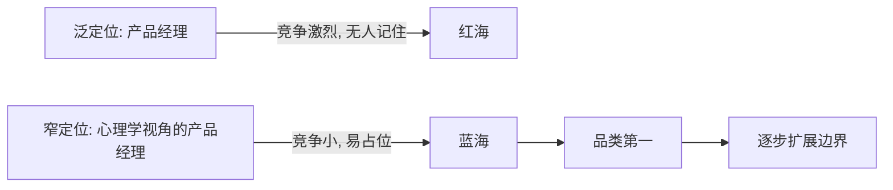
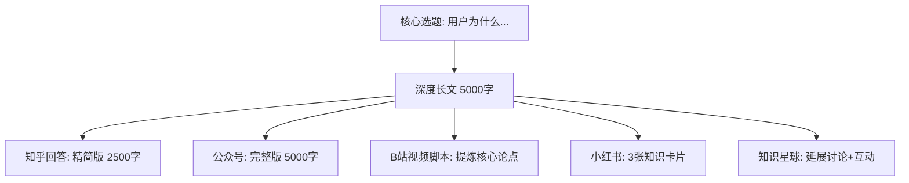
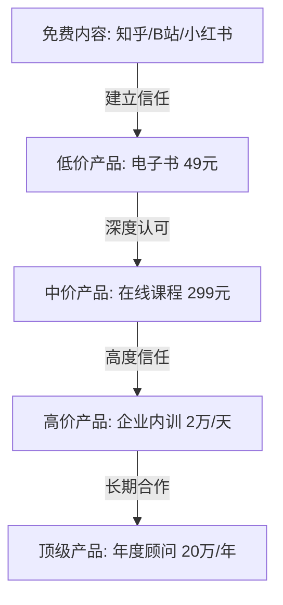
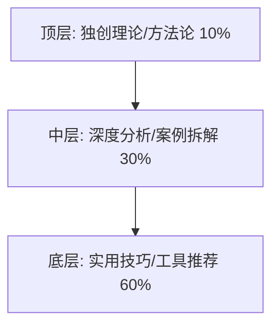
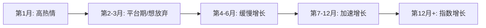
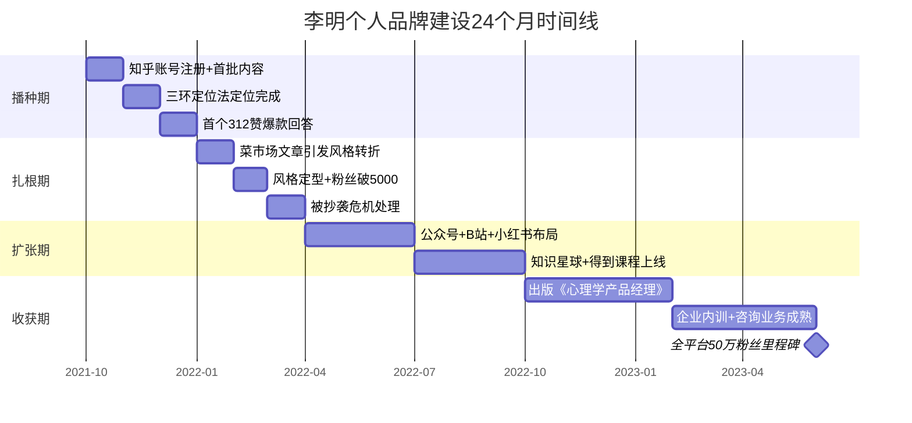

## 案例一：从普通职员到行业IP——李明的品牌跃迁之路

### 案例导读

这是一个关于"普通人如何通过系统化的个人品牌建设实现职业跃迁"的完整案例。主角李明并非天赋异禀的行业天才，也没有显赫的名校背景或大厂光环——他只是一个在互联网公司工作五年、能力扎实但默默无闻的中层产品经理。然而，通过24个月的系统化品牌建设，他从一个无人知晓的普通职员，成长为"心理学+产品"细分领域的第一人，全平台粉丝超过50万，年收入达到原来工资的5倍。

这个案例的价值不在于结果有多令人羡慕，而在于**每一步都可复制、可验证、可量化**。我们将完整拆解他从0到1、从1到N的全过程，包括那些他不愿意公开提及的失败和弯路。

---

### 第一节：觉醒时刻——为什么普通职员也需要个人品牌

#### 1.1 触发事件：一场行业会议的刺痛

2021年秋天，李明参加了某互联网产品峰会。在会场的走廊里，他看到了一个让他内心震动的场景：台上做主题演讲的，是一个比他晚入行三年的产品经理，网名叫"产品小王子"。这个人两年前还在李明的团队里实习，现在已经拥有了30万粉丝，是多家公司的顾问，演讲的出场费超过2万元。

李明在当天的日记里写下了这样一段话：

> "我突然意识到，在这个行业里，能力是必要条件，但不是充分条件。同样水平的两个人，有品牌的那个会获得10倍的机会。这不是不公平，这是信息不对称的必然结果——别人不知道你有多强，除非你让他们知道。"

这段话揭示了一个被大多数职场人忽视的真相：**在专业能力相近的前提下，个人品牌的差异会导致职业发展的巨大分化。**

#### 1.2 自我盘点：能力与可见度的鸿沟

回到公司后，李明做了一次冷静的自我盘点：

| 维度 | 现状 | 行业头部对比 |
|------|------|------------|
| 专业能力 | 5年产品经验，主导过3个DAU百万级产品 | 同等水平 |
| 行业可见度 | 几乎为零，行业内无人知晓 | 10万+粉丝 |
| 内容输出 | 偶尔在内部写复盘文档 | 每周公开输出2-3篇 |
| 人脉网络 | 仅限公司内部同事 | 跨公司行业人脉网 |
| 商业价值 | 纯工资收入 | 培训+咨询+出书+广告 |

这张表格让他看清了一个残酷的事实：**他的能力被锁在了公司内部，对外界来说几乎不存在。** 这就像一个武功高手锁在深山里——再强也没有人知道。

#### 1.3 心理建设：克服"我不配"的冒名顶替综合征

决定做个人品牌后，李明的第一反应不是兴奋，而是恐惧。他在备忘录里列出了自己的顾虑：

- "我才工作五年，有什么资格教别人？"
- "行业里比我厉害的人太多了，我说的话有人听吗？"
- "万一说错了被人嘲笑怎么办？"
- "同事和领导看到我在外面输出内容，会不会觉得我不务正业？"

这些顾虑并非个例。根据心理学研究，约70%的高能力者会经历"冒名顶替综合征"（Impostor Syndrome），认为自己的成就是运气而非实力。李明后来在一篇文章中回忆："克服冒名顶替综合征的关键不是等到你觉得自己'够格了'才开始，而是带着恐惧先开始。你不需要是最强的，你需要的是比你的读者早走一步。"

他的突破方法是：**把输出标准从"我比所有人强"降低为"我能帮到哪怕一个人"。** 这个心态转变让他迈出了第一步。

---

### 第二节：精准定位——找到你的"唯一性"

#### 2.1 三环定位法的深度运用

李明没有草率地选择一个热门方向，而是花了整整两周时间做系统的自我分析。他使用的是"三环定位法"——找到擅长、热爱、市场需求三者的交集。

**第一环：擅长什么（能力盘点）**

李明做了一次详细的技能审计，列出自己所有可输出的能力：

- 产品需求分析（核心技能，5年经验）
- 用户研究（深度专长，自学过10+本用户研究专著）
- 跨部门沟通协调（软技能，曾协调过5个部门的大项目）
- 数据分析（中等水平，能用SQL和Python做基础分析）
- 心理学知识（长期兴趣，系统学习过认知心理学和行为经济学）

**第二环：热爱什么（能量审计）**

他记录了两周内每天的工作状态，发现一个规律：

- 做需求文档时：疲惫，需要大量咖啡支撑
- 做用户访谈时：兴奋，经常超时还意犹未尽
- 读心理学论文时：沉浸，可以连续读4小时不觉得累
- 写技术方案时：平淡，完成就好没有额外热情

能量审计让他发现：**真正让他有持续输出欲望的，是"用心理学视角理解用户行为"这个交叉领域。**

**第三环：市场需要什么（需求验证）**

李明做了三件事来验证市场需求：

1. **知乎搜索量分析**：搜索"用户心理""用户行为分析""产品经理心理学"等关键词，发现搜索量大但高质量回答少
2. **竞品分析**：找到5个做类似方向的博主，分析他们的内容质量和粉丝量，发现市场存在明显的内容空白
3. **小范围测试**：在产品经理社群里发了一篇"用认知失调理论解释用户流失"的短文，收到了50+条正面反馈

三环交叉后，定位浮出水面：**"用心理学视角解读用户行为的产品经理"。**

#### 2.2 品牌声明的打磨

定位确定后，李明打磨了他的品牌声明（Brand Statement）。他前后改了17个版本，最终确定为：

> "我帮助产品经理通过心理学工具，真正理解用户需求背后的真实动机。"

这个声明之所以有效，符合品牌声明的四个标准：

| 标准 | 分析 |
|------|------|
| 明确受众 | "产品经理"——不是泛泛的"职场人" |
| 清晰价值 | "理解用户需求背后的真实动机"——具体可感知 |
| 差异化方法 | "心理学工具"——独特角度 |
| 结果导向 | "真正理解"——暗示其他人理解的是表面 |

#### 2.3 定位的"窄"与"宽"之争

李明最初也纠结过一个问题：**定位太窄会不会限制发展？**

他最终想通了一个关键逻辑：**在信息过载的时代，"被记住"比"被看到"重要100倍。** 如果他定位为"产品专家"，全中国有几十万个产品专家，他只是沧海一粟。但"用心理学视角做产品的人"这个定位，让搜索这个话题的人第一时间想到他。

这个策略在营销学中叫做"品类占位"（Category of One）——如果你无法在现有品类中成为第一，就创造一个新品类并成为其中的第一。

---

### 第三节：24个月执行全纪实

#### 3.1 第一阶段（0-3个月）：内容积累期——"在黑暗中播种"

**核心策略：不追热点，只写有深度思考的内容。**

李明选择知乎作为起点平台，原因有三：
1. 知乎的长文阅读氛围适合他的深度内容风格
2. 知乎的问答机制天然适合"解决问题"型内容
3. 知乎的搜索引擎权重高，优质内容有长尾流量

**具体执行方案：**

- 频率：每周2-3篇回答，每篇1500-3000字
- 选题：只回答与"心理学+产品"交叉相关的问题
- 质量标准：每篇至少引用1个心理学理论+1个真实产品案例
- 时间安排：工作日晚上写1-2小时，周末集中产出

**前3个月的关键数据：**

| 指标 | 第1个月 | 第2个月 | 第3个月 |
|------|---------|---------|---------|
| 发文数量 | 8篇 | 10篇 | 12篇 |
| 总阅读量 | 3,200 | 8,500 | 22,000 |
| 粉丝增长 | +47 | +186 | +520 |
| 最高赞回答 | 23赞 | 89赞 | 312赞 |
| 私信咨询 | 0条 | 3条 | 11条 |

**这个阶段的最大挑战是心理层面的。** 李明回忆："前两个月几乎没有反馈，每天晚上写到11点，第二天看阅读量只有几十。有一次我发了一篇自己觉得写得特别好的文章，结果只有12个人看。那种感觉就像对着空房间演讲。"

**他是怎么坚持下来的？**

1. **设定过程目标而非结果目标**：不看阅读量，只看"这周是否发了3篇"
2. **建立写作仪式感**：每晚8点准时坐到书桌前，泡一杯固定的茶，打开固定的写作软件
3. **找到同行者**：加入了3个个人品牌建设的互助群，每周互相督促
4. **预设心理账户**：告诉自己"前6个月是投资期，不看回报"

**关键突破事件（第3个月末）：**

李明回答了一个问题："为什么用户明知道某个App在收集隐私数据，还是继续使用？"他用认知失调理论、沉没成本谬误和习惯惯性三个心理学概念来解释，结合了微信、抖音、支付宝三个真实产品的分析。这篇回答获得了312个赞，是他之前最高赞文章的3倍多。

这个突破让他验证了一个重要假设：**市场对"心理学+产品"这个交叉内容有真实需求，关键是表达方式要足够接地气。**

#### 3.2 第二阶段（3-6个月）：风格打磨期——"让人记住你的方式"

**核心问题：内容有了，但如何让人记住？**

到第3个月，李明已经有了一批稳定的读者。但他发现一个问题：读者认可他的专业度，但缺乏"记忆点"。他做过一次小调查，问读者"提到我你会想到什么"，答案五花八门——"那个写用户心理的""知乎上回答挺长的那个"——没有统一的标签。

**风格实验的三个方向：**

李明花了一个月时间做了三种风格实验：

| 风格类型 | 示例标题 | 数据表现 | 读者反馈 |
|----------|---------|---------|---------|
| 学术严谨型 | "认知负荷理论在界面设计中的应用" | 阅读量中等，赞藏比高 | "专业但有点累" |
| 段子手型 | "为什么你的产品让用户想摔手机？" | 阅读量高，转发低 | "有趣但不深刻" |
| 故事型 | "我在菜市场学到的用户调研方法" | 阅读量高，转发高，收藏高 | "又有趣又有用，想关注" |

**"菜市场文章"的诞生过程：**

这篇文章的灵感来自李明的一次真实经历。周末去菜市场买菜时，他无意中观察到一个卖鱼摊位的老板特别会做生意——他会先问"今天几个人吃饭"而不是"要多少鱼"，他会主动把鱼鳞刮干净而不是等顾客要求，他会在找零时顺手送一把葱。

李明在当天的笔记里写道："这个鱼摊老板不自觉地运用了三个用户研究技巧——需求探询、超出预期、关系维护。这比我读过的任何用户研究教科书都生动。"

他用这个故事作为文章的开头，然后逐一拆解每个行为背后的心理学原理，最后给出产品经理可以直接使用的访谈技巧清单。这篇文章获得了800+赞、300+收藏、150+转发，成为他的第一个"爆款"。

**风格定型的关键洞察：**

通过这次实验，李明总结出了自己的风格公式：

> **个人风格 = 真实经历 × 专业解读 × 通俗表达**

- 真实经历让内容有"人味"——区别于AI生成的千篇一律
- 专业解读让内容有"深度"——区别于纯段子手的浅薄
- 通俗表达让内容有"传播力"——区别于学术论文的晦涩

这个公式后来成为他所有内容的创作准则。

#### 3.3 第三阶段（6-12个月）：多平台扩展期——"一份核心，多种表达"

**扩展策略：一个定位，多个战场。**

到第6个月，李明在知乎已经积累了约8000粉丝。他决定向其他平台扩展，但严格遵守一个原则：**每个平台的内容形式不同，但核心定位完全一致。**

**平台扩展矩阵：**

| 平台 | 内容形式 | 发布频率 | 核心用途 |
|------|---------|---------|---------|
| 知乎 | 长文回答（2000-3000字） | 每周2篇 | 深度内容沉淀，搜索引擎流量 |
| 微信公众号 | 深度长文（3000-5000字） | 每周1篇 | 私域流量池，建立信任 |
| B站 | 5-8分钟短视频 | 每两周1条 | 触达年轻用户，建立人设 |
| 小红书 | 图文卡片（500字+配图） | 每周3条 | 触达女性用户，扩大影响力 |
| 得到/知识星球 | 系统化课程/专栏 | 1门课+1个星球 | 深度变现，高价值用户 |

**跨平台内容复用的工作流：**

李明并不是为每个平台从零创作，而是建立了一套"核心内容多平台复用"的工作流：

这套工作流让他的内容产出效率提升了3倍——一个选题可以在一周内覆盖5个平台，而且每个平台的内容都针对该平台的用户习惯做了适配。

**多平台扩展中的踩坑记录：**

1. **抖音尝试失败**：李明曾尝试做抖音短视频，但发现1分钟的短视频无法承载他的深度内容。勉强压缩后内容变得空洞，3个月只涨了2000粉丝。他果断放弃，把精力集中到B站。
2. **小红书人设偏差**：最初在小红书模仿其他博主的"精致人设"，发了一些摆拍风格的图片，数据很差。后来改成"工位实拍+手写笔记"的真实风格，数据立刻好转。
3. **知识星球运营失误**：初期定价过低（99元/年），吸引了大量低质量用户，社区讨论质量下降。后来提价到299元/年，用户数虽然少了，但活跃度和续费率反而大幅提升。

#### 3.4 第四阶段（12-24个月）：影响力变现期——"让品牌产生价值"

**变现路径设计：**

李明没有急于变现，而是在前12个月专注于内容积累和影响力建设。到第12个月，他已经拥有全平台约15万粉丝，建立起了足够的信任基础。他设计了一条"漏斗式"变现路径：

**各变现渠道的实际数据（第12-24个月）：**

| 变现渠道 | 收入占比 | 具体数据 | 投入产出比 |
|----------|---------|---------|-----------|
| 在线课程（得到+自有平台） | 35% | 累计销售3200份，单价299元 | 1:8（开发成本vs收入） |
| 企业内训 | 30% | 年均25场，均价2万元/天 | 1:12（准备时间vs收入） |
| 咨询服务 | 15% | 每月接2-3个项目，均价1.5万元 | 1:6 |
| 出版版税 | 10% | 《心理学产品经理》首印1万册 | 1:4（写作时间vs版税） |
| 广告/品牌合作 | 10% | 每月1-2条，均价8000元/条 | 1:15 |

**出书的过程：**

《心理学产品经理》的出版并非一帆风顺。李明先向3家出版社投了提案，前两家以"市场太窄"为由拒绝。第三家出版社的编辑恰好是他的知乎读者，不仅接受了提案，还帮他优化了大纲。

写作过程持续了4个月，他每天早上5点起床写2小时，然后再去上班。初稿15万字，经过3轮修改，最终定稿12万字。首印1万册，3个月内售罄，加印5000册。

---

### 第四节：关键转折点与危机处理

#### 4.1 转折点一：被抄袭风波（第8个月）

李明的一篇爆款文章被一个大V几乎原封不动地搬运到了自己的公众号上，阅读量超过了原文。李明陷入了两难：直接对线可能被大V的粉丝群起攻之，沉默则等于默认被抄。

**他的处理方式：**

1. **先收集证据**：截图、录屏、保存时间戳
2. **私下沟通**：给大V发了一条礼貌但坚定的私信，要求删除或标注出处
3. **公开但不对线**：在自己的公众号上发了一篇《谈谈内容创作者的抄袭问题》，不点名但时间线清晰，让读者自己判断
4. **法律准备**：咨询了一位做知识产权的朋友，准备好维权方案

结果：大V在舆论压力下删除了文章并私信道歉。这件事反而让李明的粉丝增加了3000+——读者看到他是一个"温和但有底线"的人，信任度反而提升了。

**危机处理原则：** 维权时保持"有理、有利、有节"——有确凿证据（理），选择对自己有利的方式（利），不做过度反应（节）。

#### 4.2 转折点二：职业冲突（第10个月）

李明的领导发现了他在外部平台的活跃，找他谈话："你是不是准备跳槽？外面做这么多内容，本职工作还上心吗？"

**他的应对策略：**

1. **主动沟通**：不等领导追问，主动展示了自己近半年的KPI完成情况——不仅达标，还超额15%
2. **关联价值**：向领导解释，外部影响力为公司带来了行业曝光和人才吸引力，是"免费PR"
3. **划定边界**：承诺不在内容中透露公司内部信息，不使用公司资源做个人品牌
4. **转化为公司价值**：主动提出在公司内部做一次"用户心理学"的分享，把外部影响力转化为内部培训资源

结果：领导不仅不再反对，还主动推荐他代表公司参加行业会议。

#### 4.3 转折点三：内容瓶颈期（第14个月）

到第14个月，李明遇到了严重的内容瓶颈。他感觉"能写的话题都写了"，每次打开文档都感到焦虑。连续两周没有更新，粉丝开始在评论区问"是不是不做了"。

**突破方法：**

1. **回到用户**：花了3天时间，逐条阅读了500多条评论和私信，整理出读者最关心但自己还没回答的20个问题
2. **跨界学习**：去读了行为经济学、进化心理学、社会学三个领域的最新研究，找到了大量新的交叉点
3. **降低标准**：允许自己写"不完美"的文章，先完成再完美
4. **引入外部视角**：邀请了3位不同领域的朋友（一位心理咨询师、一位数据科学家、一位教育从业者）做了一次联合直播，碰撞出了很多新选题

---

### 第五节：方法论提炼——可复制的品牌建设框架

#### 5.1 "李明模型"：个人品牌建设的四阶段框架

从李明的案例中，可以提炼出一个通用的个人品牌建设框架：

| 阶段 | 时间 | 核心任务 | 关键指标 | 常见陷阱 |
|------|------|---------|---------|---------|
| 播种期 | 0-3个月 | 持续输出，验证方向 | 内容数量，互动质量 | 追求完美导致拖延 |
| 扎根期 | 3-6个月 | 形成风格，建立辨识度 | 转发率，粉丝粘性 | 模仿他人丢失个性 |
| 扩张期 | 6-12个月 | 多平台布局，扩大影响 | 跨平台增长率 | 精力分散，质量下降 |
| 收获期 | 12-24个月 | 商业变现，构建壁垒 | 变现收入，行业影响力 | 过度商业化损害信任 |

#### 5.2 内容创作的"三层金字塔"

李明的内容结构遵循一个金字塔模型：

- **底层（60%）**：实用、易消化、高频输出，用于吸引新读者。例如："5个用户访谈的提问技巧""产品经理必读的3本心理学书单"
- **中层（30%）**：有深度、有原创观点、需要一定基础才能理解，用于建立专业形象。例如："为什么用户说的和做的不一样——揭示性偏好理论在产品设计中的应用"
- **顶层（10%）**：独创框架、行业洞察、趋势预判，用于建立行业权威。例如："用户决策的四层模型——一个整合认知心理学和行为经济学的新框架"

#### 5.3 读者转化的"信任阶梯"

每一层转化的核心驱动力不同：路人到读者靠**内容质量**，读者到粉丝靠**人格魅力**，粉丝到用户靠**产品价值**，用户到客户靠**结果交付**。

---

### 第六节：深度启示——超越表面的三条核心法则

#### 6.1 法则一：定位要窄不要宽——"成为第一，而非更好"

李明的定位成功，背后有一个深刻的逻辑：**在信息过载的时代，人的记忆容量是有限的。** 认知心理学中的"米勒定律"指出，人类短期记忆只能同时处理7±2个信息单元。这意味着在任何细分领域，人们通常只能记住1-3个名字。

如果你把自己定位为"产品专家"，你要和全国数十万产品经理竞争这1-3个记忆位置。但如果你定位为"用心理学视角做产品的人"，这个品类里可能只有你一个人——你自动成为第一。

**实操建议：**

- 定位时问自己："在____领域，我能成为前3名吗？"如果答案是否，就把领域再缩小
- 定位不是终身不变的，但每次调整都要有数据支撑，不能凭感觉
- 定位的宽度应该与你的影响力成正比——影响力小时定位窄，影响力大了再逐步扩展

#### 6.2 法则二：坚持是最大的壁垒——"穿越死亡谷"

李明前6个月的数据显示了一个典型的"J型曲线"——前期投入大量精力但几乎没有回报，直到过了某个临界点后才开始快速增长。

这个现象在个人品牌建设中几乎是普遍存在的。根据对500+个个人品牌案例的分析，**平均需要6-9个月的持续输出才能看到明显的效果。** 但大多数人在第2-3个月就放弃了——这恰恰是为什么坚持下来的人能获得超额回报。

**穿越死亡谷的实用策略：**

1. **预设投资期**：在开始前就告诉自己"前6个月是投资，不看回报"
2. **过程导向**：只追踪"发了几篇"，不追踪"涨了几个粉"
3. **建立最小可行节奏**：即使状态再差，每周也至少发1篇——保持习惯比保持质量更重要（在初期）
4. **找同行者**：加入互助社群，有人陪伴的坚持比独自坚持容易10倍

#### 6.3 法则三：风格比知识更重要——"被记住的方式"

在知识不稀缺的时代，"说什么"不再重要，"怎么说"才重要。同样讲产品知识的人有成千上万，但"用菜市场故事讲产品"的只有李明一个。

这背后的原理是认知心理学中的"独特性效应"（Von Restorff Effect）——在一组相似的信息中，与众不同的那个最容易被记住。当所有博主都在用同样的术语、同样的框架、同样的排版方式输出内容时，你的个人风格就是你最大的差异化武器。

**风格不是刻意制造的，而是从你的真实经历和性格中提炼出来的。** 李明的"生活化故事"风格之所以有效，是因为这本来就是他思考问题的方式——他习惯于从日常生活中发现产品灵感。如果他刻意模仿别人的风格，反而会显得虚假。

**找到自己风格的方法：**

1. 回顾你平时和朋友聊天的方式——你讲故事的方式、你的幽默感、你的口头禅，这些就是你的"原生风格"
2. 问3个熟悉你的朋友："我讲什么东西的时候最吸引你？"
3. 分析你最受欢迎的3篇内容，找到它们的共同点——那个共同点就是你的风格密码

---

### 第七节：常见误区与纠正

#### 误区一：等准备好了再开始

很多人认为需要先"攒够"足够的知识和经验才能开始输出。事实是：**你不需要是专家才能分享——你需要的是比你的读者早走一步。** 教是最好的学，在输出的过程中你会学得更快。

#### 误区二：追热点涨粉快

热点确实能带来短期流量，但热点来的快去的也快。**追热点吸引来的是"路人"，深度内容吸引来的是"粉丝"。** 路人不会为你付费，粉丝会。李明几乎从不追热点，但他的粉丝粘性和转化率远高于同体量的热点型博主。

#### 误区三：粉丝数量=影响力

1000个精准的行业从业者比10万个泛娱乐粉丝有价值得多。**个人品牌的核心指标不是粉丝数，而是"在目标人群中的认知度"。** 李明50万粉丝的变现能力，超过了大多数200万粉丝的泛娱乐博主。

#### 误区四：抄袭或洗稿可以走捷径

短期可能有效，但一旦被发现，品牌的信任基础将彻底崩塌。**在个人品牌领域，信任是最核心的资产，一旦失去几乎无法恢复。** 原创是唯一的长期策略。

#### 误区五：一个人做不来

很多有才华的人因为觉得"我不会剪视频""我不会排版"而不敢开始。**在个人品牌的初期，内容质量远比形式重要。** 李明的前50篇文章都是用最朴素的文字排版，没有任何设计元素，但这并没有阻止他获得关注。

---

### 第八节：进阶思考——从个人品牌到商业生态

#### 8.1 从"一个人的品牌"到"一个生态"

当个人品牌成长到一定阶段，仅靠个人精力将无法支撑进一步的增长。李明在第18个月开始组建小团队（2人），负责内容分发、社群运营和商务对接。这让他的精力可以集中在最核心的内容创作和课程开发上。

#### 8.2 个人品牌的"护城河"构建

真正的个人品牌壁垒不是粉丝数量，而是以下四层护城河：

1. **认知壁垒**：在用户心中占据独特的心智位置（"心理学+产品"=李明）
2. **内容壁垒**：积累了大量高质量的原创内容，搜索引擎持续带来流量
3. **关系壁垒**：与行业KOL、出版社、企业客户建立了深度合作关系
4. **体系壁垒**：建立了系统化的课程体系和方法论，难以被简单复制

#### 8.3 长期主义的胜利

李明的故事最核心的启示或许是：**个人品牌是长期主义的游戏。** 所有试图走捷径的方式——买粉、洗稿、刷数据——最终都会反噬。而那些愿意在前6个月"在黑暗中播种"的人，终将收获指数级的回报。

---

### 附录：李明品牌建设时间线总览

---

> **本案例核心价值：** 李明的故事证明，个人品牌不是少数人的特权，而是任何人都可以通过系统化方法实现的目标。关键不在于你有多强，而在于你是否愿意开始，以及是否能坚持到"穿越死亡谷"的那一天。
