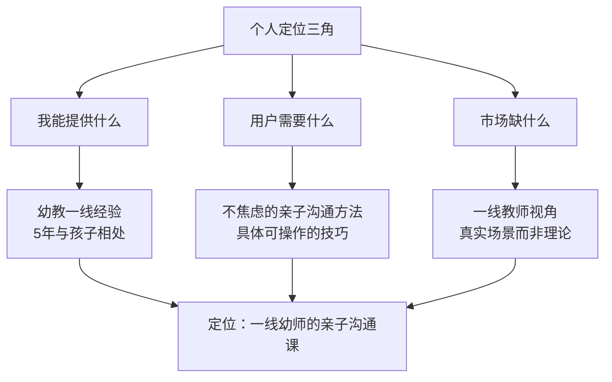
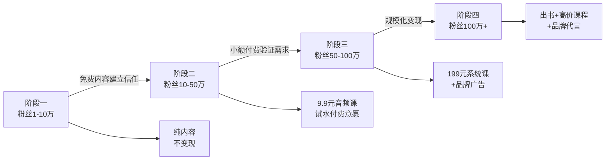

## 案例二：从素人到百万粉丝——张薇的短视频品牌之路

### 案例概览

张薇，28岁，成都某公立幼儿园教师，教育学本科毕业，从业五年。2020年3月疫情期间居家办公期间开始在抖音发布亲子教育短视频，18个月内实现全平台粉丝突破200万，出版两本亲子沟通畅销书，开设线上课程实现年收入超百万。本案例完整复盘她从素人到个人品牌的全过程，提炼可复制的方法论。

| 维度 | 数据 |
|------|------|
| 起步时间 | 2020年3月 |
| 起步身份 | 幼儿园教师，零粉丝 |
| 核心平台 | 抖音（主阵地）、小红书、微信视频号 |
| 18个月粉丝量 | 抖音130万、小红书45万、视频号30万 |
| 变现路径 | 广告→课程→出书→品牌合作 |
| 核心定位 | "一线幼师教你跟孩子好好说话" |

---

### 第一阶段：起步期（第1-3个月）——找到定位

#### 起因：一条"意外"的爆款

2020年3月，张薇在家录了一条2分钟的视频，讲的是"孩子哭闹时，90%的家长第一句话就说错了"。她用幼儿园里一个真实故事开头：一个三岁男孩摔倒后大哭，旁边的奶奶说"不疼不疼，男子汉不许哭"，孩子哭得更凶了。张薇蹲下来对他说："你摔疼了对不对？老师看到你膝盖红了。"孩子抽泣着点了点头，很快就不哭了。

这条视频获得了12万点赞、8000多条评论。评论区里大量家长留言："原来我一直在说错话""能不能多讲讲怎么跟孩子说话"。

**关键决策点**：面对这条爆款，张薇面临选择——是继续发日常内容碰运气，还是围绕"亲子沟通"这个点系统性地做内容？她选择了后者。

#### 定位三角模型

张薇用三个维度确定了自己的定位：



**定位的核心逻辑**：

1. **我是谁**：不是育儿专家，不是心理咨询师，是一个每天跟30个孩子相处8小时的一线幼师。这个身份天然具备可信度——家长相信"做过的人"胜过"研究过的人"。

2. **我能给什么**：不是理论框架，而是"今天班上发生了一件事"的真实场景，加上一个看完就能用的沟通话术。

3. **我跟别人有什么不同**：2020年抖音亲子教育赛道里，头部账号多为育儿专家、心理咨询师、全职妈妈。"一线幼师"这个身份是空白的。更关键的是，张薇的表达风格是"温柔但不焦虑"，在当时弥漫育儿焦虑的环境中形成了鲜明反差。

#### 定位验证：用数据说话

张薇没有凭感觉定方向，而是做了三件事：

1. **刷了200条同行视频**：记录哪些选题点赞高、哪些评论区活跃、哪些内容被反复提及。她发现"具体场景+具体话术"的组合最受欢迎。
2. **分析评论区需求**：把自己爆款视频的8000条评论逐条阅读，归纳出家长最常问的五类问题。
3. **测试内容方向**：在第一个月发了15条视频，涵盖五个方向，观察哪个方向的完播率和互动率最高。

**测试结果**：

| 内容方向 | 平均完播率 | 平均互动率 | 决策 |
|----------|-----------|-----------|------|
| 孩子哭闹时怎么沟通 | 45% | 8.2% | 核心方向 |
| 孩子不听话怎么引导 | 38% | 6.5% | 辅助方向 |
| 幼儿园里的社交冲突 | 35% | 5.1% | 偶尔穿插 |
| 幼儿心理发展知识 | 22% | 2.3% | 放弃 |
| 教师职业感悟 | 18% | 1.8% | 放弃 |

她果断砍掉了后两个方向，集中精力做前两个。

---

### 第二阶段：内容体系搭建（第3-6个月）——建立方法论

#### 内容公式：STAR故事框架

张薇摸索出了一套被她称为"STAR"的内容结构，每条视频都遵循这个框架：

- **S（Scene，场景）**：用一个具体的、有画面感的场景开场。"今天下午，班上一个四岁的小女孩突然把积木推倒了……"
- **T（Trouble，冲突）**：场景中的矛盾或问题。"她妈妈来接她的时候，第一句话就是'你怎么又搞破坏'"
- **A（Action，行动）**：张薇的处理方式。"我把妈妈拉到一边，先跟她说了三句话……"
- **R（Result，结果+启示）**：结果如何，家长能学到什么。"妈妈听完蹲下来跟女儿说了同样的话，小女孩扑进妈妈怀里哭了。记住这个句式：先描述事实，再表达感受，最后提出期待。"

这个框架的精妙之处在于：**故事本身就是论据**，家长不需要被说服"沟通很重要"，因为他们亲眼看到了效果。

#### 选题矩阵

张薇建立了系统化的选题库，而不是每天临时想拍什么：

| 选题类型 | 占比 | 来源 | 示例 |
|----------|------|------|------|
| 真实教学案例 | 40% | 日常教学观察 | "今天一个孩子说'我讨厌你'，我这样回应" |
| 家长高频提问 | 25% | 评论区、私信收集 | "孩子总说'我不会'怎么办" |
| 热点话题解读 | 15% | 社会热点+教育角度 | "开学季分离焦虑全攻略" |
| 知识科普 | 10% | 儿童心理学经典理论 | "蒙特梭利说的'敏感期'到底是什么" |
| 个人故事 | 10% | 自己的成长经历 | "我小时候被老师冤枉的那件事" |

**选题管理方法**：张薇在手机备忘录里建了一个"选题池"，随时记录灵感。每次在幼儿园看到有趣的互动、每次家长问出好问题、每次刷到社会热点，都记下来。每周日晚上从选题池里选出下周要拍的5-7个选题，提前写好脚本大纲。

#### 内容风格的四根支柱

张薇的内容风格之所以能建立辨识度，是因为她在四个维度上保持了极致的一致性：

1. **语调：温柔但有力量**。不居高临下，不贩卖焦虑，不使用"你必须""你应该"这类命令式表达。代之以"你可以试试""我观察到一个有趣的现象"。

2. **节奏：先故事后方法**。每条视频前60%是故事铺陈，后40%是方法提炼。这个比例是反复测试后确定的——太早讲方法，观众没有代入感；太晚讲方法，观众觉得没有干货。

3. **视觉：统一且温暖**。固定在家中书房拍摄，米色墙面、暖色灯光、身后是一排绘本。不换场景、不搞特效，让观众的注意力集中在内容本身。

4. **语言：口语化但不随意**。避免专业术语（用"孩子发脾气"而不是"情绪失调"），但每句话都经过推敲，不说废话。

---

### 第三阶段：增长突破（第6-12个月）——从10万到100万

#### 增长策略一：评论区运营

张薇把评论区当作"第二内容场"来运营，而不是简单的互动区域：

**具体做法**：

- **置顶评论引导**：每条视频发布后，自己先在评论区写一条补充内容，比如"视频里提到的那句话，完整版是这样的：'妈妈看到你很生气（描述情绪），因为弟弟拿了你的玩具（陈述事实），你可以告诉弟弟'请还给我'（给出方案）'"
- **精选问题回复**：每天花40分钟回复评论，优先回复提出具体问题的家长。她的回复不是"加油"之类的敷衍，而是写出完整的方法建议，字数经常超过100字。
- **评论区选题**：定期翻看评论区，把高频问题整理成新选题。她有一条视频标题就是"评论区被问了300次的问题：孩子打人怎么办"，这条视频获得了50万点赞。

**数据效果**：经过三个月的评论区深耕，张薇视频的评论率从平均3%提升到8%，评论区活跃度进入母婴赛道前5%。抖音算法对评论率权重很高，这直接推动了推荐量的提升。

#### 增长策略二：用户共创机制

张薇在粉丝达到5万时启动了"亲子故事征集"活动：

1. **征集**：每周在评论区和粉丝群征集家长的亲子沟通故事
2. **筛选**：从投稿中选出最有代表性的3-5个故事
3. **创作**：基于真实故事创作视频内容，在视频中引用粉丝的故事（已获授权）
4. **反馈**：在视频中@投稿粉丝，让TA获得曝光和认可

这个机制的精妙之处在于：

- **解决了选题来源问题**：真实用户故事比自己编的内容更有共鸣
- **建立了情感连接**：粉丝从"看客"变成了"参与者"，归属感大幅提升
- **形成了内容飞轮**：共创内容获得更多互动→更多粉丝愿意参与→更多优质选题

**关键数据**：共创内容的平均完播率比普通内容高出22%，评论率高出35%。

#### 增长策略三：跨平台内容适配

张薇在抖音稳定后，同步布局小红书和微信视频号，但她不是简单地"一稿多发"，而是做了平台适配：

| 平台 | 内容形式 | 风格差异 | 发布策略 |
|------|---------|---------|---------|
| 抖音 | 1-3分钟竖屏视频 | 故事性强，节奏快，前3秒抓人 | 每天1条，晚8点 |
| 小红书 | 图文笔记+短视频 | 干货密度高，标题党适度使用 | 每天1条图文+3条短视频 |
| 视频号 | 2-5分钟视频 | 节奏稍慢，适合中年家长 | 每天1条，早7点 |

**抖音内容模板**：
前3秒：悬念钩子（"孩子说'我恨你'的时候，90%的家长反应都是错的"）
第4-60秒：真实场景故事（STAR框架的S和T）
第61-90秒：正确做法演示（A和R）
最后10秒：引导互动（"你家孩子说过类似的话吗？评论区告诉我"）

**小红书内容模板**：
标题：数字+痛点（"幼儿园老师亲测｜5句话让孩子主动配合"）
封面：手写体关键词+暖色调背景
正文：分点列出，每点一个场景+一句话术
结尾：引导收藏（"先收藏，用到的时候翻出来"）

---

### 第四阶段：变现与商业化（第12-18个月）——从影响力到收入

#### 变现路径设计

张薇的变现遵循"先信任后商业"的原则，严格按阶段推进：



#### 变现产品详解

**产品一：9.9元音频课（试水期）**

在粉丝达到15万时，张薇在知识星球上架了一套"21天亲子沟通训练营"音频课，定价9.9元。内容是把视频中讲过的核心方法系统化整理。

- 定价逻辑：低到几乎无决策门槛，目的是验证"用户是否愿意为我的内容付费"
- 结果：首期卖出2000份，复购率和好评率均超过85%
- 关键信号：大量用户留言"希望有更系统的课程"

**产品二：199元视频课（成长期）**

基于试水期的反馈，张薇开发了一套30节的系统课程《跟孩子好好说话：从冲突到连接的30个沟通场景》。

- 课程结构：30个真实场景，每个场景一节课（15-20分钟），包含理论讲解+情景演示+实操练习
- 定价逻辑：199元是知识付费的"甜蜜点"——足够体现价值，又不至于让家长犹豫太久
- 推广策略：在日常视频中自然提及（不是硬广），比如"这个方法我在课程第三讲里详细拆解过"
- 结果：6个月卖出1.2万份，营收约240万

**产品三：出书（成熟期）**

出版社主动找上门。张薇出了两本书：

1. 《幼儿园老师妈妈的沟通课》——面向普通家长的亲子沟通指南
2. 《30个场景教会孩子好好说话》——基于课程内容的扩展版

两本书累计销量超过15万册。出书本身又反哺了短视频内容——"新书发布""书中案例的后续"等选题持续产出。

#### 商业合作原则

张薇对商业合作有严格筛选标准：

- **只接与定位强相关的品牌**：儿童绘本、益智玩具、亲子课程平台
- **每条广告都必须有真实体验**：不接"念稿式"广告，必须自己和孩子用过
- **广告频率控制**：每10条内容中最多1条广告，保持内容纯粹性
- **价格底线**：不因为钱多就接不合适的品牌

这套原则让她在商业化的同时保持了粉丝信任。她的广告视频完播率只比普通内容低8%（行业平均低30%以上）。

---

### 关键转折点与挑战

#### 挑战一：内容瓶颈期（第4个月）

**问题**：连续两周没有爆款，完播率从40%降到25%，粉丝增长停滞。

**原因分析**：张薇发现自己陷入了"舒适区"——总是讲类似的场景、用类似的结构，老粉丝觉得重复，新算法也不再推荐。

**解决方案**：
1. **内容升级**：从"单场景单技巧"升级为"多场景对比分析"，比如"孩子说'我不会'的三种情况，三种回应方式"
2. **形式创新**：加入"角色扮演"环节——张薇分别扮演"错误示范"和"正确示范"，对比效果强烈
3. **跨领域连接**：引入儿童心理学的经典实验（如"棉花糖实验"），用科学背书增加权威性

**结果**：两周后完播率恢复到38%，并持续上升到45%。

#### 挑战二：负面舆论（第8个月）

**问题**：有同行质疑张薇"一个幼儿园老师凭什么教家长育儿"，引发了小范围的负面讨论。

**应对策略**：
1. **不回应攻击，只回应质疑**：发了一条视频，平和地解释"我不是在教家长育儿，我是在分享我每天看到的真实案例和处理方式"
2. **用专业背书**：邀请一位儿童心理学教授做了一期联合直播，教授从专业角度验证了张薇方法的科学性
3. **粉丝自发辩护**：大量老粉丝在评论区和相关帖子里分享"用了张薇方法后孩子变化"的真实故事

**关键启示**：危机处理的核心不是"打败对手"，而是"强化自己的叙事"。

#### 挑战三：倦怠感（第12个月）

**问题**：日更一年后，张薇出现了严重的创作倦怠。每天要拍视频、回复评论、准备课程、对接商务，工作量远超幼儿园本职工作。

**解决方案**：
1. **降低频率**：从日更改为每周5更，质量优先于数量
2. **团队化**：招了一名兼职剪辑师和一名运营助理，自己只负责内容创作和核心互动
3. **内容复利**：把过去的爆款内容做"升级版"——同样的主题，加入新的案例和更深的分析
4. **定期充电**：每月花两天时间阅读新的教育研究、参加行业交流，保持输入

---

### 可复制的方法论提炼

#### 素人短视频品牌打造的七个步骤

```mermaid
graph TD
    S1[第一步：找到"我是谁"<br>身份×技能×热情] --> S2[第二步：验证市场需求<br>用15条视频测试5个方向]
    S2 --> S3[第三步：建立内容公式<br>固定结构降低创作成本]
    S3 --> S4[第四步：深耕评论区<br>评论区是第二内容场]
    S4 --> S5[第五步：启动用户共创<br>粉丝从观众变参与者]
    S5 --> S6[第六步：跨平台适配<br>同一内核不同形式]
    S6 --> S7[第七步：分阶段变现<br>先信任后商业]
```

#### 内容创作的三条铁律

1. **场景大于道理**：不要说"沟通很重要"，要说"今天下午，一个四岁女孩推倒了积木，她妈妈第一句话就错了"
2. **具体大于抽象**：不要说"要共情"，要说"蹲下来，看着孩子的眼睛，说'你摔疼了对不对'"
3. **真实大于完美**：不需要精致的剪辑和完美的灯光，需要的是真实的场景和真诚的表达

#### 新手常见的五个误区

| 误区 | 为什么是错的 | 正确做法 |
|------|------------|---------|
| 追求日更，数量优先 | 疲惫+质量下降+算法惩罚 | 稳定频率（周3-5更），质量优先 |
| 模仿头部博主的风格 | 失去辨识度，变成"低配版XX" | 找到自己的差异化身份和表达方式 |
| 一上来就想变现 | 粉丝信任未建立就卖东西，适得其反 | 前6个月纯做内容，用免费价值建立信任 |
| 只在一个平台做 | 单一平台风险高，算法变化可能归零 | 主阵地稳定后，1-2个平台同步布局 |
| 忽视评论区运营 | 浪费了最高价值的互动场景 | 每天30-60分钟高质量回复评论 |

---

### 案例的局限性说明

需要指出的是，张薇的成功有其特殊的时代背景和个体因素：

1. **时间窗口**：2020年疫情期间，线上内容消费爆发式增长，亲子教育赛道竞争远不如现在激烈。
2. **个人特质**：张薇天然的表达能力和亲和力不是每个人都具备的，但她背后的**方法论**是可以学习的。
3. **内容赛道差异**：亲子教育赛道的用户付费意愿和情感连接强度高于许多其他赛道，直接套用到其他领域可能需要调整。

学习这个案例，重点不是复制张薇的路径，而是理解她每一个决策背后的逻辑，然后结合自己的情况灵活运用。

---

### 本案例核心要点回顾

张薇的案例证明了三个核心命题：

1. **定位的本质是"做减法"**：不是想清楚"我要做什么"，而是想清楚"我不做什么"。张薇砍掉了自己能做但不够差异化的内容方向，只留下最有竞争力的那个。

2. **内容品牌的核心资产是"信任"**：信任来自于一致性——风格一致、质量一致、价值观一致。粉丝不是因为一条视频关注你，而是因为相信你的下一条视频也值得看。

3. **变现的前提是"被需要"**：不是"我要卖东西"，而是"粉丝主动问'你有没有更系统的课程'"。当需求来自用户端时，商业化就是水到渠成的事情。
