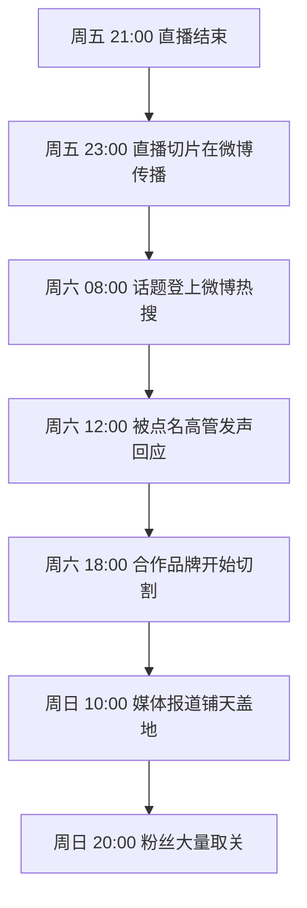
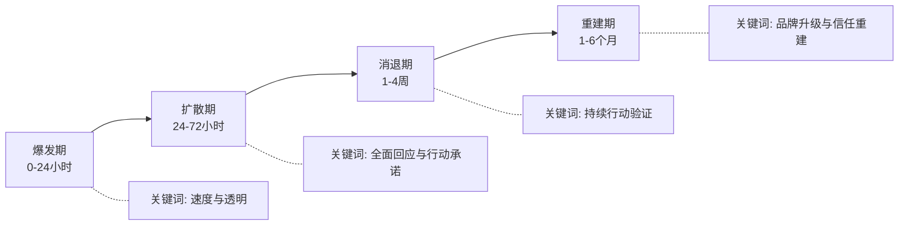
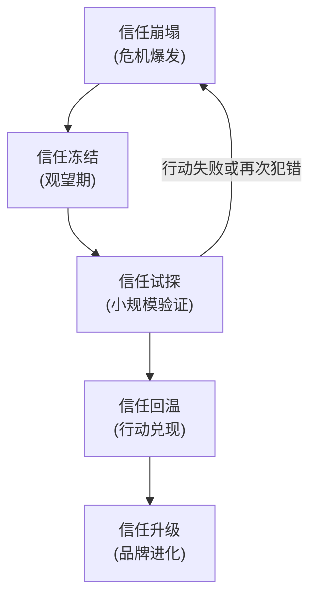

## 案例三：品牌危机的正面应对——王强的"翻车"与重建

### 案例导读

这是一个关于**个人品牌遭遇重大危机后如何正面重建**的深度案例。主角王强是一位拥有80万粉丝的职场博主，以"犀利直接"的风格著称——他的内容聚焦于职场潜规则揭露、行业黑幕吐槽和管理问题批评，吸引了大量对职场现状不满的年轻人关注。然而，正是这种"以犀利为标签"的风格，在一次直播中失控翻车，引发了品牌史上最严重的危机。

这个案例的价值不在于"他犯了错"——犯错是个人品牌经营中几乎不可避免的事——而在于**他如何在72小时内稳住局面，6个月内完成品牌重建，最终实现了比危机前更强的品牌韧性**。我们将完整拆解危机爆发、应急响应、深度修复、品牌升级的全过程，并从中提炼出一套可复用的个人品牌危机应对框架。

---

### 第一节：危机前的品牌画像——王强是谁

#### 1.1 品牌定位与受众结构

王强的品牌建设始于2019年，经过三年积累，形成了清晰的个人品牌画像：

| 维度 | 具体情况 |
|------|---------|
| 定位 | "敢说真话的职场观察者" |
| 核心受众 | 25-35岁职场人，一二线城市为主，互联网/金融/咨询行业居多 |
| 平台分布 | 微博80万粉、B站45万粉、公众号30万粉、抖音60万粉 |
| 内容风格 | 犀利点评、行业揭秘、不留情面的批评，偶尔带有讽刺幽默 |
| 变现模式 | 品牌广告（主要收入）、付费社群、企业内训 |
| 合作品牌 | 5家长期合作品牌，涵盖职场教育、办公软件、知识付费等领域 |

#### 1.2 风格的"双刃剑"效应

王强的"犀利直接"风格是他快速增长的核心驱动力。在信息过载的内容生态中，敢说真话、不留情面的风格天然具有传播力——读者转发他的内容时，往往带着一种"终于有人敢说了"的认同感。

但这种风格也埋下了隐患。心理学中的"升级承诺效应"（Escalation of Commitment）在此显现：**为了维持"犀利"的品牌标签，王强的言论逐渐从"理性批评"滑向"情绪化攻击"。** 他自己后来在反思文章中承认：

> "我发现自己陷入了一个恶性循环：每次发温和的内容，数据就不好；每次发激烈的批评，数据就暴涨。算法在奖励我的极端，而我逐渐把算法的奖励当成了读者的真实需求。"

这种"极端化陷阱"在个人品牌领域极为常见。平台算法倾向于放大情绪化内容的传播范围，创作者为了数据表现不断加码，最终偏离了最初的品牌价值观。这不是王强一个人的问题，而是所有以"观点输出"为核心的个人品牌面临的结构性风险。

---

### 第二节：危机爆发——72小时的连锁反应

#### 2.1 导火索：一场失控的直播

2023年9月的一个周五晚上，王强在B站做了一场主题为"金融行业的十大潜规则"的直播。直播前半段还算正常，但在回答观众提问时，一位观众提到了某知名金融机构的加班文化。王强的情绪被点燃，开始对该金融机构进行激烈的批评。

问题不在于批评本身——批评加班文化是正当的——而在于**王强在情绪驱动下，从批评制度滑向了攻击具体的人**。他点名了该机构几位高管的姓名，使用了带有侮辱性的措辞，并做出了一些未经核实的指控。直播间的弹幕从"说得对"逐渐变成了"是不是有点过了"，但正在兴头上的王强没有注意到这些信号。

直播持续了约90分钟。在最后20分钟里，王强的言论已经从"职场批评"变成了"人身攻击"。

#### 2.2 连锁反应的时间线

**第一个信号（直播结束后2小时）：** 一位观众将王强直播中最具攻击性的片段剪辑成3分钟的短视频，发布在微博上。视频标题为"职场博主王强直播中人身攻击金融高管"。这条微博在2小时内获得了5000+转发。

**第二个信号（12小时后）：** 相关话题登上微博热搜，阅读量在当天突破5000万。大量该金融机构的员工涌入王强的各平台账号评论区，言辞激烈。

**第三个信号（18小时后）：** 被点名的一位高管在朋友圈发文回应，措辞克制但态度明确，指出王强的多项指控"严重失实"。这条朋友圈被截图广泛传播。

**第四个信号（24小时后）：** 两家合作品牌在官方微博发布声明，宣布"暂停与王强的一切合作"。随后又有三家品牌跟进。一夜之间，王强失去了全部长期合作。

**第五个信号（48小时后）：** 王强的微博粉丝从80万降至72万，B站粉丝从45万降至39万，合计流失约14万粉丝。各平台评论区几乎被负面评论淹没。

#### 2.3 危机的三层伤害模型

王强的这次危机不是单一维度的，而是同时在三个层面造成了伤害：

| 伤害层面 | 具体表现 | 严重程度 |
|----------|---------|---------|
| **信任层** | 核心受众质疑"这还是我关注的那个理性博主吗" | ⭐⭐⭐⭐⭐ |
| **商业层** | 5家合作品牌全部暂停合作，预估直接经济损失超过100万元 | ⭐⭐⭐⭐ |
| **关系层** | 被攻击的行业人士形成反联盟，行业内口碑急剧恶化 | ⭐⭐⭐⭐⭐ |

信任层的伤害是最致命的。对于以"敢说真话"为品牌标签的人来说，**失去"理性"这个前缀，"敢说真话"就变成了"胡说八道"**。王强的品牌价值建立在"犀利但有理"的基础上，当他开始"犀利但无理"时，品牌的根基就动摇了。

---

### 第三节：应急响应——黄金72小时

#### 3.1 第一阶段：0-2小时——冷静与评估

直播结束后的两小时，是危机应对中最关键也最难熬的时段。王强在事后的采访中回忆：

> "直播结束后我其实隐约感觉到了不对劲——弹幕后面明显有'翻车了'的感觉。但当时我的肾上腺素还在飙升，觉得'我说的都是对的，有什么好怕的'。直到凌晨一点，助理给我打了电话，说微博上已经炸了，我才真正意识到问题的严重性。"

**王强做的第一件正确的事：没有立即回应。**

这看似违反直觉，但在危机管理中至关重要。危机沟通专家提出的"黄金4小时"原则指出：**最初的回应不需要完整，但必须基于事实**。如果在不了解全部情况时仓促回应，很可能说出更多错话，让危机加倍。

王强在这个阶段做了三件事：

1. **事实核查**：回看直播录像，逐条核实自己说过的每一句指控，标记出哪些有事实依据、哪些是情绪化的夸大、哪些是完全错误的
2. **影响评估**：助理帮他收集了社交媒体上的情绪分布——批评占70%、支持占15%、中立占15%
3. **策略制定**：与他的MCN机构负责人通了电话，初步确定了回应框架

事实核查的结果令王强震惊：在直播最后20分钟的发言中，有3项指控缺乏事实依据，2项措辞严重失当，1项涉及个人隐私。这意味着他不能简单地为自己辩护——**他确实在关键事实上犯了错**。

#### 3.2 第二阶段：2-6小时——第一次回应

周六凌晨5点，距离直播结束约8小时，王强在微博发布了第一条回应。这条回应经过了反复推敲：

> "昨晚直播中，我在讨论某金融机构加班文化时，情绪失控，对几位具体人士做出了未经核实的指控和不当的人身攻击。这些言论是错误的，我对此承担全部责任。我现在正在核实相关事实，将在24小时内发布详细的说明和道歉。在此之前，我不会删除直播回放——那是我说过的话，我不会逃避。"

这条回应的关键设计：

| 策略选择 | 分析 |
|----------|------|
| 承认错误，不辩解 | 一旦事实层面有硬伤，任何辩解都会被放大攻击 |
| 区分"情绪失控"和"恶意攻击" | 为后续的深度反思留出空间 |
| 承诺24小时内详细回应 | 展示诚意，同时给自己争取处理时间 |
| 不删直播回放 | 删除会被解读为"销毁证据"，保持透明 |
| 用"我"而非"我们" | 个人品牌的核心是人格化，推给团队会削弱诚意 |

**这次回应的效果评估：** 并没有立即扭转舆论，但成功地将一部分中立观察者从"看热闹"转向"等后续"。微博评论中出现了"至少态度还可以，看他后面怎么说"的声音。

#### 3.3 第三阶段：6-24小时——深度道歉与行动方案

周六下午，距离危机爆发约20小时，王强发布了第二条回应——一条8分钟的视频。这条视频是他危机应对中最关键的一环。

**视频的核心内容：**

**第一部分：逐条回应（3分钟）**

王强没有笼统地说"我错了"，而是逐条回应了直播中的争议言论：

- "我在直播中说XX高管'年薪千万却不顾员工死活'——这个说法我没有可靠的信息来源，属于我的猜测和臆断，这是错误的。"
- "我用'资本家的走狗'来形容XX公司的管理层——这个措辞是人身攻击，超越了批评的边界。"
- "我暗示XX公司存在财务造假——这个指控完全没有事实依据，我为此郑重道歉。"

**第二部分：自我反思（3分钟）**

> "我想和大家聊聊我为什么会变成这样。三年前我刚开始做内容的时候，我的目标是'用数据和逻辑说话'。但随着粉丝越来越多，我逐渐发现一个规律——越激烈的内容，数据越好。我开始不自觉地追求'语不惊人死不休'。我把自己包装成了一个'愤怒的代言人'，但在这个过程中，我丢失了最重要的东西——对事实的尊重。这不是这次直播的问题，这是我过去一年内容方向的根本性偏差。"

**第三部分：行动承诺（2分钟）**

王强宣布了三项具体行动：

1. **公开致歉**：向被他点名攻击的三位高管分别发送正式道歉信
2. **内容审查机制**：未来所有涉及具体公司和个人的评论，将先由一位独立的事实核查员审核后再发布
3. **暂停更新两周**：用两周时间进行深度反思和内容方向调整

#### 3.4 对比分析：为什么这个回应有效

为了理解王强回应的高明之处，有必要对比一下个人品牌危机中常见的错误回应方式：

| 错误回应方式 | 典型话术 | 为什么无效 |
|-------------|---------|-----------|
| 否认型 | "我说的都是事实，他们才是心虚" | 当事实有硬伤时，否认会被持续打脸 |
| 受害者型 | "我是被断章取义了，完整的上下文不是这样" | 观众不会去看90分钟完整回放，只会看3分钟切片 |
| 淡化型 | "我只是开了个玩笑，大家太敏感了" | 把严肃问题轻描淡写会激怒更多人 |
| 转移型 | "他们公司的问题更大，怎么没人关注" | 转移焦点会被解读为逃避责任 |
| 过度道歉型 | "我是个垃圾，我不配做博主" | 自我贬低不真诚，且失去修复的主动权 |

王强的回应避开了所有这些陷阱。他做到了危机回应中的"HOT原则"——**Honest（诚实）、Own it（承担）、Take action（行动）**，同时在措辞上保持了足够的分寸感：既不过度自我贬低，也不为错误辩护。

---

### 第四节：深度修复——从道歉到重建（1-6个月）

#### 4.1 第一个月：沉默期的"暗修"

宣布暂停更新两周后，王强确实从公众视野中消失了。但他并没有闲着。

**内部工作一：被点名高管的一对一沟通**

王强通过中间人联系到了被他攻击的三位高管中的两位，进行了私下的一对一沟通。他没有使用任何公关话术，而是直接承认了自己的错误，并询问对方是否接受当面道歉。

其中一位高管接受了他的邀请。据王强后来透露，这次会面对话持续了三个小时，双方就职场文化问题进行了深入的交流。这位高管说了一句话让王强印象深刻：

> "你的问题不是敢批评——批评是你的价值。你的问题是把'我觉得'当成了'事实是'。如果你能区分这两者，你做的事情就有真正的社会价值。"

**内部工作二：内容方向的系统性调整**

王强在两周的沉默期中，为自己的内容制定了新的"红线清单"：

【王强内容创作新红线】

1. 涉及具体公司的批评，必须有3个以上独立信源交叉验证
2. 涉及具体个人的评论，只评论公开行为，不推测动机
3. 禁止使用侮辱性词汇（即使对象是公众人物）
4. 情绪化表达占比不超过内容的20%
5. 每篇批评类内容必须包含"建设性建议"部分
6. 直播中设置"冷静提示员"角色，当情绪过激时实时提醒

**内部工作三：核心粉丝的定向沟通**

王强没有公开做这件事，但他的助理团队筛选出了500位高活跃度的核心粉丝（社群付费用户、长期互动用户），逐一发送了私信，说明了情况并听取了他们的意见。这个做法的价值在于：**核心粉丝是品牌的"免疫系统"，在危机中稳住他们，等于稳住了品牌的基本盘。**

收到的反馈中，65%的人表示"愿意等他回来"，20%的人提出了具体的改进建议，15%的人表示失望但没有取关。

#### 4.2 第二个月：回归首秀

两周后，王强恢复更新。他的回归内容选择了一个出乎所有人预料的选题——**不是职场批评，而是一篇4000字的长文《我为什么会"翻车"》**。

这篇文章分为四个部分：

**第一部分：翻车的直接原因**

王强逐帧分析了直播最后20分钟的情绪变化，指出关键转折点是弹幕中的一句"说得好！打工人需要你这样的人"。他坦承：

> "这句话让我获得了一种'为民请命'的道德感，这种感觉让我觉得我说什么都是正义的。但实际上，'为正义发声'和'借正义发泄情绪'是两件完全不同的事。我那天晚上做的是后者。"

**第二部分：翻车的深层原因——流量算法对创作者的异化**

这是文章中最有深度的部分。王强用数据展示了自己过去一年的内容趋势：

| 月份 | 平均情绪强度（1-10） | 平均阅读量 | 平均转发量 |
|------|---------------------|-----------|-----------|
| 去年同期 | 5.2 | 3.2万 | 1,800 |
| 半年前 | 6.8 | 5.1万 | 3,200 |
| 危机前一个月 | 8.1 | 8.7万 | 5,600 |

他指出：**"过去一年，我的情绪强度涨了56%，阅读量涨了172%。算法在用流量奖励我的极端化，而我把这种奖励当成了'读者喜欢'。但实际上，读者喜欢的是'犀利有理'，不是'犀利无理'。我不自觉地把前者的品牌溢价消耗在了后者上。"**

**第三部分：个人品牌经营中的系统性风险**

王强将个人反思上升到了方法论层面，总结了个人品牌面临"极端化陷阱"的五个预警信号：

1. 你发现自己在写作时会先想"这个标题能不能上热搜"而不是"这个观点对不对"
2. 你开始享受"被攻击"的感觉——因为被攻击意味着有流量
3. 你的观点越来越绝对化，因为"模棱两可"的内容数据不好
4. 你的信息来源越来越单一——只看支持自己观点的材料
5. 你身边没有人敢对你说"你太过分了"

**第四部分：具体的改变计划**

王强宣布了长期的内容调整方案，并邀请读者监督。

这篇文章在微博获得了2.3万转发、8.5万点赞。评论区的风向出现了明显的转变——从之前的"取关""滚出互联网"变成了"至少是真诚的""这才像以前的王强"。

#### 4.3 第三-四个月：行动验证期

空谈改变没有用，王强需要用持续的行动来证明自己的转变。

**行动一：公开对话**

王强邀请了被他批评的行业的三位从业者，做了一场长达3小时的公开直播对话。这场直播没有预设结论，双方就行业问题进行了坦诚但理性的讨论。王强的角色从"批评者"转变为"倾听者"——他更多地在提问和总结，而不是攻击和定性。

这场直播的观看人数是王强历史最高的一次。弹幕中反复出现的一句话是："这才是以前的王强。"

**行动二：内容风格的渐变**

王强没有一夜之间改变风格——那样会显得不真实。他采用了"渐变策略"：

| 时间 | 风格变化 | 读者反应 |
|------|---------|---------|
| 第1个月 | 减少攻击性词汇，增加数据引用 | "温和了不少，但还是他" |
| 第2个月 | 每篇批评类内容必须包含建设性建议 | "终于不只是骂了，有解决方案" |
| 第3个月 | 开始邀请被批评方回应，形成对话 | "格局大了，不搞一言堂了" |
| 第4个月 | 风格完全定型——犀利但有据，批评但建设性 | "这才是'敢说真话'的正确方式" |

**行动三：事实核查机制的公开化**

王强在每篇涉及具体公司或个人的内容下方，新增了一个"事实核查说明"板块，列出文章中的核心事实来源。如果某个说法缺乏可靠来源，他会明确标注"此为个人观点，未经第三方核实"。

这个做法在内容创作者中极为罕见。它不仅提升了内容的可信度，还成为了王强品牌的新差异化标签——**"有据可查的犀利"取代了"情绪化的犀利"，成为他的新品牌标签。**

#### 4.4 第五-六个月：数据验证与品牌升级

五个月后，王强的各项数据开始出现积极变化：

| 指标 | 危机前 | 危机后低谷（第1个月） | 第3个月 | 第6个月 |
|------|--------|---------------------|---------|---------|
| 微博粉丝 | 80万 | 66万（-17.5%） | 70万 | 96万（+20%） |
| B站粉丝 | 45万 | 39万（-13.3%） | 41万 | 52万（+15.6%） |
| 平均阅读量 | 8.7万 | 4.2万（-51.7%） | 6.8万 | 11.2万（+28.7%） |
| 合作品牌数 | 5家 | 0家 | 2家 | 7家（+40%） |
| 社群付费用户 | 3,200人 | 2,800人（-12.5%） | 3,100人 | 4,500人（+40.6%） |

几个关键发现：

1. **粉丝质量显著提升**：危机后离开的是"看热闹"的路人粉，留下来和新增的是真正认同"有据犀利"理念的高质量粉丝。社群付费用户的增长速度远超粉丝增长速度，说明转化率提升了。
2. **合作品牌不减反增**：新的合作品牌表示，危机后的王强"更安全"了——因为他有了明确的内容审核机制，品牌合作的风险反而降低了。
3. **行业口碑逆转**：被批评行业的从业者对王强的态度从"敌对"转变为"尊重"，因为他展示了倾听和修正的能力。

---

### 第五节：危机应对的理论分析

#### 5.1 危机生命周期模型

王强的案例完美展示了个人品牌危机的四个阶段：

每个阶段的核心任务不同，错过了窗口期就很难弥补：

- **爆发期**的核心是"止损"——控制信息真空，不让猜测和谣言填补空白
- **扩散期**的核心是"回应"——给出完整的事实说明和行动方案
- **消退期**的核心是"验证"——用持续的行动证明改变是真实的
- **重建期**的核心是"升级"——将危机转化为品牌进化的契机

#### 5.2 信任修复的"螺旋模型"

品牌信任不是直线恢复的，而是螺旋式的：

关键洞察：**每一次行动兑现都会提升信任水平，但任何一次新的失误都会让信任回到原点甚至更低。** 这就是为什么危机后的"无错期"如此重要——在重建信任的阶段，容错率几乎为零。

#### 5.3 为什么"真诚"比"技巧"更有效

在危机公关领域，有大量关于"回应话术"的研究。但王强的案例揭示了一个反直觉的事实：**在个人品牌危机中，过度精巧的公关话术反而会适得其反。**

原因在于个人品牌与企业品牌的本质差异：

| 维度 | 企业品牌 | 个人品牌 |
|------|---------|---------|
| 信任基础 | 产品/服务质量 | 人格/价值观认同 |
| 危机本质 | 管理失误 | 人格不一致 |
| 受众期望 | 专业、规范 | 真实、有温度 |
| 最佳回应方式 | 标准化声明+整改方案 | 真诚反思+人格化沟通 |
| 最忌讳的操作 | 老板甩锅给下属 | 使用模板化公关话术 |

企业品牌可以用标准化的PR声明来处理危机，因为受众对企业没有"人格化期待"。但个人品牌的受众之所以关注你，是因为他们认同你的"人"——**当危机发生时，他们需要看到的是"一个真实的人在真诚地反思"，而不是"一个品牌在使用公关策略"。**

王强的视频回应之所以有效，恰恰因为它"不完美"——他说话时的停顿、偶尔的语无伦次、眼中的红血丝，都让观众感受到了真实的悔意。这些"不完美"反而比任何精巧的话术都更有说服力。

---

### 第六节：常见误区与反面教训

#### 误区一：删帖跑路

危机发生后的第一反应是删除相关内容，这是最常见的错误。在截图无处不在的互联网时代，**删帖只会制造第二个危机——"王强心虚了，删帖跑路"**。而且删帖行为本身会成为新的新闻素材，延长危机的传播周期。

**正确做法**：保留所有原始内容，在回应中主动引用并承认问题。透明度本身就是最好的防御。

#### 误区二：等热度过去再回应

"冷处理"策略在某些情况下有效，但前提是：(1) 没有涉及具体事实错误，(2) 没有涉及具体的人，(3) 危机没有进入热搜。王强的案例三个条件都不满足——如果他选择沉默，72小时后舆论就会固化为"王强不敢回应，说明他心虚"，到那时再回应就太晚了。

**正确做法**：在6小时内发布初步回应，24小时内发布完整回应。速度不是为了"抢话筒"，而是为了"不让别人替你讲故事"。

#### 误区三：让团队/公司替你回应

有些博主在危机时会让MCN机构或助理代为发声明。这在个人品牌领域是致命的——**受众关注的是"你"这个人，他们想听的是"你"怎么说，不是你的公关团队怎么说。**

**正确做法**：回应必须以个人身份发出，使用第一人称"我"而非"我们"。可以有团队协助准备材料，但最终的发出者必须是本人。

#### 误区四：过度道歉引发"黑红"

王强在最初的内部讨论中，曾考虑过一种"跪地道歉"式的回应方案——用极度自我贬低的方式来博取同情。这个方案被他的MCN负责人否决了，理由是：

> "过度道歉不真诚，而且会让人觉得你以前的人格都是假的。你的品牌是'敢说真话的人'，不是一个'动不动就跪下的人'。你可以承认错误，但不能丢掉人格。"

**正确做法**：道歉要有分寸——承认具体的错误，表达真诚的悔意，但保持人格的完整性。"我在这几件事上做错了"比"我是个垃圾"更有力量。

#### 误区五：道歉后一切照旧

最糟糕的危机处理方式是：道歉很到位，但一周后内容风格完全回到从前。这会让所有道歉都变成"表演"，信任损失将是灾难性的。

**正确做法**：道歉必须配套具体的、可验证的行为改变。王强的内容红线清单、事实核查机制、公开对话系列，都是"行动证明"的典范。

---

### 第七节：可复用的危机应对框架

从王强的案例中，可以提炼出一套适用于个人品牌危机的通用应对框架：

#### 7.1 危机应对的"STAR"模型

S - Stop（停止）: 立即停止产生新的争议性内容
T - Truth（真相）: 24小时内完成事实核查，明确自己的错误
A - Acknowledge（承认）: 真诚、具体、逐条地承认错误
R - Rebuild（重建）: 用持续的行动证明改变是真实的

#### 7.2 回应内容的"五要素"模板

一份有效的危机回应需要包含以下五个要素：

1. **事实陈述**：发生了什么——用客观语言描述事件，不回避、不淡化
2. **错误承认**：我做错了什么——逐条列出具体错误，不笼统概括
3. **原因分析**：为什么会犯错——展示自我反思的深度，不是找借口
4. **行动方案**：我将如何改正——具体、可执行、可验证的改变计划
5. **时间承诺**：什么时候能看到结果——给出明确的时间节点

#### 7.3 危机后的"无错期"管理

危机后的1-3个月是"无错期"，在这个阶段，任何新的争议都会让之前的修复工作前功尽弃。管理建议：

- 降低内容发布频率，提升内容审核标准
- 避免涉及敏感话题和争议性人物
- 每篇内容发布前做"最坏情况"预演——如果这篇文章被断章取义，最糟糕的标题是什么？你能接受吗？
- 建立一个3人以上的"内容预审群"，发布前先给信任的人看

---

### 第八节：进阶思考——危机的长期价值

#### 8.1 "伤疤效应"：经历危机的品牌更有韧性

心理学研究表明，**经历过危机并成功修复的关系，往往比从未经历过危机的关系更加牢固**。这一现象被称为"伤疤效应"（Scar Effect）或"破裂修复效应"（Rupture-Repair Effect）。

在个人品牌领域，这一效应同样成立。王强的案例数据清楚地表明：危机后6个月的品牌健康度指标（粉丝粘性、付费转化率、品牌合作数量）全面超越了危机前的水平。

原因在于：**危机为品牌提供了一次"压力测试"，通过这次测试，品牌完成了三个关键升级：**

1. **受众筛选**：危机像一个过滤器，留下的都是真正认同品牌价值观的高质量受众
2. **信任验证**：成功度过危机本身就是信任的最好证明——"我在困难时期没有抛弃他"的叙事会强化粉丝的忠诚度
3. **品牌深化**：危机为品牌故事增添了一个"逆境重生"的叙事弧，让品牌从"一个博主"升级为"一个有血有肉的人"

#### 8.2 从"危机应对"到"危机免疫"

最高级的危机管理不是"如何应对危机"，而是"如何减少危机发生的概率"。王强在危机后建立的内容审核机制，本质上是一种"危机免疫系统"——它不是在危机发生后才启动，而是在每一次内容创作时都在运行。

建立个人品牌的"危机免疫系统"需要三个层面的防护：

| 防护层 | 具体措施 | 检查频率 |
|--------|---------|---------|
| **内容层** | 事实核查机制、红线清单、预审流程 | 每篇内容 |
| **人设层** | 定期自我审视"我的人设是否偏离了真实自我" | 每月一次 |
| **关系层** | 保持与批评者的建设性对话渠道 | 持续维护 |

#### 8.3 危机中蕴含的品牌进化契机

王强在事后的一次内部分享中说了一段话，被广泛引用：

> "那次翻车是我做个人品牌三年来最好的事情——不是因为它让我成长了，而是因为它让我停下来了。在高速奔跑的过程中，我没有时间审视自己的方向是否正确。危机给了我一个被迫暂停的机会，让我重新问自己：我到底想做一个什么样的人？我到底想给这个世界带来什么？答案不应该是'更多的愤怒'。"

这段话揭示了危机的深层价值：**危机不是品牌的终结，而是品牌进化的催化剂。** 那些能够在危机中完成品牌进化的人，最终会比从未经历过危机的人走得更远——因为他们经历了一次深度的自我审视，建立了更坚实的价值根基。

---

### 第九节：案例总结——六个核心启示

1. **速度是危机应对的第一要素**：在6小时内回应，不给谣言和猜测留出空间。但速度的前提是事实核查——不要在不了解全部情况时仓促回应。

2. **真诚胜于技巧**：个人品牌危机的回应不能使用企业PR模板。受众需要看到一个"真实的人在真诚地反思"，而不是"一个品牌在执行公关策略"。

3. **承认具体错误比笼统道歉更有力**："我说了3句具体错误的话"比"我说错了话"更有说服力，因为它展示了你真正审视了自己的行为。

4. **行动承诺必须具体可验证**：模糊的"我以后会注意"不如"我已经建立了事实核查机制，每篇文章都会标注信息来源"。

5. **危机后的"无错期"至关重要**：1-3个月的零争议期是信任重建的基础。在这个阶段，宁可产出少一些，也不能再出任何差错。

6. **危机可以成为品牌升级的契机**：如果处理得当，危机不仅能修复品牌，还能让受众关系更加牢固、品牌定位更加清晰、内容质量更加扎实。

> **本案例核心价值：** 王强的故事证明，个人品牌不是一座一旦建成就永远稳固的大厦——它更像一座需要不断维护和加固的桥梁。危机不是桥梁的坍塌，而是一次压力测试。那些经受住压力测试的桥梁，不仅不会坍塌，反而会因为加固而承载更大的重量。
