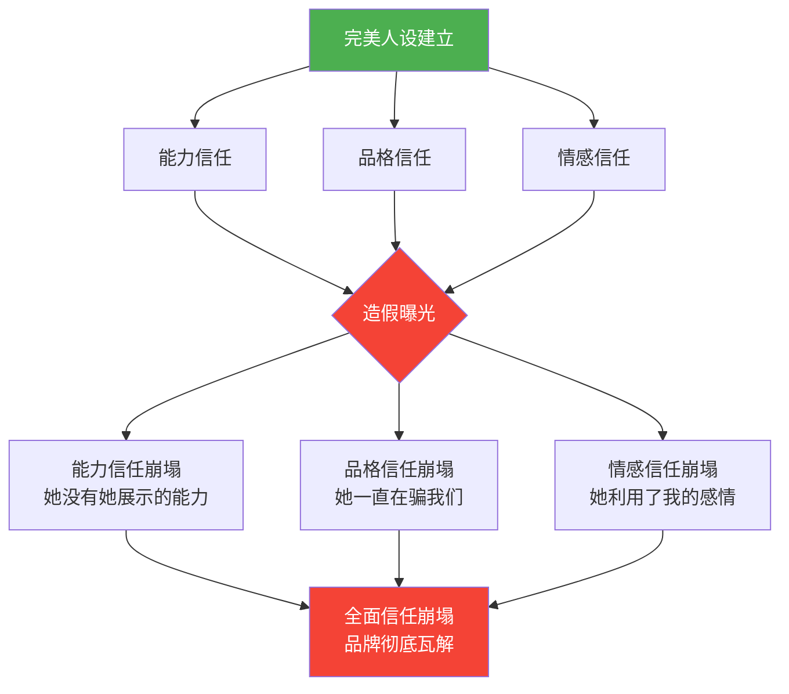

## 案例四：失败案例——"完美人设"的崩塌

> "建立在沙子上的城堡，无论多美，潮水一来就会倒塌。"

在个人品牌建设的众多失败模式中，"完美人设崩塌"是最常见、最具破坏力的一种。它不同于偶发的言论失误或策略偏差——它从一开始就埋下了崩塌的种子，因为它的根基不是真实，而是精心构建的幻象。本案例将深入剖析这种失败模式的完整链条：从构建、维持、到崩塌，以及背后的深层心理机制。

### 4.1 案例背景：赵雪的"精致人生"

赵雪，28岁，2019年开始在小红书运营个人账号，定位为"精致生活方式博主"。她的内容围绕都市女性的日常——精致早餐、高级穿搭、家居美学、旅行见闻。每一张照片都经过专业修图，每一段视频都有精心设计的镜头语言和背景音乐。

经过两年的持续运营，赵雪积累了50万粉丝，成为小红书生活方式领域的中腰部博主。她与多个美妆、家居、时尚品牌建立了长期合作关系，月均商业收入稳定在8-12万元。

从表面数据来看，赵雪的个人品牌建设是成功的：粉丝黏性高、互动率优于同类博主、商业转化效果良好。但这一切都建立在一个脆弱的基础之上——**她的线上形象与真实生活之间存在着巨大的鸿沟**。

### 4.2 崩塌始末：从偶遇到雪崩

#### 第一阶段：导火索（第1天）

2022年3月的一个周六下午，一位粉丝在北京三里屯太古里偶遇赵雪。在粉丝的认知中，赵雪应该永远是那个妆容精致、穿搭考究、气质优雅的形象。然而眼前的真实赵雪——素面朝天、穿着普通卫衣和运动裤、头发随意扎起、整个人看起来疲惫而普通——与线上形象形成了强烈的反差。

这位粉丝拍下了照片，发在了自己的小红书账号上，配文："在三里屯偶遇赵雪，和视频里完全不一样诶……这是同一个人吗？"

这条笔记在发布后的6小时内获得了2000多个点赞和500多条评论。评论区迅速分为两派：一派认为"博主也是普通人，线下不化妆很正常"；另一派则开始质疑"那她平时发的内容都是假的吧？"

#### 第二阶段：连锁反应（第2-7天）

偶遇事件本身并不致命——大多数理智的粉丝可以理解"线上与线下有差距"。但问题是，这条笔记像一颗石子投入湖面，激起了连锁反应。

一位自称"前合作摄影师"的用户发帖爆料：赵雪的所有"日常vlog"都是经过专业团队拍摄的，每条视频的成本在5000-15000元之间，远非她声称的"自己用手机拍的"。

另一位美食博主指出，赵雪的多道"独家菜谱"与自己两年前发布的菜谱高度相似，只是更换了摆盘和滤镜。

一位曾经的造型师团队成员透露，赵雪的"个人穿搭分享"实际上由3人造型团队操刀，每套搭配的成本在3000-8000元之间。

更致命的是，有人挖出了赵雪三年前的社交媒体账号，发现她早期的内容风格、审美水平、甚至语言表达方式都与现在截然不同——暗示她的"品味"和"审美能力"也是后天团队打造的结果。

#### 第三阶段：信任崩塌（第2-4周）

随着爆料的不断积累，公众的情绪从"好奇"迅速转向"愤怒"。愤怒的核心不是赵雪"不够完美"，而是**她系统性地欺骗了粉丝**。

具体来说，粉丝感到被欺骗的点包括：

| 赵雪的声明 | 被曝光的真相 | 欺骗性质 |
|-----------|-------------|---------|
| "这些都是我自己在家做的早餐" | 有专业厨师代做，拍摄后大部分倒掉 | 能力造假 |
| "今天这套穿搭花了不到500元" | 单品均价3000+，由造型团队搭配 | 消费误导 |
| "这条vlog是周末随手拍的" | 专业团队拍摄，拍摄耗时一整天 | 过程造假 |
| "这是我原创的家居改造方案" | 参考了多个设计师的现成方案 | 原创性造假 |
| "我和大家一样，就是个普通女孩" | 背后有完整的MCN团队运营 | 身份造假 |

关键在于，赵雪的整个品牌叙事都建立在"我是一个品味出众的普通女孩，通过自己的努力过上了精致生活"这个核心命题上。当上述造假被逐一揭露，这个核心命题就彻底瓦解了——她不是"普通女孩"，她的"品味"是团队打造的，她的"努力"是商业包装。

#### 第四阶段：商业崩塌（第2-3个月）

粉丝的愤怒迅速传导到商业层面。

**数据变化**：
- 第1周：粉丝数从50万降至45万（-10%）
- 第2周：新增爆料导致粉丝加速流失，降至35万（-30%）
- 第1个月：粉丝降至20万（-60%），互动率从4.2%降至0.8%
- 第2个月：粉丝降至12万（-76%），多个品牌宣布终止合作
- 第3个月：粉丝稳定在10万左右（-80%），月均商业收入从8-12万降至不足5000元

**品牌方的反应**同样值得关注。三家主要合作品牌在事件爆发后的两周内先后发布声明，宣布"终止与赵雪的合作关系"。其中一家美妆品牌的声明写道："我们选择合作伙伴的首要标准是真实性和可信度。基于近期事件，我们决定终止与赵雪女士的合作。"

值得注意的是，品牌方的反应速度远快于普通粉丝的取关速度——这说明在商业合作中，"信任风险"的敏感度远高于个人情感层面。

### 4.3 深层分析：为什么"完美人设"必然崩塌？

#### 4.3.1 信任的脆弱性悖论

在本章"个人品牌的信任机制"部分，我们讨论了信任的三层模型：能力信任、品格信任、情感信任。赵雪的案例恰好展示了当信任建立在虚假基础上时，三层信任会如何同时崩塌。

**能力信任的崩塌**：当粉丝发现赵雪的"品味"和"审美"是团队打造的，而非她个人的能力，她在粉丝心中从"有品味的人"变成了"被包装出来的商品"。这直接摧毁了能力信任——人们不再相信她真的具备她所展示的那些能力。

**品格信任的崩塌**：系统性的造假行为（不仅是偶尔的修饰，而是长期的、全面的虚构）严重损害了品格信任。粉丝不仅不再相信她的能力，更不再相信她说的任何话。一位粉丝的评论具有代表性："我现在回头看她之前所有的内容，都觉得是假的。甚至她的眼泪和笑容，我都分不清是真的还是演的。"

**情感信任的崩塌**：最深层的伤害在于，赵雪通过"普通女孩"的叙事与粉丝建立了情感连接。许多粉丝关注她，不仅是因为她的内容好看，更是因为她的故事给了她们"我也可以"的希望。当这个故事被证明是虚构的，粉丝感到的不仅是失望，更是被利用和被背叛——"她利用了我的信任和情感来赚钱"。

#### 4.3.2 "完美"本身就是风险

赵雪的案例揭示了一个反直觉的真理：**"完美人设"不是品牌的资产，而是品牌的负债**。

原因在于"完美"设立了一个不可能持续维持的标准。一旦你向公众展示了"完美"的形象，你就被锁定在一个永无止境的表演中——任何瑕疵的暴露都会被视为"欺骗"。

对比来看，一个始终保持"真实但努力"形象的博主，偶尔展现生活中的不完美（素颜、失败的尝试、真实的挣扎），反而建立了更坚固的信任基础。因为受众的预期是"真实的"，所以即使看到不完美的一面，也不会感到被欺骗。

这可以用"预期管理"的框架来理解：

| 人设类型 | 受众预期 | 真实暴露时的影响 | 信任韧性 |
|---------|---------|----------------|---------|
| 完美人设 | "她就是那么完美" | "她一直在骗我" → 信任崩塌 | 极低 |
| 真实人设 | "她是一个真实的人" | "她果然和我们一样" → 信任加强 | 高 |
| 成长人设 | "她在不断变好" | "她也有低谷，但在努力" → 情感共鸣 | 最高 |

#### 4.3.3 从众心理与"网络审判"

赵雪案例中一个值得注意的现象是：崩塌的速度和烈度远超造假本身的严重程度。偶遇照片本身并不足以摧毁一个50万粉丝的账号，但当连锁反应启动后，崩塌的速度呈指数级增长。

这背后是几个心理学机制的叠加：

**确认偏误（Confirmation Bias）**：一旦有人开始质疑赵雪的真实性，所有后续的信息都会被放在"她可能是假的"这个框架下解读。那些原本可以被善意理解的细节（比如灯光好、角度好），现在都被视为"刻意造假"的证据。

**群体极化（Group Polarization）**：当评论区的主流意见从"好奇"转向"愤怒"时，持温和立场的人会因为害怕被攻击而沉默（沉默螺旋效应），而愤怒的声音会越来越极端。最终形成的"网络共识"比任何个体的判断都更加严厉。

**道义愤怒的快感（Moral Outrage Pleasure）**：研究表明，参与"网络审判"会激活大脑的奖励回路。揭穿一个"骗子"不仅让人感到正义，还带来一种"我比她聪明，我没被骗"的优越感。这种快感驱使更多人加入"扒皮"行列，形成正反馈循环。

**背叛感的放大效应**：当一个人感到被欺骗时，他不仅会愤怒于具体的欺骗行为，还会重新审视过去所有与欺骗者相关的经历，并将其全部重新定义为"欺骗"。一位粉丝的话很能说明这种心理："我现在回想起来，她之前每次说'这是我自己做的'，我都觉得恶心。那种信任感被辜负的感觉太难受了。"

#### 4.3.4 数字时代的"人设脆弱性"

赵雪的案例不仅是一个个体的失败，更折射出数字化时代个人品牌建设的结构性挑战。

在传统媒体时代，公众人物的形象管理相对简单——你只需要在有限的曝光渠道（电视、杂志、公开活动）中保持一致的形象。受众接触到的信息有限，"翻车"的概率也相对较低。

但在社交媒体时代，情况完全不同：

**信息不对称几乎消失**：任何认识你的人都可能在任何时间曝光你的真实状态。一个偶遇、一张抓拍、一段随手录的视频，都可能成为"翻车"的导火索。赵雪的崩塌始于一张粉丝随手拍的照片——这在传统媒体时代几乎不可能发生。

**考古能力被极度放大**：互联网是有记忆的。你三年前的账号、五年前的发言、十年前的照片，都可能被挖出来与现在的形象进行对比。赵雪早期的社交媒体账号被挖出，直接证明了她的形象是"后天打造"的——这种跨时间线的对比在传统媒体时代很难实现。

**受众从被动接收变为主动审查**：社交媒体赋予了受众前所未有的"审查权"。他们不仅是信息的接收者，更是信息的验证者。任何一个"疑点"都可能引发集体调查——而这种集体调查的效率和深度，往往超过传统媒体的调查报道。

### 4.4 赵雪可以做什么？——复盘与替代方案

#### 4.4.1 事前：从一开始就应该做什么

如果时间可以倒流，赵雪最应该做的不是"更精致地造假"，而是**从根本上改变品牌的定位策略**。

**方案一：定位为"专业内容创作者"而非"普通女孩"**

赵雪完全可以在一开始就坦诚自己有团队支持。许多成功的博主都公开承认自己有专业团队——这不仅不损害品牌，反而可以成为品牌的一部分："我投入了专业资源，就是为了让你们看到最好的内容。"

这种定位的关键差异在于：它不依赖于"我是普通人"的叙事，而是依赖于"我能创造优质内容"的能力。能力是可以持续展示和验证的，而"普通人"的叙事一旦被戳破就无法修复。

**方案二：采用"成长型"叙事**

另一种策略是将品牌建立在"成长"的基础上。赵雪可以分享自己从"不会做饭"到"学会做精致早餐"的过程，从"穿搭小白"到"逐渐找到自己风格"的旅程。这种叙事允许不完美，甚至将不完美作为故事的一部分——"看，我也不完美，但我在变好。"

**方案三：设定"真实底线"**

无论采用什么定位策略，都需要一条不可逾越的底线：**不编造事实**。修饰照片是可接受的，但声称"这是素颜"就是编造事实。团队创作是可以的，但声称"这是我自己做的"就是编造事实。

#### 4.4.2 事中：崩塌发生时如何应对

假设赵雪在偶遇照片事件爆发后，立即采取以下措施，结果会如何？

**第一步：24小时内直接回应（而非沉默）**

赵雪在事件爆发后选择了沉默，试图等风波过去。这是一个致命的错误。根据本章"危机沟通策略"中的HOT原则（Honest诚实、Own it承担、Take action行动），她应该在24小时内发布一段真诚的视频回应。

回应示例框架：

> "关于最近大家讨论的事情，我想直接回应。
>
> 是的，我的很多内容背后有专业团队的支持。我之前没有坦诚这一点，这是我的错误。我为我的不诚实道歉。
>
> 我的初衷是想给大家呈现最好的内容，但我在追求'完美'的过程中迷失了——我把'被看到的形象'置于'真实的自己'之上。这违背了我一开始做内容的初心。
>
> 从今天开始，我会在每条内容中标注哪些部分有团队参与，也会更多地分享真实的、不那么完美的自己。
>
> 对于那些感到被欺骗的粉丝，我理解你们的失望。我不请求原谅，但我希望用接下来的行动来重新赢得信任。"

**第二步：用行动证明改变**

道歉只是第一步。更重要的是后续的行动——在接下来的3-6个月中，持续展示"改变后的真实"。例如：

- 发布"幕后揭秘"系列，展示内容创作的真实过程
- 开启"素颜日记"，定期分享不加修饰的日常
- 邀请粉丝参与内容创作，增加互动的真实性
- 在商业合作中标注"本内容为商业合作"

**第三步：接受损失，着眼长期**

即使采取了上述措施，赵雪仍然不可避免地会失去大量粉丝。但关键在于：留下来的粉丝是真正认同"真实"价值观的忠实粉丝，他们的长期价值远高于那些因为"完美幻象"而关注的粉丝。

#### 4.4.3 事后：能否重建？

一个自然的问题是：赵雪的品牌能否重建？

答案取决于两个关键变量：

**变量一：造假的严重程度**

赵雪的造假不是"照片修得太过了"这种程度的问题，而是系统性地虚构了整个生活方式。这种严重程度的造假，重建信任的难度极大。参考信任机制中的"慢建立、快破坏"规律，破坏的信任需要3-5倍的时间才能修复。

**变量二：重建的方向**

如果赵雪试图重新回到"精致生活方式博主"的定位，几乎不可能成功——因为这个定位已经被彻底污染了。但如果她能彻底转型，例如转向"内容创作者的幕后故事"或"真实生活记录"，或许还有机会。前提是：这次的定位必须100%建立在真实的基础上。

**参考案例**：国内外都有"人设崩塌后成功转型"的案例，但这些案例有一个共同特点——崩塌的原因不是"系统性造假"，而是"言行失误"或"价值观冲突"。系统性造假是最难修复的信任破坏类型，因为它直接攻击了品格信任的根基。

### 4.5 从个案到规律：完美人设崩塌的通用模式

赵雪的案例虽然具体，但其背后的模式具有普遍性。以下是"完美人设崩塌"的通用识别框架和预防机制。

#### 4.5.1 崩塌的典型模式

通过对多个类似案例的分析，我们可以总结出"完美人设崩塌"的五个典型阶段：

**阶段1：过度承诺**

一切始于一个看似无害的决定："我要展示最好的自己。"但"最好的自己"很快滑向"不是自己的自己"。在这个阶段，当事人通常没有意识到自己在"造假"——她们认为自己只是在"包装"和"美化"。

**阶段2：持续加码**

一旦"完美形象"建立起来，维持它就需要持续投入。每一条新内容都必须达到之前设定的标准，甚至更高。这导致一个恶性循环：为了维持形象，需要越来越多的虚构；而越来越多的虚构又增加了被揭露的风险。

**阶段3：裂缝出现**

维持完美形象的难度随着时间推移呈指数级增长。总有某个时刻，某个不可控的因素（偶遇、旧照、前员工爆料等）打破了精心维护的幻象。

**阶段4：连锁反应**

一旦第一个裂缝出现，公众的注意力就会转向"还有哪些是假的"。此时，所有过去被善意解读的细节都会被重新审视。每一条新的爆料都会强化"她一直在骗我们"的叙事，形成雪崩效应。

**阶段5：全面崩塌**

当积累的证据超过某个临界点，公众的判断会从"她有些地方不够真实"转变为"她这个人就是假的"。此时，信任修复几乎不可能——因为被质疑的不再是某个具体行为，而是整个品牌存在的合法性。

#### 4.5.2 自检清单：你的品牌是否有"崩塌风险"？

以下是一个实用的自检工具，用于评估个人品牌的"崩塌风险"：

□ 你的线上形象与线下状态的差距有多大？（1-10分，7分以上为高风险）
□ 你是否有意隐瞒了某些真实情况？（团队支持、收入来源、真实状态等）
□ 你的内容中有多大比例是"修饰过的真实"vs"完全虚构"？
□ 如果你的"幕后过程"被完整公开，你是否能坦然面对？
□ 你的品牌价值是否过度依赖于某个不可持续的"设定"？
□ 你是否在不同场合/平台展现了互相矛盾的形象？
□ 是否有知道你"真实面"的人存在？（前员工、前合作方、亲友）
□ 你是否定期审查自己的内容，确保没有"过度承诺"？

如果以上问题中有3个以上让你感到不安，你的品牌可能正处于"崩塌风险区"。

#### 4.5.3 "真实度光谱"：从修饰到造假的边界

不是所有的"美化"都是造假。问题的关键在于**边界在哪里**。以下是一个"真实度光谱"，帮助你判断哪些行为是可接受的修饰，哪些已经越过了红线：

| 行为 | 真实度 | 风险等级 | 判断 |
|------|--------|---------|------|
| 使用滤镜美化照片 | 高 | 低 | 可接受——这是行业通用做法 |
| 选择最佳角度和光线拍摄 | 高 | 低 | 可接受——这是内容创作的基本功 |
| 隐藏不想展示的细节（乱糟糟的背景） | 中 | 低 | 可接受——选择性展示不等于造假 |
| 声称照片是"素颜"但实际化了淡妆 | 中 | 中 | 灰色地带——取决于受众的预期 |
| 声称"自己做的"但实际是团队做的 | 低 | 高 | 越线——这是能力造假 |
| 编造不存在的经历或成就 | 无 | 极高 | 严重越线——这是事实造假 |
| 声称"普通人"但实际有MCN全包运营 | 低 | 高 | 越线——这是身份造假 |

核心原则：**修饰是可接受的，但声明必须真实**。你可以用滤镜让照片更好看，但你不能声称"这是没有滤镜的"。你可以有团队支持，但你不能声称"这都是我一个人做的"。

### 4.6 更广泛的行业反思

#### 4.6.1 MCN机构的责任

赵雪的案例不仅是个人的失败，也暴露了MCN机构在"完美人设"构建中的推波助澜作用。

许多MCN机构的商业模式建立在"造人设"之上——它们为签约博主提供从定位、内容策划、拍摄制作到商业变现的全流程服务。这本身无可厚非，但问题在于：当MCN机构为了商业利益而鼓励甚至要求博主"虚构人设"时，它实际上是在为主播埋下定时炸弹。

一个负责任的MCN机构应该在签约初期就与博主明确以下原则：

- 团队支持可以公开，不需要隐瞒
- 人设必须与博主的真实性格有交集
- 不编造事实，不虚构经历
- 定期进行"人设一致性"审查

#### 4.6.2 受众的合理预期

在反思赵雪案例时，我们也需要审视受众的预期是否合理。

一个不可否认的事实是：**所有社交媒体内容都是经过筛选和编辑的**。没有人会在网上展示自己生活的全部——每个人都在做某种程度的"人设管理"。要求博主展示100%的真实，既不现实，也不合理。

但合理的预期应该是：**博主不会系统性地编造事实**。修饰照片是合理的，但声称"素颜"就是编造；有团队支持是合理的，但声称"一个人做的"就是编造。

受众也需要培养"媒体素养"——理解社交媒体内容的本质是"经过编辑的叙事"，而非"未经修饰的真实"。这不意味着要接受造假，而是要建立合理的预期，避免将"不完美"误读为"欺骗"。

#### 4.6.3 平台的角色

社交媒体平台在"完美人设"现象中扮演着复杂的角色。

一方面，平台的算法倾向于推荐"完美"的内容——精美的照片、戏剧化的故事、引人注目的标题。这在客观上激励了博主追求"完美"，甚至走向"过度包装"。

另一方面，平台对"虚假信息"的打击力度通常不足。当博主被揭露造假时，平台很少采取实质性行动（如降权、标注、封号）。这在客观上传递了一个信号：造假的成本很低。

理想状态下，平台应该建立更完善的"真实性标注"机制——例如，允许博主主动标注"本内容有团队参与"或"本照片经过后期处理"，并给予主动标注的博主一定的流量倾斜。

### 4.7 关键启示与行动框架

从赵雪的案例中，我们可以提炼出以下核心启示：

**启示一：人设可以高于现实，但不能脱离现实**

适度包装是策略，完全虚构是风险。关键在于"修饰"和"造假"的边界——你可以让真实变得更好看，但你不能用虚构替代真实。

**行动建议**：在发布任何内容前，问自己一个问题——"如果有人看到了这件事的全部真相，我会感到尴尬吗？"如果答案是"会"，那么你可能已经越过了边界。

**启示二：品牌的根基应该是"不可伪造的价值"**

赵雪的品牌价值建立在"外在形象"上——精致的照片、高级的穿搭、完美的生活。这些全部是可以被团队打造的，因此也是可以被质疑的。

真正坚固的品牌价值建立在"不可伪造"的基础上：专业能力（你真的懂这个领域）、独特观点（你真的有独立思考）、真实经历（你真的经历过这些）。这些是别人无法复制、无法伪造的。

**行动建议**：审视你的品牌价值中，有多少是"可伪造的"（外在形象、生活方式），有多少是"不可伪造的"（专业能力、独特观点）。如果前者占比超过50%，你的品牌可能存在结构性风险。

**启示三：留有"不完美"的空间**

一个看起来"太完美"的品牌，反而比一个有适度瑕疵的品牌更脆弱。因为"太完美"会激发受众的怀疑心理——"怎么可能有人这么完美？"——而一旦怀疑产生，任何细节都会被放在显微镜下审视。

适度展现真实的、不完美的自己，不仅不会损害品牌，反而能增加品牌的可信度和亲和力。受众愿意与一个"真实的、有缺点但努力变好"的人建立连接，而不是与一个"完美但冰冷的假人"建立连接。

**行动建议**：定期发布"不完美"的内容——失败的尝试、真实的挣扎、学习的过程。这不仅能降低"崩塌风险"，还能增加与受众的情感连接。

**启示四：信任是"慢资产"，不要为短期利益透支它**

信任的建设需要长时间的积累，但破坏只需要一瞬间。在每一次内容决策中，都应该问自己："这个决定是在积累信任，还是在透支信任？"

**行动建议**：建立一个"信任审计"的习惯——每个月回顾自己过去一个月的内容，评估每条内容对信任的影响。如果发现有"透支信任"的内容，及时修正。

**启示五：危机应对的速度和真诚度决定命运**

即使"翻车"已经发生，应对的方式仍然至关重要。赵雪的致命错误之一是在危机爆发后选择了沉默。根据危机沟通策略中的时间线原则，沉默超过6小时就会被解读为"默认"——而赵雪的沉默持续了数天。

如果她在24小时内发布一段真诚的回应，承认错误并承诺改变，结果可能会完全不同。王强的案例（案例三）已经证明了：真诚的危机应对不仅能修复品牌，甚至能让品牌实现升级。

### 4.8 延伸思考：从"人设"到"人格"

赵雪的案例最终指向一个更深层的问题：**个人品牌应该建立在"人设"之上，还是"人格"之上？**

"人设"（Persona）是一个被设计出来的公共形象，它可能与真实的自己有交集，但本质上是一个产品。"人格"（Personality）是真实的、内在的自我，它不需要设计，只需要被表达。

建立在"人设"之上的品牌，需要持续的维护和投入，而且永远存在"被戳穿"的风险。建立在"人格"之上的品牌，不需要维护——因为你只需要做你自己——而且不存在"被戳穿"的风险，因为没有什么需要隐藏。

当然，"做自己"不意味着"不加修饰"。每个人都需要在公共表达中进行某种程度的筛选和编辑。但关键在于：**筛选的应该是"哪些真实的自己值得展示"，而不是"虚构一个不是自己的自己"**。

从"人设思维"转向"人格思维"，是个人品牌建设中最根本的范式转变。赵雪的案例告诉我们：在信息高度透明的数字时代，"人设"的保质期越来越短，而"人格"的价值越来越持久。

> "你的品牌不是你希望别人认为你是谁，而是你实际上是谁。当这两者之间的差距消失时，你的品牌就是坚不可摧的。"

***
