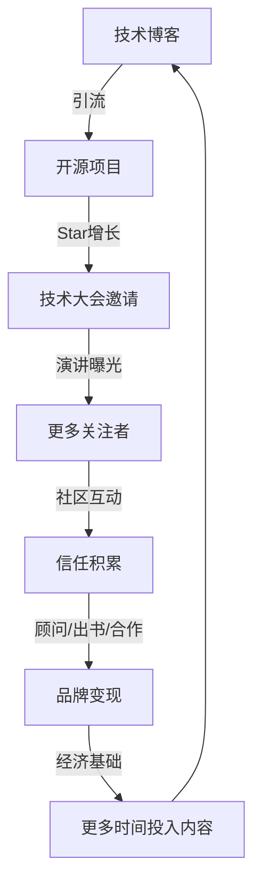

## 案例五：B2B领域的个人品牌——陈工的技术影响力之路

> B2B领域的个人品牌建设有其独特逻辑：决策链长、信任门槛高、专业壁垒深。本案例完整拆解一位云计算工程师如何用两年时间，从行业透明人成长为拥有3万+关注者的技术意见领袖，期间系统性地展示了技术写作、开源贡献、社区运营三大支柱的协同效应。

### 背景与起始状态

陈工，某中型云计算公司高级工程师，负责分布式存储系统的架构设计。工作六年，技术功底扎实——曾主导设计过支撑日均10亿次请求的存储集群，处理过多次线上P0级故障。但在行业层面，他几乎没有任何可见度。

**起始状态诊断：**

| 维度 | 现状 | 问题 |
|------|------|------|
| 技术能力 | 深入理解分布式系统、存储引擎、一致性协议 | 能力未被外部认知 |
| 行业影响力 | 零——无技术博客、无开源项目、无会议分享 | 无品牌资产积累 |
| 社交网络 | 仅公司内部同事和技术群中少数好友 | 信息茧房严重 |
| 时间精力 | 除本职工作外，每周可投入8-10小时 | 需要高效分配 |
| 经济投入 | 初期零预算，后期可投入少量资金购买域名和服务器 | 需低成本启动 |

**B2B领域个人品牌的特殊挑战：**

与消费端（To C）不同，B2B领域的个人品牌建设面临三重障碍：

1. **受众窄但决策链长**：目标受众是技术决策者（CTO、架构师、技术总监），他们理性、信息获取渠道固定、信任建立需要长期积累
2. **内容门槛高**：技术内容必须经得起同行检验，任何错误都会被迅速放大和传播，一次错误可能毁掉数月的品牌积累
3. **变现路径长**：从内容到变现的转化周期远长于消费端领域，需要耐心和持续投入

陈工清楚认识到这些挑战后，制定了一个为期两年的分阶段计划。

### 品牌定位：找到差异化锚点

#### 定位分析框架

陈工在确定品牌定位前，做了系统性的自我分析和市场扫描：

**第一步：能力盘点——我能写什么？**

能力矩阵评估：
┌─────────────────────────────────────────────────────┐
│  深度精通          广度了解                          │
│  ·分布式一致性协议  ·Kubernetes生态                   │
│  ·存储引擎设计      ·云原生架构模式                    │
│  ·性能调优          ·DevOps实践                       │
│  ·故障诊断          ·服务网格                          │
│  ·容量规划          ·可观测性                          │
└─────────────────────────────────────────────────────┘

**第二步：市场扫描——别人在写什么？**

陈工花了两周时间，系统梳理了国内技术内容生态：

- **掘金/InfoQ**：偏实战教程和框架对比，原创深度分析较少
- **知乎技术话题**：碎片化严重，缺乏系统性深度内容
- **微信公众号**：大量"XX分钟入门"类快餐内容，深度文章稀缺
- **GitHub**：英文内容主导，中文技术深度内容有明显空白

**第三步：差异化定位——我的独特价值是什么？**

经过反复推敲，陈工确定了核心定位：

> **"用通俗语言解释复杂技术的工程师"**

这个定位精准击中了一个痛点：技术深度和表达通俗性之间存在巨大鸿沟。大多数技术专家写的文章要么太浅（入门教程），要么太深（论文风格），能同时做到"深"且"易懂"的人极其稀少。

**定位的核心差异化要素：**

| 普通技术博主 | 陈工的定位 |
|-------------|-----------|
| 翻译英文文档或整理现有知识 | 从第一性原理出发，用自己的理解重新解释 |
| 堆砌技术术语显得专业 | 用生活类比降低理解门槛，但不牺牲深度 |
| 写"怎么做" | 写"为什么这样做"以及"为什么不用其他方案" |
| 代码片段不完整 | 提供完整可运行的代码，附带详细注释 |
| 结论导向 | 过程导向——展示思考路径而非只给答案 |

**定位验证——"外卖配送"测试：**

陈工用一个简单的方法验证定位的可行性：尝试用外卖配送的逻辑来解释分布式一致性协议（Raft）。他发现：

- 外卖骑手 = 节点（Node）
- 餐厅出餐 = 客户端写请求
- 骑手之间的协调 = Leader选举
- 订单状态同步 = 日志复制
- 骑手超时重新分配 = 故障转移

这个类比测试让他确信：深度技术内容完全可以做到通俗易懂，关键在于找到正确的生活映射。

### 四步执行策略详解

#### 第一步：技术博客——内容为王的长期主义

##### 平台选择与矩阵布局

陈工没有把鸡蛋放在一个篮子里，而是采用了"主阵地+分发网络"的策略：

**主阵地：掘金 + 知乎专栏**

选择掘金的原因：
- 技术社区氛围好，用户质量高
- 推荐算法对新作者相对友好
- 支持Markdown，代码高亮完善
- 有"掘力值"等激励体系

选择知乎的原因：
- 搜索引擎收录好，长尾流量大
- 问答形式容易切入具体问题
- 专业认证体系有助于建立权威性

**分发网络：**
- 微信公众号：沉淀核心读者，方便后续深度运营
- GitHub Pages：建立个人技术博客，掌握内容自主权
- 少数派/SegmentFault：扩大覆盖面

##### 内容生产体系

陈工建立了一套可持续的内容生产流程：

**选题来源（四象限法）：**

                    高频率问题
                        │
          ┌─────────────┼─────────────┐
          │  日常问题    │  高频痛点    │
          │  （素材储备） │  （优先选题） │
          ├─────────────┼─────────────┤
          │  冷门知识    │  行业趋势    │
          │  （偶尔为之） │  （热点跟踪） │
          │             │             │
          └─────────────┼─────────────┘
                        │
                    低频率问题
     低价值 ←─────────────────────→ 高价值

选题优先级：高频痛点 > 行业趋势 > 日常问题 > 冷门知识

**具体选题渠道：**

1. **工作中的真实问题**：每次解决一个技术难题，都是潜在的选题。陈工在工作中遇到的问题，往往也是行业共同的痛点
2. **社区高频提问**：在Stack Overflow、GitHub Issues、技术群中反复出现的问题，天然具有高需求
3. **技术文档的"翻译"需求**：官方文档往往晦涩难懂，用通俗语言重新解读是一片蓝海
4. **技术方案对比**：同类技术的深度对比分析，是技术决策者最需要的内容类型
5. **故障复盘**：线上故障的根因分析和解决方案，兼具实用性和故事性

**文章结构模板（CPSA模型）：**

陈工总结了一套适合技术深度文章的结构：

Context（背景）：这个问题在什么场景下会出现？
Problem（问题）：具体遇到了什么困难？为什么困难？
Solution（方案）：如何解决？为什么选择这个方案？
Analysis（分析）：方案的原理是什么？有哪些权衡？

附加模块：
├── 代码示例（完整可运行）
├── 性能对比数据
├── 常见误区
└── 延伸阅读

**一篇爆款文章的完整解剖——《Raft一致性协议：用外卖配送理解分布式共识》：**

这篇文章成为陈工的第一篇"爆款"，获得了掘金首页推荐和5000+阅读量。文章结构如下：

一、你点的外卖是如何保证送到的？（引入问题，建立类比）
   ├── 外卖配送的挑战 = 分布式系统的挑战
   └── 为什么需要"一致性"？（用外卖丢失/重复场景解释）

二、Raft的核心思想：选一个"站长"来统一管理（Leader选举）
   ├── 骑手之间的协调问题
   ├── 候选人机制（类比：骑手自荐当站长）
   ├── 投票规则（类比：少数服从多数）
   └── 任期机制（类比：站长任期制）

三、日志复制：订单如何同步给所有人？（Log Replication）
   ├── Leader接收客户端请求
   ├── 日志条目分发给所有Follower
   ├── 多数确认后提交
   └── 完整代码示例（Python实现，120行）

四、故障处理：骑手失联了怎么办？（Leader故障转移）
   ├── 心跳检测机制
   ├── 重新选举流程
   ├── 数据一致性保证
   └── 实际生产环境中的配置建议

五、Raft vs Paxos：为什么工业界选择了Raft？（方案对比）
   ├── 可理解性对比
   ├── 工程实现难度对比
   ├── 业界采用情况对比
   └── 性能基准测试数据

六、动手实验：用30行代码搭建一个Raft集群（实操）
   ├── 环境准备
   ├── 完整代码
   ├── 运行演示
   └── 故障注入测试

这篇文章成功的关键因素：
- **类比准确且贯穿全文**：不是开头用一下类比就抛弃，而是整个解释过程都维持这个隐喻
- **深度不打折**：虽然是"通俗"风格，但涵盖了Raft的所有核心机制，包括选举超时、日志压缩、成员变更等进阶内容
- **代码完整可运行**：提供了从零搭建Raft集群的完整代码，读者可以直接复制运行
- **有实验精神**：文章末尾提供了故障注入实验，让读者亲手验证理论

**写作节奏与时间管理：**

陈工的每周内容生产时间分配：

| 任务 | 时间 | 说明 |
|------|------|------|
| 选题调研 | 1小时 | 浏览社区热点，筛选值得写的主题 |
| 大纲编写 | 1小时 | 确定文章结构和关键论点 |
| 初稿写作 | 3小时 | 核心内容产出，集中精力时间段 |
| 代码编写与测试 | 2小时 | 确保代码示例完整可运行 |
| 修改润色 | 1小时 | 语言打磨、逻辑检查、排版优化 |
| 合计 | 8小时 | 每周一篇深度文章的稳定节奏 |

##### 内容质量控制清单

每篇文章发布前，陈工会用以下清单自检：

```markdown
## 发布前自检清单

### 内容层面
- [ ] 是否有明确的目标读者定位？
- [ ] 是否有清晰的问题定义？
- [ ] 理论解释是否准确无误？（交叉验证至少2个来源）
- [ ] 代码示例是否完整可运行？（在干净环境中测试通过）
- [ ] 是否有性能数据或对比分析支撑论点？
- [ ] 是否涵盖了常见误区和注意事项？
- [ ] 是否提供了进一步学习的路径？

### 表达层面
- [ ] 类比是否准确且容易理解？
- [ ] 技术术语首次出现时是否有解释？
- [ ] 段落长度是否适中？（避免超长段落）
- [ ] 标题层级是否清晰？
- [ ] 图表是否有助于理解？

### 格式层面
- [ ] 代码块是否标注了语言类型？
- [ ] 表格是否对齐？
- [ ] 图片是否有说明文字？
- [ ] 链接是否有效？
```

#### 第二步：开源贡献——用代码说话的硬实力

##### 开源项目选择策略

陈工没有盲目地从零开始造轮子，而是采用了"两条腿走路"的策略：

**策略一：向成熟项目贡献代码（积累信誉）**

选择贡献目标的三个标准：
1. 项目活跃度高（最近一个月有合并的PR）
2. 有标记为"good first issue"或"help wanted"的任务
3. 与自己的技术栈相关

陈工选择了三个项目进行贡献：
- **etcd**：贡献了文档改进和一个小型bug修复，共4个PR被合并
- **TiKV**：参与了性能优化相关的讨论，提交了2个PR
- **Prometheus**：修复了一个边缘case的bug，改进了一个exporter的文档

**策略二：创建自己的开源项目（建立品牌资产）**

陈工基于工作中的经验，创建了一个分布式缓存工具——CacheX。项目的定位是：轻量级、易集成、性能优先的本地缓存框架，支持多级缓存和自动过期策略。

**CacheX项目的设计哲学：**

核心原则：
├── 零依赖：不引入任何第三方依赖，降低集成成本
├── 类型安全：完整的泛型支持，编译期类型检查
├── 可观测：内置指标采集，方便接入Prometheus
└── 渐进式：核心功能简单，高级功能按需启用

架构设计：
┌─────────────────────────────────────┐
│          CacheX API层              │
├─────────────────────────────────────┤
│    L1 本地缓存    │   L2 远程缓存   │
│  （ConcurrentHashMap） │ （Redis适配） │
├─────────────────────────────────────┤
│         过期策略引擎                │
│  （LRU/LFU/TTL/自适应）            │
├─────────────────────────────────────┤
│         指标采集层                  │
│  （命中率/延迟/内存使用）            │
└─────────────────────────────────────┘

##### 开源项目的运营策略

创建项目只是第一步，持续运营才是关键：

**README的艺术——项目的第一印象：**

CacheX的README经过精心设计：

```markdown
# CacheX 🚀

> 轻量级、高性能的分布式缓存框架，让你的缓存策略像搭积木一样简单。

## 为什么选择CacheX？

| 特性 | CacheX | 本地缓存 | Redis |
|------|--------|----------|-------|
| 延迟 | <1ms | <1ms | 1-5ms |
| 依赖 | 零 | 零 | Redis服务 |
| 多级缓存 | ✅ | ❌ | ❌ |
| 自动过期 | ✅ | 部分 | ✅ |
| 可观测性 | 内置 | 需自行实现 | 需插件 |

## 30秒快速开始
[代码示例]

## 性能基准测试
[Benchmark数据和图表]

## 谁在使用CacheX？
[用户列表，逐步积累]
```

**版本发布节奏：**

- 每两周一个小版本（bug修复和小改进）
- 每月一个次版本（新功能）
- 每季度一个主版本（架构优化或重大特性）

**Issue管理策略：**

- 每个Issue都认真回复，即使是最基础的问题
- 使用标签系统清晰分类：bug/enhancement/question/good-first-issue
- 对于有价值的Feature Request，公开讨论设计方案，让社区参与决策
- 设置Issue模板，引导用户提供必要信息

**贡献者引导：**

陈工写了一份详细的CONTRIBUTING.md：

贡献流程：
1. Fork项目
2. 创建特性分支（feat/xxx 或 fix/xxx）
3. 编写代码和测试
4. 确保CI通过
5. 提交PR，填写PR模板
6. 等待Code Review
7. 修改后合并

Code Review标准：
- 代码风格符合项目规范
- 新增代码必须有对应测试
- 测试覆盖率不降低
- 文档同步更新（如涉及API变更）

##### 开源项目的增长曲线

CacheX的GitHub Star增长轨迹：

时间线        Star数    关键事件
─────────────────────────────────────────
第1个月       50       首次发布，技术群分享
第2个月       150      掘金文章引流
第3个月       300      被awesome-go收录
第6个月       800      第一个外部贡献者加入
第9个月       1500     某互联网公司生产环境采用
第12个月      2000+    技术大会分享推动爆发
第18个月      3500+    成为同类项目Star数前三

#### 第三步：技术演讲——从台下到台上的跨越

##### 演讲机会的获取路径

陈工的演讲之路并非一蹴而就，而是循序渐进：

**阶段一：内部分享（0-3个月）**
- 在公司内部技术分享会上做15分钟闪电演讲
- 选择自己最熟悉的话题，降低紧张感
- 录制视频，回看改进

**阶段二：线上分享（3-6个月）**
- 参与技术社区的线上Meetup
- 接受播客邀请做嘉宾（门槛更低，更轻松）
- 在B站/YouTube发布技术讲解视频

**阶段三：线下会议（6-12个月）**
- 主动向技术会议提交议题（Call for Papers）
- 从区域性的GDG（Google Developer Group）活动开始
- 逐步挑战更大的舞台：QCon、ArchSummit、GOTC

##### 演讲内容设计——故事线驱动

陈工坚持一个原则：**每个技术演讲都必须有一个"故事线"**，而不是堆砌幻灯片。

**"一个分布式缓存系统从诞生到成熟"的演讲结构：**

开场（5分钟）：一个真实的线上故障
├── "去年双十一，我们的缓存系统在流量洪峰下崩了"
├── 展示故障现场的监控截图
└── 抛出问题："怎么才能让缓存系统既快又稳？"

第一幕（15分钟）：从单机缓存到分布式缓存
├── 单机缓存的瓶颈（配合实际数据）
├── 一致性哈希的引入（用圆桌骑士的比喻）
├── CacheX的架构设计决策
└── 代码演示

第二幕（15分钟）：性能优化的三个阶段
├── 第一阶段：基础优化（序列化、压缩）
├── 第二阶段：高级优化（批量操作、Pipeline）
├── 第三阶段：架构优化（多级缓存、预加载）
└── 每个阶段的性能提升数据

第三幕（10分钟）：生产环境的"坑"与"解"
├── 缓存雪崩的预防策略
├── 缓存穿透的防护方案
├── 热点Key的处理方案
└── 真实的故障案例和解决方案

结尾（5分钟）：回到开头的问题
├── "今年双十一，缓存系统扛住了10倍流量"
├── 总结三个核心经验
└── 开源项目地址和社区入口

**幻灯片设计原则：**

- 每页幻灯片只传达一个核心信息
- 使用大字体（标题48pt，正文24pt以上）
- 代码示例用高亮标注关键行，而非展示完整代码
- 数据用图表而非数字罗列
- 每10分钟插入一个互动环节（提问、投票、小练习）

##### 演讲能力的刻意练习

陈工每周的练习计划：

| 练习内容 | 频率 | 方法 |
|----------|------|------|
| 录像回看 | 每次分享后 | 录制自己的演讲，回看分析语速、手势、眼神 |
| 即兴表达 | 每天10分钟 | 随机选一个技术概念，限时2分钟讲清楚 |
| 故事编写 | 每周1次 | 为同一个技术话题设计3种不同的叙事结构 |
| 观摩学习 | 每周看1个演讲 | 分析优秀技术演讲的结构和节奏 |

#### 第四步：技术社区运营——长期信任的积累

##### 社区选择与深耕策略

陈工选择了三个社区进行深耕：

**1. 技术微信群/QQ群（日常互动）**

选择加入的标准：
- 群人数在200-500人（太大容易水化，太小覆盖面不足）
- 群主有管理意识，定期清理广告和水群
- 话题以技术讨论为主

运营策略：
- 每天花30分钟浏览群消息，筛选有价值的问题
- 回答问题时给出完整思路，而非简单一句话答案
- 对于复杂问题，主动说"这个问题挺有意思，我写篇文章详细讲讲"
- 避免在群里自我推销，让价值输出自然引流

**2. Stack Overflow / SegmentFault（专业问答）**

运营策略：
- 专注于自己的专长领域（分布式系统、存储）
- 每个回答都力求成为该问题的"终极答案"
- 使用清晰的结构：问题分析 → 解决方案 → 原理解释 → 注意事项
- 长期坚持，积累领域内的高声望标签

**3. GitHub Discussions / Issues（开源社区）**

运营策略：
- 在自己项目的Issues中耐心回答每一个问题
- 在相关项目的Issues中提供有价值的见解（不硬推自己的项目）
- 参与技术方案的讨论和评审

##### 社区运营的时间管理

陈工严格控制社区运营的时间投入：

每日时间分配（总计约30-45分钟）：
├── 早上通勤（15分钟）：浏览技术群和邮件列表
├── 午休时间（10分钟）：回答1-2个简单问题
└── 晚上（15分钟）：处理GitHub通知，回复Issue

每周时间分配：
├── 周末集中2小时：回答积压的复杂问题
└── 每月1次：整理FAQ，更新文档

**关键原则：帮助他人是最好的品牌投资。** 陈工每周花3-4小时在社区中提供免费帮助，这些时间投入带来的回报是：

- 被帮助过的人会主动推荐他的博客和项目
- 回答问题的过程中发现自己知识的盲区，促进自我提升
- 建立起"乐于助人"的个人标签，这是最有力的品牌印象

### 成果与数据

两年后的成绩单：

| 指标 | 数值 | 说明 |
|------|------|------|
| 掘金关注者 | 12,000+ | 云计算领域Top 20博主 |
| 知乎关注者 | 8,000+ | 知乎"云计算"话题优秀回答者 |
| 微信公众号粉丝 | 5,000+ | 高质量技术读者群体 |
| GitHub Star | 3,500+（CacheX项目） | 同类项目排名前三 |
| 技术演讲 | 15+场 | 包括QCon、ArchSummit等一线会议 |
| 出版邀请 | 2家出版社 | 最终签约一本分布式系统实战书籍 |
| 技术顾问咨询 | 3家公司 | 每月2-4小时，带来额外收入 |
| 年度总收入增长 | 本职薪资+40% | 品牌溢价的直接体现 |

**品牌资产的飞轮效应：**



### 关键启示与方法论提炼

#### 启示一：技术领域的个人品牌更需要"翻译"能力

能把复杂的技术用通俗的语言讲清楚，这本身就是稀缺能力。大多数技术人要么写得太深（只有同行能看懂），要么写得太浅（沦为教程搬运工）。

**"翻译能力"的培养方法：**

1. **费曼学习法**：用教别人的方式检验自己的理解。如果你不能用简单的语言解释一个概念，说明你对它的理解还不够深
2. **类比思维训练**：为每个技术概念找到3个不同领域的生活类比，选择最准确的那个
3. **受众校准**：写完初稿后，找一个非目标领域的技术人阅读，看他们能否理解核心观点
4. **迭代优化**：根据读者反馈不断调整表达方式，记录哪些类比有效、哪些无效

#### 启示二：开源贡献是最有力的"作品集"

代码不会说谎，GitHub上的贡献记录是最有说服力的品牌资产。它比任何简历、证书、自我描述都更有说服力。

**开源贡献的品牌价值：**

- **可验证性**：任何人都可以查看你的代码质量、PR质量、Issue回复质量
- **持续性**：GitHub贡献图是一个长期的品牌展示板
- **网络效应**：好的开源项目会吸引其他优秀开发者，形成高质量的社交网络
- **技术深度展示**：开源项目是技术能力的完整体现，远超任何面试题

#### 启示三：免费帮助他人是最好的品牌投资

在社区中无偿帮助他人，建立的信任和口碑会以各种形式回报你。这种回报不是即时的，但却是复利增长的。

**信任积累的复利模型：**

信任值 = Σ(帮助质量 × 帮助频率 × 受众影响力) × 时间

每一次高质量的帮助都是在"信任账户"中存款：
- 简单问题的快速回答：小额存款，但频率高
- 复杂问题的深度分析：大额存款，建立专家形象
- 公开场合的主动帮助：乘数效应，旁观者也会积累信任

#### 启示四：B2B个人品牌的核心是"信任阶梯"

B2B领域的信任建立遵循一个明确的阶梯：

第四级：合作伙伴（顾问、出书、投资）
         ↑ 基于深度信任
第三级：行业专家（会议邀请、媒体报道）
         ↑ 基于专业认可
第二级：社区贡献者（开源维护、技术分享）
         ↑ 基于价值输出
第一级：内容消费者（阅读、关注、点赞）
         ↑ 基于内容发现

每一级的转化都需要时间和持续的价值输出，不可能跳跃式前进。

### 常见误区与纠正

#### 误区一：追求发布频率而牺牲质量

**错误做法**：为了保持"日更"或"周更"的节奏，降低内容质量标准。

**纠正**：宁可两周一篇深度文章，也不要每天一篇水文。技术领域的读者对质量的敏感度远高于频率。陈工的做法是：每周一篇，但每一篇都值得被收藏和分享。

**检验标准**：问自己"这篇文章发布后，我愿意在半年后还推荐给别人看吗？"如果答案是否定的，说明质量还不够。

#### 误区二：只写不互动

**错误做法**：只顾着写文章、做项目，不回复评论、不参与讨论。

**纠正**：内容是品牌的"产品"，互动是品牌的"服务"。再好的产品，没有好的服务也留不住用户。陈工坚持回复每一条有价值的评论，哪怕是质疑和批评。

**互动的原则：**
- 对正面反馈：感谢并邀请对方分享具体的应用场景
- 对技术质疑：认真回应，如果自己确实有误，大方承认并修正
- 对深度讨论：邀请对方私下继续交流，建立更深的连接

#### 误区三：过早追求变现

**错误做法**：刚有几百关注者就开始接广告、卖课、开付费社群。

**纠正**：B2B领域的信任建立需要时间，过早的商业化行为会损害品牌。陈工在第一年完全没有任何变现行为，专注于内容和社区贡献。直到第二年中期，当他积累了足够的行业认可后，才开始接受付费咨询和演讲邀请。

**变现时机的判断标准：**
- 是否有足够的内容资产（至少50篇高质量文章）？
- 是否有明确的行业认可（被邀请、被引用、被推荐）？
- 变现方式是否与品牌定位一致？
- 变现是否能为受众创造价值（而非只是收割流量）？

#### 误区四：忽视数据分析

**错误做法**：凭感觉判断内容效果，不做数据追踪。

**纠正**：建立数据追踪体系，用数据指导内容策略优化。

**陈工追踪的核心指标：**

| 指标 | 含义 | 追踪工具 |
|------|------|----------|
| 文章阅读量 | 内容的覆盖范围 | 掘金/知乎后台 |
| 阅读完成率 | 内容的吸引力 | 自建博客的Google Analytics |
| 收藏率 | 内容的价值认可 | 各平台后台 |
| 评论质量 | 读者参与深度 | 人工评估 |
| GitHub Star趋势 | 开源项目影响力 | GitHub Insights |
| 转化来源分析 | 哪些内容带来了关注 | UTM参数追踪 |

#### 误区五：模仿他人风格

**错误做法**：看到某个技术博主的成功，直接模仿他的写作风格和内容形式。

**纠正**：个人品牌的核心是"个人"，模仿只能学到皮毛，无法复制内核。陈工的成功不在于他的"外卖配送类比"，而在于他持续输出深度内容的能力和真诚帮助他人的态度。找到适合自己的风格，比模仿别人更重要。

**找到自己风格的方法：**
1. 多写，多试，在实践中发现自己最自然的表达方式
2. 关注读者反馈，哪些风格的文章更受欢迎
3. 保持一致性，一旦找到适合的风格就坚持下去
4. 允许风格随时间演进，但核心定位不变

### 进阶策略：从优秀到卓越

#### 策略一：建立个人知识体系

当内容积累到一定量级后，陈工开始构建系统化的知识体系：

分布式系统知识图谱：
├── 基础理论
│   ├── 一致性模型（强一致/最终一致/因果一致）
│   ├── 共识算法（Raft/Paxos/ZAB）
│   └── CAP/BASE理论
├── 存储引擎
│   ├── LSM-Tree原理与优化
│   ├── B+Tree vs LSM-Tree
│   └── 分布式存储架构
├── 缓存系统
│   ├── 多级缓存策略
│   ├── 缓存一致性方案
│   └── 热点Key处理
└── 实战案例
    ├── 电商秒杀系统设计
    ├── 分布式ID生成方案
    └── 海量数据迁移实践

这个知识体系既是写作的素材库，也是读者的学习路径。

#### 策略二：跨界内容创新

当技术内容达到一定深度后，陈工开始尝试跨界创新：

- **技术 × 管理**：如何做好技术团队的Code Review？
- **技术 × 商业**：为什么这个技术方案对公司业务有影响？
- **技术 × 职业发展**：从工程师到架构师需要哪些能力跃迁？

这些跨界内容帮助陈工吸引了更广泛的受众，也丰富了个人品牌的维度。

#### 策略三：构建个人品牌飞轮

当各个模块都运转起来后，它们之间会形成正向循环：

内容 → 关注者 → 社区 → 口碑 → 更多关注者
  ↑                                    │
  └──── 变现 ←── 机会 ←── 影响力 ←────┘

飞轮一旦转动起来，增长会越来越快。关键是在早期有足够的耐心，持续投入内容质量，等待飞轮转速达到临界点。

### 工具与资源推荐

#### 内容创作工具

| 工具 | 用途 | 推荐理由 |
|------|------|----------|
| Obsidian | 知识管理 | 双向链接，构建知识图谱 |
| Typora | Markdown写作 | 所见即所得，导出方便 |
| Excalidraw | 技术图表绘制 | 手绘风格，技术图表首选 |
| Mermaid | 流程图/架构图 | 代码生成图表，与文档无缝集成 |
| draw.io | 复杂架构图 | 功能全面，支持多种导出格式 |
| Carbon | 代码截图 | 美观的代码截图，适合社交媒体分享 |

#### 数据分析工具

| 工具 | 用途 | 推荐理由 |
|------|------|----------|
| Google Analytics | 网站流量分析 | 功能全面，免费 |
| GitHub Insights | 开源项目分析 | 了解Star/Fork/贡献者趋势 |
| Utterances | 文章评论 | 基于GitHub Issues，技术社区友好 |
| Plausible | 隐私友好的分析 | 轻量级，不追踪用户隐私 |

#### 演讲辅助工具

| 工具 | 用途 | 推荐理由 |
|------|------|----------|
| Marp | 演示文稿 | Markdown写幻灯片，程序员友好 |
| Reveal.js | Web演示 | 支持代码高亮、动画、嵌入 |
| OBS Studio | 录屏/直播 | 开源免费，功能强大 |
| Loom | 快速录屏 | 适合短视频分享和教程录制 |

### 总结

陈工的技术影响力之路，本质上是一个"价值输出 → 信任积累 → 品牌变现"的长期过程。他的成功不是因为某个单一的技巧或策略，而是因为：

1. **清晰的定位**：找到了"深度技术+通俗表达"的差异化定位
2. **持续的输出**：两年如一日地输出高质量内容
3. **真诚的态度**：始终以帮助他人为出发点，而非自我推销
4. **系统的方法**：内容、开源、演讲、社区四大支柱协同运转
5. **长期的耐心**：不急于变现，专注于信任积累

对于想要在B2B领域建立个人品牌的技术人来说，陈工的经历提供了一个可复制的框架：先找到自己的差异化定位，然后通过高质量内容建立专业认知，再通过社区互动积累信任，最终在足够的信任基础上实现品牌价值的变现。

记住：**个人品牌不是一天建成的，但每一天的投入都在为未来积累复利。**
