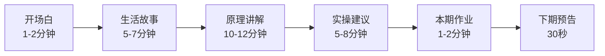
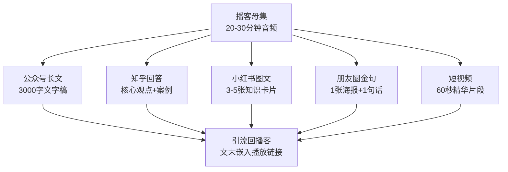

## 案例六：从0到1打造播客品牌——小林的声音创业

### 背景：为什么选择播客？

小林是一位拥有三年从业经验的心理咨询师。她在日常咨询中发现一个普遍现象：大量来访者对心理学有浓厚兴趣，但面对《社会心理学》《认知行为疗法》等专业书籍时，往往翻几页就放弃了——术语密集、理论抽象、缺乏生活场景的映射。与此同时，短视频平台上的心理学内容虽然流量大，但受限于时长，只能做碎片化的"冷知识"科普，很难传递系统的思维方式。

小林在2023年初做了一次小规模调研：在她的朋友圈（约800人）发起问卷，收到217份有效回复。结果显示：

| 内容形式 | 愿意长期关注 | 觉得"有深度" | 日常场景中方便消费 |
|---------|------------|------------|----------------|
| 短视频 | 68% | 12% | 91% |
| 公众号文章 | 45% | 54% | 37% |
| 播客 | 39% | 61% | 72% |
| 纸质书 | 22% | 83% | 14% |

播客虽然"愿意长期关注"的比例不是最高，但在"有深度"和"方便消费"两个维度上同时表现优异。结合她自身擅长口头表达、声音条件好的优势，小林决定用播客作为核心内容载体。

### 第一阶段：定位与差异化设计

#### 市场调研：找到切入点

小林没有盲目开播，而是花两周时间做了系统的竞品分析。她在小宇宙、Apple Podcasts、喜马拉雅三个平台上搜索"心理学"相关播客，逐一收听了排名前30的节目，记录了以下维度：

| 维度 | 记录内容 |
|------|---------|
| 主播背景 | 心理学教授/咨询师/爱好者/媒体人 |
| 节目风格 | 学术严肃/轻松聊天/故事叙事/访谈对话 |
| 单集时长 | 5分钟以下/5-15分钟/15-30分钟/30分钟以上 |
| 更新频率 | 日更/周更/双周更/不定期 |
| 评论区互动 | 听众提问类型、情感反馈、复购意愿 |

调研发现了三个关键空白：

1. **缺少"翻译者"角色**：学术派播客用术语讲术语，娱乐派播客只有段子没有理论，缺少能把专业概念"翻译"成日常语言的内容
2. **缺少固定结构**：多数心理学播客每期风格不一致，听众无法形成稳定预期
3. **缺少实操环节**：听完觉得"有道理"但不知道怎么做，知识留存率低

#### 品牌定位：一句话说清你是谁

小林最终确定的定位：

> **"用聊天的方式，让你听懂心理学"**

这句话包含三个核心信息：
- **"聊天的方式"**——定义了节目风格：轻松、平等、非说教
- **"让你听懂"**——定义了核心价值：降低理解门槛，不是炫耀专业
- **"心理学"**——定义了内容边界：只讲心理学，不做泛知识

品牌名定为**「心理茶话会」**——"茶话会"暗示轻松的聊天氛围，同时"心理"二字在前，确保搜索引擎和平台推荐能准确抓取关键词。

#### 视觉识别系统

小林请设计师朋友制作了一套简洁的品牌视觉：

- **封面**：暖棕色背景上一个简笔画茶杯，杯中冒出的蒸汽形成大脑轮廓，下方是节目名
- **色彩体系**：主色暖棕（#8B6914）、辅色米白（#F5F0E6）、强调色深红（#8B2500）
- **字体**：标题用思源黑体Bold，正文用苹方Regular
- **应用场景**：播客封面、公众号头图、社群海报、嘉宾邀请函使用统一视觉

### 第二阶段：内容体系搭建

#### 节目结构设计

小林为每期节目设计了固定的时间结构，让听众形成稳定的收听预期：

每个板块的作用和设计要点：

**1. 开场白（1-2分钟）**
- 用一句话抛出本期核心问题，制造好奇心
- 示例："你有没有过这样的经历——明明知道该早睡，却刷手机到凌晨两点？今天我们要聊的，就是你大脑里那个'唱反调'的声音到底是什么。"
- 忌讳：冗长的寒暄、无关的个人近况、反复念赞助商广告

**2. 生活故事（5-7分钟）**
- 用一个具体的人物故事引出话题，角色有名字、有场景、有冲突
- 故事来源：来访者经历（脱敏处理）、新闻事件、影视剧片段、自身经历
- 技巧：在故事高潮处戛然而止，留下悬念，自然过渡到原理讲解

**3. 原理讲解（10-12分钟）**
- 每期只讲一个核心概念，不贪多
- 讲解结构：概念定义→经典实验/研究→现实映射→常见误解纠正
- 语言要求：把专业术语翻译成日常用语，首次出现术语时必须用括号解释
- 示例："心理学家把这种现象叫做'认知失调'（就是你的想法和行为不一致时，大脑产生的那种不舒服的感觉）"

**4. 实操建议（5-8分钟）**
- 给出2-3个具体可执行的行动建议
- 每个建议包含：适用场景、具体步骤、预期效果、注意事项
- 避免"多运动、多社交"这类空泛建议，要具体到"明天早上起床后，在手机解锁前先做三次深呼吸"

**5. 本期作业（1-2分钟）**
- 布置一个简单的心理练习，降低行动门槛
- 示例："这周的作业是：记录三次你'明知故犯'的时刻，写下当时脑子里的两个声音分别说了什么。"

**6. 下期预告（30秒）**
- 用一个悬念句结束，提高连续收听率
- "下期我们聊聊：为什么你总是在deadline前一天才开始干活？这背后的心理机制，可能会颠覆你的认知。"

#### 内容规划：26周一季的选题矩阵

小林采用"季播制"，每季26期（半年），提前规划完整选题：

| 周次 | 主题 | 核心概念 | 难度 |
|------|------|---------|------|
| 1-4 | 认知偏差系列 | 确认偏误/锚定效应/幸存者偏差/达克效应 | 入门 |
| 5-8 | 情绪管理系列 | 情绪ABC理论/正念/情绪颗粒度/自我同情 | 入门-进阶 |
| 9-12 | 人际关系系列 | 依恋理论/非暴力沟通/边界感/社会比较 | 进阶 |
| 13-16 | 自我认知系列 | 内在动机/心流/成长型思维/自我效能感 | 进阶 |
| 17-20 | 行为改变系列 | 习惯回路/延迟满足/决策疲劳/行为激活 | 进阶-高阶 |
| 21-24 | 深度话题系列 | 创伤后成长/存在主义焦虑/意义感建构/死亡意识 | 高阶 |
| 25-26 | 季终特辑 | 听众故事征集+专家对谈 | 综合 |

选题规划的原则：
- **由浅入深**：前几周用高话题度、低门槛的主题吸引新听众，后期逐步加深
- **系列化**：4期一个系列，形成连续收听动力
- **节奏感**：每4周穿插一期轻松话题或嘉宾访谈，避免审美疲劳

#### 嘉宾策略

小林的嘉宾邀请遵循一套标准化流程：

**嘉宾画像**：
- 心理咨询师同行（专业背书）
- 心理学相关领域从业者（教练、培训师、HR）
- 有故事的普通人（真实案例分享）
- 跨界嘉宾（作家、企业家谈心理感悟）

**邀请节奏**：每5期邀请1位嘉宾，其余4期为单人录制

**邀请话术模板**：

> XX老师您好，我是「心理茶话会」播客主理人小林。我们是一档专注于将心理学知识生活化的播客，目前在小宇宙平台心理学分类排名第XX名，累计播放XX万。
>
> 收听了您在XX方面的分享，觉得非常有启发。想邀请您做一期播客嘉宾，聊聊"XX"话题。录制时间约45分钟，线上进行，我们会提前沟通大纲。节目上线后会在公众号和社群同步推广。
>
> 如果您有兴趣，我可以发送更详细的节目介绍和往期节目链接。

### 第三阶段：技术准备与录制

#### 设备清单（分级预算方案）

| 设备 | 入门方案（500元内） | 进阶方案（2000元内） | 专业方案（5000元+） |
|------|-------------------|-------------------|-------------------|
| 麦克风 | 博雅BY-M1领夹麦 | 舒尔MV7动圈麦 | 舒尔SM7B + 声卡 |
| 声卡 | 手机直录 | Focusrite Scarlett Solo | RME Babyface Pro |
| 监听 | 手机有线耳机 | 铁三角ATH-M20x | 索尼MDR-7506 |
| 防喷罩 | 丝袜DIY | 基础防喷罩 | 双层金属防喷罩 |
| 隔音 | 衣柜里录制 | 便携折叠隔音屏 | 专业吸音棉处理 |
| 支架 | 桌面手机架 | 悬臂支架 | 专业悬臂+减震架 |

小林的起步方案：舒尔MV7 + Focusrite Scarlett Solo + 铁三角ATH-M20x，总投入约2200元。MV7兼具USB和XLR两种接口，初期可以直接连电脑，后期升级声卡也不浪费。

#### 录音环境优化

小林在自家书房搭建了简易录音角：

1. **选位**：选择房间角落而非中央——角落有两面墙的反射屏障，减少混响
2. **地面**：铺厚地毯吸收低频反射
3. **墙面**：在正对麦克风的墙面挂一条厚毛毯，充当简易吸音板
4. **衣柜法**：紧急情况下，打开衣柜门，对着挂满衣服的衣柜录音，衣服是最好的天然吸音材料
5. **时间选择**：避开小区装修高峰期和早晚交通高峰，选择上午10点或晚上9点后录制

**录音前检查清单**：
- [ ] 手机调静音，关闭所有通知
- [ ] 关闭空调/风扇/空气净化器（噪音源）
- [ ] 关闭窗户（隔绝外部噪音）
- [ ] 检查麦克风增益（嘴巴距麦15-20cm，峰值不超过-6dB）
- [ ] 录制5秒静音作为噪声采样
- [ ] 喝一小口水润嗓，准备一杯温水在手边

#### 录制流程

小林的每周录制时间表：

| 时间 | 任务 | 时长 |
|------|------|------|
| 周一 | 写稿+查资料 | 3-4小时 |
| 周二 | 通读稿件，标记语气和停顿 | 1小时 |
| 周三上午 | 正式录制（通常录2-3遍取最佳） | 1.5-2小时 |
| 周三下午 | 剪辑+后期处理 | 2-3小时 |
| 周三晚上 | 上线发布+社群通知 | 30分钟 |

#### 后期制作工作流

小林使用Adobe Audition进行后期处理，核心步骤：

1. **降噪**：使用录制的5秒静音段作为噪声样本，执行噪声消除（采样降噪，不要用AI降噪，会损失人声细节）
2. **均衡器（EQ）**：
   - 切除80Hz以下的低频隆隆声（高通滤波）
   - 在2-4kHz略微提升（增加人声清晰度和"临场感"）
   - 在6-8kHz略微提升（增加空气感）
3. **压缩器**：比率3:1，阈值设在平均音量以下6dB，让音量更均匀
4. **限幅器**：输出限制在-1dB，防止爆音
5. **响度标准化**：目标-16 LUFS（播客行业标准，Apple和Spotify推荐值）
6. **片头片尾**：加入5秒品牌音乐（从Artlist或Epidemic Sound购买版权音乐）
7. **导出**：MP3格式，128kbps，单声道（播客标准，文件大小和音质的最佳平衡点）

### 第四阶段：上线与冷启动

#### 平台分发策略

小林采用"一稿多发"策略，使用「小宇宙」作为主阵地，同时分发到其他平台：

| 平台 | 定位 | 操作要点 |
|------|------|---------|
| 小宇宙 | 主阵地 | 评论区互动最重要，直接影响推荐算法 |
| Apple Podcasts | 国际化入口 | 确保RSS正确提交，封面图片3000x3000px |
| 喜马拉雅 | 长尾流量 | 适合长内容，SEO友好 |
| 网易云音乐 | 年轻用户 | 评论区文化强，适合情感类内容 |
| 公众号 | 文字版引流 | 每期播客整理为3000字文字稿发布 |
| 知乎 | 搜索引擎流量 | 将内容改写为问答体，回答相关问题 |

#### 前10期冷启动策略

小林将前10期定义为"种子期"，目标不是播放量，而是获取核心种子用户和打磨内容。

**第1-3期：朋友圈内测**
- 发布前先邀请20位朋友试听，收集反馈
- 重点听：开头是否抓人、讲解是否听得懂、时长是否合适
- 根据反馈调整后正式上线
- 上线当天在朋友圈发布，附带一句引导语和节目链接

**第4-6期：社群渗透**
- 加入5-8个心理学相关的微信群（学习群、读书群、咨询师交流群）
- 不硬推，先在群里活跃一周，回答问题、分享见解
- 在适当的讨论中自然提及"我之前在播客里聊过这个话题"
- 每期在2-3个群里分享，配不同的推荐语避免重复感

**第7-10期：互推合作**
- 联系3-5位同量级的播客主理人，提出互推方案
- 互推形式：在节目末尾口播推荐、公众号互推文、联合做一期特别节目
- 选择标准：听众画像相似但内容不直接竞争

#### 数据监控指标

小林在冷启动期重点监控以下数据：

| 指标 | 健康值 | 说明 |
|------|-------|------|
| 完播率 | >60% | 低于此值说明内容不够抓人，需要优化开头和节奏 |
| 新增订阅/期 | >50 | 冷启动期的合理预期 |
| 评论数/期 | >10 | 反映听众参与度，优先回复每条评论 |
| 分享率 | >5% | 听众主动分享的比例，反映内容的"社交货币"价值 |
| 7日留存 | >40% | 新听众一周后是否继续收听 |

### 第五阶段：增长与运营

#### 内容引流矩阵

小林将每期播客内容拆解为多种形式，分发到不同平台：

关键技巧：
- 文字版不是逐字转录，而是根据文字阅读习惯重新组织
- 知识卡片用Canva制作，统一品牌视觉
- 短视频精华片段选取最有争议性或最反直觉的60秒

#### 社群运营

小林在第5期后建立了听友微信群，运营策略如下：

**入群机制**：公众号回复关键词获取群二维码，每满100人换新群

**日常运营内容**：
- 周三：新节目上线通知+讨论话题
- 周五：每周一次"心理学小问答"——小林提一个心理学问题，群友讨论，小林最后给出专业解读
- 不定期：群友提问解答、相关书籍推荐、线下聚会组织

**社群价值设计**：
- 提前透露下期选题，让群友有"内部人士"的感觉
- 征集群友真实故事作为节目素材（脱敏处理后使用）
- 季终特辑优先选用群友的投稿故事

#### 变现路径设计

小林在积累到5000订阅后开始设计变现路径，采用递进式策略：

**阶段一：流量变现（5000-2万订阅）**
- 平台流量分成（小宇宙、喜马拉雅）
- 心理学相关品牌软植入（书籍、课程、App）
- 定价参考：CPM（每千次播放费用）约50-100元

**阶段二：知识付费（2万-5万订阅）**
- 开设系统课程《每天10分钟，听懂心理学》
- 平台：小鹅通/知识星球
- 定价：199元/季，含26节音频课+社群答疑+作业批改
- 首期招生目标：200人

**阶段三：品牌延伸（5万订阅以上）**
- 出版图书（基于播客内容系统化整理）
- 企业内训/线下工作坊
- 一对一咨询预约（限量）

### 成果：一年后的成绩单

小林的播客在运营一年后（2024年初）的数据：

| 指标 | 数据 |
|------|------|
| 累计发布 | 52期（完整两季） |
| 累计播放量 | 120万+ |
| 订阅用户 | 2.8万 |
| 小宇宙心理学分类排名 | 稳定前10 |
| 单集平均播放 | 2.3万 |
| 完播率 | 67% |
| 公众号粉丝 | 1.2万（来自播客引流） |
| 课程首期招生 | 240人（超额20%） |
| 首年收入 | 约18万元（课程+广告+平台分成） |

更重要的是无形资产：
- 建立了"心理学翻译者"的个人品牌标签
- 积累了300+小时的高质量内容资产
- 形成了2800人的核心社群
- 收到3家出版社的出书邀约
- 获得2个企业内训合作机会

### 踩过的坑与经验教训

#### 坑1：前期过度追求完美

小林最初每期花8-10小时准备，反复录制5遍以上。第1-3期各花了整整两天。到第6期时已经精疲力竭，一度想放弃。

**解决方案**：接受"70分就发布"的原则。把省下的时间用来增加发布频率和互动。事实证明，听众更在意内容是否有用，而非音频是否完美。

#### 坑2：忽视评论区运营

前10期小林没有认真看评论区，直到发现第8期突然掉了一批听众。回头查看才发现，第7、8期的评论区有听众提了很好的问题，但没有得到回复，这些听众流失了。

**解决方案**：每天花15分钟专门回复评论区，设为固定任务。评论区的互动质量直接影响平台推荐算法。

#### 坑3：选题过于分散

第一季前10期的选题覆盖了情绪、认知、人格、发展心理学等多个领域，没有形成系列感。听众反馈"每期都不错，但感觉东一榔头西一棒子"。

**解决方案**：从第11期开始采用系列制，每4期围绕一个主题深入，听众明显感觉到内容的系统性和连贯性，连续收听率提升了35%。

#### 坑4：低估了嘉宾协调成本

邀请嘉宾看起来简单，实际操作中沟通成本极高：确认时间、对齐大纲、技术测试、后期剪辑（嘉宾录音质量参差不齐），一期嘉宾节目的工作量是单人节目的2-3倍。

**解决方案**：制作了标准化的《嘉宾手册》，包含技术要求、录音环境建议、大纲模板、常见问题FAQ，把沟通成本降到最低。

### 关键启示与方法论提炼

#### 启示一：播客是建立深度信任的稀缺渠道

声音传递的信息量远超文字——语气、停顿、笑声、叹气，这些副语言信息让听众在潜意识中建立对主播的亲密感和信任感。心理学研究表明，人类对声音来源的信任度高于文字来源（"声音真实效应"）。这意味着播客粉丝虽然增长慢，但转化率和忠诚度远高于其他渠道。

#### 启示二：结构化比灵感更可靠

"等灵感来了再录"是播客持续更新的最大敌人。小林的经验是：固定的节目结构 = 可复制的生产流程。当每期只需要填充"故事→原理→建议"这个框架时，创作压力大幅降低，持续产出变得可能。

#### 启示三：耐心是最大的竞争壁垒

播客的增长曲线是"对数型"——前期增长缓慢，后期加速。小林的数据显示，前6个月累计播放15万，后6个月累计播放105万。大多数播客在前3个月就放弃了，这意味着只要你坚持半年以上，就已经淘汰了80%的竞争者。

#### 启示四：播客是"内容中台"

小林最成功的策略是把播客当作内容中台——一期播客可以拆解为公众号文章、知乎回答、小红书卡片、短视频片段等多种形式。播客不是终点，而是内容生产的起点。这种"一次录制、多次分发"的模式，让内容效率最大化。

### 如果你也想做播客：30天启动计划

| 阶段 | 天数 | 核心任务 |
|------|------|---------|
| 调研期 | Day 1-7 | 收听20个同类播客，记录优缺点；确定定位和差异化 |
| 准备期 | Day 8-14 | 购买设备、搭建录音环境、设计品牌视觉、注册平台账号 |
| 试录期 | Day 15-21 | 录制3期样片，邀请10人试听反馈，确定最终风格 |
| 正式上线 | Day 22-25 | 发布第1期，朋友圈+社群推广 |
| 复盘迭代 | Day 26-30 | 分析数据、收集反馈、调整第2期内容 |

记住：完成比完美重要。先上线，再优化。

---

> **本案例核心总结**：小林的播客创业路径证明，个人品牌建设不需要庞大的团队和资金，关键在于精准定位、系统化内容生产、持续运营三个要素的结合。播客作为一种"高信任、低门槛"的内容形式，特别适合有专业知识但缺乏流量的个体创业者。最大的门槛不是设备和技术，而是"坚持半年"的耐心。
