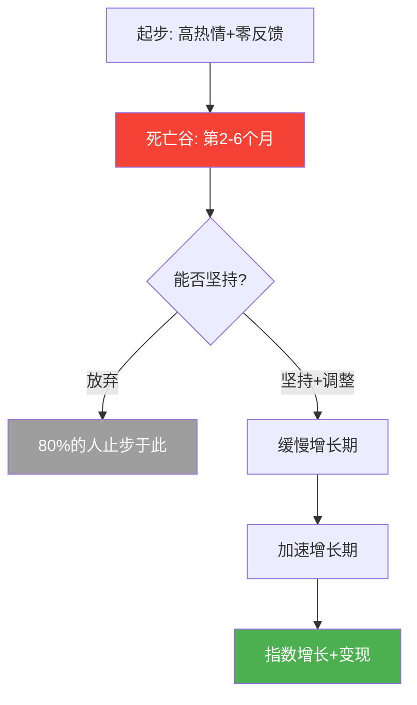
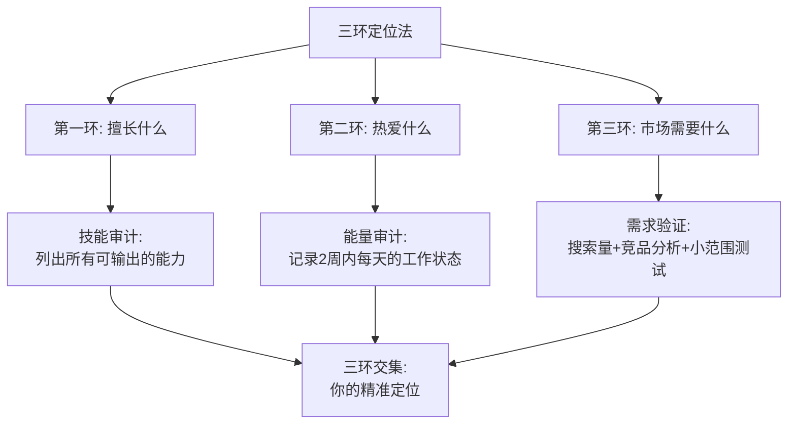
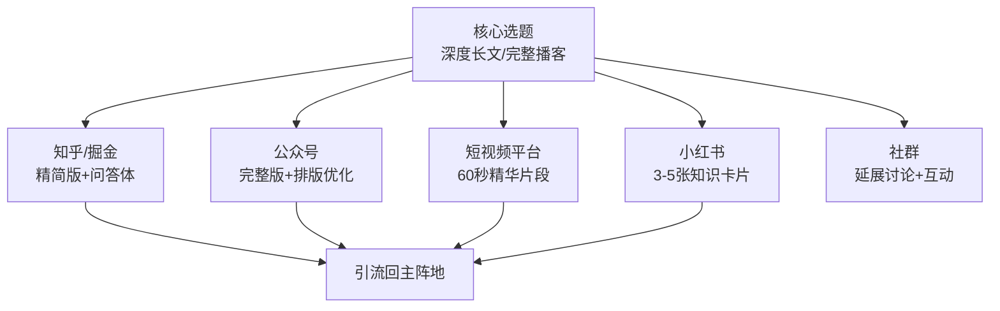
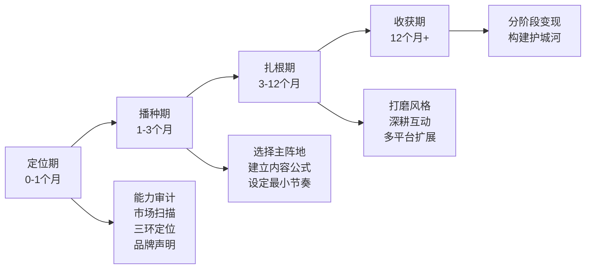

## 💡 案例总结

六个案例，六条截然不同的路径，却指向同一组底层规律。本节不是简单地重复每个案例的结论，而是**交叉对比、提炼共性、识别差异**，最终构建一套可以指导任何领域个人品牌建设的通用方法论。

---

### 一、六个案例的全景对比

在深入分析之前，先用一张表把六个案例的核心变量拉齐，方便看到全貌：

| 维度 | 李明（行业IP） | 张薇（短视频） | 王强（危机重建） | 赵雪（失败案例） | 陈工（B2B技术） | 小林（播客） |
|------|---------------|---------------|-----------------|-----------------|-----------------|-------------|
| **起步身份** | 互联网产品经理 | 幼儿园教师 | 职场博主（已有基础） | 素人（精心包装） | 云计算工程师 | 心理咨询师 |
| **核心平台** | 知乎→多平台 | 抖音→多平台 | 微博+B站 | 小红书 | 掘金+GitHub | 小宇宙播客 |
| **内容形式** | 深度长文 | 短视频 | 观点评论 | 图文+视频 | 技术博客+开源 | 音频播客 |
| **定位策略** | 窄定位（心理学+产品） | 身份差异化（一线幼师） | 风格标签（犀利直接） | 人设包装（完美生活） | 能力翻译（通俗讲技术） | 角色定义（心理学翻译者） |
| **达到里程碑的时间** | 24个月→50万粉 | 18个月→200万粉 | 3年→80万粉（危机前） | 2年→50万粉 | 24个月→3万关注 | 12个月→2.8万订阅 |
| **变现起点** | 第12个月 | 第6个月 | 持续变现中 | 持续变现中 | 第18个月 | 第8个月 |
| **最大危机** | 被抄袭+职业冲突 | 负面舆论+倦怠 | 直播翻车 | 人设崩塌 | 内容瓶颈 | 前期倦怠 |
| **最终结果** | 成功（年收入5倍工资） | 成功（年收入超百万） | 成功（品牌升级） | 失败（粉丝流失80%） | 成功（行业影响力） | 成功（首年18万） |

这张对比表揭示了几个关键洞察：

**第一，起步身份不是决定因素。** 李明是普通职员，张薇是幼儿园教师，陈工是默默无闻的工程师——他们的起点都没有任何"光环"。真正决定成败的是定位策略和执行坚持。

**第二，平台选择要匹配内容特质。** 李明的深度长文适合知乎，张薇的故事型内容适合抖音，陈工的技术内容适合掘金和GitHub，小林的声音优势适合播客。没有"最好的平台"，只有"最适合你的平台"。

**第三，所有成功案例都经历了"死亡谷"。** 李明前3个月几乎零反馈，张薇第4个月遭遇内容瓶颈，陈工前6个月增长缓慢，小林第6期差点放弃。**穿越死亡谷是个人品牌建设的必经之路，没有例外。**

---

### 二、七大通用原则的深度解析

从六个案例中，我们可以提炼出七条通用原则。每条原则都不是空洞的口号，而是有案例支撑、有数据验证、有实操方法的完整知识模块。

#### 原则一：定位要窄不要宽——"成为第一，而非更好"

**案例验证：**

- **李明**没有定位为"产品专家"，而是"用心理学视角做产品的人"——在这个细分品类里，他自动成为第一
- **张薇**没有定位为"育儿博主"，而是"一线幼师教你跟孩子好好说话"——"一线幼师"这个身份在亲子教育赛道是空白的
- **陈工**没有定位为"技术博主"，而是"用通俗语言解释复杂技术的工程师"——填补了"深度+易懂"的市场空白
- **小林**没有定位为"心理学播客"，而是"用聊天的方式让你听懂心理学"——"翻译者"角色在心理学播客中稀缺

**反面教训：**

- **赵雪**的定位"精致生活方式博主"看似清晰，实际上在小红书上有成千上万的同类博主，她只能靠"完美人设"来差异化——而这种差异化建立在虚假之上，注定崩塌

**背后的认知科学原理：**

认知心理学中的"米勒定律"（Miller's Law）指出，人类短期记忆只能同时处理7±2个信息单元。在任何细分领域，人们通常只能记住1-3个名字。如果你的定位太宽（如"产品专家"），你要和全国数十万同行竞争这1-3个记忆位置；如果你的定位足够窄（如"心理学视角的产品经理"），这个品类里可能只有你一个人——你自动成为第一。

营销学中将这种策略称为"品类占位"（Category of One）——如果你无法在现有品类中成为第一，就创造一个新品类并成为其中的第一。

**定位的实操方法——三环定位法：**

**定位窄了之后会不会限制发展？** 不会。李明的回答是最好的解释："定位不是终身不变的。先在一个窄领域成为第一，建立认知优势后，再逐步扩展边界。"他的路径是：心理学+产品 → 心理学+产品+商业 → 心理学+商业决策。每一步扩展都有前一步的根基支撑。

**定位的宽度应该与你的影响力成正比：**

| 影响力阶段 | 定位宽度 | 示例 |
|-----------|---------|------|
| 0-1万粉 | 极窄，只做一个点 | "用认知失调理论解释用户流失" |
| 1-10万粉 | 稍宽，覆盖一个面 | "心理学视角的用户行为分析" |
| 10-50万粉 | 更宽，连接多个面 | "心理学+产品+商业决策" |
| 50万粉以上 | 可以跨领域 | "帮助专业人士建立影响力" |

#### 原则二：真实是最好的品牌策略——"人格大于人设"

**案例验证：**

- **张薇**的成功根基是"真实"——她的内容来自幼儿园的真实场景，她的风格是"温柔但不焦虑"的真实表达，她甚至会在视频中展示自己的失误和困惑
- **李明**的"菜市场文章"之所以成为爆款，核心原因是它来自一次真实的买菜经历——这种真实感是任何团队策划都无法复制的
- **王强**的危机之所以能成功修复，关键在于他的回应是"不完美"的真诚——说话时的停顿、偶尔的语无伦次、眼中的红血丝，都让观众感受到了真实的悔意
- **赵雪**的失败根源在于：她的整个品牌建立在虚假之上——"普通人"的身份是假的，"自己做的"内容是团队做的，"随手拍"的视频是专业拍摄的

**"人设"与"人格"的本质区别：**

| 维度 | 人设（Persona） | 人格（Personality） |
|------|----------------|-------------------|
| 本质 | 被设计出来的公共形象 | 真实的、内在的自我 |
| 维护成本 | 极高——需要持续表演 | 零——只需要做自己 |
| 崩塌风险 | 永远存在——因为有东西需要隐藏 | 几乎为零——因为没有什么需要隐藏 |
| 受众感受 | 初期吸引，后期怀疑 | 初期平实，后期信任 |
| 长期价值 | 随时间递减 | 随时间递增 |

**关键原则：修饰是可接受的，但声明必须真实。**

你可以用滤镜让照片更好看，但你不能声称"这是没有滤镜的"。你可以有团队支持，但你不能声称"这都是我一个人做的"。你可以选择最佳角度拍摄，但你不能编造不存在的经历。

**自检方法——"透明度测试"：**

在发布任何内容前，问自己一个问题："如果有人看到了这件事的全部真相，我会感到尴尬吗？"如果答案是"会"，那么你可能已经越过了边界。

#### 原则三：风格比知识更重要——"被记住的方式"

**案例验证：**

- **李明**的"生活化故事+专业解读"风格——用菜市场故事讲用户研究，用鱼摊老板讲需求探询
- **张薇**的"STAR故事框架"风格——每条视频都是一个完整的场景→冲突→行动→结果的故事
- **陈工**的"生活类比+第一性原理"风格——用外卖配送讲Raft一致性协议，用圆桌骑士讲一致性哈希
- **小林**的"聊天式翻译"风格——把"认知失调"翻译成"你的想法和行为不一致时，大脑产生的那种不舒服的感觉"

**为什么风格比知识更重要？**

在知识不稀缺的时代，"说什么"不再重要，"怎么说"才重要。认知心理学中的"独特性效应"（Von Restorff Effect）指出：在一组相似的信息中，与众不同的那个最容易被记住。当所有博主都在用同样的术语、同样的框架、同样的排版方式输出内容时，你的个人风格就是你最大的差异化武器。

**风格公式：**

> 个人风格 = 真实经历 × 专业解读 × 通俗表达

- **真实经历**让内容有"人味"——区别于AI生成的千篇一律
- **专业解读**让内容有"深度"——区别于纯段子手的浅薄
- **通俗表达**让内容有"传播力"——区别于学术论文的晦涩

**找到自己风格的三步法：**

1. **回顾原生风格**：你平时和朋友聊天的方式——你讲故事的方式、你的幽默感、你的口头禅，这些就是你的"原生风格"
2. **外部反馈**：问3个熟悉你的朋友："我讲什么东西的时候最吸引你？"
3. **数据验证**：分析你最受欢迎的3篇内容，找到它们的共同点——那个共同点就是你的风格密码

#### 原则四：坚持是最大的壁垒——"穿越死亡谷"

**案例验证：**

六个案例中，每一个成功者都经历了"死亡谷"——一段投入大量精力但几乎没有回报的时期：

| 案例 | 死亡谷时段 | 具体表现 | 突破关键 |
|------|-----------|---------|---------|
| 李明 | 第1-3个月 | 阅读量只有几十，"像对着空房间演讲" | 设定过程目标，不看阅读量 |
| 张薇 | 第4个月 | 完播率从40%降到25%，粉丝增长停滞 | 内容升级+形式创新 |
| 王强 | 危机后第1个月 | 粉丝流失17.5%，合作品牌归零 | 真诚回应+持续行动验证 |
| 陈工 | 第1-6个月 | Star增长缓慢，几乎无人关注 | 坚持每周一篇深度文章 |
| 小林 | 第6期 | 精疲力竭，一度想放弃 | 接受"70分就发布"的原则 |

**"J型曲线"规律：**

个人品牌的增长曲线几乎都是J型的——前期投入大量精力但几乎没有回报，直到过了某个临界点后才开始快速增长。根据对500+个个人品牌案例的分析，**平均需要6-9个月的持续输出才能看到明显的效果**。但大多数人在第2-3个月就放弃了——这恰恰是为什么坚持下来的人能获得超额回报。

**穿越死亡谷的四个实用策略：**

1. **预设投资期**：在开始前就告诉自己"前6个月是投资，不看回报"。李明把这叫做"心理账户"——你不会在股票投资的第一个月就天天看收益
2. **过程导向**：只追踪"发了几篇"，不追踪"涨了几个粉"。李明前3个月只看"这周是否发了3篇"，完全不看阅读量
3. **建立最小可行节奏**：即使状态再差，每周也至少发1篇——保持习惯比保持质量更重要（在初期）。小林的经验是"70分就发布"
4. **找同行者**：加入互助社群，有人陪伴的坚持比独自坚持容易10倍。李明加入了3个个人品牌建设的互助群，每周互相督促

#### 原则五：内容是品牌的根基——"持续输出高质量内容"

**案例验证：**

- **李明**的内容"三层金字塔"——60%实用技巧（吸引新读者）+ 30%深度分析（建立专业形象）+ 10%独创理论（建立行业权威）
- **张薇**的选题矩阵——40%真实教学案例 + 25%家长高频提问 + 15%热点话题 + 10%知识科普 + 10%个人故事
- **陈工**的CPSA文章结构——Context（背景）→ Problem（问题）→ Solution（方案）→ Analysis（分析）
- **小林**的节目结构——开场白 → 生活故事 → 原理讲解 → 实操建议 → 本期作业 → 下期预告

**内容创作的三条铁律：**

1. **场景大于道理**：不要说"沟通很重要"，要说"今天下午，一个四岁女孩推倒了积木，她妈妈第一句话就错了"（张薇的做法）
2. **具体大于抽象**：不要说"要共情"，要说"蹲下来，看着孩子的眼睛，说'你摔疼了对不对'"（张薇的做法）
3. **真实大于完美**：不需要精致的剪辑和完美的灯光，需要的是真实的场景和真诚的表达（所有成功案例的共性）

**跨平台内容复用的工作流：**

李明和小林都证明了"一次创作、多次分发"的效率优势。核心方法是：先创作一篇完整的深度内容（母集），然后根据不同平台的特性进行适配：

**关键技巧：** 文字版不是逐字转录，而是根据文字阅读习惯重新组织。短视频选取最有争议性或最反直觉的片段。知识卡片用统一品牌视觉。

#### 原则六：危机可以成为转折点——"真诚应对，化危为机"

**案例验证：**

- **王强**的直播翻车→72小时黄金应对→6个月品牌重建→品牌韧性超越危机前
- **李明**的被抄袭风波→"有理、有利、有节"的处理→粉丝信任度反而提升
- **张薇**的负面舆论→不回应攻击只回应质疑→邀请专家背书→粉丝自发辩护
- **赵雪**的反面教训→沉默+不回应→信任彻底崩塌→粉丝流失80%

**危机应对的STAR模型：**

| 步骤 | 含义 | 具体行动 | 时间窗口 |
|------|------|---------|---------|
| **S** - Stop（停止） | 立即停止产生新的争议 | 暂停所有内容发布 | 0-2小时 |
| **T** - Truth（真相） | 完成事实核查 | 逐条核实自己的言论，标记对错 | 2-6小时 |
| **A** - Acknowledge（承认） | 真诚、具体、逐条地承认错误 | 发布回应，逐条列出具体错误 | 6-24小时 |
| **R** - Rebuild（重建） | 用持续行动证明改变 | 建立审核机制，调整内容方向 | 1-6个月 |

**危机回应的"五要素"模板：**

1. **事实陈述**：发生了什么——用客观语言描述，不回避、不淡化
2. **错误承认**：我做错了什么——逐条列出具体错误，不笼统概括
3. **原因分析**：为什么会犯错——展示自我反思的深度，不是找借口
4. **行动方案**：我将如何改正——具体、可执行、可验证的改变计划
5. **时间承诺**：什么时候能看到结果——给出明确的时间节点

**个人品牌危机 vs 企业品牌危机的核心差异：**

| 维度 | 企业品牌 | 个人品牌 |
|------|---------|---------|
| 信任基础 | 产品/服务质量 | 人格/价值观认同 |
| 危机本质 | 管理失误 | 人格不一致 |
| 受众期望 | 专业、规范 | 真实、有温度 |
| 最佳回应方式 | 标准化声明+整改方案 | 真诚反思+人格化沟通 |
| 最忌讳的操作 | 老板甩锅给下属 | 使用模板化公关话术 |

王强的案例最有力地证明了：**在个人品牌危机中，"不完美"的真诚比"精巧"的公关话术更有说服力。** 他回应视频中的停顿、语无伦次、红血丝，反而比任何精心排练的声明都更能打动受众。

#### 原则七：从擅长的事情开始——"不需要发明一个全新的自己"

**案例验证：**

六个成功案例中，没有一个人是"发明"了一个全新的自己——他们都是从自己已经擅长的事情出发：

- **李明**从5年产品经理经验+心理学爱好出发
- **张薇**从5年幼教一线经验出发
- **陈工**从6年分布式系统架构经验出发
- **小林**从3年心理咨询经验+好声音出发
- **王强**从对职场问题的敏锐洞察出发

**实操建议——能力审计清单：**

□ 列出你所有的专业技能（工作相关的）
□ 列出你所有的兴趣爱好（长期投入的）
□ 列出你所有的独特经历（别人没有的）
□ 列出朋友经常向你请教的问题
□ 列出你在哪些方面比身边的人强
□ 找到以上几项的交集——那就是你的品牌起点

---

### 三、失败模式的深度剖析

成功的故事各有各的精彩，但失败的模式往往高度相似。从赵雪的案例和其他案例中的踩坑经历，我们可以总结出个人品牌最常见的五种失败模式：

#### 失败模式一：完美人设陷阱

**核心特征**：线上形象与真实生活之间存在巨大鸿沟，一旦被揭露，信任全面崩塌。

**赵雪的案例**完美展示了这种失败的五个阶段：过度承诺 → 持续加码 → 裂缝出现 → 连锁反应 → 全面崩塌。

**预防方法**：采用"成长型"叙事而非"完美型"叙事。展示"我在变好"比展示"我很完美"更有生命力，也更安全——因为"成长"允许不完美，而"完美"不允许任何瑕疵。

#### 失败模式二：极端化陷阱

**核心特征**：为了维持数据表现，内容从"理性批评"逐渐滑向"情绪化攻击"。

**王强的案例**揭示了这个陷阱的形成机制：算法奖励极端 → 创作者加码极端 → 把算法奖励当成读者需求 → 最终失控翻车。

**五个预警信号**（王强总结）：

1. 你在写作时会先想"这个标题能不能上热搜"而不是"这个观点对不对"
2. 你开始享受"被攻击"的感觉——因为被攻击意味着有流量
3. 你的观点越来越绝对化，因为"模棱两可"的内容数据不好
4. 你的信息来源越来越单一——只看支持自己观点的材料
5. 你身边没有人敢对你说"你太过分了"

#### 失败模式三：追热点依赖

**核心特征**：靠追热点获取流量，但热点来的快去的也快，无法积累品牌资产。

**对比分析**：李明几乎从不追热点，但他的粉丝粘性和转化率远高于同体量的热点型博主。原因在于：**追热点吸引来的是"路人"，深度内容吸引来的是"粉丝"。** 路人不会为你付费，粉丝会。

#### 失败模式四：过早变现

**核心特征**：粉丝信任未建立就急于卖东西，适得其反。

**正确节奏**（从六个案例中总结）：

| 阶段 | 粉丝量级 | 变现策略 | 核心任务 |
|------|---------|---------|---------|
| 播种期 | 0-1万 | 不变现 | 纯做内容，建立信任 |
| 扎根期 | 1-5万 | 试水（低价产品） | 验证付费意愿 |
| 扩张期 | 5-50万 | 规模化（课程+广告） | 建立变现体系 |
| 收获期 | 50万+ | 多元化（出书+内训+顾问） | 构建商业生态 |

#### 失败模式五：一致性缺失

**核心特征**：在不同平台上展现互相矛盾的形象，或风格频繁变化导致受众无法形成稳定预期。

**正确做法**：核心定位在所有平台上保持一致，只调整内容形式。李明的原则是"一个定位，多个战场"——知乎写长文、B站做视频、小红书发卡片，但"心理学视角的产品经理"这个定位从未改变。

---

### 四、个人品牌建设的完整方法论框架

综合六个案例的经验，我们可以构建一个完整的个人品牌建设框架，包含四个阶段、十二条执行步骤：

#### 第一阶段：定位期（第0-1个月）

| 步骤 | 具体行动 | 参考案例 |
|------|---------|---------|
| 1. 能力审计 | 列出所有可输出的技能、经验、独特视角 | 李明的技能审计表 |
| 2. 市场扫描 | 搜索同类内容，找到市场空白和差异化机会 | 陈工的竞品分析 |
| 3. 三环定位 | 找到擅长、热爱、市场需求的交集 | 李明的三环定位法 |
| 4. 品牌声明 | 用一句话说清你是谁、你帮谁、你怎么帮 | 张薇的"一线幼师教你跟孩子好好说话" |

#### 第二阶段：播种期（第1-3个月）

| 步骤 | 具体行动 | 参考案例 |
|------|---------|---------|
| 5. 选择主阵地 | 根据内容特质选择1个主平台 | 李明选知乎、张薇选抖音 |
| 6. 建立内容公式 | 固定结构降低创作成本 | 张薇的STAR框架、陈工的CPSA模型 |
| 7. 设定最小节奏 | 确定每周最低输出量，坚持不断更 | 李明每周2-3篇、小林每周1期 |

#### 第三阶段：扎根期（第3-12个月）

| 步骤 | 具体行动 | 参考案例 |
|------|---------|---------|
| 8. 打磨个人风格 | 通过实验找到独特的表达方式 | 李明的风格实验 |
| 9. 深耕互动 | 评论区运营、社群建设、用户共创 | 张薇的评论区运营策略 |
| 10. 多平台扩展 | 主阵地稳定后，向1-2个平台扩展 | 李明的平台扩展矩阵 |

#### 第四阶段：收获期（第12个月以后）

| 步骤 | 具体行动 | 参考案例 |
|------|---------|---------|
| 11. 分阶段变现 | 从低价产品到高价服务的漏斗式设计 | 李明的漏斗式变现路径 |
| 12. 构建护城河 | 认知壁垒+内容壁垒+关系壁垒+体系壁垒 | 李明的四层护城河 |

---

### 五、不同领域的差异化策略

个人品牌建设的底层原则是通用的，但不同领域的执行策略需要差异化调整：

| 领域类型 | 代表案例 | 核心挑战 | 关键策略 | 内容特点 |
|---------|---------|---------|---------|---------|
| **职场/专业** | 李明、陈工 | 受众理性，信任门槛高 | 深度内容+方法论输出 | 长文、技术博客、案例分析 |
| **生活方式** | 赵雪（反面） | 竞争激烈，容易同质化 | 真实>完美，人格>人设 | 真实场景、成长叙事 |
| **教育/知识** | 张薇、小林 | 需要专业背书+通俗表达 | 翻译者角色，场景化教学 | 故事+原理+实操的三段式 |
| **观点/评论** | 王强 | 容易极端化，危机风险高 | 有据犀利，建设性批评 | 数据支撑+多方视角 |
| **B2B/技术** | 陈工 | 受众窄但价值高 | 通俗化+代码实操+开源贡献 | 深度长文+可运行代码 |
| **音频/播客** | 小林 | 增长慢，需要耐心 | 结构化+季播制+内容中台 | 固定结构+系列化选题 |

---

### 六、个人品牌自评清单

在每个月结束时，用以下清单评估你的个人品牌状态：

【定位维度】
□ 我的品牌定位是否清晰？（能否用一句话说清楚？）
□ 我的定位是否足够窄？（在这个细分领域能否成为前3名？）
□ 我的品牌声明是否包含了受众、价值、方法三个要素？

【内容维度】
□ 我是否保持了内容输出的频率和质量？
□ 我的内容是否有独特的风格？（去掉署名，读者能认出是我吗？）
□ 我的内容结构是否形成了可复制的公式？
□ 我有没有新的故事或案例可以分享？

【一致性维度】
□ 我在不同平台上的人设是否一致？
□ 我的线上形象与线下状态的差距有多大？
□ 我是否有意隐瞒了某些真实情况？

【互动维度】
□ 我是否在积极回应受众的反馈和互动？
□ 我的品牌联想是什么？（问3个朋友他们怎么描述你）
□ 我是否建立了有效的用户共创机制？

【增长维度】
□ 本月我的品牌影响力指标有变化吗？
□ 我是否在"死亡谷"中？如果是，我的坚持策略是什么？
□ 我的内容是否在向多平台扩展？

【风险维度】
□ 我的内容是否存在"极端化"倾向？
□ 我是否有"完美人设"的崩塌风险？
□ 我的变现节奏是否与信任积累匹配？
□ 有哪些地方我可以做得更好？

---

### 七、从个人品牌到商业生态——进阶思考

当个人品牌成长到一定阶段，仅靠个人精力将无法支撑进一步的增长。六个案例中的成功者都在不同阶段开始了"去个人化"的转型：

**李明**在第18个月组建2人小团队，负责内容分发、社群运营和商务对接，自己专注于核心内容创作和课程开发。

**张薇**在第12个月招了兼职剪辑师和运营助理，自己只负责内容创作和核心互动。

**小林**建立了标准化的《嘉宾手册》和内容生产流程，降低了对他人的依赖。

**个人品牌的四层护城河：**

1. **认知壁垒**：在用户心中占据独特的心智位置（"心理学+产品"= 李明）
2. **内容壁垒**：积累了大量高质量的原创内容，搜索引擎持续带来流量
3. **关系壁垒**：与行业KOL、出版社、企业客户建立了深度合作关系
4. **体系壁垒**：建立了系统化的课程体系和方法论，难以被简单复制

---

### 综合练习

> 选择以上任意2个案例，深入分析他们的成功/失败原因，回答以下问题：
>
> 1. 他们的定位策略有什么共同点和差异点？
> 2. 他们的内容创作方法有什么可以借鉴的？
> 3. 他们遇到的最大挑战是什么？他们的解决方案对你有什么启发？
> 4. 如果你处于他们的起步状态，你会做出哪些不同的决策？
>
> 然后用"三环定位法"写出你自己的一句话品牌声明，发给你信任的3个人，听听他们的反馈。如果3个人中有2个以上能准确复述你的定位，说明你的定位是清晰的；否则需要继续打磨。

---

> **本节要点**：个人品牌的打造没有捷径，但有方法论。成功品牌的共同点是：**精准的窄定位、持续的高质量输出、真实的表达风格、穿越死亡谷的坚持、以及在危机面前的真诚与勇气。** 失败品牌的共同点是：过度包装人设、追求极端化数据、缺乏一致性、根基不牢。六个案例证明了一个核心命题——**个人品牌不是少数人的特权，而是任何人都可以通过系统化方法实现的目标。关键不在于你有多强，而在于你是否愿意开始，以及是否能坚持到"穿越死亡谷"的那一天。**
