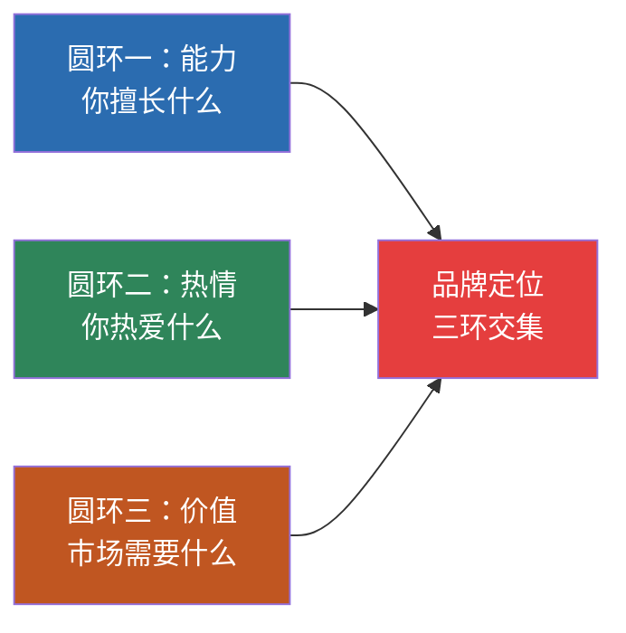
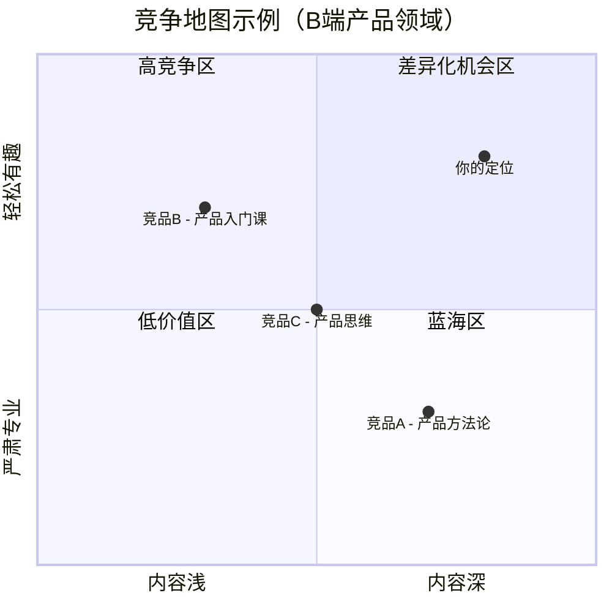
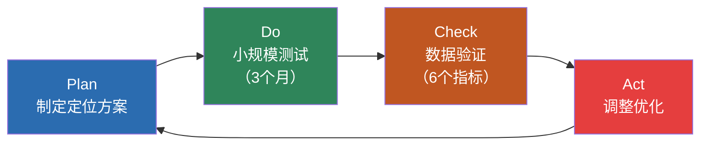

## 一、个人品牌定位技巧

定位是个人品牌建设的第一步，也是最关键的一步。定位错了，后面所有的努力都是在错误的方向上浪费时间。杰克·特劳特在《定位》中说："定位不是你对产品要做的事，而是你对预期客户要做的事。"翻译到个人品牌领域——**定位不是"你想成为什么"，而是"你在目标受众心智中占据什么位置"**。

本节将从定位的底层逻辑出发，系统介绍三环定位法、受众分析、竞争分析、品牌声明撰写、差异化策略和定位验证的完整流程。

### 1.1 定位的底层逻辑：心智占位

为什么定位如此重要？因为人脑的认知资源是有限的。认知心理学中的"选择性注意"理论指出，人类每天接触约11,000,000比特的信息，但意识只能处理约50比特。在信息过载的时代，人们对每个品类只能记住极少数几个名字——提到搜索引擎想到百度/Google，提到电动车想到特斯拉/比亚迪。

个人品牌同理。在一个领域中，目标受众能记住的名字通常不超过3-5个。**定位的本质就是争夺这个"心智名额"**。

心智占位有三个关键特征：

- **先入为主**：第一个占据某个位置的人，后来者需要付出10倍以上的代价才能撼动。在"个人IP+程序员"这个交叉领域，如果已经有人占了位，你需要换一个更细分的角度。
- **极度简化**：人们记住的不是你的全部能力，而是一个极简的标签。"那个会讲脱口秀的程序员"比"一个既会写代码又懂产品还会演讲的全能型人才"更容易被记住。
- **难以改变**：一旦形成认知，改变的成本极高。所以定位必须在一开始就尽可能准确，不要指望"先随便定位，以后再调整"。

### 1.2 三环定位法：找到你的品牌金矿

个人品牌定位的核心工具是"三环定位法"——找到以下三个圆环的交集。这个模型借鉴了吉姆·柯林斯在《从优秀到卓越》中提出的"刺猬理念"，并针对个人品牌场景做了调整。

#### 圆环一：你擅长什么（能力盘点）

列出你所有的专业技能、知识领域和特长，不要自我设限。然后按照下面的四象限矩阵进行筛选：

| | 深度高（可与专家对话） | 深度浅（仅了解皮毛） |
|---|---|---|
| **使用频率高** | ⭐ 核心能力（品牌基石） | 潜力能力（值得投入） |
| **使用频率低** | 隐藏能力（需要激活） | 边缘认知（暂不考虑） |

**具体操作步骤**：

1. **能力清零**：用30分钟不中断地写下你会的所有技能、知识领域、工具、方法论。包括工作中用到的、业余爱好的、自学的。目标是至少写出30项。
2. **四象限归类**：把每一项放到上面的矩阵中。注意"深度"不是自我感觉，而是"在这个领域，我能否解决90%的从业者解决不了的问题"。
3. **提炼3-5项核心能力**：从"核心能力"象限中，选出3-5项你最强的。如果超过5项，说明你还没有形成真正的核心——需要进一步聚焦。

**能力盘点的常见陷阱**：

- **把"经验"误认为"能力"**。"我在某个岗位上做了10年"不等于"我在这个领域有10年的能力"。能力需要有可验证的成果来支撑——你解决了什么具体问题？产出了什么可衡量的结果？
- **忽视跨界能力的价值**。你的"非专业"能力往往是差异化的核心来源。一个懂心理学的程序员，一个懂数据的市场人，这些跨界组合本身就是稀缺的。
- **高估热门技能，低估基础能力**。"我会用ChatGPT"不是能力，"我能用AI工具将内容生产效率提升3倍"才是能力。能力必须指向可衡量的产出。

#### 圆环二：你热爱什么（热情验证）

热情是品牌持续输出的燃料。没有热情支撑的品牌注定会"熄火"——因为品牌建设是一场马拉松，不是百米冲刺。你需要在没有任何回报的前6-12个月持续输出，只有真正的热情才能支撑你度过这段沉默期。

**热情验证的三个测试**：

| 测试名称 | 操作方法 | 判定标准 |
|----------|---------|---------|
| 心流测试 | 做这件事时，你是否经常忘记时间？ | 连续工作3小时不觉得累 = 真热情 |
| 免费测试 | 如果没有任何报酬，你还愿意做这件事吗？ | 愿意在周末花4小时做 = 真热情 |
| 深挖测试 | 这个领域的枯燥基础内容，你也愿意反复钻研吗？ | 看得进100页的技术文档 = 真热情 |

**区分"真热情"和"假热情"**：

- **真热情**：你对这个领域的底层逻辑感兴趣，不只喜欢"成功的结果"，也享受"探索的过程"。你愿意在这个领域没有掌声的情况下继续深耕。
- **假热情**：你只是羡慕这个领域的成功者（高收入、高知名度、高社会地位），但对具体的工作内容并不感兴趣。很多人想做"知识博主"，是因为看到别人年入百万，而不是真的热爱分享知识。

**一个实操建议**：连续7天，每天花30分钟做你认为"热爱"的事情，不发朋友圈、不告诉任何人。如果你能坚持7天并且觉得不过瘾，这大概率是真热情。如果你第3天就开始找借口逃避，这是假热情。

#### 圆环三：市场需要什么（价值验证）

你的能力和热情必须能转化为对他人有价值的服务，否则品牌无法存活。价值验证不是拍脑袋，而是需要系统化的市场调研。

**价值验证的四种方法**：

**方法一：搜索需求验证**

使用以下工具检查你的定位方向是否有真实的搜索需求：

| 工具 | 用途 | 操作方法 |
|------|------|---------|
| 百度指数 | 查看关键词搜索趋势 | 输入你的领域关键词，查看近12个月搜索量趋势 |
| 微信指数 | 查看微信生态热度 | 搜索相关话题，对比不同角度的热度差异 |
| 5118 | 长尾关键词挖掘 | 输入核心词，查看用户真实搜索的问题 |
| 知乎热榜 | 了解高质量问答需求 | 搜索你的领域，看哪些问题关注量高但回答质量低 |
| 小红书搜索 | 了解消费决策需求 | 输入关键词，查看笔记数量和互动数据 |

**方法二：社群需求验证**

加入3-5个你目标受众聚集的社群（微信群、知识星球、Discord），观察两周：
- 他们最常问什么问题？
- 什么话题讨论最热烈？
- 他们的痛点是什么？愿意为什么付费？

**方法三：最小可行产品（MVP）验证**

在投入大量时间之前，先做一个小规模测试：
- 写3-5篇相关主题的文章，发布到知乎/公众号，观察阅读量和互动
- 做一次30分钟的免费分享，看报名人数和反馈
- 发一条朋友圈征集需求，看私信回复的数量和质量

**方法四：竞品需求验证**

搜索你定位方向的已有从业者：
- 他们的付费产品价格和销量如何？（有付费产品 = 有市场需求）
- 他们的内容互动数据如何？（高互动 = 需求旺盛）
- 他们的用户评论中有哪些未被满足的需求？（差异化切入点）

### 1.3 三环交集的实战分析

找到三环交集不是一次性的工作，而是一个反复迭代的过程。下面用一个完整的案例来展示这个过程。

**案例：张明的定位探索**

张明，32岁，某互联网公司的产品经理，工作8年。他想建立个人品牌，但不知道该定位在哪个方向。

**第一步：能力盘点**

张明花30分钟列出了自己所有的能力：

| 能力 | 深度 | 频率 | 归类 |
|------|------|------|------|
| 产品需求分析 | 高 | 高 | ⭐ 核心能力 |
| 用户访谈 | 高 | 中 | 核心能力 |
| 数据分析（SQL/Excel） | 中 | 高 | 潜力能力 |
| 项目管理 | 中 | 高 | 潜力能力 |
| 写作 | 中 | 低 | 隐藏能力 |
| 摄影 | 低 | 低 | 边缘认知 |
| 英语口语 | 中 | 低 | 隐藏能力 |

核心能力锁定：产品需求分析 + 用户访谈。

**第二步：热情验证**

张明做了7天测试，发现自己在"拆解产品逻辑"这件事上能轻松进入心流，经常一写就是3个小时停不下来。但他对纯技术向的内容（比如SQL优化）虽然也会做，但总觉得枯燥。热情方向锁定：产品思维 + 用户洞察。

**第三步：价值验证**

张明做了搜索调研，发现：
- "产品经理面试"百度指数月均搜索量3,200，竞争激烈
- "B端产品需求分析"搜索量800，但高质量内容极少
- "产品经理转型"搜索量1,500，回答质量参差不齐
- 知乎上"如何做B端用户调研"的问题有4,200关注，但前10个回答都是泛泛而谈

**三环交集结果**：

张明的定位方向——**B端产品经理的需求分析与用户洞察方法论**。这个方向在他的能力圈内（8年B端产品经验），符合他的热情（拆解产品逻辑），且市场有明确需求（高质量B端产品内容稀缺）。

### 1.4 一句话品牌声明

将品牌定位浓缩为一句话，是定位工作的关键产出物。这句话不是用来"装饰"你的社交媒体简介，而是用来**指导你所有品牌相关决策**的北极星。

#### 品牌声明的万能公式

> **我帮助 [目标受众] 通过 [你的核心方法/能力] 实现 [他们渴望的结果]。**

这个公式包含三个不可或缺的要素：

| 要素 | 作用 | 常见错误 |
|------|------|---------|
| 目标受众 | 明确"你为谁服务" | 太宽泛——"所有人"等于"没有人" |
| 核心方法 | 明确"你怎么做到" | 太模糊——"专业的方法"没有信息量 |
| 渴望结果 | 明确"能得到什么" | 太抽象——"提升能力"不如"3个月内涨薪30%" |

#### 好坏品牌声明对比

| | 坏的声明 | 为什么坏 | 好的声明 | 为什么好 |
|---|---------|---------|---------|---------|
| 例1 | "我是一个专业的沟通培训师" | 没有受众、没有方法、没有结果 | "我帮助内向型技术leader通过结构化表达训练，在3个月内成为团队中有影响力的沟通者" | 三要素齐全，结果可衡量 |
| 例2 | "我教你做自媒体赚钱" | 太宽泛，无差异化 | "我帮助有专业背景的职场人通过知识体系化输出，在6个月内打造年入20万的付费专栏" | 明确受众画像和具体路径 |
| 例3 | "资深设计师，10年经验" | 只说资历，不说价值 | "我帮助初创品牌用5万元预算打造百万级视觉识别系统" | 将经验转化为具体的价值承诺 |

#### 品牌声明的打磨清单

写完初版后，逐条检查：

1. **受众具体性**：目标受众能否一眼认出"这说的就是我"？如果把受众描述删掉，声明是否变成了"对所有人说的话"？
2. **方法独特性**：别人能否复制你的声明？如果把你的名字换成竞争对手，声明是否依然成立？
3. **结果可感知性**：受众能否想象出"用了你的方法之后"的具体场景？
4. **一句话可读性**：能否一口气读完？如果需要喘气，说明太长了。
5. **时间约束**：是否包含时间框架？"6个月内实现"比"实现"更有冲击力。

#### 从声明到定位画布

品牌声明只是起点。完整的定位还需要一张画布来支撑：

┌─────────────────────────────────────────────────────────┐
│                    个人品牌定位画布                        │
├──────────────┬──────────────┬───────────────────────────┤
│ 我是谁       │ 我为谁服务    │ 我解决什么问题              │
│ （品牌声明）  │ （受众画像）  │ （核心痛点）                │
├──────────────┼──────────────┼───────────────────────────┤
│ 我怎么做     │ 为什么选我    │ 怎么证明                    │
│ （方法论）    │ （差异化）    │ （信任证据）                │
├──────────────┴──────────────┴───────────────────────────┤
│ 我的边界：我 不做什么 / 不服务谁 / 不承诺什么              │
└─────────────────────────────────────────────────────────┘

"我 的边界"这一行经常被忽略，但非常重要。**清晰地说"不做什么"，比模糊地说"什么都做"更能建立专业感**。一个说"我只做B端SaaS产品的品牌顾问"的人，比说"我做所有行业的品牌咨询"的人更容易被信任。

### 1.5 受众画像：定位的另一半

定位不只是"你是谁"，更是"你为谁"。很多人的品牌定位失败，不是因为能力不够，而是因为没有搞清楚目标受众到底是谁。

#### 受众画像的四个维度

**维度一：人口统计特征**

| 属性 | 你需要回答的问题 |
|------|----------------|
| 年龄段 | 你的典型受众处于什么人生阶段？ |
| 职业身份 | 他们做什么工作？在什么行业？ |
| 职业阶段 | 他们是新人、中层还是高管？ |
| 收入水平 | 他们的消费能力如何？愿意为你的服务付费吗？ |
| 地域分布 | 他们集中在哪些城市？线上还是线下？ |

**维度二：心理特征**

| 属性 | 你需要回答的问题 |
|------|----------------|
| 核心焦虑 | 他们最担心什么？晚上睡不着时在想什么？ |
| 渴望目标 | 他们最想实现什么？5年后的理想状态是什么？ |
| 信息获取习惯 | 他们用什么平台？看什么内容？关注谁？ |
| 决策方式 | 他们理性决策还是感性决策？听谁的建议？ |
| 付费意愿 | 他们愿意为解决问题花多少钱？ |

**维度三：痛点层级**

受众的痛点可以分为三个层级，你的品牌应该至少解决其中一层：

| 层级 | 描述 | 示例 |
|------|------|------|
| 表层痛点 | 具体的、可描述的问题 | "我不会写产品需求文档" |
| 中层痛点 | 更深层的能力/方法缺失 | "我的需求总是被开发challenge" |
| 深层痛点 | 核心的身份/价值焦虑 | "我在团队中没有话语权，感觉不被尊重" |

**越深层的痛点，用户愿意付出的代价越大**。"教你写PRD"可能值99元，但"帮你成为团队中有影响力的产品leader"可以值9,999元。

**维度四：受众的"语言地图"**

用受众自己的语言和他们沟通，是建立连接的最快方式。你需要搞清楚：

- 他们怎么描述自己的问题？（搜索词、口头禅）
- 他们用什么行话/黑话？（行业术语、圈子梗）
- 他们信任什么样的表达方式？（数据驱动 vs 故事驱动 vs 逻辑推理）
- 他们讨厌什么样的沟通方式？（过度推销、居高临下、空洞鸡汤）

**实操建议**：去目标受众聚集的地方（知乎话题、微信群、行业论坛），原封不动地复制他们描述问题的原话。这些原话就是你未来内容创作的素材金矿。

### 1.6 竞争分析：找到你的生态位

定位不是在真空中完成的。你必须知道你的"竞争对手"是谁，他们占据了什么位置，你才能找到自己的生态位。

#### 竞争分析的三步法

**第一步：绘制竞争地图**

将你的目标领域中的主要从业者按照两个维度画在坐标轴上：

- 横轴：内容深度（浅 ↔ 深）
- 纵轴：表达风格（严肃专业 ↔ 轻松有趣）

在坐标轴上标注每个竞争对手的位置。**空白区域就是你的机会**。

**第二步：分析对手的优劣势**

对每个主要竞争对手，从以下维度打分（1-5分）：

| 维度 | 竞品A | 竞品B | 竞品C | 你自己 |
|------|-------|-------|-------|--------|
| 内容深度 | 4 | 2 | 3 | ? |
| 更新频率 | 3 | 5 | 4 | ? |
| 互动质量 | 2 | 4 | 3 | ? |
| 变现能力 | 4 | 3 | 2 | ? |
| 受众忠诚度 | 3 | 4 | 2 | ? |
| 差异化程度 | 3 | 2 | 3 | ? |

**第三步：找到差异化切入点**

通过竞争分析，你应该能够回答：**"在某个具体细分方向上，我能提供什么别人提供不了的价值？"** 这就是你的生态位。

常见的差异化切入点：
- **角度差异化**：同一个话题，你从不同角度切入。别人讲"怎么做内容营销"，你讲"技术人怎么把专业知识变成内容资产"。
- **深度差异化**：别人讲到表面，你讲到底层。别人说"要做用户调研"，你给出完整的调研框架、访谈脚本、分析模板。
- **形式差异化**：别人写文章，你做短视频。别人做课程，你做社群。形式本身就是差异化。
- **受众差异化**：别人服务大企业，你专注小微企业。别人面向管理层，你面向一线执行者。

### 1.7 五种差异化策略详解

在同质化竞争中脱颖而出，以下是五种经过验证的差异化策略。

#### 策略一：方法论差异化

发展一套独特的、可命名的方法论或框架。这是最强的差异化方式，因为方法论是你的"知识产权"，别人无法复制。

**操作步骤**：

1. **提炼你的核心洞察**：在你的领域中，你有什么独到的理解是别人没有的？
2. **结构化为框架**：将你的洞察组织成有逻辑的步骤或模型。
3. **命名**：给你的方法论起一个简短、好记、有辨识度的名字。
4. **反复强化**：在所有内容中反复使用这个方法论的名字，直到受众将这个名字和你绑定。

**示例**：
- "张三的五步销售法"
- "李四的STAR面试模型"
- "王五的产品三角验证法"

#### 策略二：经历差异化

将你独特的个人经历转化为品牌资产。经历是最不可复制的差异化——没有人能拥有和你一模一样的人生。

**操作步骤**：

1. **挖掘你的"转折故事"**：你经历过什么重大挑战、失败、转型？这些故事中蕴含的情感和教训是品牌的核心素材。
2. **将经历与能力关联**：你的经历如何让你获得了独特的视角或方法？
3. **控制叙事节奏**：不要一次性讲完所有故事。把最有冲击力的故事留到关键时刻使用。

**注意事项**：经历差异化不等于"卖惨"或"炫富"。关键在于你的经历能为受众带来什么启发或价值。

#### 策略三：风格差异化

建立独特的表达风格。风格是别人模仿不来的——就像你可以模仿一个人的穿搭，但你模仿不了他的气质。

常见的风格方向：

| 风格类型 | 特征 | 适合场景 | 代表人物特征 |
|----------|------|---------|------------|
| 犀利直接 | 敢说真话、不留情面 | 评论类、评测类 | 适合有底气的专业人士 |
| 温暖治愈 | 共情力强、善于倾听 | 情感类、成长类 | 适合有亲和力的人 |
| 幽默风趣 | 善用类比、段子化表达 | 知识科普类 | 适合有娱乐感的人 |
| 严谨理性 | 数据驱动、逻辑严密 | 分析类、研究类 | 适合学术/技术背景 |
| 极简主义 | 言简意赅、信息密度高 | 工具/效率类 | 适合效率控 |

#### 策略四：受众差异化

选择一个被忽视的细分人群作为目标受众。当所有人都在服务大企业时，你专注于小微企业。当所有人都在教新人时，你专注于中层管理者。

**受众细分的维度**：
- 按行业细分：不是"教写作"，而是"教医疗行业从业者写科普文章"
- 按阶段细分：不是"教产品管理"，而是"教从技术转产品的转型者"
- 按规模细分：不是"教企业营销"，而是"教5人以下团队的低成本获客"
- 按地域细分：不是"教创业"，而是"教二三线城市的轻资产创业"

#### 策略五：组合差异化

将两个看似不相关的领域组合在一起，创造独特的价值定位。这是最容易出效果、也最容易复制的差异化方式——因为当别人开始模仿你的组合时，你已经有了先发优势。

**经典组合公式**：

| 组合 | 产生的差异化定位 |
|------|----------------|
| 心理学 + 销售 | "用行为心理学提升成交率" |
| 设计思维 + 管理 | "用设计思维重塑团队协作" |
| 数据分析 + 内容 | "用数据驱动内容策略" |
| 编程 + 教育 | "用编程思维解决教学难题" |
| 哲学 + 商业 | "用第一性原理重新审视商业模式" |

### 1.8 定位验证与迭代

定位不是一锤子买卖。你需要一个系统化的验证流程来确认定位是否有效，并在必要时调整。

#### 验证的四个信号

| 信号 | 含义 | 应对策略 |
|------|------|---------|
| 正向信号：受众主动找你 | 你的定位击中了真实需求 | 加大投入，深化内容 |
| 正向信号：别人用你的语言描述你 | 品牌认知已形成 | 强化标签，扩大传播 |
| 负向信号：需要反复解释"你是做什么的" | 定位不够清晰 | 简化声明，聚焦核心 |
| 负向信号：获得的关注与付出不成正比 | 定位可能偏离市场需求 | 重新做价值验证，调整方向 |

#### 定位迭代的PDCA循环

**数据验证的6个指标**：

1. **内容互动率**：你的内容是否引起了目标受众的共鸣？（点赞/评论/转发/阅读量）
2. **受众画像匹配度**：关注你的人是否是你的目标受众？（通过评论和私信分析）
3. **搜索可见度**：搜索你的定位关键词时，你的内容是否出现在前列？
4. **口碑推荐率**：是否有受众主动向别人推荐你？
5. **付费转化率**：如果已有付费产品，转化率如何？
6. **竞品对比优势**：和竞争对手相比，你的差异化是否被市场认可？

#### 什么时候应该调整定位

- **3个月内没有任何正向信号**：大概率定位有误，需要重新分析
- **正向信号出现但很弱**：方向对但角度偏了，微调即可
- **市场环境发生重大变化**：技术革新、政策变动、行业洗牌时需要重新评估
- **你自身的能力或热情发生转变**：品牌必须忠于真实的你

**一个重要原则：调整定位不等于推翻重来。** 大多数情况下，你需要的是微调——缩小受众范围、深化某个角度、更换表达方式——而不是彻底改变方向。频繁推翻重来会让你在受众心中留下"不靠谱"的印象。

### 1.9 定位的常见陷阱

| 陷阱 | 表现 | 后果 | 纠正方法 |
|------|------|------|---------|
| 贪大求全 | "我是全能型人才" | 没有记忆点，什么都能做等于什么都做不好 | 砍到只剩一个核心标签 |
| 跟风定位 | 看什么火做什么 | 永远在追赶，永远慢一步 | 回到三环交集找自己的优势 |
| 自嗨定位 | 只考虑自己想做什么 | 自己嗨了受众无感 | 用MVP做市场验证 |
| 静态定位 | 定好就不变了 | 品牌与个人成长脱节 | 每6个月做一次定位审计 |
| 虚假定位 | 包装一个不存在的能力 | 信任崩塌，品牌归零 | 定位必须建立在真实能力之上 |
| 模糊定位 | 声明充满形容词和副词 | 受众记不住，也无法传播 | 用具体数据和场景替代形容词 |

### 1.10 进阶：定位的战略层次

对于已经在某个领域有了一定基础的人，定位需要从"找位置"升级到"占位置"。

**第一层：品类定位——你在哪个赛道？**

选择一个足够大的赛道，但在这个赛道中要有一个清晰的细分。"个人品牌"是一个赛道，"技术人的个人品牌"是一个细分，"后端工程师的技术影响力"是更细的细分。

**第二层：段位定位——你在什么级别？**

| 段位 | 特征 | 定位策略 |
|------|------|---------|
| 入门者 | 刚开始，经验少 | "学习者"人设——分享学习笔记、成长记录 |
| 实践者 | 有实战经验 | "方法论"人设——总结可复制的方法和框架 |
| 专家 | 深度积累多年 | "权威"人设——行业洞察、趋势判断、深度分析 |
| 布道者 | 已有行业影响力 | "引领者"人设——定义问题、设定议程、推动变革 |

**关键原则：段位定位必须与真实能力匹配。** 一个刚入行2年的人自称"行业专家"，只会适得其反。

**第三层：关系定位——你与受众的关系是什么？**

| 关系类型 | 特征 | 适合场景 |
|----------|------|---------|
| 导师型 | 传授知识和经验 | 教育、培训、咨询 |
| 伙伴型 | 一起探索和成长 | 社群、同行交流 |
| 顾问型 | 提供专业建议 | 咨询、诊断、解决方案 |
| 榆励型 | 激发和鼓舞 | 演讲、故事、榜样 |
| 工具型 | 提供实用价值 | 工具、模板、效率提升 |

不同的关系定位决定了你的内容风格、沟通方式和变现路径。一个"导师型"定位的人应该输出系统化的课程和方法论；一个"伙伴型"定位的人应该侧重社群互动和真实分享。

***
