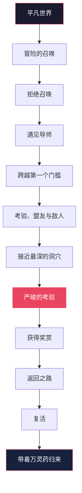
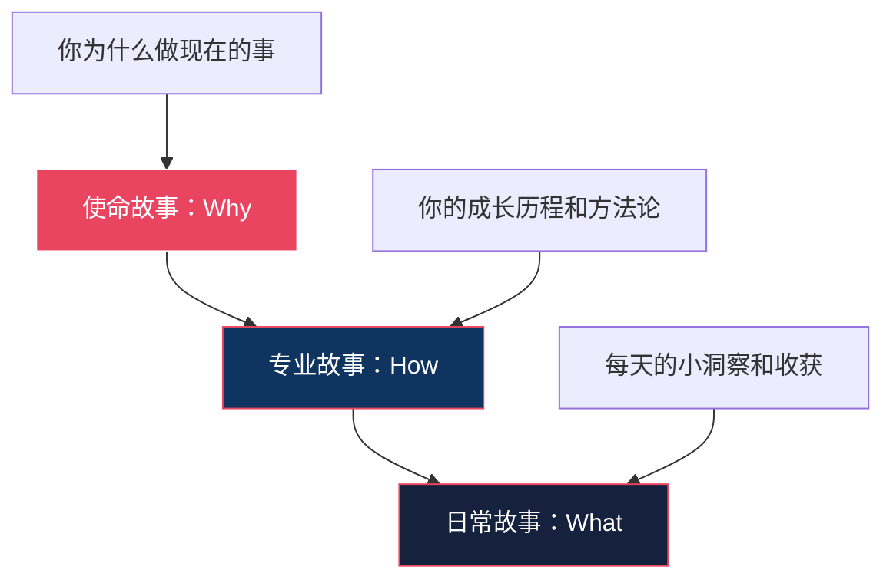

## 二、个人故事打造：英雄之旅框架

### 2.1 故事的大脑科学：为什么叙事是最强传播武器

#### 2.1.1 神经耦合机制

普林斯顿大学神经科学家Uri Hasson的fMRI实验揭示了一个惊人的现象：当讲述者讲故事时，听众的大脑活动模式会与讲述者的大脑活动模式**同步**——这种现象被称为"神经耦合"（Neural Coupling）。更精确地说：

| 听众大脑区域 | 听数据报告时 | 听故事时 |
|-------------|-------------|---------|
| 语言处理区（Wernicke区） | ✅ 激活 | ✅ 激活 |
| 感觉皮层 | ❌ 静默 | ✅ 激活 |
| 运动皮层 | ❌ 静默 | ✅ 激活 |
| 前额叶情感中枢 | ❌ 静默 | ✅ 激活 |
| 镜像神经元系统 | ❌ 静默 | ✅ 强烈激活 |

这意味着**故事让听众的大脑在物理层面"重演"你的经历**，而不是仅仅"接收信息"。当你说"我紧张得手心出汗"时，听众的感觉皮层真的会产生微弱的触觉信号。

#### 2.1.2 催产素释放效应

保罗·扎克（Paul Zak）的研究进一步发现，结构完整的故事会触发听众大脑释放**催产素**——一种与信任、共情和慷慨相关的神经递质。催产素水平升高会导致：

- **信任度提升**：听众更愿意相信你的陈述
- **记忆力增强**：故事细节被编码进长期记忆
- **行动意愿增加**：听完故事后，人们更可能采取行动

关键发现：故事必须包含**情感弧线**（紧张→高潮→释放）才能触发催产素释放。平淡无奇的叙述不会产生这种效果。

#### 2.1.3 故事 vs 数据的传播效率

斯坦福商学院的研究表明：

- **纯数据**：演讲结束后10分钟，听众平均只能记住**5%**的内容
- **数据+故事**：记忆保留率飙升至**65-70%**
- **纯故事**：保留率约**63%**，但缺乏说服力的数据支撑

在个人品牌建设中，故事的四大核心作用：

1. **具象化能力**：将抽象的"我很专业"转化为可感知的经历
2. **建立情感连接**：让受众从"知道你"变成"理解你"
3. **强化记忆锚点**：人们记住故事的概率是记住数据的**22倍**（斯坦福研究）
4. **驱动行为改变**：故事是最古老的说服工具，比逻辑论证有效**数倍**

### 2.2 英雄之旅的完整理论框架

#### 2.2.1 坎贝尔的原始模型

约瑟夫·坎贝尔（Joseph Campbell）在1949年出版的《千面英雄》（*The Hero with a Thousand Faces*）中，通过分析全球各文化的神话传说，提炼出一个普适的叙事结构——**英雄之旅**（Hero's Journey）。这个结构存在于从《奥德赛》到《星球大战》的几乎所有经典故事中。



#### 2.2.2 个人品牌故事的7步简化框架

完整的12阶段英雄之旅过于复杂，不适用于演讲、面试或社交媒体等场景。我们将其精炼为**7个核心步骤**，专门用于个人品牌叙事：

| 步骤 | 英雄之旅对应 | 个人品牌中的含义 | 情感基调 |
|------|-------------|----------------|---------|
| 1. 平凡世界 | 普通世界 | 你曾经的状态，与听众相似的起点 | 平静、熟悉 |
| 2. 召唤与拒绝 | 冒险召唤+拒绝 | 遇到挑战，但犹豫、恐惧、抗拒 | 焦虑、挣扎 |
| 3. 跨越门槛 | 跨越门槛 | 决定行动，踏上改变之路 | 决心、紧张 |
| 4. 考验与磨难 | 考验+接近洞穴 | 遭遇困难、失败、挫折 | 痛苦、坚持 |
| 5. 关键突破 | 严峻考验+奖赏 | 找到方法/洞见/帮助者，实现突破 | 顿悟、兴奋 |
| 6. 归来 | 返回+复活 | 带着收获回到日常，帮助他人 | 成就、感恩 |
| 7. 新使命 | 万灵药 | 决定分享经验，建立品牌使命 | 使命感、热情 |

#### 2.2.3 为什么英雄之旅有效：心理学底层逻辑

英雄之旅之所以成为最有效的个人品牌叙事框架，因为它同时满足了三个心理需求：

**① 认同感（Identification）**
英雄之旅的起点是"平凡世界"——你描述自己曾经和听众一样的困境。这打破了"你高高在上"的认知壁垒，让听众产生"他/她和我一样"的认同感。心理学中的**相似性吸引原则**（Similarity-Attraction Principle）在此发挥作用。

**② 希望感（Hope）**
听众看到你从困境走向成功，会自然产生"如果他/她能做到，我也可以"的信念。这是**社会学习理论**（Bandura）中的**替代性强化**——通过观察他人的成功，增强自我效能感。

**③ 情感弧线（Emotional Arc）**
从低谷到高峰的叙事弧线，符合人类大脑对"问题-解决"模式的天然偏好。库尔特·冯内古特（Kurt Vonnegut）在其博士论文中论证了所有成功故事都可以归纳为几种基本的情感弧线，英雄之旅对应的是最经典的"从低谷到高峰"弧线。

### 2.3 七步故事法：详细拆解与实操指南

#### 第一步：平凡世界——建立共鸣起点

**核心原则**：你的起点必须是听众能够投射自己的地方。

**写作要点**：
- 描述具体的、可感知的状态，而非抽象概念
- 使用听众熟悉的场景和语言
- 暴露真实的脆弱点，而非伪装完美
- 包含感官细节（看到什么、听到什么、感受到什么）

**❌ 错误示例**：
> "我曾经是一个迷茫的年轻人，不知道未来在哪里。"

**✅ 正确示例**：
> "2018年的某个深夜，我坐在出租屋的床边，面前摊着三张信用卡账单，加起来两万三。手机屏幕上是boss直聘的已读不回列表，投了87份简历，面试了6家，全部石沉大海。窗外是北京五环外的路灯，我突然觉得，自己可能真的不适合这座城市。"

**进阶技巧：时间锚定**
在平凡世界中植入具体的时间、地点、数字，让故事具有"纪录片"般的真实感。模糊的"曾经"远不如"2018年11月的某个周三晚上"有说服力。

#### 第二步：召唤与拒绝——增加故事真实感

**核心原则**：没有人喜欢听"我天生就是天才"的故事。犹豫和拒绝让英雄更真实。

**写作要点**：
- 描述你最初为什么抗拒改变
- 展示当时的心理活动和合理化借口
- 暗示改变的"种子"已经在萌芽
- 可以加入外部触发事件（一句话、一个偶然、一个危机）

**示例**：
> "其实很早之前就有人建议我学编程，但我一直觉得'那是理工科的事'。直到有一天，我在公司看到一个实习生用Python写了个脚本，把我需要手动做三天的报表，10分钟就跑完了。那一刻我心里很不舒服——不是因为被比下去了，而是因为我突然意识到，我在用'我不适合'当借口。"

**进阶技巧：内部冲突**
好的拒绝不仅仅是"不想做"，而是内心两种价值观的冲突。比如："稳定的工作"vs"追求热爱"，"害怕失败"vs"不甘平庸"。这种内在冲突让听众产生更深层的共鸣。

#### 第三步：跨越门槛——转折点的戏剧化处理

**核心原则**：这是故事的"不可逆转"时刻——一旦跨过去，就没有回头路。

**写作要点**：
- 描述做出决定的那一刻，而非决定之后的事
- 展示决定的代价（辞职、放弃稳定、投入积蓄）
- 用具体行动而非抽象宣言来表现决心
- 可以是主动选择，也可以是被动推入

**示例**：
> "我花了一个月考虑，最后做了一个决定——辞职。不是因为我准备好了，而是因为我意识到，如果我不跳出去，我永远都不会准备好。辞职那天，领导问我有没有下家，我说没有。他说'你疯了'。我笑了笑，其实我自己也这么觉得。"

#### 第四步：考验与磨难——展示韧性而非完美

**核心原则**：困难的细节越具体，你的突破就越可信。

**写作要点**：
- 列举至少2-3个具体的困难，形成"一波三折"
- 展示失败时的真实情感（挫败、自我怀疑、想放弃）
- 避免"虽然很难但我从没放弃"这种空洞叙述
- 包含至少一个"差点放弃"的时刻

**示例**：
> "前三个月，我每天学8小时，但进度条几乎不动。第一次写爬虫，连requests库都装不上，搞了一整天才发现是Python版本问题。第一次面试，面试官问我'什么是装饰器'，我支支吾吾说了三分钟，他直接说'下一个'。最崩溃的是第四个月，我已经投了40多份简历，只收到两个面试，都是一面就被刷。那天晚上我真的打开了招聘软件，搜索'行政主管'——我以前的岗位。"

**进阶技巧：节奏控制**
考验与磨难部分是故事中最长的段落，需要控制节奏。用短句表达紧张和挫败，用长句表达反思和领悟。交替使用，形成阅读的"呼吸感"。

#### 第五步：关键突破——高潮的构建

**核心原则**：突破必须是"顿悟时刻"（Aha Moment），而非"慢慢变好"。

**写作要点**：
- 明确是什么触发了突破（一个方法、一个洞见、一个人、一次经历）
- 展示突破前后的认知转变
- 用具体数据或成果量化突破
- 将突破提炼为可复用的方法论

**示例**：
> "转折发生在一个周末。我偶然看到一个教程，讲的不是'怎么学Python'，而是'怎么用Python解决一个真实问题'。那个教程让一个完全没编程基础的人，用两周时间做出了一个自动化工具。我突然明白了——我之前的方法是错的。我不该先学语法再找应用，我应该反过来，先找到一个我真正想解决的问题，然后带着问题去学。那天我给自己定了一个规则：每学一个新概念，必须在24小时内用它解决一个实际问题。两周后，我做出了第一个项目——一个自动整理Excel报表的脚本，和那个实习生写的功能一样。"

**进阶技巧：普适化提炼**
突破之后，一定要将你的洞见提炼为**可复用的原则或方法**。这不仅让故事更有价值，也自然过渡到你的品牌定位。例如："带着问题学"就是一个可以传播的方法论。

#### 第六步：归来——证明价值

**核心原则**：用事实和数据证明你的方法有效，而非自我吹嘘。

**写作要点**：
- 用量化数据展示成果（薪资涨幅、粉丝数量、项目规模）
- 描述他人因你的方法而受益的案例
- 保持谦逊，归因于方法而非天赋
- 将成果与听众的需求建立连接

**示例**：
> "用这套方法，我在第六个月拿到了第一个offer，薪资比之前翻了一倍。后来我在知乎分享了这套学习方法，一篇文章获得了2万赞。很多读者私信我说，他们用同样的方法在3-6个月内完成了转行。我开始意识到，问题不在于'适不适合学编程'，而在于'用什么方法学'。"

#### 第七步：新使命——品牌升华

**核心原则**：你的故事不是为了炫耀，而是为了服务他人。

**写作要点**：
- 清晰阐述你的使命和愿景
- 将个人经历升华为普适价值
- 发出邀请，而非命令
- 建立"你也可以"的信念

**示例**：
> "现在，我把这套'问题驱动学习法'做成了一套完整的课程体系，已经帮助了超过5000人完成职业转型。我的信念很简单：没有学不会的技能，只有用错的方法。如果你也正处于我当年的那个深夜，坐在出租屋里怀疑自己——我想告诉你，你缺的不是天赋，是一套对的方法。"

### 2.4 故事的三层嵌套体系

优秀的个人品牌故事不是单一的叙事，而是一个**三层嵌套的叙事体系**，每一层服务于不同的场景和目的：



| 层次 | 核心问题 | 使用场景 | 更新频率 | 示例 |
|------|---------|---------|---------|------|
| 使命故事（Why） | 你为什么做现在的事？ | 演讲、采访、品牌介绍 | 低频（1-2年微调） | "我从月薪3000到年入百万，靠的不是天赋，是一套可复制的方法" |
| 专业故事（How） | 你怎么做到的？ | 课程、文章、深度分享 | 中频（季度更新） | "我用'问题驱动学习法'在6个月完成转行" |
| 日常故事（What） | 你每天在做什么？ | 社交媒体、朋友圈、日常互动 | 高频（每天/每周） | "今天帮一个学员解决了Python爬虫的反爬问题，用了一招…" |

**三层嵌套的关键原则**：
- 使命故事是**锚点**，所有其他故事都指向它
- 专业故事是**证据**，证明你的使命不是空话
- 日常故事是**触点**，保持与受众的持续连接

### 2.5 五种常见场景的故事模板

#### 模板一：电梯演讲（30秒版）

适用场景：社交场合、偶遇、快速自我介绍

我叫[名字]，我是[做什么的]。

几年前，[一句话描述你的困境/起点]。
我尝试了[列举1-2个失败的方法]，但都没用。
直到我发现了[核心方法/洞见]，[一句话描述成果]。

现在我帮助[目标受众]实现[你能提供的价值]。

**示例**：
> "我叫李明，我是做职业转型教练的。三年前我还在工厂流水线上，月薪3500。我试过考研、试过考公，都失败了。后来我发现了一套'问题驱动学习法'，6个月自学转行程序员，薪资翻了5倍。现在我专门帮助蓝领工人通过自学编程实现职业升级。"

#### 模板二：社交媒体长文（800-1500字）

适用场景：知乎、公众号、LinkedIn、小红书

结构框架：
1. **钩子**（1-2句）：用一个反直觉的事实或问题开头
2. **平凡世界**（100-200字）：描述起点
3. **召唤与拒绝**（100-200字）：犹豫和挣扎
4. **考验与磨难**（200-400字）：具体困难，一波三折
5. **关键突破**（200-300字）：顿悟时刻
6. **成果展示**（100-200字）：数据说话
7. **方法论提炼**（100-200字）：可复用的建议
8. **行动呼吁**（1-2句）：邀请互动

#### 模板三：演讲开场（3-5分钟）

适用场景：线下分享、线上直播、会议演讲

**关键技巧**：演讲开场的故事不需要完整走完7步，通常只展示**平凡世界→召唤与拒绝→关键突破的预告**，把完整故事放在演讲主体中展开。

开场示例：
> "2019年，我被公司裁员了。那天我走出写字楼，站在深圳科技园的天桥上，看着下面密密麻麻的车流，脑子里只有一个念头：我35岁了，没有技术背景，简历上全是行政经验，我还能干什么？（停顿）三年后的今天，我站在这里，以一家AI公司的产品总监身份，和你们分享我的经历。这中间发生了什么？这就是今天我要讲的故事。"

#### 模板四：面试自我介绍（2-3分钟）

适用场景：求职面试、合作洽谈

**关键技巧**：面试版故事需要**高度聚焦**，只展示与目标岗位相关的能力和经历。不需要完整走完7步，重点放在**考验→突破→成果**。

结构：
1. 平凡世界（10秒）：一句话背景
2. 召唤（20秒）：为什么选择这个方向
3. 考验→突破→成果（90秒）：核心经历，用STAR法则（Situation-Task-Action-Result）展开
4. 新使命（20秒）：为什么选择这家公司/这个岗位

#### 模板五：品牌故事页（网站/About页面）

适用场景：个人网站、品牌介绍页、合作提案

**关键技巧**：品牌故事页需要**完整性**，走完全部7步，并且在视觉上配合图片、时间线、数据图表。

建议结构：
- 顶部：一句金句总结你的故事
- 时间线：用可视化方式展示关键节点
- 数据卡片：用数字展示成果
- 底部：使命宣言+行动呼吁

### 2.6 故事素材的挖掘与整理

#### 2.6.1 素材挖掘的五种方法

很多人为"我没有故事可讲"而困扰。事实上，**每个人都有故事，只是不知道怎么挖掘**。以下是五种系统化的素材挖掘方法：

**方法一：时间线扫描法**
拿出一张纸，画一条从出生到现在的时间线。标记以下节点：
- 第一次独立完成某件事
- 第一次面对重大选择
- 第一次失败
- 第一次获得认可
- 转折点（搬家、升学、换工作、创业）
- 最低谷的时刻
- 最骄傲的时刻

**方法二：关键词联想法**
围绕你的品牌定位，列出10个关键词（如：转行、自学、创业、失败、坚持），每个关键词写下一个与之相关的具体经历。

**方法三：他人反馈法**
问3-5个了解你的人："你觉得我最值得讲的故事是什么？"你会发现别人眼中的你，往往比你自己看到的更精彩。

**方法四：情绪锚点法**
回忆那些让你情绪波动强烈的时刻——极度恐惧、极度兴奋、极度挫败、极度感动。这些情绪锚点背后往往藏着好故事。

**方法五：成就清单法**
列出你人生中所有"做到了"的事情，无论大小。然后为每件事问自己：**我是怎么做到的？中间经历了什么？**这个"怎么做到的"就是故事的核心。

#### 2.6.2 故事素材库的建立

建立一个个人故事素材库，按以下维度分类：

| 分类维度 | 具体分类 | 用途 |
|---------|---------|------|
| 情感类型 | 挫折故事、突破故事、感动故事、幽默故事 | 根据场景选择合适的情感基调 |
| 时长 | 30秒、2分钟、5分钟、15分钟 | 根据场合选择合适长度 |
| 主题 | 职业、学习、创业、人际关系、健康 | 根据话题匹配相关故事 |
| 品牌维度 | 专业能力、价值观、性格特质 | 多角度展示品牌 |

**素材库格式建议**：

```markdown
## 故事：从月薪3000到年入百万

**时长**：5分钟
**情感类型**：突破故事
**主题**：职业转型
**品牌维度**：专业能力+坚持
**核心洞见**：没有学不会的技能，只有用错的方法

**平凡世界**：2018年，工厂流水线，月薪3500...
**召唤**：看到同事自学转行，但觉得自己没基础...
**门槛**：辞职全职学习，积蓄只够6个月...
**考验**：前三个月进度缓慢，面试被拒40+次...
**突破**：发现"问题驱动学习法"...
**成果**：6个月拿到offer，薪资翻5倍...
**使命**：帮助蓝领工人通过自学编程实现职业升级...
```

### 2.7 故事讲述的进阶技巧

#### 2.7.1 脆弱的力量

布琳·布朗（Brené Brown）在TED演讲《脆弱的力量》中指出：**适度展示脆弱不是软弱，而是建立信任的最有效方式**。

但脆弱需要**有选择地展示**：

| ✅ 有效的脆弱 | ❌ 无效的脆弱 |
|-------------|-------------|
| 展示过去的困难和挣扎 | 展示现在仍未解决的问题 |
| 分享从失败中学到的教训 | 抱怨命运不公 |
| 承认自己的不足和局限 | 过度自我贬低 |
| 展示克服困难的过程 | 只展示痛苦，不展示成长 |

**原则**：脆弱必须服务于"成长叙事"。展示脆弱的目的是让听众看到"我曾经和你一样"，而不是"我很惨"。

#### 2.7.2 细节的魔力

故事的说服力来自**具体细节**，而非泛泛而谈。

**细节层次模型**：

| 层次 | 示例 | 效果 |
|------|------|------|
| ❌ 无细节 | "我曾经很穷" | 无法产生共鸣 |
| △ 弱细节 | "我曾经月薪只有3000" | 有一定共鸣 |
| ✅ 强细节 | "我曾经月薪3000，每天中午只敢点食堂最便宜的套餐——8块钱的土豆丝盖饭，因为能省下12块钱" | 强烈共鸣，画面感十足 |

**感官细节清单**：
- **视觉**：你看到了什么？（屏幕上的数字、窗外的景色、某人的表情）
- **听觉**：你听到了什么？（键盘声、电话铃、某句话）
- **触觉**：你感受到了什么？（手心出汗、心跳加速、冷风）
- **嗅觉**：你闻到了什么？（咖啡味、雨后的土腥味）

#### 2.7.3 对比与反差

反差是故事中最强大的戏剧元素之一。

**常用反差类型**：
- **前后对比**：过去的我 vs 现在的我
- **内外对比**：外在表现 vs 内心想法
- **期望对比**：你以为会怎样 vs 实际发生了什么
- **数量对比**：数据的巨大变化

**示例**：
> "面试官问我'你为什么想转行'，我嘴上说的是'对技术充满热情'，心里想的是'因为我信用卡快还不上了'。"

这种内外对比既真实又幽默，能瞬间拉近与听众的距离。

#### 2.7.4 节奏控制

故事的节奏直接影响听众的情感体验：

**节奏控制技巧**：

| 场景 | 句式 | 效果 |
|------|------|------|
| 紧张/冲突 | 短句、断句、省略号 | 制造紧迫感 |
| 描写/铺垫 | 长句、复合句 | 营造氛围 |
| 顿悟/转折 | 短句+停顿 | 强调关键信息 |
| 数据/成果 | 数字+对比 | 增强说服力 |

**示例**（节奏变化）：
> "第一个月，什么都没学到。（短句，停顿）
> 第二个月，还是什么都没学到。（短句，停顿）
> 第三个月，我开始怀疑自己是不是真的不适合这条路。（长句，铺垫）
> 直到第四个月的某个凌晨两点，我终于跑通了第一个爬虫程序——屏幕上出现了一行行整齐的数据。（长句，细节）
> 我哭了。（短句，冲击力）"

#### 2.7.5 回调与呼应

高级讲故事技巧：在故事的不同部分设置**呼应点**，让整个故事形成闭环。

**示例**：
- 开头："2018年某个深夜，我坐在出租屋里看着信用卡账单"
- 结尾："2023年，我站在500人面前演讲，讲台上的灯光很亮，但我再也不会害怕账单了"

这种首尾呼应让故事具有**完整感**和**仪式感**。

### 2.8 不同平台的故事适配策略

| 平台 | 故事长度 | 核心技巧 | 注意事项 |
|------|---------|---------|---------|
| 微信公众号 | 1500-3000字 | 完整7步，配合图文 | 开头3秒决定是否继续阅读 |
| 知乎回答 | 500-1500字 | 聚焦考验→突破→成果 | 第一句要直接切入痛点 |
| 小红书 | 300-800字 | 反差感+金句+图片 | 标题要有"钩子" |
| LinkedIn | 300-1000字 | 专业视角+数据 | 避免过度煽情 |
| 抖音/视频号 | 1-3分钟 | 只讲"突破"那一刻 | 前3秒必须抓住注意力 |
| 播客 | 5-15分钟 | 完整故事+细节+反思 | 可以更口语化、更随意 |
| 演讲 | 3-10分钟 | 完整7步+互动 | 注意停顿和眼神交流 |
| 面试 | 2-3分钟 | 高度聚焦+STAR法则 | 只讲与岗位相关的能力 |

### 2.9 常见故事误区与纠正

#### 误区一：英雄变上帝

**错误表现**：把自己塑造成从不犯错、天赋异禀的完美形象。

**纠正方法**：英雄之旅的核心是**从平凡到非凡的过程**，而非起点就是非凡。展示真实的困难和挣扎，让听众看到"他/她和我一样，只是找到了方法"。

#### 误区二：苦难叙事

**错误表现**：过度渲染痛苦和挫折，故事变成"比惨大会"。

**纠正方法**：苦难只是故事的**调味料**，不是主菜。听众想看的是你如何克服困难，而不是你有多惨。考验与磨难部分不应超过故事总长的30%。

#### 误区三：没有具体方法

**错误表现**：故事讲完了，听众只记住了"他成功了"，但不知道"怎么成功的"。

**纠正方法**：在关键突破部分，必须提炼出**可复用的方法论**。这不仅是故事的价值所在，也是你品牌定位的核心支撑。

#### 误区四：与听众脱节

**错误表现**：故事起点太高或太低，听众无法产生共鸣。

**纠正方法**：在写故事之前，先做听众画像分析。你的起点必须是听众能够投射自己的地方。对不同听众，同一个故事需要调整起点。

#### 误区五：故事太长或太短

**错误表现**：不分场合，每次都讲同一个完整版本。

**纠正方法**：为同一个核心故事准备**3个版本**——30秒版、3分钟版、10分钟版。根据场合和时间灵活选择。

#### 误区六：忽略行动呼吁

**错误表现**：故事讲完了，但听众不知道接下来该做什么。

**纠正方法**：每个故事都应该有一个**行动呼吁**（Call to Action）。可以是邀请关注、购买课程、加入社群，也可以是简单的"如果你也有类似经历，欢迎在评论区分享"。

### 2.10 故事的迭代与优化

#### 2.10.1 故事测试的四个维度

| 维度 | 测试方法 | 优化方向 |
|------|---------|---------|
| 记忆度 | 讲完后24小时问听众"还记得什么" | 强化被记住的部分，弱化被遗忘的部分 |
| 情感度 | 观察听众的表情和肢体语言 | 在情感薄弱处增加细节或停顿 |
| 行动度 | 统计听完后的转化率（关注、购买、互动） | 优化行动呼吁的位置和方式 |
| 传播度 | 观察听众是否转述你的故事 | 让核心洞见更容易被转述为一句话 |

#### 2.10.2 A/B测试方法

对同一个故事，准备两个版本，分别在不同场合使用，观察哪个版本效果更好。重点测试：

- **开头**：用问题开头 vs 用场景描写开头
- **细节**：多细节版 vs 精简版
- **结尾**：情感升华 vs 直接呼吁行动
- **节奏**：快节奏 vs 慢节奏

#### 2.10.3 故事的持续进化

你的故事不是一成不变的，它应该随着你的成长而进化：

- **每季度**回顾一次故事素材库，添加新的经历
- **每半年**更新一次专业故事，反映最新的能力和成果
- **每年**审视一次使命故事，确保它仍然准确反映你的价值观

### 2.11 实战练习：从零打造你的英雄之旅

#### 练习一：故事素材挖掘（30分钟）

1. 拿出纸笔，画一条从出生到现在的时间线
2. 标记出5-10个关键转折点
3. 为每个转折点写下：发生了什么、你的感受、你学到了什么
4. 从中选出最有"戏剧性"的一个，作为你的核心故事素材

#### 练习二：7步框架填充（45分钟）

选择一个核心故事素材，按7步框架填充：

平凡世界：我曾经[具体状态]，[感官细节]
召唤：直到[触发事件]，我意识到[认知转变]
拒绝：但我当时[犹豫的原因]，[内心的挣扎]
门槛：最终我[做出的决定]，[付出的代价]
考验：过程中我遇到了[具体困难1]、[具体困难2]、[具体困难3]
突破：直到[关键事件]，我发现了[核心方法/洞见]
成果：最终[量化结果]，更重要的是[提炼的方法论]
使命：现在我帮助[目标受众]实现[你能提供的价值]

#### 练习三：三个版本（60分钟）

基于练习二的故事，写出三个版本：
- **30秒版**：电梯演讲，只保留最核心的信息
- **3分钟版**：面试/社交场合，聚焦考验→突破→成果
- **10分钟版**：演讲/分享，完整7步+细节+反思

#### 练习四：故事讲述练习（持续）

1. 对着镜子讲述你的30秒版，直到流畅自然
2. 找3-5个朋友，分别讲述不同版本，收集反馈
3. 记录每次讲述的反应，持续优化

### 2.12 本节核心要点回顾

1. **故事是最强传播武器**：神经科学研究证明，故事能让听众的大脑"体验"你的经历
2. **英雄之旅是黄金框架**：7步结构（平凡世界→召唤与拒绝→跨越门槛→考验与磨难→关键突破→归来→新使命）覆盖了个人品牌故事的全部要素
3. **三层嵌套是完整体系**：使命故事（Why）+专业故事（How）+日常故事（What）构成完整的品牌叙事
4. **细节决定说服力**：具体的时间、地点、数字、感官细节让故事从"可信"变成"真实"
5. **脆弱是力量**：适度展示脆弱建立信任，但必须服务于"成长叙事"
6. **迭代永不停止**：故事需要持续测试、优化、进化，与你的品牌一起成长

---

> **下一节预告**：掌握了故事框架之后，我们将探讨如何将这些故事系统化地传播出去——影响力传播策略。
