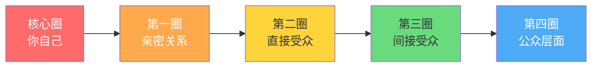
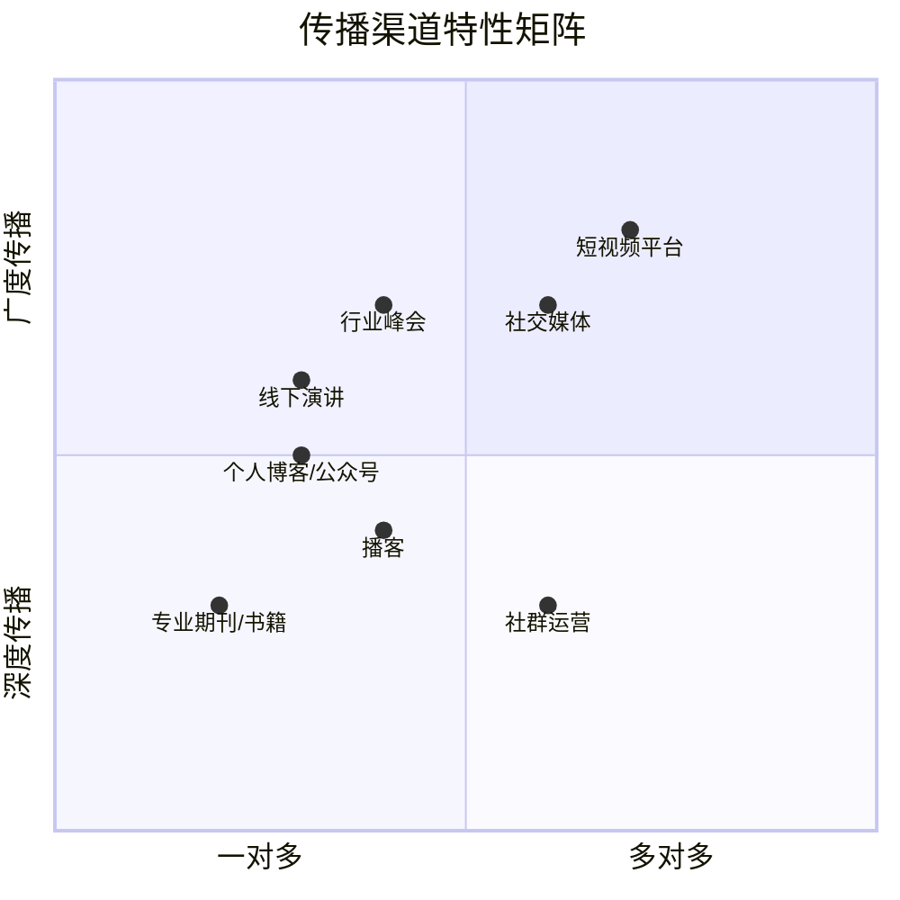
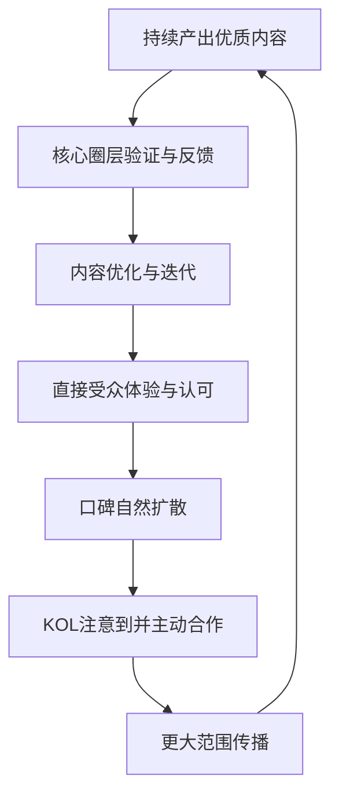

## 三、影响力传播策略

影响力不是自封的头衔，而是他人替你传播的结果。个人品牌的最终目标不是"让所有人知道你"，而是"让对的人主动替你说话"。本章将系统拆解影响力传播的底层逻辑、分层策略、借力方法和口碑触发机制，帮助你从"被动等待关注"转变为"主动设计传播"。

### 3.1 传播的底层逻辑：为什么有些品牌能"破圈"

在讨论具体策略之前，先理解传播发生的底层条件。信息要完成传播，需要同时满足三个条件：

| 条件 | 含义 | 反面案例 |
|------|------|----------|
| **可传播性** | 信息本身具备被转发的"钩子"——简洁、有故事性、能引发情绪 | 长篇技术文档，专业但没人转发 |
| **传播网络** | 信息存在于能被扩散的渠道和关系链中 | 只在私人日记里写，从不公开发表 |
| **传播动机** | 转发者从中获得社交回报——显得有见识、有帮助、有品位 | 内容平庸，转发了也不会给自己加分 |

三个条件缺一不可。很多人只关注"内容质量"而忽略传播网络和传播动机，结果写出很好的东西却无人问津。也有人大肆铺设渠道，但内容本身缺乏传播力，流量来了又走。

**传播力公式**：

传播力 = 内容价值 × 情绪强度 × 传播便利性 × 社交回报

- **内容价值**：信息对受众的实用程度
- **情绪强度**：信息引发的情感波动幅度
- **传播便利性**：是否一句话就能转述、是否容易被截图分享
- **社交回报**：转发这个内容，转发者在社交圈中的形象是否加分

这四个因子是乘法关系——任何一项趋近于零，整体传播力就趋近于零。

### 3.2 传播的"涟漪模型"

个人品牌的传播如同向水中投石——从中心向外扩散，每一层波纹都依赖前一层的推动力。

#### 3.2.1 各圈层详解

**核心圈（涟漪0层）——你自己**

你是一切传播的起点和中心。在这一层，你需要回答三个根本问题：
- 我是谁？（身份定义）
- 我能提供什么价值？（价值主张）
- 我和别人有什么不同？（差异化定位）

如果这三个问题你自己都说不清楚，向外传播的就不是"品牌"，而是"噪音"。

**第一圈（涟漪1层）——亲密关系**

包括家人、挚友、核心合作伙伴。这一层的作用不是"帮你传播"，而是"帮你验证"。你的品牌定位是否真实？你呈现的形象是否和本人一致？亲密关系是你品牌真实性的最后防线。

具体做法：
- 请3-5个最亲近的人用一句话描述"你是做什么的"
- 如果他们的描述各不相同，说明你的品牌定位还不清晰
- 如果他们的描述和你的自我定位差距很大，说明你的品牌表达有问题

**第二圈（涟漪2层）——直接受众**

包括客户、同事、同行。这是你品牌价值的直接体验者。他们在这一层的反馈决定了你的品牌是否有实质内容支撑。

关键指标：
- 复购率/回头率：客户是否愿意再次选择你
- 主动推荐：同事是否在你不在场时提到你
- 同行认可：竞争者是否引用你的观点或方法

**第三圈（涟漪3层）——间接受众**

包括受众的受众、行业圈层。你可能从未直接接触过这些人，但通过第二圈的口碑传递，他们已经对你有了认知。

在这一层，你的品牌信息会被简化、概括，甚至扭曲。你需要确保你的核心标签足够简洁和坚固，能够在多次传递后不变形。"某领域专家"比"擅长A、B、C、D、E的多面手"更容易被准确传递。

**第四圈（涟漪4层）——公众层面**

包括媒体、社会大众。这是大多数人梦寐以求的"出圈"，但也是风险最大的一层。公众层面的传播不可控——你的信息会被断章取义、被误读、被过度简化。

到达这一层的前提条件：前三层已经足够稳固，你有明确的、可以被一句话概括的公众形象。

#### 3.2.2 涟漪扩展的核心原则

**原则一：逐层扩展，不跳级**

每一层都是下一层的信任基础。跳过核心圈直接追求公众知名度，就像地基没打好就盖高楼——也许能盖起来，但随时可能坍塌。

判断标准：当前圈层中超过70%的人对你的品牌有清晰一致的认知时，才可以向下一层扩展。

**原则二：每层有不同的传播策略**

| 圈层 | 传播方式 | 核心工具 | 投入重点 |
|------|----------|----------|----------|
| 核心圈 | 自我认知与定位 | 自我反思、360度反馈 | 时间和诚实 |
| 第一圈 | 深度对话 | 一对一交流、小范围分享 | 真实和信任 |
| 第二圈 | 价值交付 | 专业内容、服务体验 | 质量和一致性 |
| 第三圈 | 口碑扩散 | 可分享内容、案例故事 | 传播素材设计 |
| 第四圈 | 媒体传播 | 公开演讲、媒体报道 | 稀缺性和话题性 |

**原则三：内层的质量决定外层的速度**

不要急于扩展外层。第一圈的信任度不够，第二圈的口碑就不会形成；第二圈的案例不够扎实，第三圈的传播就没有素材。花80%的精力在前三层，公众层面的"出圈"会自然发生。

### 3.3 KOL借力策略：站在巨人的肩膀上

借助已有影响力的人来放大你的声音，是品牌传播的加速器。但"借力"不是"蹭热度"——粗暴的蹭热度只会消耗你的品牌信用。

#### 3.3.1 KOL合作的四种模式

**模式一：内容共创**

与行业KOL联合创作内容——文章、视频、直播、播客。借助他们的平台触达更多受众。

操作步骤：
1. **筛选目标KOL**：不是粉丝最多的，而是受众和你高度重合的。一个10万精准粉丝的垂直KOL，比一个100万泛粉丝的大V更有价值
2. **提供独特价值**：不要说"我们合作吧"，而是说"我能为你的受众提供X价值"。KOL愿意合作的前提是他们的受众能获益
3. **降低合作门槛**：先从小型合作开始——一次联合直播、一篇联合文章。建立信任后再扩大合作范围
4. **明确利益分配**：谁出内容、谁出平台、收益如何分配，提前约定清楚

**模式二：权威背书**

请行业权威为你背书或推荐。一句来自权威的推荐语，胜过你自说自话一百遍。

心理学原理——社会认同（Social Proof）：当人们不确定如何判断时，会参考他人的行为和评价。权威人物的背书提供了强有力的社会认同信号。

获取背书的方法：
- 先免费为权威提供价值（帮忙、送资料、解决他们的问题）
- 在获得认可后，礼貌地请求一句推荐语
- 提供推荐语的草稿，降低对方的时间成本
- 给予回报——在你的内容中提及、推荐他们的项目

**模式三：圈层渗透**

加入目标受众所在的社群、协会、圈子，通过参与和贡献来建立影响力。

核心原则：**先给予，后索取**。进入一个新圈子后的前三个月，只做三件事——回答问题、分享资源、帮助他人。当你在圈子里建立了"靠谱"的口碑后，你的品牌传播会自然而然地发生。

具体做法：
- 选择2-3个核心社群，深度参与（不要在10个社群里潜水）
- 定期输出高质量内容（不是复制粘贴，而是原创见解）
- 主动连接社群中的人脉（帮A介绍B，成为网络中的"连接者"）
- 参与线下活动（面对面的信任建立效率远高于线上）

**模式四：事件营销**

创造或参与有话题性的事件，通过事件的传播势能来提升品牌知名度。

事件营销的核心是"借势"或"造势"：
- **借势**：在行业热点事件中提供独特视角。当所有人都在报道事件本身时，你分析事件背后的原因和影响
- **造势**：发起挑战、发布报告、组织活动。需要有足够的"新闻性"——要么是首次、要么是最多、要么是最快、要么是最反常

风险提示：事件营销的投入产出比高度不确定。一次成功的事件营销可能带来10倍回报，也可能完全没有水花。建议将其作为"加分项"而非"核心策略"。

#### 3.3.2 KOL合作的避坑指南

| 常见错误 | 正确做法 | 原因分析 |
|----------|----------|----------|
| 找最大的KOL合作 | 找受众最匹配的KOL | 受众不匹配，曝光再多也是无效流量 |
| 只合作一次就期待效果 | 长期、多次、多形式合作 | 信任需要反复触达才能建立 |
| 把KOL当广告渠道 | 把KOL当合作伙伴 | KOL的受众信任KOL的判断，如果合作看起来像广告，信任会断裂 |
| 不做效果追踪 | 设定明确的合作指标 | 没有数据就无法优化下一次合作策略 |

### 3.4 口碑传播的触发机制

口碑传播是品牌传播的最高境界——让别人替你说话。你不需要付费，不需要请求，受众自发地向他人推荐你。

#### 3.4.1 口碑传播的心理学基础

乔纳·伯杰（Jonah Berger）在《疯传》一书中提出了"STEPPS"模型，解释了内容被广泛传播的六个驱动力：

1. **社交货币（Social Currency）**：分享这个内容能让我看起来更好吗？
2. **触发物（Triggers）**：在日常生活中有什么东西会让人想到这个内容？
3. **情绪（Emotion）**：这个内容是否引发了强烈的情感反应？
4. **公开性（Public）**：别人能看到我在使用/分享这个内容吗？
5. **实用价值（Practical Value）**：这个内容对别人有实际帮助吗？
6. **故事（Stories）**：这个内容是否包含一个好故事？

#### 3.4.2 六大口碑触发机制

**机制一：超预期体验**

当你的服务或内容超出受众预期时，他们会有强烈的分享冲动。

心理学原理——预期违背理论：人们对体验的评价不取决于绝对水平，而取决于与预期的差距。达到预期是"满意"，超出预期是"惊喜"，低于预期是"失望"。

实操方法：
- 设定合理预期（不要过度承诺）
- 在交付时多给一点点（额外的小礼物、多一条建议、提前交付）
- 制造"彩蛋"（隐藏的额外价值，让人发现时有惊喜感）

案例：某咨询顾问在交付报告后，额外附赠了一份"行业趋势速览"——客户没有要求，但这份额外材料让客户主动在朋友圈推荐了他。

**机制二：社交货币**

分享你的内容能让受众显得"有见识"、"有品位"、"走在前沿"，他们就更愿意分享。

打造社交货币的方法：
- 提供独家信息（"内部消息"、"最新数据"、"首次披露"）
- 创造身份标签（"聪明人都这样做"、"真正的专业人士会..."）
- 设计可炫耀的成就（完成挑战后的证书、排行榜、徽章）
- 提供谈资（有趣的数据、反常识的观点、行业八卦）

**机制三：情绪共振**

能引发强烈情感的内容最容易被传播。但不同情绪的传播效果差异巨大：

| 情绪类型 | 传播效果 | 典型场景 |
|----------|----------|----------|
| 愤怒 | 高传播、高风险 | 揭露行业黑幕（可能引火烧身） |
| 敬畏 | 高传播、正面效果 | 展示极致专业水准、突破性成果 |
| 幽默 | 高传播、中性效果 | 行业梗、自嘲、反差萌 |
| 焦虑 | 高传播、负面效果 | 恐惧营销（短期有效但伤害品牌） |
| 感动 | 中传播、正面效果 | 用户故事、蜕变历程 |
| 惊喜 | 中传播、正面效果 | 反常识数据、意外发现 |

安全策略：优先选择"敬畏"和"幽默"，慎用"愤怒"和"焦虑"。

**机制四：实用价值**

对受众有直接实用价值的内容，他们会有"囤积"和"转赠"的本能。

高实用价值内容的特征：
- **可操作**：看完就能用，不需要额外学习
- **可量化**：有具体数字、步骤、模板
- **可节省**：帮受众节省时间、金钱或精力
- **可解决**：针对受众的具体痛点给出解决方案

实操模板：在内容中加入"收藏型元素"——Checklist、模板、对比表、工具清单。这类内容的收藏率和转发率通常是普通内容的3-5倍。

**机制五：可见性与可提及性**

口碑传播需要"触发物"——在日常场景中，有什么东西会让人想到你？

设计触发物的方法：
- 创造专属术语（让人在特定场景下自然想到你）
- 与高频场景绑定（"每次开会前用XX方法"）
- 设计视觉符号（固定的配色、图标、头像风格）
- 制造仪式感（固定的栏目、固定的时间、固定的格式）

案例：某效率博主创造了"两分钟法则"这个术语。每当人们遇到小任务犹豫是否要做时，就会想到"两分钟法则"，进而想到这个博主。这个术语成了一个持续触发口碑传播的锚点。

**机制六：故事化传播**

人们不传播信息，人们传播故事。你的品牌需要一个"可传播的故事"。

好故事的要素：
- **主角**：一个具体的人（可以是你自己、客户、团队成员）
- **困境**：遇到了什么具体的挑战
- **转折**：做了什么不同的事
- **结果**：取得了什么可量化的成果
- **启发**：这个故事说明了什么道理

模板：
> [主角]曾经面临[困境]，尝试了[常见方法]但没有效果。后来通过[你的方法/理念]，在[时间]内实现了[具体成果]。这个经历说明[你的核心观点]。

### 3.5 内容传播的渠道矩阵

不同渠道有不同的传播特性，选择适合你品牌的渠道组合至关重要。

#### 渠道选择的三个维度

**维度一：目标受众在哪里**

不要选择"最好的"渠道，选择"目标受众在的"渠道。B2B领域的决策者可能更多在LinkedIn和行业社群，而非抖音。

**维度二：你的内容形式优势**

| 内容形式 | 适合的渠道 | 不适合的渠道 |
|----------|------------|--------------|
| 深度长文 | 公众号、博客、知乎 | 微博、短视频 |
| 视觉化内容 | 小红书、Instagram | 知乎、播客 |
| 视频/直播 | B站、YouTube、抖音 | 公众号（纯文字） |
| 音频 | 播客平台、喜马拉雅 | 小红书、Instagram |
| 互动讨论 | 社群、论坛、知识星球 | 公众号（单向传播） |

**维度三：你的投入能力**

每个渠道都需要持续投入。选择2-3个核心渠道深耕，远好于在10个渠道浅尝辄止。

### 3.6 传播策略的系统化执行

将以上策略落地为可执行的系统，需要建立"传播飞轮"：

#### 3.6.1 月度传播计划模板

| 周次 | 核心动作 | 具体内容 | 衡量指标 |
|------|----------|----------|----------|
| 第1周 | 内容生产 | 发布2篇深度内容 | 阅读量、收藏率 |
| 第2周 | 社群互动 | 在3个核心社群回答问题、分享见解 | 新增连接数 |
| 第3周 | KOL互动 | 转发/评论KOL内容、提出合作意向 | KOL回复率 |
| 第4周 | 口碑收集 | 收集用户反馈、整理案例、复盘数据 | 新增推荐数 |

#### 3.6.2 传播效果追踪指标

| 指标类别 | 具体指标 | 数据来源 | 健康标准 |
|----------|----------|----------|----------|
| 曝光指标 | 内容阅读量、页面浏览量 | 各平台后台 | 月增长>10% |
| 互动指标 | 评论率、转发率、收藏率 | 各平台后台 | 互动率>3% |
| 转化指标 | 新增关注、咨询量、合作邀约 | 后台+私信 | 稳步增长 |
| 口碑指标 | 被提及次数、被推荐次数 | 舆情监控 | 逐月增加 |
| 深度指标 | 复购率、合作续约率 | CRM系统 | >60% |

### 3.7 常见误区与纠正

**误区一：追求"爆款"而忽略持续性**

很多人把传播策略等同于"搞一个爆款内容"。爆款可遇不可求，持续输出优质内容才是品牌传播的根基。100篇80分的内容，远胜于1篇100分的内容加99篇60分的内容。

纠正：建立内容生产系统，而非依赖灵感爆发。固定的选题框架、写作流程、发布节奏，比"等待灵感"可靠得多。

**误区二：只关注"粉丝数量"而忽略"粉丝质量"**

10万泛粉丝和1万精准粉丝，商业价值可能天差地别。精准粉丝会复购、会推荐、会付费，泛粉丝只贡献一个数字。

纠正：从一开始就以"目标受众"为标准筛选关注者，而非追求所有人关注你。宁可增长慢一点，也要保证每一个关注者都是对的人。

**误区三：把"传播"等同于"自吹"**

有些人理解的传播就是不断宣传自己有多厉害。这种做法在涟漪模型的内层（亲密关系、直接受众）尤其有害——亲近的人会因为你的自吹而疏远你。

纠正：让成果替你说话。展示案例、分享过程、提供价值，而非直接宣称自己有多优秀。"他帮XX公司解决了YY问题"比"我是YY领域的顶级专家"有说服力一百倍。

**误区四：忽略负面传播的管理**

品牌传播不是只有正面。一个负面评价的传播力通常是正面评价的3-5倍（负面偏差效应）。忽略负面反馈，或者在面对负面时采取对抗态度，会让品牌受损。

纠正：建立负面反馈处理机制——快速回应、真诚道歉（如果确实有错）、提供解决方案、跟进后续。把负面事件转化为展示专业态度的机会。

### 3.8 进阶：影响力传播的高阶策略

#### 3.8.1 从"借力"到"造势"

初级阶段是借别人的势，高级阶段是让别人借你的势。当你的品牌足够强大时，行业活动会主动邀请你、媒体会主动报道你、KOL会主动找你合作。

造势的核心能力：
- **定义议题**：不是参与别人的话题，而是创造新的话题
- **输出标准**：你的方法论成为行业参考标准
- **建立平台**：从"内容生产者"升级为"平台运营者"

#### 3.8.2 传播网络的架构思维

不要把传播看作线性的"内容→渠道→受众"，而是看作一个网络。在这个网络中，你的角色不只是"节点"（发出信息），更是"连接者"（连接不同圈层的人和资源）。

连接者策略：
- 介绍不同圈层的人相互认识
- 整合不同领域的信息，创造跨界洞察
- 组织跨圈层的活动或项目

当你成为网络中的关键连接者时，你的影响力不再依赖于你自己产出内容的频率——整个网络都在为你传播。

#### 3.8.3 长期主义视角

影响力传播是一场马拉松，不是短跑。最强大的个人品牌都是经过数年甚至数十年的持续积累建立起来的。

复利效应：
- 第1年：几乎看不到效果，90%的人在这个阶段放弃
- 第2-3年：开始有稳定的受众基础和口碑传播
- 第4-5年：形成行业认可，KOL合作主动找上门
- 第5年以上：成为领域内的"默认选项"，传播主要靠口碑自动运转

坚持的秘诀不是意志力，而是系统。建立可持续的内容生产系统、传播渠道系统、关系维护系统，让品牌传播成为一种习惯而非负担。

***

> **本章核心要点回顾**：影响力传播遵循涟漪模型，从内向外逐层扩展；借力KOL的核心是提供对等价值而非蹭热度；口碑传播的六大触发机制（超预期体验、社交货币、情绪共振、实用价值、可见触发物、故事化）是品牌自传播的发动机；选择2-3个核心渠道深耕远好于全面撒播；传播是一场需要系统支撑的长期主义实践。
