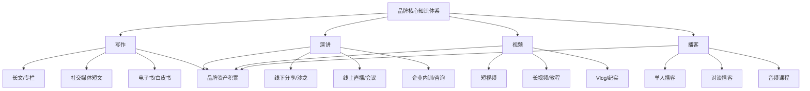
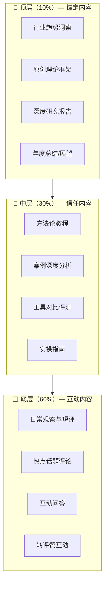
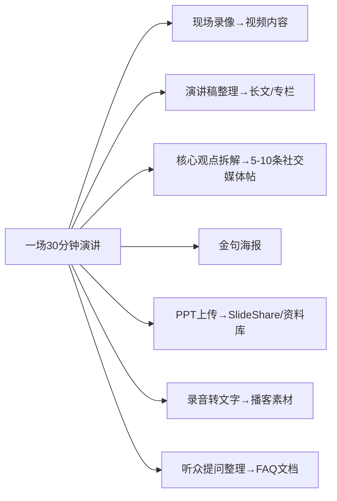
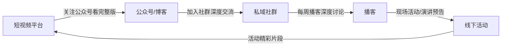
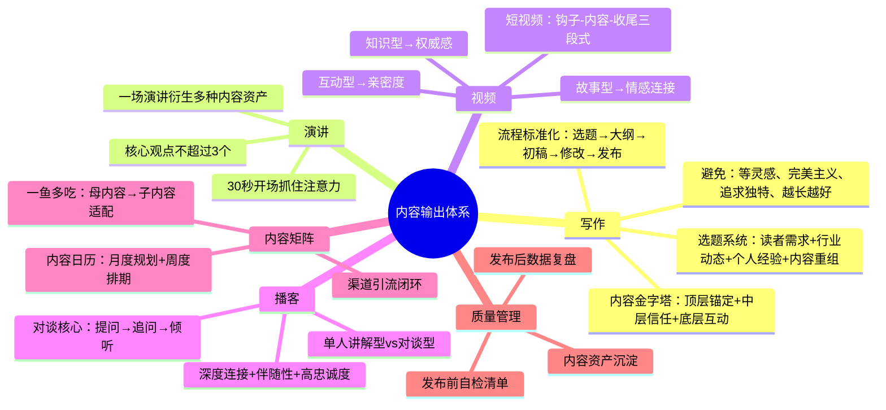

## 四、内容输出体系

内容输出是个人品牌的"造血系统"。没有持续、高质量的内容输出，品牌定位就是空中楼阁，影响力传播就是无源之水。内容输出体系的核心不是"写几篇文章"或"录几个视频"，而是构建一套可持续运转的内容生产机制——它决定了你能以什么频率、什么质量、什么形式向目标受众传递价值。

一个完整的内容输出体系包含四个核心模块：写作、演讲、视频和播客。它们不是彼此独立的渠道，而是围绕同一个品牌内核展开的"内容矩阵"——同一套知识体系，通过不同形式触达不同场景下的受众。

### 4.1 写作：品牌的"地基"

写作是个人品牌最基本的输出形式，也是最具"复利效应"的形式——一篇好文章可以持续为你带来曝光和信任数月甚至数年。与视频和演讲相比，写作的门槛最低、可搜索性最强、资产属性最明确。在所有内容形式中，写作是唯一能让受众"按自己的节奏"消化你观点的媒介，这也意味着写作能承载最深的思想密度。

#### 4.1.1 写作的核心原则

**聚焦主题，形成"内容引力场"**

围绕你的品牌定位来写，不要什么都写。当你持续输出同一领域的深度内容时，搜索引擎、平台算法和读者心智都会把你与这个领域绑定。这就是"内容引力场"——你写得越多，这个领域的读者就越容易被你吸引。

判断标准很简单：写完一篇文章后问自己——"这篇文章发出去，会不会让目标受众更确信我是这个领域的专家？"如果答案是否定的，要么换主题，要么换角度重新切入。

**提供价值，每次输出都有"获得感"**

每篇文章都要让读者有所收获。"收获"可以是：一个新的认知框架、一个可立即使用的技巧、一个引发思考的案例、一次情感上的共鸣。最忌讳的是"正确的废话"——读完觉得都对，但什么也没记住、什么也用不上。

检验方法：写完后尝试用一句话概括"读者看完这篇能得到什么"。如果说不出来，说明价值点不清晰。

**保持频率，"稳定"比"爆发"重要**

稳定的内容输出比偶尔的爆款更重要。原因有三：平台算法偏爱活跃创作者；读者的信任需要持续喂养；写作本身是一种需要持续练习的技能。

建议的频率底线：
| 平台类型 | 最低频率 | 推荐频率 | 说明 |
|---------|---------|---------|------|
| 公众号/博客 | 每周1篇 | 每周2-3篇 | 长文为主，2000-5000字 |
| 知乎/头条 | 每周2-3条 | 每天1条 | 中短文为主，500-2000字 |
| 朋友圈/微博 | 每天1条 | 每天2-3条 | 短评、观察、日常分享 |
| LinkedIn | 每周2-3篇 | 每周4-5篇 | 职业相关内容，800-1500字 |

**建立风格，让读者"听声辨人"**

形成你独特的写作风格和表达习惯。风格不是刻意造出来的，而是在持续写作中自然沉淀的。但你可以有意识地培养几个辨识度特征：固定的开头方式、标志性的比喻体系、特定的句式节奏、统一的视觉排版风格。

风格的辨识度测试：把你的文章和同领域其他人的文章混在一起，去掉署名后，读者能否分辨出哪些是你的？如果能，说明你的风格已经成型。

#### 4.1.2 内容金字塔：三层结构

内容金字塔是一个经典的框架，帮助你平衡内容的深度、广度和频率：

**顶层——锚定内容（10%）**：这是你的"代表作"，低频高质。一篇深度行业分析或原创理论框架可以奠定你在行业内的专业地位。这类内容的特点是：写作周期长（一周到一个月）、篇幅长（5000字以上）、信息密度高、原创观点突出。它的作用不是日常互动，而是"有人问你是谁的时候，你可以把这篇文章甩过去"。

**中层——信任内容（30%）**：这是你建立专业信任的主力内容，中频中质。方法论教程、案例分析、工具评测都属于这一层。它的特点是：有明确的"用完即走"价值，读者看完能直接用。写作周期1-3天，篇幅2000-5000字。

**底层——互动内容（60%）**：这是你保持存在感的基础内容，高频低质（这里"低质"指投入成本低，不是质量差）。日常观察、热点评论、问答互动。写作周期几小时甚至几分钟，篇幅500字以内。它的作用是维持与受众的日常连接，让算法持续推荐你。

#### 4.1.3 内容选题系统

选题是写作中最关键的环节——选题错误，再好的文笔也救不回来。一个可靠的选题系统包含四个来源：

**来源一：读者需求挖掘**

直接从目标受众的问题和痛点中提取选题。方法包括：
- 社群/评论区高频问题整理（建立"问题库"文档，持续积累）
- 行业论坛/问答平台热榜监控（知乎热榜、Stack Overflow、Reddit相关版块）
- 客户/同事常见咨询记录
- 搜索引擎关键词工具（如5118、百度指数、Google Trends）挖掘长尾需求

**来源二：行业动态追踪**

从行业新闻、政策变化、技术趋势中提取选题。建立你的"信息源清单"：

| 信息源类型 | 具体来源 | 检查频率 |
|-----------|---------|---------|
| 行业媒体 | 3-5个核心行业媒体/公众号 | 每天 |
| 学术前沿 | arXiv、Google Scholar、知网 | 每周 |
| 社交媒体 | Twitter/微博行业KOL | 每天 |
| 政策文件 | 政府网站、行业监管公告 | 实时关注 |
| 竞品动态 | 同领域其他品牌主的内容 | 每周 |

**来源三：个人经验沉淀**

从你自己的实践、思考、失败中提取选题。这是最稀缺的选题来源，因为它不可复制。包括：项目复盘、踩坑记录、方法论总结、认知升级过程。读者最爱看的不是"正确答案"，而是"从错误到正确的过程"。

**来源四：内容重组与升级**

将已有的高质量内容进行跨平台改编、深度升级或组合创新。例如：一篇爆款公众号文章→拆成5条知乎回答→扩展成一个线上课程模块→沉淀为电子书的一个章节。同一套内容，通过形式和深度的变化，可以在多个平台持续输出。

#### 4.1.4 写作流程标准化

将写作从"灵感驱动"变为"流程驱动"，才能保证稳定的输出频率：

**Step 1：选题确认（15分钟）**

从选题库中挑选，确定核心观点和目标读者。用一句话写下："这篇文章要告诉读者________，读完之后他们能________。"

**Step 2：大纲搭建（30分钟）**

确定文章结构。推荐使用"问题-原因-方案-案例"四段式结构，或者"是什么-为什么-怎么做"经典结构。大纲到H3级别即可，不需要细化到每一段。

**Step 3：初稿写作（2-4小时）**

按照大纲快速写完初稿。核心原则是"先完成，再完美"。不要边写边改，不要反复斟酌用词。初稿阶段追求的是"把想法从脑子里倒出来"，文字粗躁没关系。

**Step 4：修改润色（1-2小时）**

至少修改两遍：
- 第一遍：结构修改——检查逻辑是否通顺、论据是否充分、篇幅是否合理
- 第二遍：文字修改——删除冗余、优化表达、检查错别字

**Step 5：发布前检查（15分钟）**

确认标题吸引力、摘要/导语是否抓人、排版是否美观、配图是否合适、链接是否有效。

#### 4.1.5 长文写作的进阶技巧

**故事弧线法**：即使是技术文章或行业分析，也可以用故事弧线来组织。"背景铺垫→冲突出现→探索过程→关键发现→结论升华"——这个结构能让读者像追剧一样读完长文。

**数据锚定法**：在文章关键位置嵌入具体数据。"效率提升了"不如"效率提升了37%"有说服力。数据不需要都是自己的一手数据，行业报告、学术论文、权威机构的公开数据都可以引用，但必须注明来源。

**节奏控制法**：长文最怕的是"平"——从头到尾同一个节奏。好的长文应该像音乐一样有起伏：密集的信息段之后接一个轻松的故事或比喻，严肃的分析之后接一个幽默的点评。每隔800-1000字给读者一个"呼吸点"。

**金句设计法**：每篇文章至少要有1-2句可以被单独摘出来传播的"金句"。金句的特点是：短（20字以内）、有节奏感、表达了一个反直觉或高度浓缩的观点。例如："你以为的顿悟，不过是别人的基本功。"

#### 4.1.6 写作的常见误区

**误区一："等有了灵感再写"**

真相：专业写作者靠的是系统和纪律，不是灵感。灵感是写作的"加速器"，但不是"发动机"。建立固定的写作时间（比如每天早上7-9点），坐下来写，不管有没有灵感。写得多了，灵感自然就来了。

**误区二："我要写出完美的文章再发"**

真相：完美主义是内容输出的最大敌人。一篇80分的文章今天发出去，比一篇100分的文章永远在修改要好得多。况且，"完美"是一个主观标准——你以为的不完美，在读者看来可能刚刚好。

**误区三："我的观点不够独特，不值得写"**

真相：99%的观点都不是全新的，但"你的表达方式+你的经验背景+你的受众"这个组合是独一无二的。同样一个观点，你用你的案例和语言讲出来，对于你的受众来说就是新的。

**误区四："写得越长越好"**

真相：篇幅应该服务于信息密度。能用1000字讲清楚的事情，不要拉到5000字。读者不是根据字数来判断价值的，而是根据"读完之后获得了多少有用信息"。

### 4.2 演讲：品牌的"加速器"

演讲是建立信任最快的方式——因为演讲是"实时的、不可编辑的、全方位的"。听众能看到你的表情、听到你的声音、感受你的气场，这比任何文字都更有说服力。一篇文章读者可能花5分钟扫读就关掉了，但一场30分钟的演讲，听众会给你完整的30分钟注意力——这在碎片化时代是极其稀缺的。

#### 4.2.1 演讲品牌化的三个关键

**开场30秒：抓住注意力**

开场决定了听众是否愿意继续听下去。三种高效的开场方式：

| 开场方式 | 适用场景 | 示例 |
|---------|---------|------|
| 提问式 | 引发思考、制造参与感 | "在座各位，有多少人觉得自己不擅长公众表达？举手看看。" |
| 故事式 | 建立情感连接、降低心理距离 | "三年前的今天，我在一次500人的演讲中忘词了，站在台上沉默了整整20秒……" |
| 数据式 | 制造冲击、建立权威 | "根据LinkedIn的调研，影响力建立的第一要素不是专业能力，而是被人看见的频率——而78%的专业人士在这方面是不合格的。" |

**绝对不要用的开场**："大家好，我是XXX，很高兴来到这里……"——这是浪费你最宝贵的30秒。把自我介绍放到开场之后，先给听众一个"为什么要听你讲"的理由。

**中间传递核心观点：不超过3个**

人的工作记忆容量是7±2个信息块（Miller's Law），但在演讲场景下，注意力被分散后实际能记住的更少。一场演讲的核心观点不要超过3个，每个观点用"观点→论据→案例→总结"的结构展开。

观点之间的衔接也很关键。用明确的过渡句："第一个关键是什么，第二个关键是为什么，第三个关键是怎么做"——这种"路标式"的衔接让听众始终知道你在演讲的什么位置。

**结尾留下行动号召**

让听众知道下一步做什么。没有行动号召的演讲就像没有结尾的故事——听完觉得"不错"，然后就忘了。行动号召可以是：
- 一个具体的行动（"今天回去，列出你的三个核心优势"）
- 一个思考问题（"想一想，如果你明天失去现在的工作，你的品牌还剩什么？"）
- 一个连接方式（"扫描这个二维码，加入我的社群继续交流"）

#### 4.2.2 演讲准备的完整流程

**提前4周：确定主题和大纲**

了解活动背景、听众画像（年龄、职业、知识水平、核心诉求）、演讲时长。根据这些信息确定演讲的核心观点和结构。这个阶段你需要完成一份详细的演讲大纲，包括每个部分的时间分配。

**提前2周：制作PPT/视觉材料**

PPT是辅助工具，不是演讲稿。遵循"一页一个观点"的原则，文字尽量少，用图和关键词代替长段文字。字体不小于24号，配色不超过3种。

**提前1周：完整排练至少3次**

- 第1次：对着镜子/手机录像，检验内容逻辑和时间控制
- 第2次：找1-2个信任的人当听众，获取反馈
- 第3次：模拟真实场景（站立、用翻页笔、计时），做最终调整

**提前1天：场地和设备确认**

提前到达场地，测试投影、音响、翻页笔、网络连接。确认站位（站在哪里能让全场看到）、灯光（是否有刺眼的直射光）、走动范围。

#### 4.2.3 现场演讲的控场技巧

**眼神接触的"三角法"**：不要盯着PPT或某一个点。将观众席分成左、中、右三个区域，轮流与每个区域的观众进行3-5秒的眼神接触。这会让全场都觉得"他在跟我说话"。

**停顿的力量**：在关键观点前后停顿1-2秒。停顿不是"忘词了"，而是给听众消化的时间，同时也是在强调"接下来的话很重要"。很多新手演讲者害怕沉默，所以不停地说话——但沉默恰恰是最有力量的修辞工具。

**肢体语言的"能量圈"**：你的肢体动作应该在你身体前方形成一个"能量圈"——双手自然张开，掌心向上或面向观众，手势幅度与场地大小匹配。避免的肢体语言：双手插兜、抱臂胸前、不停走动、背对观众。

**应对冷场和突发状况**：

| 状况 | 应对策略 |
|------|---------|
| 观众低头看手机 | 抛出一个互动问题或现场投票 |
| 忘词了 | 停顿，喝口水，说"让我回到刚才的重点"，从上一个观点重新接 |
| 设备故障 | 不要等修好，直接走到观众中间继续讲 |
| 时间不够 | 跳过中间案例，直接讲核心观点和结论 |
| 观众提问超出你的知识范围 | 诚实说"这个我需要研究一下"，承诺后续跟进 |

#### 4.2.4 从演讲到品牌资产的转化

一场演讲的价值不应该止步于现场。聪明的品牌经营者会把一场演讲转化为多种内容资产：

这就是"一次创作，多次分发"的内容杠杆。一场30分钟的演讲，可以衍生出一周甚至一个月的内容素材。

### 4.3 视频：品牌的"放大器"

在短视频时代，视频是触达受众最高效的渠道。视频的优势在于三个维度：信息密度高（视觉+听觉+文字三通道同时传递信息）、情感传递强（表情、语气、肢体语言比文字更有感染力）、算法推荐友好（各平台都在给视频内容更多的流量倾斜）。

但视频也是门槛最高的内容形式——它需要面对镜头的勇气、基本的拍摄和剪辑能力、以及比文字更高的制作成本。因此，视频策略的核心不是"什么都拍"，而是找到视频形式与你的品牌定位的最佳结合点。

#### 4.3.1 视频内容的三种类型

**知识型视频：建立权威感**

分享专业知识、技巧教程。这类视频的核心是"信息价值"——观众看完能学到东西。典型形式包括：
- 屏幕录制教程（适合技术、设计、数据分析等领域）
- 白板讲解（适合策略、方法论、框架类内容）
- PPT讲解+画中画（适合线上课程、行业分析）
- 真人出镜讲解（适合观点输出、行业评论）

知识型视频的关键指标是"完播率"和"收藏率"。如果观众看一半就走了，说明内容密度不够或节奏太慢；如果收藏率高但点赞率低，说明内容实用但缺乏情感共鸣——后续需要在"有趣"上下功夫。

**故事型视频：建立情感连接**

讲述个人经历、案例故事。这类视频的核心是"情感价值"——观众看完能产生共鸣。典型形式包括：
- 个人成长故事（从困境到突破的叙事弧线）
- 客户案例故事（用具体的人物和数据讲故事）
- 行业幕后故事（展示观众看不到的"后台"）
- 失败复盘故事（最容易引发共鸣的内容类型）

故事型视频的关键指标是"点赞率"和"评论率"。点赞代表情感认同，评论代表深度互动。如果一条视频的评论区很活跃但内容本身引发争议，你需要评估这种争议是否符合你的品牌定位。

**互动型视频：建立亲密度**

回答问题、直播互动、挑战赛。这类视频的核心是"参与价值"——观众觉得自己是内容的一部分。典型形式包括：
- Q&A视频（收集粉丝问题，集中回答）
- 直播连麦（与粉丝或同行实时对话）
- 挑战/打卡（发起或参与平台热门挑战）
- 反应视频（对热点事件或其他创作者内容的实时反应）

互动型视频的关键指标是"互动率"（评论+分享/播放量）和"粉丝转化率"。这类内容的目标不是传播广度，而是把路人转化为粉丝、把粉丝转化为铁粉。

#### 4.3.2 短视频制作的标准化流程

短视频的核心理念是"批量生产、持续迭代"。不要追求单条视频的极致完美，而是追求"每条都比上一条好一点"。

**选题阶段（15分钟/条）**

从内容金字塔的中层和底层选择适合视频化的主题。判断标准：这个话题能否在60秒内讲清楚核心观点？如果需要30分钟才能讲透，要么拆成系列，要么选择其中一个切面。

**脚本阶段（20分钟/条）**

即使是1分钟的短视频也需要脚本。推荐使用"钩子-内容-收尾"三段式：

[钩子 - 前3秒] 提出问题/制造冲突/给出反直觉结论
[内容 - 主体] 展开论述，不超过3个要点
[收尾 - 最后5秒] 总结金句 + 引导互动（关注/评论/收藏）

**拍摄阶段（30分钟/条）**

对于真人出镜类视频，拍摄环境比设备更重要：
- 光源：自然光最佳，面朝窗户；人工光源用环形灯或柔光箱
- 背景：干净简洁，避免杂乱；书架、绿植、纯色墙面都可以
- 收音：在安静环境下拍摄；如果环境噪音大，用领夹麦
- 机位：手机竖屏拍摄，镜头与眼睛齐平，距离40-60cm

**剪辑阶段（30-60分钟/条）**

推荐工具梯队：
| 工具 | 适用场景 | 学习成本 | 价格 |
|------|---------|---------|------|
| 剪映（CapCut） | 快速剪辑、字幕、模板 | 低 | 免费 |
| Final Cut Pro | Mac用户的专业剪辑 | 中 | 买断制 |
| DaVinci Resolve | 调色+剪辑一体化 | 高 | 免费版够用 |
| Premiere Pro | 团队协作、复杂项目 | 中-高 | 订阅制 |

剪辑的核心原则：删掉所有"嗯""啊""那个"等口头禅，保持节奏紧凑；每个镜头不超过10秒就切换一次画面（用切镜头、放大缩小、插入B-roll等方式）；字幕必加，因为大量用户在静音环境下刷视频。

**发布阶段（10分钟/条）**

- 标题：包含关键词+引发好奇（"3个技巧让你的PPT提升10倍"比"PPT技巧分享"好）
- 封面：清晰、有重点文字、色彩对比强烈
- 标签：3-5个，混合使用热门标签和精准标签
- 发布时间：测试你的受众最活跃的时间段（通常是工作日晚7-10点、周末上午10-12点）

#### 4.3.3 长视频/教程的制作策略

长视频（10分钟以上）是知识型品牌的重武器。它的价值在于：深度内容建立权威、高完播率提升算法权重、可沉淀为课程/付费内容。

**结构设计**：长视频必须有清晰的"目录感"。在视频开头30秒内告诉观众"今天要讲什么、分几个部分、每部分大约几分钟"。然后在每个部分的切换点用视觉标记（章节卡片、进度条）让观众知道自己在哪里。

**节奏控制**：每3-5分钟设置一个"兴奋点"——可以是一个案例、一个反直觉的观点、一个视觉变化、一个互动问题。如果观众连续5分钟都在看同一种画面听同一个节奏，跳出率会急剧上升。

**工具与素材**：提前准备好所有需要展示的素材（截图、录屏、图表、B-roll）。临场发挥只适用于即兴点评，核心内容必须提前规划。

#### 4.3.4 视频内容的常见误区

**误区一："设备不够好所以拍不了"**

真相：手机+自然光+安静环境，就能拍出80分的视频。设备的提升只能帮你从80分到95分，但从0到80分靠的是内容本身。先用手机拍100条，再考虑升级设备。

**误区二："我的领域不适合做视频"**

真相：几乎所有领域都可以视频化。法律可以讲案例、金融可以讲分析、编程可以录屏幕、写作可以讲思路。视频只是一种载体，关键是你愿不愿意用这种载体来传递你的知识。

**误区三："做视频就要追热点"**

真相：追热点是策略之一，但不应该是主要策略。热点的生命周期越来越短（通常只有24-72小时），而你的品牌需要的是长期价值。80%的视频应该是"常青内容"——任何时候看都有价值的教程、方法论、案例分析。

**误区四："一条视频爆了就all in视频"**

真相：单条爆款可能是算法随机推荐的结果，不代表你的视频策略已经跑通。至少需要30-50条视频的数据，才能判断什么类型、什么风格、什么话题真正适合你。

### 4.4 播客：品牌的"深度连接器"

播客是一种独特的媒介形式——它比文字更有温度，比视频更轻量，比演讲更亲密。播客的核心优势在于"伴随性"：听众可以在通勤、运动、做家务时收听，这意味着播客能占据其他内容形式无法触及的时间段。

更重要的是，播客听众的忠诚度和粘性远高于其他平台。一档播客的听众可能只有几千人，但这些听众每周固定收听30-60分钟，连续听几个月甚至几年——这种深度连接是短视频的"刷到即走"完全无法比拟的。

#### 4.4.1 播客的定位策略

在开播之前，你需要回答四个核心问题：

**问题一：你的播客是给谁听的？**

播客的受众定位应该比其他渠道更精准。不要试图做一档"所有人都爱听"的播客。"给25-35岁的互联网从业者讲职业成长"比"讲人生道理"精准得多。

**问题二：你的播客能提供什么独特价值？**

播客市场竞争已经很激烈。你的差异化可以来自：
- 独特的视角（同样是讲管理，从一线员工视角讲vs从CEO视角讲完全不同）
- 独特的形式（纯讲解、对谈、圆桌、叙事纪录片）
- 独特的深度（别人讲10分钟的你讲60分钟，别人泛泛而谈你逐条拆解）
- 独特的嘉宾资源（你能请到别人请不到的人）

**问题三：你的更新频率是什么？**

播客的更新频率比其他内容形式更重要，因为听众是"订阅制"的——他们会在固定时间期待你的更新。建议的频率：

| 频率 | 适合类型 | 每期时长 | 制作难度 |
|------|---------|---------|---------|
| 每日 | 新闻评论、短知识 | 5-15分钟 | 高（需要持续产出） |
| 每周 | 行业分析、对谈 | 30-60分钟 | 中（最推荐的频率） |
| 双周 | 深度内容、纪录片式 | 45-90分钟 | 中-低 |
| 月更 | 特别企划、年终盘点 | 60-120分钟 | 低（但难以培养习惯） |

**问题四：你的盈利模式是什么？**

播客的变现路径包括：广告植入（品牌赞助）、付费订阅（会员专享内容）、知识付费（课程/咨询导流）、社群运营（播客→社群→付费圈子）。在开播前不需要确定具体的盈利模式，但需要知道播客在你的品牌变现体系中扮演什么角色。

#### 4.4.2 单期播客的制作流程

**Step 1：选题与大纲（1-2小时）**

确定本期主题、核心观点、结构大纲。如果是对谈节目，还需要准备嘉宾背景调研和问题清单（15-20个问题，实际讨论中可能用到8-10个）。

**Step 2：录制（录制时长=目标时长×1.5）**

录制时长通常比最终播出时长长50%，因为需要删减口误、跑题、冗余部分。录制设备建议：
- 入门：USB麦克风（如Blue Yeti、舒尔MV7）+ 安静房间
- 进阶：XLR麦克风 + 音频接口（如Focusrite Scarlett）+ 防喷罩
- 软件：Audacity（免费）、GarageBand（Mac免费）、Adobe Audition（专业）

**Step 3：后期制作（录制时长×2-3倍）**

后期制作包括：噪音消除、音量均衡、剪辑冗余段落、添加片头片尾音乐、插入过渡音效。如果时间紧张，可以用AI工具（如Descript）自动去除口头禅和静音段。

**Step 4：发布与分发**

- 托管平台：小宇宙、喜马拉雅、苹果播客、Spotify
- 每期必做：写一段150-300字的节目简介（show notes），包含核心观点摘要和时间戳
- 推广：在社交媒体发布金句海报、精华片段短视频、引导收听的帖子

#### 4.4.3 对谈型播客的主持技巧

对谈是播客最常见的形式，也是最难做好的形式。好的对谈不是"主持人问、嘉宾答"的采访，而是两个有思想的人之间的深度对话。

**提问技巧**：
- 用开放式问题而非封闭式问题（"你怎么看远程办公的未来？"优于"你觉得远程办公会普及吗？"）
- 追问比提问更重要——"你刚才说的这个很有意思，能展开说说吗？"
- 准备好"万能追问"清单：最让你意外的是什么？如果重来一次你会怎么做？你最常被误解的是什么？

**控场技巧**：
- 嘉宾跑题时：自然地接一句"这个点很有意思，我们等下再聊，先把刚才的XX讲完"
- 嘉宾紧张时：先聊轻松的话题暖场，前5分钟可以不录
- 嘉宾说嗨了时间不够：用"最后一个问题是……"来收尾

**倾听技巧**：
- 不要急着准备下一个问题而忽略了嘉宾当前回答中的精彩点
- 用"嗯""对""确实"等简短回应让嘉宾知道你在认真听
- 好的主持人贡献30%的内容，引导嘉宾贡献70%

### 4.5 内容矩阵：多渠道协同策略

单一渠道的内容输出是不够的——你需要一个"内容矩阵"，让不同渠道的内容相互引流、相互增强。但内容矩阵不是"同一篇内容发到所有平台"，而是根据每个平台的特性进行适配。

#### 4.5.1 一鱼多吃：内容的复用与适配

一次深度创作产出的"母内容"，可以拆解为多个"子内容"适配不同平台：

| 母内容 | 子内容 | 适配平台 | 改编要点 |
|--------|--------|---------|---------|
| 一篇5000字深度文章 | 精华摘要500字 | 公众号/LinkedIn | 保留核心观点+引导阅读全文 |
| | 5-10条短观点 | 微博/Twitter | 每条独立成章，加话题标签 |
| | 信息图/思维导图 | 小红书/Instagram | 视觉化核心框架 |
| | 问答体回答 | 知乎/Quora | 从文章中提取可回答的问题 |
| | 60秒口播视频 | 抖音/视频号 | 只讲一个核心观点 |
| 一场30分钟演讲 | 完整录像 | B站/YouTube | 加字幕和章节标记 |
| | 3-5条精华片段 | 抖音/视频号 | 每条1-2分钟，独立成篇 |
| | 演讲全文 | 公众号/博客 | 整理为长文发布 |
| | 金句海报 | 朋友圈/小红书 | 设计3-5张可传播的海报 |
| 一期60分钟播客 | 完整音频 | 小宇宙/Spotify | 带show notes和时间戳 |
| | 精华片段音频 | 微信/朋友圈 | 1-3分钟的精彩片段 |
| | 对谈文字稿 | 公众号/博客 | 整理为对话体文章 |
| | 观点卡片 | 小红书/即刻 | 提取嘉宾金句做视觉卡片 |

#### 4.5.2 渠道间的引流闭环

每个渠道都应该有向其他渠道引流的"钩子"，形成闭环：

引流的关键原则：在当前平台提供80%的价值，用20%的"未完待续"引导用户去下一个平台获取完整价值。切忌在当前平台只给10%的钩子就急着引流——用户会觉得被套路了。

#### 4.5.3 内容日历的制定与执行

内容日历是内容矩阵的"调度中心"。它将你的内容计划从"随机发布"变为"有节奏的系统化输出"。

**月度规划**：每月初确定本月的2-3个核心主题，确保覆盖内容金字塔的三个层级。同时标注本月的行业大事件、节日热点、产品/服务节点。

**周度排期**：将月度主题拆解为每周的具体内容。示例周度排期：

| 日期 | 平台 | 内容类型 | 主题 | 状态 |
|------|------|---------|------|------|
| 周一 | 公众号 | 深度文章 | [本月主题A]方法论 | 待写 |
| 周二 | 朋友圈 | 短评+配图 | 周一文章金句摘要 | 待发 |
| 周三 | 知乎 | 问答回答 | 从本月主题中提取的问题 | 待写 |
| 周四 | 视频号 | 60秒口播 | 周一文章核心观点 | 待拍 |
| 周五 | 社群 | 互动讨论 | 本周话题讨论+答疑 | 待发 |
| 周六 | 播客 | 录制 | 下周播客内容录制 | 待录 |
| 周日 | — | 休息/复盘 | 本周数据复盘+下周规划 | — |

**执行纪律**：内容日历不是"写了就要严格执行"的刚性计划，而是"有计划才能灵活调整"的弹性框架。允许30%的内容因为热点、灵感或突发情况而调整，但70%的核心内容必须按计划执行。

### 4.6 内容质量管理

输出频率很重要，但质量是品牌的根基。一个可靠的质量管理体系包括三个环节：

#### 4.6.1 发布前的自检清单

每次发布前，过一遍这个清单：

- [ ] **价值检验**：读者看完能获得什么？这个价值足够支撑他们花时间阅读/观看吗？
- [ ] **独特性检验**：同样的内容别人是否已经说过？我的角度/案例/深度有什么不同？
- [ ] **准确性检验**：引用的数据是否准确？案例的细节是否真实？有没有过时的信息？
- [ ] **可读性检验**：排版是否舒适？段落是否过长？有没有使用小标题/列表/加粗来帮助扫读？
- [ ] **品牌一致性检验**：这篇文章是否符合我的品牌定位和风格？会不会给受众造成认知混乱？

#### 4.6.2 发布后的数据复盘

定期（每周或每月）复盘内容数据，找到规律：

| 指标 | 含义 | 关注重点 |
|------|------|---------|
| 阅读量/播放量 | 触达了多少人 | 标题和封面的吸引力 |
| 完播率/读完率 | 内容是否留住了人 | 内容质量和节奏 |
| 点赞率 | 内容是否引发了认同 | 情感共鸣度 |
| 评论率 | 内容是否引发了讨论 | 话题性和互动性 |
| 收藏率 | 内容是否值得回看 | 实用价值和信息密度 |
| 转发率 | 内容是否值得分享 | 社交货币价值 |
| 粉丝增长率 | 内容是否带来了新粉丝 | 品牌吸引力 |

复盘时不要只看单条内容的数据，而要看趋势——你的阅读量是在上升还是下降？哪种类型的内容数据最好？哪个时间段发布效果最好？这些规律会指导你优化后续的内容策略。

#### 4.6.3 内容资产的沉淀与管理

内容不应该"发完就完"。高质量的内容是品牌的长期资产，需要系统化管理：

**内容库的建立**：按主题、形式、平台三个维度建立你的内容库。推荐使用Notion、飞书多维表格或Airtable。每条内容记录以下信息：标题、发布日期、平台、主题标签、核心观点、数据表现、可复用程度。

**常青内容的定期更新**：技术教程、方法论指南、行业分析等"常青内容"，每隔3-6个月检查一次是否需要更新。过时的内容比没有内容更损害品牌。

**内容的资产化**：将系列文章整合为电子书、将播客精华整理为有声课程、将演讲内容沉淀为培训材料。这些"资产化"的内容可以成为品牌变现的核心产品。

### 4.7 本节核心要点

***
