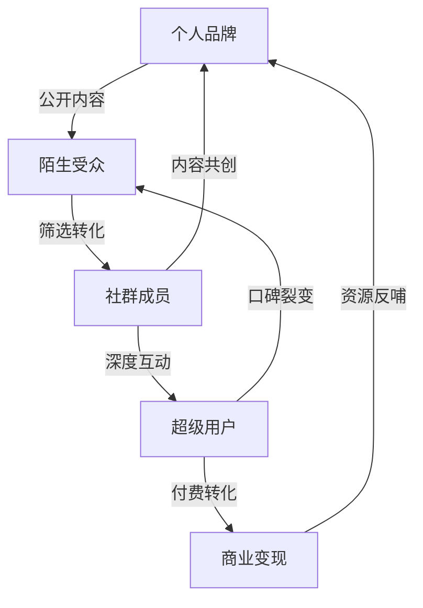
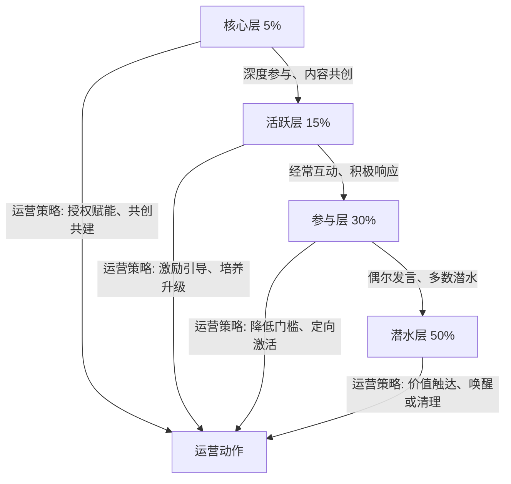
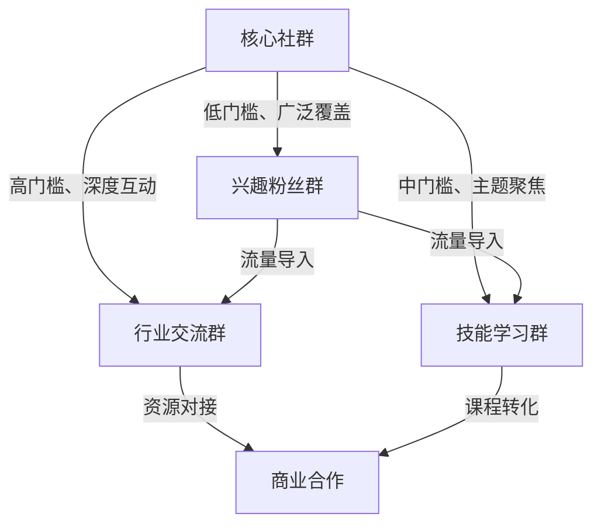

## 五、社群运营沟通

社群是个人品牌从"单向传播"走向"双向共建"的关键一步。一个运营良好的社群，能让品牌影响力呈指数级扩散——每个活跃成员都是品牌的传播节点。然而，社群运营绝非"拉个群发发消息"那么简单，它是一套涉及心理学、组织行为学、内容策略和沟通技术的系统工程。

### 5.1 社群的本质：从流量池到信任场

#### 5.1.1 社群≠微信群

很多人把"社群"等同于"微信群"，这是最常见的认知偏差。微信群只是社群的一种载体，社群的本质是**基于共同价值观和利益的人际连接网络**。

社群的三个核心要素：

| 要素 | 说明 | 缺失后果 |
|------|------|----------|
| 共同目标 | 成员因同一兴趣/需求聚集 | 群变成"僵尸群"，无人发言 |
| 互动机制 | 成员之间、成员与运营者之间有来有往 | 变成单向通知群 |
| 价值交付 | 成员能持续获得独有价值 | 留存率断崖式下降 |

#### 5.1.2 社群对个人品牌的三重价值

**信任深化器**：公开内容让受众"认识你"，社群让受众"信任你"。在封闭环境中持续输出价值，信任积累速度远超公开平台。心理学中的"曝光效应"（mere exposure effect）表明，反复接触会显著提升好感度。

**内容共创场**：社群成员的真实问题、反馈和经验，是最优质的内容素材来源。许多头部博主的爆款内容灵感，都来自社群中的一条提问。

**口碑放大器**：一个忠诚社群成员的推荐，抵得上100次广告投放。社群天然具备"口碑裂变"的土壤——成员之间会自发分享、互相背书。

### 5.2 社群类型与定位策略

#### 5.2.1 五种主流社群类型

**学习型社群**：以知识传递为核心，成员目标是"学到东西"。典型如读书会、技能训练营、行业研习社。沟通重点在于内容质量和学习体验设计。

**兴趣型社群**：以共同爱好为纽带，成员目标是"找到同好"。典型如摄影俱乐部、跑步团、手工艺圈。沟通重点在于氛围营造和活动组织。

**行业型社群**：以职业发展为导向，成员目标是"拓展人脉、获取信息"。典型如产品经理交流群、创业者社群。沟通重点在于资源对接和信息筛选。

**品牌型社群**：以某个IP或品牌为核心，成员目标是"靠近偶像、获得归属"。典型如粉丝社群、会员俱乐部。沟通重点在于情感连接和特权设计。

**工具型社群**：以解决特定问题为功能，成员目标是"高效解决问题"。典型如客服群、项目协作群。沟通重点在于响应效率和问题解决率。

#### 5.2.2 定位三角模型

选择社群类型前，用三个维度做交叉验证：

| 维度 | 自问 | 示例 |
|------|------|------|
| 我能提供什么 | 我的核心优势和可交付价值是什么？ | 行业洞察、实操技能、人脉资源 |
| 用户需要什么 | 目标人群最迫切的需求是什么？ | 职业成长、副业收入、社交圈层 |
| 竞品缺什么 | 同类社群没有做到的是什么？ | 深度实操、一对一答疑、线下连接 |

三者交集，就是你的社群定位。定位越精准，启动越轻松。

### 5.3 社群搭建：从0到1的沟通设计

#### 5.3.1 入群门槛设计

门槛不是"筛选付费能力"，而是"筛选匹配度"。一个愿意认真填写入群问卷的人，大概率比"扫码就进"的人更活跃。

**推荐门槛组合**：

- **问卷筛选**：3-5个问题，了解对方背景、期望和投入意愿。例如："你目前在XX领域最想突破的一个瓶颈是什么？"
- **付费门槛**：金额不必高，但付费行为本身就是一种承诺。心理学中的"一致性原理"——付过费的人更倾向于持续参与。
- **推荐制**：老成员推荐新成员，既保证质量，又增强老成员的归属感。
- **内容门槛**：要求提交一篇自我介绍、作品或学习笔记，筛选出愿意主动输出的人。

#### 5.3.2 欢迎仪式设计

新成员入群的前10分钟，决定了他未来3个月的活跃度。

**标准欢迎流程**：

1. **即时欢迎**：入群后5分钟内，运营者发送个性化欢迎语（提及对方的入群问卷回答）
2. **引导自我介绍**：提供自我介绍模板，降低表达门槛
3. **资源包发送**：发送社群精华合辑、使用指南、常见问题FAQ
4. **首日互动**：当天内找到一个与新成员相关的话题，@对方参与讨论
5. **一周跟进**：入群第3天和第7天，私聊了解体验、解答疑问

【欢迎模板示例】

欢迎 @新成员 加入！🎉

从你的问卷中看到你对「XX领域」特别关注，群里有几位同方向的朋友可以多交流。

📌 入群三步走：
1. 先看置顶消息了解群规和资源
2. 发一段自我介绍（模板见群公告）
3. 参与今天的话题讨论：「你在XX中遇到的最大挑战是什么？」

有任何问题随时 @我 或私聊，期待你的分享！

#### 5.3.3 社群规则制定

规则不是限制，而是保护。好的规则让成员感到安全、让运营有据可依。

**必须包含的规则要素**：

| 规则类型 | 内容要点 | 示例表述 |
|----------|----------|----------|
| 发言规范 | 允许/禁止的内容类型 | "鼓励分享实操经验，禁止纯广告链接" |
| 互动礼仪 | 交流时的行为准则 | "对事不对人，观点不同可以辩论但不可人身攻击" |
| 信息保护 | 隐私和保密要求 | "群内讨论内容未经允许不得截图外传" |
| 违规处理 | 违反规则的后果 | "首次警告，第二次禁言24小时，第三次移出" |
| 价值约定 | 运营者的承诺 | "每周至少一次深度分享，每次提问24小时内回复" |

### 5.4 社群沟通的四个核心原则

#### 5.4.1 平等而非居高临下

社群中你的角色是"引领者"而非"统治者"。这一点说起来容易，做起来极难——当你拥有了几百上千人的"听众"，权力感会不知不觉地膨胀。

**具体做法**：

- **用提问代替命令**：不要说"大家今天必须讨论XX"，而是"最近XX话题很火，大家怎么看？"
- **承认自己的局限**：公开说"这个问题我不太确定，有经验的朋友可以分享一下吗？"——这不会削弱权威，反而增加真实感。
- **记住成员的名字和故事**：在讨论中引用成员之前的分享，"上次小王提到的那个方法，今天正好可以用上"。这传递的信号是"我关注你"。
- **主动展示"被改变"**：当成员的观点说服了你，公开承认"我之前的理解有偏差，听了你的分析后觉得更有道理"。

**反面案例**：某知识博主在社群中，每条回复都是"你应该去看我的XX课"，成员提问被转化为营销机会。三个月后，群里只剩机器人和广告号。

#### 5.4.2 引导而非灌输

单向输出的社群必然走向沉寂。真正的活跃来自成员之间的互动，而你的角色是"话题设计师"和"讨论催化剂"。

**话题引导的三个层次**：

| 层次 | 目标 | 话术模板 | 示例 |
|------|------|----------|------|
| 表层互动 | 激活潜水成员 | "大家觉得A好还是B好？投个票" | "日更和周更，你选哪个？" |
| 中层讨论 | 产生观点碰撞 | "这个问题没有标准答案，说说你的理由" | "AI会取代文案吗？你身边的案例呢？" |
| 深层共创 | 集体产出成果 | "我们一起拆解这个案例，每人贡献一个角度" | "这个营销方案哪里可以优化？" |

**引导话术进阶**：

- 冷启动时：先@几位活跃成员回答，制造"有人在讨论"的氛围
- 讨论跑偏时：温和拉回，"这个角度很有意思，我们先聚焦XX问题，YY的话题可以另开一个讨论"
- 气氛沉闷时：抛出争议性观点（但不要故意引战），"我说一个可能不受欢迎的观点……"
- 讨论深入时：总结归纳成员观点，形成可沉淀的内容

#### 5.4.3 筛选而非追求规模

一个50人的高质量社群，价值远超一个5000人的沉默群。这是社群运营中最反直觉的认知。

**为什么规模不等于价值**：

- **邓巴数限制**：人类能维持的有效社交关系上限约150人。超过这个数字，社群质量必然稀释。
- **社会惰化效应**：群体越大，个体参与的意愿越低（"反正别人会说的"）。
- **信息过载**：消息太多→成员屏蔽→活跃度下降→恶性循环。

**筛选的四个时机**：

1. **入群时**：通过门槛筛选（见5.3.1）
2. **入群后1周**：观察新成员参与度，不活跃者私聊了解原因
3. **月度复盘**：统计活跃度数据，对长期沉默成员做"唤醒或清理"决策
4. **季度评估**：重新审视社群定位，淘汰不再匹配的成员（温和通知，不伤害关系）

**清理话术模板**：

@成员名 你好，注意到你最近比较忙，群里互动不多。
理解每个人都有自己的节奏，这个群可能暂时不是你的优先级。
我先帮你移出群聊，等你有时间了随时欢迎回来。🙏

#### 5.4.4 规则先行，执行一致

规则是社群的"宪法"，而执行一致性是规则的生命线。一条规则如果只对部分人执行，比没有规则更糟糕。

**执行一致性的关键**：

- **对所有人一视同仁**：违规的是核心成员/老朋友，同样按规则处理。私下可以给面子，公开必须公正。
- **先私后公**：发现违规行为，先私聊提醒，给对方改正机会。只有屡教不改时才公开处理。
- **记录与公示**：维护一份简要的"执法记录"，对重大处理决定做群内公示，让所有人看到规则是有效的。
- **定期更新**：规则不是一成不变的，每季度根据社群发展情况修订一次，修订前征求成员意见。

### 5.5 日常运营沟通的实操体系

#### 5.5.1 内容日历设计

社群运营需要节奏感。无规律的内容输出，会让成员产生"这个群是不是没人管了"的疑虑。

**周度内容日历模板**：

| 日期 | 内容类型 | 目的 | 形式 |
|------|----------|------|------|
| 周一 | 本周话题预告 | 设定预期 | 图文消息 |
| 周二 | 行业资讯解读 | 提供信息价值 | 短评+讨论引导 |
| 周三 | 实操案例拆解 | 提供方法价值 | 长文或视频 |
| 周四 | 成员经验分享 | 激发参与 | @成员分享+点评 |
| 周五 | 互动问答 | 解决具体问题 | 接龙或投票 |
| 周六 | 周末轻话题 | 调节气氛 | 轻松话题或趣闻 |
| 周日 | 本周精华汇总 | 内容沉淀 | 汇总文档 |

**关键提醒**：日历是框架，不是枷锁。遇到热点事件或成员紧急问题，灵活调整。

#### 5.5.2 提问与回答的沟通艺术

社群中最高频的互动是"提问-回答"，而大部分运营者在这个环节做得很粗糙。

**提问引导技巧**：

好的提问能激发讨论，糟糕的提问让群陷入沉默。

| 低效提问 | 高效提问 | 改进原因 |
|----------|----------|----------|
| "大家有什么问题吗？" | "这周大家在XX项目中遇到的最大卡点是什么？" | 具体化、降低回答门槛 |
| "你们觉得XX怎么样？" | "XX和YY两种方案，你更倾向哪个？为什么？" | 提供选项、要求理由 |
| "有没有人了解XX？" | "我正在研究XX，找到了A和B两个方向，有经验的朋友能帮我判断一下吗？" | 提供背景、降低社交压力 |

**回答的标准动作**：

1. **确认问题**：复述一遍问题，确保理解准确。"你的意思是……对吗？"
2. **分层回答**：先给结论，再给原因，最后给行动建议。
3. **引用来源**：数据、案例、权威观点，增加可信度。
4. **留出延伸**："这个话题还可以从XX角度展开，有兴趣的话我们深入聊。"
5. **反向确认**："不知道有没有回答到你的点？如果还有不清楚的随时追问。"

#### 5.5.3 社群沉默的诊断与激活

社群沉默是运营者最大的焦虑。但"沉默"不一定是坏事——关键是区分"健康沉默"和"病态沉默"。

**沉默诊断表**：

| 症状 | 可能原因 | 解决方案 |
|------|----------|----------|
| 群消息少但私聊多 | 成员习惯私聊，社群信任未建立 | 增加群内互动奖励，培养公开讨论习惯 |
| 只有运营者发言 | 内容方向偏差或成员参与门槛太高 | 调整内容方向，降低参与门槛（投票、选择题） |
| 成员只看不说话 | 潜水观望，缺少"第一个吃螃蟹"的人 | 培养"种子用户"，每次讨论先安排2-3人带头 |
| 热度周期性波动 | 与成员的工作生活节奏有关 | 在低谷期安排自动化内容，在高峰期加大互动 |
| 新成员不发言 | 欢迎流程不到位或群氛围有"门槛感" | 优化欢迎流程，降低首条发言的心理门槛 |

**激活策略**：

- **红包激活法**：发一个小红包（不需要大额），附带一个问题。人们拿了红包会觉得"欠了人情"，更倾向于回复。
- **争议话题法**：抛出一个有争议但不敏感的观点。"我认为XX比YY更重要，你们同意吗？"
- **求助法**：以请教的姿态提问。"我遇到一个问题想请大家帮忙看看……"——人天然喜欢被需要的感觉。
- **成果展示法**：分享社群成员的成绩或进步。"恭喜 @成员 最近完成了XX，他之前在群里分享过这个方向的困惑。"
- **线下联动法**：组织一次线上直播或线下聚会，线下的温度能显著激活线上的互动。

### 5.6 冲突管理与危机沟通

#### 5.6.1 社群冲突的五种类型

| 类型 | 表现 | 严重程度 | 处理方式 |
|------|------|----------|----------|
| 观点分歧 | 对某话题持不同意见 | 低 | 引导理性讨论，不偏袒任何一方 |
| 人身攻击 | 从讨论观点升级为攻击个人 | 中 | 立即制止，私聊双方，公开说明立场 |
| 广告刷屏 | 发布无关广告或推销信息 | 中 | 按规则处理，首次警告，再犯移出 |
| 小团体对立 | 群内形成派系，互相攻击 | 高 | 分别私聊核心人物，必要时移除煽动者 |
| 舆情危机 | 群内事件被截图外传引发外部舆论 | 极高 | 立即控制信息源，发布官方声明，必要时法律介入 |

#### 5.6.2 冲突处理的四步法

**第一步：冷却（0-5分钟）**

不要急于表态。冲突发生后的第一反应往往是情绪化的。先观察，判断冲突性质和严重程度。

**第二步：隔离（5-30分钟）**

如果冲突在群内公开发生，立即私聊相关方。不要在群里"当裁判"——公开处理会让双方都下不了台，冲突反而升级。

私聊话术：
@成员名 我看到你和XX的讨论了，你们都有道理。
先把群里的消息放一放，我们私下聊聊，看看怎么解决？

**第三步：调解（30分钟-24小时）**

分别了解双方立场，找到共识点。大部分冲突的本质是"信息不对称"或"感受被忽视"——补充信息、确认感受，问题就解决了一大半。

**第四步：复盘（24小时后）**

冲突解决后，在群内做一次简短的"规则重申"（不点名），同时内部复盘：这个冲突是否暴露了规则的漏洞？是否需要更新社群规范？

#### 5.6.3 危机沟通模板

当社群出现重大事件（如成员公开指责、负面信息外泄），需要一套标准的危机响应流程：

【危机响应SOP】

T+0：发现危机
├─ 确认事实：收集相关信息，不要在信息不全时表态
├─ 内部对齐：与核心团队快速沟通，统一口径
└─ 暂缓动作：暂停所有常规社群活动

T+1h：初步回应
├─ 公开声明：承认事件存在，表明正在处理
├─ 私聊核心成员：防止核心成员因信息真空而猜测
└─ 信息收集：全面了解事件经过

T+4h：正式处理
├─ 公布调查结果：基于事实，不含情绪
├─ 公布处理措施：具体、可执行、有时间线
└─ 表达态度：真诚、不推诿、有担当

T+24h：后续跟进
├─ 跟进落实情况
├─ 收集反馈
└─ 更新社群规则（如需要）

### 5.7 社群活跃度与留存的深层策略

#### 5.7.1 社群生命周期管理

每个社群都有生命周期，硬撑不如顺应。

| 阶段 | 时间 | 特征 | 运营重点 |
|------|------|------|----------|
| 启动期 | 0-1个月 | 成员陌生，互动少 | 欢迎仪式、破冰活动、种子用户培养 |
| 成长期 | 1-6个月 | 活跃度上升，话题丰富 | 内容沉淀、规则完善、核心成员培养 |
| 成熟期 | 6-18个月 | 稳定活跃，成员关系紧密 | 价值深化、商业化探索、成员赋能 |
| 衰退期 | 18个月+ | 活跃度下降，话题重复 | 转型升级、社群迭代、优雅收尾或重启 |

#### 5.7.2 成员分层运营

不是所有成员都需要同等投入。根据参与度和影响力，将成员分为四层：

**针对不同层级的沟通策略**：

- **核心层**：私聊频率最高，征求他们对社群发展的意见，赋予管理权限（如话题主持人、新成员导师）
- **活跃层**：在群内公开表扬他们的贡献，提供专属福利（如优先参加线下活动）
- **参与层**：通过@提问、投票等方式降低参与门槛，发现潜力成员重点培养
- **潜水层**：定期发送私信关怀，了解他们的需求和障碍，提供个性化的参与建议

#### 5.7.3 留存率提升的关键动作

**每日**：至少一次有价值的群内消息（不是灌水，是真正对成员有帮助的内容）

**每周**：至少一次互动话题（讨论、投票、接龙等形式）

**每月**：至少一次"事件"——可以是一场直播、一次线上分享、一个成员表彰、一份月度报告

**每季**：一次社群"体检"——数据分析（活跃率、留存率、转化率）+ 成员满意度调研

**留存率的隐藏杀手**：

- 信息过载：日均消息超过100条，大量成员会选择屏蔽。解决方案：分流，建立子群或话题频道
- 价值感稀释：群人数增加但人均获得的关注减少。解决方案：分层运营，核心成员享受更多一对一互动
- 运营倦怠：运营者精力下降导致内容质量下滑。解决方案：培养核心成员分担运营，建立内容协作机制

### 5.8 社群变现的沟通策略

#### 5.8.1 变现前的信任积累

社群变现的前提是足够的信任积累。过早变现会透支信任，过晚会浪费势能。

**信任积累的四个信号**（满足2个以上再考虑变现）：

1. 成员主动在外部推荐你的社群
2. 成员之间自发产生商业合作
3. 有成员主动问"有没有更深入的课程/服务"
4. 群内讨论质量稳定在较高水平

#### 5.8.2 变现方式与沟通要点

| 变现方式 | 适用阶段 | 沟通要点 | 常见坑 |
|----------|----------|----------|--------|
| 付费入群 | 启动期即可 | 明确交付价值，设置试用期 | 价格虚高导致期望落差 |
| 付费课程/训练营 | 成长期 | 先免费分享部分内容，证明能力 | 内容注水、售后缺失 |
| 会员制 | 成熟期 | 设计阶梯权益，突出独家价值 | 权益更新停滞 |
| 品牌合作/广告 | 成熟期 | 只推自己真正用过的产品 | 频繁推广告损害信任 |
| 咨询/顾问服务 | 成长期 | 展示成功案例，明确定价和交付 | 承诺过多无法兑现 |

**变现沟通的黄金法则**：先给价值，再谈价格。在推广任何付费产品之前，至少连续三天提供高质量的免费内容，让成员感受到"免费都这么好，付费肯定更好"。

#### 5.8.3 拒绝与退款的沟通

不可避免地，会有人对你的产品不满意。退款处理的方式，决定了这个人未来是"黑粉"还是"铁粉"。

**退款处理原则**：

- **不纠缠**：对方提出退款，爽快答应。解释一次产品价值即可，不要反复劝说。
- **不委屈**：不要在群内抱怨退款者，不要暗示"白嫖"。
- **留余地**：退款时说"如果以后有更适合你的产品，欢迎再来"。
- **做复盘**：分析退款原因，持续优化产品。

### 5.9 社群运营的工具与效率

#### 5.9.1 工具选型建议

| 需求 | 国内推荐 | 海外推荐 | 选型要点 |
|------|----------|----------|----------|
| 即时通讯 | 微信群、企业微信群 | Discord、Slack | 考虑目标用户的使用习惯 |
| 内容沉淀 | 知识星球、飞书文档 | Notion、Circle | 搜索功能和结构化程度 |
| 活动管理 | 小程序、腾讯会议 | Luma、Zoom | 报名流程和提醒功能 |
| 数据分析 | 企业微信后台 | Orbit、Common Room | 活跃度和留存率追踪 |
| 自动化 | wetool替代方案、企微API | Zapier、Make | 自动欢迎、定时消息 |

#### 5.9.2 效率提升的自动化场景

- **入群自动欢迎**：通过企业微信或机器人实现，新成员入群即时收到欢迎消息和资源包
- **定时内容推送**：每天固定时间发送预设内容，保持社群节奏
- **活跃度统计**：每周自动生成成员活跃度报告，识别需要关注的成员
- **关键词自动回复**：常见问题设置自动回复，减少重复性人工回答
- **生日/入群纪念日提醒**：自动发送祝福，增强成员归属感

### 5.10 社群沟通的常见误区

**误区一："群建起来了就会有人说话"**

现实：没有持续的内容输入和话题引导，群建起来的那一刻就开始走向沉默。社群是"养"出来的，不是"建"出来的。

**误区二："社群就是要24小时活跃"**

现实：健康的社群有自己的节奏，不可能也不应该24小时都有讨论。过度追求活跃度会导致信息过载，反而加速成员流失。

**误区三："把所有人拉到一个群里"**

现实：不同需求、不同层次的成员混在一起，互相干扰。一个100人的精准群，价值远超一个1000人的大杂烩。

**误区四："运营者必须回答所有问题"**

现实：运营者大包大揽，成员形成依赖，社群变成"客服群"。正确做法是培养成员之间互相解答的习惯，你只在关键问题上出手。

**误区五："用红包解决一切问题"**

现实：红包能短暂激活气氛，但不能建立长期价值。靠红包维持的社群，一旦停发，活跃度会比之前更低。

**误区六："规则太严会吓跑人"**

现实：恰恰相反，清晰的规则让认真的人感到安心。真正被吓跑的，是那些本来就不适合这个社群的人。

### 5.11 进阶：从社群运营者到社群生态构建者

#### 5.11.1 让社群自运转

社群运营的终极目标，是让社群在你不主导的情况下也能自运转。

**自运转的三个标志**：

1. **话题自发起**：成员主动发起话题讨论，不等运营者抛出
2. **问题自解答**：新成员的提问由老成员回答，形成互助文化
3. **冲突自调解**：成员之间的小摩擦由核心成员调解，不都需要运营者出面

**培养自运转的方法**：

- 建立"话题主持人"轮值制度，每周由不同成员负责发起讨论
- 设立"新人导师"角色，由活跃老成员负责欢迎和引导新成员
- 创建"精华内容库"，让成员自行查阅，减少重复性问题
- 设计"成就体系"，用积分、称号、特权激励成员的主动贡献

#### 5.11.2 社群矩阵化

当单一社群发展到成熟期，考虑构建社群矩阵：

#### 5.11.3 社群与个人品牌的正循环

社群运营不是个人品牌的附属品，而是个人品牌的核心引擎。社群中沉淀的信任关系、内容资产和用户洞察，反过来滋养你的公开内容、产品设计和商业模式。

**正循环路径**：

1. 社群中发现真实需求 → 2. 针对需求创造公开内容 → 3. 公开内容吸引新受众 → 4. 新受众进入社群 → 5. 社群中产生更深层需求 → 回到第1步

这个循环每转一圈，你的个人品牌就增强一层。而社群沟通的质量，决定了这个循环的转速。
