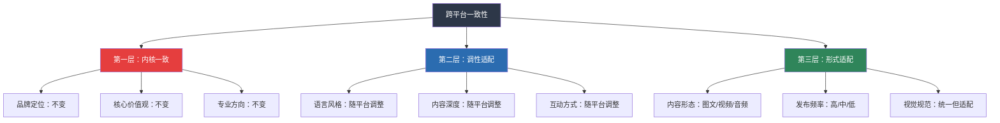
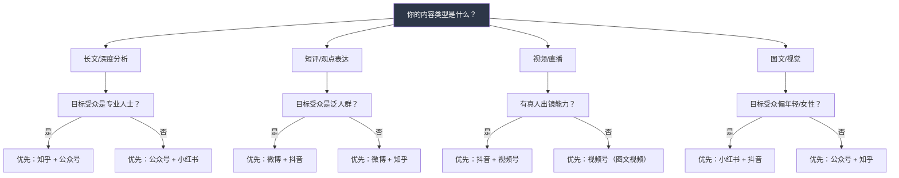

## 六、社交媒体人设管理

在个人品牌的传播层，社交媒体是最核心的阵地。但大多数人的社交媒体运营是"想到什么发什么"——在微信公众号写完一篇深度长文，转头在微博上发了一条和品牌定位毫无关系的吐槽；在知乎上回答了专业问题，却在小红书上分享了和专业形象冲突的日常。结果是：**每个平台都在运营，但没有一个平台在建立品牌**。

社交媒体人设管理的本质不是"表演"，而是**将你的品牌内核通过不同平台的表达语法传递出去**。就像同一个故事可以写成小说、拍成电影、做成播客——载体不同，但故事的核心不变。

### 6.1 理解"人设"：从心理学到传播学

#### 6.1.1 人设的学术定义

"人设"一词源自"人物设定"（Character Setting），最初是影视编剧中的概念——在剧本创作阶段，编剧为角色设定性格、背景、动机和行为模式。迁移到个人品牌领域，人设是指**你在公共传播中有意识地呈现的自我形象**。

需要注意，人设≠面具。社会学家欧文·戈夫曼（Erving Goffman）在《日常生活中的自我呈现》中提出了"拟剧理论"（Dramaturgical Theory）：人在社会互动中如同演员在舞台上表演，有"前台"（public self）和"后台"（private self）之分。前台是你主动呈现给观众的形象，后台是你不在公众面前时的真实状态。

戈夫曼的洞见在于：**前台行为不等于虚伪**。你在面试时穿正装、在会议中控制情绪、在社交媒体上展示专业面——这些都是合理的前台行为。问题出在"前台"和"后台"严重脱节时：你在社交媒体上展示的人设与真实的你差距过大，一旦后台暴露，信任立刻崩塌。

#### 6.1.2 人设的心理学基础

人设之所以有效，因为它利用了几个关键的认知心理学机制：

**首因效应（Primacy Effect）**：人们对一个新信息的第一次接触会形成强烈且持久的印象。你在一个平台上发布的第一批内容，决定了受众对你的初始认知框架。后续所有内容都会被放进这个框架中解读。

**确认偏误（Confirmation Bias）**：一旦受众形成了对你的初步印象，他们会倾向于关注和记忆与这个印象一致的信息，忽略矛盾信息。这意味着——如果你成功建立了"数据分析专家"的人设，偶尔发一条美食内容，受众不会觉得你"不专业"，反而觉得你"有生活情趣"。但如果你的人设没有建立起来，同样的美食内容只会让人困惑"这人到底是干什么的"。

**晕轮效应（Halo Effect）**：当受众认可你在某一个领域的能力时，会自动推断你在其他方面也优秀。这就是为什么一个在某个专业领域建立了强人设的人，在其他领域的发言也会被重视。

#### 6.1.3 "人设"与"真实自我"的关系光谱

纯表演 ◄──────────────────────────────────────────► 纯真实
  │                                                    │
  完全虚构       过度包装       选择性呈现       全面展示
  (高风险)       (易崩塌)       (★推荐)         (无策略)

**推荐位置：选择性呈现**。你不需要展示所有的自己，但你展示的必须是真实的你。具体来说：

- **展示真实的**：你的专业能力、思考方式、核心价值观、真实经历
- **选择不展示的**：与品牌定位无关的个人生活、负面情绪、内部纷争
- **绝对不虚构的**：学历、资质、经历、成果等可验证的事实

### 6.2 一致性法则：跨平台人设管理的核心原则

在多个社交媒体平台上运营时，核心原则是**"一致性"**——你的核心定位、价值观和专业方向在所有平台上保持一致。

但"一致"不等于"相同"。不同平台有不同的调性、用户习惯和内容形态，你需要在保持核心一致的前提下，适应不同平台的表达方式。

#### 6.2.1 一致性法则的三层结构

**第一层：内核一致（不可变）**

无论在哪个平台，以下要素必须保持绝对一致：

| 内核要素 | 说明 | 示例 |
|---------|------|------|
| 品牌定位 | 你解决什么问题，为谁解决 | "帮助B端产品人提升需求分析能力" |
| 核心价值观 | 你信奉什么原则 | "数据驱动、用户至上、方法论先行" |
| 专业立场 | 你在关键问题上的态度 | "反对拍脑袋做产品，提倡科学决策" |
| 视觉识别 | 头像、配色、字体 | 所有平台使用同一头像、统一配色方案 |

**第二层：调性适配（可调）**

调性是指内容的语气、风格和情感温度。同一个观点，在不同平台上可以用不同的调性表达：

| 观点 | 微信公众号（专业深度） | 微博（犀利短评） | 小红书（亲切真实） |
|------|-------------------|----------------|-----------------|
| "用户调研很重要" | 系统论述调研方法论，3000字 | "产品做不好？99%是因为你根本没跟用户聊过。" | "姐妹们！做产品和谈恋爱一样，不了解对方需求就表白，不翻车才怪！" |
| "数据驱动决策" | 详解A/B测试框架与统计学原理 | "别再拍脑袋了。数据不说谎。" | "我用这个数据分析方法，项目成功率直接翻倍，干货分享↓" |

**第三层：形式适配（必须变）**

不同平台的内容形态完全不同，强制在短视频平台上发长文，或者在知乎上只发图片——都是形式错配。

#### 6.2.2 主流平台的特性深度分析

理解每个平台的底层逻辑，才能做到"形式适配"。以下不是泛泛的平台介绍，而是从**个人品牌运营视角**出发的深度分析：

##### 微信公众号：品牌深度阵地

| 维度 | 分析 |
|------|------|
| **核心价值** | 深度内容沉淀，品牌思想力的主战场 |
| **用户行为** | 主动订阅、深度阅读、收藏转发 |
| **内容形态** | 长文（2000-8000字为佳）、系列专栏、白皮书 |
| **人设呈现** | 最能展现深度思考能力和知识体系 |
| **更新频率** | 周更1-2篇（质量优先于数量） |
| **互动特点** | 留言区质量高，读者粘性强 |
| **变现路径** | 知识付费、咨询引流、社群入口 |

**公众号运营要点**：
- **标题决定打开率**：公众号是"订阅制"，标题不吸引人，内容再好也没人看。好标题的公式：具体数字 + 痛点/好奇 + 结果承诺。例如："我用3个月把B端产品的用户留存率从23%提到67%，这5个方法你也能用"
- **开头3秒定生死**：前3行必须抓住注意力——用一个反常识的观点、一个真实的场景、或一个扎心的痛点
- **结构化排版**：长文必须有清晰的结构（小标题、加粗重点、表格、图表），否则手机阅读体验极差
- **文末钩子**：每篇文章末尾都要有明确的行动号召——关注、留言、转发、领取资料

##### 微博：品牌传播喇叭

| 维度 | 分析 |
|------|------|
| **核心价值** | 热点借势、快速传播、公众表达 |
| **用户行为** | 刷信息流、追热点、围观吃瓜 |
| **内容形态** | 短文（140字以内）、图文、短视频 |
| **人设呈现** | 最能展现个性和态度 |
| **更新频率** | 日更2-5条（保持存在感） |
| **互动特点** | 转发评论机制强，话题传播快 |
| **变现路径** | 广告、话题营销、引流 |

**微博运营要点**：
- **热点借势**：微博最大的流量来源是热点话题。但借势必须和你的品牌定位相关——一个做数据分析的人评论娱乐八卦，只会削弱品牌
- **观点鲜明**：微博用户喜欢有态度的人。"我觉得两方面都有道理"这种中庸观点没人转发。敢于表达鲜明立场（但必须有理有据）
- **评论互动**：微博的评论区是第二战场。认真回复评论、参与讨论，能显著提升曝光
- **九宫格图片**：图文微博使用九宫格图片，信息密度高且视觉冲击力强

##### 知乎：品牌专业认证

| 维度 | 分析 |
|------|------|
| **核心价值** | 专业问答、深度讨论、长尾搜索流量 |
| **用户行为** | 搜索问题、看回答、点赞收藏 |
| **内容形态** | 长回答（1000-5000字）、专栏文章、想法 |
| **人设呈现** | 最能展现专业性和知识深度 |
| **更新频率** | 每周2-3个高质量回答 |
| **互动特点** | 评论区讨论质量高，容易形成口碑 |
| **变现路径** | 知乎Live、付费咨询、引流至私域 |

**知乎运营要点**：
- **选题策略**：回答"有流量但回答质量不高"的问题。如果你能在这些高关注、低质量的问题下写出深度回答，很容易获得大量赞同
- **开头直击要害**：知乎回答的前2-3行决定了用户是否点开"展开全文"。开头必须给出核心结论或引发好奇
- **结构清晰 + 深度足够**：知乎用户对"干货"的定义是最严格的。浅尝辄止的回答会被踩，深度拆解的回答会获得大量赞同
- **长尾效应**：知乎内容的长尾流量非常强。一个高质量回答可以在2-3年内持续获得搜索流量

##### 抖音/视频号：品牌人格化入口

| 维度 | 分析 |
|------|------|
| **核心价值** | 短视频传播、人格化展示、破圈能力 |
| **用户行为** | 刷推荐流、看直播、关注有趣的创作者 |
| **内容形态** | 短视频（1-3分钟）、直播、图文 |
| **人设呈现** | 最能展现亲和力和个人魅力 |
| **更新频率** | 日更或隔日更 |
| **互动特点** | 评论区娱乐性强，粉丝粘性靠人格魅力 |
| **变现路径** | 直播带货、广告、引流 |

**短视频运营要点**：
- **前3秒定生死**：短视频平台的滑走率极高。前3秒必须有强钩子——反常识观点、数据冲击、悬念设置、视觉冲击
- **人设标签化**：视频中反复出现的口头禅、穿着风格、开场白——这些"人设锚点"帮助观众快速记住你
- **节奏感**：短视频的信息密度要高，废话和停顿会直接导致划走
- **评论区运营**：视频发布后的30分钟内，积极回复每一条评论，算法会因此给更多推荐

##### 小红书：品牌生活感窗口

| 维度 | 分析 |
|------|------|
| **核心价值** | 种草分享、生活化展示、女性/年轻用户触达 |
| **用户行为** | 搜索攻略、看笔记、收藏实用内容 |
| **内容形态** | 图文笔记（图片+文字）、短视频 |
| **人设呈现** | 最能展现真实感和生活化的一面 |
| **更新频率** | 每周3-5篇笔记 |
| **互动特点** | 收藏率高于其他平台，实用内容传播力强 |
| **变现路径** | 品牌合作、好物推荐、引流 |

**小红书运营要点**：
- **封面图是第一生产力**：小红书是"视觉优先"的平台。封面图的质量直接决定点击率。使用统一的封面模板能强化品牌识别
- **标题党但不虚标**：小红书标题需要"钩子感"，但内容必须兑现标题的承诺，否则评论区会翻车
- **实用价值为王**：小红书用户收藏最多的永远是"干货攻略"——清单、教程、模板、对比评测
- **标签策略**：每篇笔记使用5-10个标签，包括大流量标签和精准标签的组合

#### 6.2.3 跨平台人设管理矩阵

将以上分析汇总为一张可执行的管理矩阵：

| 管理维度 | 微信公众号 | 微博 | 知乎 | 抖音/视频号 | 小红书 |
|---------|----------|------|------|-----------|-------|
| **内容深度** | ⭐⭐⭐⭐⭐ | ⭐⭐ | ⭐⭐⭐⭐⭐ | ⭐⭐⭐ | ⭐⭐⭐ |
| **更新频率** | 1-2篇/周 | 2-5条/日 | 2-3答/周 | 1条/日 | 3-5篇/周 |
| **内容长度** | 2000-8000字 | <300字 | 1000-5000字 | 1-3分钟 | 300-1000字 |
| **语言风格** | 专业、深度、系统 | 犀利、简洁、有态度 | 严谨、逻辑、有论据 | 亲切、生动、有感染力 | 真实、实用、有温度 |
| **互动方式** | 精选留言回复 | 热点评论转发 | 深度评论回复 | 评论区互动 | 收藏+评论 |
| **视觉风格** | 统一长图/排版 | 九宫格/表情包 | 文字为主 | 真人出镜 | 精修封面图 |
| **人设侧重** | 思想深度 | 个性态度 | 专业权威 | 人格魅力 | 真实生活 |

### 6.3 人设管理的三不原则

在社交媒体人设管理中，有三条红线是不可触碰的。违反任何一条，都可能导致品牌信任的全面崩塌。

#### 6.3.1 不造假：包装与欺骗的边界

适度包装是策略，编造经历是定时炸弹。两者的边界在哪里？

**包装（允许的）**：
- 选择性展示你的优势面
- 用更好的方式呈现真实经历
- 突出成果，弱化无关细节
- 用专业术语提升表达的权威感

**造假（绝对不允许的）**：
- 编造学历、资质、认证
- 虚构工作经历或项目成果
- 冒用他人的作品或成果
- 制造虚假数据或案例
- 伪造权威背书或推荐

**为什么造假一定会暴露？**

原因很简单：社交媒体是一个"长周期、广覆盖"的游戏。你在短期内可以骗过少数人，但在长期持续输出中，造假的细节会越来越难以自圆其说。而且互联网是有记忆的——你三年前说过的话、展示过的内容，随时可能被人翻出来对比。

**案例：人设崩塌的连锁反应**

2019年，某知识付费博主被曝学历造假——自称海外名校MBA，实际只是短期培训班。事件曝光后的连锁反应：已有学员要求退款，合作品牌终止合约，社交媒体粉丝大量取关，已出版的书籍被下架。整个品牌价值在72小时内归零。

这个案例的教训不是"别造假"这么简单，而是：**造假是品牌资产的负债**。你每多维持一天虚假人设，崩塌时的损失就更大。因为你的品牌资产是建立在虚假基础上的，虚假基础被抽掉后，上面所有的建筑都会坍塌。

#### 6.3.2 不冲突：跨平台的一致性维护

不同平台上的人设不能互相矛盾。冲突会导致受众困惑——"这个人到底是做什么的？"

**常见的跨平台冲突**：

| 冲突类型 | 表现 | 后果 |
|---------|------|------|
| 定位冲突 | 公众号说"我是产品经理"，小红书说"我是穿搭博主" | 受众困惑，两边都不信任 |
| 价值观冲突 | 知乎上推崇理性决策，微博上煽动情绪对立 | 人格可信度下降 |
| 专业性冲突 | 公众号写深度行业分析，抖音发低质量搬运内容 | 拉低整体专业形象 |
| 态度冲突 | 对同一事件在不同平台给出矛盾评价 | 被截图对比，信任崩塌 |

**防止冲突的操作方法**：

1. **制定人设手册**：写一份1-2页的文档，明确你的品牌内核（定位、价值观、语言禁区、风格底线），每次发布内容前对照检查
2. **统一视觉系统**：所有平台使用同一套配色、字体、头像，强化"同一个人"的认知
3. **内容日历统一管理**：不要在不同平台由不同的人（或AI）独立生成内容，而是先确定核心内容，再根据平台特性改编
4. **定期交叉检查**：每月花30分钟，假装自己是一个新粉丝，在所有平台上浏览一遍你的内容，检查是否有矛盾

#### 6.3.3 不过度：保持"人味"的分寸感

过度人设化是另一个极端——你太"完美"了，太"专业"了，以至于受众觉得你在"演"，反而产生距离感。

**过度人设化的信号**：

- 每条内容都在"教人做事"，从不展示自己也犯错
- 所有内容都是精心策划的，没有任何即兴和真实
- 回复评论永远是"感谢关注"式的官方话术
- 从不分享失败经历、困惑、或者和工作无关的日常
- 文字风格像机器人，没有个人口语习惯和情感温度

**如何保持"人味"**：

| 策略 | 具体操作 | 效果 |
|------|---------|------|
| 展示不完美 | 偶尔分享失败经历、犯错后的反思 | 增加可信度和亲和力 |
| 保持口语感 | 在非正式平台用你平时说话的方式写作 | 降低距离感 |
| 回应真实情绪 | 对行业事件表达真实的情绪反应（愤怒、兴奋、困惑） | 让受众感受到你是一个活生生的人 |
| 穿插日常 | 每10条专业内容穿插1-2条生活日常 | 平面化形象，增加记忆点 |
| 真诚互动 | 回复评论时不要用模板，而是针对具体内容真诚回应 | 建立真实的人际连接 |

### 6.4 人设构建的四步实操法

理论讲完了，下面是具体的执行流程。

#### 第一步：定义品牌内核

在开始任何平台运营之前，先完成这份人设内核定义表：

┌───────────────────────────────────────────────────────┐
│              人设内核定义表                              │
├──────────────┬────────────────────────────────────────┤
│ 我是谁        │ [一句话品牌声明]                         │
│ 我的3个标签    │ [例：产品经理 / 数据分析 / B端专家]       │
│ 我的价值观     │ [例：数据驱动、用户至上、拒绝拍脑袋]       │
│ 我的说话方式   │ [例：理性冷静，偶尔犀利，善用类比]         │
│ 我不做什么     │ [例：不做情感鸡汤、不做娱乐八卦]          │
│ 我的视觉风格   │ [例：蓝色系、简洁、数据可视化]            │
│ 我的禁忌       │ [例：不造假数据、不人身攻击、不蹭灾难热点]  │
└──────────────┴────────────────────────────────────────┘

#### 第二步：制定各平台内容策略

根据6.2.2节的平台分析，为每个你运营的平台制定具体策略：

| 平台 | 我的定位 | 内容类型 | 更新频率 | 人设侧重 |
|------|---------|---------|---------|---------|
| 微信公众号 | | | | |
| 微博 | | | | |
| 知乎 | | | | |
| 抖音/视频号 | | | | |
| 小红书 | | | | |

**关键决策：不是所有平台都要做**。资源有限的情况下，选择2-3个最匹配你目标受众的平台深耕，比5个平台都蜻蜓点水效果好10倍。

平台选择的决策树：

#### 第三步：建立内容改编工作流

从一个核心内容出发，改编为多个平台版本，而不是为每个平台从零创作：

                    ┌─────────────────┐
                    │  核心内容创作     │
                    │ （一篇深度文章）  │
                    └────────┬────────┘
                             │
              ┌──────────────┼──────────────┐
              │              │              │
              ▼              ▼              ▼
     ┌────────────┐  ┌────────────┐  ┌────────────┐
     │ 微信公众号  │  │   知乎     │  │   微博     │
     │ 原文发布    │  │ 改编为问答  │  │ 提炼3条    │
     │ （2000字）  │  │ 体裁回答    │  │ 核心观点   │
     └────────────┘  └────────────┘  └──────┬─────┘
                                            │
                              ┌──────────────┼──────────────┐
                              │              │              │
                              ▼              ▼              ▼
                     ┌────────────┐  ┌────────────┐  ┌────────────┐
                     │  小红书    │  │  抖音      │  │  视频号    │
                     │ 提炼要点   │  │ 口播+字幕  │  │ 精剪版    │
                     │ 配图发布   │  │ 短视频     │  │ 3分钟     │
                     └────────────┘  └────────────┘  └────────────┘

**改编的核心原则**：不是"复制粘贴"，而是"翻译"。把同一个核心观点，翻译成不同平台的"语言"。就像同一本书的中文版和英文版——内容一致，但表达方式完全不同。

**具体改编技巧**：

| 原始内容 | 改编目标 | 改编方法 |
|---------|---------|---------|
| 2000字长文 | 微博140字 | 提炼最犀利的一个观点 + 数据支撑 + 一句话结论 |
| 2000字长文 | 知乎回答 | 保留核心论据，改写为"回答问题"的结构 |
| 2000字长文 | 小红书笔记 | 提取5个关键要点，配图发布，口语化改写 |
| 2000字长文 | 抖音短视频 | 提取一个最有冲击力的观点，写成1分钟口播脚本 |

#### 第四步：建立人设一致性检查机制

人设管理不是一次性工作，而是需要持续检查和维护的系统工程。

**月度人设一致性检查清单**：

- [ ] 所有平台的头像、简介、背景图是否一致？
- [ ] 本月各平台的内容方向是否都围绕品牌定位？
- [ ] 是否存在跨平台的观点冲突？
- [ ] 各平台的内容质量是否维持在统一标准？
- [ ] 是否有"过度人设化"的倾向？（内容太完美、太官方）
- [ ] 粉丝增长和互动数据是否符合预期？
- [ ] 竞品的内容策略是否有变化需要跟进？

### 6.5 人设危机管理：当人设遭遇挑战

再好的人设管理也可能遇到危机。关键不是"永远不出问题"，而是"出了问题怎么办"。

#### 6.5.1 人设危机的四种常见场景

| 场景 | 触发原因 | 严重程度 | 应对策略 |
|------|---------|---------|---------|
| 被挖黑历史 | 过去的不当言论被翻出 | ⭐⭐⭐ | 真诚道歉 + 表明成长 + 用后续行动证明 |
| 人设翻车 | 展示了与人设矛盾的内容 | ⭐⭐ | 解释上下文 + 自嘲化解 + 修正行为 |
| 被人蹭热点 | 有人用你的名义发布虚假信息 | ⭐⭐⭐ | 第一时间澄清 + 保留证据 + 必要时法律维权 |
| 言论争议 | 对某个话题的表态引发争议 | ⭐⭐⭐⭐ | 不删帖（会更严重） + 理性解释 + 展示思考过程 |

#### 6.5.2 人设危机应对的"黄金四步"

**第一步：速度第一（2小时内回应）**

社交媒体危机的传播速度以分钟计算。沉默会被解读为"默认"或"心虚"。即使你还没有完整的回应方案，也需要在2小时内发出一个初步声明："我已经注意到这个问题，正在认真思考，会在X小时内给出完整回应。"

**第二步：态度真诚（不狡辩、不推卸）**

如果你确实犯了错，直接承认。受众的容忍度远比你想象的高——人们不讨厌犯错的人，他们讨厌犯了错还狡辩的人。

**回应模板**：
> "关于[具体事件]，我确实做得不对。[具体说明哪里不对]。我的本意是[解释初衷]，但[承认实际效果]。接下来我会[具体改正措施]。感谢指出问题的朋友。"

**第三步：行动可见（用行动证明改变）**

口头道歉只是第一步，受众需要看到实际的改变。例如：如果因为内容质量问题引发争议，后续一个月内提高内容审核标准，并公开分享改进过程。

**第四步：长期修复（信任重建需要时间）**

信任崩塌是瞬间的，重建是漫长的。不要期望一次声明就能完全修复。你需要在接下来的3-6个月中，用持续一致的高质量输出来重新建立信任。

### 6.6 进阶：人设管理的高阶策略

#### 6.6.1 人格化的"记忆锚点"设计

人设管理的高阶技巧是为你的品牌设计一系列"记忆锚点"——让受众在看到任何相关内容时，第一时间联想到你。

| 锚点类型 | 说明 | 示例 |
|---------|------|------|
| 视觉锚点 | 统一的视觉元素 | 固定的封面模板、配色方案、LOGO水印 |
| 语言锚点 | 独特的表达方式 | 固定的口头禅、签名式结语、专属术语 |
| 内容锚点 | 固定的内容栏目 | 每周一的"行业观察"、每月的"数据报告" |
| 仪式锚点 | 特定的行为模式 | 直播间的固定开场白、视频的固定结尾 |

**记忆锚点的心理学原理**：巴甫洛夫条件反射。当受众反复看到某个视觉/语言元素与你的品牌内容同时出现，他们会形成条件反射——看到这个元素就想到你。

#### 6.6.2 人设"成长线"的设计

人设不是一成不变的。好的人设应该有一条"成长线"——随时间推移，你的品牌从一个阶段进化到下一个阶段，受众能够感受到你的成长和进步。

| 品牌阶段 | 人设特征 | 内容策略 | 时间跨度 |
|---------|---------|---------|---------|
| 起步期 | 学习者/探索者 | 分享学习笔记、成长记录、踩坑经验 | 0-6个月 |
| 成长期 | 实践者/总结者 | 输出方法论、框架、工具 | 6-18个月 |
| 成熟期 | 专家/权威 | 深度洞察、行业分析、趋势判断 | 18-36个月 |
| 引领期 | 布道者/引领者 | 定义问题、推动变革、赋能他人 | 36个月+ |

**关键原则**：成长线必须与真实能力匹配。不要在起步期就扮演专家，也不要在成熟期还停留在学习者人设——两者都会让受众觉得不真实。

#### 6.6.3 多人协作的人设一致性

当个人品牌的内容运营涉及多人协作时（助理、编辑、外包），人设一致性面临更大挑战。

**多人协作的人设管理方案**：

1. **编写人设手册**：一份详细的人设手册，包含语言风格指南、禁用词列表、常见场景的回复模板、配图规范
2. **内容审核流程**：所有对外发布的内容必须经过品牌主理人审核
3. **定期校准会议**：每月一次的内容团队校准会，回顾本月内容是否偏离人设
4. **A/B测试**：对重要内容测试不同人设风格的表达，用数据验证哪种更有效

### 6.7 人设管理的常见误区

| 误区 | 表现 | 后果 | 正确做法 |
|------|------|------|---------|
| 人设等于表演 | 装出一个完全不是自己的形象 | 无法持续，迟早露馅 | 人设是真实的你的"优化版" |
| 人设等于完美 | 永远只展示光鲜的一面 | 缺乏亲和力和可信度 | 适度展示不完美和真实 |
| 人设固定不变 | 从不根据数据和反馈调整 | 与市场脱节 | 每6个月做一次人设审计 |
| 全平台一个模板 | 所有平台发布完全相同的内容 | 形式错配，效果差 | 核心一致，形式适配 |
| 只顾输出不互动 | 只发内容不回复评论 | 缺乏真实连接 | 互动是人设的"活广告" |
| 过度关注竞品 | 完全模仿竞争对手的风格 | 失去差异化 | 参考但不模仿，找到自己的风格 |
| 忽视数据反馈 | 凭感觉运营，不看数据 | 无法优化迭代 | 每周分析各平台数据，调整策略 |

### 6.8 本节核心总结

社交媒体人设管理的完整框架可以用一张表概括：

| 核心原则 | 具体要求 | 检查标准 |
|---------|---------|---------|
| 一致性 | 内核不变，形式适配 | 新粉在任何平台看到你，都能立刻认出"是同一个人" |
| 真实性 | 展示真实的你，但选择性展示 | 你展示的一切都可以经得起验证 |
| 记忆性 | 有独特的视觉和语言锚点 | 一句话/一张图就能让人联想到你 |
| 成长性 | 人设随能力成长而进化 | 受众能感受到你的进步和变化 |
| 可持续性 | 不过度消耗，保持长期输出 | 能坚持3年以上而不感到疲惫或虚假 |

记住这个公式：**好的社交媒体人设 = 真实的内核 × 适配的表达 × 持续的一致**。三个要素缺一不可——没有真实内核的人设是空中楼阁，不适配表达的人设是自说自话，不持续一致的人设是碎片拼图。

***
