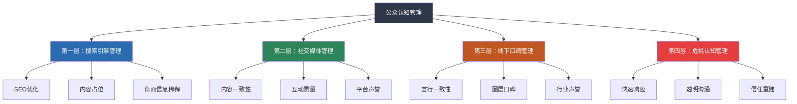
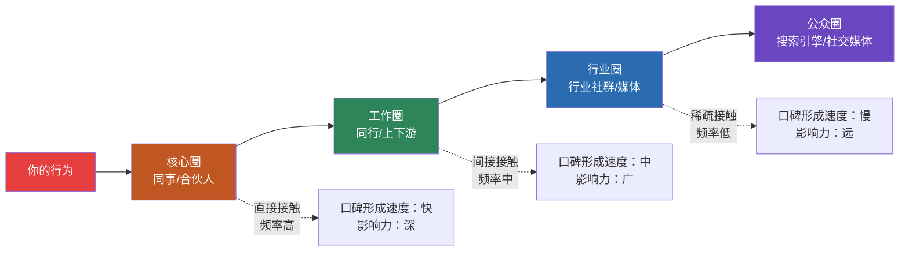

## 七、公众认知管理

### 7.1 什么是公众认知管理

公众认知管理，是你主动塑造外界对你整体形象的系统性工作。它不是"控制别人怎么想"——你无法控制任何人的大脑；它是"通过一系列可控行为，引导别人形成你希望的认知"。

这两者的区别非常关键。前者是幻觉，后者是策略。

认知心理学中有一个经典概念叫**"峰终定律"**（Peak-End Rule），由诺贝尔经济学奖得主丹尼尔·卡尼曼提出：人们对一段体验的记忆，主要由两个时刻决定——**最强烈的瞬间（峰值）**和**结束的时刻（终点）**。这意味着别人对你的印象，并不取决于你每次互动的"平均分"，而是由几个关键的高光时刻和最近一次接触决定的。

举个例子：你在十次会议中九次表现平平，但有一次提出了一个改变项目方向的关键洞察——这次"峰值"会定义你在同事心中的专业形象。而你最近一次公开表态的内容和态度，会成为别人此刻谈论你时的主要素材。

公众认知管理的核心，就是**有意识地设计这些"峰值"和"终点"**，而不是听天由名。

### 7.2 为什么认知管理是个人品牌的"防线"

前面的章节教你如何定位、讲故事、做内容、做传播——这些都是"进攻"策略，是主动往外界投射品牌信号。但品牌建设不是只有进攻。如果没有防守，你辛苦建立的形象可能因为一次搜索结果、一条旧帖、一个误解就毁于一旦。

公众认知管理是你的**品牌防御体系**。它的作用有三个层面：

**第一，确保你的"数字形象"与"真实形象"一致。** 当别人搜索你的名字时，出现的结果是否反映了你希望传达的品牌？如果搜索结果的第一页充斥着三年前的过时信息，或者你刚入行时写的质量不高的文章，别人对你的第一印象就已经被打了折扣。

**第二，预防性地降低品牌风险。** 你不需要等到危机发生才去管理认知。通过日常的维护和优化，你可以让负面信息的生存空间越来越小——不是通过删除，而是通过用更高质量的内容去"稀释"和"覆盖"。

**第三，在危机发生时提供缓冲。** 如果你平时积累了足够的正面认知资产，当危机来临时，受众会更倾向于"再给你一次机会"。这就像银行账户——平时存够了信任余额，危机时才有余额可以支取。

### 7.3 认知管理的四个层面

公众认知管理覆盖四个层面，从数字世界到现实世界，从主动建设到被动防御，构成一个完整的管理矩阵。

#### 7.3.1 第一层：搜索引擎管理

搜索引擎是别人认识你的"第一扇门"。无论是潜在雇主、合作伙伴、客户还是媒体记者，搜索你的名字几乎是他们的第一步动作。BrightEdge的研究数据显示，68%的线上体验始于搜索引擎，而搜索结果第一页的点击率占所有点击的92%以上。如果第一页没有你，或者出现的是负面信息，你在对方心中的起始印象分就已经很低了。

**搜索引擎管理的三大策略：**

**策略一：主动占位——用高质量内容占据搜索结果**

不要让搜索结果"随机生成"，而是主动规划你希望别人看到什么。具体做法：

- **个人网站或博客**：注册以你名字为域名的网站（如 zhangwei.com 或 zhangwei.cn），这是你最可控的"数字地产"。网站内容围绕你的专业领域展开，定期更新。搜索引擎对独立域名的权重通常高于社交媒体平台。
- **权威平台内容**：在知乎、微信公众号、简书、CSDN等高权重平台建立账号并持续发布内容。这些平台本身的域名权重很高，你在上面发布的内容更容易出现在搜索结果的第一页。
- **行业媒体和出版物**：争取在行业媒体上发表文章、接受访谈或被引用。权威媒体的报道对搜索结果的正面影响远超自媒体内容。
- **LinkedIn个人资料优化**：LinkedIn在搜索引擎中的权重极高。确保你的LinkedIn资料完整、专业，包含你的品牌关键词。

**策略二：SEO思维——让正面内容"被找到"**

仅仅发布内容是不够的，你需要让搜索引擎"愿意"把你的正面内容排在前面：

- **关键词策略**：思考别人搜索你时可能用的关键词。除了你的名字，还可能包括你的职业、专业领域、代表作品等。在你的内容中自然地包含这些关键词。
- **标题优化**：文章标题要包含你的名字和核心关键词。例如"张伟｜数据驱动的用户增长方法论"比"用户增长的一些思考"更容易被搜索到。
- **结构化数据**：如果你有个人网站，使用 Schema.org 的结构化标记（Person schema），帮助搜索引擎更好地理解你的身份信息。
- **外链建设**：当其他网站链接到你的内容时，搜索引擎会认为你的内容更有价值。通过客座文章、行业合作、媒体采访等方式获取高质量的外部链接。

**策略三：负面信息管理——稀释而非删除**

当搜索结果中出现负面信息时，第一反应不应该是"删掉它"——删除通常很难实现，而且可能引发"史翠珊效应"（越是试图压制信息，越会引发关注）。正确的策略是**用更多高质量的正面内容去稀释负面信息的排名**。

| 情况 | 应对策略 | 预期效果 |
|------|----------|----------|
| 负面信息在第一页第1-3位 | 大量发布高质量内容+SEO优化，同时尝试联系发布者协商 | 3-6个月逐步推到第二页 |
| 负面信息在第一页第4-10位 | 持续更新正面内容，优化现有正面内容的SEO | 1-3个月可见效 |
| 负面信息在第二页 | 持续维护现有正面内容，保持更新频率 | 基本不影响，但需监控 |
| 负面信息是恶意诽谤 | 保留证据，向平台举报，必要时法律途径 | 视平台响应速度而定 |

**操作清单：每月搜索引擎审计**

每月花30分钟做一次搜索引擎审计：

1. 在无痕/隐私模式下搜索你的名字（避免个性化结果干扰）
2. 检查搜索结果第一页的10条内容，记录正面/中性/负面比例
3. 检查图片搜索和视频搜索结果
4. 检查百度、Google、微信搜一搜、知乎等多个搜索引擎
5. 记录变化趋势，与上月对比
6. 对不理想的结果制定改进计划

#### 7.3.2 第二层：社交媒体管理

社交媒体是你与公众互动的主战场。前一章"社交媒体人设管理"讲的是跨平台的一致性与差异化策略，这里聚焦的是**认知管理视角下的社交媒体维护**——如何确保你的社交媒体内容持续为你的品牌加分，而不是埋下隐患。

**内容审计：定期清理你的"数字足迹"**

你的社交媒体历史内容，是别人了解你的重要素材。三年前的一条情绪化发言、五年前的一张不专业照片，都可能被人翻出来成为当下的"黑料"。定期的内容审计不是"心虚"，而是负责任的品牌管理。

**内容审计的具体步骤：**

1. **翻阅历史内容**：逐条检查过去12个月的发布内容，标记以下几类需要处理的内容：
   - 与当前品牌定位不一致的内容（如你已经从技术岗转管理岗，但历史内容全是纯技术吐槽）
   - 情绪化或冲动型发言（尤其涉及争议性话题的）
   - 可能被断章取义的内容
   - 质量不高、拉低整体水平的内容

2. **决定处理方式**：
   - **保留**：内容质量好，与品牌一致——继续留着
   - **隐藏/仅自己可见**：内容本身没问题，但与当前定位不符——不删除，设为私密
   - **删除**：内容确实有问题，且隐藏选项不可用——删除
   - **置顶/高亮**：特别能代表你品牌的精华内容——置顶或加入精选

3. **设置发布审核流程**：建立一个简单的发布前检查清单——"这条内容是否与我的品牌定位一致？""如果被截图传播，我能承受吗？""三年后的我看到这条内容会怎么想？"

**互动管理：你回复的方式就是你的品牌**

社交媒体不只是你"说"的地方，更是你"回应"的地方。你如何回复评论、如何处理质疑、如何与粉丝互动，这些行为在旁观者眼中比你的正式内容更能揭示你的真实人设。

关键原则：

- **回复负面评论的方式比正面内容更能塑造品牌**。别人看到你冷静、理性地回应质疑，比看到你发十条正能量帖子更有说服力。
- **不要只回复赞美**。只回复"说你好"的人、忽视质疑和批评，会给人"选择性社交"的印象。
- **学会"体面地不同意"**。你不需要回应每一条质疑，但当你选择回应时，保持尊重和逻辑。"我理解你的看法，我的考虑是……"比"你说的不对"更有效。
- **对明显的恶意攻击，沉默有时是最佳策略**。不要和水军纠缠——旁观者能分辨谁在理性讨论、谁在无理取闹。

**社交媒体声誉的量化指标**

| 指标 | 含义 | 健康标准 |
|------|------|----------|
| 正面互动率 | 正面评论和私信占总互动的比例 | >70% |
| 负面情绪占比 | 带有明显负面情绪的互动占比 | <10% |
| 提及质量 | 别人主动提及时的语境是否正面 | 正面>60% |
| 内容一致性评分 | 内容与品牌定位的匹配程度（自评1-10） | ≥7 |
| 回复率和回复速度 | 你对评论和私信的回复比例和时效 | 回复率>30%，24小时内 |

#### 7.3.3 第三层：线下口碑管理

很多人在讨论个人品牌时只关注线上，忽视了线下口碑。但现实是：**线下口碑往往是线上认知的源头**。你在一个行业聚会上的精彩分享，可能会引发在场十个人发朋友圈；你对同事的一次不负责任的承诺，可能会在公司内部形成"这人说到做不到"的长期印象。

线下口碑管理的核心不是"表演"，而是**言行一致性的长期积累**。

**线下口碑的三个关键场景：**

**场景一：行业活动和会议**

参加行业活动时，你的一言一行都在塑造你的品牌。很多人犯的错误是把行业活动当成"社交场"——拼命交换名片、推销自己。真正有效的做法是：

- **会前准备**：了解参会者名单，提前规划你希望与谁建立联系，准备有价值的话题。
- **会中表现**：在提问环节提出一个有深度的问题，比在茶歇时递出20张名片更有效。别人记住的是"那个问了好问题的人"，而不是"那个发了很多名片的人"。
- **会后跟进**：活动后24小时内，向你想建立联系的人发送个性化的跟进信息。不要群发模板消息——"昨天你分享的关于XXX的观点让我很受启发"比"很高兴认识你"有效十倍。

**场景二：日常工作和职场**

对于职场人士来说，最日常也最重要的口碑来源是你的同事和上级。你不需要刻意"经营"——你只需要做到：

- **承诺了就做到**。做不到提前说，而不是事后解释。"一致性信任"是信任三维度中最基础的一个，一次食言可能需要十次履约来弥补。
- **帮助别人时不要记账**。总是计算"我帮了你多少"的人，口碑不会好。但帮过的人，大多数会记在心里。
- **在背后说别人好话**。背后说好话传到当事人耳朵里的效果，是当面赞美的五倍。反过来，背后吐槽的杀伤力也是当面批评的五倍。

**场景三：社交和私人场合**

你的"非工作状态"也是品牌的一部分。在朋友聚会、家庭社交、甚至偶然的陌生人互动中，你的言行都可能通过"六度分隔"传播到你意想不到的人耳中。

这不意味着你要时刻紧绷——而是要明白一个事实：**在社交媒体时代，"公共场合"和"私人场合"的边界已经模糊**。你在KTV的一段不当发言，可能被在场某人拍下来发到朋友圈。不是要你活在恐惧中，而是要有基本的品牌意识。

**线下口碑的"涟漪效应"**

线下口碑从核心圈向外传播，每一层都有衰减。但如果某一层出现了"传播放大器"——比如一个有影响力的人对你的正面评价在行业群里传播——那么口碑可以跳层传播，直接从核心圈跳到行业圈。

#### 7.3.4 第四层：危机认知管理

危机认知管理不是等危机发生了才开始的工作——它是一种**预防性的思维模式和准备机制**。

当负面信息出现时，你的应对方式本身就是一次品牌传播。处理得好，危机可以变成展示你品格和能力的机会；处理得不好，危机就会成为品牌的转折点——从上升变为下降。

关于危机沟通的具体策略（HOT原则、回应时间线、不要做的事），下一节"个人品牌的危机沟通策略"会详细展开。这里从认知管理的视角，讨论危机发生前的预防和危机中的认知控制。

**危机预防：建立"认知免疫系统"**

就像人体的免疫系统需要提前接触病原体来建立防御一样，你的品牌也需要提前建立"认知免疫力"：

- **提前积累正面认知资产**。当别人搜索你时，如果第一页全是正面内容，偶尔出现一条负面信息的影响会被大幅削弱。这就像一个信用评分800分的人，偶尔一次逾期不会造成致命影响。
- **建立"信任账户"**。日常与受众的每一次价值交付、每一次真诚互动，都是在存入"信任余额"。信任余额越高，危机时的"透支空间"越大。
- **进行危机模拟**。定期思考"如果现在有人曝光了我的XX问题，我该如何回应？"这种预演不是杞人忧天，而是未雨绑缪。

**危机中的认知管理框架**

当危机实际发生时，认知管理的目标是**控制叙事**——不是控制别人怎么想，而是确保事实和你的立场被充分传达，而不是让猜测和谣言填补信息真空。

| 认知管理阶段 | 核心任务 | 时间窗口 | 关键动作 |
|------------|---------|---------|---------|
| 信息确认期 | 了解事实，评估影响 | 0-2小时 | 内部调查，收集信息，确定回应策略 |
| 初步回应期 | 传达态度，控制叙事 | 2-6小时 | 发布简短但真诚的初步回应，表明正在调查 |
| 详细回应期 | 完整说明，展示行动 | 6-24小时 | 发布详细声明，包含事实、态度和行动计划 |
| 持续修复期 | 重建信任，证明改变 | 24小时后 | 持续跟进，公开展示改变，接受监督 |

**危机认知管理的"三不三要"原则：**

**三不：**
- **不要试图完全删除负面信息**——互联网是有记忆的，截图比你删帖更快。删帖行为本身会被解读为"心虚"，引发更大的质疑。
- **不要在情绪激动时做任何公开回应**——愤怒、委屈、恐惧时写下的任何文字，都可能成为危机升级的燃料。先冷静，再回应。
- **不要让别人替你定义叙事**——沉默不会让危机自动消失。如果你不说话，猜测和谣言会替你"说话"。信息真空是认知管理最大的敌人。

**三要：**
- **要在第一时间表明态度**——即使你还不了解全部事实，也可以先表态"我已知晓此事，正在了解详情，将在X小时内做出正式回应"。这至少告诉受众你在正视问题。
- **要将危机转化为展示品格的机会**——人们不会因为一个人"从不犯错"而信任他，但会因为一个人"犯错后如何面对"而尊重他。真诚、坦率、有担当的危机回应，有时候比从未犯错更能建立深层信任。
- **要用行动而非语言来修复信任**——声明和道歉只是起点。信任的重建需要可验证的行动和持续的行为改变。"我以后会注意"不如"我已经做了以下三件事来确保不再发生"。

### 7.4 认知管理的工具与实操

理论讲完了，下面是你可以今天就开始使用的具体工具和操作方法。

#### 7.4.1 Google Alerts / 百度搜索提醒

设置你的名字、品牌关键词的搜索提醒。当新的内容出现在搜索引擎中时，你会第一时间收到通知。这是最基础的"认知监控"手段。

操作方法：
1. 访问 Google Alerts（google.com/alerts）或百度搜索提醒
2. 创建提醒：输入你的名字（加上引号做精确匹配，如"张伟"）
3. 创建提醒：输入你的品牌关键词（如"张伟 用户增长"）
4. 设置频率：建议每天一次（实时会太频繁，每周会太慢）
5. 设置来源：选择"所有来源"以获取最全面的信息

#### 7.4.2 社交媒体监听工具

除了搜索引擎，你还需要监控社交媒体上别人对你的提及和讨论。常用的工具：

| 工具 | 适用平台 | 功能 | 价格 |
|------|---------|------|------|
| 微博搜索 | 微博 | 关键词监控，提及追踪 | 免费 |
| 新榜 | 微信公众号、微博、抖音等 | 跨平台数据监控 | 基础版免费 |
| Brand24 | 全球社交平台 | 情感分析、影响力评分 | 付费 |
| Mention | 全球社交和媒体 | 实时监控、竞品对比 | 付费 |
| 微信搜一搜 | 微信生态 | 公众号、视频号、小程序内容 | 免费 |

对于个人品牌建设者来说，初期使用免费工具即可。当你的品牌规模增长到一定程度（比如有公众影响力、有商业合作需求），再考虑付费工具。

#### 7.4.3 个人品牌的"认知仪表盘"

建议建立一个简单的认知管理仪表盘，每月更新一次。可以用一个Excel表格或Notion页面来实现：

个人品牌认知管理仪表盘（月度）
═══════════════════════════════════════════

一、搜索引擎表现
  - 百度搜索结果第一页正面/中性/负面比例：___/___/___
  - Google搜索结果第一页正面/中性/负面比例：___/___/___
  - 图片搜索结果是否符合品牌预期：是 / 需改进
  - 本月新增的正面搜索结果数量：___

二、社交媒体指标
  - 各平台粉丝增长/流失情况：___
  - 正面互动率：___%
  - 本月是否有被误解或争议的内容：有 / 无
  - 历史内容审计完成情况：完成 / 待处理

三、线下口碑反馈
  - 本月收到的正面反馈（口头/邮件/消息）：___条
  - 本月是否有负面口碑反馈：有 / 无
  - 行业活动参与情况：___
  - 关键人脉维护情况：___

四、风险评估
  - 当前是否存在未处理的负面信息：有 / 无
  - 本月是否有争议性言论或行为：有 / 无
  - 需要预防性处理的潜在风险：___

五、下月行动计划
  1. ___
  2. ___
  3. ___

#### 7.4.4 AI辅助的认知管理

在AI时代，认知管理有了新的工具和方法：

- **AI舆情监控**：利用AI工具监控社交媒体和新闻中对你的提及，自动分析情感倾向（正面/中性/负面），生成监控报告。
- **AI内容审查**：在发布内容前，用AI工具检查是否存在可能被误解或断章取义的表述。例如让AI扮演"最苛刻的评论者"审视你的草稿。
- **AI辅助SEO**：利用AI工具分析关键词竞争情况，优化你的内容标题和结构，提高正面内容的搜索排名。
- **AI模拟危机**：让AI扮演"愤怒的网民"或"质疑的记者"，模拟危机场景下的问答，帮助你提前准备回应策略。

但要注意：AI是工具，不是替代品。最终的认知管理决策——该说什么、不该说什么、如何回应——必须由你自己做出。AI可以帮你收集信息、分析数据、模拟场景，但品牌的灵魂是你自己的判断和价值观。

### 7.5 认知管理的常见误区

**误区一："我不需要管理认知，做好自己就行"**

这是一种浪漫但危险的想法。在信息时代，你的形象不是由你自己定义的——它是由别人对你的信息接触和认知加工定义的。你不去管理，不代表没有人"定义"你——搜索算法、竞争对手的叙事、甚至随机的误解，都在替你"管理"你的公众认知。"做好自己"是基础，但"让别人看到你做好了自己"是必要的补充。

**误区二："删帖就能解决问题"**

删帖是最糟糕的认知管理策略之一。原因有三：（1）互联网有记忆，截图比你快；（2）删帖行为本身会被解读为"心虚"或"有猫腻"；（3）删帖后留下的信息真空会被猜测和谣言填补。正确的做法是用更多高质量的正面内容去稀释负面影响，或者正面回应并展示改变。

**误区三："刷数据可以提升品牌认知"**

购买粉丝、刷阅读量、雇水军好评——这些"黑帽"手段短期内可能让数据好看，但长期来看有三个致命后果：（1）虚假数据无法转化为真实信任和商业价值；（2）一旦被发现，品牌信任直接归零——人们对"造假"的容忍度远低于"犯错"；（3）平台的反作弊机制越来越强，刷出来的数据随时可能被清除。

**误区四："只关注线上就够了"**

很多自媒体人把大量精力投入线上内容创作，忽视线下口碑。但事实是：线下的信任传递效率远高于线上。一个行业大佬在线下活动中的当面推荐，效果超过你在网上发一百篇文章。线下口碑是品牌信任的"高浓度版"。

**误区五："危机回应越快越好"**

速度很重要，但不是越快越好——而是在了解事实的基础上尽快回应。在不了解事实的情况下仓促回应，可能因为说错话而导致危机升级。正确的时间线是：0-2小时内部评估→2-6小时初步回应→6-24小时详细回应。在初步回应中，你只需要表态"我已知晓，正在了解，会尽快回应"，而不是在信息不全时做出判断。

**误区六："认知管理就是'包装'"**

"包装"暗示着真实性与展示之间的差距——你试图让别人看到的不完全是真实的你。而认知管理的核心是**让真实的你被正确地看到**。两者的关键区别在于：包装需要你时刻维持一个不属于你的形象（迟早崩塌），而认知管理只需要你有意识地选择在合适的场合、用合适的方式展示真实的自己（可以持续）。

### 7.6 进阶：认知管理的系统化思维

对于已经建立了基本认知管理体系的高阶实践者，以下三个进阶思维可以帮助你将认知管理提升到新的水平。

#### 7.6.1 "认知占位"策略

认知管理的最高境界不是"防御"，而是"占位"——在目标受众的心智中，提前占据某个特定的认知位置。

例如，当你想到"用户体验设计"，你可能会想到某位行业专家；当你想到"个人成长方法论"，你可能会想到某个知名博主。这些人不是被动地"管理"认知，而是主动地在某个领域建立了几乎不可撼动的认知占位。

实现认知占位的路径：
1. **选择一个足够窄但有需求的领域**——"沟通专家"太宽泛，"技术人员的沟通表达教练"就是可以占位的细分领域。
2. **持续输出该领域的最高质量内容**——不是数量，而是质量。在这个领域，你要成为"内容质量的天花板"。
3. **建立与该领域的强关联**——别人提到这个领域时，你的名字应该自然地出现。这需要时间和一致性。
4. **获得第三方背书**——让行业内的权威人士和平台为你的专业性背书。自说自话永远不如别人替你说。

#### 7.6.2 认知管理的"复利效应"

认知管理不是一次性工程，而是一种持续的习惯。当你持续维护你的公众认知时，会产生"复利效应"：

- 每一篇高质量内容都是一个"信任资产"，会持续为你带来搜索流量和品牌曝光
- 每一次正面的互动都在积累"信任余额"，让危机时有更多缓冲空间
- 每一个正面的口碑传播都在扩大你的"认知护城河"，让后来者更难取代你

反过来，如果你忽视认知管理，负面信息也会产生"复利效应"——每一条未被处理的负面内容都在累积，直到某个时刻集中爆发。

**认知管理的复利曲线：**

| 阶段 | 时间 | 投入 | 产出 | 特点 |
|------|------|------|------|------|
| 播种期 | 第1-6个月 | 高 | 低 | 建立基础设施，产出不明显 |
| 成长期 | 第6-18个月 | 中 | 中 | 正面内容开始占据搜索结果 |
| 收获期 | 18个月以上 | 低 | 高 | 品牌认知形成护城河，维护成本降低 |

这个曲线告诉我们：认知管理需要耐心。前6个月的投入看起来"回报不高"，但它是后续所有回报的基础。

#### 7.6.3 从个人认知到"生态认知"

当你的个人品牌发展到一定阶段，你的"公众认知"不再只取决于你自己——它还取决于你所在的整个"生态"：你的团队、合作伙伴、你参与的项目、你所在的社群。

在这个阶段，认知管理需要从"管理自己"扩展到"管理生态"：

- **选择与品牌一致的合作伙伴**——你的合作伙伴出了问题，你的品牌也会受影响。选择合作伙伴时，除了商业利益，还要考虑品牌匹配度。
- **引导社群文化**——如果你运营社群，社群的整体氛围和讨论质量会影响外界对你的品牌认知。一个充满建设性讨论的社群比一个充斥争吵的社群更能为你的品牌加分。
- **培养"品牌同盟"**——与品牌定位相似的人建立深度合作，形成"品牌联盟"。当多个声音同时为你发声时，品牌传播的效果远超单打独斗。

***

> **本节核心观点**：公众认知管理是个人品牌的防御体系。它覆盖四个层面——搜索引擎管理（确保搜索结果反映你的真实形象）、社交媒体管理（维护内容一致性和互动质量）、线下口碑管理（言行一致的长期积累）、危机认知管理（预防性的思维和准备机制）。认知管理的终极目标不是控制别人的想法，而是确保真实的你被正确地看到。品牌影响力公式中的"时间"变量，在认知管理中体现为复利效应——越早开始、越持续维护，回报越大。
