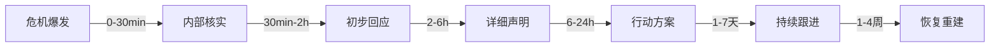

## 八、个人品牌的危机沟通策略

个人品牌的本质是信任资产。信任的建立需要数年积累，崩塌却可能只在一条失控的微博、一次被断章取义的采访、或一个团队成员的丑闻之间。危机沟通不是"灭火"——它是对信任资产的紧急止损与修复。本章系统讲解危机的识别、预防、应对与恢复全流程，帮助你在风暴中守住品牌底线，甚至化危为机。

### 8.1 为什么个人品牌更脆弱

与企业品牌相比，个人品牌面临三重脆弱性：

| 维度 | 企业品牌 | 个人品牌 |
|------|----------|----------|
| **主体绑定度** | 品牌与公司可分离 | 品牌即人，人即品牌 |
| **容错空间** | 可换人、换产品线 | 个人言行无法"换人" |
| **传播速度** | 官方渠道可控 | 个人言论天然适合病毒传播 |
| **情感投射** | 理性消费关系 | 粉丝带有情感认同和投射 |
| **恢复难度** | 品牌重塑成本高但可行 | 人格信任一旦破裂极难修复 |

这意味着个人品牌的危机管理标准必须更高：不是"出事后怎么补救"，而是"怎么让危机尽量不发生，发生了怎么在最短时间内控制"。

### 8.2 危机的五种类型与识别

危机不是单一形态。不同类型的危机需要不同的应对策略，错误的类型判断会导致错误的回应。

#### 8.2.1 言行失误型

**定义**：你自己在公开场合发表了不当言论、做出了不当行为。

**典型场景**：
- 在社交媒体发表了带有歧视性、偏见性的观点
- 公开场合酒后失言被拍到
- 对某个公共事件发表了缺乏同理心的评论
- 过往言论被翻出（"考古"），放在当下语境下引发争议

**核心特征**：责任在自己，无法推卸，只能面对。

**应对关键**：真诚道歉 + 明确表态已认识到错误 + 具体改正行动。

**反面案例**：某知名博主被翻出早年歧视性言论后，发布了一条"那是很多年前的事了，当时的语境不同"的回应，被解读为"不认错还找借口"，危机持续发酵两周。

**正面案例**：某科技KOL在直播中使用了不恰当的比喻，2小时内发布视频道歉，承认"用词不当，伤害了特定群体的感受"，并宣布将在后续内容中邀请相关群体代表对话。事件在3天内基本平息。

#### 8.2.2 被攻击型

**定义**：有人恶意中伤、散布谣言、断章取义，对你的品牌造成损害。

**典型场景**：
- 竞争对手雇佣水军散布负面信息
- 你的某段话被截取出来脱离上下文传播
- 匿名举报或"爆料"，内容真假参半
- "黑稿"——看似客观报道，实则选择性呈现事实

**核心特征**：错不在你，但沉默会被当作默认。

**应对关键**：冷静澄清事实 + 提供完整上下文 + 必要时法律手段。

**重要原则**：不要陷入"自证陷阱"。当对方提出10个指控时，你不需要逐一反驳——抓住最核心的事实错误，用证据一次澄清，其余交由受众判断。逐条反驳反而显得心虚，且会放大争议的传播范围。

#### 8.2.3 关联危机型

**定义**：你身边的人（团队成员、合作伙伴、家人）出了问题，波及到你的品牌。

**典型场景**：
- 你的助理/经纪人被曝出不当行为
- 合作品牌出了产品质量或道德问题
- 家人/伴侣的公开行为引发争议
- 你参与的项目被曝出违规操作

**核心特征**：不是你做的，但你有关联。

**应对关键**：明确表态立场 + 说明关联程度 + 采取切割或共担的行动。

**边界把握**：既不能急于撇清关系显得冷血，也不能无条件背书把自己拖入更深的泥潭。关键是区分"知情参与"和"不知情被牵连"——如果是后者，坦诚说明并展示你在采取调查或修正行动。

#### 8.2.4 能力质疑型

**定义**：你的专业能力、成果真实性受到公开质疑。

**典型场景**：
- 被质疑学历、资质造假
- 被质疑作品抄袭或代笔
- 被质疑业绩数据注水
- 过往"成功案例"被当事人否认

**核心特征**：触及个人品牌的核心价值——如果你的品牌建立在"专业能力"上，能力质疑就是对根基的动摇。

**应对关键**：用事实和证据回应，而非情绪。提供可验证的第三方证据（证书编号可查、原始数据可追溯、合作者可背书）。

#### 8.2.5 价值观冲突型

**定义**：你在某个公共议题上的立场与主流受众产生冲突。

**典型场景**：
- 政治立场引发粉丝分裂
- 商业决策被认为违背了你一贯倡导的价值观
- 为争议品牌代言
- 对社会事件的态度被认为冷漠或偏颇

**核心特征**：没有客观对错，但受众感受会直接影响品牌忠诚度。

**应对关键**：真诚表达立场 + 尊重不同声音 + 准备接受部分受众流失。价值观危机无法讨好所有人，试图"两边不得罪"的模糊回应往往两边都得罪。

### 8.3 危机回应的HOT原则

HOT原则是危机回应的核心框架，适用于所有类型的个人品牌危机。

#### 8.3.1 H - Honest（诚实）

**为什么诚实是唯一有效策略**：在社交媒体时代，任何谎言都有被揭穿的可能。一旦被发现说谎，危机的性质会从"犯错"升级为"欺骗"，后者引发的信任崩塌是毁灭性的。数据显示，受众对"犯错后诚实道歉"的容忍度是"犯错后撒谎掩盖"的5倍以上。

**诚实的具体表现**：
- 承认事实，不扭曲、不省略关键细节
- 承认自己的感受（"我感到非常后悔和尴尬"），而不是机械地读稿
- 如果有些事实还不确定，诚实地说"我正在调查中，会在X时间内给出完整说明"

**常见误区**：诚实不等于"把所有信息都倒出来"。策略性的诚实——在正确的时间、用正确的方式、对正确的受众传递关键事实——才是真正的专业。

#### 8.3.2 O - Own it（承担）

**承担的本质**：不是"背锅"，而是展现一个成年人面对问题的态度。即使危机不完全是你的责任，你也可以承担你该承担的那部分。

**承担的层次**：

Level 1: 承认事实 — "这件事确实发生了"
Level 2: 承认责任 — "这是我的责任" / "我对此负有责任"
Level 3: 承认影响 — "我理解这对你/大家造成了XX影响"
Level 4: 承诺改变 — "我将采取以下具体行动"

**反面教材**：
- "如果有人觉得被冒犯，我表示遗憾"——这不是道歉，这是把责任推给受众的"感受"
- "这不是我的本意"——意图不能否定结果
- "当时的情况很复杂"——解释可以有，但不能放在道歉前面

**正面示范**：
- "我在XX场合说了XX话，这是我的错。我完全理解为什么这会让XX群体感到受伤。我为我的言行负全部责任。"

#### 8.3.3 T - Take action（行动）

**行动的说服力**：空洞的承诺（"我以后会注意"）在危机中毫无价值。受众需要看到具体的、可验证的、有时间表的行动方案。

**行动方案的SMART标准**：

| 要素 | 说明 | 示例 |
|------|------|------|
| **S**pecific（具体） | 明确做什么 | "邀请第三方机构审计"而非"加强管理" |
| **M**easurable（可衡量） | 有量化指标 | "将审核流程从2层增加到4层" |
| **A**chievable（可达成） | 不要过度承诺 | 承诺能兑现的事 |
| **R**elevant（相关） | 直接回应问题根源 | 行动要与危机直接相关 |
| **T**ime-bound（有时限） | 给出明确时间表 | "在30天内完成并公开报告" |

**行动的三个层次**：
1. **止损行动**：立即停止造成问题的行为（删内容、下架产品、终止合作）
2. **补救行动**：对已经受影响的人进行补偿
3. **预防行动**：建立机制防止类似问题再次发生

### 8.4 危机回应的黄金时间线

时间是危机管理中最稀缺的资源。每多沉默一小时，公众的叙事权就流失一分。

#### 第一阶段：0-30分钟——冷静核实

**做什么**：
- 快速了解发生了什么，收集事实片段
- 评估危机的类型和严重程度
- 通知核心团队（如果有）
- 不要在社交媒体上做任何回应

**不要做什么**：
- 不要慌张，不要在情绪激动时做任何公开表态
- 不要试图"灭火"——在不了解全貌时，任何回应都可能引火烧身
- 不要让团队成员擅自对外发言

**内部评估清单**：
- 发生了什么？（事实）
- 谁受到了影响？（受众）
- 传播范围有多大？（量级）
- 是否有更多"炸弹"可能引爆？（预判）
- 我们的立场应该是什么？（策略）

#### 第二阶段：30分钟-2小时——初步回应

即使你还没有完整的解决方案，也需要让受众知道"你已经知道了，你正在处理"。沉默在危机初期会被快速解读为"默认"或"不在乎"。

**初步回应模板**：

> 我已经注意到了关于[简述事件]的讨论。我对此非常重视，正在认真了解情况。我会在[具体时间]前给出完整的说明。感谢大家的关注和耐心。

**要素**：
- 确认你已知情
- 表达重视态度
- 给出明确的后续时间节点
- 语气诚恳但不过度道歉（事实未确认前）

#### 第三阶段：2-6小时——详细回应

这是危机回应的核心窗口。你需要在此阶段完成：
- 对事实的完整说明（你确认了哪些事实）
- 你的态度和立场（诚恳、负责、反思）
- 你已经采取的即时行动
- 后续的行动计划和时间表

**详细回应的结构**：

1. 事实陈述（What happened）
   - 客观描述事件经过
   - 不回避关键事实

2. 态度表态（How I feel / My position）
   - 承认错误/表明立场
   - 表达对受影响者的同理心

3. 即时行动（What I've done）
   - 已经做了什么
   - 正在做什么

4. 长期方案（What I will do）
   - 防止再犯的具体措施
   - 可验证的承诺和时间表

5. 感谢与请求（Thank you）
   - 感谢关注和监督
   - 恳请给予改正的机会

#### 第四阶段：6-24小时——行动执行

光说不做是危机管理的大忌。在这个阶段，你需要开始执行你在声明中承诺的行动，并通过社交媒体实时更新进度。这种透明度本身就是最好的公关。

#### 第五阶段：1-7天——持续跟进

每天或隔天发布一次进展更新。频率不必太高，但必须让受众看到"事情在推进"。这个阶段的目标是将危机从"情绪对立"转化为"问题解决"的叙事框架。

#### 第六阶段：1-4周——恢复重建

危机逐渐平息后，不要急于"翻篇"。用持续的正向内容和实际行动来重建信任。这个阶段的关键词是"一致性"——你的行为必须和你在危机中的承诺保持一致，任何"说一套做一套"都会引发二次危机。

### 8.5 平台差异化的危机沟通策略

不同平台有不同的传播特性、用户行为和舆论生态，危机沟通必须因地制宜。

#### 微博/Twitter

**特点**：公开广场，传播速度快，情绪化程度高，热搜机制放大效应。

**策略**：
- 初步回应优先在微博发布（传播最快）
- 使用长图或视频回应，减少被断章取义的可能
- 避免在评论区与人争辩——任何回复都可能成为新的素材
- 如果情况严重，考虑通过微博官方发布"声明"功能

**时间窗口**：微博危机的黄金回应时间是1-2小时，超4小时基本进入"被动"状态。

#### 微信公众号/视频号

**特点**：相对封闭，受众多为已有关注者，传播依赖转发。

**策略**：
- 适合发布详细的、有深度的回应长文
- 可以用"原文链接"附上完整证据材料
- 利用视频号发布个人出镜回应，增强真诚感

#### B站/抖音/小红书

**特点**：内容形式以视频为主，评论区是二次传播的重要阵地。

**策略**：
- 视频回应优于文字回应——面部表情和语气传递真诚度
- 准备好评论区可能出现的"名场面截图"，提前想好应对
- B站用户尤其看重"态度"，过于公关化的语言会被识别为敷衍

#### 知乎

**特点**：理性讨论氛围较浓，但"扒皮"文化盛行。

**策略**：
- 如果危机起源于知乎，优先在知乎原帖下回应
- 提供完整的证据链，知乎用户对"证据"的要求最高
- 可以通过"回答问题"的方式进行结构化的澄清

### 8.6 危机中的情绪管理

危机中最容易被忽视但最致命的因素是决策者的情绪状态。在恐惧、愤怒、委屈等强烈情绪下做出的回应，几乎必然比冷静状态下的回应更糟糕。

#### 认知层面

**常见心理陷阱**：
- **战斗反应**：愤怒驱使下想"怼回去"——几乎100%会恶化局势
- **逃避反应**：鸵鸟心态，希望"不回应就会过去"——几乎100%会错过最佳窗口
- **讨好反应**：过度道歉，承诺做不到的事——会导致后续信任更差
- **完美主义**：想等到"完美的回应"再发布——等太久就错过了时间窗口

**应对方法**：在危机爆发的第一时间，给自己10分钟的"冷却期"。离开屏幕，深呼吸，然后问自己三个问题：
1. 如果这是别人的品牌出了这个问题，我会建议他怎么做？
2. 三年后回头看，我会希望自己当时做了什么？
3. 我最在乎的受众会希望看到什么样的回应？

#### 行为层面

- 不要在深夜或酒后做危机回应
- 找一个你信任的、理性的朋友或顾问先审阅你的回应稿
- 如果条件允许，让专业公关人员介入——不是因为他们比你聪明，而是因为他们不带情绪

### 8.7 危机中的法律意识

危机沟通不是纯粹的公关行为，它同时具有法律含义。

**必须知道的法律边界**：
- **公开道歉的法律效力**：在某些情况下，公开道歉可能被视为"自认"，在后续法律程序中对你不利。如果危机可能涉及法律纠纷，先咨询律师再发布声明。
- **名誉权保护**：如果对方的攻击构成诽谤（捏造事实、造成实际损害），你有权通过法律途径维权。但"走法律程序"这句话不要轻易说出口——说了就要做到，否则是更大的信用破产。
- **证据保全**：在危机爆发后，立即对所有相关内容进行截图、录屏、公证。对方可能会删除原始内容。
- **隐私边界**：在澄清事实时，注意不要泄露第三方隐私信息，否则可能从"受害者"变成"侵权者"。

**建议**：在危机发生前就建立法律顾问关系。危机爆发时再找律师，时间和成本都会大幅增加。

### 8.8 危机预防：建立预警系统

最好的危机管理是让危机不发生。建立一套个人品牌的"风险预警系统"，可以在危机萌芽阶段就介入处理。

#### 定期舆情监测

**工具与方法**：
- 设置自己的名字/品牌名的社交媒体监控（微博搜索、百度指数、微信搜一搜）
- 每周检查一次自己过往内容的评论区，识别负面情绪的聚集
- 关注行业内同类品牌遭遇的危机，提前排查自己的类似风险点

#### 内容发布审核流程

即使是个人品牌，也应该建立"发布前自检"的习惯：

自检清单：
□ 这条内容放在明天的新闻头条上，我会尴尬吗？
□ 有没有可能被断章取义的表达？
□ 是否涉及敏感话题（政治、宗教、性别、种族）？
□ 有没有可能伤害到特定群体？
□ 数据/引用来源是否可靠？
□ 发布时间是否合适？（避免重大事件期间发布可能引发联想的内容）

#### 关系网络维护

危机发生时，你的关系网络就是你的"急救系统"：
- 维护3-5个在不同领域有公信力的"信任背书人"——他们在关键时刻的一句话，比你自己说十句都有用
- 与核心粉丝/社群保持良好关系——他们是危机中的"第一道防线"
- 建立媒体/行业KOL的联系——至少在危机前认识他们，而不是危机时第一次联系

### 8.9 危机恢复：重建信任的四步法

危机平息不等于危机结束。真正的考验是危机后的3-6个月——你的行为是否与承诺一致。

#### 第一步：兑现承诺（第1-4周）

逐一落实你在危机中承诺的每一项行动，并公开更新进展。如果某些承诺需要更长时间，定期发布进度报告。

#### 第二步：持续输出价值（第1-3个月）

用高质量的内容和行动重新积累信任。不要急于"回到正轨"——在受众眼中，危机后的你和危机前的你是两个人，你需要重新"证明"自己。

#### 第三步：主动复盘（第3-6个月）

在适当的时机（比如危机半年后），发布一次"复盘"——回顾危机的教训、你的成长、以及你做出的改变。这种"自我反思"的叙事框架，可以将危机转化为品牌成长的故事。

#### 第四步：建立新的品牌叙事

最终目标是将危机纳入你的品牌故事。最强大的个人品牌不是"从未犯错"的品牌，而是"犯错后站起来并变得更强"的品牌。

### 8.10 实战模板：危机回应声明模板

以下模板覆盖最常见的"言行失误型"危机，可根据实际情况调整：

**模板一：轻度危机（用词不当、表达欠妥）**

> 关于[事件简述]，我想做一个说明。
>
> [具体说明发生了什么]。我的表述确实不够妥当，[说明为什么不当]。对此我深感抱歉。
>
> 我的本意是[解释意图]，但我意识到，意图不能否定影响。[受影响群体]的感受是真实且合理的。
>
> 为了防止类似情况再次发生，我将[具体措施1]、[具体措施2]。
>
> 感谢大家的监督和指正。

**模板二：中度危机（涉及实质性错误或伤害）**

> 我需要就[事件]向大家做一个正式的说明和道歉。
>
> **事实经过**：[客观、完整地描述事件]
>
> **我的态度**：这是我的错误，我为此承担全部责任。[描述对受影响者的同理心]。
>
> **已采取的行动**：
> 1. [具体行动1]
> 2. [具体行动2]
> 3. [具体行动3]
>
> **后续计划**：
> 1. [计划1及时间表]
> 2. [计划2及时间表]
>
> 我会在[具体时间]更新进展。再次向所有受到影响的人道歉。

**模板三：被攻击/谣言型回应**

> 近日网上流传的关于[事件]的说法，我做以下说明。
>
> **关于[具体指控1]**：事实是[提供证据/完整上下文]。
>
> **关于[具体指控2]**：事实是[提供证据/完整上下文]。
>
> [如果指控中有真实部分]：关于[真实部分]，我承认[说明]，并已采取[措施]。
>
> [如果指控完全是捏造]：相关内容与事实严重不符。我已经对相关证据进行了保全，并保留通过法律途径维护自身权益的权利。
>
> 我欢迎基于事实的讨论和监督，但不接受恶意的造谣和抹黑。

### 8.11 高手进阶：化危为机的策略

顶级的危机沟通不是"止损"，而是"增值"。以下策略只适用于危机应对基本功扎实的实践者：

**策略一：危机叙事重构**
将危机从"你犯了错"的叙事，重构为"你从错误中学到了什么"的叙事。关键是在回应中展现深度反思，而不是表面道歉。受众对"成长型人格"有天然的好感。

**策略二：危机中的价值宣言**
在危机中公开重申你的核心价值观，将危机转化为一次"品牌价值观的公开宣示"。例如，在被质疑"恰烂饭"（接了不合适的广告）后，不仅道歉，还公布了一套完整的"合作品牌筛选标准"——这会将危机转化为"品牌更透明"的正面叙事。

**策略三：借助危机建立制度**
危机暴露的往往是系统性问题。将危机转化为建立新制度的契机（如内容审核委员会、合作品牌准入机制、定期透明报告），并邀请社区参与监督——这会将"被动应对"转化为"主动建设"。

### 8.12 常见误区与纠正

| 误区 | 为什么是错的 | 正确做法 |
|------|-------------|----------|
| "不回应就会过去" | 社交媒体时代，沉默=默认，空白会被谣言填补 | 在2小时内发出初步回应 |
| "发律师函震慑" | 律师函在舆论场通常是负面信号，会激化矛盾 | 律师函留到必要时，先用沟通解决 |
| "找大V帮忙洗白" | 被发现后会引发"水军"质疑，危机加倍 | 真诚回应，让第三方自发判断 |
| "道歉越多次越好" | 过度道歉显得虚伪，且会反复强化负面记忆 | 道歉一次到位，之后用行动说话 |
| "把锅甩给团队/下属" | 推卸责任是个人品牌的大忌，显得没有担当 | 作为品牌主体，承担最终责任 |
| "危机过后赶紧发正面内容" | 太快"翻篇"会让受众觉得你不在乎 | 给危机足够的消化时间，再自然过渡 |
| "用小号试探风向" | 小号被扒出来的后果远超危机本身 | 不要用任何形式的"暗操作" |
| "跟质疑者对线辩论" | 任何争论都可能被截图成为新素材 | 不在评论区回应，用正式声明回应 |

### 8.13 核心要点总结

个人品牌危机沟通的底层逻辑可以用一句话概括：**在正确的时间，用正确的方式，对正确的人，说正确的话，做正确的事。**

具体拆解：
1. **预防优于应对**：建立舆情监测、内容自检、关系网络三大防线
2. **速度是生命线**：2小时内初步回应，6小时内详细声明
3. **诚实是唯一策略**：在社交媒体时代，任何谎言都有被揭穿的可能
4. **行动胜于言语**：用具体的、可验证的行动来证明你的承诺
5. **情绪管理是基础**：在冷静状态下做决策，不要被恐惧或愤怒驱动
6. **平台策略要差异化**：微博、微信、B站、知乎各有不同的传播生态
7. **恢复是长期工程**：危机后3-6个月的行为一致性决定品牌能否重生
8. **化危为机是最高境界**：将危机转化为品牌透明度和价值观的公开展示

记住：每一次危机都是对你品牌"真实度"的压力测试。一个在危机中展现出真诚、担当和成长力的个人品牌，往往比从未经历过危机的品牌更具韧性。
