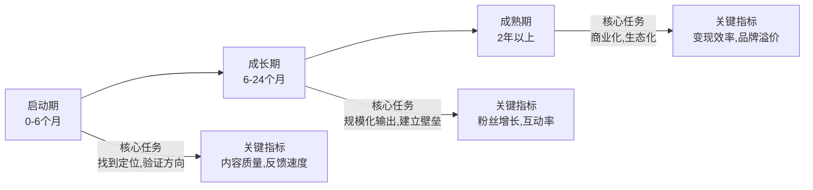
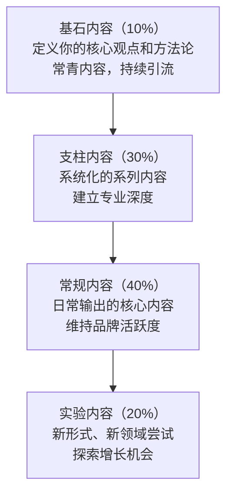
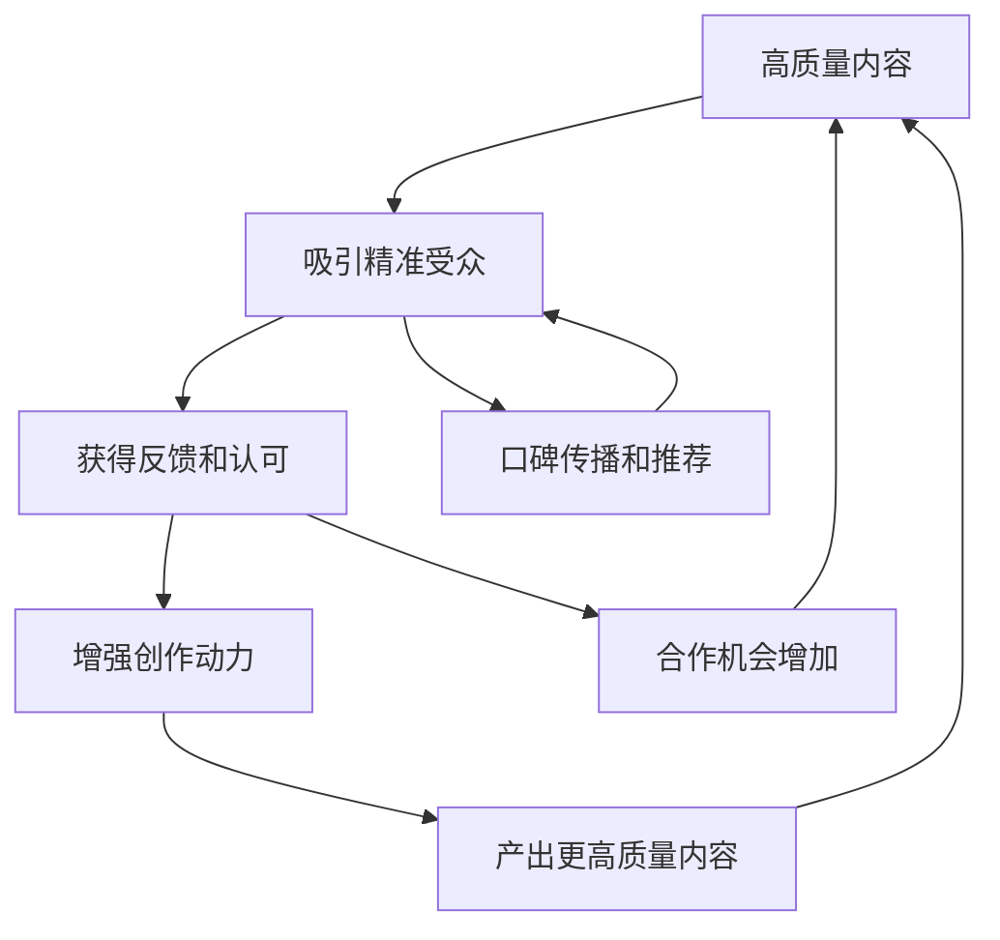
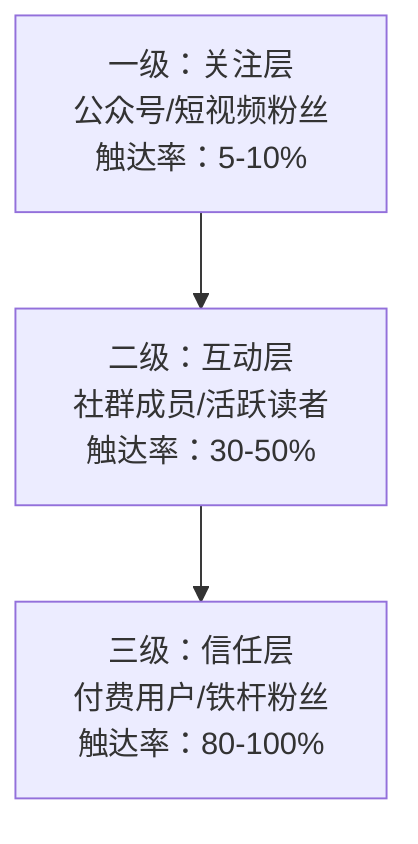
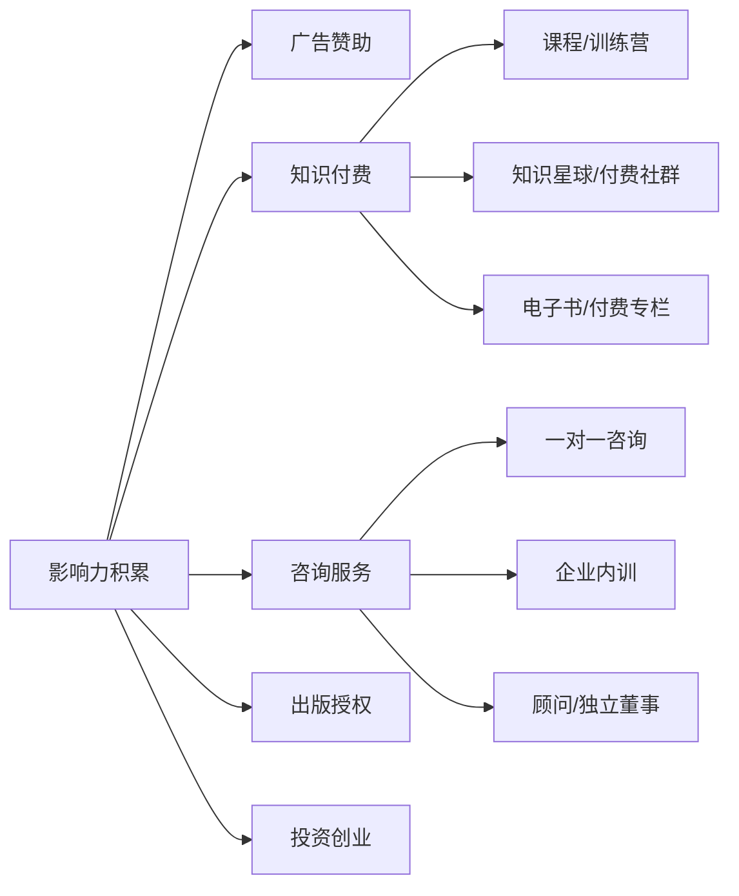
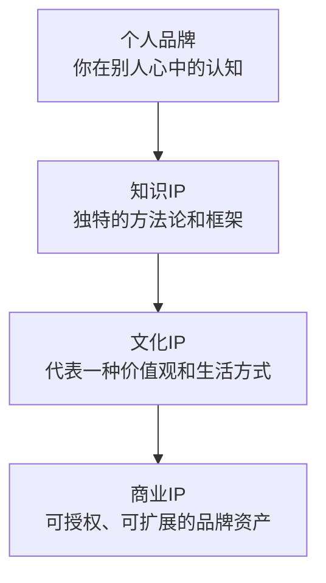

## 九、个人品牌的长期经营策略

个人品牌不是一次性的营销活动，而是一场持续数年甚至数十年的"马拉松"。短期的爆发可能带来流量，但只有长期经营才能建立真正有生命力的品牌资产。本章系统讲解个人品牌从启动期到成熟期的全生命周期经营策略，涵盖内容体系、增长引擎、商业变现、风险管理和品牌进化五大维度。

### 9.1 长期经营的底层逻辑

#### 9.1.1 品牌资产的复利模型

个人品牌的核心价值在于**复利效应**——你今天投入的每一份内容、每一次互动、每一个关系，都在为明天的品牌资产增值。

品牌资产的复利公式可以表示为：

**品牌价值 = 内容资产 × 关系网络 × 信任系数 × 时间**

四个变量缺一不可：

| 变量 | 含义 | 关键指标 |
|------|------|----------|
| 内容资产 | 你积累的所有内容的总和 | 内容数量、搜索排名、引用次数 |
| 关系网络 | 与受众、同行、合作方的关系深度 | 粉丝数、互动率、合作机会 |
| 信任系数 | 受众对你的真实信任程度 | 复购率、推荐率、口碑传播 |
| 时间 | 持续经营的时间跨度 | 品牌存续年限、内容持续性 |

这意味着：即使每天只做一点点，只要坚持足够久，复利效应也会产生惊人的结果。反过来，三天打鱼两天晒网，复利链条反复断裂，品牌永远无法积累势能。

#### 9.1.2 长期经营的三个阶段

个人品牌的生命周期大致分为三个阶段，每个阶段的策略重心截然不同：

**启动期（0-6个月）**：核心任务是验证定位、打磨内容风格、找到种子受众。这个阶段不要追求数据，要追求"对的人的认可"——100个精准粉丝比10,000个泛粉有价值得多。

**成长期（6-24个月）**：核心任务是建立稳定的内容生产体系、扩大影响力半径、形成差异化壁垒。这个阶段要开始系统化运营，从"个人作坊"升级为"内容工厂"。

**成熟期（2年以上）**：核心任务是商业化变现、构建品牌生态、实现从个人品牌到个人IP的跃迁。这个阶段要考虑团队化、产品化和长期传承。

#### 9.1.3 长期主义 vs 短期主义

| 维度 | 短期主义做法 | 长期主义做法 |
|------|-------------|-------------|
| 内容策略 | 追热点、标题党、蹭流量 | 深耕垂直领域、积累专业壁垒 |
| 受众策略 | 追求粉丝数量 | 追求粉丝质量和互动深度 |
| 变现策略 | 过早商业化、频繁广告 | 先建立信任，再自然变现 |
| 增长策略 | 买粉、刷量、互推群 | 有机增长、口碑传播 |
| 危机应对 | 删帖、逃避、甩锅 | 坦诚面对、主动沟通 |
| 长期结果 | 流量不稳定、信任脆弱 | 品牌资产持续增值 |

### 9.2 内容体系的长期经营

#### 9.2.1 内容日历的系统化制定

内容日历不是简单的"排期表"，而是你的品牌内容战略的执行蓝图。一个好的内容日历需要回答三个问题：**说什么**（内容主题）、**怎么说**（内容形式）、**在哪说**（发布平台）。

**月度内容规划模板**：

| 周次 | 内容类型 | 主题方向 | 平台 | 目的 |
|------|----------|----------|------|------|
| 第1周 | 深度长文 | 行业洞察/方法论 | 公众号+知乎 | 建立专业权威 |
| 第2周 | 短视频/图片 | 实用技巧/案例拆解 | 抖音+小红书 | 扩大受众覆盖 |
| 第3周 | 互动内容 | 问答/投票/讨论 | 微博+朋友圈 | 增强用户粘性 |
| 第4周 | 个人故事 | 经历/反思/成长 | 公众号+视频号 | 建立情感连接 |

**内容日历的核心原则**：

- **70/30法则**：70%的计划性内容保证稳定性，30%的灵活性内容应对热点和突发灵感
- **深度与广度的平衡**：既要有"钉子型"深度内容建立专业壁垒，也要有"扇子型"广度内容触达更多受众
- **专业性与亲和力的平衡**：专业内容让你被尊重，生活化内容让你被喜欢——两者缺一不可
- **输出频率的稳定性**：宁可降低频率也要保证质量，断更是品牌的大忌

**内容日历的季度规划框架**：

Q1（1-3月）：年度规划 + 行业趋势预测 + 新年主题内容
Q2（4-6月）：深度系列 + 年中复盘 + 线下活动
Q3（7-9月）：热点跟进 + 跨界合作 + 新形式实验
Q4（10-12月）：年终总结 + 来年预告 + 系列收官

#### 9.2.2 内容的"金字塔"结构

长期经营中，你的内容应该形成一个金字塔结构：

**基石内容**是你的"代表作"——可能是你最受欢迎的一篇文章、一个被反复引用的框架、一个标志性的观点。这类内容需要反复打磨，使其成为你的"名片"。例如，提到定位理论就想到特劳特，提到"第一性原理"就想到马斯克。

**支柱内容**是你的系列化内容——比如"每周一个沟通技巧""每月一个行业案例拆解"。这类内容让用户形成稳定的期待，养成定期消费你内容的习惯。

**常规内容**是你的日常输出——保持品牌的存在感和活跃度。这类内容不需要每篇都是精品，但需要保持稳定的质量基线。

**实验内容**是你探索新机会的试验田——尝试新平台、新形式、新话题。大部分实验可能会失败，但少数成功的实验会成为你下一个增长点。

#### 9.2.3 常青内容的打造策略

常青内容（Evergreen Content）是长期经营的核心武器——它不会随时间过时，持续为你带来流量和影响力。

**打造常青内容的五个原则**：

1. **选题要"大"不要"小"**：写"如何高效沟通"比写"2024年最新沟通技巧"更有生命力
2. **方法论优于趋势**：底层逻辑和方法论不会过时，具体的工具和平台会
3. **定期更新维护**：即使是常青内容，也需要每6-12个月更新一次数据和案例
4. **结构化便于检索**：使用清晰的目录结构，方便读者按需查阅
5. **可引用性强**：提出原创框架、模型或金句，让别人愿意引用和转发

**常青内容的类型清单**：

| 类型 | 示例 | 生命周期 |
|------|------|----------|
| 方法论文章 | "金字塔原理在沟通中的应用" | 3-5年 |
| 工具对比评测 | "10款笔记软件深度对比" | 1-2年（需更新） |
| 入门指南 | "零基础学演讲的完整路线" | 2-3年 |
| 案例拆解 | "乔布斯发布会的沟通技巧分析" | 5年以上 |
| 框架/模型 | "沟通的PREP法则" | 5年以上 |
| 资源合集 | "沟通学习必读的20本书" | 1-2年（需更新） |

#### 9.2.4 内容复利：一鱼多吃策略

长期经营中，你需要最大化每一篇内容的价值。"一鱼多吃"策略是指将一个核心内容主题，拆解为多种形式、发布在多个平台：

原始内容：一篇5000字的深度文章
├── 拆解为5条微博/朋友圈金句
├── 制作成1个5分钟的短视频脚本
├── 提炼为1张信息图/思维导图
├── 录制为1期播客节目
├── 整理为1份PDF下载资源
├── 拆分为3条小红书图文笔记
└── 核心观点写入下一本书的章节

这种策略的效率远高于"一个平台写一篇新内容"——因为你只需要深入研究一次，却能获得7倍的传播效果。

### 9.3 个人品牌的飞轮效应

#### 9.3.1 飞轮的启动与加速

当个人品牌运转良好时，会形成一个正向循环的"飞轮"：

这个飞轮一旦转动起来，就会自我加速——更多好内容带来更多受众，更多受众带来更多反馈和机会，更多机会带来更多资源，更多资源产出更好的内容。

**飞轮启动的关键节点**：

| 阶段 | 时间 | 里程碑 | 关键动作 |
|------|------|--------|----------|
| 冷启动 | 第1-3个月 | 找到100个精准粉丝 | 专注内容质量，不追数据 |
| 初步验证 | 第3-6个月 | 1篇内容获得自然传播 | 分析爆款特征，复制成功模式 |
| 加速期 | 第6-12个月 | 粉丝突破1000 | 建立稳定输出节奏，开始互动运营 |
| 飞轮期 | 12个月以上 | 内容自传播，机会主动来 | 优化变现模型，扩大团队 |

但启动飞轮需要耐心——最初的6-12个月是最困难的，因为飞轮还没转起来，你需要独自推着它跑。这个阶段最大的敌人是"看不到回报就放弃"。

#### 9.3.2 飞轮的四个加速器

**加速器一：反馈闭环**

建立快速的反馈机制，让每一次内容输出都能获得可量化的反馈：

- **数据反馈**：阅读量、点赞数、转发数、评论数——这些是最直接的反馈信号
- **质量反馈**：评论区的深度讨论、私信的具体感谢、被引用的次数——这些反映内容的真实价值
- **商业反馈**：付费转化率、咨询预约量、合作邀约——这些验证品牌的商业价值

**加速器二：社交证明**

社交证明是飞轮加速的核心燃料——当别人看到"这么多人都认可这个人"，就会更容易信任你：

- 展示学员/客户的真实评价和成果
- 媒体报道和行业奖项的积累
- 与行业大V的互动和背书
- 出版物、演讲邀请等权威认证

**加速器三：网络效应**

当你的品牌开始产生网络效应——用户之间自发传播你的内容、讨论你的观点——飞轮就会进入指数增长阶段。触发网络效应的关键是创造"可讨论性"：提出有争议的观点、创造独特的术语和框架、构建社群让用户之间产生连接。

**加速器四：系统化**

当内容生产、社群运营、商业变现都形成标准化的流程和系统，你就能从"手工作坊"升级为"内容工厂"，释放出更多精力用于战略思考和内容创新。

### 9.4 平台策略与跨平台经营

#### 9.4.1 平台选择的决策矩阵

不同平台有不同的用户画像、内容偏好和算法逻辑。选择平台时需要考虑三个维度：你的目标受众在哪里、你擅长什么形式的内容、平台的流量红利在哪里。

| 平台 | 用户画像 | 内容偏好 | 适合阶段 | 核心指标 |
|------|----------|----------|----------|----------|
| 公众号 | 25-45岁职场人士 | 深度长文 | 成熟期 | 阅读完成率、分享率 |
| 知乎 | 大学生+职场新人 | 专业问答、深度分析 | 启动期 | 赞同数、收藏数 |
| 小红书 | 18-35岁女性为主 | 图文笔记、实用技巧 | 成长期 | 收藏率、搜索排名 |
| 抖音 | 全年龄段 | 短视频、故事化 | 成长期 | 完播率、互动率 |
| B站 | 18-30岁年轻人 | 中长视频、知识类 | 启动期 | 弹幕互动、完播率 |
| 视频号 | 30-50岁 | 短视频+直播 | 成熟期 | 社交推荐、转化率 |
| 微博 | 全年龄段 | 热点评论、短内容 | 全阶段 | 话题参与、转发量 |
| 播客 | 25-40岁高知人群 | 长音频、对话 | 成长期 | 订阅数、完播率 |

#### 9.4.2 跨平台经营的核心原则

**原则一：一主多辅，不要平均用力**

选择1-2个主平台深度经营，其他平台作为辅助分发渠道。主平台投入70%的精力，辅助平台投入30%。试图在所有平台都做到头部，结果往往是每个平台都做不好。

**原则二：内容适配，不要简单搬运**

每个平台的用户习惯和算法逻辑不同，同一个主题需要根据平台特性重新包装：

同一主题"如何高效沟通"的跨平台适配：

公众号：5000字深度长文，系统讲解框架和方法
知乎：问答形式，回答"如何在职场中高效沟通"
小红书：9宫格图文，"5个沟通技巧让你升职加薪"
抖音：60秒短视频，"3句话让领导听你的"
B站：15分钟视频，"沟通的底层逻辑"
播客：45分钟对谈，"我和XX聊聊沟通那些事"

**原则三：流量互通，构建闭环**

在主平台和辅助平台之间建立流量闭环：从短视频平台引流到公众号沉淀、从公众号引导到私域社群、从社群转化到付费产品。每个平台都应该有明确的"下一步"引导。

#### 9.4.3 私域流量的长期经营

公域流量（平台推荐）是"借来的地"——平台算法一变，你的流量可能归零。私域流量（微信个人号、社群、邮件列表）才是"自己的地"。

**私域经营的三级体系**：

**私域经营的具体策略**：

- **微信个人号**：定期朋友圈分享有价值的内容，与核心粉丝保持私信互动。朋友圈是最好的"日常触达"渠道，但要注意不要变成广告号——有价值的内容和生活化的分享应该占80%以上。
- **社群运营**：建立主题社群（如"沟通学习群"），定期组织讨论、分享、答疑。社群的核心价值是"让用户之间产生连接"，而不仅仅是"你对用户的单向输出"。
- **邮件列表**：虽然在国内相对小众，但邮件列表是触达率最高的私域渠道之一（打开率通常在20-40%，远高于公众号的5-10%）。适合知识类品牌。

### 9.5 从个人品牌到商业价值

#### 9.5.1 变现路径全景图

个人品牌的最终目的是创造价值——不仅是社会价值，也包括商业价值。但变现不是一蹴而就的，需要根据品牌的发展阶段选择合适的变现方式。

**各变现路径的详细对比**：

| 变现方式 | 启动门槛 | 收入上限 | 时间投入 | 适合阶段 |
|----------|----------|----------|----------|----------|
| 广告赞助 | 需要一定粉丝量 | 中等 | 低 | 成熟期 |
| 在线课程 | 需要专业能力+课程设计 | 高 | 高（前期制作） | 成长期 |
| 付费社群 | 需要核心粉丝基础 | 中等 | 中等 | 成长期 |
| 一对一咨询 | 只需要专业能力 | 低（受时间限制） | 高 | 启动期 |
| 企业内训 | 需要行业影响力 | 高 | 中等 | 成熟期 |
| 出版 | 需要内容积累+出版渠道 | 低（版税有限） | 高 | 成熟期 |
| 品牌授权 | 需要强品牌认知 | 高 | 低 | 成熟期 |
| 投资创业 | 需要资金+行业资源 | 最高 | 最高 | 成熟期 |

#### 9.5.2 变现时机的判断

**不要太早变现**——在信任建立之前就急于收费，会损害品牌。一个刚关注你三天的人收到课程推销，大概率会取关。信任的建立需要时间，通常至少需要3-6个月的持续价值输出。

**也不要太晚**——影响力是有"保质期"的，不及时转化就会浪费。当你发现粉丝开始问"有没有课程""能不能找你咨询"时，就是变现的自然时机。

**变现时机的三个信号**：

1. **需求信号**：粉丝主动询问付费产品和服务
2. **信任信号**：粉丝在评论区、私信中表达深度认可
3. **市场信号**：同领域已有成功的付费产品案例

#### 9.5.3 变现的核心原则

**原则一：价值优先，变现其次**

只推荐你真正认可的产品和服务。一次"恰饭"推荐如果质量不好，可能毁掉你几年积累的信任。用户信任你的推荐，是因为你之前建立的专业和真诚——这份信任是不可再生资源。

**原则二：阶梯式定价**

设计从免费到低价到高价的产品阶梯，让用户可以按照自己的需求和预算逐步深入：

免费内容 → 低价入门产品（9.9-99元）→ 中价核心产品（199-999元）→ 高价深度服务（1000元以上）

示例：
免费公众号文章 → 9.9元电子书 → 299元在线课程 → 1999元训练营 → 5000元一对一咨询

**原则三：交付质量 > 营销承诺**

在营销中适度降低预期，在交付中超额兑现。这比"过度承诺、勉强交付"要好一百倍。用户的口碑传播往往来自于"超出预期"的体验。

**原则四：建立可复利的商业模式**

优先选择可以"睡后收入"的变现方式——录制好的课程、写好的书、建立好的社群——这些产品一旦创建完成，就可以持续产生收入，而不需要你每次都投入等量的时间。

### 9.6 品牌健康度的监测与评估

#### 9.6.1 品牌健康度指标体系

长期经营需要定期"体检"——通过数据监测品牌健康状况，及时发现问题并调整策略。

**品牌健康度仪表盘**：

| 维度 | 核心指标 | 健康基线 | 危险信号 |
|------|----------|----------|----------|
| 内容效能 | 平均阅读完成率 | >40% | <20% |
| 内容效能 | 内容分享率 | >5% | <1% |
| 受众质量 | 粉丝月活跃率 | >30% | <10% |
| 受众质量 | 取关率 | <2%/月 | >5%/月 |
| 互动质量 | 评论区正向互动比 | >80% | <50% |
| 互动质量 | 私信咨询量 | 稳定增长 | 持续下降 |
| 商业价值 | 付费转化率 | >2% | <0.5% |
| 商业价值 | 客户复购率 | >30% | <10% |
| 行业影响 | 被引用/被提及次数 | 稳定增长 | 持续下降 |
| 行业影响 | 合作邀约质量 | 优质品牌增多 | 只有小品牌 |

#### 9.6.2 定期复盘的节奏和框架

**月度复盘**（30分钟）：
- 本月数据概览：粉丝增长、内容表现、互动情况
- 本月最佳内容分析：为什么表现好？能否复制？
- 下月内容计划调整

**季度复盘**（2小时）：
- 季度目标达成情况
- 品牌健康度全维度评估
- 竞品分析：同行在做什么？有哪些值得学习的？
- 策略调整：需要加强什么？需要放弃什么？

**年度复盘**（半天）：
- 年度品牌资产盘点
- 年度目标与愿景回顾
- 来年战略方向确定
- 个人成长与品牌成长的匹配度检查

#### 9.6.3 品牌定位的动态调整

品牌定位不是一成不变的。随着你的成长、行业的变化、受众需求的演变，品牌定位需要适时调整。但调整应该是"渐变"而非"突变"——突然的大转向会让老粉丝困惑，也会让新受众难以理解你是谁。

**需要调整定位的信号**：
- 你的兴趣和专长发生了实质性变化
- 原有的定位市场已经饱和或衰退
- 受众画像发生了明显偏移
- 你找到了更精准的差异化方向

**定位调整的安全做法**：在新旧定位之间设置6-12个月的过渡期，逐步增加新方向的内容比例（从20%到50%到80%），让受众自然适应你的转变。

### 9.7 品牌风险管理

#### 9.7.1 个人品牌的五种常见风险

| 风险类型 | 典型场景 | 影响程度 | 预防难度 |
|----------|----------|----------|----------|
| 内容风险 | 发布不实信息、侵犯版权、敏感言论 | 高 | 中 |
| 关系风险 | 合作方翻车、粉丝纠纷、同行攻击 | 中 | 高 |
| 过劳风险 | 创作倦怠、社交疲劳、失去热情 | 高 | 中 |
| 竞争风险 | 同质化竞争、平台政策变化 | 中 | 中 |
| 隐私风险 | 个人信息泄露、家庭成员被骚扰 | 高 | 高 |

#### 9.7.2 内容风险的预防

- **事实核查**：所有数据、案例、引用在发布前必须核实。一条不实信息可能让你的专业形象崩塌。
- **版权合规**：使用他人的图片、文字、音乐时必须获得授权或使用免费商用素材。版权纠纷的法律成本和声誉损失远超你的想象。
- **敏感话题的处理**：政治、宗教、性别等敏感话题需要极其谨慎。如果你的品牌不是专门讨论这些话题的，最好的策略是回避。
- **个人观点的边界**：区分"专业观点"和"个人偏好"。作为品牌表达的应该是经过深思熟虑的专业观点，而不是一时冲动的情绪宣泄。

#### 9.7.3 过劳风险的管理

过劳是个人品牌经营者最常见、也最容易被忽视的风险。当你一个人承担内容创作、社群运营、商务合作、客户服务等多重角色时，精力耗竭只是时间问题。

**预防过劳的五个策略**：

1. **设定创作节奏**：不要被"日更"的压力绑架。找到你可持续的创作频率——对有些人来说是日更，对有些人来说是周更。可持续比高频更重要。
2. **建立内容储备**：保持2-4周的内容库存，这样即使你生病、旅行或状态不佳，也不会断更。
3. **学会说"不"**：不是所有的合作、采访、活动都值得参加。评估每一个机会的时间成本和品牌收益，拒绝那些不符合你品牌方向的机会。
4. **建立支持系统**：随着品牌发展，逐步将非核心工作外包——设计、剪辑、社群管理、商务对接等。你的时间应该花在只有你能做的事情上。
5. **定期"品牌斋戒"**：每隔几个月给自己放一个"品牌假"——暂停所有内容输出和社交互动，彻底休息。这不仅是身体恢复的需要，也是重新审视品牌方向的机会。

#### 9.7.4 危机处理的HOT原则

当危机不可避免地发生时，遵循HOT原则：

- **H（Honest，诚实）**：第一时间坦诚面对，不隐瞒、不狡辩、不删帖逃避
- **O（Own it，承担）**：如果确实是你的错误，明确承认并道歉。不要找借口、不要推卸责任
- **T（Take action，行动）**：说明你将采取什么具体行动来纠正错误、防止再次发生

危机处理的时间线：

0-2小时：内部评估，确认事实
2-6小时：发布初步声明，表达态度
6-24小时：发布详细回应，说明处理方案
1-7天：执行处理方案，持续更新进展
7天后：复盘总结，优化预防机制

### 9.8 品牌进化与迭代

#### 9.8.1 从"个人品牌"到"个人IP"

当个人品牌发展到一定阶段，需要考虑从"品牌"到"IP"的升级。品牌是别人对你的认知，IP是你可以授权和扩展的无形资产。

**品牌到IP的跃迁路径**：

**知识IP的打造**：将你的经验和方法论提炼为可命名、可教授、可复用的"知识产品"。比如"金字塔原理""高效能人士的七个习惯"——这些已经超越了个人品牌，成为独立的知识IP。

**文化IP的打造**：让你的品牌代表一种价值观和生活方式。比如提到"极简主义"，人们会想到某些特定的博主；提到"终身学习"，人们会想到某些知识品牌。文化IP的核心是"价值观认同"——用户消费的不仅是你的内容，更是你所代表的生活方式。

#### 9.8.2 品牌的传承与退出策略

长期经营还需要考虑"如果我不做了怎么办"——品牌传承和退出策略。

**品牌传承的三种模式**：

| 模式 | 描述 | 示例 |
|------|------|------|
| 团队化 | 将个人品牌转化为团队品牌，逐步降低对个人的依赖 | 品牌升级为MCN或内容公司 |
| 产品化 | 将品牌价值固化为产品（课程、工具、方法论），即使个人退出也能持续运营 | 自动化课程+社群自运营 |
| 授权化 | 将品牌授权给他人运营，收取授权费 | 品牌加盟模式 |

#### 9.8.3 品牌的第二曲线

当第一曲线（原有的品牌定位和变现模式）接近天花板时，需要提前布局第二曲线。

**第二曲线的启动时机**：在第一曲线还在增长时就开始布局，而不是等到第一曲线衰退才开始。因为第二曲线在初期通常会经历一个低谷（投入资源但尚未看到回报），如果没有第一曲线的资源支撑，很容易中途放弃。

**第二曲线的方向选择**：
- **横向扩展**：从一个细分领域扩展到相关领域（比如从"沟通"扩展到"领导力"）
- **纵向深化**：从一个层级的受众扩展到其他层级（比如从"入门级"扩展到"专家级"）
- **形式创新**：从文字扩展到视频、音频、线下活动等新形式
- **商业模式创新**：从内容变现扩展到产品、服务、投资等新模式

### 9.9 长期经营的核心心法

#### 9.9.1 持续性比爆发性更重要

个人品牌经营中最大的误区是追求"一夜爆红"。事实是，绝大多数成功的个人品牌都是"慢功夫"——日复一日的稳定输出，年复一年的信任积累。不要被少数"一夜成名"的案例误导，那些案例要么有你看不到的前期积累，要么有不可复制的运气成分。

**建立持续性的三个方法**：
- 找到你真正热爱的领域——只有热爱才能支撑长期坚持
- 建立可持续的创作节奏——不要透支自己的精力和热情
- 将创作变成习惯——习惯不需要意志力，它自动运行

#### 9.9.2 一致性比多样性更重要

品牌的核心是"一致性"——让人看到你的名字就知道能获得什么。频繁更换风格、方向、定位，会让受众困惑，也会稀释品牌认知。

**需要保持一致的维度**：
- 核心价值观和立场
- 内容的专业方向
- 视觉风格和语言风格
- 输出频率和质量标准

**可以变化的维度**：
- 具体的话题和选题
- 内容形式和平台
- 呈现方式和创意手法
- 合作伙伴和商业项目

#### 9.9.3 真实性比完美性更重要

在社交媒体时代，受众对"完美人设"越来越警惕。真实的你——包括你的困惑、失败、不完美——反而更有吸引力和感染力。

**真实性的具体体现**：
- 分享你的真实经历，而不是编造的故事
- 承认你不懂的东西，而不是假装全知全能
- 展示你的成长过程，而不是只展示结果
- 对你的错误坦诚道歉，而不是掩饰和狡辩

#### 9.9.4 利他性比自利性更重要

最好的个人品牌都是"利他"的——你的存在让别人变得更好。当你专注于帮助别人解决问题、提升能力、获得成长时，商业价值会自然到来。

**利他经营的实践**：
- 每一篇内容都问自己"读者能从中获得什么"
- 定期提供免费的高质量内容，降低受众的学习门槛
- 主动帮助同行和新人，建立行业内的善意网络
- 在商业变现时，确保用户获得的价值远超他们支付的价格

### 9.10 常见误区与纠正

| 误区 | 真相 | 纠正方法 |
|------|------|----------|
| "我需要先成为专家才能建品牌" | 品牌建立的过程本身就是成为专家的过程 | 以"学习者"的身份开始，边学边分享 |
| "粉丝越多越好" | 1000个铁杆粉丝远比10万个路人粉有价值 | 关注粉丝质量而非数量 |
| "我必须每天更新" | 可持续的节奏比高频更重要 | 找到你的可持续频率并坚持 |
| "模仿成功者的做法就能成功" | 每个人的品牌路径都是独特的 | 学习底层逻辑，而非表面技巧 |
| "品牌就是包装和营销" | 品牌的核心是真实的价值交付 | 把80%的精力放在内容质量上 |
| "有了品牌就不用努力了" | 品牌需要持续经营和维护 | 建立长期经营的系统和习惯 |
| "只在一个平台深耕就够了" | 平台政策变化可能让你一夜归零 | 建立多平台布局和私域流量 |
| "商业化会损害品牌" | 恰当的商业化是品牌可持续的基础 | 先建立信任，再自然变现 |
| "出了负面就完了" | 危机处理得当反而能增强信任 | 遵循HOT原则，坦诚面对 |
| "品牌定位永远不能变" | 品牌需要随个人成长和市场变化而进化 | 渐变式调整，设置过渡期 |

> **本节要点**：个人品牌的长期经营是一场马拉松，核心在于"持续性、一致性、真实性"三大原则。内容体系需要金字塔结构+日历管理+一鱼多吃策略；增长引擎靠飞轮效应驱动，需要耐心启动、系统加速；商业变现要选择合适时机和方式，坚持价值优先；品牌风险管理要预防过劳、内容事故和定位漂移；品牌进化需要提前布局第二曲线，实现从品牌到IP的跃迁。
