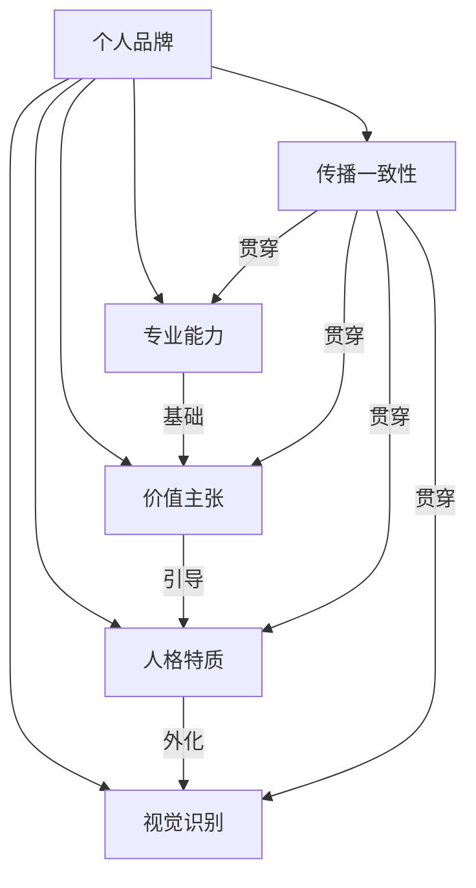

## 一、什么是个人品牌

在信息爆炸的时代，每个人都在被无数人"认识"——你的同事、客户、合作伙伴、社交媒体上的关注者，甚至从未谋面的陌生人，都在心中对你形成某种认知。这种认知，无论你是否有意经营，都已经构成了你的个人品牌。问题不在于你"有没有"个人品牌，而在于你的个人品牌是被你主动塑造的，还是被别人随意定义的。

本节将从定义、历史演进、心理学机制、构成要素、常见误区五个维度，为你建立对个人品牌的完整认知框架。

### 1.1 个人品牌的定义

#### 1.1.1 学术定义

个人品牌（Personal Branding）的概念最早由管理学家汤姆·彼得斯（Tom Peters）在1997年提出。他在《快公司》杂志（Fast Company）上发表了一篇题为"品牌化你自己"（The Brand Called You）的文章，开创性地指出：

> "无论你处于什么年龄、什么职位、从事什么行业，你都需要理解个人品牌的重要性。你是自己公司的CEO。"

此后，学者们从不同角度对个人品牌进行了界定。营销学者蒙托亚（Peter Montoya）在《个人品牌》一书中将其定义为"你的品牌所代表的一切——你所展现的技能、个性和价值的综合体"。传播学者谢尔（William Arruda）则强调个人品牌是"你的独特价值——你能提供而别人无法复制的东西"。

综合学术研究，个人品牌的准确定义是：

> 个人品牌是一个人在特定受众群体心智中所形成的独特认知、情感联想和价值判断的总和。它不仅包括你"做什么"，更包括你"是什么样的人"以及"能为别人带来什么价值"。

#### 1.1.2 通俗理解

简单来说，个人品牌就是——**你不在场时，别人如何描述你。**

如果同事在茶水间提到你的名字，他们会说什么？如果潜在客户搜索你的名字，他们会看到什么？如果行业会议上有人提起你，别人的第一反应是什么？这些"别人口中的你"，就是你的个人品牌。

更具体地说，个人品牌回答了三个核心问题：

| 问题 | 说明 | 示例 |
|------|------|------|
| **你是谁？** | 身份认知——你在别人心中的角色定位 | "他是做增长黑客的" |
| **你擅长什么？** | 能力认知——你被信赖解决什么问题 | "用户增长的事找他准没错" |
| **你值得信赖吗？** | 信任认知——别人是否愿意把机会交给你 | "上次他帮我们三个月拉新翻倍了" |

当这三个问题都有清晰、正向的答案时，你的个人品牌就是健康的。

#### 1.1.3 个人品牌≠自我包装

一个常见的误解是把个人品牌等同于"包装自己"或"打造人设"。这两者有本质区别：

| 维度 | 个人品牌 | 自我包装/人设 |
|------|----------|---------------|
| 基础 | 真实能力与价值 | 表面形象与话术 |
| 持续性 | 长期稳定，越积累越强 | 随时可能崩塌 |
| 信任度 | 建立在可验证的交付上 | 建立在信息不对称上 |
| 危机承受力 | 强——有实质支撑 | 弱——一戳就破 |
| 最终结果 | 可持续的信任资产 | 短期流量，长期负债 |

**个人品牌的本质是"让真实价值被正确感知"，而不是"把不存在的价值伪装成存在"。** 如果你试图建立一个超出自身能力的品牌形象，最终的结果不是"成功"，而是"人设崩塌"——第四节的实战案例会详细讨论这一点。

### 1.2 个人品牌的历史演进

个人品牌并非互联网时代的产物。理解它的演进历史，有助于你把握其本质规律。

#### 1.2.1 前工业时代：口碑即品牌

在工业革命之前，社会以小规模社群为主。一个人的"品牌"就是他的口碑。铁匠张三打的刀好不好，木匠李四做的家具结不结实，靠的是口口相传。这个时代的个人品牌有三个特点：

- **地域局限**：口碑传播范围有限，通常不出一个村镇
- **能力导向**：品牌几乎完全建立在手艺/技能之上
- **自然形成**：没有人刻意"经营"品牌，它是能力的自然映射

#### 1.2.2 工业时代：组织身份替代个人品牌

工业革命后，大规模组织兴起。个人被嵌入企业、机构、工厂的体系中，个人品牌被组织品牌所覆盖。你是"IBM的工程师"、"宝洁的市场经理"、"协和医院的外科主任"。组织身份成为个人的主要标签。

这个时代的特点是：

- **个人品牌被组织吸收**：你的价值很大程度上由所在组织背书
- **职业头衔=品牌**：职位高低决定社会认知
- **流动性低**：一个人可能在同一家公司干一辈子，品牌建设需求不强

#### 1.2.3 信息时代：个人品牌的觉醒

1997年汤姆·彼得斯提出"Brand You"概念，标志着个人品牌意识的正式觉醒。互联网的普及让每个人都有了面向公众表达的渠道。博客时代（2000年代）让普通人也能建立影响力。

关键转折点：

| 时间 | 事件 | 影响 |
|------|------|------|
| 1997 | Tom Peters 发表"The Brand Called You" | 个人品牌概念诞生 |
| 2003 | LinkedIn 上线 | 职业身份数字化 |
| 2004 | Facebook 上线 | 社交身份全面线上化 |
| 2006 | Twitter 上线 | 个人表达碎片化、即时化 |
| 2010s | 自媒体/知识付费兴起 | 个人品牌直接变现 |
| 2020s | 短视频/直播/AI时代 | 个人品牌多模态化、算法驱动 |

#### 1.2.4 当代：个人品牌成为核心竞争力

在今天的零工经济、远程办公、AI替代浪潮中，个人品牌已经成为一个人最核心的不可替代资产。原因有三：

1. **组织忠诚度下降**：人们平均每3-5年换一次工作，组织品牌不再能长期庇护个人
2. **信息透明度提升**：任何人都能在网上搜到你的背景、作品、评价
3. **AI对技能的替代**：当AI能完成越来越多的"技术活"，人际信任、独特视角、个人魅力这些品牌要素变得更加不可替代

### 1.3 个人品牌的心理学机制

个人品牌不是一个营销概念——它根植于人类认知和社交的底层机制。理解这些机制，你才能真正明白为什么个人品牌"有用"，以及它"如何起作用"。

#### 1.3.1 认知捷径：大脑的品牌化处理

人类大脑每天要处理海量信息。为了节省认知资源，大脑会自动使用"认知捷径"（Cognitive Heuristics）来简化决策。个人品牌就是一种认知捷径——当人们听到你的名字，大脑会自动调取已有的认知标签，而不是从零开始评估你。

心理学家丹尼尔·卡尼曼在《思考，快与慢》中描述的"系统1思维"（快速、直觉、自动化）正是个人品牌运作的心理基础。一个好的个人品牌，就是让你在别人的"系统1"中占据有利位置——他们不需要深入分析就能对你形成正向判断。

**实际影响**：这意味着你不需要每次都证明自己。一旦品牌建立，别人会自动假设你有能力、值得信任。这就是为什么同样水平的两个人，有品牌的那个总是更容易获得机会。

#### 1.3.2 首因效应与近因效应

心理学中的"首因效应"（Primacy Effect）指出，人们对你的第一印象会深刻影响后续所有判断。而"近因效应"（Recency Effect）则说明最近的印象权重最高。

对个人品牌的启示：

- **首因效应**：你给别人的第一次印象至关重要——第一次见面、第一篇文章、第一次合作，都在建立品牌的"锚点"
- **近因效应**：品牌不是一劳永逸的——最近的表现会覆盖旧有认知。一次严重的失误可能毁掉多年积累

#### 1.3.3 社会认同理论

罗伯特·恰尔迪尼（Robert Cialdini）在《影响力》中提出的"社会认同"（Social Proof）原理指出：人们倾向于参考他人的行为来做决策。在个人品牌领域，这意味着：

- 当别人看到"很多人都信任张三"，他们也会倾向于信任张三
- 客户见证、推荐信、粉丝数量、媒体报道——这些都是社会认同的具体体现
- 个人品牌的建设在很大程度上就是积累和展示社会认同的过程

#### 1.3.4 光环效应

爱德华·桑代克（Edward Thorndike）在1920年提出的"光环效应"（Halo Effect）指出：人们对一个人某方面的正面评价会自动泛化到其他方面。比如，如果你被认为"非常专业"，别人也会倾向于认为你"可靠"、"有远见"、"值得合作"——即使他们并没有在这些方面直接验证过。

**这就是为什么个人品牌要有一个清晰的"锚点优势"**——你需要先在一个维度上建立极强的认知，然后光环效应会帮你把这种信任扩展到其他维度。

### 1.4 个人品牌与企业品牌的异同

个人品牌和企业品牌在底层逻辑上有共通之处，但在运作方式上有显著差异。

| 维度 | 个人品牌 | 企业品牌 |
|------|----------|----------|
| 载体 | 活生生的人 | 组织/产品 |
| 核心资产 | 信任、专业能力、人格魅力 | 产品质量、服务体系、企业文化 |
| 建设周期 | 渐进式、终身性 | 阶段性、可加速 |
| 危机特征 | 人格化危机，影响直接 | 组织化危机，可隔离 |
| 灵活性 | 高度灵活，可快速调整 | 较为刚性，调整成本高 |
| 可复制性 | 不可复制，独一无二 | 可标准化、可复制 |
| 情感连接 | 天然具有情感深度 | 需要刻意构建 |
| 传播方式 | 以人格化内容为主 | 以品牌叙事为主 |

两者最本质的区别在于：**企业品牌可以更换代言人、调整产品线，但个人品牌与你的生命完全绑定。** 这意味着个人品牌的建设既是机遇也是风险——你就是品牌本身，你的一言一行都在塑造或破坏品牌。

另一个关键区别是**情感连接的深度**。企业品牌需要花费巨资来"人格化"自己（比如品牌吉祥物、创始人故事），而个人品牌天然具有人格属性。人们更容易对一个真实的人产生情感共鸣，而不是对一个Logo。这是个人品牌相比企业品牌的天然优势。

### 1.5 个人品牌的五大构成要素

一个完整的个人品牌由五个核心要素构成，它们相互支撑、缺一不可。

#### 1.5.1 专业能力（Competence）

你在特定领域所展现的专业知识和技能。这是品牌的"硬核"，是其他所有要素的基础。没有专业能力支撑的个人品牌，如同建在沙滩上的城堡。

专业能力的层次：

| 层次 | 描述 | 品牌效果 |
|------|------|----------|
| 入门级 | 能完成基本任务 | 无品牌价值 |
| 熟练级 | 能独立解决常见问题 | 基础品牌——"靠谱的执行者" |
| 专家级 | 能处理复杂/非常规问题 | 强品牌——"领域权威" |
| 大师级 | 能创造新方法/新范式 | 顶级品牌——"行业标杆" |

**关键点**：专业能力不是静态的。在快速变化的时代，持续学习和更新能力本身就是品牌的一部分。一个五年前的技术专家如果停止学习，今天的品牌价值可能已经归零。

#### 1.5.2 价值主张（Value Proposition）

你能为目标受众解决什么问题、带来什么价值。价值主张需要清晰、具体、有差异化。"我能帮你解决什么问题"比"我是做什么的"更有力量。

一个好的价值主张包含三个要素：

1. **目标受众**：你为谁服务？（越具体越好）
2. **核心问题**：你解决什么问题？（越痛越好）
3. **独特方法**：你为什么能解决？（差异化）

示例对比：

| 做法 | 示例 | 效果 |
|------|------|------|
| ❌ 模糊 | "我是一名营销顾问" | 无法形成认知 |
| ⚠️ 一般 | "我帮企业做数字营销" | 略好，但太泛 |
| ✅ 精准 | "我帮B2B SaaS企业通过内容营销获取精准线索，平均降低获客成本40%" | 清晰、具体、有数据 |

#### 1.5.3 人格特质（Personality）

你的沟通风格、行为模式和情感表达方式。人格特质决定了受众与你的情感连接深度。人们选择信任一个人，往往不只是因为能力，更是因为"感觉对了"。

人格特质不意味着你要"表演"某种性格。它指的是你真实性格中最具辨识度的部分，并且这个部分与你的目标受众产生共鸣。

常见的人格特质品牌化方向：

- **理性分析型**：数据驱动、逻辑清晰、客观中立（如：查理·芒格）
- **热情感染型**：充满能量、善于激励、富有感染力（如：乔布斯）
- **务实落地型**：接地气、注重结果、不玩虚的（如：很多一线技术博主）
- **深度思考型**：善于洞察、观点独特、引发思考（如：万维钢）
- **温暖陪伴型**：共情力强、善于倾听、让人感到安全（如：很多心理咨询师）

你不需要成为所有类型。选择最真实的那个，然后把它放大。

#### 1.5.4 视觉识别（Visual Identity）

你的形象、穿着、设计风格、色彩搭配等视觉元素。在视觉化传播时代，第一印象往往由视觉决定。

视觉识别包含的维度：

| 维度 | 线上场景 | 线下场景 |
|------|----------|----------|
| 个人形象 | 头像、视频中的穿着打扮 | 面对面的着装、仪态 |
| 内容风格 | 排版、配色、字体、封面设计 | PPT、名片、物料 |
| 空间环境 | 直播/视频背景 | 办公室、会面场所 |
| 符号系统 | Logo、签名、标志性元素 | 个人标识 |

**实际建议**：视觉识别不需要多精美，但必须一致。如果你在所有平台用同一张专业头像、同一套配色方案、同一种排版风格，人们就能在海量信息中一眼认出你。一致性比美观更重要。

#### 1.5.5 传播一致性（Consistency）

你在不同场景、不同平台上表现出的一致性。一致性是信任的基础——如果你今天说东、明天说西，人们无法形成稳定的认知。

传播一致性体现在三个层面：

1. **内容一致性**：你传递的核心观点、价值主张是否始终如一
2. **风格一致性**：你的表达方式、视觉风格是否跨平台统一
3. **行为一致性**：你的线上形象和线下表现是否一致

**最大的品牌杀手不是"做得不好"，而是"前后矛盾"。** 一个在公众号上倡导"极简生活"的人被拍到奢侈消费，比一个从未谈论极简生活的人更受损——因为他打破了受众的认知预期。

### 1.6 个人品牌的运作模型

理解了构成要素之后，我们需要理解这些要素是如何协同运作的。下面这个模型展示了个人品牌从内到外的完整运作逻辑。

**第一层：内在价值——品牌的地基**

你的真实能力、经验积累、独特洞见。这是品牌的"原材料"，没有它，一切包装都是空中楼阁。

**第二层：品牌定位——价值的提炼**

把内在价值提炼成一个清晰的、有差异化的定位。这是"翻译"的过程——把你懂的东西翻译成受众能理解、能记住的语言。

**第三层：内容输出——价值的外化**

通过文章、演讲、视频、项目成果等方式把你的价值"显性化"。隐藏在脑子里的能力不是品牌——被看到、被验证的能力才是。

**第四层：受众认知——心智的占位**

你的内容在目标受众心中形成特定的认知标签。这个过程需要时间和重复——一次曝光不够，需要持续、一致的输出。

**第五层：口碑传播——品牌的自增长**

当受众对你的认知足够强时，他们会主动向别人推荐你、引用你、背书你。这是品牌最强大的增长引擎——别人替你传播，比你自己说一万遍都有效。

### 1.7 个人品牌的常见误区

在开始建设个人品牌之前，你需要先避开这些常见的坑。

#### 误区一："个人品牌就是社交媒体上的粉丝数"

**真相**：粉丝数是品牌的一个指标，但远非全部。一个有10万粉丝但没有变现能力的人，品牌价值可能不如有1000个精准人脉的行业专家。个人品牌的核心是"在对的人心中占据对的位置"，而不是"让尽可能多的人知道你"。

#### 误区二："我没有特别突出的能力，不配谈个人品牌"

**真相**：个人品牌不需要你是"世界第一"。你只需要在你的目标受众面前，比他们更懂某个领域。一个三线城市的资深会计，在本地中小企业主群体中，就是一个极具价值的个人品牌。品牌的参照系不是全世界，而是你的目标圈层。

#### 误区三："个人品牌一旦建立就不用管了"

**真相**：个人品牌是"活的"，需要持续维护和更新。行业在变、受众在变、你自己也在变。一个三年前建立的品牌定位，今天可能已经过时。品牌维护的核心动作包括：定期输出内容、主动管理公众认知、及时调整定位。

#### 误区四："打造个人品牌就是吹牛/炒作"

**真相**：炒作是短期注意力收割，品牌是长期信任积累。炒作的结果是"高知名度+低信任度"，品牌的结果是"高知名度+高信任度"。一个靠炒作出名的人，机会来了也接不住，因为没人真的信任他。

#### 误区五："我不需要个人品牌，我靠实力说话"

**真相**：在信息过载的时代，"实力不被看到"等于"没有实力"。你可能真的是团队里最厉害的人，但如果决策者不知道你、不了解你，机会就会给那个"实力一般但被看到"的人。**品牌不是实力的替代品，而是实力的放大器。** 你有100分的能力，好的品牌能让别人看到你的100分；没有品牌，别人可能只看到60分。

#### 误区六："个人品牌就是要迎合别人"

**真相**：个人品牌不是讨好所有人。恰恰相反，最有力量的个人品牌是"敢于有态度"的。当你试图取悦所有人时，你在每个人心中都是模糊的。清晰的定位必然意味着对某些人"不适用"——这不是缺陷，这是聚焦。一个让所有人觉得"还行"的品牌，不如一个让目标群体觉得"这就是我要找的人"的品牌。

### 1.8 自我诊断：你的个人品牌现状

在系统学习个人品牌建设方法之前，先用下面这个框架评估你当前的状态。

#### 1.8.1 五维自评表

请对每个维度打分（1-5分），诚实评估自己：

| 维度 | 1分（起步） | 3分（发展） | 5分（成熟） | 你的评分 |
|------|------------|------------|------------|----------|
| 专业能力 | 刚入门，需要指导 | 能独立完成工作 | 行业公认专家 | ___ |
| 价值主张 | 说不清自己能做什么 | 能简单描述 | 一句话让人记住 | ___ |
| 人格特质 | 没有鲜明特点 | 有风格但不突出 | 人格高度辨识 | ___ |
| 视觉识别 | 无统一形象 | 有基本形象管理 | 全平台视觉一致 | ___ |
| 传播一致性 | 随意发布内容 | 有基本规划 | 高度一致的品牌表达 | ___ |

**评分解读**：
- **5-10分**：品牌萌芽期——你有潜力，但尚未开始系统建设
- **11-18分**：品牌成长期——已有基础，需要强化薄弱环节
- **19-25分**：品牌成熟期——体系完整，需要持续精进

#### 1.8.2 关键问题清单

回答以下问题，如果多数答案是"否"，说明你的个人品牌还有很大的建设空间：

1. 你能否在30秒内清晰地告诉别人你是谁、你做什么、你有什么独特价值？
2. 你的同事/同行是否会主动向别人推荐你？他们推荐时会怎么说？
3. 如果有人在网上搜索你的名字，前三页的结果是否反映了你希望呈现的形象？
4. 你是否有固定的内容输出渠道（公众号、博客、社交媒体、演讲等）？
5. 你的目标受众是否能在不看名字的情况下，仅凭内容风格就认出是你？
6. 你最近一次有意识地管理自己的公众形象是什么时候？

### 1.9 小结

个人品牌不是一个可有可无的"加分项"，而是现代职业人的一项核心能力。让我们回顾本节的关键认知：

1. **个人品牌是客观存在的**——无论你是否主动经营，别人对你都有认知。主动塑造比被动接受好一万倍。
2. **品牌的核心是真实价值**——不是包装，不是炒作，而是"让真实能力被正确感知"。
3. **品牌根植于人类认知机制**——认知捷径、首因效应、社会认同、光环效应，这些心理学原理决定了品牌为什么有效。
4. **品牌由五大要素构成**——专业能力、价值主张、人格特质、视觉识别、传播一致性，缺一不可。
5. **品牌是活的**——它需要持续维护、定期更新、主动管理。

带着这些认知，下一节我们将进入个人品牌的具体定位方法——如何找到你在目标受众心中独一无二的位置。
