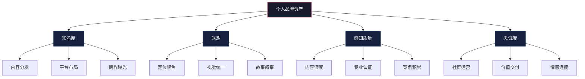
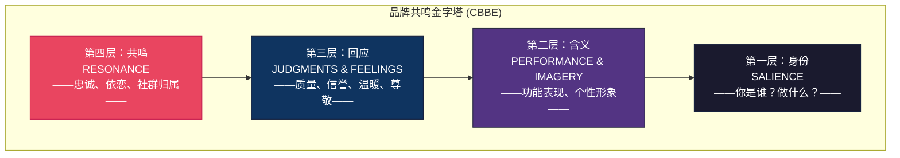
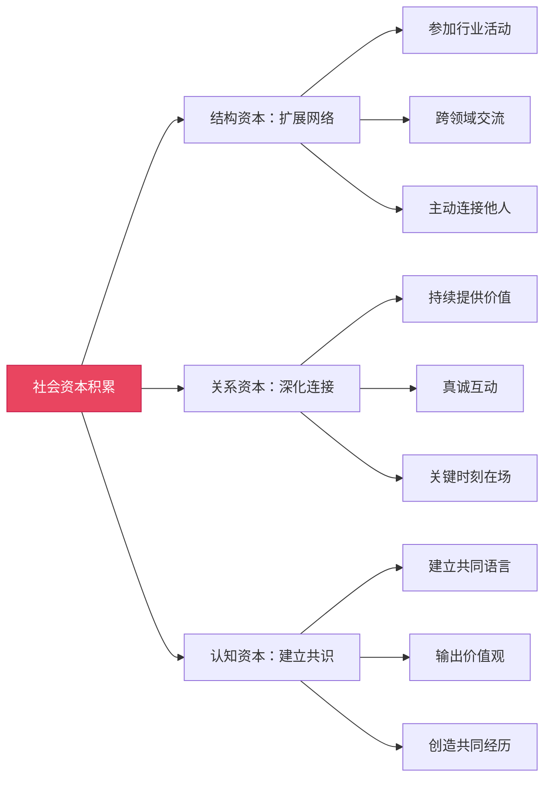

## 二、个人品牌的理论模型

个人品牌并非"包装"或"炒作"的产物——它有扎实的理论根基。本节将系统梳理支撑个人品牌建设的核心理论模型，从品牌管理学、认知心理学、社会学到传播学，构建一个完整的理论框架。理解这些模型不仅能帮你"知其然"，更能"知其所以然"：当你知道某个策略为什么有效时，你才能灵活变通、因地制宜。

### 2.1 品牌资产模型（Brand Equity Model）

#### 2.1.1 阿克品牌资产四维度

大卫·阿克（David Aaker）在《管理品牌资产》（*Managing Brand Equity*, 1991）中提出的品牌资产模型，是品牌管理领域最具影响力的理论框架之一。这一模型最初用于企业品牌，但其四个维度可以完美迁移到个人品牌领域：

**品牌知名度（Brand Awareness）**

品牌知名度衡量的是目标受众对你的认知程度。通俗地说：你是否被"看见"？当别人提到某个领域时，你的名字是否会出现在他们的脑海中？

品牌知名度分为四个递进层次：

| 层次 | 定义 | 个人品牌示例 |
|------|------|-------------|
| 无知名度 | 完全不被认知 | 刚注册社交账号，零关注 |
| 辅助知名度 | 提示后能想起来 | "你说的是那个做Python教程的？对对对" |
| 无辅助知名度 | 无需提示就能想起 | "说到数据分析，我第一个想到老王" |
| 品牌主导 | 成为品类代名词 | "GTD方法"→ David Allen |

提升知名度的核心方法不是"刷屏"，而是在目标受众高频出现的场景中，以一致的形象反复出现。心理学中的"纯粹曝光效应"（Mere Exposure Effect）表明：人们会对反复出现的事物产生偏好——前提是这种出现不引发反感。

**品牌联想（Brand Associations）**

品牌联想是受众提到你时脑海中浮现的关键词、画面和情感。这些联想构成了你的"心智地图"。

品牌联想可以分为三类：

- **属性联想**：你是什么样的人？（"技术大牛"、"亲和力强"、"言出必行"）
- **利益联想**：关注你能获得什么？（"学到实用技能"、"获得行业洞察"、"找到合作机会"）
- **情感联想**：想到你时有什么感受？（"信任"、"敬佩"、"亲切"、"焦虑"）

品牌联想管理的关键原则：

1. **聚焦原则**：联想越集中，品牌越强。一个人同时是"AI专家""健身达人""美食博主""理财顾问"，等于什么都不是。
2. **一致性原则**：不同渠道、不同时间传递的联想必须一致。如果LinkedIn上你是"严谨的工程师"，抖音上你是"搞笑段子手"，受众会感到困惑。
3. **差异化原则**：联想越独特，记忆越深刻。"又一个Python教程作者"远不如"用漫画讲Python的那个"有辨识度。

**感知质量（Perceived Quality）**

感知质量是受众对你专业能力和服务质量的**主观评价**。注意关键词——"主观"。这意味着两个重要推论：

第一，感知质量不等于实际质量。一个技术平庸但表达能力极强的人，可能比技术顶尖但不善表达的人拥有更高的感知质量。这不是说要"以次充好"，而是说你需要让自己的真实能力被正确地"感知"到。

第二，感知质量是可以被系统性管理的。以下因素会显著影响受众的感知质量判断：

| 影响因素 | 正面信号 | 负面信号 |
|---------|---------|---------|
| 内容深度 | 引用原始论文、给出数据来源 | 只列观点不给论据 |
| 响应速度 | 24小时内回复 | 常年不回复评论 |
| 呈现质量 | 排版清晰、配图专业 | 错别字连篇、格式混乱 |
| 社会背书 | 知名企业/专家认可 | 无任何第三方验证 |
| 持续性 | 稳定输出多年 | 三天打鱼两天晒网 |

**品牌忠诚度（Brand Loyalty）**

品牌忠诚度衡量的是受众持续关注、互动和推荐你的程度。在个人品牌语境下，忠诚度表现为：

- **行为忠诚**：持续关注你的内容，主动参与互动（评论、转发、点赞）
- **态度忠诚**：内心认同你的价值观和专业判断，即使你偶尔犯错也愿意给予宽容
- **推荐忠诚**：主动向他人推荐你——这是最高层次的忠诚，相当于免费的口碑营销

忠诚度的建设是一个长期过程，核心驱动力是"持续交付超出预期的价值"。每次你的内容或服务超出受众预期，忠诚度就累积一点；每次低于预期，忠诚度就消耗一点。

#### 2.1.2 阿克模型的个人品牌应用框架

将阿克模型应用到个人品牌建设中，可以得到一个清晰的行动框架：

### 2.2 定位理论与心智占位

#### 2.2.1 定位理论的核心思想

杰克·特劳特（Jack Trout）和艾·里斯（Al Ries）在1969年提出定位理论，1981年出版《定位：争夺用户心智的战争》（*Positioning: The Battle for Your Mind*），彻底改变了营销思维。

定位理论的核心观点是：

> **品牌战不是产品之战，而是认知之战。** 你不需要成为"最好的"，你需要成为"在特定人心中占据独特位置的"。

这一观点对个人品牌的意义极为深远。在信息爆炸的时代，人们的心智容量极为有限——心理学研究表明，普通人在一个品类中只能记住不超过7个品牌（米勒定律：7±2）。如果你不能在某个细分领域成为前7名，你基本上就不存在。

#### 2.2.2 个人品牌定位的三个层次

定位理论在个人品牌中的应用包含三个递进层次：

**第一层：品类定位——你是"哪一类"人？**

品类定位是最基础的一步：你必须让人们知道你是做什么的。品类越清晰，心智占位越容易。

常见错误：品类模糊。"我是做互联网的"——互联网有几千万从业者，这个品类太大了，无法形成有效定位。"我是做B2B SaaS内容营销的"——品类清晰，目标受众能立刻判断你是否与自己相关。

**品类选择的原则：**

1. **够大**：品类不能太窄，否则目标受众太少，商业价值有限
2. **够小**：品类不能太大，否则竞争太激烈，难以突围
3. **有增长**：品类最好处于上升期，这样你的品牌会随品类一起增长
4. **与能力匹配**：品类必须是你真正有能力交付价值的领域

**第二层：差异化定位——你与同类人的区别是什么？**

在同一个品类中，可能有成百上千的从业者。你必须回答："为什么选你而不是别人？"

差异化的五种经典策略：

| 策略 | 说明 | 示例 |
|------|------|------|
| 某方面最强 | 在某个具体指标上做到极致 | "全网阅读量最高的技术博主" |
| 独特方法论 | 发明或推广一种新方法 | GTD方法的David Allen |
| 特定人群 | 专注服务某个细分群体 | "专门帮创业者做品牌" |
| 独特背景 | 利用独特的经历或身份 | "前Google工程师教你编程" |
| 反传统 | 与主流观点对立 | "反对996的管理专家" |

**第三层：心智占位——你是否是"第一个被想到的人"？**

心智占位是定位的终极目标：当人们想到某个特定问题时，你的名字自动浮现。

心智占位的关键机制是"品类=品牌"的等式。经典案例：

- 提到"个人效率管理" → David Allen（GTD方法创始人）
- 提到"演讲与领导力" → Simon Sinek（"从为什么开始"）
- 提到"深度工作" → Cal Newport（《深度工作》作者）
- 提到"增长黑客" → Sean Ellis（提出概念的人）

心智占位一旦建立，就具有极强的"先发优势"。后来者需要付出数倍的努力才能撼动先行者的位置——这就是为什么尽早建立清晰定位如此重要。

#### 2.2.3 定位的常见陷阱

**陷阱一：定位漂移**。今天讲技术，明天讲管理，后天讲养生。频繁切换赛道会让受众困惑，每次切换都意味着之前积累的心智资产被清零。

**陷阱二：定位过窄**。"我是用Python 3.11做异步爬虫的"——这个定位太窄了，目标受众可能只有几百人，而且技术迭代后定位就会过时。

**陷阱三：定位与能力脱节**。定位为"AI专家"但连基本的机器学习概念都解释不清，一旦被质疑就会导致品牌崩塌。

**陷阱四：跟随定位**。别人做什么火就做什么，永远是"第二个XXX"，无法建立独立的心智占位。

### 2.3 认知心理学基础

个人品牌的本质是管理他人对你的认知。理解认知心理学的基本原理，有助于更科学、更有效地建设个人品牌。以下是与个人品牌最相关的六个认知效应。

#### 2.3.1 首因效应（Primacy Effect）

首因效应是指人们对最先接收到的信息印象最深。1946年，心理学家所罗门·阿希（Solomon Asch）的经典实验证明：同样的特质列表，排列顺序不同会导致截然不同的印象评价。

对个人品牌的启示：**第一印象至关重要**。这包括：

- **线上第一印象**：社交平台的头像、用户名、简介、置顶内容。研究表明，用户在访问一个新账号时，平均只花3-7秒就决定是否关注。
- **线下第一印象**：着装、握手、开场白、名片设计。在商务场景中，人们在见面的前7秒内就形成了对你的基本判断。
- **内容第一印象**：文章的标题和前100字决定了读者是否继续阅读。视频的前15秒决定了观众是否划走。

**实操建议**：投入足够的时间和精力打造你的"第一接触点"。请专业人士拍摄一张得体的头像，反复打磨你的个人简介（一句话版本和详细版本各准备一份），设计一个有记忆点的开场白。

#### 2.3.2 近因效应（Recency Effect）

近因效应是指人们对最近接收到的信息记忆最深。在序列信息中，最后呈现的内容往往被记得最好。

对个人品牌的启示：**你需要持续保持曝光**。即使你曾经建立了很强的品牌，如果长期不出现，受众的记忆会逐渐被新信息覆盖。

近因效应也解释了为什么"最后一公里"如此重要：

- 内容的结尾比开头更容易被记住——所以要在结尾留下最有力的观点
- 每次互动的收尾决定了对方对这次互动的整体印象
- 离开一个社群或平台时的"告别方式"会长期影响人们对你最后的印象

#### 2.3.3 光环效应（Halo Effect）

光环效应是指人们对某一方面的正面评价会"溢出"到其他方面。1920年，心理学家爱德华·桑代克（Edward Thorndike）首次提出这一概念。

在个人品牌中，光环效应的表现尤为明显：

- 一位在技术领域建立了极强口碑的人，即使跨界谈管理、谈投资，也会被默认为"有见地"
- 一位外形出众的演讲者，其内容的专业性往往被高估
- 一位被知名企业聘用过的人，其个人能力会被自动赋予更高评价

**正面利用光环效应的策略**：

1. **选择一个突破点**：不需要所有方面都做到极致，先在一个细分领域建立压倒性优势
2. **借势背书**：获得知名机构、专家的认可，让光环从他们身上"溢出"到你身上
3. **创造标志性成就**：一个足够亮眼的成就可以照亮你品牌的方方面面

**光环效应的暗面**：如果某一方面出现严重负面评价，这种负面也会溢出到其他方面。一次学术造假会让人怀疑你所有的研究成果；一次人设崩塌会让你过去的所有正面内容都被重新审视。

#### 2.3.4 社会认同（Social Proof）

罗伯特·西奥迪尼（Robert Cialdini）在《影响力》（*Influence*, 1984）中将"社会认同"列为六大影响力原则之一。其核心观点是：当人们不确定该怎么做时，会参考他人的行为来做判断。

在个人品牌建设中，社会认同的表现形式包括：

| 社会认同类型 | 表现形式 | 影响力强度 |
|-------------|---------|-----------|
| 数字背书 | 粉丝数、阅读量、点赞数 | ★★★ |
| 名人背书 | 知名人物的推荐或互动 | ★★★★★ |
| 同行认可 | 同领域专家的引用或推荐 | ★★★★ |
| 用户证言 | 受众的感谢、反馈、案例 | ★★★★ |
| 媒体报道 | 权威媒体的采访或报道 | ★★★★★ |
| 机构认证 | 行业协会、知名企业的合作 | ★★★★ |

**关键原则**：社会认同必须是真实的。伪造数据、购买粉丝、编造案例，一旦被揭穿，对品牌的伤害远大于收益——因为在信任崩塌之后，受众会用同样的"社会认同"逻辑来传播你的负面信息。

#### 2.3.5 确认偏误（Confirmation Bias）

确认偏误是指人们倾向于寻找、解释和记住能够证实自己已有信念的信息。1960年，彼得·沃森（Peter Wason）的"2-4-6任务"实验有力地证明了这一倾向。

对个人品牌的双重影响：

**正面影响**：一旦人们对你形成了正面印象，他们会不自觉地寻找支持这个印象的证据。你偶尔犯的小错会被忽略或合理化（"他可能是太忙了"），而你的每一次成功都会被放大（"果然厉害"）。

**负面影响**：一旦人们对你形成了负面印象，同样的确认偏误会让他们只关注你的负面行为。你做得好是"运气好"或"包装好"，做得差才是"真面目暴露"。

**实操启示**：

1. **第一次就要做对**：首因效应决定了初始印象，确认偏误会锁定这个印象。第一次合作、第一篇内容、第一次演讲——投入120%的努力确保成功。
2. **主动管理"标签"**：在受众形成对你印象之前，先主动传递你希望被记住的标签。
3. **危机时快速反应**：当负面信息出现时，必须在受众的确认偏误"锁定"负面印象之前进行澄清。

#### 2.3.6 峰终定律（Peak-End Rule）

诺贝尔经济学奖得主丹尼尔·卡尼曼（Daniel Kahneman）提出的峰终定律指出：人们对一段体验的评价，主要取决于两个时刻——**最高峰**（最强烈的体验）和**结尾**。

这一规律在个人品牌中的应用：

- **课程/演讲设计**：确保中间有一个"高光时刻"（震撼的数据、精彩的故事、意外的反转），并在结尾留下最深刻的印象。
- **客户合作**：即使过程平淡，只要在某个关键时刻创造了惊喜，并在结束时留下了美好记忆，整体评价就会很高。
- **内容创作**：与其追求每篇内容都"平均不错"，不如追求每篇都有一个"记忆点"，并在结尾给出有力的收束。

### 2.4 凯勒品牌共鸣金字塔（CBBE Model）

#### 2.4.1 模型概述

凯文·凯勒（Kevin Lane Keller）在《战略品牌管理》（*Strategic Brand Management*, 1998）中提出了基于顾客的品牌资产模型（Customer-Based Brand Equity, CBBE），也被称为"品牌共鸣金字塔"。这一模型比阿克模型更强调品牌与受众之间的关系深度，特别适合描述个人品牌的递进式建设过程。

金字塔从底层到顶层包含四个层次：

#### 2.4.2 四个层次的个人品牌解读

**第一层：品牌显著性（Brand Salience）——你是谁？**

这是金字塔的基础层，对应"品牌知名度"。核心问题是：受众是否知道你的存在？是否清楚你做什么？

个人品牌显著性的建设要素：

- **清晰的身份标签**：用一句话就能说清楚你是谁、做什么
- **高频率出现**：在目标受众聚集的渠道保持稳定的出现频率
- **多触点覆盖**：在多个平台上保持一致的形象和信息

**第二层：品牌含义（Brand Meaning）——你代表什么？**

这一层包含两个维度：

- **品牌表现（Performance）**：你实际能做什么？你的专业能力如何？你交付的内容/服务质量如何？
- **品牌形象（Imagery）**：你的个性、风格、价值观是什么？受众对你有什么情感联想？

在个人品牌中，"表现"和"形象"缺一不可。只有表现没有形象，你是"工具人"——有用但无趣；只有形象没有表现，你是"花瓶"——好看但无用。

**第三层：品牌回应（Brand Response）——人们怎么看你？**

人们对你的品牌产生两种判断：

- **理性判断**：你的专业质量如何？你是否值得信赖？你与其他同类人相比如何？
- **情感反应**：想到你时感到温暖还是距离感？敬佩还是嫉妒？亲近还是防备？

管理品牌回应的关键是理解：受众的判断不仅基于你做了什么，更基于你做这些事的方式。同样一篇技术文章，用谦逊分享的语气写和用居高临下的语气写，引发的情感反应截然不同。

**第四层：品牌共鸣（Brand Resonance）——你与受众的关系有多深？**

共鸣是金字塔的顶端，代表品牌与受众之间最深层次的关系。共鸣包含四个维度：

| 维度 | 定义 | 个人品牌表现 |
|------|------|-------------|
| 行为忠诚 | 持续关注和互动 | 每期必看、主动分享 |
| 态度依附 | 情感上的连接和归属感 | "这是我最喜欢的大V" |
| 社群归属 | 与其他受众形成社群 | 粉丝自发建群讨论 |
| 主动参与 | 深度介入品牌共建 | 为你创作同人内容、翻译作品 |

达到共鸣层次的个人品牌拥有极强的抗风险能力——即使偶尔犯错，忠诚受众也会主动为你说好话、帮你解释。

### 2.5 戈夫曼的自我呈现理论

#### 2.5.1 戏剧理论框架

社会学家欧文·戈夫曼（Erving Goffman）在《日常生活中的自我呈现》（*The Presentation of Self in Everyday Life*, 1959）中提出"戏剧理论"（Dramaturgical Theory），将社会互动比喻为舞台表演：

- **前台（Front Stage）**：你在公开场合展示的形象——社交平台上的内容、公开演讲时的表现、职场中的专业形象
- **后台（Back Stage）**：你在私下的真实状态——朋友圈里的吐槽、与亲密朋友的交谈、独处时的行为
- **印象管理（Impression Management）**：有意识地控制自己在前台的表现，以影响他人对自己的认知

#### 2.5.2 戏剧理论在个人品牌中的应用

戈夫曼的理论揭示了个人品牌建设的一个核心张力：**真实性与策略性的平衡**。

**前台管理**：个人品牌的大部分工作发生在"前台"——你选择展示什么、如何展示、什么时候展示。有效的前台管理包括：

1. **选择性展示**：不是所有事情都值得公开。选择与品牌定位一致的内容进行展示。
2. **表演连贯性**：每次"出场"都要与之前建立的形象一致。频繁的角色切换会让观众困惑。
3. **道具管理**：衣着、工具、工作环境都是"道具"，它们传递着关于你的信息。

**后台管理**：在社交媒体时代，前后台的边界变得模糊。一次"后台"的失言被截图传播，就可能摧毁你精心构建的"前台"形象。

**过度表演的风险**：如果前台形象与真实自我差距太大，你会陷入"表演疲劳"——维持人设的精力消耗会越来越大，而一旦某次表演出现破绽，整个品牌形象就会崩塌。正如第四章将讨论的"完美人设崩塌"案例所示。

**最佳实践：80/20真实性原则**

将你真实自我的80%融入品牌，保留20%作为私密空间。这80%必须是真实的——不是"表演"出来的亲和力，而是你确实具备的品质。这样你既能保持品牌的一致性，又不会陷入表演疲劳。

### 2.6 信号理论（Signaling Theory）

#### 2.6.1 理论基础

信号理论由经济学家迈克尔·斯宾塞（Michael Spence）在1973年提出，最初用于解释劳动力市场中的信息不对称问题——雇主无法直接观察求职者的真实能力，只能通过"信号"（如学历、证书、工作经历）来推断。

这一理论完美适用于个人品牌建设。在信息不对称的环境中——受众无法直接验证你的所有能力——他们只能通过你发出的"信号"来判断你的价值。

#### 2.6.2 个人品牌中的信号类型

| 信号类型 | 具体形式 | 可信度 | 获取难度 |
|---------|---------|--------|---------|
| 教育背景 | 学历、名校、专业 | ★★★★ | 高 |
| 职业经历 | 知名企业、核心岗位 | ★★★★★ | 高 |
| 专业认证 | 行业认证、资格证书 | ★★★★ | 中 |
| 内容输出 | 文章、书籍、课程 | ★★★★ | 中 |
| 社会背书 | 名人推荐、媒体报道 | ★★★★★ | 高 |
| 成果展示 | 项目案例、数据指标 | ★★★★★ | 高 |
| 社群地位 | 行业协会职务、社群角色 | ★★★ | 中 |
| 外在线索 | 着装、谈吐、环境 | ★★ | 低 |

#### 2.6.3 有效信号的三个条件

并非所有信号都有效。根据信号理论，一个信号要能有效传递信息，必须满足三个条件：

1. **可观察性**：受众必须能看到这个信号。你有很强的能力但从未展示，等于没有信号。
2. **成本性**：信号必须有一定的获取成本，否则人人都能发出，就失去了区分度。这就是为什么"花钱买的证书"不如"花三年考的证书"有说服力。
3. **相关性**：信号必须与你想要传递的信息相关。一个烹饪比赛的奖牌对你的程序员品牌没有帮助。

**实操建议：构建信号矩阵**

不要只依赖单一类型的信号。构建一个包含多种信号类型的矩阵，让受众从多个维度都能接收到"这个人很专业"的信息。例如：名校学历（教育信号）+ 大厂工作经历（职业信号）+ 出版的技术书籍（内容信号）+ 行业大会演讲（社会背书信号）。

### 2.7 社会资本理论

#### 2.7.1 社会资本与个人品牌的关系

社会学家皮埃尔·布尔迪厄（Pierre Bourdieu）和罗伯特·帕特南（Robert Putnam）的社会资本理论指出：社会关系本身就是一种"资本"，可以被积累、投资和变现。

个人品牌本质上就是一种社会资本的外在表现。你的品牌强度取决于你拥有的三种社会资本：

**结构社会资本（Structural Social Capital）**

你的人际网络结构——你认识谁、你处于网络的什么位置。在社交网络中，处于"结构洞"（Structural Holes，由社会学家罗纳德·伯特提出）位置的人——即连接不同圈子的桥梁——拥有最大的信息优势和影响力。

**关系社会资本（Relational Social Capital）**

你与他人关系的质量——信任程度、互惠历史、情感深度。强关系（close ties）提供深度支持和信任，弱关系（weak ties，由马克·格兰诺维特提出）提供新信息和跨界机会。

**认知社会资本（Cognitive Social Capital）**

你与他人共享的语言、叙事和价值观。当受众与你拥有共同的世界观和话语体系时，沟通成本最低，共鸣最强。

#### 2.7.2 社会资本的积累策略

### 2.8 叙事身份理论（Narrative Identity Theory）

#### 2.8.1 故事为什么重要

心理学家丹·麦克亚当斯（Dan McAdams）提出的叙事身份理论认为：人们通过讲述自己的故事来构建自我认同。个人品牌同样需要一个引人入胜的故事——它不是"编造"的经历，而是对真实经历的**有意识的叙事组织**。

人类大脑天生对故事有更强的记忆力和情感共鸣。斯坦福商学院的研究表明：故事被记住的概率是纯数据的22倍。一个有故事的个人品牌比一个只有"技能列表"的个人品牌更容易被记住、更容易产生情感连接。

#### 2.8.2 个人品牌故事的核心要素

一个有效的个人品牌故事通常包含以下要素：

1. **起源时刻（Origin Story）**：什么事件或经历让你走上了这条路？这为你的品牌提供了可信的"为什么"。
2. **挑战与克服（Challenge & Overcome）**：你遇到过什么困难？如何克服的？这让受众产生共情。
3. **转折点（Turning Point）**：什么关键决定或认知转变改变了你的方向？这让故事有戏剧性。
4. **使命（Mission）**：你现在在做什么？为什么？这为受众提供了跟随你的理由。
5. **愿景（Vision）**：你最终想实现什么？这让受众看到一个值得参与的未来。

#### 2.8.3 故事的真实性边界

叙事身份理论强调的不是"编造"故事，而是"组织"故事。你的经历是真实的，但你可以选择突出哪些部分、弱化哪些部分、以什么顺序呈现。

真实性边界的原则：

- **可以**：重新组织时间线以增强叙事效果；突出某些经历而省略其他经历；用更生动的语言描述真实事件
- **不可以**：捏造不存在的经历；夸大成就的程度；将自己的经历嫁接到他人身上

### 2.9 理论模型综合对照

以上七个理论模型从不同角度解释了个人品牌的运作机制。在实际应用中，它们不是孤立的，而是相互补充的：

| 理论模型 | 核心关注点 | 关键问题 | 最适用阶段 |
|---------|-----------|---------|-----------|
| 阿克品牌资产 | 品牌价值构成 | 我的品牌值多少？ | 全阶段 |
| 定位理论 | 心智占位 | 我在受众心中占什么位置？ | 建立期 |
| 认知心理学 | 认知规律 | 受众如何形成对我的印象？ | 全阶段 |
| 凯勒CBBE | 关系深度 | 受众与我的关系到了哪一层？ | 成长期 |
| 戈夫曼自我呈现 | 真实性管理 | 我该展示多少真实自我？ | 全阶段 |
| 信号理论 | 信息传递 | 如何证明我的能力？ | 建立期 |
| 社会资本理论 | 关系网络 | 我的社会资本如何积累？ | 扩展期 |
| 叙事身份理论 | 故事构建 | 我的故事是什么？ | 建立期 |

### 2.10 理论到实践的转化框架

理论的价值在于指导实践。将上述理论整合为一个可执行的框架：

**第一步：自我诊断（信号理论 + 社会资本理论）**

盘点你现有的"信号资产"和"社会资本"：你有哪些可以证明能力的信号？你处于社会网络的什么位置？你的弱关系和强关系分别有哪些？

**第二步：定位选择（定位理论）**

基于自我诊断结果，选择一个品类、设计差异化策略、明确心智占位目标。

**第三步：认知设计（认知心理学 + 戈夫曼理论）**

设计你在受众心中的"理想认知画像"——你希望他们对你有什么印象？哪些认知效应可以利用？前台形象与后台真实自我的平衡点在哪里？

**第四步：故事构建（叙事身份理论）**

将你的经历组织成一个引人入胜的品牌故事，包含起源、挑战、转折、使命和愿景。

**第五步：资产积累（阿克模型 + 凯勒金字塔）**

按照品牌资产的四个维度和共鸣金字塔的四个层次，系统性地积累品牌资产——从知名度到忠诚度，从身份识别到深度共鸣。

**第六步：持续迭代**

品牌建设不是一次性工程。定期回顾理论框架，诊断当前品牌状态，调整策略方向。

### 2.11 常见理论误用与纠正

**误用一：把定位理论理解为"找到一个没人做的领域"**

纠正：定位不是找蓝海，而是在人们心智中占据一个位置。即使竞争激烈，只要你能找到差异化的角度，就能建立有效定位。

**误用二：过度利用光环效应，忽视底层能力**

纠正：光环效应可以放大你的影响力，但不能替代真实能力。当光环与能力的差距过大时，任何质疑都可能导致光环瞬间消失。

**误用三：把社会认同等同于"买数据"**

纠正：虚假的数字不仅无法提供真正的社会认同，还会损害品牌可信度。真正的社会认同来自真实的用户反馈和行业认可。

**误用四：把戈夫曼理论理解为"教你说谎"**

纠正：自我呈现不是欺骗，而是有策略地展示真实自我的不同侧面。过度表演会导致认知失调和表演疲劳。

**误用五：忽视确认偏误的负面影响**

纠正：确认偏误是一把双刃剑。在建立正面印象后利用它来巩固品牌是合理的，但如果你的初始印象是负面的，确认偏误会加速负面认知的固化——所以第一次就要做对。

***

> **本节核心要点**：个人品牌不是凭感觉"打造"的，而是有系统理论支撑的专业领域。阿克的品牌资产告诉你品牌的构成要素，定位理论告诉你如何占据心智，认知心理学告诉你受众的认知规律，凯勒金字塔告诉你关系的递进层次，戈夫曼理论告诉你真实性的边界，信号理论告诉你如何证明能力，社会资本理论告诉你如何积累关系，叙事身份理论告诉你如何讲好故事。将这些理论融会贯通，你就能从"凭感觉做品牌"升级为"有理论指导地做品牌"。
