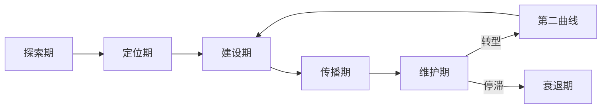
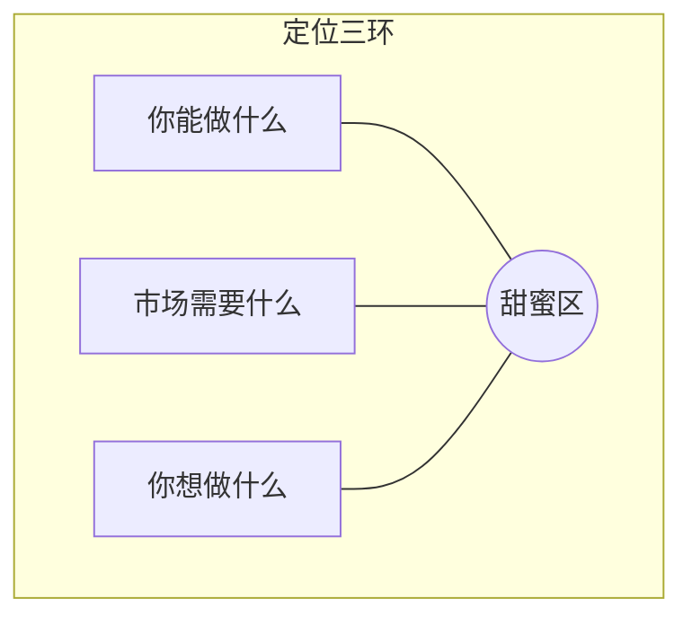
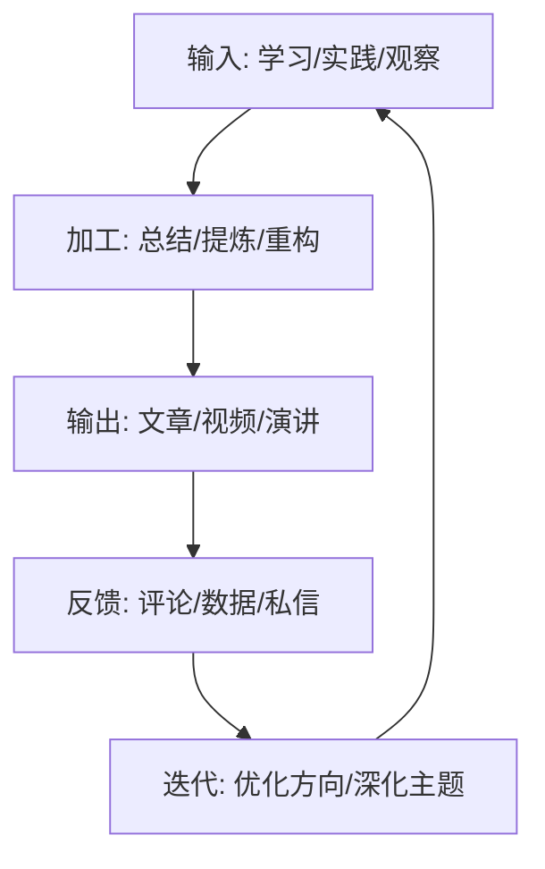
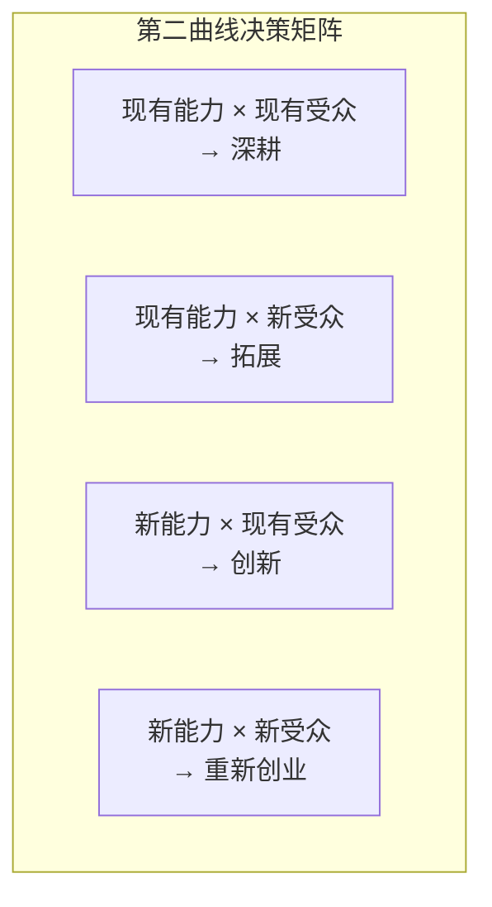
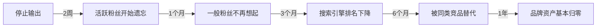

## 三、个人品牌的生命周期

个人品牌不是一次性工程，而是一个动态演进的生命体。它有诞生、成长、巅峰、转型甚至衰退的完整周期。理解这个周期，你才能在正确的阶段做正确的事——既不会在探索期急于变现，也不会在维护期固步自封。

本节将系统拆解个人品牌从萌芽到成熟的完整生命周期，揭示每个阶段的核心任务、关键指标、常见陷阱和加速策略。

### 3.1 品牌生命周期全景图

个人品牌的生命周期可以用一条 S 型曲线来描述。它与产品生命周期（Product Life Cycle）有相似之处，但也有本质区别：个人品牌可以通过主动转型实现"第二曲线"，从而避免自然衰退。

五个阶段并非严格线性，而是螺旋上升的。在维护期，你可能发现自己需要重新定位，于是回到定位期；在传播期，你可能发现自己之前的探索不够深入，需要补课。接受这种"回退"，它不是失败，而是品牌成熟的标志。

### 3.2 阶段一：探索期（Exploration）

**持续时间**：通常 3-12 个月，取决于你的自我认知深度和尝试频率。

探索期的核心任务是"向内看"——了解自己的价值观、核心能力、兴趣方向。这个阶段很多人急于跳过，直接进入定位和建设，结果要么定位不准，要么方向不可持续。

#### 3.2.1 自我审计的四个维度

| 维度 | 核心问题 | 审计方法 |
|------|----------|----------|
| 能力 | 我做什么事比大多数人做得好？ | 360度反馈、技能矩阵评估、过往成就回顾 |
| 热情 | 我做什么事时会忘记时间？ | 心流体验记录、时间日志分析 |
| 价值 | 什么问题让我愤怒或心痛？ | 价值观排序练习、生命叙事回顾 |
| 市场 | 有人愿意为什么能力付费？ | 行业调研、招聘平台分析、自由职业平台观察 |

四个维度的交集就是你的"品牌甜蜜区"。只有能力没有热情，品牌会枯竭；只有热情没有市场，品牌无法变现；只有市场没有能力，品牌不可持续。

#### 3.2.2 探索期的具体行动

**广泛尝试清单**：
- 在 3-5 个不同领域各完成一个小项目（如写 3 篇技术博客、做 1 次线下分享、录 1 期播客）
- 参加 5-10 场行业活动，观察自己在哪类活动中最兴奋
- 找 3-5 位不同领域的前辈做信息性访谈（Informational Interview）
- 在社交媒体上尝试不同类型的内容，观察哪类内容让你最有表达欲
- 做一次正式的 MBTI / CliftonStrengths / VIA 性格优势测试作为参考

**探索期的输出**：一份个人能力-热情-市场交叉分析文档。不需要完美，但需要写下来。模糊的想法永远只是想法，写下来的分析才能被检验和修正。

#### 3.2.3 探索期的常见陷阱

**陷阱一：分析瘫痪（Analysis Paralysis）**
不停做测评、读自我成长书、参加课程，但就是不行动。探索的本质是"做中学"，不是"想中学"。给自己设一个截止日期——比如 3 个月内必须完成至少 2 个领域的实际尝试。

**陷阱二：模仿陷阱**
看到某个成功人士的路径就想复制。但别人的路径是在他们的能力、热情和市场条件下走出来的，直接复制大概率水土不服。可以借鉴方法论，不要复制方向。

**陷阱三：过早承诺**
在探索期就给自己贴上"我是 XXX 领域专家"的标签。这个阶段应该是"假设-验证"模式，不是"宣布-捍卫"模式。

### 3.3 阶段二：定位期（Positioning）

**持续时间**：1-3 个月。定位不是一劳永逸的决定，而是一个持续校准的过程。

定位期的核心任务是"找到你的位置"——在哪个细分领域、面对什么样的受众、提供什么样的独特价值。

#### 3.3.1 定位的三环模型

有效定位必须同时满足三个条件：
- **能力支撑**：你有足够的专业积累来支撑这个定位
- **市场需求**：目标受众存在且有付费/关注意愿
- **内在驱动**：这个方向能让你持续投入 3-5 年以上

#### 3.3.2 定位公式

一个清晰的个人品牌定位可以用以下公式表达：

> **我是 [目标受众] 的 [价值主张]，通过 [独特方法/路径] 帮助他们 [实现什么结果]。**

举例：
- "我是初创公司创始人的技术合伙人，通过'架构先行'方法帮助他们在产品 0-1 阶段避免技术债。"
- "我是职场新人的沟通教练，通过'场景化演练'方法帮助他们在 3 个月内建立职场影响力。"

定位公式不是广告语，而是你对自己品牌的内部共识。对外传播时可以更灵活，但内部决策时，这个公式就是你的北极星。

#### 3.3.3 定位验证的三个测试

在最终确定定位之前，做三个验证：

**电梯测试（Elevator Test）**：在 30 秒内向一个完全不了解你的人解释你是做什么的。如果对方能在 1 分钟后复述出你的核心价值，定位就通过了。

**内容测试（Content Test）**：围绕你的定位连续写 10 篇内容。如果写到第 5 篇时你感到枯竭或重复，说明定位太窄；如果每篇都能写出新角度，说明定位有深度。

**市场测试（Market Test）**：用你的定位去接触 10 位目标受众，观察他们的反应。如果他们追问"具体怎么做到的？"——恭喜，你触到了痛点。如果他们说"哦，挺好的"然后转移话题——定位需要调整。

#### 3.3.4 定位期的关键产出

- 一句话定位公式
- 目标受众画像（包含人口统计、心理特征、痛点清单、信息获取渠道）
- 3-5 个核心关键词（别人提到你时应该想到的词）
- 竞品/同类人分析（你的差异化在哪里）

### 3.4 阶段三：建设期（Building）

**持续时间**：6-24 个月。这是最考验耐力的阶段，也是大多数人放弃的阶段。

建设期的核心任务是"用行动证明"——通过高质量的工作、持续的内容输出、积极的社交互动来建立信任。品牌资产在这个阶段开始真正积累。

#### 3.4.1 品牌资产的四个支柱

参照第二章的品牌资产模型，建设期需要同步推进四个支柱：

**支柱一：内容资产**
- 建立内容日历，保持稳定的输出节奏（建议每周至少 1 篇深度内容）
- 内容类型矩阵：深度长文（展示专业度）+ 短平快观点（保持曝光度）+ 案例复盘（建立可信度）
- 每篇内容围绕 1 个核心关键词，逐步构建你的"内容知识图谱"

**支柱二：关系资产**
- 系统性地建立行业人脉：每月至少与 3 位同行深度交流
- 主动为他人创造价值：推荐机会、分享资源、提供反馈
- 加入或创建 2-3 个高质量的专业社群

**支柱三：作品资产**
- 积累可展示的"品牌作品"：项目案例、发表文章、演讲视频、播客节目
- 作品要有"锚点效应"——每件作品都应该能独立展示你的核心能力
- 建立个人作品集/Portfolio，持续更新

**支柱四：口碑资产**
- 主动收集推荐和背书：LinkedIn 推荐、客户评价、同行认可
- 做好每一次交付——口碑来自超预期的体验
- 培养"传道者"：那些会主动向别人推荐你的人

#### 3.4.2 内容飞轮模型

建设期最有效的策略是构建"内容飞轮"——一个自我加速的内容生产和传播系统：

飞轮的关键是"闭环"——每一次输出都产生反馈，每一次反馈都指导下一次输入。当飞轮转起来后，你会发现内容生产变得越来越自然，因为你不再"找话题"，而是"从实践中提炼话题"。

#### 3.4.3 建设期的节奏管理

建设期最大的敌人是"烧尽"（Burnout）。很多人在前 3 个月热情高涨、日更不断，然后突然断更、彻底消失。

**可持续的内容节奏**：
- 找到你的"最低可持续输出频率"（MSF, Minimum Sustainable Frequency）。对大多数人来说，每周 1 篇深度内容 + 2-3 条短内容是合理的
- 建立内容库存：在精力充沛时多产出，储备 2-4 周的内容缓冲
- 区分"核心内容"和"维护内容"：核心内容是你深度思考的产物，维护内容是日常互动和转发评论

**建设期的心理建设**：
- 前 3 个月几乎看不到反馈，这是正常的。品牌建设是"延迟满足"的典型场景
- 不要和已经建设 3 年的人比较。比的是方向对不对、节奏稳不稳
- 定期回顾自己 3 个月前的内容，你会发现明显的进步——这就是坚持的价值

#### 3.4.4 建设期的关键指标

| 指标 | 衡量方式 | 健康值 |
|------|----------|--------|
| 内容产出稳定性 | 连续输出周数 | 连续 12 周以上 |
| 受众增长趋势 | 粉丝/订阅月增长率 | 月增 5%-15% |
| 互动质量 | 评论深度、私信质量 | 从"赞"转向"讨论" |
| 搜索可见度 | 品牌关键词搜索排名 | 进入前 3 页 |
| 主动邀约 | 被邀请合作/分享的次数 | 每月 1-3 次 |

### 3.5 阶段四：传播期（Amplification）

**持续时间**：6-18 个月，与建设期有重叠。

传播期的核心任务是"让更多人知道"——通过媒体、平台、合作、演讲等渠道放大你的声音。注意，传播期的前提是建设期已经建立了足够的"品牌厚度"，否则放大只是放大空洞。

#### 3.5.1 传播的四个杠杆

**杠杆一：平台杠杆**
选择 1-2 个主平台深耕，而不是全平台铺开。主平台的选择标准：
- 你的目标受众在哪里集中出现
- 你的内容形式与平台特性匹配（文字→公众号/知乎，视频→B站/抖音，音频→播客）
- 平台的增长红利是否还在

**杠杆二：合作杠杆**
- 与同领域但不竞争的 KOL 做内容合作（联名文章、对谈播客、联合直播）
- 为大平台/媒体供稿，借其流量池曝光
- 参与行业大会/峰会演讲，建立"舞台权威"

**杠杆三：背书杠杆**
- 争取行业权威人士的公开推荐
- 获取行业认证、奖项、媒体报道
- 用"社会认同"放大效应：已服务 X 家企业、已被 Y 万人看到

**杠杆四：事件杠杆**
- 创造"品牌事件"：发布行业白皮书、发起行业调查、组织行业峰会
- 借势热点事件输出专业观点（注意：借势不等于蹭热点，必须有专业深度）
- 做"反常识"的行业预测——对了会被广泛传播，错了也能引发讨论

#### 3.5.2 传播期的内容升级策略

在建设期，你的内容可能是"教科书式"的专业输出。在传播期，你需要升级内容的传播性：

- **故事化**：把专业知识嵌入故事框架中（英雄之旅、问题-转折-解决）
- **可视化**：用信息图、短视频、动态图表降低理解门槛
- **争议化**：提出有依据但有争议的观点，激发讨论（不是无脑唱反调）
- **系列化**：把单篇内容变成系列，培养受众的"追更"习惯

#### 3.5.3 传播期的风险控制

传播是双刃剑。曝光越大，被攻击的可能性也越大。

**声誉风险管理清单**：
- 梳理你过去所有的公开内容，删除可能引发误解的旧帖
- 准备一份"危机沟通预案"——如果被攻击，你的回应模板是什么
- 建立"信任缓冲"：在危机发生之前就积累足够的好感度
- 避免过度承诺——传播期容易因为夸大其词而埋下隐患

### 3.6 阶段五：维护期（Maintenance）

**持续时间**：持续进行，没有终点。

维护期的核心任务是"保持活力"——持续学习、更新内容、应对危机、适应变化。这个阶段最大的挑战不是增长，而是避免衰退。

#### 3.6.1 维护期的三大日常

**日常一：内容更新**
- 保持最低可持续输出频率，不让受众"遗忘"你
- 定期回顾和更新旧内容——知识会过时，但你的品牌不应过时
- 持续关注行业变化，确保你的观点与时俱进

**日常二：关系维护**
- 定期与核心人脉互动（不只是有求于人时才联系）
- 持续为社群创造价值
- 培养下一代同行——导师角色是品牌成熟的标志

**日常三：自我迭代**
- 每年做一次品牌审计：你的定位还准确吗？你的关键词还相关吗？
- 学习新技能、拓展新领域，为品牌注入新活力
- 关注受众需求的变化——他们的痛点可能已经变了

#### 3.6.2 品牌焕新的四种方式

当品牌进入平台期或出现疲劳感时，需要主动焕新：

| 焕新方式 | 适用场景 | 举例 |
|----------|----------|------|
| 深度焕新 | 专业领域发生重大变化 | AI 时代重新定义产品经理的核心能力 |
| 形式焕新 | 内容形式需要升级 | 从文字博主转型为视频创作者 |
| 受众焕新 | 原有受众需求饱和 | 从服务程序员扩展到服务技术管理者 |
| 叙事焕新 | 品牌故事需要更新 | 从"技术专家"升级为"技术布道者" |

#### 3.6.3 第二曲线：品牌的战略转型

维护期最危险的状态是"舒适区固化"——品牌很成功，但环境已经变了，你还在重复过去的成功模式。

安索夫矩阵（Angorff Matrix）可以迁移到个人品牌的第二曲线决策中：

- **深耕**：在现有定位上做到极致（风险最低，收益递减）
- **拓展**：把已有能力应用到新受众群体（中等风险，中等收益）
- **创新**：为现有受众提供新类型的价值（中等风险，高收益）
- **重新创业**：全新的能力和受众（风险最高，收益最高）

大多数成熟的个人品牌应该在"深耕"和"创新"之间寻找平衡——60% 精力深耕已有定位，40% 精力探索第二曲线。

### 3.7 品牌衰减的规律与反制

个人品牌不是一劳永逸的。如果不持续投入，品牌会自然衰减。理解衰减的机制，才能有效反制。

#### 3.7.1 品牌影响力公式

> **品牌影响力 = 专业能力 × 持续输出 × 时间**

三个因素缺一不可：
- **只有能力没有输出**：别人不知道你——"酒香也怕巷子深"
- **只有输出没有能力**：品牌不可持续——泡沫总会破裂
- **两者都有但时间不够**：品牌无法形成——罗马不是一天建成的

这个公式是乘法关系而非加法关系，意味着任何一个因素为零，结果都是零。这就是为什么很多能力极强的人始终没有建立品牌——他们的输出因子是零。

#### 3.7.2 注意力衰减曲线

在信息过载的时代，受众的注意力衰减速度远超你的想象。

这就是为什么"持续输出"如此重要。你不需要每天都发深度内容，但你需要保持在受众视野中的"最低存在感"。哪怕是一条评论、一次转发、一个观点短帖，都能延缓注意力衰减。

#### 3.7.3 反衰减策略

**策略一：建立内容资产**
写过的文章、录过的视频、做过的演讲是永久资产。一篇深度文章可以在 3 年后仍然为你带来搜索流量。投资内容资产，而不是追热点——热点会过时，但深度内容会持续产生价值。

**策略二：构建品牌习惯**
让受众形成"习惯性关注"——每天早上看你的推文、每周读你的长文、每月听你的播客。习惯是最强的品牌护城河，因为打破习惯需要额外的心理成本。

**策略三：培养品牌传道者**
最忠诚的受众会在你"沉默期"替你传播。一个传道者的价值等于 100 个普通关注者。投资关系质量，而不是关系数量。

**策略四：设置品牌"心跳"**
即使在低谷期，也要保持最低频率的品牌活动——这就是品牌的"心跳"。可以是每月一篇旧文更新、每季度一次行业观察、每年一次年度总结。心跳不停，品牌就不会"死亡"。

### 3.8 各阶段的沟通策略差异

品牌生命周期的每个阶段，沟通的重心和策略都不同。以下是各阶段的沟通重点对照：

| 阶段 | 沟通重心 | 主要渠道 | 沟通风格 | 关键动作 |
|------|----------|----------|----------|----------|
| 探索期 | 倾听与学习 | 线下活动、一对一 | 谦逊、好奇 | 提问、观察、记录 |
| 定位期 | 表达与测试 | 社交媒体、小型社群 | 清晰、坚定 | 发布定位声明、收集反馈 |
| 建设期 | 输出与积累 | 公众号/博客/视频平台 | 专业、持续 | 内容日历、社群互动 |
| 传播期 | 放大与合作 | 媒体、大会、跨平台 | 有感染力、有故事性 | 演讲、联名、被采访 |
| 维护期 | 深化与更新 | 全渠道 | 权威、亲和 | 导师角色、品牌焕新 |

### 3.9 自检清单：你在哪个阶段？

回答以下问题，判断你当前的品牌生命周期阶段：

**探索期信号**：
- [ ] 我还不确定自己要深耕哪个方向
- [ ] 我尝试过 3 个以上不同的内容领域
- [ ] 我对自己的核心优势还在摸索中

**定位期信号**：
- [ ] 我能用一句话说清楚自己是做什么的
- [ ] 我知道我的目标受众是谁
- [ ] 我开始在特定领域被少数人认识

**建设期信号**：
- [ ] 我有稳定的内容输出节奏
- [ ] 我开始收到主动的合作邀请
- [ ] 我在特定领域有一定的搜索可见度

**传播期信号**：
- [ ] 我有明确的跨平台传播策略
- [ ] 我被媒体或行业大会主动邀请
- [ ] 我的受众增长开始加速

**维护期信号**：
- [ ] 我的品牌已经有 2 年以上的稳定积累
- [ ] 我需要考虑品牌焕新或第二曲线
- [ ] 新人进入我的领域时会以我为参照

如果符合某个阶段 2 个以上信号，你大概率处于该阶段。注意，不同维度可能处于不同阶段——你的内容可能已经进入建设期，但你的人脉可能还在探索期。这是正常的，分别管理就好。

***
