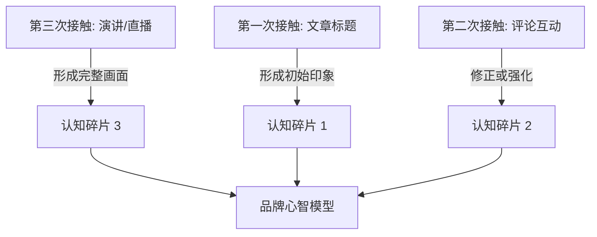
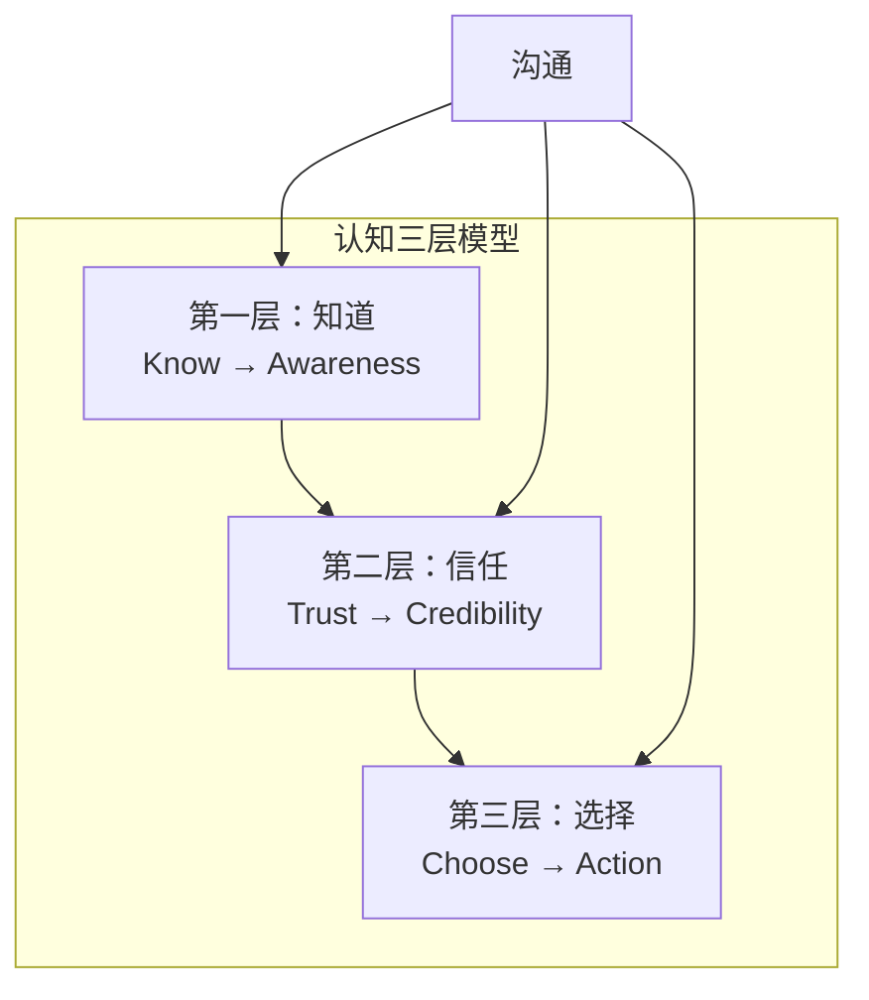
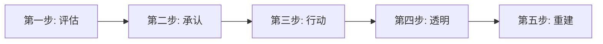
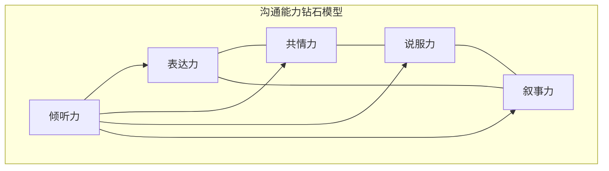
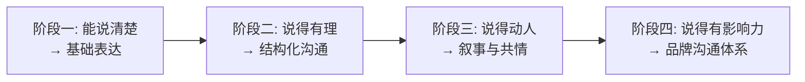

## 四、沟通在个人品牌中的核心地位

个人品牌的一切——定位、信任、影响力、商业价值——最终都通过沟通来实现。专业能力是品牌的"硬件"，沟通是操作系统的"操作系统"。没有操作系统，再强的硬件也只是一堆沉默的晶体管。

本节将从理论机制、场景拆解、能力模型、效果评估四个维度，系统论证沟通为何是个人品牌的第一驱动力，并给出可落地的自检和提升框架。

### 4.1 沟通是品牌的"操作系统"——理论解释

为什么说沟通是操作系统而非应用软件？因为沟通承担了三个不可替代的功能：

**功能一：信号传递（Signaling）**

经济学家迈克尔·斯宾塞（Michael Spence）的信号理论指出，在信息不对称的市场中，高质量的一方需要通过"信号"来区分自己。对个人品牌而言，专业能力是"私有信息"——你心里知道自己很强，但受众看不到。沟通就是把私有信息转化为公共信号的唯一通道。

信号的可信度取决于成本。一篇随手转发的文章是弱信号（成本低），一场精心准备的公开演讲是强信号（成本高）。受众本能地通过信号成本来判断信息的可信度——这解释了为什么"免费干货"往往不如"付费分享"或"受邀演讲"更能建立品牌。

**功能二：认知构建（Cognitive Construction）**

认知心理学研究表明，人们对一个"人"的认知不是一次性形成的，而是通过多次接触、多个维度的信息逐步构建的。这个构建过程遵循"拼图模型"——每一次沟通都是拼图的一块碎片：

关键洞察：你无法控制受众接收到哪些碎片，但你可以控制每块碎片传递的核心信息一致。一致性是品牌认知的基石——如果碎片之间互相矛盾，受众会感到困惑，困惑会导致回避。

**功能三：关系资本积累（Relational Capital）**

社会学家马克·格兰诺维特（Mark Granovetter）的"弱关系力量"理论指出，最有价值的信息和机会往往来自弱关系（而非强关系）。沟通是把"陌生人"变成"弱关系"、把"弱关系"变成"强关系"的转化器。

关系资本的积累遵循对数曲线——前期增长快，后期增速递减但基数大。这意味着前100次有效沟通带来的品牌增量，可能比后1000次还大。所以早期的高频、高质量沟通至关重要。

### 4.2 沟通在品牌认知三层模型中的作用

品牌建设本质上是一个认知管理过程。沟通在三个认知层面同时发挥作用，每一层的沟通策略和评估标准不同。

#### 4.2.1 第一层：认知层——让目标受众"知道"你的存在和价值

认知层的核心问题是"你是谁"。在注意力稀缺的时代，"被知道"本身就是一个巨大的成就。

**沟通策略**：
- **曝光型沟通**：在目标受众常出没的平台保持稳定出现频率。不需要每篇都是爆款，但需要持续"刷脸"。研究表明，一个品牌需要被接触7-13次才能进入受众的长期记忆（来源于Herbert Krugman的"三次接触理论"的扩展研究）。
- **标签型沟通**：在每次沟通中强化你的核心关键词。如果受众每次看到你都联想到"架构设计"，认知就成功了；如果有时联想到"架构"，有时联想到"育儿"，认知就被稀释了。
- **钩子型沟通**：用一个强有力的记忆锚点让受众记住你。这可以是一个标志性的口头禅（如罗振宇的"有种、有趣、有料"）、一个独特的内容形式（如半佛仙人的表情包风格）、一个鲜明的视觉符号。

**认知层的关键指标**：
| 指标 | 衡量方式 | 达标参考值 |
|------|----------|-----------|
| 品牌搜索量 | 品牌词+姓名的月搜索量 | 稳定增长中 |
| 社交提及量 | 被@、被讨论的次数 | 月环比增长 5%+ |
| 首次触达回忆率 | 问卷"提到XX领域你想到谁" | 进入前 5 名 |

#### 4.2.2 第二层：情感层——让目标受众"信任"你、"喜欢"你

情感层的核心问题是"为什么选你"。在同类品牌林立的市场中，信任和好感是决定性因素。

**沟通策略**：
- **一致性沟通**：保持观点、价值观、行为的一致性。受众对"说一套做一套"的人有天然的警觉。一致性不需要你永远正确，但需要你永远真诚——如果观点变了，公开解释变化的原因，这反而会增加信任。
- **脆弱性沟通**：适度展示你的失败、困惑、不完美。布琳·布朗（Brené Brown）的研究表明，适度的脆弱性（Vulnerability）是建立深度信任的最强工具。但注意"适度"二字——过度分享会让人不适，过少分享会显得假。
- **利他型沟通**：在没有直接商业目的的情况下提供价值。免费分享一个实用工具、帮别人解答一个问题、推荐一个比你更适合的资源。这些"无偿"的沟通行为是信任的加速器。
- **倾听型沟通**：在社交媒体上，不只是发布内容，还要认真回应评论和私信。受众能分辨出"真正在听"和"走形式"的区别。一个用心回复的长评论，比一篇精心包装的文章更能建立情感连接。

**情感层的关键指标**：
| 指标 | 衡量方式 | 达标参考值 |
|------|----------|-----------|
| 互动深度 | 评论的字数和质量 | 从"点赞"升级为"讨论" |
| 私信质量 | 主动私信咨询的频率 | 每周 3+ 条有质量的私信 |
| 负面情绪比率 | 负面评论 / 总评论 | < 5% |

#### 4.2.3 第三层：行为层——让目标受众"选择"你、"推荐"你

行为层的核心问题是"如何促成行动"。认知和信任是过程指标，选择和推荐才是结果指标。

**沟通策略**：
- **行动导向型沟通**：每次沟通都应有一个清晰的"下一步行动"（Call to Action）。看完文章后做什么？听完演讲后做什么？关注你之后能得到什么？模糊的品牌让人"觉得不错"，清晰的行动路径让人"现在就做"。
- **社交货币型沟通**：创造受众愿意主动分享的内容。乔纳·伯杰（Jonah Berger）在《疯传》中总结了社交货币的六个要素：归属感、讨论性、实用性、可见性、故事性、稀缺性。你的沟通内容越符合这些要素，受众越愿意替你传播。
- **推荐催化剂型沟通**：主动降低受众推荐你的门槛。提供"可转发的内容模板"、"分享金句"、"推荐话术"。很多受众想推荐你但不知道怎么说——给他们提供现成的语言工具。

**行为层的关键指标**：
| 指标 | 衡量方式 | 达标参考值 |
|------|----------|-----------|
| 转化率 | 行动人数 / 曝光人数 | 1%-5%（因行业而异） |
| 推荐率 | 被推荐带来的新受众占比 | 20%+ 新受众来自推荐 |
| 复购/复访率 | 二次行动率 | 30%+ |

### 4.3 品牌沟通的七大场景深度拆解

个人品牌的沟通渗透在日常工作的方方面面。以下七大场景覆盖了绝大多数品牌沟通触点，每个场景的策略、方法和评估标准各不相同。

#### 4.3.1 场景一：一对一沟通

**典型场景**：面试、客户咨询、社交场合的初次交流、信息性访谈（Informational Interview）。

**为什么重要**：一对一沟通是信任建立的"高带宽通道"。面对面（或视频）交流包含语言、语调、表情、肢体语言四重信号，信息密度远高于文字。一次成功的一对一沟通可以抵得上十篇文章。

**核心方法**：
- **STAR品牌法**：在一对一场景中，用STAR框架（Situation-Task-Action-Result）讲述你的品牌故事。不要泛泛而谈"我是做技术的"，而是说"在XX项目中（Situation），我负责解决XX问题（Task），我采用了XX方法（Action），最终实现了XX结果（Result）"。
- **三层回应法**：当对方问"你是做什么的"时，准备三个层次的回答——一句话版本（30秒）、一段话版本（2分钟）、完整版（5分钟）。根据场景和对方的兴趣深度灵活切换。
- **镜子技巧**：在一对一沟通中，有意识地"映射"对方的语言风格和节奏。如果对方说话快、直奔主题，你也应该简洁有力；如果对方喜欢寒暄铺垫，你也不要急着掏干货。这种匹配感会大幅提升沟通效果。

**常见错误**：
- 一上来就"推销"自己的品牌，忽略对方的需求和兴趣
- 准备了太多"想说的话"，没有留出倾听的空间
- 对不同的人讲完全一样的故事，缺乏针对性

#### 4.3.2 场景二：一对多演讲

**典型场景**：会议发言、行业大会演讲、线上直播、培训授课、圆桌讨论。

**为什么重要**：一对多是品牌曝光效率最高的场景——一次演讲可以同时影响数百甚至数千人。而且，"站在台上"本身就是一个强信号：你被组织方认可、你有足够的内容深度、你有面对公众的自信。

**核心方法**：
- **三幕结构法**：任何演讲都可以用三幕结构组织——第一幕：建立问题（"你们有没有遇到过XX？"）；第二幕：展开分析（"为什么会这样？背后的机制是什么？"）；第三幕：给出方案（"我的建议是XX，具体怎么做"）。三幕结构比"罗列知识点"更容易让受众记住。
- **金句锚定法**：每场演讲至少准备一个"可被引用的金句"。金句的作用是成为受众记忆和传播的锚点。例如"品牌不是你说了什么，而是你不在场时别人怎么说你"。金句应该简洁、有力、有画面感。
- **互动设计**：在演讲中设计2-3个互动节点（提问、举手投票、小组讨论）。互动不只是活跃气氛，更是让受众从"被动接收"切换为"主动参与"——参与感是记忆深度的最大变量。

**演讲者的品牌增益评估**：
| 维度 | 加分行为 | 减分行为 |
|------|---------|---------|
| 内容 | 有独特见解、有数据支撑 | 照搬他人内容、空洞无物 |
| 表达 | 节奏好、有感染力、有幽默感 | 语速过快、全程念稿、无眼神交流 |
| 互动 | 认真回答问题、记住提问者 | 敷衍回答、回避尖锐问题 |
| 后续 | 演讲后分享材料、跟进联系 | 讲完就消失、不回应后续交流 |

#### 4.3.3 场景三：书面表达

**典型场景**：专业文章、行业报告、邮件沟通、社交媒体文案、书籍/电子书。

**为什么重要**：书面内容是品牌的"永久资产"。一场演讲结束就结束了，但一篇文章可以在搜索引擎中持续为你带来曝光和信任。根据内容营销协会（Content Marketing Institute）的数据，持续发布高质量书面内容的个人，其行业影响力是不写作者的5-8倍。

**核心方法**：
- **知识图谱法**：不要随机写文章，而是围绕你的品牌定位构建一个"知识图谱"——核心主题 3-5 个，每个主题下展开 5-10 个子话题，每个子话题可以写成一篇独立文章。这样既能保证内容的系统性，又能通过文章间的交叉引用形成"内容矩阵"。
- **Hook-Body-Close结构**：每篇书面内容都遵循这个结构——Hook（开头用一个问题、一个数据、一个故事抓住注意力）、Body（正文展开论述，用小标题分割段落便于扫读）、Close（结尾给出明确的行动建议或思考题）。
- **人设一致性**：书面表达的语气、用词、排版风格应该与你的品牌人设一致。如果你的品牌定位是"严谨的技术专家"，文案就不应该充满感叹号和网络流行语；如果你的品牌是"接地气的生活教练"，就不应该用满屏的学术术语。

**书面表达的质量检查清单**：
- [ ] 标题是否有吸引力？是否包含受众关心的关键词？
- [ ] 开头三句话能否抓住注意力？
- [ ] 每个论点是否有论据支撑（数据、案例、逻辑推理）？
- [ ] 是否有视觉化的元素（表格、图表、对比框）降低理解成本？
- [ ] 结尾是否有明确的行动建议？
- [ ] 是否有引导互动的设计（提问、投票、征集观点）？

#### 4.3.4 场景四：视觉表达

**典型场景**：PPT/Keynote演示、短视频、信息图、个人形象设计、品牌视觉系统（Logo、配色、字体）。

**为什么重要**：人类大脑处理视觉信息的速度是文字的6万倍（3M公司研究）。在信息过载的环境中，视觉表达是降低认知成本、提升品牌辨识度的最有效手段。

**核心方法**：
- **视觉锤理论**：劳拉·里斯（Laura Ries）提出的"视觉锤"概念——用一个强有力的视觉符号"锤入"受众的心智。对个人品牌而言，视觉锤可以是固定的配色方案（如罗永浩的黑色T恤）、固定的排版风格（如"回形针"的卡片式排版）、固定的出场方式（如某个开场动作或音乐）。
- **信息降维法**：把复杂的专业信息压缩为一张图、一张表、一个流程图。如果你能把一个概念画成一张清晰的图，受众不仅能理解，还能把这张图转发给别人——这就是最好的品牌传播。
- **一致性原则**：所有视觉输出保持统一的风格。头像在所有平台用同一张，配色方案不超过3种主色，排版风格保持统一模板。视觉一致性让受众在不同场景中快速认出你，降低品牌的认知成本。

#### 4.3.5 场景五：社交媒体互动

**典型场景**：评论区互动、私信回复、转发评论、直播、社群发言、话题参与。

**为什么重要**：社交媒体是"一对多的一对一沟通"——你回复一条评论，实际上是在所有读者面前展示你的沟通风格、价值观和人格。一条用心的评论回复，可能比一篇精心打磨的文章更能建立信任。

**核心方法**：
- **评论即内容法**：把每条评论都当作"微内容"来写。不要只回"谢谢支持"，而是给出有价值的观点、补充信息或延伸思考。好的评论回复会被人截图转发，成为独立的传播素材。
- **主动出击法**：不要只在自己的地盘上互动，主动到行业大V的内容下留有价值的评论。每周花30分钟在相关领域的内容下留下有深度的评论，比自己发一篇新文章的曝光效率可能更高。
- **争议管理法**：在社交媒体上遇到争议时，遵循"24小时原则"——先冷静24小时再回应。回应时使用"认可-补充-提问"框架："我理解你的观点（认可），同时我补充一个角度（补充），你怎么看？（提问）"。不要删除争议评论（除非是人身攻击），坦诚的讨论反而会增强品牌可信度。

#### 4.3.6 场景六：危机回应

**典型场景**：被质疑专业能力、被误解观点、被恶意攻击、被曝出过往失误、品牌合作方出问题。

**为什么重要**：危机不是"会不会发生"的问题，而是"什么时候发生"的问题。危机中的沟通是品牌信任的终极考验——处理好了，信任反而加强；处理不好，品牌可能崩溃。

**危机回应的五步法**：

- **评估**（0-2小时）：冷静评估危机的性质和严重程度。是真的有问题，还是被误解？影响范围有多大？是否需要回应？有些噪音可以忽略，有些必须正面应对。
- **承认**（2-12小时）：如果确实有错，第一时间承认。"我犯了一个错误"比"如果有人感到受伤"（非道歉道歉）强一万倍。如果被误解，用事实澄清，不要用情绪反驳。
- **行动**（12-48小时）：给出具体的改正措施。"我已经做了XX"比"我以后会注意"有说服力得多。
- **透明**（持续）：公开分享改正的进展。让人们看到你在改变，而不只是在说。
- **重建**（长期）：用持续的正面行动重建信任。信任破坏需要一瞬间，修复需要3-5倍的时间。

**危机中的沟通红线**：
- 绝不在情绪激动时发公开声明
- 绝不删除批评评论后假装无事发生
- 绝不攻击批评者的个人身份
- 绝不用"法律威胁"压制合理质疑
- 绝不把责任推给"团队"或"助理"

#### 4.3.7 场景七：口碑经营

**典型场景**：通过他人之口传递你的品牌价值——推荐信、客户背书、同行评价、社群中的自然推荐。

**为什么重要**：口碑是所有沟通方式中可信度最高的。心理学研究证实，来自第三方的正面评价比自我宣传的可信度高3-5倍（尼尔森信任度调查）。更重要的是，口碑是"免费"的——你不需要为它付广告费，但它带来的信任资产是无价的。

**口碑经营的核心方法**：
- **超预期交付**：口碑的本质是"超出预期的体验"。如果受众预期80分，你交付了95分，他们就会告诉别人。如果你只做到了预期的80分，即使质量不差，也不会产生口碑。
- **推荐催化剂**：主动为他人做推荐和背书。"利他先于利己"是口碑经营的基本法则。当你经常推荐别人时，别人也更愿意推荐你。
- **故事包装**：给受众提供"可传播的故事素材"。一个有画面感的案例比一个抽象的评价更容易被传播。如果你的客户说"他帮我省了100万"，远比"他很专业"更容易被记住和转述。

### 4.4 沟通能力的钻石模型

个人品牌的沟通能力不是单一维度的"口才好"或"文笔好"，而是一个多维度的能力系统。以下是品牌沟通能力的钻石模型：

#### 4.4.1 表达力（Clarity of Expression）

把复杂的事情说清楚的能力。不是"说得漂亮"，而是"说得让人能听懂"。

**训练方法**：
- **费曼技巧**：用给12岁小孩讲解的方式解释你的专业概念。如果你不能用简单的话解释清楚，说明你自己还没理解透。
- **电梯演讲练习**：每天用30秒向不同的人（家人、朋友、同行、外行）解释你最近的工作。观察哪个人群的理解率最高，调整你的表达方式。
- **结构化表达**：养成"结论先行"的习惯——先说"我的观点是XX"，再说"原因是1、2、3"。麦肯锡的金字塔原理（Minto Pyramid Principle）是结构化表达的经典框架。

#### 4.4.2 共情力（Empathy）

站在受众角度思考的能力。你的内容是为受众服务的，不是为了展示你的知识量。

**训练方法**：
- **受众画像练习**：为你最核心的目标受众写一份详细画像——他们的日常焦虑是什么？他们在哪里获取信息？他们如何描述自己的问题？画像越具体，你的共情能力越强。
- **评论分析**：每周花30分钟仔细阅读你内容下的每一条评论，特别是负面评论。负面评论里藏着受众真正的需求和不满——这些是你用"自己的视角"永远看不到的盲区。
- **换位写作**：写内容之前，先写一段"如果我是读者，我希望看到什么"的备忘录。这个小小的习惯可以大幅提升内容的共情度。

#### 4.4.3 说服力（Persuasion）

用逻辑和证据让别人接受你的观点的能力。品牌不是自说自话，而是让人信服。

**训练方法**：
- **论据库积累**：在你的专业领域，系统性地积累数据、案例、权威引用。每次遇到一个好数据、好案例，立即存入你的"论据库"（可以用Notion、Obsidian或一个简单的Markdown文件）。写文章或做演讲时，论据库让你随时有据可依。
- **反面论证练习**：每次提出一个观点，先自己反驳一遍。这个练习可以让你预判受众的质疑，提前准备好回应，让论证更加严密。
- **亚里士多德三要素**：经典的说服力框架——Ethos（可信度：你为什么值得听）、Logos（逻辑：你的论证是否严密）、Pathos（情感：你是否触动了受众的情感）。最强的说服是三者兼备。

#### 4.4.4 叙事力（Storytelling）

用故事框架组织信息的能力。人类大脑天生对故事的接受度比对数据高22倍（斯坦福大学研究）。

**训练方法**：
- **英雄之旅框架**：约瑟夫·坎贝尔（Joseph Campbell）的"英雄之旅"是最经典的故事结构。在个人品牌中，你可以把客户案例用英雄之旅来讲——他们面临什么困境（平凡世界）、遇到什么转折（冒险召唤）、如何解决（试炼与胜利）、获得了什么改变（归来）。
- **STAR故事法**：STAR不只是面试工具，也是品牌叙事的基本单元。每个专业观点都可以用一个STAR故事来支撑。
- **故事素材库**：在日常工作中，留意有画面感的场景、有趣的对话、意外的结果。这些素材比虚构的故事更有感染力，因为它们有细节的真实感。

#### 4.4.5 倾听力（Listening）——被低估的沟通能力

倾听不是"不说话"，而是"用提问引导对方说出真正的想法"。在个人品牌语境中，倾听帮助你了解受众的真实需求，让你的沟通更精准。

**训练方法**：
- **3:7法则**：在一对一对话中，让对方说70%，你说30%。用提问而非陈述来推进对话。
- **复述确认法**：对方说完后，用自己的话复述一遍："你的意思是XX，我理解得对吗？"这不仅确认了理解，还让对方感到被重视。
- **社交倾听**：在社交媒体上，系统性地关注你所在领域的讨论热点、受众的抱怨和需求、竞品的沟通策略。社交倾听是免费的市场调研。

### 4.5 沟通一致性：品牌的核心纪律

在所有场景和所有渠道中保持沟通一致性，是品牌建设中最难也最重要的一件事。

#### 4.5.1 什么是一致性

一致性不是"说一样的话"，而是"传递一致的价值观和人格"。你的措辞可以因场景而异——在技术大会上严谨，在社交媒体上轻松——但核心信息、价值观和人设不能矛盾。

**一致性的三个层面**：

| 层面 | 含义 | 检查方法 |
|------|------|---------|
| 信息一致性 | 核心观点和立场不自相矛盾 | 把你最近10篇内容的核心观点列出来，看是否有矛盾 |
| 人格一致性 | 在不同场景中展现出的"人"是同一个人 | 让一个不了解你的朋友分别看你的文章、演讲和社交媒体，问他是否觉得是同一个人 |
| 视觉一致性 | 品牌视觉元素（头像、配色、排版）统一 | 在所有平台上搜索你的名字，检查视觉风格是否统一 |

#### 4.5.2 不一致性的代价

**案例：某科技博主的品牌稀释**

一位以"深度技术分析"定位的科技博主，在拥有50万粉丝后开始频繁发布生活vlog、带货推荐和娱乐八卦。短期内，多元化内容确实带来了流量增长（因为覆盖了更广的人群）。但6个月后，核心受众大量流失——他们关注他是为了"深度技术分析"，不是为了看他推荐洗面奶。新吸引的"娱乐受众"忠诚度很低，变现能力远不如原来的技术受众。最终，这位博主的广告报价下降了40%，因为广告主发现他的受众画像已经严重模糊。

教训：一致性不是限制，而是保护。它保护你的核心受众不流失，保护你的品牌溢价不被稀释。

#### 4.5.3 品牌沟通手册

为了确保一致性，建议每个认真做个人品牌的人都创建一份"品牌沟通手册"——一份记录你品牌沟通核心规则的内部文档。

**品牌沟通手册的核心内容**：
- **品牌定位一句话**：我是[受众]的[价值]，通过[方法]帮助他们[结果]
- **核心关键词**：3-5个别人提到你时应该想到的词
- **禁止使用的词语/话题**：与品牌定位明显冲突的领域
- **语气指南**：正式度、幽默度、专业术语使用的比例
- **视觉规范**：主色调（HEX值）、字体、头像使用规则
- **内容红线**：绝对不会触碰的话题和立场
- **危机回应模板**：预设的危机回应框架，避免临时决策失误

### 4.6 沟通频率与节奏：少即是多的悖论

很多品牌新手认为"发得越多越好"。这是错误的。沟通频率和节奏需要精心设计——过少会导致品牌沉默，过多会导致受众疲劳。

#### 4.6.1 最低有效频率（Minimum Effective Frequency）

最低有效频率是指维持品牌存在感所需的最低沟通频率。低于这个频率，品牌会开始衰减；高于这个频率，边际收益递减。

不同场景的最低有效频率参考：
| 场景 | 最低频率 | 建议频率 | 上限 |
|------|---------|---------|------|
| 深度文章 | 每月2篇 | 每周1篇 | 每周3篇 |
| 社交媒体动态 | 每周3条 | 每天1-2条 | 每天5条 |
| 演讲/直播 | 每季度1次 | 每月1次 | 每周1次 |
| 社群互动 | 每天1次 | 每天2-3次 | 持续在线 |
| 一对一沟通 | 每周3次有意义的 | 每天1次 | 无上限 |

#### 4.6.2 内容日历设计

建议用"4-1-1"节奏设计内容日历：每6条内容中，4条是"教学型"（分享知识、方法、工具）、1条是"个人型"（分享个人故事、观点、感悟）、1条是"互动型"（提问、投票、征集）。

这个节奏既保证了专业度（教学型内容为主），又展示了人格（个人型内容增加亲和力），还促进了互动（互动型内容提升参与度）。

#### 4.6.3 节奏一致性 vs 质量优先

**误区：为了保持频率而降低质量。**

宁可减少频率也不要降低质量。一次低质量的输出不仅不会加分，还会扣分——因为它打破了受众对你的质量预期。如果临时没有高质量内容可发，发一条简短但真诚的动态，或者转发一条有价值的内容并附上你的简评，都比硬凑一篇水文好。

### 4.7 数字化时代的沟通挑战与应对

在传统媒体时代，个人品牌的沟通渠道有限但可控。在社交媒体时代，渠道多了，但挑战也更大了。

#### 4.7.1 碎片化挑战

受众的注意力被切成碎片——他们可能在30秒内刷过你的内容，只看到一个标题或一张图。

**应对策略**：
- **金字塔写作法**：标题就要传达核心价值，不要指望受众"读完全文再理解"。把最重要的信息放在最前面，即使只读了标题和第一段，受众也能获得核心信息。
- **多格式输出**：同一个核心内容，用长文、短文、图表、短视频、音频等多种格式表达。不同受众偏好不同的信息接收方式。

#### 4.7.2 算法依赖挑战

社交媒体平台的算法决定了你的内容能被多少人看到。算法的变化可能让你一夜之间失去大部分曝光。

**应对策略**：
- **自有渠道优先**：建立你"拥有"的渠道（个人网站、邮件列表、微信群/Telegram群），这些渠道不受算法影响。社交平台是"租来的地"，自有渠道才是"自己的地"。
- **多平台分散**：不要把所有内容都押在一个平台上。至少在2-3个平台保持活跃，即使一个平台算法变化，你还有其他渠道。

#### 4.7.3 信息过载挑战

你的受众每天被海量信息淹没。你的内容不只是和同行竞争，还和所有争夺注意力的内容竞争。

**应对策略**：
- **深度护城河**：在信息过载的环境中，深度内容反而更稀缺、更有价值。人人都能发100字的观点，但能写5000字深度分析的人很少。深度是你的竞争壁垒。
- **人格差异化**：算法可以复制你的内容格式，但无法复制你的人格。在内容中融入你的独特经历、观点和风格，让你的品牌不可替代。

### 4.8 从"会说话"到"建品牌"——沟通进阶路径

沟通能力的提升是一个渐进过程。以下是从入门到精通的四阶段路径：

**阶段一：能说清楚（0-6个月）**

目标：把你脑子里的专业知识，用人能听懂的话说出来。

核心任务：
- 掌握结构化表达（结论先行、逻辑分层）
- 完成费曼技巧的基本训练
- 在至少1个平台上保持稳定的文字输出
- 积累50个以上的专业"表达片段"（金句、比喻、案例摘要）

**阶段二：说得有理（6-18个月）**

目标：你的表达不仅清楚，而且有说服力。

核心任务：
- 建立个人"论据库"，积累100+数据点和案例
- 掌握基本的论证方法（归纳法、演绎法、类比法）
- 开始练习公开演讲，完成至少10次正式或非正式的演讲
- 学会用反面论证强化自己的观点

**阶段三：说得动人（1-3年）**

目标：你的沟通不仅有理，而且能触动人心。

核心任务：
- 精通至少2种故事框架（英雄之旅、STAR、问题-转折-解决）
- 建立"故事素材库"，积累30+真实故事
- 发展出独特的沟通风格（语气、节奏、视觉风格）
- 能够根据不同受众灵活调整沟通策略

**阶段四：说得有影响力（3年以上）**

目标：你的每一次沟通都在为品牌增值，形成完整的品牌沟通体系。

核心任务：
- 拥有品牌沟通手册，所有输出遵循统一标准
- 构建了"内容飞轮"——输出产生反馈，反馈指导新输入
- 能够训练和指导他人进行品牌沟通
- 在危机中能够从容应对，危机反而增强品牌信任

### 4.9 自检清单：你的品牌沟通处于什么水平？

回答以下问题，评估你当前的品牌沟通能力。每个"是"得1分：

**表达力自检**：
- [ ] 我能用30秒让一个外行理解我的工作
- [ ] 我写的文章有清晰的结构（不是想到哪写到哪）
- [ ] 我能在演讲中脱稿讲完核心内容

**共情力自检**：
- [ ] 我清楚目标受众的三个核心焦虑
- [ ] 我会根据受众调整沟通方式
- [ ] 我定期分析受众的反馈（评论、私信、数据）

**说服力自检**：
- [ ] 我的每个核心观点都有至少2个论据支撑
- [ ] 我能预见受众的反对意见并提前回应
- [ ] 我积累了至少50个专业领域的数据和案例

**叙事力自检**：
- [ ] 我能用故事框架包装一个专业观点
- [ ] 我有至少10个自己经历的真实品牌故事
- [ ] 受众反馈说我的内容"有画面感"

**一致性自检**：
- [ ] 我在所有平台的核心信息是一致的
- [ ] 我有书面的品牌沟通手册或至少口头约定
- [ ] 让不了解我的人分别看我的不同内容，会觉得是同一个人

**评分解读**：
- 0-5分：品牌沟通处于起步阶段，建议从"表达力"开始训练
- 6-10分：品牌沟通已有基础，需要在"共情力"和"叙事力"上发力
- 11-15分：品牌沟通比较成熟，重点提升"一致性"和"影响力"
- 16-18分：品牌沟通已进入高阶水平，可以开始输出方法论帮助他人

### 4.10 本节核心要点

沟通在个人品牌中的核心地位可以用一句话概括：**你的品牌价值 = 你的实际价值 × 你的沟通能力**。

如果沟通能力为0，无论实际价值多高，品牌价值都是0。这个乘法关系解释了为什么很多专业能力极强的人始终没有建立品牌——他们的沟通因子接近零。

记住以下核心公式和原则：

> **品牌影响力 = 专业能力 × 持续输出 × 时间**
>
> **品牌价值 = 实际价值 × 沟通能力**
>
> **信任建设时间线：0-6月注意 → 6-12月观察 → 1-2年信任 → 2-3年推荐 → 3年+传道**

沟通不是"锦上添花"的能力，而是个人品牌的"生存能力"。从今天开始，把沟通当作和专业能力同等重要的核心能力来投资。

***
