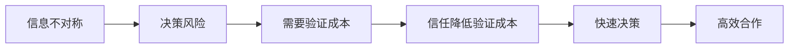
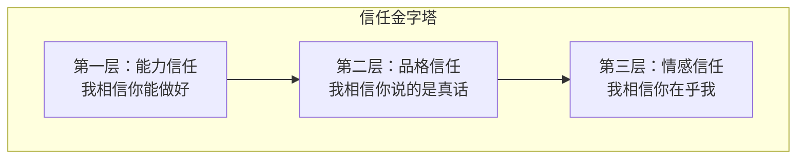
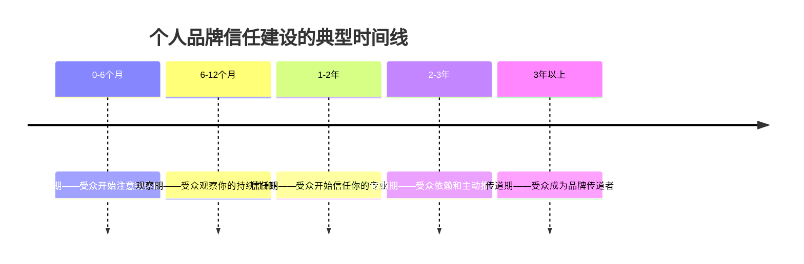
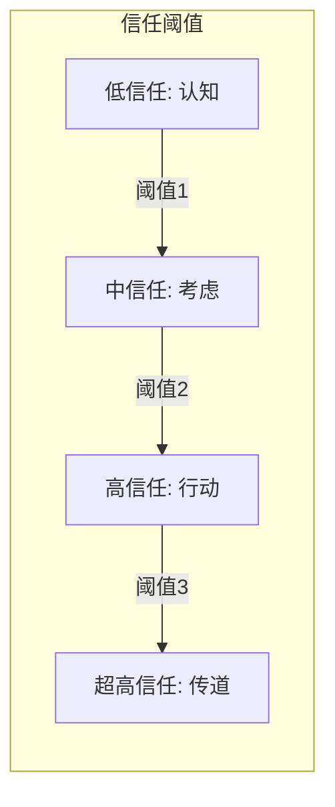

## 五、个人品牌的信任机制

信任是个人品牌的核心资产。没有信任，品牌只是一个空洞的标签——人们可能知道你的名字，但不会把重要的决策、项目或金钱交到你手上。信任决定了受众是否愿意与你建立深度关系，是否愿意为你的专业买单，是否愿意在关键时刻向他人推荐你。

理解信任的形成机制、破坏规律和修复路径，是建设持久个人品牌的底层必修课。

### 5.1 信任的本质：降低社交交易成本

从社会学角度看，信任的本质是一种**风险评估机制**。当受众决定信任你时，他们实质上是在说："我相信与你交互的风险是可接受的。"这种风险评估发生在每一次内容消费、每一次合作洽谈、每一次推荐背书中。

信任的经济学解释来自交易成本理论：在信息不对称的市场中，信任能显著降低搜索成本、谈判成本和监督成本。一个被信任的个人品牌，本质上是在为受众**节约决策时间**。



哈佛商学院教授弗朗西斯·福山（Francis Fukuyama）在《信任》一书中指出：高信任社会的经济运行效率远高于低信任社会，因为信任减少了大量契约执行和监督的摩擦成本。这一规律在个人品牌层面同样成立——被信任的个体在商业合作中能获得更低的交易摩擦、更快的成交速度和更高的溢价空间。

### 5.2 信任的三层模型

个人品牌的信任并非一个单一维度，而是由三个逐层递进的层次构成。每一层都是下一层的基础，缺少任何一层，信任结构都是不稳固的。



#### 5.2.1 第一层：能力信任（Competence Trust）

"我相信你能做好这件事。"这是最基础的信任——受众相信你具备完成任务所需的知识和技能。没有能力信任，一切品牌建设都是空中楼阁。

**能力信任的心理学基础**：心理学家艾伯特·班杜拉（Albert Bandura）的自我效能理论指出，人们倾向于信任那些展现出高效能表现的个体。当受众反复观察到你的专业产出质量稳定且高于平均水平时，他们会形成"这个人确实有能力"的认知图式。

**建立能力信任的具体方法**：

| 方法 | 具体操作 | 信任效果 |
|------|----------|----------|
| 专业资质展示 | 公开可验证的学历、证书、行业认证 | 基础信任锚点 |
| 高质量内容输出 | 持续发布有深度的专业文章、报告、分析 | 持续强化专业形象 |
| 可验证的案例 | 展示完整项目过程、数据结果、客户评价 | 提供信任证据链 |
| 知识更新 | 公开学习笔记、对新趋势的解读、技术迭代记录 | 展示持续成长 |
| 第三方背书 | 行业奖项、权威媒体报道、知名人士推荐 | 借力权威转移信任 |
| 免费价值给予 | 免费工具、模板、指南、公开课程 | 降低受众验证成本 |

**能力信任的反面——能力质疑的触发器**：

- 基础知识错误：在自己声称擅长的领域犯低级错误，直接动摇能力根基
- 无法回答深入问题：公开场合被追问时含糊其辞或回避
- 产出质量不稳定：偶尔惊艳但大量内容质量平庸，反而增加不确定性
- 过度包装：简历注水、案例夸大，一旦被拆穿，能力信任归零

#### 5.2.2 第二层：品格信任（Character Trust）

"我相信你说的是真话。"受众不仅相信你的能力，还相信你的诚实和正直。品格信任回答的是"你是否值得信赖"的问题——即使你能力很强，如果品格存疑，人们也不会放心把关键事务交给你。

**品格信任的心理学基础**：社会心理学家莫顿·多伊奇（Morton Deutsch）的信任研究表明，人们对信任的判断中，"意图的善意"权重甚至高于"能力"。一个能力中等但诚实可靠的人，往往比一个能力出众但动机可疑的人获得更多的长期信任。

**品格信任的四个支柱**：

**支柱一：言行一致性（Consistency）**

言行一致是品格信任的基石。当你说"我会在周五前交付"然后真的在周五前交付，你在积累言行一致的信用。反之，一次食言就需要多次兑现才能修复。

具体操作：
- 承诺前评估可行性，宁可少承诺多交付
- 建立公开的承诺追踪系统（如项目看板、进度更新）
- 如果无法兑现，提前通知并给出替代方案，而非等到截止日才解释
- 在公开场合保持观点的一致性，避免见人说人话见鬼说鬼话

**支柱二：透明度（Transparency）**

透明不等于没有隐私，而是指在与受众利益相关的事项上保持开放。隐藏利益关系、掩盖失败经历、回避敏感话题，都会侵蚀品格信任。

具体操作：
- 商业合作明确标注（广告、赞助、联盟链接）
- 失败经历坦诚分享，包括原因分析和教训总结
- 收入来源、商业模式公开透明
- 观点立场有明确表达，不模棱两可

**支柱三：利益冲突中的选择（Integrity Under Pressure）**

品格信任的终极检验发生在利益冲突时刻。当个人利益与受众利益冲突时，你选择站在哪一边，决定了信任的走向。

经典案例：2015年，一位知名科技博主被曝出在评测产品时收取了厂商费用却未披露。虽然他的评测内容质量本身没有问题，但利益冲突中的不透明选择直接摧毁了多年积累的品格信任，粉丝大量流失，品牌价值断崖式下跌。

**支柱四：对错误的态度（Accountability）**

犯错不可怕，可怕的是犯错后的态度。推卸责任、甩锅他人、假装无事发生，这些行为对品格信任的破坏力远超错误本身。

错误应对的最佳实践：
1. **快速承认**：第一时间承认错误，不等舆论发酵
2. **完整归因**：解释错误发生的原因，但不找借口
3. **具体补救**：提出明确的补救措施和时间表
4. **系统改进**：公开承诺并落实防止同类错误的机制

#### 5.2.3 第三层：情感信任（Emotional Trust）

"我相信你是真的在乎我。"这是最高层次的信任——受众不仅相信你的能力和品格，还相信你真心关心他们的利益。情感信任将"品牌-受众"关系从交易关系升级为情感关系。

**情感信任的心理学基础**：依恋理论（Attachment Theory）的延伸研究表明，人类在社会关系中天然寻求"安全基地"——一个让自己感到被理解、被支持的存在。当个人品牌能在受众心中建立这种安全基地感时，情感信任就形成了。

**建立情感信任的具体方法**：

**方法一：共情式回应**

不是机械地回答问题，而是先理解提问者的情绪和处境，再给出针对性的回应。

- 差的回应："这个问题在第三章有解答，请查阅。"
- 好的回应："我理解你的焦虑——当初我也在这个阶段卡了很久。我的建议是先从X开始，因为Y。第三章有更详细的步骤，但核心思路是这个。"

**方法二：无利益关系的帮助**

在没有任何商业回报的情况下提供帮助，是建立情感信任最有效的方式。这向受众传递了一个信号："我帮助你不是为了从你身上获利，而是因为我在乎你的成长。"

具体形式：
- 免费回答受众的个性化问题
- 为遇到困难的受众提供一对一指导
- 主动分享对受众有价值但对自己没有直接收益的资源
- 在受众遭遇不公时公开声援

**方法三：记住个体**

在大规模传播中保持个体关怀。记住常互动受众的名字、背景故事和当前关注点，在适当时候主动问候或提供针对性建议。

**方法四：展示脆弱性**

适度展示自己的不完美、困惑和挣扎，让受众看到一个真实的人而非一个完美的品牌形象。

布琳·布朗（Brené Brown）在《脆弱的力量》中指出："脆弱性不是软弱，而是我们衡量勇气最准确的方式。"当你向受众展示脆弱时，你在传递信任——"我相信你们不会因为我暴露弱点而伤害我。"这种信任的传递往往会引发信任的回报。

### 5.3 信任的"慢建立、快破坏"规律

信任的建设遵循一个不对称的时间规律：建设缓慢，破坏迅速。这个规律被称为"信任不对称原则"（Trust Asymmetry Principle），由金·凯瑟琳·奈特（Kim Caitlin Night）等学者系统阐述。

#### 5.3.1 信任建设的时间线



**0-6个月：注意期**

受众通过偶然发现或算法推荐接触到你的内容。此阶段的核心任务是**留下足够好的第一印象**，让受众愿意继续关注。注意期的信任极其脆弱——任何一个负面信号都可能导致受众永久离开。

关键指标：粉丝增长率、内容完读率、回访率。

**6-12个月：观察期**

受众开始系统性地观察你：内容质量是否稳定？观点是否前后一致？承诺是否兑现？这个阶段受众在进行"信誉尽职调查"。

关键指标：互动深度（评论质量）、私信咨询量、内容被引用次数。

**1-2年：信任期**

经过持续观察，受众开始信任你的专业判断。他们会在决策时参考你的观点，在遇到相关问题时第一时间想到你。

关键指标：受众决策引用率、转介绍率、付费转化率。

**2-3年：依赖期**

信任深化为依赖——受众形成了"遇到这方面的事就找你"的习惯。此阶段的核心挑战是**维持信任质量**，因为依赖意味着更高的期望和更低的容错率。

关键指标：客户留存率、NPS（净推荐值）、复购率。

**3年以上：传道期**

受众从被动信任者变为主动传播者。他们不仅自己信任你，还会积极向他人推荐你。这是个人品牌最珍贵的状态——信任产生了自传播效应。

关键指标：口碑推荐率、品牌搜索指数、受众自组织社群活跃度。

#### 5.3.2 信任破坏的触发点与速度

研究表明，负面事件对信任的破坏速度是正面事件建设速度的3-5倍。以下是信任破坏的主要触发点，按破坏力从高到低排列：

| 破坏触发点 | 破坏速度 | 修复难度 | 典型场景 |
|-----------|---------|---------|---------|
| 蓄意欺骗 | 瞬间摧毁 | 几乎不可修复 | 学历造假、数据编造、隐瞒重大利益关系 |
| 重大背叛 | 几天内 | 极难（3-5倍时间） | 出卖客户隐私、利用信任牟利 |
| 利益冲突失当 | 数周内 | 困难 | 收钱推广却不披露、评测不客观 |
| 言行不一 | 累积效应 | 中等 | 反复食言、承诺不兑现 |
| 冷漠回应 | 累积效应 | 较易 | 忽视受众诉求、危机中沉默 |
| 质量下滑 | 累积效应 | 较易 | 内容注水、频繁发广告 |

#### 5.3.3 信任修复的路径与策略

信任一旦受损，并非完全不可修复，但修复的成本远高于建设。以下是经过验证的信任修复框架：

**第一步：立即止损**

在发现问题的第一时间采取行动，阻止损害扩大。沉默和拖延是信任修复的最大敌人——每多等一天，修复难度增加一分。

**第二步：完整披露**

对事件进行完整的公开说明，包括发生了什么、为什么会发生、影响范围有多大。试图隐瞒部分事实只会导致二次伤害——当被隐瞒的信息浮出水面时，信任破坏力将翻倍。

**第三步：承担责任**

明确表示这是自己的责任，不推卸给外部因素、团队成员或系统问题。即使客观上存在外部因素，也应先承担主要责任，再说明背景。

**第四步：提出具体补救方案**

不是空洞的道歉，而是具体的、可执行的、有时间表的补救方案。例如："受影响的用户将在48小时内收到全额退款，我们已经建立了X机制防止同类问题再次发生。"

**第五步：长期一致性验证**

修复信任的最后一步是时间验证——用持续的、一致的正面行为证明改变是真实的而非临时的。这个阶段通常需要6-18个月。


### 5.4 信任的动态平衡模型

信任不是一个静态状态，而是一个持续波动的动态系统。每一次互动都在增加或减少信任存量。理解这个动态平衡，有助于在日常品牌运营中做出更明智的决策。

#### 5.4.1 信任账户隐喻

史蒂芬·柯维（Stephen Covey）在《高效能人士的七个习惯》中提出了"情感银行账户"（Emotional Bank Account）的概念。每一次正面互动都是存款，每一次负面互动都是取款。账户余额决定了关系的韧性和深度。

**信任存款行为**：
- 按时交付承诺的成果（+50）
- 主动分享有价值的信息（+30）
- 在受众遇到困难时提供帮助（+80）
- 坦诚面对自己的错误（+40）
- 记住受众的个人细节并适时关心（+60）

**信任取款行为**：
- 未兑现承诺（-100）
- 被发现隐瞒利益关系（-200）
- 在关键时刻保持沉默（-60）
- 内容质量明显下滑（-40）
- 过度商业化（-80）

注意：取款金额通常大于存款金额，这体现了信任的不对称性。一次严重的取款可能需要数十次存款才能弥补。

#### 5.4.2 信任的阈值效应

信任存在明显的阈值效应——只有当信任积累超过某个临界点时，受众才会采取实质性行动（购买、推荐、合作）。



- **认知阈值**（信任度 0-30%）：受众知道你的存在，但不会采取任何行动
- **考虑阈值**（信任度 30-60%）：受众开始认真考虑你的建议和推荐
- **行动阈值**（信任度 60-85%）：受众愿意付费、合作、投入时间和资源
- **传道阈值**（信任度 85-100%）：受众主动向他人推荐你，成为品牌传播者

不同受众群体的阈值不同。高风险决策（如选择长期顾问）的阈值远高于低风险决策（如阅读一篇文章）。理解这一点有助于设定合理的内容策略——不要期望通过几篇文章就获得需要高信任才能促成的合作。

### 5.5 不同类型信任的建设优先策略

不同行业、不同个人品牌定位，对三层信任的优先级要求不同。

| 品牌类型 | 最优先信任层 | 次优先信任层 | 说明 |
|---------|------------|------------|------|
| 技术专家 | 能力信任 | 品格信任 | 技术领域首先需要证明你能解决问题 |
| 领导力导师 | 品格信任 | 情感信任 | 人们跟从品格高尚且关心他们的领导者 |
| 生活方式博主 | 情感信任 | 品格信任 | 真实感和亲近感是核心吸引力 |
| 商业顾问 | 能力信任 | 品格信任 | 用数据和结果说话是商业领域的通用语言 |
| 心理咨询师 | 情感信任 | 品格信任 | 安全感和被理解感是核心需求 |
| 财经分析师 | 品格信任 | 能力信任 | 在涉及金钱的领域，诚实比能力更重要 |

### 5.6 信任的测量与监控

信任虽然无形，但可以通过一系列可观测的指标进行间接测量。

#### 5.6.1 信任指标体系

**行为指标**（最可靠，反映真实信任水平）：
- 回访率：受众是否持续回来消费你的内容
- 深度互动率：评论长度、提问质量、私信咨询频率
- 付费转化率：免费受众转化为付费客户的比例
- 推荐率：受众是否主动向他人推荐你
- 容错率：当你犯错时，受众给予的宽限度

**情感指标**（通过定性分析获取）：
- 评论情感倾向：正面、中性、负面的比例变化
- 受众用语分析：是否出现"靠谱""可信""专业"等信任相关词汇
- 危机时的态度：当你遭遇争议时，受众是支持还是观望

**市场指标**（信任的商业体现）：
- 溢价接受度：受众是否愿意为你的品牌支付高于市场均价的费用
- 合作方质量：愿意与你合作的品牌和个人的层级
- 媒体引用率：权威媒体对你的引用和报道频率

#### 5.6.2 信任监控的实操工具

```python
# 信任健康度评估框架（概念示例）
class TrustHealthMonitor:
    """个人品牌信任健康度监控"""
    
    def __init__(self, brand_name):
        self.brand_name = brand_name
        self.metrics = {
            'return_rate': [],        # 回访率趋势
            'deep_engagement': [],    # 深度互动率趋势
            'conversion_rate': [],    # 付费转化率趋势
            'referral_rate': [],      # 推荐率趋势
            'error_tolerance': [],    # 容错率趋势
        }
    
    def calculate_trust_score(self, period_data):
        """计算综合信任分数（0-100）"""
        weights = {
            'return_rate': 0.20,
            'deep_engagement': 0.25,
            'conversion_rate': 0.20,
            'referral_rate': 0.20,
            'error_tolerance': 0.15,
        }
        score = sum(
            period_data.get(k, 0) * v 
            for k, v in weights.items()
        )
        return round(score, 1)
    
    def detect_trust_risk(self, score, trend):
        """信任风险预警"""
        if score < 40 and trend == 'declining':
            return "高风险：信任基础薄弱且持续下降，需立即干预"
        elif score < 60 and trend == 'declining':
            return "中风险：信任出现裂痕，需排查原因并采取措施"
        elif score > 80 and trend == 'stable':
            return "健康：信任基础稳固，可适度扩展品牌边界"
        else:
            return "观察：保持关注，维持当前策略"
```

### 5.7 信任建设的常见误区

**误区一：把曝光量等同于信任**

大量刷屏式的内容输出能提高知名度，但如果内容质量不高，高曝光反而会加速信任透支。"知道你"和"信任你"之间隔着十万八千里。

正确做法：宁可降低发布频率，也要保证每一篇内容都能增加信任存量。

**误区二：追求所有人都信任自己**

试图取悦所有人最终会导致没有人真正信任你。因为取悦所有人意味着在争议性话题上不表态，而不表态会被解读为"没有立场"或"看风向说话"，这两种印象都会侵蚀信任。

正确做法：明确你的核心受众，为他们建立深度信任，接受非目标受众的不认同。

**误区三：用营销手段制造信任感**

虚假好评、编造用户案例、雇人刷互动数据——这些手段可能在短期内制造信任的假象，但一旦被识破（而且几乎总会被识破），信任损失将是灾难性的。

正确做法：用真实的成就、真实的案例、真实的互动建立信任。慢，但稳固。

**误区四：忽视小信任的积累**

很多人只关注大事件（发布会、大项目、大合作），忽视日常小互动中的信任积累。事实上，信任的主要建设发生在日常的微小互动中——每一次认真回复评论、每一次按时更新内容、每一次信守小承诺。

正确做法：把每一次小互动都当作信任建设的机会，系统性地做好"信任的微管理"。

**误区五：信任建立后就放松警惕**

信任达到高水平后，有些人会进入"信任红利收割模式"——增加广告、降低内容质量、减少互动频率。他们误以为信任一旦建立就是永久资产。

正确做法：信任是一个需要持续维护的动态系统。高信任状态下，受众的期望也更高，容错率更低。

### 5.8 数字时代信任机制的新特征

传统社会的信任主要建立在线下互动和熟人推荐之上。数字时代重塑了信任的形成机制，带来了几个显著变化：

#### 5.8.1 从熟人信任到算法信任

在传统社会，信任通过"熟人-熟人-熟人"的链条传递。在数字时代，算法成为了信任传递的新中介——平台推荐、搜索排名、评分系统都在影响受众的信任判断。

这意味着个人品牌需要同时经营两种信任通道：面向人的直接信任和面向算法的间接信任（SEO、平台权重、评分优化）。

#### 5.8.2 从单向信任到网络化信任

社交媒体时代，信任不再是简单的"受众对品牌"的单向关系，而是一个复杂的网络——受众与受众之间的互动、受众对第三方评价的参考、跨平台的声誉传播，都在影响信任的形成和瓦解。

关键启示：你无法完全控制关于你的信任叙事，但你可以通过持续的正面输出和积极的社群管理，影响信任网络的走向。

#### 5.8.3 信任的碎片化与快速建立

短视频和社交媒体催生了一种新型的"快速信任"（Swift Trust）——受众可能在看完一个短视频或一篇帖子后就建立起初步信任。这种信任虽然强度不高，但为深度信任的建立提供了入口。

快速信任的建立依赖于：
- **即时的专业展示**：在前3秒内展现专业能力
- **情绪共鸣**：快速触发受众的情绪认同
- **社会证明**：点赞数、评论数、转发数作为信任信号
- **视觉可信度**：专业的视觉呈现提升即时信任感

#### 5.8.4 AI时代的信任挑战

随着AI生成内容的普及，"真实性"成为了信任的新维度。受众越来越难以分辨内容是由人类创作还是AI生成，这对个人品牌的信任建设提出了新挑战。

应对策略：
- 明确标注AI辅助的内容，保持透明度
- 强化"不可替代"的人格特质——个人经历、独特观点、真实互动
- 建立内容溯源机制，让受众能验证内容的原创性
- 在AI辅助的领域，强调人类的判断力和审美品味

### 5.9 信任建设的行动清单

将本章内容转化为可执行的行动项：

**日常习惯（每天）**：
- [ ] 认真回复3-5条受众评论/私信
- [ ] 在内容中展示一个真实的专业判断
- [ ] 检查是否有未兑现的承诺

**每周行动**：
- [ ] 发布1-2篇高质量专业内容
- [ ] 无偿为1-2位受众提供个性化帮助
- [ ] 回顾本周的信任存款和取款事件

**每月复盘**：
- [ ] 分析信任指标变化趋势
- [ ] 评估是否有潜在的信任风险点
- [ ] 更新内容策略，确保信任建设优先级

**每季度审视**：
- [ ] 全面评估三层信任的健康度
- [ ] 检查是否有需要修复的信任裂痕
- [ ] 调整信任建设的长期策略

### 5.10 本章小结

个人品牌的信任机制可以概括为三个核心命题：

1. **信任是三层结构**：能力信任是地基，品格信任是框架，情感信任是灵魂。三层缺一不可，但建设顺序应从能力到品格到情感，逐层递进。

2. **信任遵循不对称原则**：建设缓慢（以年计），破坏迅速（以秒计），修复困难（需要3-5倍建设时间）。守护信任比建设信任更重要。

3. **信任是动态系统**：不是一劳永逸的资产，而是需要持续经营的动态平衡。每一次互动都在改变信任的存量。

记住：在信息过载的时代，注意力是稀缺资源，但信任比注意力更稀缺。获得注意力需要一个好标题，获得信任需要一千次言行一致。投资信任，就是投资你个人品牌最坚固的护城河。
