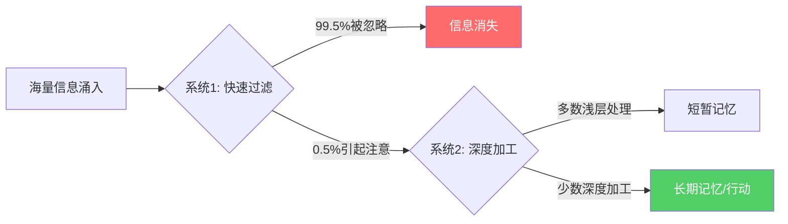
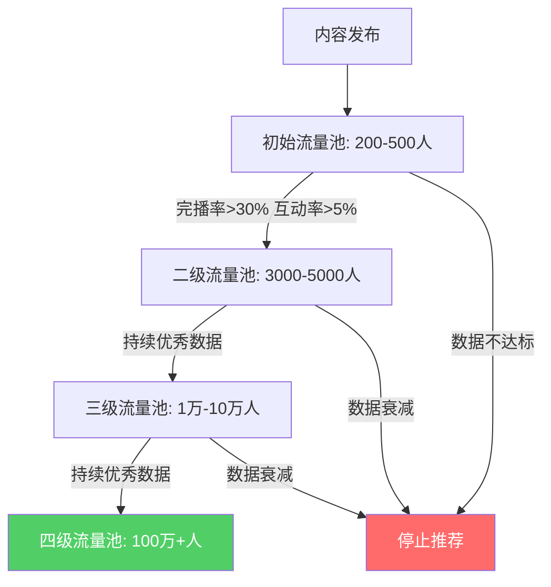
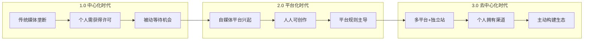
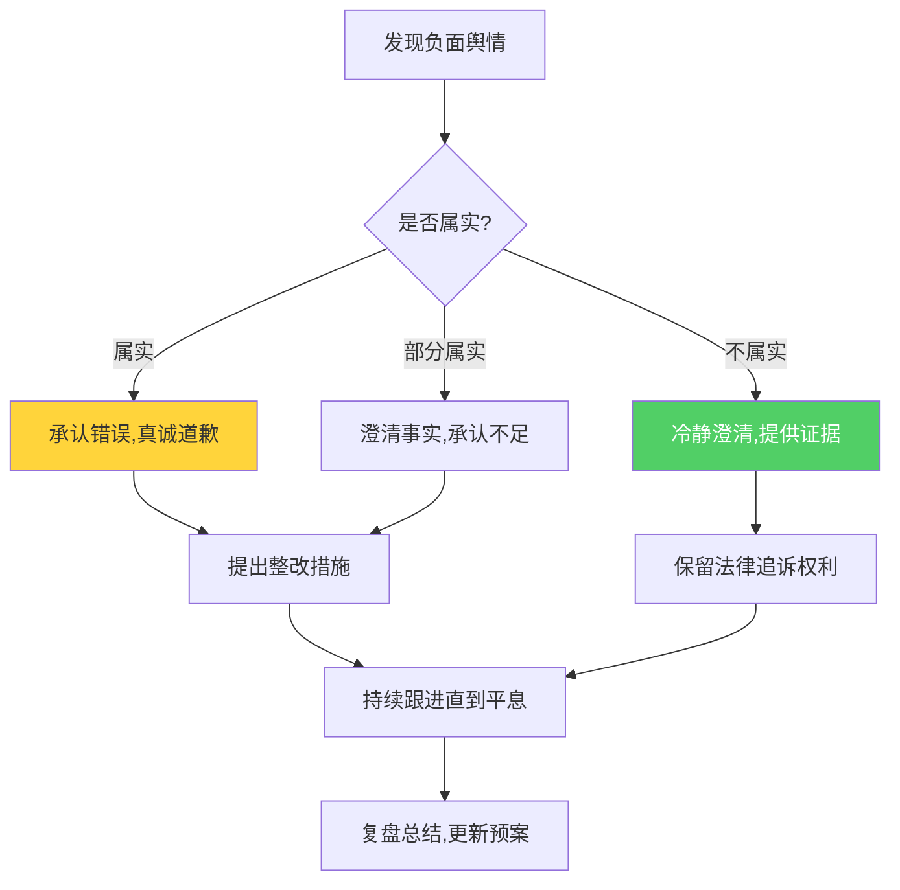
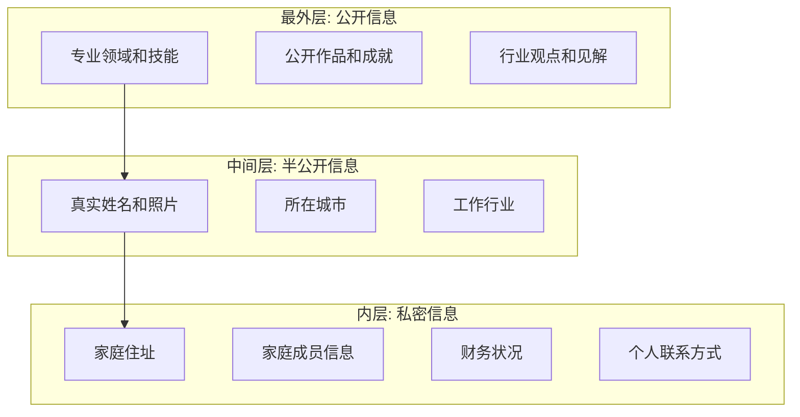

## 六、数字化时代的个人品牌挑战

数字化时代彻底重塑了个人品牌的底层逻辑。从注意力的争夺方式、信息的传播机制、品牌的建设路径，到风险的形态和应对策略，每一个环节都在经历根本性变革。本章系统梳理数字化时代个人品牌面临的六大核心挑战，提供从认知到实操的完整应对框架。

---

### 6.1 注意力经济下的品牌生存

#### 6.1.1 注意力稀缺的本质

赫伯特·西蒙（Herbert Simon）早在1971年就预言："信息的丰富意味着注意力的匮乏。"半个世纪后，这一判断被数据充分验证：

| 指标 | 数值 | 来源 |
|------|------|------|
| 普通人日均接收信息量 | 约34GB，相当于174份报纸 | UCSD人类认知实验室 |
| 平均注意力持续时间 | 从2000年的12秒降至2023年的8秒 | Microsoft/Statistic Brain |
| 社交媒体单条内容决策时间 | 1.7秒（滚动状态下） | Facebook内部研究 |
| 每日解锁手机次数 | 96次（全球均值） | Asurion 2023 |
| 每日屏幕使用时间 | 6小时58分钟（全球均值） | DataReportal 2024 |

注意力经济的核心机制可以用诺贝尔经济学奖得主丹尼尔·卡尼曼的"双系统理论"来解释：人类大脑有两套认知系统——系统1（快速、直觉、自动）和系统2（慢速、理性、费力）。在信息过载环境中，绝大多数内容被系统1在毫秒级别"过滤"掉，只有极少数内容能触发系统2的深度加工。

#### 6.1.2 注意力捕获的科学方法

**第一层：感官层拦截（0-3秒）**

在用户滚动信息流的1.7秒决策窗口内，你必须通过感官刺激"拦截"注意力：

- **视觉锚点**：使用高对比度色彩、人脸特写、异常构图。MIT神经科学实验表明，人脑识别面部的速度仅需100毫秒，比识别文字快10倍。
- **听觉钩子**：短视频前3秒使用突然的声音变化、提问或悬念。播客的前30秒决定了听众是否继续。
- **文字钩子**：标题使用数字（"7个方法"）、悬念（"第5个最意外"）、痛点直击（"你还在……吗？"）。

**第二层：认知层锁定（3-15秒）**

通过"信息缺口"理论（George Loewenstein, 1994）制造好奇心缺口：

1. 展示用户已知的部分信息
2. 暗示还有更重要的未知信息
3. 引导用户主动寻求完整答案

示例：标题"90%的人不知道的沟通技巧"制造了两个信息缺口——具体是什么技巧？为什么90%的人不知道？

**第三层：情感层绑定（15秒-3分钟）**

情绪是记忆的粘合剂。根据Jonah Berger的STEPPS模型，高传播性内容具备以下情绪特征：

| 情绪类型 | 唤醒水平 | 传播效果 | 典型内容 |
|----------|----------|----------|----------|
| 愤怒 | 高 | 极强 | 不公平事件、侵权曝光 |
| 惊讶/敬畏 | 高 | 极强 | 颠覆认知的观点、惊人数据 |
| 焦虑 | 中高 | 强 | 职业危机、健康风险提示 |
| 幽默 | 中 | 强 | 段子、反转、自嘲 |
| 悲伤 | 低 | 弱 | 感人故事（转发率低但深度高） |
| 满足 | 低 | 中 | 解压内容、完美对称 |

**第四层：价值层留存（3分钟以上）**

真正留住用户的是可感知的价值密度。每30秒（文字约每200字）用户会重新评估"继续看下去是否值得"。因此必须持续提供：

- 新信息（"我不知道这个"）
- 新视角（"原来可以这样想"）
- 新方法（"我现在就能用"）
- 情感共鸣（"这说的就是我"）

#### 6.1.3 注意力管理的实操框架

**"3-30-3"内容设计法则**：

- **3秒**：标题/封面/开头必须通过"感官层拦截"测试
- **30秒**：前30秒建立"信息缺口"，让用户产生"必须看完"的动机
- **3分钟**：在3分钟内交付核心价值，同时埋下"下次还想看"的钩子

**注意力ROI评估表**（每条内容发布前自检）：

| 检查项 | 通过标准 | 权重 |
|--------|----------|------|
| 标题是否在2秒内传达核心价值？ | 直觉可理解，无需二次思考 | 25% |
| 前3秒是否有感官钩子？ | 视觉/听觉/文字至少命中一个 | 20% |
| 是否制造了信息缺口？ | 读完标题后会产生"想知道更多"的冲动 | 20% |
| 价值密度是否足够？ | 每100字至少一个新信息点或新观点 | 20% |
| 是否有明确的行动引导？ | 读完后知道下一步该做什么 | 15% |

---

### 6.2 算法时代的品牌传播

#### 6.2.1 算法推荐的基本原理

现代内容平台的推荐系统本质上是一个"注意力分配器"。它通过机器学习模型预测每个用户对每条内容的互动概率，然后将有限的展示机会分配给预测互动率最高的内容。

以抖音/TikTok的推荐机制为例，内容分发遵循"流量池递进"模型：

#### 6.2.2 主流平台算法核心指标

不同平台的算法权重差异显著，内容策略必须针对性调整：

| 平台 | 核心指标 | 次要指标 | 特殊机制 | 内容策略重点 |
|------|----------|----------|----------|--------------|
| 抖音/TikTok | 完播率、互动率 | 分享率、关注率 | 流量池递进、冷启动测试 | 前3秒钩子、节奏紧凑、竖屏优先 |
| B站 | 完播率、一键三连 | 弹幕密度、评论深度 | 起飞推广、必剪流量 | 内容深度、社区感、长视频优势 |
| 微信公众号 | 打开率、分享率 | 完读率、在看数 | 社交分发为主 | 标题决定打开率、深度内容占优 |
| 小红书 | 互动率、收藏率 | 搜索排名、笔记质量分 | 搜索+推荐双引擎 | 实用干货、图文并茂、关键词布局 |
| 知乎 | 赞同数、收藏数 | 回答排名、专业认证 | 搜索长尾流量 | 专业深度、引用权威来源、结构清晰 |
| 视频号 | 社交推荐、完播率 | 分享率、评论率 | 微信社交链加持 | 社交裂变、适配中老年内容 |

#### 6.2.3 算法时代的五项核心策略

**策略一：垂直深耕，建立算法标签**

算法通过内容标签理解"你是谁"，然后将你推荐给对该标签感兴趣的用户。如果你今天发美食、明天发科技、后天发健身，算法无法给你精准打标签，推荐效率会极低。

实操方法：
1. 确定1个一级标签（如"个人成长"）
2. 围绕一级标签展开3-5个二级标签（如"时间管理""沟通技巧""职业规划"）
3. 80%内容围绕二级标签创作，20%内容可适度跨界
4. 每条内容的标题、标签、正文关键词保持一致

**策略二：互动驱动，提升算法权重**

互动率是算法判断内容质量的核心指标。但"互动"不仅仅是点赞——不同互动行为的权重不同：

- **评论 > 分享 > 收藏 > 点赞**（大多数平台的隐性排序）
- 回复评论可以触发"二次推荐"（评论区活跃度被算法纳入评估）
- 在内容中设置"互动钩子"：提问、投票、"评论区告诉我"

**策略三：节奏一致，建立算法信任**

算法偏好"可预测的创作者"——它需要知道你什么时候会发布新内容，才能提前分配推荐资源。

- 确定固定的更新频率（日更/隔日/周更）
- 固定发布时间（测试后找到你的受众活跃高峰）
- 避免长时间断更（超过2周不更新，账号权重会下降）
- 不要一天发10条然后1个月不发——节奏比总量重要

**策略四：数据驱动，持续迭代**

每条内容发布后，跟踪以下核心数据并建立反馈循环：

| 数据指标 | 健康值（参考） | 诊断意义 |
|----------|---------------|----------|
| 点击率/打开率 | >5% | 标题和封面是否吸引人 |
| 完播率/完读率 | >30%（短视频）/ >40%（文章） | 内容质量是否足够 |
| 互动率 | >3% | 内容是否引发共鸣 |
| 涨粉率 | >1%（相对曝光量） | 是否建立了个人吸引力 |
| 取关率 | <0.5% | 内容是否符合粉丝预期 |

**策略五：反算法依赖，构建私域流量**

完全依赖算法是危险的——平台政策变化可以一夜之间让你的流量归零。必须将公域流量沉淀到私域：

- 公域（抖音/小红书/知乎）→ 半私域（微信群/知识星球）→ 私域（个人微信/邮件列表/独立网站）
- 每1000个公域粉丝，目标沉淀100个到半私域，10个到私域
- 私域用户的价值是公域用户的10-100倍（更高的触达率、转化率、忠诚度）

---

### 6.3 个人品牌的"去中心化"趋势

#### 6.3.1 从中心化到去中心化的演变

个人品牌的传播渠道经历了三个时代：

#### 6.3.2 当前主流平台矩阵与选择策略

**内容形态-平台匹配矩阵**：

| 内容形态 | 首选平台 | 次选平台 | 适合人群 |
|----------|----------|----------|----------|
| 深度长文 | 微信公众号、知乎 | 今日头条、简书 | 知识型专家、行业分析师 |
| 短图文 | 小红书 | 微博、朋友圈 | 生活方式类、视觉导向型 |
| 短视频（<1分钟） | 抖音 | 快手、视频号 | 表现力强、节奏感好的创作者 |
| 中长视频（5-30分钟） | B站 | YouTube、视频号 | 深度内容创作者、教程类 |
| 超长视频（30分钟+） | B站、YouTube | 播客 | 深度访谈、纪录片式内容 |
| 音频/播客 | 小宇宙、喜马拉雅 | Apple Podcasts、网易云 | 口才好、声音有辨识度的人 |
| 专业知识 | 知乎、CSDN | 掘金、少数派 | 技术专家、学术研究者 |
| 短想法/观点 | 微博、Twitter/X | 即刻、Threads | 时事评论、快速观点输出 |

**平台选择的三条原则**：

1. **受众在哪里，你就去哪里**：先调研目标受众的主要活动平台，而不是选自己最熟悉的平台
2. **一个主阵地，两三个辅助平台**：不要试图同时经营所有平台——精力分散等于全面平庸
3. **内容可复用化**：一条核心内容改编为多种形态（长文→图文→短视频→播客），降低创作成本

#### 6.3.3 独立站的重要性

在"去中心化"趋势下，拥有一个完全由自己控制的"数字资产"变得越来越重要：

- **平台风险对冲**：平台封号、政策变化、算法调整都可能让你一夜归零
- **SEO长尾价值**：独立网站的内容可以通过搜索引擎持续获取流量，不像社交平台那样"发完就沉"
- **品牌专业形象**：一个设计精良的个人网站比一个社交媒体主页更显专业
- **数据所有权**：你可以完全掌控用户数据和访问数据，不依赖平台

独立站建设的最小可行方案：
1. 域名注册（选择与个人品牌相关的域名）
2. 静态网站生成器（Hugo/Hexo/Jekyll）或建站工具（WordPress/Notion+Super）
3. 托管服务（GitHub Pages免费/Vercel/Netlify）
4. 基础SEO设置（meta标签、sitemap、结构化数据）
5. 内容迁移：将核心作品逐步同步到独立站

#### 6.3.4 Web3.0与个人品牌的未来形态

Web3.0技术正在为个人品牌带来新的可能性：

- **NFT与数字所有权**：创作者可以将作品铸造为NFT，实现真正的数字所有权和收益分成
- **去中心化社交协议**：如Nostr、Farcaster等协议让用户拥有社交关系图谱，不被单一平台绑架
- **代币化社区**：通过发行个人代币或加入DAO，将粉丝关系转化为经济协作关系
- **去中心化身份（DID）**：个人品牌不再绑定在某个平台上，而是通过去中心化身份协议实现跨平台互通

需要注意的是，Web3.0目前仍处于早期阶段，大多数普通用户还无法便捷地使用这些工具。作为个人品牌建设者，现阶段应关注趋势、保持学习，但不必急于全面投入。

---

### 6.4 个人品牌的风险管理

#### 6.4.1 数字化时代的四大风险类型

**类型一：信息永久性风险**

互联网的"数字记忆"几乎是永久的。Wayback Machine可以追溯网站的每一次修改，社交媒体的截图可以在任何地方传播，即使你删除了原文。

典型案例：
- 2020年某知名企业家10年前的微博言论被翻出，引发大规模舆论危机
- 某公众人物在私人论坛的发言被截图传播，导致商业合作全部终止
- 多位明星早年在社交媒体上的不当发言被系统性挖掘，形成"黑历史合集"

应对策略：
- 定期审计自己的数字足迹（Google搜索自己的名字、常用ID）
- 对于不确定的内容，宁可不发也不要发了再删
- 区分"个人账号"和"品牌账号"，在个人账号上也要保持基本的一致性

**类型二：语境坍塌风险**

社会学家danah boyd提出的"语境坍塌"（Context Collapse）概念指出：在社交媒体上，不同的社交圈层（家人、朋友、同事、粉丝、陌生人）被压缩到同一个信息流中。你在不同语境下说的话，可能被完全不在同一语境中的人解读。

应对策略：
- 假设你发布的每一条内容都会被你最不想看到的人看到
- 在发布争议性内容前，用"如果我的老板/父母/最重要的客户看到这条，我会怎么想？"来自检
- 不要在情绪激动时发布任何内容——至少等1小时

**类型三：舆论反转风险**

互联网舆论的特点是"快起快落"。一个人可能因为一条视频一夜爆红，也可能因为一句话瞬间"塌房"。

舆论反转的典型模式：
1. **道德审判型**：某言论/行为被认为违反主流价值观，引发集体谴责
2. **人设崩塌型**：长期经营的正面形象与新发现的负面信息产生巨大反差
3. **利益冲突型**：被发现存在未披露的利益关系（广告未标注、数据造假等）
4. **过度营销型**：频繁的商业变现行为导致粉丝信任崩塌

**类型四：AI深度伪造风险**

2024年以来，AI深度伪造（Deepfake）技术的进步给个人品牌带来了全新威胁：
- 你的面部形象可能被用于制作虚假视频
- 你的声音可能被克隆用于诈骗电话
- AI生成的虚假"证据"可能被用于恶意攻击

应对策略：
- 减少在公开场合暴露高质量的面部视频和音频素材（难以完全避免，但可以降低风险）
- 注册并验证官方账号，让粉丝知道"哪个是真的你"
- 关注AI检测工具的发展，必要时可以使用技术手段自证清白
- 提前准备好"如果出现深度伪造内容"的应对方案

#### 6.4.2 系统性风险管理框架

**预防层——建立"数字卫生"习惯**：

| 频率 | 行动 | 工具 |
|------|------|------|
| 每次发布前 | 内容自审：是否有歧义？是否可能被断章取义？ | 自检清单 |
| 每周 | 搜索自己的名字，查看是否有负面信息 | Google Alerts、百度搜索 |
| 每月 | 审查隐私设置，清理不必要的公开信息 | 各平台隐私设置 |
| 每季度 | 审计数字足迹，注销不再使用的账号 | JustDeleteMe |
| 每年 | 全面品牌健康检查，评估舆情风险 | 舆情监测工具 |

**监控层——实时舆情感知**：

- 免费方案：Google Alerts（设置姓名、品牌名、常用ID等关键词）
- 付费方案：识微商情、鹰眼速读、Brandwatch（企业级）
- 平台内监控：各平台的"提及"和"标签"通知功能
- 社群监控：在核心粉丝群中设置"信息员"，第一时间发现异常

**响应层——危机应对SOP**：

当负面舆情出现时，按以下流程操作：

危机回应的五条铁律：
1. **速度第一**：24小时内必须有回应，沉默会被解读为"默认"
2. **态度真诚**：不要甩锅、不要狡辩、不要删帖（删帖会引发更大的愤怒）
3. **事实说话**：用证据和数据回应，而不是情绪和口号
4. **行动导向**：不要只说"对不起"，要说明"我会怎么做"
5. **适度沉默**：回应后不要反复纠缠，让事件自然冷却

**恢复层——品牌修复策略**：

危机过后，品牌修复需要时间和策略：
- **短期（1-2周）**：减少争议性内容，发布正面、中性的内容重建基础
- **中期（1-3个月）**：通过公益活动、专业分享等方式重建正面形象
- **长期（3-12个月）**：用持续的正面表现覆盖负面记忆，搜索引擎优化压制负面结果

---

### 6.5 AI时代对个人品牌的冲击与机遇

#### 6.5.1 AI对内容创作的颠覆

生成式AI（ChatGPT、Midjourney、Sora等）的出现正在从根本上改变内容创作的门槛和生态：

**冲击面**：
- 内容供给量爆炸式增长——AI可以日产数百篇文章/图片/视频
- 信息同质化严重——大量AI生成内容使用相似的结构和表达
- "专业"的门槛被拉平——AI让普通人也能产出"看起来专业"的内容
- 真假难辨——AI生成的虚假内容可能损害任何人的品牌

**机遇面**：
- 创作效率大幅提升——AI可以处理初稿、素材整理、数据分析等重复性工作
- 个性化内容规模化——借助AI，一个人可以同时维护多个细分领域的品牌
- 新的专业壁垒——当内容生产变得容易时，"真实经验"和"独特视角"成为稀缺品

#### 6.5.2 AI时代的个人品牌差异化策略

当AI可以生产"80分"的内容时，个人品牌的差异化必须建立在AI难以复制的维度上：

| 差异化维度 | AI能做到 | AI做不到 | 策略重点 |
|-----------|----------|----------|----------|
| 信息整合 | 能 | - | 不要以此为核心竞争力 |
| 逻辑分析 | 能 | - | 不要以此为核心竞争力 |
| 个人真实经历 | 不能 | 能 | **强化个人故事和真实案例** |
| 独特观点和立场 | 弱 | 能 | **敢于表达有争议的原创观点** |
| 情感连接和信任 | 弱 | 能 | **用真人形象、真人声音建立信任** |
| 实战经验和手感 | 不能 | 能 | **展示"做过的"而非"知道的"** |
| 社区和关系网络 | 不能 | 能 | **构建真实的人际连接** |
| 审美和风格 | 弱 | 能 | **培养独特的视觉/语言风格** |

核心结论：在AI时代，**"你做过什么"比"你知道什么"更重要，"你是谁"比"你能写什么"更重要**。个人品牌的核心资产从"内容生产能力"转向"真实身份的信任价值"。

#### 6.5.3 AI工具的合理使用框架

个人品牌建设者应该将AI视为"能力放大器"而非"替代品"：

**可以用AI做的**：
- 资料收集和初步整理
- 初稿框架搭建
- 标题和开头的多版本A/B测试
- 数据分析和趋势洞察
- 外语内容的翻译和本地化
- 封面图、配图的快速生成

**不应该让AI做的**：
- 核心观点的生成（必须是你自己的思考）
- 个人经历的编造（真实性是信任的基础）
- 与粉丝的互动回复（真诚的连接不能自动化）
- 价值观和立场的表达（这定义了"你是谁"）

---

### 6.6 数据隐私与数字身份安全

#### 6.6.1 个人品牌建设中的隐私悖论

个人品牌建设存在一个根本性矛盾：品牌需要曝光，但安全需要隐私。如何在两者之间找到平衡？

**高风险行为清单**：
- 在公开内容中暴露家庭住址、工作单位等精确位置信息
- 频繁展示贵重物品、大额消费（可能成为社会工程攻击的目标）
- 分享孩子的照片、学校、日常行程
- 使用真实生日、手机号作为账号信息
- 在多个平台使用相同的密码

**隐私保护的"洋葱模型"**：

原则：对外展示最外层信息，对信任的社群分享中间层信息，核心私密信息绝不公开。

#### 6.6.2 数字身份安全实操

- **账号安全**：所有平台启用双因素认证（2FA），使用密码管理器（1Password/Bitwarden），不同平台使用不同密码
- **信息隔离**：品牌专用邮箱、品牌专用手机号、品牌专用设备（至少是独立的浏览器Profile）
- **定期审计**：每季度检查"Have I Been Pwned"（haveibeenpwned.com）查看账号是否泄露
- **社交工程防护**：警惕以"合作""采访""粉丝"为名义的钓鱼信息，不轻易点击陌生链接

---

### 6.7 数字化个人品牌的长期主义

#### 6.7.1 速朽与永存的辩证

数字化时代有两种极端的个人品牌策略：

- **流量型策略**：追逐热点、频繁更新、快速变现——优点是短期内获取大量关注，缺点是注意力消耗快、品牌生命周期短
- **沉淀型策略**：深度内容、长期积累、慢速增长——优点是品牌资产持久、粉丝忠诚度高，缺点是前期增长缓慢、变现周期长

最健康的策略是两者的结合：**70%的沉淀型内容构建品牌根基，30%的流量型内容获取新用户**。

#### 6.7.2 防止品牌疲劳的策略

长期运营个人品牌面临的最大挑战之一是"品牌疲劳"——创作者自己感到倦怠，受众也产生审美疲劳。

应对方法：
- **内容节奏的"呼吸感"**：不要永远输出干货，穿插个人生活、幕后花絮、轻松内容
- **定期"品牌焕新"**：每1-2年更新视觉风格、内容结构、表达方式
- **建立内容团队**：当品牌发展到一定规模，从"一人创作"过渡到"团队协作"
- **设定边界**：明确哪些是可以商业化的、哪些是必须保持纯粹的

#### 6.7.3 从个人品牌到组织品牌

当个人品牌发展到一定阶段，你将面临一个关键决策：是否从"个人品牌"升级为"组织品牌"？

| 维度 | 个人品牌 | 组织品牌 |
|------|----------|----------|
| 核心资产 | 个人信誉和关系 | 团队能力和体系 |
| 可扩展性 | 有限（受个人精力限制） | 高（可复制和分工） |
| 抗风险能力 | 低（个人出问题则品牌崩塌） | 高（分散风险） |
| 变现天花板 | 中等 | 高 |
| 情感连接 | 强（用户与真人建立连接） | 弱（用户与符号建立连接） |

过渡路径建议：先用个人品牌获取初始用户和信任，再逐步引入团队和体系，最终实现品牌与个人的适度解耦。但不要过早"去个人化"——在品牌根基不稳时就隐藏个人元素，等于放弃了最大的竞争优势。

---

### 6.8 数字化个人品牌健康度自检清单

定期使用以下清单评估你的数字化个人品牌健康状态：

**基础层（必须达标）**：
- [ ] 在至少一个主流平台有稳定的更新记录
- [ ] 个人简介清晰传达"你是谁、做什么、能提供什么价值"
- [ ] 所有平台的品牌信息（名称、头像、简介）保持一致
- [ ] 已启用所有账号的双因素认证
- [ ] 定期搜索自己的名字，了解公众认知

**进阶层（持续优化）**：
- [ ] 有明确的内容策略（选题方向、更新频率、发布节奏）
- [ ] 有数据追踪和分析机制（关键指标每周复盘）
- [ ] 公域流量正在向私域沉淀（微信群/邮件列表/独立站）
- [ ] 有危机应对预案（至少思考过"如果出现负面舆情怎么办"）
- [ ] 内容中有一定比例的个人故事和原创观点（非纯搬运/AI生成）

**高阶层（长期目标）**：
- [ ] 拥有独立的数字资产（个人网站/博客）
- [ ] 品牌可以适度与个人解耦（有团队或体系支撑）
- [ ] 建立了跨平台的内容分发和复用体系
- [ ] 在行业内有可识别的差异化标签
- [ ] 品牌具备一定的抗风险能力（不依赖单一平台或单一内容形式）

---

数字化时代的个人品牌建设，既是技术活，更是持久战。技术在变、平台在变、算法在变，但人性中对真实、有价值、可信赖的内容的渴望不会变。抓住这个不变的本质，以长期主义的心态持续投入，你的个人品牌就能穿越技术周期，在数字世界中扎下深根。
