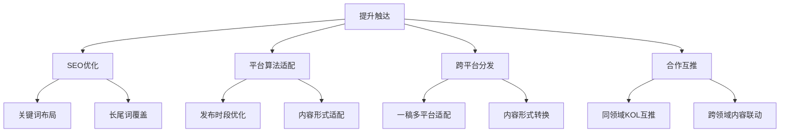
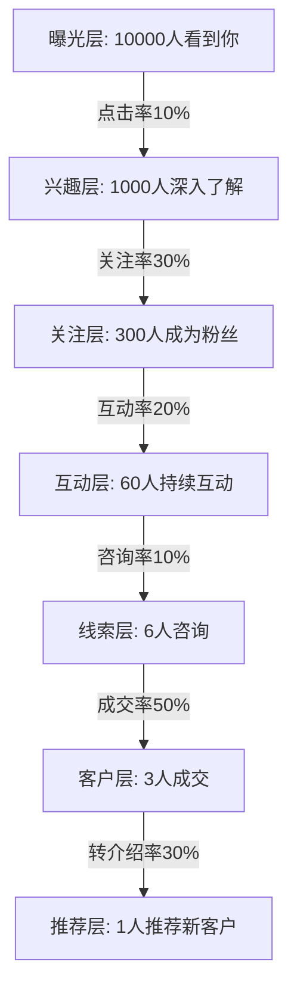
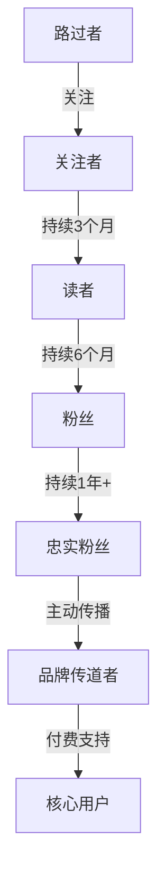
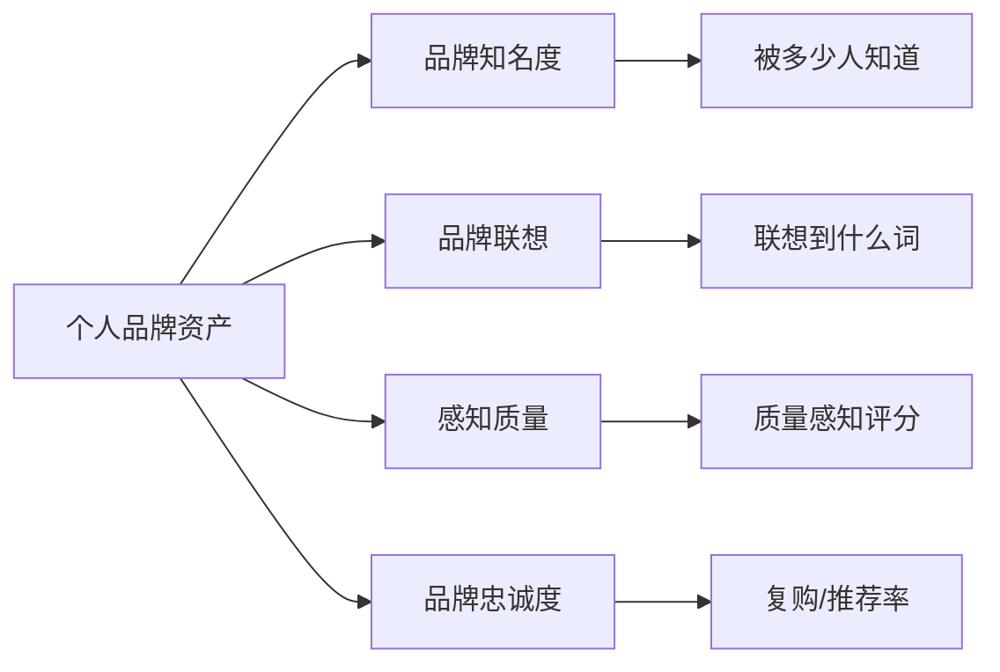

## 七、个人品牌的衡量指标

> "如果你无法衡量它，你就无法管理它。"——彼得·德鲁克

个人品牌建设是一个长期过程，但"长期"不等于"模糊"。许多人在打造个人品牌时陷入一个困境：投入了大量时间和精力，却不知道品牌到底发展得如何——粉丝涨了是好事吗？阅读量下降意味着什么？被大V转发一次值多少钱？没有清晰的衡量体系，品牌建设就像闭眼开车，凭感觉走，直到撞墙才发现方向错了。

本节将建立一套完整的个人品牌衡量框架，涵盖可量化的硬指标和需要感知的软指标，帮助你从"凭感觉做品牌"升级到"用数据驱动品牌"。

### 7.1 为什么衡量个人品牌如此重要

#### 7.1.1 衡量的本质：从模糊感知到精确反馈

人类天生有一种倾向——对自己投入心血的事物给予过高评价。心理学称之为"宜家效应"（IKEA Effect）：自己组装的家具，你会觉得比实际质量更好。个人品牌同样如此：你发了一篇文章，朋友说"写得不错"，你就觉得品牌在进步。但这种模糊的正反馈无法指导决策。

衡量的核心价值在于三个层面：

| 层面 | 没有衡量体系 | 有衡量体系 |
|------|-------------|-----------|
| **方向判断** | "我感觉品牌在进步" | "过去3个月认知度提升27%" |
| **策略调整** | "不知道哪种内容效果好" | "深度长文互动率是短视频的2.3倍" |
| **资源分配** | "所有平台都发一遍" | "知乎引流效率最高，集中投入" |
| **问题诊断** | "最近好像没什么人关注了" | "搜索指数下降，但互动率上升——说明存量用户更忠诚" |
| **投资回报** | "花了这么多时间值不值？" | "每小时内容产出带来12个精准线索" |

#### 7.1.2 衡量≠虚荣：区分"虚荣指标"与"可行动指标"

并非所有数字都有价值。硅谷投资者Dave McClure提出的"虚荣指标"（Vanity Metrics）概念同样适用于个人品牌：

**虚荣指标**——看起来漂亮，但无法指导行动：
- 总粉丝数（10万粉丝，但90%是僵尸号有什么用？）
- 总阅读量（累计100万阅读，但不知道谁在读、读了多久）
- 单次爆款数据（一篇文章10万+，但其他文章平均只有500）

**可行动指标**——能直接指导策略调整：
- 互动率变化趋势（内容质量的直接信号）
- 粉丝来源渠道分布（知道在哪里投入更多）
- 内容完读率/完播率（受众真正消费了多少）
- 咨询/合作转化路径（品牌如何转化为商业价值）

判断标准很简单：**如果你看到这个数字，能立刻做出一个具体的行动决策，它就是可行动指标；如果只是截图发朋友圈，它就是虚荣指标。**

### 7.2 硬指标体系：可量化的品牌健康度

硬指标是可以用数字精确衡量的指标，它们构成品牌健康度的"仪表盘"。以下从五个维度展开。

#### 7.2.1 触达与曝光指标

触达是品牌的基础——你必须先被看到，才有可能被记住。

**核心指标及其计算方式：**

| 指标 | 定义 | 计算公式 | 健康基准 |
|------|------|---------|---------|
| 曝光量（Impressions） | 内容被展示的总次数 | 平台后台直接统计 | 因领域而异，关注趋势 |
| 触达人数（Reach） | 看到内容的独立用户数 | 平台后台统计（去重） | 曝光量的30%-60% |
| 搜索指数 | 用户主动搜索你名字的频率 | 百度指数/微信指数 | 稳中有升 |
| 媒体提及量 | 你被其他媒体/账号提及的次数 | 手动统计或舆情工具 | 每月≥1次为活跃 |

**关键区分——触达与曝光的差异：**

假设你在公众号发了一篇文章，被100个用户看到（触达=100），其中50人刷到了两次（曝光=150）。曝光量虚高，触达人数才是真实的"有多少人看到了你"。

**提升触达的策略优先级：**

#### 7.2.2 互动与参与指标

互动是品牌生命力的核心信号。一个有1000个真正互动的粉丝的账号，远比10万个沉默粉丝有价值。

**核心互动指标：**

| 指标 | 定义 | 计算公式 | 健康基准 |
|------|------|---------|---------|
| 互动率 | 内容获得互动的比例 | (点赞+评论+转发+收藏) ÷ 曝光量 × 100% | >3%为健康，>5%为优秀 |
| 评论率 | 触发评论的能力 | 评论数 ÷ 曝光量 × 100% | >0.5%为健康 |
| 转发/分享率 | 内容被传播的意愿 | 转发数 ÷ 曝光量 × 100% | >1%为优秀 |
| 私信量 | 主动寻求连接的意愿 | 平台私信数 | 持续有私信为健康 |
| 评论质量 | 评论的深度和相关性 | 人工评估（非纯表情评论占比） | >60%有实质内容 |

**互动率的行业基准参考：**

不同领域的互动率差异很大，以下是基于主要平台数据的参考区间：

| 领域 | 公众号互动率 | 抖音互动率 | 知乎互动率 | B站互动率 |
|------|------------|-----------|-----------|----------|
| 科技/编程 | 2%-4% | 3%-6% | 4%-8% | 5%-10% |
| 职场/成长 | 3%-6% | 4%-8% | 5%-10% | 4%-8% |
| 生活/美食 | 4%-8% | 6%-12% | 3%-6% | 6%-12% |
| 教育/知识 | 2%-5% | 3%-7% | 6%-12% | 5%-9% |
| 商业/财经 | 1%-3% | 2%-5% | 3%-7% | 3%-7% |

**互动质量的深层分析：**

不要只看互动数量，要分析互动模式。以下是五种互动模式及其品牌含义：

| 互动模式 | 典型表现 | 品牌含义 | 应对策略 |
|---------|---------|---------|---------|
| 消费型互动 | 点赞、收藏但不评论 | 内容有用但品牌感弱 | 增加互动引导，提升评论区价值 |
| 对话型互动 | 评论提问、讨论 | 品牌有感召力 | 积极回复，培养社区氛围 |
| 传播型互动 | 转发、@朋友 | 品牌有传播力 | 创造更多"值得分享"的内容 |
| 行动型互动 | 按建议执行并反馈 | 品牌有影响力 | 收集用户案例，放大口碑 |
| 捍卫型互动 | 主动维护你的观点 | 品牌有忠诚度 | 最高价值互动，重点维护 |

#### 7.2.3 受众增长与留存指标

增长是品牌势能的体现，但盲目追求增长可能适得其反。

**核心指标：**

| 指标 | 定义 | 计算公式 | 健康基准 |
|------|------|---------|---------|
| 净增粉丝数 | 新增减去流失 | 新增粉丝 - 取关/取消关注 | 持续为正 |
| 粉丝增长率 | 增长的速度 | 本月净增 ÷ 上月总粉丝 × 100% | 月增2%-5%为健康 |
| 取关率 | 流失速度 | 月取关数 ÷ 月总粉丝 × 100% | <2%为健康 |
| 粉丝来源分布 | 新粉从哪里来 | 各渠道新增占比 | 多渠道均衡 |
| 回访率 | 老用户再次访问 | 回访UV ÷ 总UV × 100% | >30%为高粘性 |

**增长陷阱：粉丝暴涨可能是坏信号**

以下几种"增长"需要警惕：

- **抽奖涨粉**：一次性涌入大量非目标用户，互动率暴跌，拉低算法权重
- **蹭热点涨粉**：短期暴涨但取关率极高，受众画像混乱
- **互关互粉**：虚假繁荣，对方根本不会看你的内容
- **买粉**：最严重的自欺欺人，平台算法会降权惩罚

健康的增长模式是**"缓慢但稳定"**——月增2%-5%，取关率<2%，新增粉丝互动率不低于存量粉丝。如果新增粉丝互动率远低于存量，说明来的人"不对"。

#### 7.2.4 内容效率指标

内容效率衡量你的时间投入产出比——同样的时间，哪种内容带来更大的品牌价值。

| 指标 | 定义 | 计算公式 | 健康基准 |
|------|------|---------|---------|
| 单篇互动率 | 每篇内容的平均互动 | 总互动数 ÷ 发布篇数 | 持续上升趋势 |
| 内容生命周期 | 内容持续获得流量的时间 | 从发布到最后一次互动的天数 | >7天为长尾内容 |
| 爆款率 | 高于平均互动2倍以上的内容比例 | 爆款篇数 ÷ 总篇数 × 100% | >5%为优秀 |
| 内容转化率 | 内容带来的行动转化 | 通过内容获客数 ÷ 内容总触达 × 100% | 因领域而异 |
| 小时产出价值 | 每小时内容创作带来的品牌增益 | 品牌得分增量 ÷ 创作小时数 | 持续上升趋势 |

**内容效率矩阵：**

用一个简单的2×2矩阵来评估你的内容策略：

                    互动率高
                       │
     ┌─────────────────┼─────────────────┐
     │                 │                 │
     │   ② 潜力内容    │   ① 明星内容     │
     │   (需要更多曝光) │   (加大投入)     │
     │                 │                 │
低曝光 ─────────────────┼────────────────── 高曝光
     │                 │                 │
     │   ④ 淘汰内容    │   ③ 流量内容     │
     │   (放弃或改造)   │   (优化互动引导) │
     │                 │                 │
     └─────────────────┼─────────────────┘
                       │
                    互动率低

- **①明星内容**（高曝光+高互动）：分析其特征，批量复制
- **②潜力内容**（低曝光+高互动）：可能是平台算法未推荐，尝试更换标题/封面/发布时间
- **③流量内容**（高曝光+低互动）：标题吸引了人但内容不匹配，优化互动引导
- **④淘汰内容**（低曝光+低互动）：果断放弃此类主题或形式

#### 7.2.5 商业转化指标

个人品牌最终要产生商业价值——不一定是直接变现，但至少要能带来机会。

| 指标 | 定义 | 计算方式 | 健康基准 |
|------|------|---------|---------|
| 咨询转化量 | 因品牌而来的咨询请求 | 后台统计或CRM记录 | 持续有咨询为健康 |
| 合作邀约量 | 商务合作/邀请数量 | 月度统计 | 与影响力同步增长 |
| 客单价 | 单次合作/服务的平均价值 | 总收入 ÷ 合作次数 | 逐季度上升 |
| 转介绍率 | 客户主动推荐的比例 | 转介绍客户 ÷ 总客户 × 100% | >20%为优秀 |
| 品牌溢价 | 相比同行的收费水平 | 你的费率 ÷ 行业平均费率 | >1.2倍有溢价 |

**商业转化漏斗：**

每一层的转化率都值得优化。从10000曝光到3个成交，整体转化率仅为0.03%——这在个人品牌领域是正常水平。如果能将"兴趣→关注"的转化率从30%提升到40%，最终成交量就从3个增加到4个，提升33%。

### 7.3 软指标体系：需要感知的品牌质感

硬指标告诉你"发生了什么"，软指标告诉你"意味着什么"。两者缺一不可。

#### 7.3.1 品牌认知度

品牌认知度衡量的是"提到你的名字，多少人知道你是谁"。它分为三个层次：

| 层次 | 定义 | 衡量方法 | 基准 |
|------|------|---------|------|
| 辅助认知 | 提示后想起你 | "你知道XX吗？"问卷 | 目标人群中>30% |
| 无辅助认知 | 未提示时主动提到你 | "提到XX领域，你会想到谁？" | 目标人群中>10% |
| 首选认知 | 第一个想到你 | "你第一个想到的是谁？" | 目标人群中>5% |

**实操测量方法：**

1. **朋友圈投票法**：在目标受众聚集的社群发起投票"提到[你的领域]，你第一个想到谁？"
2. **搜索联想测试**：在百度/知乎搜索框输入你的名字，看联想词是否准确
3. **介绍人测试法**：请朋友向陌生人介绍你，观察他们用的关键词是否与你的品牌定位一致
4. **竞品对比法**：在行业搜索中统计你被提及的频率与排名

#### 7.3.2 品牌联想质量

品牌联想质量衡量的是"人们想到你时，脑海中出现的是什么"。

**品牌联想词云测试（实操方法）：**

向20-50位目标受众发放简单问卷，只问一个问题："用3个词形容[你的名字]在你心中的印象。"然后统计词频，生成词云。

理想的品牌联想词云应该是：

正面词（占比>70%）：
  专业、靠谱、有深度、实战派、真诚、有见地、持续输出

中性词（占比<20%）：
  低调、技术型、公众号作者、程序员

负面词（占比<10%）：
  （理想情况几乎没有）

**联想偏差的诊断与纠正：**

| 诊断结果 | 问题 | 纠正方向 |
|---------|------|---------|
| 联想词过于分散 | 品牌定位不清晰 | 收窄内容领域，强化核心标签 |
| 联想词偏中性 | 品牌个性不足 | 增加观点输出、人格化表达 |
| 出现负面联想 | 存在认知偏差 | 找到偏差来源，针对性修正 |
| 联想词与定位不符 | 传播与定位脱节 | 检查内容策略，回归核心定位 |
| 联想词过于单一 | 品牌维度不够丰富 | 适当拓展内容维度 |

#### 7.3.3 受众忠诚度

忠诚度衡量的是"有多少人持续关注你超过一年"。它是品牌深度的核心指标。

**忠诚度分层模型：**

每一层的留存率都是关键指标：

| 层级 | 健康留存率 | 提升策略 |
|------|-----------|---------|
| 路过者→关注者 | >10% | 优化个人简介、首次内容印象 |
| 关注者→读者 | >40% | 持续产出高质量内容 |
| 读者→粉丝 | >30% | 建立情感连接，人格化互动 |
| 粉丝→忠实粉丝 | >50% | 提供独特价值，培养归属感 |
| 忠实粉丝→传道者 | >20% | 创造传播素材，激励推荐行为 |
| 传道者→核心用户 | >10% | 提供付费价值，深度服务 |

**测量忠诚度的简易方法：**

- 统计关注超过12个月的粉丝占比（多数平台不直接提供此数据，可通过评论区"老粉"互动比例估算）
- 统计连续阅读/观看你内容超过6个月的用户比例
- 发布一条"如果你关注我超过一年，请在评论区打1"的互动帖，统计响应

#### 7.3.4 行业影响力

行业影响力衡量的是"你的观点在行业内被讨论和引用的频率"。

**影响力信号清单：**

| 信号 | 强信号 | 中等信号 | 弱信号 |
|------|--------|---------|--------|
| 引用频率 | 被行业报告/书籍引用 | 被同行在文章中提及 | 被转载但未署名 |
| 邀请频率 | 被邀请做主题演讲 | 被邀请参与圆桌讨论 | 被邀请投稿 |
| 咨询频率 | 行业决策者主动咨询 | 同行主动请教 | 被@提问 |
| 讨论频率 | 你的观点被广泛讨论 | 你的内容被转发讨论 | 被点赞但不讨论 |
| 媒体频率 | 被主流媒体采访 | 被行业媒体报道 | 被自媒体提及 |

**影响力的三个维度：**

1. **垂直影响力**：在你的专业领域内有多大声量（最重要）
2. **跨界影响力**：能否影响相邻领域的人（差异化竞争力）
3. **决策影响力**：能否影响他人的决策和行为（终极影响力）

#### 7.3.5 危机抵抗力

危机抵抗力衡量的是"面对负面事件时，品牌能承受多大的冲击"。这是一个经常被忽视但至关重要的指标。

**危机抵抗力的评估框架：**

| 评估维度 | 低抵抗力 | 中等抵抗力 | 高抵抗力 |
|---------|---------|-----------|---------|
| 负面评论处理 | 删评/无视 | 简单回应 | 真诚沟通+改进 |
| 粉丝护盘 | 无人帮你说话 | 少数铁粉维护 | 大量粉丝主动辩护 |
| 信任恢复速度 | 数月甚至永久 | 数周恢复 | 数天恢复 |
| 品牌缓冲区 | 无历史信誉积累 | 有一定信誉储蓄 | 长期一致性的信誉富矿 |

**增强危机抵抗力的"信任储蓄"策略：**

危机抵抗力不是在危机发生时建立的，而是在日常中通过"信任储蓄"逐步积累的。每一次高质量的内容输出、每一次真诚的互动、每一次兑现承诺，都是在"信任银行"中存款。当危机发生时，你从银行中支取信任来度过难关。

### 7.4 衡量工具与平台

#### 7.4.1 各平台自带数据工具

| 平台 | 数据工具 | 可获取指标 | 局限性 |
|------|---------|-----------|--------|
| 微信公众号 | 公众号后台 | 阅读、转发、关注、取关、用户画像 | 数据延迟24-48小时 |
| 知乎 | 创作者中心 | 阅读、赞同、收藏、关注者画像 | 无法追踪跨平台转化 |
| 抖音 | 创作者服务中心 | 播放、互动、完播率、粉丝画像 | 算法波动大，数据不稳定 |
| B站 | 创作中心 | 播放、弹幕、投币、粉丝画像 | 弹幕质量需要人工判断 |
| 小红书 | 专业号后台 | 笔记数据、粉丝画像、搜索数据 | 商业化数据需付费解锁 |
| 微博 | 微博数据中心 | 阅读、互动、粉丝、热点追踪 | 僵尸粉问题严重 |

#### 7.4.2 第三方分析工具

| 工具 | 用途 | 适用场景 | 费用 |
|------|------|---------|------|
| 新榜/新抖 | 跨平台数据对比 | 多平台运营者 | 基础免费，高级付费 |
| 百度指数 | 搜索热度趋势 | 评估品牌搜索量 | 免费 |
| 微信指数 | 微信生态搜索热度 | 评估微信内品牌热度 | 免费 |
| 5118 | 关键词排名和流量 | SEO优化 | 基础免费 |
| 灰豚数据 | 短视频平台分析 | 抖音/快手运营者 | 付费 |
| 西瓜数据 | 公众号分析 | 公众号运营者 | 付费 |
| 飞瓜数据 | 小红书分析 | 小红书运营者 | 付费 |
| Google Trends | 全球搜索趋势 | 有海外受众的创作者 | 免费 |

#### 7.4.3 自建衡量体系

平台数据只告诉你"发生了什么"，自建衡量体系能告诉你"意味着什么"。

**推荐的自建衡量工具：**

**1. 品牌健康度仪表盘（Google Sheets/Notion模板）**

┌─────────────────────────────────────────────────┐
│              个人品牌月度仪表盘                    │
├─────────────────────────────────────────────────┤
│ 曝光量    ████████████████░░░░  12.3万 (+18%)    │
│ 互动率    ██████████████░░░░░░  4.2%  (+0.3%)    │
│ 净增粉丝  ████████████░░░░░░░░  856   (+12%)     │
│ 咨询转化  ████████░░░░░░░░░░░░  23    (+5)       │
│ 内容效率  ██████████████░░░░░░  4.5h/篇 (-0.3h)  │
│ 搜索指数  ████████████████░░░░  1250  (+15%)     │
├─────────────────────────────────────────────────┤
│ 品牌健康度评分: 78/100  ▲ 良好趋势               │
└─────────────────────────────────────────────────┘

**2. 品牌健康度评分公式（自定义权重）**

品牌健康度 = 
  触达得分 × 15% +
  互动率得分 × 25% +
  受众增长得分 × 15% +
  内容效率得分 × 20% +
  商业转化得分 × 15% +
  品牌认知得分 × 10%

每项得分0-100分，基于：
- 与上月对比（趋势分50%）
- 与行业基准对比（水平分30%）
- 与自身目标对比（完成分20%）

### 7.5 衡量频率与节奏

不同指标需要不同的衡量频率：

| 衡量频率 | 指标类型 | 具体指标 | 行动建议 |
|---------|---------|---------|---------|
| 每日 | 实时数据 | 新增粉丝、内容发布后的即时互动 | 监控异常波动，不需每日决策 |
| 每周 | 趋势数据 | 互动率趋势、内容效率对比 | 本周内容复盘，下周策略微调 |
| 每月 | 汇总数据 | 月度增长、转化率、搜索指数 | 月度品牌复盘，策略调整 |
| 每季度 | 深度分析 | 品牌联想测试、忠诚度评估、竞品对比 | 季度战略回顾，定位校准 |
| 每年 | 战略评估 | 品牌认知度调查、商业价值评估 | 年度品牌审计，下年规划 |

**特别提醒：不要被短期数据绑架。** 个人品牌的衡量需要以月为最小决策单元。单日数据的波动通常没有统计意义——今天互动率低可能只是因为发布时段不对，而不是品牌出了问题。只有连续2-4周的数据趋势才能支持有效的策略调整。

### 7.6 常见衡量误区

#### 误区一：只看粉丝数

粉丝数是最容易获取的指标，也是最容易产生误导的指标。10万僵尸粉不如1000个精准受众。粉丝数的正确用法是与其他指标联合分析：粉丝数高但互动率低，说明粉丝质量差；粉丝数低但互动率高，说明受众精准，品牌有潜力。

#### 误区二：追求所有指标都增长

健康的指标组合应该是此消彼长的。比如，当你深耕内容质量时，发布频率下降，短期曝光量可能下降，但互动率和单篇价值会上升。如果你要求所有指标同时上涨，最终会导致什么都是浅尝辄止。

#### 误区三：忽视负面指标的信号价值

取关率上升、互动率下降、负面评论增加——这些"坏消息"其实是最有价值的数据信号。取关率上升可能说明最近的内容偏离了核心受众的需求，互动率下降可能说明内容形式需要创新。认真分析负面指标，往往能找到突破瓶颈的关键线索。

#### 误区四：用A平台的标准衡量B平台

不同平台的生态差异巨大。知乎的互动率基准和抖音完全不同，公众号的传播机制和小红书也天差地别。用同一个标准衡量所有平台会导致误判——在知乎5%的互动率已经很优秀，但在抖音可能只是平均水平。

#### 误区五：忽视定性反馈的价值

不是所有品牌信号都能被数字捕捉。一条"你的文章改变了我的职业方向"的私信，其品牌价值远超100个点赞。定性反馈（评论内容、私信质量、口碑传播）是数字指标的必要补充。每月花1-2小时阅读评论和私信，比盯着仪表盘看一天更有价值。

### 7.7 进阶：构建品牌资产模型

当基础衡量体系运转成熟后，可以进一步建立"品牌资产"（Brand Equity）模型——将个人品牌视为一种可增值的无形资产。

#### 7.7.1 个人品牌资产的四大构成

这四大构成的综合得分即为你的"品牌资产值"。以5分制评估：

| 构成维度 | 1分 | 3分 | 5分 |
|---------|-----|-----|-----|
| 品牌知名度 | <100人知道 | 1000-5000人知道 | >10000人知道 |
| 品牌联想 | 联想词分散或负面 | 联想词集中但普通 | 联想词精准且正面 |
| 感知质量 | 内容质量不稳定 | 质量稳定但不突出 | 持续高质量且有独特价值 |
| 品牌忠诚度 | 取关率>5% | 取关率<2% | 粉丝主动传播和推荐 |

#### 7.7.2 品牌资产的年度审计清单

每年进行一次全面的品牌资产审计，审计项目包括：

1. **数据审计**：汇总全年各指标数据，绘制趋势图
2. **内容审计**：分析全年内容的主题分布、效果排名
3. **受众审计**：分析受众画像变化、忠诚度变化
4. **竞品审计**：对比同领域3-5位对标人物的数据表现
5. **口碑审计**：搜索全网提及，分析品牌联想变化
6. **商业审计**：评估品牌的商业转化能力和溢价空间
7. **风险审计**：评估品牌的危机暴露面和防御能力

审计结果应形成一份简短的品牌资产报告（1-2页），明确：
- 本年品牌资产变化（增长/持平/下降）
- 最大的品牌增益来自哪里
- 最大的品牌风险在哪里
- 下一年的品牌建设优先级

### 7.8 本节要点

个人品牌的衡量是品牌建设从"凭感觉"走向"科学管理"的关键一步。核心要点如下：

1. **区分虚荣指标和可行动指标**——只有能指导行动决策的数字才值得追踪
2. **硬指标五大维度**——触达、互动、增长、内容效率、商业转化，构成品牌的量化仪表盘
3. **软指标五大维度**——认知度、联想质量、忠诚度、影响力、危机抵抗力，衡量品牌的质感和深度
4. **衡量频率分层**——日监控异常、周复盘趋势、月度决策、季度战略、年度审计
5. **避免五大误区**——不迷信粉丝数、不追求全线增长、不忽视负面信号、不跨平台套标准、不忽视定性反馈
6. **进阶品牌资产模型**——将品牌视为可增值的无形资产，进行年度审计

品牌衡量的最终目的不是追求数字本身，而是通过数字理解你的受众、优化你的策略、保护你的信任资产。数据是方向盘，不是目的地。
