# 第二十八章 职场政治与沟通

## 章节概览

***

### 核心主题

职场政治是每个组织中都存在的客观现实，无论你是否愿意面对它。它不是"勾心斗角"的代名词，而是组织中**资源分配、权力博弈和利益协调**的必然产物。本章将帮助你理解职场政治的本质，掌握在复杂组织环境中有效沟通的策略和技巧。

很多人对"职场政治"这个词本能地排斥，认为它意味着尔虞我诈、拉帮结派。但实际上，只要存在组织、存在层级、存在资源分配，就必然存在利益博弈——这就是职场政治的本质。你可以选择不"玩弄"政治，但你不能选择不"理解"政治。

哈佛商学院教授罗莎贝斯·坎特（Rosabeth Moss Kanter）曾指出："回避政治本身就是一种政治行为——它意味着你放弃了影响决策的权力。"这句话揭示了一个残酷的真相：在组织中，不存在"不参与政治"这个选项，只有"主动参与"和"被动承受"两种状态。

***

### 为什么本章值得深入学习

在职场中，能力是基础，但仅靠能力远远不够。大量研究表明，职业成功受到三个因素的共同影响：

| 因素 | 对职业成功的贡献占比 | 说明 |
|------|----------------------|------|
| 专业能力 | 约 30% | 你能做什么、做得多好 |
| 沟通与人际关系 | 约 40% | 你如何与他人协作、影响他人 |
| 政治敏感度 | 约 30% | 你是否理解组织的权力结构和隐性规则 |

很多技术能力出众的人在职业发展中遇到瓶颈，往往不是因为能力不够，而是因为忽视了后两个因素。本章正是为了弥补这个缺口——让你在保持专业能力的同时，学会理解组织、影响他人、保护自己。

***

### 学习目标

通过本章学习，你将能够：

1. **理解职场政治的本质** —— 认识到政治是组织运行的客观规律，而非道德问题。掌握权力的五种来源（法定权力、奖赏权力、强制权力、专家权力、参照权力），理解正式权力与非正式权力的区别，学会识别组织中的隐性规则——包括信息规则、面子规则、忠诚规则和圈子规则。
2. **识别权力动态** —— 看懂组织中的正式权力和非正式权力结构，绘制权力地图，追踪权力的流动和变化。理解权力不是静态的，而是随着组织变革、业务变化和人事变动而不断重新分配。
3. **掌握利益博弈的沟通策略** —— 学会在多方利益冲突中找到共赢方案，运用"扩大蛋糕"、"时间换空间"、"利益互换"、"第三方介入"等策略化解冲突。掌握利益博弈沟通四步法：利益诊断→价值交换设计→沟通执行→承诺锁定。
4. **建立有效的职场联盟** —— 识别潜在盟友的四个标准（利益互补、能力互补、价值观相近、可靠性高），掌握主动提供价值、建立互惠记录、定期维护关系、关键时刻站队等联盟建立技巧。同时学会管理联盟的边界——保持独立判断、不参与有害行为、避免排他性联盟。
5. **精通向上管理** —— 深入了解上级的需求、压力、风格和雷区，掌握结论先行、带着方案汇报、提前预警、用上级的语言争取资源等向上管理沟通技巧。学会适应五种不同类型的上级（控制型、放手型、分析型、关系型、结果型），并掌握成为上级"信息源"和"解题助手"的高级策略。
6. **处理办公室八卦和派系斗争** —— 掌握"只听不说、不站队、不提供弹药、区分事实与观点、远离负面八卦"的八卦处理五原则，以及"不轻易站队、与各方保持关系、用专业说话、掌握信息优势、知道何时离开"的派系应对五原则。
7. **掌握职场政治中的自我保护和沟通禁忌** —— 识别职场中的"雷区"行为，学会在复杂环境中保护自己的职业声誉和核心利益。了解哪些话绝对不能说、哪些事绝对不能做、哪些人绝对不能得罪。
8. **掌握职场生存智慧** —— 在保护自己的前提下实现职业目标，成为一个"有原则的务实主义者"——既不做天真的理想主义者，也不做无情的政治动物。

***

### 知识体系导览

本章的知识体系可以用以下结构来理解：

```mermaid
graph TD
    A["第二十八章<br>职场政治与沟通"] --> B["理论基础"]
    A --> C["核心技巧"]
    A --> D["实战案例"]
    A --> E["常见误区"]
    A --> F["练习方法"]
    A --> G["本章小结"]
    A --> H["深度拓展"]

    B --> B1["办公室政治的<br>定义与本质"]
    B --> B2["权力理论<br>（五种来源）"]
    B --> B3["组织中的<br>隐性规则"]
    B --> B4["利益分析框架"]
    B --> B5["博弈论基础"]
    B --> B6["权力动态与<br>沟通策略"]
    B --> B7["政治的<br>常见模式"]

    C --> C1["利益博弈<br>沟通策略"]
    C --> C2["联盟建立<br>技巧"]
    C --> C3["向上管理<br>进阶"]
    C --> C4["横向影响力"]
    C --> C5["八卦处理"]
    C --> C6["派系斗争<br>应对策略"]
    C --> C7["自我保护"]
    C --> C8["沟通禁忌"]

    D --> D1["资源争夺<br>→共赢"]
    D --> D2["向上管理<br>→晋升"]
    D --> D3["站队失误<br>→教训"]
    D --> D4["八卦处理<br>→智慧"]
    D --> D5["横向影响力<br>→跨部门"]
    D --> D6["晋升竞争<br>→政治智慧"]
    D --> D7["站队困境<br>→化解"]

    style A fill:#2d3748,stroke:#4a5568,color:#fff
    style B fill:#1a365d,stroke:#2a4365,color:#fff
    style C fill:#1a365d,stroke:#2a4365,color:#fff
    style D fill:#1a365d,stroke:#2a4365,color:#fff
    style E fill:#744210,stroke:#975a16,color:#fff
    style F fill:#22543d,stroke:#276749,color:#fff
    style G fill:#44337a,stroke:#553c9a,color:#fff
    style H fill:#702459,stroke:#97266d,color:#fff
```

这张知识地图展示了本章的完整结构。理论基础是根基，核心技巧是方法论，实战案例是检验和深化理解的途径，常见误区帮你规避风险，练习方法提供实操路径，本章小结提炼精华，深度拓展延伸认知边界。七个部分层层递进，构成一个完整的知识闭环。

***

### 章节结构

| 板块 | 小节 | 主题 | 核心内容 | 建议阅读时间 |
|------|------|------|----------|-------------|
| **理论基础** | 01 | 什么是办公室政治 | 办公室政治的定义与本质、为什么不可避免、政治≠权术、建设性vs破坏性政治 | 15分钟 |
| | 02 | 权力理论 | 弗伦奇-雷文权力五来源模型、法定/奖赏/强制/专家/参照权力、权力的有效运用 | 15分钟 |
| | 03 | 组织中的隐性规则 | 隐性规则的定义与类型（信息/面子/忠诚/圈子）、识别方法、适应策略 | 10分钟 |
| | 04 | 利益分析框架 | 利益的八维分析、利益相关者分析模板、利益优先级排序方法 | 10分钟 |
| | 05 | 博弈论在职场中的应用 | 零和博弈vs正和博弈、重复博弈的力量、信任与声誉的长期价值 | 10分钟 |
| | 06 | 权力动态与沟通策略 | 权力的流动规律、权力变化的信号识别、基于权力分析的沟通策略 | 10分钟 |
| | 07 | 办公室政治的常见模式 | 六种典型政治模式（资源争夺/信息垄断/联盟对抗/向上竞争/边缘化/变革博弈）的识别与应对 | 10分钟 |
| **核心技巧** | 01 | 利益博弈中的沟通策略 | 博弈沟通四步法、利益冲突处理四大策略（扩大蛋糕/时间换空间/第三方介入/利益互换） | 15分钟 |
| | 02 | 联盟建立技巧 | 识别潜在盟友四标准、建立联盟四策略、联盟边界管理 | 10分钟 |
| | 03 | 向上管理进阶 | 理解上级五维度、汇报沟通四技巧、适应五种上级类型、高级向上管理策略 | 15分钟 |
| | 04 | 横向影响力 | 四种横向影响力来源（专业/信息/情感/互惠）、跨部门沟通四策略 | 10分钟 |
| | 05 | 办公室八卦处理 | 八卦的两面性、处理五原则、利用八卦获取信息 | 10分钟 |
| | 06 | 派系斗争中的沟通策略 | 四种派系类型识别、应对五原则、何时选择离开 | 10分钟 |
| | 07 | 职场政治中的自我保护 | 职业声誉保护、核心利益维护、风险预判与防范 | 10分钟 |
| | 08 | 职场政治中的沟通禁忌 | 语言禁忌、行为禁忌、关系禁忌、信息禁忌 | 10分钟 |
| **实战案例** | 01 | 资源争夺中的共赢沟通 | 两个部门争夺同一预算，如何通过扩大蛋糕策略实现共赢 | 10分钟 |
| | 02 | 向上管理的典范 | 林峰如何通过精准的向上管理获得晋升——从理解上级到成为不可替代 | 10分钟 |
| | 03 | 站队失误的教训 | 赵琳过早站队导致的连锁反应——站队风险与应对策略 | 10分钟 |
| | 04 | 办公室八卦的正确处理 | 周明如何在八卦漩涡中保持中立并提取有价值信息 | 10分钟 |
| | 05 | 横向影响力的建立 | 杨帆如何在没有正式权力的情况下推动跨部门协作 | 10分钟 |
| | 06 | 晋升竞争中的政治智慧 | 两位副总监的较量——能力相当的两人如何因政治敏感度差异而命运迥异 | 10分钟 |
| | 07 | 职场站队困境的化解 | 面对被迫站队的困境，如何用智慧化解而不留后患 | 10分钟 |
| **常见误区** | — | 七大常见误区 | 完全回避政治、过度政治化、站队过早过死、信息泄露、情绪化回应、忽视弱关系、只看短期利益 | 15分钟 |
| **练习方法** | — | 七项实操练习 | 权力地图绘制、利益相关者分析、向上管理情景模拟、横向影响力训练、八卦应对训练、派系博弈推演、职场政治沟通日记 | 20分钟 |
| **本章小结** | — | 核心要点回顾 | 十大法则总结、行动指南、进阶阅读推荐 | 10分钟 |
| **深度拓展** | — | 进阶专题 | 组织行为学前沿理论、不同文化背景下的职场政治差异、数字化时代的职场政治新形态 | 15分钟 |

**总计建议阅读时间**：约 4.5 小时（270分钟）

***

### 关键概念导览

以下是本章涉及的核心概念，理解这些概念是掌握全章内容的基础。每个概念都附有简要解释和实际应用场景。

**办公室政治（Office Politics）**

组织中围绕资源和权力展开的非正式博弈。它是中性的——关键在于建设性还是破坏性地参与。办公室政治有三个核心要素：非正式性（发生在正式流程之外）、资源导向（驱动力是稀缺资源的分配）、权力博弈（核心是影响决策的能力）。理解政治的中性本质，是摆脱"政治恐惧症"的第一步。

**权力动态（Power Dynamics）**

组织中权力的分布、流动和变化规律。权力不是静态的，而是随着组织变革、业务变化和人事变动而不断流动。一个典型的例子：当公司战略转向数字化时，技术部门的权力会自然上升，而传统业务部门的权力则可能下降。识别权力流动的方向和信号，是职场政治敏感度的核心能力。

**隐性规则（Implicit Rules）**

组织中不成文但实际运行的行为准则。每个组织都有两套规则体系——写在制度里的正式规则，和刻在文化中的隐性规则。隐性规则包括四类：**信息规则**（谁掌握信息谁拥有权力）、**面子规则**（尤其在中国职场中至关重要）、**忠诚规则**（组织对忠诚度的看重程度）、**圈子规则**（非正式群体的准入与排斥机制）。识别和适应隐性规则，是新员工快速融入组织的关键。

**向上管理（Managing Up）**

主动管理与上级的关系和期望，本质是"帮上级成功"。不是拍马屁，而是基于理解的策略性协作。向上管理的核心逻辑是：你的上级也是人，有自己的目标、压力、偏好和局限。理解这些，并据此调整你的沟通方式和工作策略，就能实现双赢。向上管理做得好的人，往往能获得更多的资源、机会和保护。

**横向影响力（Lateral Influence）**

在没有正式权力的情况下影响同级同事的能力。与向上管理不同，影响同级不能依靠权力，只能依靠四种影响力：**专业影响力**（你是某个领域的权威）、**信息影响力**（你能提供有价值的信息）、**情感影响力**（你善于理解和支持他人）、**互惠影响力**（你建立了互助网络）。横向影响力是在矩阵式组织和跨部门协作中取得成功的关键能力。

**联盟策略（Alliance Strategy）**

识别和建立互惠互利的职场关系网络，核心原则是"利益互补、能力互补、价值观相近、可靠性高"。联盟不是"拉帮结派"，而是基于共同利益和相互信任的战略性合作。一个好的联盟网络能在你面临困难时提供支持，在你争取机会时提供助力，在你犯错时提供缓冲。联盟的关键在于"互惠"——你也要成为别人值得信赖的盟友。

**派系斗争（Factional Politics）**

组织中不同利益群体之间的竞争与博弈。派系通常以四种方式形成：**利益派系**（围绕共同经济利益）、**关系派系**（围绕私人关系如校友、同乡）、**理念派系**（围绕管理理念或发展方向）、**权力派系**（围绕核心权力人物）。派系斗争不是绝对的坏事——适度的竞争能激发活力，但过度的派系内耗会严重损害组织效能。

**零和博弈与正和博弈（Zero-sum vs Positive-sum Game）**

零和博弈是"你多我少"的竞争，正和博弈是"合作让双方都更好"的协作。职场智慧在于尽可能将互动从零和转化为正和。一个实用的方法是"扩大蛋糕"——当双方在争夺有限资源时，寻找创造新资源的机会，将竞争关系转化为合作关系。但也要承认，有些场景确实是零和的（如唯一的晋升名额），这时候需要更精细的博弈策略。

**弱关系理论（Weak Ties Theory）**

社会学家马克·格兰诺维特（Mark Granovetter）提出的经典理论：对你最有帮助的往往不是亲密关系，而是那些不太熟但处于不同社交圈的人——他们能为你带来全新的信息和机会。强关系（亲密朋友）往往和你处于同一个社交圈，信息高度重叠；而弱关系（点头之交、前同事、行业会议上认识的人）能为你打开新的信息通道。在职场中，有意识地维护弱关系网络，是拓展职业机会的重要策略。

**职场生存智慧（Workplace Survival Wisdom）**

在复杂环境中保护自己、实现目标的综合能力。核心是"理解规则、保持底线、策略行动、长期主义"。职场生存智慧不是教你变得圆滑世故，而是帮你在保持本心的前提下，更聪明地在组织中生存和发展。它的最高境界是：**让别人觉得帮你就是帮自己。**

***

### 前置知识与能力准备

为了更好地理解本章内容，建议你具备以下基础知识和能力：

| 前置要求 | 说明 | 如果不具备怎么办 |
|----------|------|-----------------|
| 基本职场经验 | 至少 1 年全职工作经验，了解组织运作的基本模式 | 可以先阅读理论基础部分建立概念框架，待积累经验后再回来重读 |
| 基础沟通能力 | 能清晰表达观点，具备基本的倾听和反馈能力 | 建议先学习本章前面的沟通基础章节 |
| 自我觉察能力 | 能识别自己的情绪、动机和行为模式 | 练习方法部分有相关的自我觉察练习 |
| 基本的人际敏感度 | 能感知他人的情绪和态度变化 | 核心技巧部分会系统提升这项能力 |

**重要提示**：即使你目前不具备上述所有前置条件，也不必因此放弃学习本章。理论基础部分可以帮助你建立认知框架，核心技巧部分提供了具体的操作方法，实战案例部分通过具体场景帮助你理解抽象概念。你可以根据自己的实际情况，选择最适合的切入点开始学习。

***

### 重要提示

本章的内容旨在帮助你**理解和应对**职场政治，而非鼓励你成为一个"玩弄权术"的人。职场政治的核心智慧在于：**在保持职业道德和个人原则的前提下，有效地在组织中生存和发展。**

你可以不做"政治玩家"，但你必须理解"政治规则"。就像你可以选择不赌博，但你需要理解概率——因为生活中的很多决策本质上都是在不确定性中做选择。

以下是本章的三条"底线原则"，请在阅读过程中始终牢记：

1. **不做伤害他人的事**：理解政治规则是为了保护自己和推动工作，不是为了打压他人、谋取私利。
2. **不违背职业道德**：任何策略和技巧都不能突破职业道德的底线——诚实、公正、尊重他人。
3. **不损害组织利益**：个人的职业发展应该与组织的整体利益一致，而不是建立在损害组织的基础上。

***

### 阅读建议

本章内容涉及组织行为学、博弈论和沟通心理学等多个领域，建议分三次阅读：

**第一次阅读（约1.5小时）：建立认知框架**

通读本概览和理论基础（7个小节），建立对职场政治的客观认知——去掉道德滤镜，用理性的眼光看待组织中的权力和利益博弈。重点理解权力五来源模型、隐性规则四类型、利益分析框架和博弈论基础。第一次阅读的目标是"理解"，不需要记住所有细节。

**第二次阅读（约2小时）：掌握方法论**

精读核心技巧（8个小节）和实战案例（7个案例），将方法论与真实案例对照理解，思考如何应用到自己的工作场景中。建议准备一个笔记本，记录以下内容：（1）这个技巧可以用在我的哪个工作场景中？（2）我过去遇到类似情况时是怎么处理的？（3）如果重来一次，我会怎么做？第二次阅读的目标是"掌握"，要能用自己的话复述核心技巧。

**第三次阅读（约1小时）：识别误区并开始练习**

阅读常见误区、练习方法、本章小结和深度拓展，识别自己可能存在的误区，开始进行实操练习。练习方法部分提供了七项具体练习，建议从"权力地图绘制"和"利益相关者分析"这两项开始——它们是职场政治分析的基础工具。第三次阅读的目标是"应用"，开始将知识转化为能力。

**进阶阅读路径**

如果你对本章的某个主题特别感兴趣，以下推荐可以帮助你深入研究：

| 兴趣方向 | 推荐书目 | 作者 | 核心价值 |
|----------|----------|------|----------|
| 权力理论 | 《权力：为什么只为某些人所拥有》 | 杰弗瑞·费佛 | 斯坦福商学院经典，系统讲解权力的获取与运用 |
| 向上管理 | 《向上管理：如何正确汇报工作》 | 蒋巍巍 | 本土化视角，案例丰富，可操作性强 |
| 博弈论 | 《博弈论与经济行为》 | 冯·诺依曼 | 博弈论奠基之作，理解策略互动的数学基础 |
| 组织行为 | 《组织行为学》 | 斯蒂芬·罗宾斯 | 全球最畅销的组织行为学教材，系统全面 |
| 人际关系 | 《人性的弱点》 | 戴尔·卡耐基 | 人际关系经典，虽年代久远但底层原理不过时 |
| 职场智慧 | 《沧浪之水》 | 阎真 | 中国职场小说经典，深刻揭示体制内生存法则 |
| 联盟策略 | 《联盟：互联网时代的人才变革》 | 里德·霍夫曼 | LinkedIn创始人，现代职场联盟关系的新范式 |

***

### 本章核心观点

> 职场政治不是"要不要参与"的选择题，而是"如何智慧地应对"的必答题。理解规则、掌握策略、保持底线——这是职场政治沟通的三重境界。
>
> 记住：**不做天真的理想主义者，也不做无情的政治动物，而是做一个有原则的务实主义者。**
>
> 天真的理想主义者拒绝理解规则，在组织中处处碰壁；无情的政治动物只看利益不讲原则，最终失去所有人的信任。唯有有原则的务实主义者，既能理解组织运行的客观规律，又能坚守自己的道德底线——这才是职场政治沟通的最高境界。
