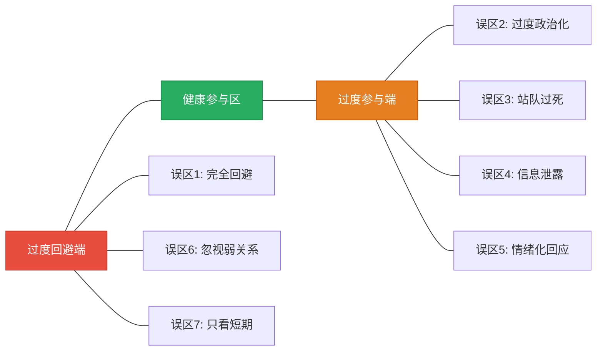
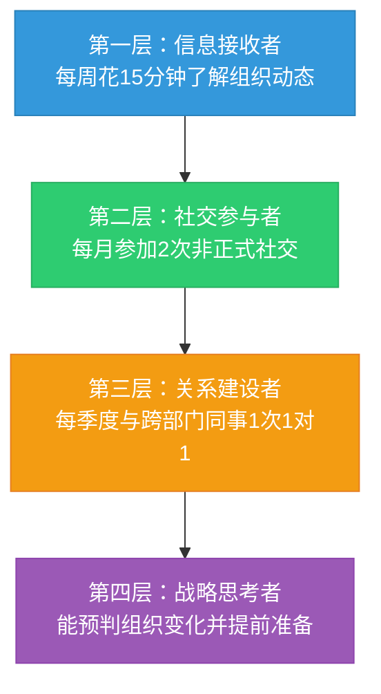
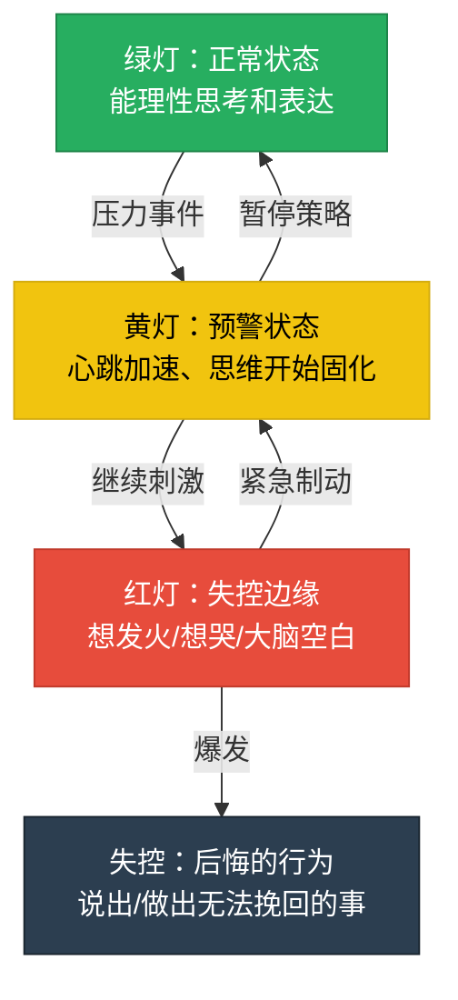
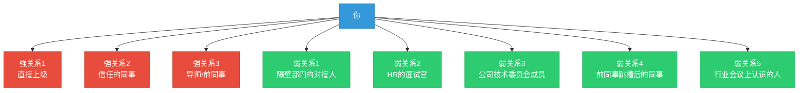
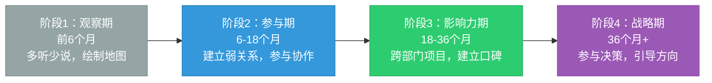

# 常见误区：职场政治中的沟通陷阱

职场政治中的错误行为往往不是因为"做错了什么"，而是因为"对某种情境的本能反应"。这些本能反应在日常生活中可能无害，但在权力博弈的环境中，每一次失当都会被放大、被记录、被利用。本章梳理七个最具破坏力的误区，帮助你在问题发生之前识别风险信号。

---

## 误区总览：从光谱两端看问题

七个误区本质上可以归到一个光谱的两端——**过度回避**和**过度参与**：

| 误区 | 属于 | 核心代价 | 修复难度 |
|------|------|----------|----------|
| 完全回避职场政治 | 过度回避 | 失去信息通道和影响力 | ★★★☆☆ |
| 过度政治化 | 过度参与 | 丧失信任，精疲力竭 | ★★★★☆ |
| 站队过早或过死 | 过度参与 | 绑定命运，失去独立性 | ★★★★★ |
| 信息泄露与传播 | 过度参与 | 信用破产，不可逆 | ★★★★★ |
| 情绪化回应冲突 | 过度参与 | 专业形象受损，留下把柄 | ★★★☆☆ |
| 忽视弱关系价值 | 过度回避 | 信息孤岛，机会匮乏 | ★★☆☆☆ |
| 只关注短期利益 | 过度回避 | 职业声誉透支 | ★★★★☆ |

---

## 自我诊断：你踩中了几个？

在逐条阅读之前，先做一个快速自检。对以下每句话，诚实地回答"是"或"否"：

| # | 自检问题 | 对应误区 |
|---|---------|----------|
| 1 | 我经常觉得"只要把活干好就行，不用管别的" | 误区1 |
| 2 | 我觉得同事的善意背后多半有目的 | 误区2 |
| 3 | 我和某个领导的关系比和其他所有同事加起来都紧密 | 误区3 |
| 4 | 我曾经把别人私下告诉我的事说漏了嘴 | 误区4 |
| 5 | 我在工作场合发过让自己后悔的脾气 | 误区5 |
| 6 | 跨部门的事我通常不知道该找谁 | 误区6 |
| 7 | 为了眼前的好处，我做过后来后悔的决定 | 误区7 |

**评分**：命中 0-1 个 = 健康状态；2-3 个 = 需要警惕；4 个以上 = 高风险区域，建议逐条对照本章内容重点修正。

---

## 误区一：完全回避职场政治

### 道：为什么回避是一种"不作为的作为"

回避政治不等于政治不存在。你选择不参与，不代表别人也不参与。在你"埋头苦干"的时候，可能已经有人在替你"做决定了"——决定你的项目优先级、你的晋升机会、你的资源分配。

管理学家杰弗里·普费弗（Jeffrey Pfeffer）在《权力：为什么只为某些人所拥有》中指出：**组织中的资源分配从来不是纯绩效驱动的，而是绩效、可见度和影响力的综合结果。** 一个绩效优秀但完全隐形的员工，在资源竞争中必然输给绩效一般但高度可见的竞争者。

### 术：识别回避型的典型表现

- "我只想好好工作，不想参与那些乱七八糟的事"
- 从不参加非正式的社交活动（午餐、团建、茶水间聊天）
- 对组织中的人际关系和权力动态毫不关心
- 认为"只要我能力强，一切都会自然到来"
- 开会时只回答被直接问到的问题，从不主动发言
- 从不在领导面前提及自己的工作成果

### 器：从回避到参与的阶梯模型

不需要一步到位变成社交达人。采用"阶梯式参与"策略，逐步建立最低限度的政治敏感度：

**第一层实操**：每周一花10分钟浏览公司内部通讯、OA公告、组织架构变动。关注三个信号：人事调动、预算变化、战略方向调整。

**第二层实操**：午餐时不要总是一个人吃。不需要成为派对中心，只需要在场。"在场"本身就是一种政治参与——你听到了信息，别人也看到了你。

**第三层实操**：每季度主动约一个不同部门的同事喝咖啡。话术模板："最近你们部门在推XX项目，我们这边正好有些资源/经验可以对接，方便聊聊吗？"

**第四层实操**：养成画"组织关系图"的习惯。用一张纸写下当前团队/部门的关键人物，标注他们之间的汇报关系、合作关系和潜在冲突点。每月更新一次。

### 案例：回避的代价

> 张工是某互联网公司的资深后端工程师，技术能力在团队中排名前三。但他从不参加部门聚餐，不参与跨部门项目，领导找他聊职业规划时他说"我只想写代码"。三年后，和他同期入职的同事（技术水平不如他）升了技术经理，而他仍然是高级工程师。原因很简单：那个同事主动参与了两个跨部门项目，在CTO面前有充分的展示，而张工的名字在晋升讨论会上没人提起。

---

## 误区二：过度政治化

### 道：警惕是工具，不是目的

过度政治化的本质是把"警惕"从工具升级成了世界观。当你把所有互动都解读为权力博弈时，你实际上失去了准确判断情境的能力——就像一个把所有声音都当成威胁的士兵，最终会因为疲劳而崩溃。

心理学上，这叫**确认偏误（Confirmation Bias）**：当你预设"每个人都在搞政治"时，你会不自觉地寻找证据来验证这个预设，同时忽略所有反面证据。

### 术：识别过度政治化的典型表现

- 把所有事情都看成"政治"，连正常的业务讨论都觉得有人在"搞事"
- 花大量时间和精力经营人际关系，忽视了本职工作
- 对所有人都"留一手"，不敢真诚地与任何人交流
- 过度解读每一封邮件、每一个表情、每一句话
- 收到同事的善意帮忙时，第一反应是"他想从我这得到什么"
- 在团队讨论中隐藏关键信息，怕别人"利用"

### 器：信任校准矩阵

如何在"足够警惕"和"过度政治化"之间找到平衡？使用**信任校准矩阵**来判断：

| | 高能力 | 低能力 |
|---|--------|--------|
| **高诚信** | 核心盟友——深度合作，共享信息 | 值得培养——给予支持，建立长期关系 |
| **低诚信** | 保持距离——表面礼貌，关键信息不共享 | 最小化接触——仅限必要工作交互 |

**操作方法**：对每个关键同事，用以下四个维度评估信任水平：

1. **承诺兑现率**：他说过的话，兑现了多少？低于50%则降级
2. **信息一致性**：他在不同场合说的话是否一致？频繁矛盾则警惕
3. **利益冲突记录**：在你们利益冲突时，他的行为如何？是公平竞争还是暗中破坏
4. **第三方评价**：其他你信任的人怎么看他？多数人评价一致时参考价值高

### 案例：过度政治化的反噬

> 李经理在公司以"精明"著称，她对每个同事都保持着精心计算的距离，从不在任何场合暴露自己的真实想法。渐渐地，同事们发现了她的模式——每次合作她都在"留后手"，每次帮忙都有"对价"。结果是：没有人愿意和她深度合作，跨部门项目绕过她的团队走，甚至在她需要支持时没人站出来。她赢得了每一次"小博弈"，却输掉了整个"大棋局"。

---

## 误区三：站队过早或过死

### 道：依附是一种高杠杆高风险策略

站队的本质是**将自己的职业资本与特定权力人物绑定**。短期内，这种绑定可以带来资源、保护和机会；但长期看，你是在用独立性换取安全感。一旦绑定对象失势，你不仅失去保护，还会因为"标签"而被新势力排斥。

哈佛商学院的研究表明：在组织权力更替中，"明确的依附者"存活率仅为28%，而"广泛连接者"存活率达到73%。

### 术：站队行为的五个层级

从轻到重，每一级的风险递增：

| 层级 | 行为 | 风险等级 | 可逆性 |
|------|------|----------|--------|
| L1 偏好表达 | 在业务讨论中更认同某位领导的观点 | 低 | 完全可逆 |
| L2 社交亲近 | 与某位领导的私下互动明显多于其他领导 | 中 | 较可逆 |
| L3 公开支持 | 在公开场合明确为某位领导站台 | 高 | 难以逆转 |
| L4 利益绑定 | 为某位领导的利益主动攻击其对手 | 极高 | 几乎不可逆 |
| L5 身份认同 | 被组织公认为"某某的人" | 极高 | 不可逆 |

**建议**：保持在 L1-L2 区间。L3 只在极端情况下使用（比如涉及原则性问题），L4 和 L5 是绝对禁区。

### 器：跨阵营关系建设的实操方法

**原则：忠诚于角色，而非个人。**

具体操作：

1. **"三三制"社交**：在组织中维持至少三个不同"阵营"的工作关系。不需要深度绑定，只需要保持正常的、互相尊重的工作互动
2. **基于事实的表达**：在讨论中支持某个观点时，始终以"我理解的数据是……"或"从XX角度看……"开头，而非"我觉得X总说得对"
3. **拒绝传递攻击性信息**：当有人让你"带话"或"打探消息"时，标准回应："这件事我不太了解情况，你们直接沟通可能更高效"
4. **独立价值建设**：确保你的核心价值（技术能力、客户关系、行业知识）不依附于任何特定的人

### 案例：站队的风险

> 2019年，某大型企业事业部调整，原事业部总经理调离。整个事业部的核心团队中，有两位副总监——王总和陈总。王总一直被认为是"老总经理的人"，而陈总则与多个业务线都保持着良好关系。老总离开后，新总经理到任，王总在三个月内被边缘化，最终离职；陈总不仅保留了位置，还被新总经理委以重任。两人的能力差距不大，但"标签"决定了命运。

---

## 误区四：信息泄露与传播

### 道：信息是职场中最危险的"双刃剑"

信息在职场政治中具有双重属性：**它是建立信任的筹码，也是摧毁信任的炸弹。** 当别人把敏感信息告诉你时，他们实际上给了你一份"信任预支"——你如何处理这份信息，决定了你们之间的信任关系是增值还是归零。

行为经济学中的"损失厌恶"原理在此同样适用：一次信息泄露造成的信任损失，需要十次守信行为才能弥补。

### 术：信息分类的"三层防火墙"模型

将你接触到的所有职场信息分为三层：

| 层级 | 定义 | 处理规则 | 典型示例 |
|------|------|----------|----------|
| 绿色 | 公开信息，人人可知 | 自由分享 | 公司公告、已发布的政策、行业新闻 |
| 黄色 | 内部信息，限特定范围 | 按需分享，确认对方有权限 | 项目进度、团队预算、非保密的会议内容 |
| 红色 | 机密信息，严格限制 | 绝不外传，无论对方是谁 | 未公布的组织调整、薪酬信息、商业机密、个人隐私 |

**判断标准**：当你不确定某条信息属于哪个层级时，**默认当作红色处理**。宁可过度谨慎，也不可一时大意。

### 器：信息泄露的常见场景与应对话术

**场景一：酒后失言**

风险：酒精降低自控力，容易说出不该说的话。

应对：在任何有酒精的社交场合，提前给自己设定"信息边界"——哪些话题绝对不碰。如果有人试图套话，用"今天不聊工作，来，喝酒"带过。

**场景二：被"自己人"套话**

风险：你信任的人问了你一个"无伤大雅"的问题，但答案涉及敏感信息。

应对话术："这个事情我确实知道一些，但涉及到（某某方面/某某人），不太方便说。你理解的。" 这句话既承认了你知道，又划清了边界，同时给了对方台阶。

**场景三：微信群里的"吐槽"**

风险：群聊中的发言可以被截图、转发，且脱离上下文后极易被曲解。

应对铁律：**工作相关的负面情绪，永远不要在任何电子渠道表达。** 想吐槽就面对面说，或者找一个完全不在同一工作圈子的朋友。

**场景四：离职交接期的信息暴露**

风险：即将离开的人容易放松警惕，或者有意无意地透露对前东家的不满。

应对：即使已经提了离职，在正式离开前，你依然是在职员工。离职交接期的信息管理标准和在职期间完全一致。

### 案例：信息泄露的连锁反应

> 某公司中层管理者赵总在一次部门聚餐时，酒后向一位关系不错的下属透露了公司即将裁员的消息。这位下属第二天告诉了自己的好友，好友又告诉了更多人。48小时内，整个公司都知道了"要裁员"的消息（而且信息在传播过程中被扭曲成了"大规模裁员50%"）。恐慌蔓延，多名核心员工开始投简历。最终，公司被迫提前公布裁员计划以稳定军心，而赵总因为违反保密规定被降级处理。

---

## 误区五：用情绪而非策略回应冲突

### 道：情绪是信号，不是策略

情绪本身不是问题——愤怒意味着你的边界被侵犯，焦虑意味着你感知到了威胁，委屈意味着你认为公正被违背。这些都是有价值的信号。问题在于：**当情绪成为你的行动策略时，你就把主动权交给了对手。**

神经科学的研究表明：人在情绪激动时，前额叶皮层（负责理性决策）的活动会被杏仁核（负责情绪反应）抑制。这意味着：在情绪最强烈的时候做的决定，几乎一定不是最优决定。

### 术：情绪触发的"红灯-黄灯-绿灯"识别系统

学会在情绪升级之前识别预警信号：

### 器：从情绪到策略的四步转化法

**第一步：识别（Recognize）**

身体信号是最早的情绪预警。当你感到以下任何一种信号时，说明你已经进入黄灯区域：
- 心跳明显加速
- 手心出汗或发抖
- 呼吸变浅变快
- 下颌或肩膀不自觉收紧
- 脑海中出现攻击性的内心独白

**第二步：暂停（Pause）**

在黄灯阶段就启动暂停机制。不要等到红灯才行动。

暂停话术（可以在任何场景使用）：
- 会议上："这个点很重要，我需要想一下，能否稍后回复？"
- 邮件中：不要即时回复。写好草稿，保存，24小时后再看一遍再发
- 一对一沟通："我需要消化一下你说的内容，我们明天继续聊？"
- 微信群：看到让你愤怒的消息，**把手机放下**，去做别的事

**第三步：转化（Transform）**

将情绪转化为可表达的事实。用以下模板：

> "当（具体事件）发生时，我感到（情绪），因为（原因/需求）。我希望（具体诉求）。"

示例：
- ❌ "你太过分了！每次都把烂摊子甩给我！"
- ✅ "当我在周五下午收到需要周一交的紧急任务时，我感到很被动，因为这压缩了我的周末安排。我希望我们能提前一天沟通任务优先级。"

**第四步：策略性回应（Strategize）**

情绪平复后，回到"策略人"模式，思考三个问题：
1. 这次冲突的根本原因是什么？（不是表象，是深层的利益/需求冲突）
2. 我想要的最终结果是什么？（不是"赢"，是长期最优解）
3. 达成这个结果的最佳路径是什么？（对话、书面沟通、第三方介入、战略性让步）

### 案例：情绪管理的正反对比

> **反面**：小周在季度评审会上被领导当众批评了项目延期。他当场拍桌子反驳，列举了一堆领导分配任务不合理的地方。会后，他"出了气"，但从此被贴上了"情绪不稳定"的标签，后续两年的晋升都没他的份。
>
> **正面**：小刘在同样的场景中，先接受了批评（"感谢指出，项目延期确实是我的责任"），然后在会后单独找领导沟通，用数据说明了任务分配中的资源冲突问题，并提出了优化方案。结果：领导不仅修正了评价，还把小刘的建议纳入了下季度的流程优化。

---

## 误区六：忽视"弱关系"的价值

### 道：弱关系是信息高速公路

社会学家马克·格兰诺维特（Mark Granovetter）在1973年提出的"弱关系理论"（The Strength of Weak Ties）是社会学中被引用最多的理论之一。其核心发现是：**对你最有帮助的信息和机会，往往不是来自你的亲密关系（强关系），而是来自那些不太熟的人（弱关系）。**

原因在于：你的亲密关系和你处于同一个社交圈，他们知道的信息你大概率也知道（信息冗余）。而弱关系处于不同的社交圈，他们能为你带来全新的、你无法从现有网络中获取的信息和机会。

### 术：强关系 vs 弱关系在职场中的对比

| 维度 | 强关系（亲密同事） | 弱关系（点头之交） |
|------|-------------------|-------------------|
| 信息价值 | 低（信息高度重叠） | 高（信息高度互补） |
| 维护成本 | 高（需要持续投入时间情感） | 低（偶尔互动即可） |
| 可及数量 | 少（精力有限，通常5-15个） | 多（可达50-150个） |
| 关键时刻作用 | 情感支持、深度帮助 | 信息传递、机会推荐、跨部门桥梁 |
| 风险 | 关系破裂代价大 | 失去一个弱关系损失极小 |

### 器：弱关系网络的系统性建设

**第一步：盘点现有网络**

画一张你的"职场社交地图"：

**第二步：识别"关键连接者"**

在弱关系中，最有价值的是那些**连接多个社交圈的人**——社会网络分析中称之为"桥节点"（Bridge Node）。识别方法：
- 他们在不同部门都有朋友
- 他们是跨部门项目的常客
- 他们经常被不同圈子的人提到
- 他们知道"谁擅长什么"，是天然的"人肉搜索引擎"

**第三步：低成本维护策略**

弱关系的最大优势是**维护成本极低**。以下动作不需要太多时间：

| 频率 | 动作 | 耗时 | 效果 |
|------|------|------|------|
| 每周 | 在内部群/朋友圈互动（点赞、评论） | 5分钟 | 保持存在感 |
| 每月 | 转发一篇对方可能感兴趣的文章/资讯 | 10分钟 | 建立"提供价值"的形象 |
| 每季度 | 约一次简短的咖啡/午餐 | 30-60分钟 | 深化连接 |
| 每年 | 节日问候（个性化，非群发模板） | 5分钟 | 保持温度 |

**第四步：主动创造连接机会**

- 申请加入跨部门项目组（即使不是你的KPI）
- 主动组织或参与公司级别的分享会/读书会
- 当你发现两个人可能互相需要时，做一次"价值连接"——把他们介绍给对方

### 案例：弱关系改变职业轨迹

> 程序员小陈在公司内部技术分享会上认识了市场部的小王。两人只是聊了几句，加了微信。半年后，市场部需要一个懂技术的人来做客户数据平台的选型，小王想起了小陈，把他推荐给了项目负责人。这个项目让小陈第一次接触到了业务端，开拓了视野，一年后他转岗到了技术战略部门——这在他原来的"纯技术圈"中根本不可能发生。

---

## 误区七：只关注短期利益

### 道：职业是一场无限博弈

职场不是一个有终点的游戏。你和当前的同事、领导、客户的关系，在你离开这家公司后还会继续。行业圈子远比你想象的小——你今天得罪的人，明天可能是你的面试官、供应商或投资人。

博弈论中"重复博弈"的结论在此完全适用：**在一次性博弈中，"背叛"可能是最优策略；但在重复博弈中，"合作"始终是长期最优解。**

### 术：长期主义者的四个习惯

**习惯一：以年为单位规划，以天为单位执行**

| 时间框架 | 规划内容 | 示例 |
|----------|----------|------|
| 5年愿景 | 你想成为什么样的人？ | "成为某领域的技术专家或管理者" |
| 3年目标 | 需要积累什么资本？ | 技术深度、管理经验、行业影响力 |
| 1年计划 | 今年的关键里程碑？ | 完成XX认证、主导XX项目、建立XX关系 |
| 季度重点 | 本季度聚焦什么？ | 技能提升、关系建设、成果交付 |
| 每周回顾 | 本周为长期目标做了什么？ | 读了一本书的3章、约了一位关键人 |

**习惯二：建立"声誉银行"概念**

把你的职业声誉想象成一个银行账户：
- **存款行为**：兑现承诺、帮助他人、分享知识、保持专业
- **取款行为**：请求帮忙、提出要求、让别人为你承担风险
- **透支行为**：违背承诺、出尔反尔、损害他人利益

关键规则：**在你需要"大额取款"之前（比如跳槽时请人推荐、竞聘时请人投票），确保账户里有足够的余额。**

**习惯三：冲突中优先保护关系**

在职场冲突中，问自己一个问题："五年后，我还想和这个人保持什么关系？"如果答案是"良好的工作关系"，那么当前的冲突就应该以"解决问题同时维护关系"为目标，而非"赢得争论"。

**习惯四：远离"零和思维"**

零和思维认为"你多我就少"，但职场中多数场景是正和博弈——双方都可以获益。培养"如何让双方都赢"的思维习惯，长期来看会为你积累大量善意和盟友。

### 器：长期主义的决策检验清单

在做任何重要的职场决策前，用这个清单检验：

- [ ] 这个决定三年后看起来还是正确的吗？
- [ ] 如果这件事被公开，我的职业声誉会受损吗？
- [ ] 我是否为了短期利益牺牲了长期关系？
- [ ] 相关方会如何评价我这个决定？他们的评价重要吗？
- [ ] 如果角色互换，我希望对方这样对我吗？
- [ ] 这个决定是否符合我"想成为的那种人"的定义？

### 案例：长期主义的回报

> 产品经理小林在一次跨部门项目中，主动帮市场部解决了一个数据分析的问题——这不在他的KPI里，纯粹是举手之劳。两年后，小林创业需要融资，他在公司时认识的一位市场部VP（就是当年被帮过的那位）给他介绍了第一个天使投资人。这不是"运气"，而是长期主义的自然回报。

---

## 进阶内容：从避免误区到构建优势

避免误区只是"防守"，真正的高手会把对职场政治的理解转化为**主动优势**。

### 政治敏感度的三个层次

| 层次 | 能力 | 表现 |
|------|------|------|
| 初级：避险 | 能识别政治风险并回避 | 不踩坑，不被利用 |
| 中级：洞察 | 能理解权力动态和利益格局 | 预判组织变化，提前调整位置 |
| 高级：引导 | 能影响决策过程和组织方向 | 在不引起反感的情况下推动议程 |

### 从"政治小白"到"组织高手"的成长路径

---

## 本节要点

职场政治中的误区可以归结为两个极端——**过度回避**和**过度参与**。前者让你成为"透明人"，任人摆布；后者让你成为"政治动物"，失去信任。

正确的姿态是：**了解规则、保持底线、策略行动、长期主义。**

核心行动框架：

1. **参与但不沉迷**：保持最低限度的政治敏感度和社交参与
2. **警惕但不偏执**：用信任校准矩阵替代"一视同仁"的不信任
3. **连接但不依附**：广泛建设弱关系网络，避免绑定单一权力人物
4. **谨慎但不封闭**：建立信息三层防火墙，而非拒绝一切信息交流
5. **管理情绪而非压抑情绪**：用红灯-黄灯-绿灯系统提前干预
6. **维护关系但不丧失原则**：在冲突中寻找"双赢"而非"我赢"
7. **长期思考但脚踏实地**：用声誉银行模型管理职业资本
