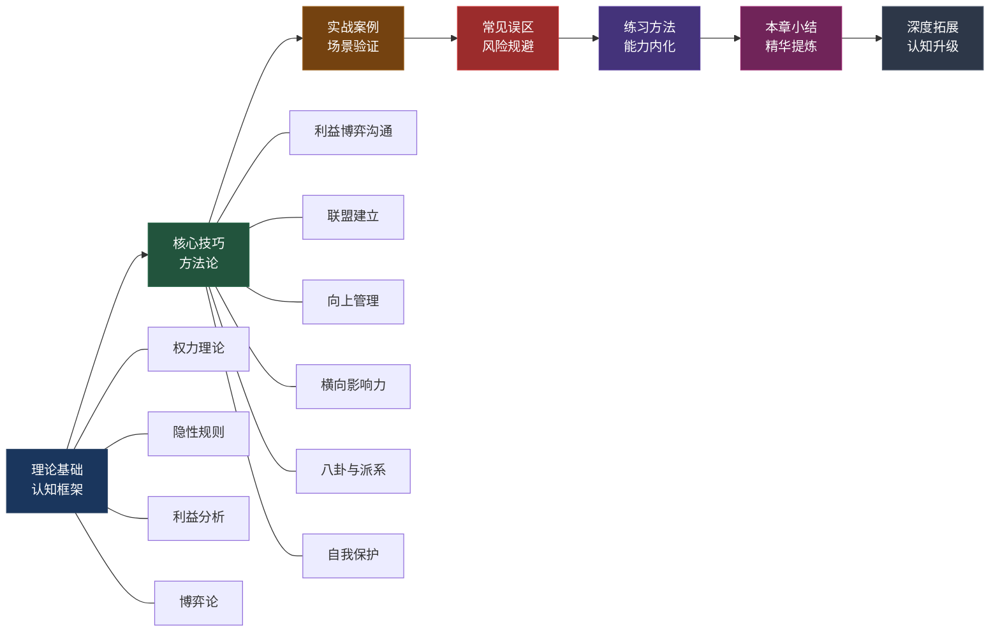
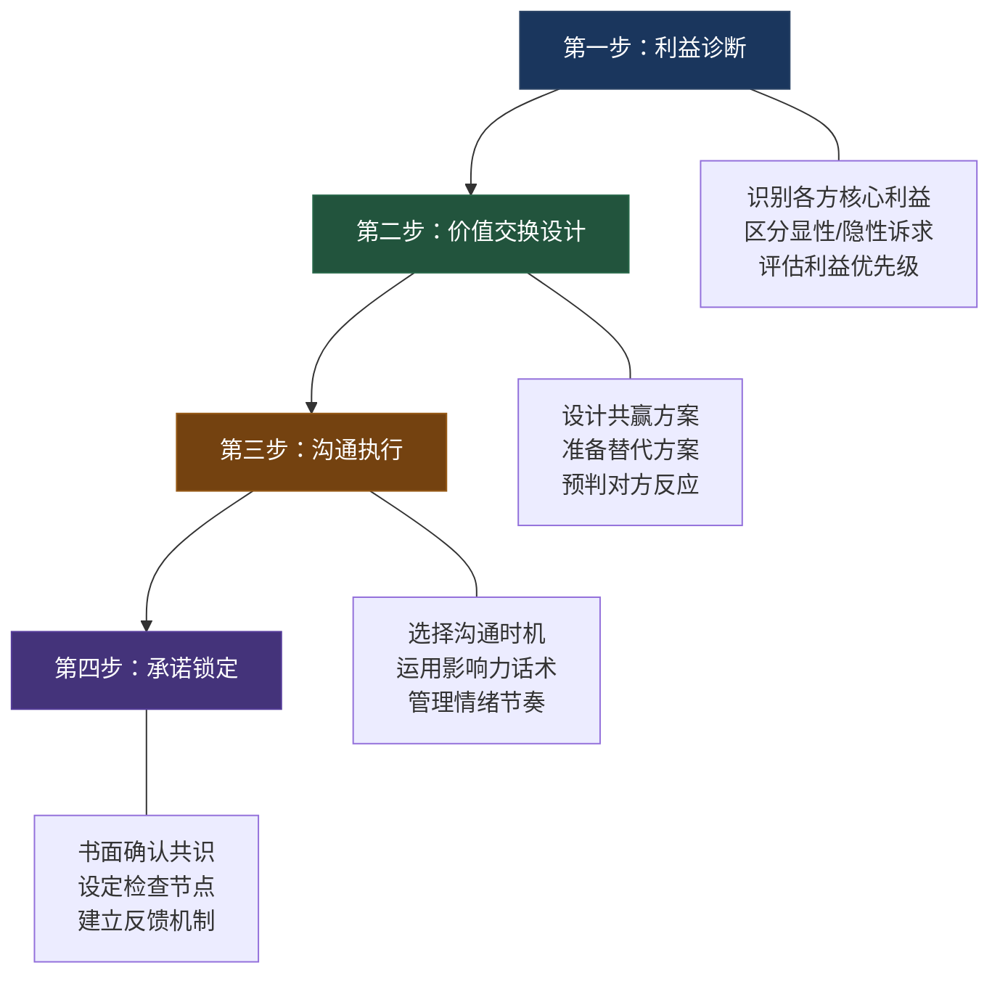
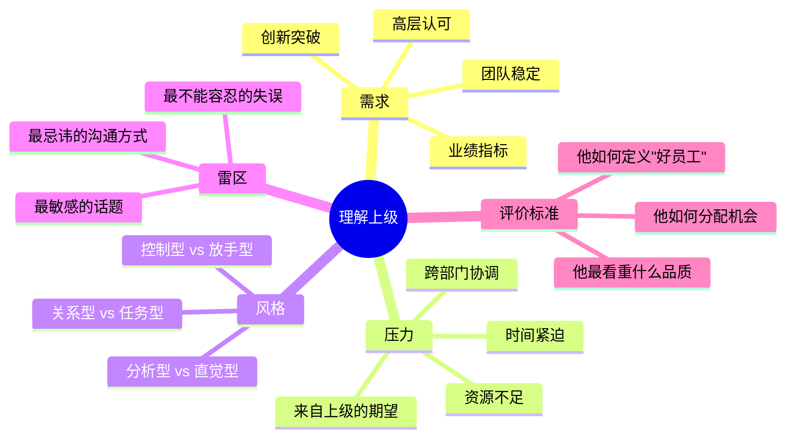
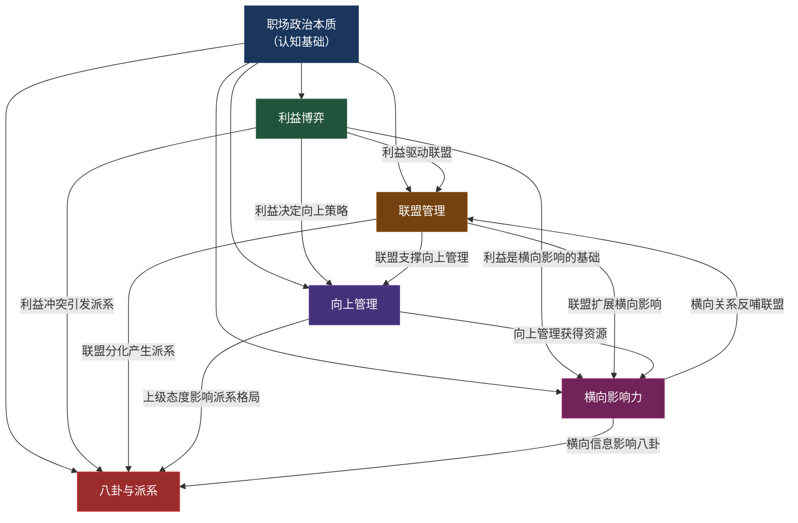

# 本章小结

***

## 全章知识体系回顾

从"什么是办公室政治"到"职场政治中的沟通禁忌"，本章用七个理论小节、八个核心技巧、七个实战案例，构建了一套完整的职场政治沟通知识体系。在进入具体要点之前，先用一张全景图回顾整章的知识脉络——理解各部分如何相互咬合、层层递进。

知识体系的内在逻辑是：**理论解决"是什么"和"为什么"，技巧解决"怎么做"，案例展示"实际效果"，误区提示"别踩坑"，练习确保"真的会"。** 六个模块不是孤立的知识点，而是一条从认知到行动的完整链路。跳过任何一环，理解都会残缺。

***

## 核心要点回顾

### 一、职场政治的本质：不是道德问题，是组织规律

**理论根基**：办公室政治的本质是组织中资源分配和权力博弈的客观规律。只要存在组织、存在层级、存在稀缺资源，就必然存在利益博弈——这不是道德判断，而是组织行为学的基本事实。哈佛商学院教授罗莎贝斯·坎特说得很直白："回避政治本身就是一种政治行为——它意味着你放弃了影响决策的权力。"

**关键认知**：政治本身是中性的，区别在于你以建设性还是破坏性的方式参与。建设性政治通过理解规则、建立信任、寻求共赢来推动工作；破坏性政治通过散布谣言、拉帮结派、打压异己来谋取私利。前者是职场生存的必备技能，后者是职业生涯的慢性毒药。

**权力五来源模型**（弗伦奇-雷文模型）是理解组织权力的基础框架：

| 权力类型 | 来源 | 举例 | 职场应用 |
|----------|------|------|----------|
| 法定权力 | 组织赋予的职位和层级 | 部门经理对下属的工作安排权 | 理解谁有正式决策权，谁只是建议权 |
| 奖赏权力 | 控制他人想要的资源 | 绩效评分、晋升推荐、项目分配 | 识别谁掌握你需要的资源 |
| 强制权力 | 惩罚或不利后果的能力 | 绩效警告、调岗、裁员建议 | 了解哪些行为会触发负面后果 |
| 专家权力 | 专业知识和技能 | 技术权威、行业专家、数据分析师 | 这是普通人最容易获取的权力类型 |
| 参照权力 | 个人魅力和人格感召 | 团队中受人尊敬的老员工、意见领袖 | 通过品德和能力赢得的非正式影响力 |

**实操要点**：每个组织都有隐性规则——不成文但实际运行的行为准则。识别这些规则是职场生存的基本功。隐性规则分为四类：**信息规则**（谁掌握关键信息谁拥有权力）、**面子规则**（尤其在中国职场中至关重要，公开场合不驳人面子是基本修养）、**忠诚规则**（组织对忠诚度的看重程度远超你的想象）、**圈子规则**（非正式群体的准入与排斥机制，进不去的圈子不要硬挤）。

识别隐性规则的方法：观察老员工的行为模式（他们知道什么不该做）、注意"不该问的问题"（有些话题从来没人公开讨论）、留意"潜台词"（会议上说的和会后说的往往不一样）、关注非正式场合的社交动态（真正的决策往往在茶水间而非会议室）。

### 二、利益博弈与沟通：从零和到正和

**理论根基**：职场沟通的本质是利益交换。这不是功利主义的冷血判断，而是对沟通动力学的准确描述。每个人在沟通中都在追求某种利益——物质利益、职位晋升、信息获取、关系维护、安全感、成长机会、声誉积累或自主权。理解各方的利益诉求，是有效沟通的前提。

**核心转变**：将零和博弈转化为正和博弈，是职场沟通的最高智慧。零和博弈是"你多我少"的对抗，正和博弈是"合作让双方都更好"的协作。具体策略有四种：

1. **扩大蛋糕**：当双方争夺有限预算时，寻找创造新资源的机会。比如两个部门争一个培训名额，能不能争取增加一个？能不能引入外部免费资源？
2. **时间换空间**：短期利益冲突可以通过时间错开来化解。这次你先，下次我先——建立轮流机制。
3. **利益互换**：你帮我解决A问题，我帮你解决B问题。核心是找到双方各自重视但对对方成本不高的利益点。
4. **第三方介入**：当双方僵持不下时，引入共同上级、中立部门或外部专家来仲裁。

**博弈沟通四步法**是本章的核心方法论：

**利益的八维分析**是一个实用的诊断工具。很多职场冲突之所以无法解决，是因为双方在不同维度上争夺利益，却误以为在争夺同一个东西。物质利益（薪酬、奖金、预算）只是最表面的一层；职位利益（晋升、头衔、汇报关系）往往更敏感；信息利益（谁先知道消息、谁能接触核心数据）是隐性权力的核心；关系利益（与关键人物的亲疏远近）决定了你能调动多少资源；安全利益（岗位稳定性、不被边缘化）是大多数人最深层的焦虑；成长利益（学习机会、项目历练）对年轻人尤为重要；声誉利益（业界口碑、内部评价）影响长期发展；自主利益（决策权、资源调配权）是高级人才最看重的。

**长期主义**：在重复博弈中，信任和声誉比短期利益更有价值。一次"赢"了对方但失去信任，后续的每次互动都会被防备。博弈论中的"以牙还牙"策略证明：在重复博弈中，善良（不首先背叛）、可激怒（对背叛做出回应）、宽容（愿意恢复合作）、清晰（让对方理解你的策略）是最优策略。

### 三、联盟与关系管理：战略性的人际投资

**理论根基**：联盟不是"拉帮结派"，而是基于共同利益和相互信任的战略性合作。社会学家马克·格兰诺维特的"弱关系理论"揭示了一个反直觉的事实：对你最有帮助的往往不是亲密关系，而是那些不太熟但处于不同社交圈的人——他们能为你带来全新的信息和机会。强关系（亲密朋友）往往和你处于同一个社交圈，信息高度重叠；弱关系（点头之交、前同事、行业会议上认识的人）能为你打开新的信息通道。

**识别盟友的四个标准**：

| 标准 | 含义 | 识别信号 |
|------|------|----------|
| 利益互补 | 你的目标和他的目标可以互相助力 | 他在追求的东西对你没有威胁，反之亦然 |
| 能力互补 | 各自擅长不同的领域 | 你缺的他有，他缺的你有 |
| 价值观相近 | 对"什么是对的"有基本共识 | 在关键事件上的判断一致 |
| 可靠性高 | 说到做到，不会背后捅刀 | 过往合作中有良好的守约记录 |

**建立联盟的四个策略**：主动提供价值（在对方需要帮助时伸出援手，不求即时回报）、建立互惠记录（每次互助都让对方知道你在"记账"，但不是威胁而是提醒）、定期维护关系（不要只在需要帮忙时才联系，平时的问候和关心是关系的润滑剂）、关键时刻站队（在对方面临压力时给予支持，这比平时的一百次帮忙更有分量）。

**联盟的边界管理**：联盟需要边界——保持独立判断（不要因为是盟友就放弃自己的判断力）、不参与有害行为（如果盟友的行为越过道德底线，必须及时切割）、避免排他性依附（不要把所有鸡蛋放在一个篮子里，多元化的联盟网络更稳健）。一个好的联盟网络能在你面临困难时提供支持，在你争取机会时提供助力，在你犯错时提供缓冲。

### 四、向上管理：帮上级成功就是帮自己成功

**理论根基**：向上管理的本质是帮上级成功——当你的上级因你而更成功时，你自然会被提拔。这不是拍马屁，而是基于理解的策略性协作。你的上级也是人，有自己的目标、压力、偏好和局限。理解这些，并据此调整你的沟通方式和工作策略，就能实现双赢。

**理解上级的五个维度**：

**向上管理的四个核心技巧**：

1. **结论先行**：上级的时间比你宝贵，先说结论和建议，再补充理由和细节。"我建议选方案A，理由有三……"比"关于这个问题，我做了很多调研，首先……"高效得多。
2. **带着方案汇报问题**：永远不要只带着问题去找上级。"我遇到了X问题，我分析了原因，建议用Y方案解决，需要您协调Z资源"——这才是专业的汇报方式。
3. **提前预警**：项目可能延期、客户可能流失、预算可能超支——这些坏消息要尽早告诉上级，给他缓冲时间。没有上级喜欢被"惊喜"——无论是好的还是坏的。
4. **用上级的语言争取资源**：不要说"我需要增加两个人手"，要说"如果增加两个人手，我们可以在Q3前完成这个项目，为公司节省约50万的外包成本"。把你的需求翻译成上级关心的语言。

**适应五种上级类型**：控制型上级需要你定期汇报、事无巨细地同步进展；放手型上级需要你主动汇报、在他需要时提供关键信息；分析型上级需要你用数据说话、准备详尽的分析报告；关系型上级需要你重视团队氛围、关注人际关系；结果型上级需要你聚焦结果、少说过程多说成果。

**高级策略**：成为上级的"信息源"和"解题助手"，而不是"执行工具"。信息源意味着你能提供上级接触不到的基层信息和跨部门动态；解题助手意味着你能在上级面临难题时提供有价值的思路和方案。这两者结合，你就从"可替代的执行者"变成了"不可或缺的左膀右臂"。

### 五、横向影响力：没有权力也能推动事情

**理论根基**：在矩阵式组织和跨部门协作中，你经常需要影响没有直接汇报关系的同级同事。这时候不能依靠正式权力，只能依靠四种横向影响力：

| 影响力类型 | 来源 | 建立方法 | 典型场景 |
|-----------|------|----------|----------|
| 专业影响力 | 你是某个领域的权威 | 持续输出专业成果、主动分享知识、解决疑难问题 | "技术方案听他的，他是这方面的专家" |
| 信息影响力 | 你能提供有价值的信息 | 建立广泛的信息网络、善于整合和解读信息 | "他知道的总比别人多，问他就对了" |
| 情感影响力 | 你善于理解和支持他人 | 真诚关心同事、在困难时给予支持、善于倾听 | "跟他合作很舒服，他总能理解别人的难处" |
| 互惠影响力 | 你建立了互助网络 | 主动帮助他人、记住别人帮过你、适时回报 | "他之前帮过我，这次我得支持他" |

**跨部门沟通的四个策略**：理解对方KPI（知道他年底考核什么，你的诉求才能和他的利益挂钩）、寻找共同利益（即使部门目标不同，总能找到交叉点——比如都希望项目成功）、建立个人关系（在正式合作之前先建立个人信任，事半功倍）、用数据说话（跨部门沟通中，客观数据比主观判断更有说服力）。

### 六、八卦与派系：信息时代的双刃剑

**八卦处理的五原则**：只听不说（听八卦是收集信息，说八卦是制造风险）、不站队（八卦中涉及的人物冲突，不要轻易表态支持哪一方）、不提供弹药（不要把你知道的敏感信息透露给八卦传播者）、区分事实与观点（"张总被叫去谈话了"是事实，"张总要被开了"是观点）、远离负面八卦（关于他人的负面八卦，听到就止于你）。

**派系应对的五原则**：不轻易站队（除非形势已经非常明朗，否则保持中立是最安全的策略）、与各方保持良好关系（不要因为亲近一方就疏远另一方）、用专业说话（在派系斗争中，专业能力和工作成果是最有力的保护伞）、掌握信息优势（了解各方的动向和诉求，但不要成为任何一方的传声筒）、知道何时离开（如果派系斗争已经严重影响到你的工作和心理健康，果断离开是最明智的选择）。

**信息的正确使用方式**：利用八卦获取信息（了解组织中的权力动态、人事变动、战略方向等），但绝不利用信息伤害他人。信息是职场中的硬通货——谨慎分享，善于收集，用于正面目的。

***

## 六大模块的内在关联

本章的六个核心主题不是孤立的知识点，而是一个有机整体。理解它们之间的关联，才能真正掌握职场政治沟通的精髓。

**核心逻辑**：职场政治的本质（认知）是一切的出发点。利益博弈是贯穿所有场景的底层动力——联盟因利益而结成，向上管理因利益而调整策略，横向影响因利益而发挥作用，八卦和派系因利益冲突而产生。联盟和向上管理是两条主要的关系经营路径——联盟经营横向关系，向上管理经营纵向关系。横向影响力是联盟的基础能力，八卦和派系是联盟管理的挑战和风险。

**一句话概括**：理解权力本质→分析利益格局→建立战略联盟→管理向上关系→经营横向影响→应对八卦派系→保护自己。这是一个从认知到行动、从建立到维护、从进攻到防守的完整闭环。

***

## 职场政治能力自评矩阵

在回顾完核心要点之后，用以下矩阵评估你当前的职场政治能力水平。诚实地评估自己，是提升的第一步。

| 能力维度 | L1 入门（被动承受） | L2 进阶（主动观察） | L3 精通（策略行动） | L4 大师（游刃有余） |
|----------|-------------------|-------------------|-------------------|-------------------|
| **权力认知** | 不清楚组织中谁有实权 | 能识别正式权力结构 | 能绘制完整的权力地图，包含非正式权力 | 能预判权力格局的变化趋势 |
| **利益分析** | 只关注自己的需求 | 能理解直接相关方的利益 | 能分析多方利益格局并找到共赢点 | 能设计利益交换方案推动复杂决策 |
| **联盟管理** | 没有跨部门关系 | 有几个聊得来的同事 | 有结构化的弱关系网络并定期维护 | 能在关键时刻调动多方资源 |
| **向上管理** | 等上级安排工作 | 能主动汇报进展 | 能预判上级需求并提前准备 | 成为上级不可替代的参谋 |
| **横向影响** | 只和自己部门的人合作 | 能和跨部门同事顺畅沟通 | 能在没有正式权力的情况下推动协作 | 能在组织中建立广泛的专业声誉 |
| **八卦应对** | 听到八卦就传播或表态 | 知道不该传播但有时忍不住 | 能从八卦中提取有价值信息并保持中立 | 能利用信息网络预判组织动态 |
| **自我保护** | 不知道哪些话不该说 | 知道基本的沟通禁忌 | 能在复杂环境中保护自己的核心利益 | 能在保护自己的同时帮助他人 |

**使用方法**：逐行评估自己当前处于哪个水平。大多数人在L1-L2之间，这很正常——职场政治敏感度是需要刻意培养的能力。找到你最薄弱的维度，从那个维度开始重点提升。

***

## 职场生存十条法则：深度解读

原文列出了十条法则，但每一条法则背后都有深层逻辑。以下是逐条深度解读：

**法则一：专业能力是根基**

没有实力，一切都是空谈。这是十条法则中最重要的一条——它是其他九条法则的前提条件。专业能力是你在组织中存在的价值基础，没有这个基础，所有的政治技巧都是空中楼阁。但反过来说，只有专业能力没有政治敏感度，你的能力可能永远得不到应有的认可和回报。两者是"地基"和"建筑"的关系——地基不牢，建筑会塌；没有建筑，地基只是荒地。

**法则二：了解规则再行动**

不理解游戏规则就上场，注定吃亏。这包括正式规则（公司章程、绩效制度、晋升流程）和隐性规则（面子文化、圈子边界、信息禁忌）。新入职或加入新团队时，前三个月的核心任务就是"观察和理解"——少说多看，了解这里的"玩法"再决定怎么"出牌"。急于表现的人往往踩到隐性规则的地雷。

**法则三：与人为善但不软弱**

善良需要有锋芒。"老好人"在职场中不是美德，而是被利用的信号。与人为善意味着不主动伤害他人、乐于助人、保持礼貌；不软弱意味着在核心利益被侵犯时敢于说不、在被不公正对待时敢于发声、在原则问题上不妥协。两者的平衡点是：**你可以选择善良，但不要让别人觉得你的善良是理所当然的。**

**法则四：管住嘴、迈开腿**

少说多做，但该做的社交不能省。"管住嘴"不是不说话，而是不在不该说话的时候说不该说的话——不在背后议论同事、不在公开场合表达不满、不传播未经证实的消息、不在情绪激动时做决定。"迈开腿"是主动走到人群中去——参加公司活动、主动和不同部门的同事交流、在茶水间和人聊天。社交不是浪费时间，而是建立关系网络的必要投资。

**法则五：帮上级成功**

你的成功建立在上级成功的基础上。这不是"拍马屁"，而是一种聪明的互利策略。当你的上级因为你的支持而获得晋升时，他留下的位置和他新获得的资源分配权，都会成为你的机会。反之，如果你的上级失败了，你作为他的下属，大概率也会受到牵连。帮上级成功的方式：高质量完成本职工作、主动承担额外责任、在上级需要时提供支持、在上级犯错时私下提醒而非公开拆台。

**法则六：建立多元关系网**

不要把鸡蛋放在一个篮子里。如果你只有一个"靠山"，一旦他离开或失势，你就失去了所有支撑。多元关系网包括：不同部门的盟友（信息来源和协作支持）、不同层级的关系（上级给你机会，同级给你配合，下级给你执行）、不同类型的联系人（技术专家、业务骨干、行政人员、外部合作伙伴）。弱关系网络的价值往往超过强关系——那些不太熟但处于不同圈子的人，能为你带来全新的信息和机会。

**法则七：信息是货币**

谨慎分享，善于收集。信息是职场中最硬的通货——谁掌握了关键信息，谁就拥有隐性权力。但信息也是双刃剑：分享得当能建立信任和影响力，分享不当会泄露机密或制造敌人。基本原则是：**不主动传播未经证实的消息，不把A告诉你的关于B的话告诉B，不把不该你知道的信息暴露出来。** 同时，要善于从各种渠道（会议、邮件、闲聊、八卦）中提取有价值的信息——组织的战略方向、人事变动的信号、项目的优先级调整。

**法则八：情绪是弱点**

管好你的情绪，别让别人利用它。在职场政治中，情绪化是最大的弱点——它让你做出非理性的决策，让别人看穿你的底牌，给你贴上"不成熟"的标签。管理情绪不等于压抑情绪——你可以在私下里发泄，但在公开场合必须保持冷静和理性。特别要注意三种危险时刻：被激怒时（对方可能就是想让你失态）、被委屈时（冲动的反击往往让情况更糟）、被吹捧时（警惕糖衣炮弹背后的诉求）。

**法则九：长期主义**

不要为了一次"赢"而输了信任。职场是一场马拉松，不是百米冲刺。今天你用手段赢了一次竞争，但失去的信任和声誉可能需要几年才能修复。在博弈论中，"以牙还牙"策略的四个特征——善良（不首先背叛）、可激怒（对背叛做出回应）、宽容（愿意恢复合作）、清晰（让对方理解你的策略）——是长期博弈中最优策略。在职场中践行长期主义：守信用、不背后伤人、愿意吃亏（但不是傻吃亏）、积累声誉。

**法则十：知道何时离开**

如果环境已经不适合你，果断离开。不是所有组织都值得你付出政治智慧去经营。如果一个组织的文化已经严重扭曲——内斗大于业务、派系凌驾于能力、正直的人被排挤——那么最好的策略不是"学会在这个环境中生存"，而是"换一个更好的环境"。识别离开的信号：你的核心价值观被持续挑战、你的成长已经停滞、你每天上班都感到痛苦、你发现自己越来越不像自己。

***

## 行动指南：从知道到做到

知道和做到之间隔着一道鸿沟。以下行动指南按照时间维度拆解，帮你把本章的知识转化为实际能力。

### 今天就做（投入时间：30分钟）

**1. 绘制你的权力地图**

拿一张纸（或打开思维导图工具），画出你所在组织的关键人物关系图。标注以下信息：每个人的正式职位和汇报关系、每个人的实际影响力（可能和职位不一致）、关键决策通常由谁做出、谁是非正式的意见领袖、你和每个人的关系现状（亲密/良好/一般/疏远/对立）。这张图不需要完美——第一版的重点是"开始思考"，而非"精确分析"。

**2. 分析你与直接上级的关系**

回答以下五个问题，写下来而非只是想一想：他/她最核心的KPI是什么？他/她目前面临的最大压力是什么？他/她偏好什么样的沟通方式（邮件/当面/即时消息/正式汇报）？他/她最不能容忍的行为是什么？他/她如何定义一个"好下属"？

**3. 列出你的弱关系清单**

写下你能想到的所有跨部门联系人——不限于"关系好"的人，包括那些"认识但不太熟"的人。评估：你的弱关系网络覆盖了几个部门？有多少人是你可以在需要时直接联系的？哪些部门是你完全没有联系人的？

### 本周完成（投入时间：2小时）

**1. 完成一次利益相关者分析**

选择你正在推进的一个具体项目或任务，用利益八维分析框架分析所有相关方：谁在这个项目中有利益？他们的核心利益在哪个维度？他们的利益和你的利益是互补还是冲突？有没有共赢的可能？

**2. 主动为一位同级同事提供帮助**

选择一位和你有潜在合作关系的同事，在他需要帮助时主动伸出援手。注意：帮助的方式要自然、不刻意——不要让对方觉得你有"目的"。真正的联盟建立在真诚的互助之上，而非刻意的讨好。

**3. 安排一次与跨部门同事的非正式交流**

午餐、咖啡、下班后的散步——任何非正式的场合都可以。目的不是谈工作，而是建立个人联系。了解对方的工作内容、职业兴趣、生活状态。弱关系的建立从一次随意的聊天开始。

### 本月完成（投入时间：5小时）

**1. 完成3次向上管理情景模拟**

选择三个你可能遇到的向上管理场景（如争取资源、汇报坏消息、提出不同意见），写出你会怎么说、怎么做。然后找一个信任的朋友或同事角色扮演——你扮演自己，他扮演你的上级。模拟结束后复盘：哪些话说得对？哪些地方可以改进？

**2. 建立职场政治沟通日记的习惯**

每天花5分钟记录：今天发生了哪些和"职场政治"相关的事件？我做了什么反应？效果如何？如果重来一次我会怎么做？这个习惯不需要花很多时间，但坚持一个月后，你会发现自己对组织中的权力动态和利益格局有了质的提升。

**3. 更新权力地图并追踪变化**

月底重新绘制权力地图，和月初的版本对比：有哪些变化？谁的权力上升了？谁下降了？有没有新的人事变动或组织调整？权力格局的变化往往预示着机会或风险——提前察觉的人总能比别人更快地做出反应。

***

## 关键术语速查表

| 术语 | 定义 | 核心要点 |
|------|------|----------|
| 办公室政治 | 组织中围绕资源和权力展开的非正式博弈 | 中性概念，关键在于建设性还是破坏性参与 |
| 权力五来源 | 法定、奖赏、强制、专家、参照五种权力 | 专家权力是普通人最容易获取的类型 |
| 隐性规则 | 组织中不成文但实际运行的行为准则 | 四类：信息规则、面子规则、忠诚规则、圈子规则 |
| 零和博弈 | 一方收益等于另一方损失的博弈 | 职场智慧在于将其转化为正和博弈 |
| 正和博弈 | 通过合作双方都能获益的博弈 | 四种策略：扩大蛋糕、时间换空间、利益互换、第三方介入 |
| 利益八维分析 | 从八个维度分析利益格局 | 物质、职位、信息、关系、安全、成长、声誉、自主 |
| 向上管理 | 主动管理与上级的关系以实现共同目标 | 本质是"帮上级成功"，不是拍马屁 |
| 横向影响力 | 在没有正式权力的情况下影响同级的能力 | 四种来源：专业、信息、情感、互惠 |
| 弱关系 | 不太熟但能带来新信息和机会的社交关系 | 格兰诺维特理论，弱关系的信息价值往往超过强关系 |
| 联盟策略 | 识别和建立互惠互利的职场关系网络 | 四个标准：利益互补、能力互补、价值观相近、可靠性高 |
| 派系斗争 | 组织中不同利益群体之间的竞争与博弈 | 应对五原则：不轻易站队、保持多方关系、用专业说话、掌握信息、知道何时离开 |
| 博弈沟通四步法 | 利益诊断→价值交换设计→沟通执行→承诺锁定 | 本章核心方法论，适用于所有利益博弈场景 |

***

## 进阶阅读推荐

| 书名 | 作者 | 推荐理由 | 适合读者 |
|------|------|----------|----------|
| 《权力：为什么只为某些人所拥有》 | 杰弗瑞·费佛 | 斯坦福大学教授的经典之作，系统讲解权力的本质、获取和运用，用大量实证研究揭示权力的客观规律 | 想深入理解权力理论的读者 |
| 《影响力》 | 罗伯特·西奥迪尼 | 理解影响力的六大原则（互惠、承诺一致、社会认同、喜好、权威、稀缺），适用于所有沟通场景 | 想提升影响力的读者 |
| 《博弈论与经济行为》 | 冯·诺依曼 | 博弈论的经典之作，理解利益博弈的底层逻辑和数学原理 | 对博弈论有深度兴趣的读者 |
| 《向上管理》 | 约翰·加巴罗 | 哈佛商学院教授的向上管理经典指南，提供系统的向上管理框架和实操方法 | 想系统提升向上管理能力的读者 |
| 《办公室政治》 | 杰瑞·维因特劳布 | 全面解析办公室政治的运作规律，涵盖权力、联盟、冲突等多个维度 | 想全面理解职场政治的读者 |
| 《关键对话》 | 科里·帕特森等 | 高风险对话的沟通技巧，教你如何在情绪激动、观点对立的情况下进行有效沟通 | 经常面临高难度对话的读者 |
| 《联盟：互联网时代的人才变革》 | 里德·霍夫曼 | LinkedIn创始人提出的新范式：雇主与员工的关系不是终身雇佣，而是互利互惠的联盟关系 | 想理解现代职场联盟关系的读者 |
| 《沧浪之水》 | 阎真 | 中国职场小说经典，通过一个理想主义者在体制内的沉浮，深刻揭示中国职场的生存法则 | 想通过故事理解中国职场政治的读者 |

***

## 全书回顾

从第一章到第二十八章，我们系统地探讨了沟通的方方面面——从基础的倾听与表达，到高级的谈判与说服，再到本章的职场政治沟通。这二十八章构成了一个完整的沟通能力体系：

沟通是一门终身修炼的艺术。没有一劳永逸的"通关秘籍"，只有持续学习、实践和反思的螺旋上升。希望本书能成为你沟通成长之路上的有益参考。

记住：**最好的沟通者，不是最会说话的人，而是最能让别人愿意和你说话的人。** 而在职场政治的语境下，这句话可以进一步延伸：**最成功的职场人，不是最懂政治的人，而是最能让别人觉得帮他就是帮自己的人。**

理解规则、保持底线、策略行动、长期主义——这十六个字，是本章的精华，也是你职场政治沟通的行动纲领。不做天真的"理想主义者"，也不做无情的"政治动物"，而是做一个**有原则的务实主义者**。
