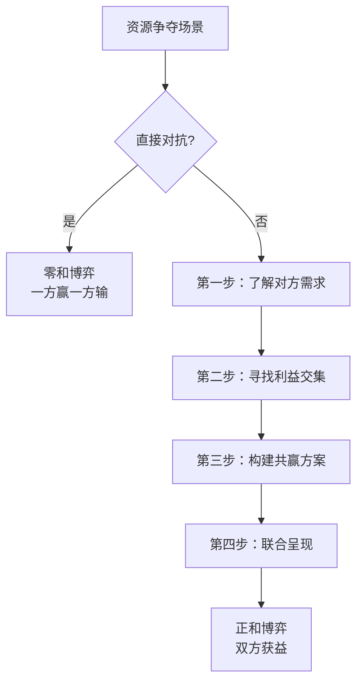
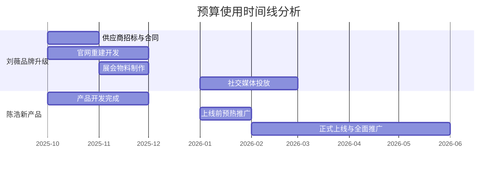
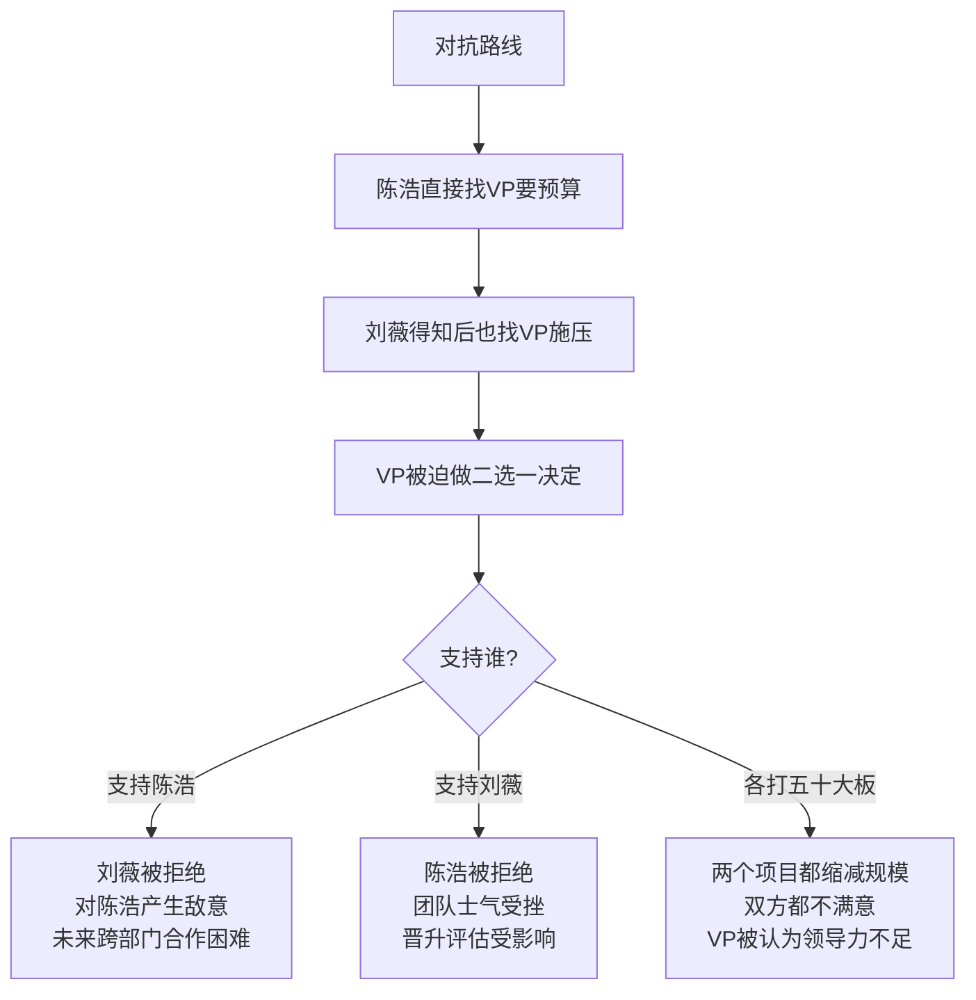

## 案例一：资源争夺中的共赢沟通

资源争夺是职场政治中最常见、也最容易激化矛盾的场景。当两个团队的需求指向同一块有限资源时，多数人的本能反应是"抢"——争辩谁更需要、谁更重要、谁更紧急。然而，高水平的沟通者会跳出零和思维，将资源争夺转化为共赢博弈。本案例完整还原一个真实的跨部门预算争夺过程，拆解每一步沟通策略背后的逻辑与技巧。

### 案例背景

陈浩是某科技公司产品部的高级经理，带领一个12人的产品团队，正在推进公司年度战略级新产品——一款面向B端客户的SaaS工具。这个项目已经通过立项评审，进入开发阶段，但还需要追加数字化营销预算用于产品上线后的市场推广。陈浩团队的年度KPI直接与该产品的按时上线和首季度营收挂钩，这对他的晋升评估至关重要。

与此同时，市场部负责人刘薇正在推进公司品牌全面升级项目。公司近两年业务扩张迅速，但品牌形象老化，已影响到大客户的信任度。刘薇的品牌升级项目需要数字化预算用于品牌官网重建、社交媒体矩阵投放和行业展会露出。该项目有一个刚性时间节点——必须在明年Q1行业大型展会前完成核心交付，否则将错过全年的最佳品牌曝光窗口期。

两个项目都需要从公司仅有的数字化预算池中划拨资金。公司年度数字化预算总额为500万元，陈浩的新产品推广需要约200万元，刘薇的品牌升级需要约250万元。预算池无法同时满足两个项目的全部需求。分管两个部门的VP张总面临"二选一"的压力——无论支持哪个项目，都会让另一个项目团队士气受挫，也会让他与被拒绝一方的关系产生裂痕。

### 利益相关方分析

在进入沟通之前，陈浩先做了一次系统性的利益分析。这一步至关重要——不了解各方的真实需求和约束条件，就不可能找到共赢的突破口。

#### 陈浩的核心利益

| 利益层级 | 具体内容 | 紧迫程度 |
|----------|----------|----------|
| 显性利益 | 获得200万元数字化预算，支持新产品上线推广 | 高 |
| 隐性利益 | 产品按时上线，完成团队年度KPI，支撑个人晋升评估 | 高 |
| 深层需求 | 在VP面前展现跨部门协作能力，而非只会"要资源" | 中 |

#### 刘薇的核心利益

| 利益层级 | 具体内容 | 紧迫程度 |
|----------|----------|----------|
| 显性利益 | 获得250万元数字化预算，完成品牌升级全流程 | 高 |
| 隐性利益 | 在Q1行业展会前完成交付，抓住全年唯一的品牌曝光窗口 | 极高（刚性约束） |
| 深层需求 | 证明市场部的战略价值，巩固在公司决策层中的话语权 | 中 |

#### VP张总的核心利益

| 利益层级 | 具体内容 | 紧迫程度 |
|----------|----------|----------|
| 显性利益 | 两个项目都能产出成果，向上级展示业务成效 | 高 |
| 隐性利益 | 不必做出"得罪人"的二选一决定，维护管理权威 | 高 |
| 深层需求 | 看到下属具备成熟的协作能力，而非只会向上争抢资源 | 中 |

通过这次分析，陈浩发现了一个关键事实：两个项目虽然都需要预算，但**使用周期并不完全重叠**。刘薇的品牌升级需要在Q4集中投入预算完成官网建设和展会物料准备，而新产品推广的核心投入在明年Q1和Q2。这意味着，如果在时间维度上做文章，预算池的容量问题可能有解。

### 沟通策略设计

陈浩没有选择与刘薇"正面硬刚"，而是设计了一套分三步走的沟通策略。这个策略的核心逻辑是：**先建立关系，再寻找交集，最后共同呈现方案**。

#### 策略设计的核心原则

陈浩在设计策略时遵循了三条原则：

**原则一：信息先行**。不了解对方的真实需求和约束条件，任何方案都是空中楼阁。他需要先获取信息，再提出方案。

**原则二：利益重构**。将"争夺同一笔预算"的问题重新定义为"如何在时间上优化预算分配"，问题的性质就从零和变成了正和。

**原则三：姿态管理**。在VP面前展现的不是"我能争到资源"的能力，而是"我能找到共赢方案"的能力。后者对晋升的价值远高于前者。

### 第一步：私下沟通，建立信任与获取信息

陈浩主动约刘薇在公司附近的咖啡厅见面。这次见面的目的不是谈判，而是了解对方的项目和真实需求。

#### 沟通话术设计

陈浩的开场白经过精心设计，体现了三个关键技巧：

> "刘薇，听说你们的品牌升级项目进展不错，行业里都在说B端品牌建设越来越重要了。能给我讲讲你们的整体思路吗？我最近也在思考我们新产品上线后的品牌定位问题，很想跟你请教。"

这段话的设计逻辑：

| 话术要素 | 具体内容 | 设计意图 |
|----------|----------|----------|
| 认可对方价值 | "行业里都在说B端品牌建设越来越重要" | 消除防御心理，让对方感到被尊重 |
| 表达好奇而非索取 | "能给我讲讲吗" | 建立平等的信息交流关系 |
| 创造互惠框架 | "我也在思考品牌定位，想请教" | 暗示未来可能的合作，而非单方面索取 |
| 避免暴露意图 | 不提预算冲突 | 信息获取阶段不引入对抗性议题 |

#### 信息获取成果

在这次沟通中，陈浩获取了三个关键信息：

**信息一：刘薇项目的刚性时间节点**。品牌升级必须在Q1行业展会前完成核心交付，而展会时间是固定的（每年3月中旬），不可调整。这意味着刘薇的预算集中使用期在Q4和次年Q1初。

**信息二：刘薇项目的预算使用节奏**。250万元预算中，约150万元需要在Q4投入（官网重建、展会物料制作），约100万元在Q1投入（社交媒体投放）。并非所有预算同时需要。

**信息三：刘薇的真实焦虑**。刘薇最担心的不是拿不到预算，而是拿到预算后时间不够用。她需要的是"尽早确认预算，以便启动供应商招标流程"。

这三个信息彻底改变了陈浩对问题的理解。原本他认为是"争预算"，现在他发现是"争时间"——两方对预算的需求时段不同，这为共赢方案打开了空间。

#### 常见错误：此阶段绝对不能做的事

许多人在资源争夺中会犯以下错误，导致沟通在第一步就走向死局：

| 错误行为 | 后果 | 正确做法 |
|----------|------|----------|
| 一开始就亮明"我也要这个预算" | 对方进入防御模式，关闭信息分享 | 先聊对方的项目，获取信息后再讨论资源 |
| 贬低对方项目的价值 | 激化矛盾，对方会联合其他人对抗你 | 真诚认可对方项目的重要性 |
| 过早提出"分预算"的方案 | 方案缺乏信息支撑，容易被否决 | 先了解完整需求，再设计方案 |
| 通过VP施压 | 让对方觉得你在"打小报告"，关系破裂 | 先私下沟通，达成共识后再联合找VP |

### 第二步：寻找利益交集，重构问题框架

拿到关键信息后，陈浩开始寻找双方利益的交集。他的分析过程如下：

**原问题定义**：两个项目争夺同一笔500万元数字化预算 → 零和博弈

**重构后的问题定义**：两个项目在不同时间段使用预算 → 通过时间错配实现预算共享 → 正和博弈

陈浩用一张时间线图来验证这个思路的可行性：

从时间线可以清晰看到：刘薇的预算集中在Q4（10-12月）和Q1初（1月），陈浩的预算集中在Q1末（2-3月）和Q2。两者的预算需求高峰基本错开。

#### 方案设计

基于时间线分析，陈浩设计了一个分阶段预算分配方案：

| 时间段 | 可用预算 | 分配给刘薇 | 分配给陈浩 | 说明 |
|--------|----------|-----------|-----------|------|
| Q4（10-12月） | 200万元 | 180万元 | 20万元 | 刘薇进入核心建设期，陈浩产品尚未上线 |
| Q1（1-3月） | 180万元 | 70万元 | 110万元 | 刘薇做投放收尾，陈浩进入上线推广期 |
| Q2（4-6月） | 120万元 | 0万元 | 70万元 | 刘薇项目完成，陈浩进入全面推广 |
| **合计** | **500万元** | **250万元** | **200万元** |  |

这个方案的核心创新在于：不是"切蛋糕"（你一半我一半），而是"排时间"（你先用我后用）。两个项目都能获得所需的全部预算，只是使用节奏不同。

#### 方案的可行性验证

陈浩在向刘薇提出方案前，先做了三重验证：

**财务可行性**：公司数字化预算按季度划拨，Q4和Q1各200万元，Q2剩余100万元。方案中的季度分配与公司财务节奏一致，不需要额外的财务协调。

**业务可行性**：陈浩的产品开发进度显示，Q4产品仍在开发中，不需要大规模推广预算。少量20万元用于预热内容准备即可。Q1末产品可以上线，进入密集推广期。

**管理可行性**：VP张总最担心的是"二选一"的压力。这个方案让他可以向上级汇报"两个战略项目都得到了支持"，完全符合他的利益。

### 第三步：联合汇报，呈现共赢方案

在方案设计完成后，陈浩再次约刘薇沟通。这次沟通的目标是：让刘薇认可方案，并同意一起向VP汇报。

#### 第二次沟通话术

> "刘薇，上次聊完你们的项目，我回去认真想了想。我发现一个可能对我们双方都有利的安排——你们的核心预算需求在Q4，我们的在Q1和Q2。如果我们把预算按时间错开使用，可能两个项目都能拿到全额支持。我画了个时间线，你看看这个安排对你们有没有问题？"

这段话的设计逻辑：

**以对方利益为切入点**。"对我们双方都有利"而不是"对我有利"，降低对方的警惕心。

**展示已做的功课**。"我画了个时间线"说明这不是随口一说，而是经过认真分析的方案。

**留出修改空间**。"你看看有没有问题"而不是"你同意吗"，给对方参与决策的空间，而不是让她觉得是被"安排"。

#### 刘薇的反应与方案调整

刘薇看到方案后，提出了两个合理的修改意见：

**意见一**：Q4的180万元中，需要确保至少100万元在10月到位，因为供应商招标需要预付款。陈浩同意调整，将Q4预算的拨付时间从"按月均匀"改为"10月初一次性到位100万，剩余80万分两个月拨付"。

**意见二**：希望在方案中注明，如果Q4预算有结余，优先滚入Q1的品牌投放阶段。陈浩同意，这让方案对刘薇更具吸引力。

这两个修改意见的处理体现了共赢沟通的关键原则：**方案不是你一个人的方案，而是双方共同打磨的方案**。当刘薇对方案有了"所有权感"，她就从方案的"被说服者"变成了方案的"共同推动者"。

#### 联合汇报的准备与执行

陈浩提议两人一起向VP张总汇报。联合汇报本身就是一个强大的信号——它告诉VP，两个部门经理已经自行解决了冲突，不需要他来做"裁判"。

**汇报材料的准备**：

陈浩和刘薇共同准备了一份汇报材料，包含以下内容：

| 汇报模块 | 内容要点 | 体现的价值 |
|----------|----------|------------|
| 项目价值陈述 | 两个项目对公司战略的贡献 | 说明两个项目都值得支持 |
| 时间线分析 | 预算需求的时间错配 | 展示问题的结构性解法 |
| 预算分配方案 | 分季度的具体分配数字 | 方案具体可执行 |
| 风险应对 | 预算结余的处理规则 | 展示周全的思考 |
| 联合承诺 | 两部门将互相配合对方项目 | 展示协作意愿 |

**汇报中的分工**：

刘薇先讲品牌升级项目（因为她的项目时间更紧迫），陈浩后讲新产品项目，最后两人一起展示联合方案。这个顺序设计的意图是：先让VP看到两个项目各自的价值，再看到联合方案，形成"1+1>2"的效果。

#### VP张总的反应

VP张总的反应完全符合陈浩的预期：

> "这个方案很好。两个项目都能推进，而且你们主动协调了资源冲突，说明你们的管理成熟度很高。我来跟CFO协调一下预算拨付的节奏，确保季度间的资金流转顺畅。"

VP不仅批准了方案，还主动承担了财务协调的工作——这正是他最擅长也最愿意做的事情。他在整个过程中不需要做"得罪人"的决定，反而可以向上级展示"我管辖的两个部门经理具备成熟的协作能力"。

### 案例结果与收益分析

| 参与方 | 直接收益 | 间接收益 |
|--------|----------|----------|
| 陈浩 | 获得200万元全额预算支持 | 展现跨部门协作能力，在VP心中加分；与刘薇建立长期合作关系 |
| 刘薇 | 获得250万元全额预算支持 | 提前确认预算，加速供应商招标流程；获得一个愿意配合的跨部门盟友 |
| VP张总 | 两个战略项目同时推进 | 向上级展示团队管理成效；避免了"二选一"的政治风险 |
| 公司 | 两个项目都不需要延期或缩减规模 | 跨部门协作文化的示范效应 |

### 关键启示与策略提炼

#### 启示一：先理解再行动——信息不对称是最大的敌人

陈浩如果没有主动约刘薇沟通，就会一直停留在"两个项目争同一笔钱"的认知框架中。正是那次看似随意的咖啡聊天，让他发现了"预算使用时间不重叠"这个关键事实。

**可迁移的通用原则**：在任何资源争夺场景中，第一步永远是获取对方的完整信息——需求、约束、时间线、焦虑点。信息越完整，找到共赢解的概率越高。

#### 启示二：问题重构——换个维度看问题

将"预算分配问题"重构为"预算使用时间安排问题"，是整个案例中最核心的思维转换。这背后的通用方法是：当两个需求指向同一资源时，检查该资源是否可以在时间、空间、形式等维度上拆分。

| 资源争夺维度 | 重构思路 | 适用场景 |
|-------------|----------|----------|
| 时间维度 | 分时段使用同一资源 | 预算、设备、场地等可按时间分配的资源 |
| 空间维度 | 在不同区域/市场分别使用 | 客户资源、市场份额、渠道覆盖 |
| 形式维度 | 将资源转化为不同形态分配 | 同一笔预算拆为现金+实物+人力支持 |
| 优先级维度 | 用不同的优先级排序换取其他补偿 | 人力、算力等可排队使用的资源 |

#### 启示三：联合呈现——将对手变为盟友

当陈浩和刘薇一起站在VP面前时，他们之间的关系已经从"竞争对手"变成了"合作伙伴"。联合呈现不仅提升了方案的说服力，更改变了两人之间长期的关系格局。

**联合呈现的三个前提条件**：

1. 方案必须真正对双方有利，而非一方利用另一方
2. 方案的细节必须经过双方的共同打磨，双方都有"所有权感"
3. 汇报的功劳必须均分，不能让一方觉得是"陪衬"

#### 启示四：向上管理的艺术——让上级做轻松的决定

VP张总在整个过程中做的最"难"的决定，不过是协调了一下财务拨付节奏。这正是向上管理的最高境界——**把难题在你的层级解决掉，把容易的决定留给上级**。

### 反面教材：如果陈浩选了对抗路线

为了更清晰地展示共赢沟通的价值，我们来模拟一下如果陈浩选择对抗路线会发生什么：

无论VP做出哪种选择，都有人受伤。而对抗路线的最大代价不是某一次的预算分配结果，而是**长期的关系损害**。刘薇如果在这次争夺中被陈浩"打败"，她会在未来每一次有机会的时候"找回场子"。职场政治的博弈是无限次重复博弈，一次的"赢"可能换来长期的"输"。

### 进阶分析：共赢沟通的适用边界

共赢沟通不是万能的。在以下场景中，共赢策略可能不适用或需要调整：

| 场景 | 为什么不适用 | 替代策略 |
|------|-------------|----------|
| 资源完全不可分割（如唯一的晋升名额） | 无法在时间/空间/形式上拆分 | 基于客观标准的公平竞争 |
| 对方明确拒绝沟通 | 信息获取的第一步就走不通 | 通过第三方传递信息或寻找替代资源 |
| 存在根本性利益冲突（如部门合并只能保留一个） | 利益冲突是结构性的，无法通过沟通解决 | 聚焦于争取最优的退出条件 |
| 时间压力极大，来不及做完整的沟通 | 三步走策略需要时间 | 用最简洁的方式传递核心方案 |

关键判断标准是：**双方的需求是否在某个维度上存在错配的可能性**。如果存在时间、空间、形式或优先级上的错配，共赢方案就有空间。如果需求完全同质且不可分割，就需要转向公平竞争机制。

### 可复用的沟通模板

以下模板可以在类似的资源争夺场景中直接套用：

**模板一：初次沟通邀请**

> "[对方称呼]，听说你们的[项目名称]进展不错，能给我讲讲吗？我最近也在思考[相关话题]，很想了解你们的思路。"

**模板二：方案提出话术**

> "上次聊完之后，我认真想了想。我发现一个可能对我们双方都有利的安排——[具体方案]。我整理了一个[材料/时间线/对比表]，你看看这个安排对你们有没有问题？"

**模板三：联合汇报邀请**

> "如果我们都认可这个方案，我建议我们一起去跟[上级]汇报。这样[上级]可以直接看到我们已经协调好了，也省得他/她还要做'二选一'的决定。你觉得呢？"

**模板四：面对上级的汇报话术**

> "[上级称呼]，关于[资源类型]的分配，我们已经协调出了一个方案。核心思路是[一句话概括]。这样安排的好处是[具体好处]。请您看看有没有需要调整的地方。"

***

