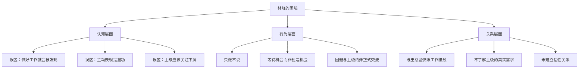
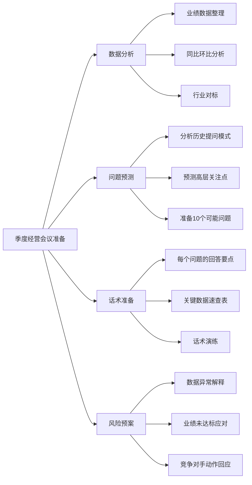

## 案例二：向上管理的典范——林峰的晋升之路

### 引言：什么是向上管理

向上管理（Managing Up）并非"拍马屁"或"阿谀奉承"，而是一种基于专业能力和人际智慧的职场策略。管理学大师彼得·德鲁克在《卓有成效的管理者》中指出：**"管理上级是下属的责任，也是使工作富有成效的关键。"** 向上管理的核心逻辑是——帮助上级成功，从而为自己创造更大的发展空间。

本案例通过林峰的真实经历，展示一个普通分析师如何通过系统的向上管理策略，在18个月内实现从基层分析师到团队主管的跃升。

### 背景

林峰是某金融公司的分析师，工作三年，能力突出但一直没有晋升机会。他的直接上级王总监是一个典型的"控制型"领导——喜欢掌控一切细节，对下属的自主决策不太放心。

**林峰的个人情况：**
- 学历：金融学硕士，CFA二级持证人
- 工作年限：3年
- 优势：数据分析能力突出，报告质量高，逻辑清晰
- 短板：不善于展示自己，习惯默默做事，认为"做好本职工作就会被发现"

**王总监的领导风格：**
- 类型：控制型（高任务导向、低关系导向）
- 管理幅度：直接下属8人，间接下属25人
- 工作压力：季度业绩考核严格，高层问责制
- 沟通偏好：喜欢详细的数据和简明的结论，讨厌意外和不确定性

### 问题诊断：为什么能力强却没有晋升

林峰意识到，他的问题不是能力不够，而是**没有有效地管理与上级的关系**。他一直采取"默默做事、等待被发现"的策略，但在竞争激烈的职场中，"酒香也怕巷子深"。

**深入分析林峰的处境：**



**林峰需要突破的三个认知误区：**

| 误区 | 现实 | 正确做法 |
|------|------|----------|
| "做好工作就会被发现" | 上级每天处理大量信息，很难主动发现你的价值 | 主动展示，让上级看到你的贡献 |
| "主动表现是邀功" | 不展示等于不存在，邀功和展示有本质区别 | 用事实和数据说话，而非夸大其词 |
| "上级应该关注下属" | 上级有自己的工作压力和关注重点 | 站在上级角度思考，主动提供价值 |

### 向上管理策略：四步走

#### 第一步：理解王总监的需求（第1-2个月）

林峰花了一个月时间仔细观察王总监，建立了"上级需求画像"：

**观察维度与发现：**

| 观察维度 | 具体发现 | 行动启示 |
|----------|----------|----------|
| 王总监最在意什么 | 部门的业绩数据和高层的认可 | 工作汇报突出业绩贡献 |
| 王总监最担心什么 | 出问题被高层问责 | 提前预警风险，准备应对方案 |
| 王总监的沟通偏好 | 喜欢详细的数据和简明的结论 | 结论先行，数据支撑 |
| 王总监的雷区 | 不喜欢下属自作主张、不喜欢意外 | 重要决策先请示，不搞突然袭击 |
| 王总监的工作节奏 | 周一规划、周三检查、周五总结 | 选择合适时机汇报 |
| 王总监的压力来源 | 季度考核、高层会议、跨部门协调 | 帮助缓解这些压力 |

**林峰使用的观察方法：**

1. **会议记录法**：记录王总监在各类会议中的关注点和提问方式
2. **邮件分析法**：分析王总监回复邮件的风格和关注重点
3. **非正式交流法**：在茶水间、午餐时观察王总监与他人的对话
4. **向上请教法**：以请教为名，了解王总监的工作理念和期望

#### 第二步：调整沟通方式（第2-4个月）

林峰开始调整自己的工作汇报方式，建立了"向上沟通四原则"：

**原则一：结论先行**

每次汇报先说结论和建议，再说过程和数据。

```markdown
❌ 低效汇报：
"王总，我这周分析了客户数据，发现A类客户增长了15%，B类客户下降了8%，
C类客户基本持平，整体来看……"

✅ 高效汇报：
"王总，本周客户数据整体增长5%，主要来自A类客户。建议下周重点跟进B类客户
流失问题，我已准备了分析报告和应对方案。"
```

**原则二：提前预警**

一旦发现潜在风险，立刻汇报，不等王总监来问。

| 风险类型 | 预警时机 | 汇报模板 |
|----------|----------|----------|
| 数据异常 | 发现后2小时内 | "王总，发现X数据异常，初步分析原因是Y，建议采取Z措施，您看是否需要进一步排查？" |
| 进度延误 | 预计会延误时立即 | "王总，原计划周五完成的报告，因A原因可能需要延期到下周二，我已调整优先级，确保核心内容按时交付。" |
| 客户投诉 | 收到投诉后1小时内 | "王总，刚收到客户X的投诉，问题是Y，我已初步沟通，建议采取Z方案，您有何指示？" |

**原则三：提供选项**

遇到问题时，不是问"怎么办"，而是说"我有两个方案，建议A，因为______"。

```markdown
❌ 等待指示：
"王总，客户要求降价10%，我们怎么办？"

✅ 提供选项：
"王总，客户要求降价10%，我分析了两个方案：

方案A：接受降价，但要求签订2年长约
- 优点：保住客户，稳定收入
- 缺点：利润率下降3%

方案B：拒绝降价，但提供增值服务
- 优点：维持利润率，提升客户粘性
- 缺点：客户可能流失

建议选方案A，因为该客户占我们收入15%，长约能锁定2年收入。"
```

**原则四：定期汇报**

每周五下午发一封简明的工作周报，让王总监随时了解进展。

**周报模板：**

```markdown
主题：【周报】林峰 2024年第X周工作总结

一、本周完成
1. [项目A] 完成数据分析，发现XX结论，已提交报告
2. [项目B] 与客户沟通，达成XX共识，下周跟进

二、下周计划
1. [项目A] 完成最终报告，周三前提交
2. [项目C] 启动新项目调研

三、风险预警
1. [项目B] 客户预算可能缩减，已准备备选方案

四、需要支持
1. 申请下周三与技术部的协调会议

附件：本周数据分析摘要（1页）
```

#### 第三步：成为王总监的"得力助手"（第4-8个月）

林峰开始主动帮王总监解决一些他不擅长或没时间处理的事情：

**识别上级的"能力缺口"：**

林峰通过观察发现王总监的三个能力缺口：

1. **PPT制作能力弱**：王总监的汇报材料逻辑清晰但视觉效果差
2. **行业研究不足**：王总监忙于管理，没时间深入研究行业趋势
3. **紧急数据响应慢**：高层临时要数据时，王总监需要时间准备

**林峰的补位策略：**

| 能力缺口 | 林峰的行动 | 产生的价值 |
|----------|------------|------------|
| PPT制作弱 | 主动帮忙美化重要汇报材料，建立标准化模板 | 王总监的汇报质量提升，获得高层认可 |
| 行业研究不足 | 每月整理行业动态简报，主动分享关键洞察 | 王总监在会议上能提出前瞻性观点 |
| 紧急数据响应慢 | 建立常用数据看板，随时可调取 | 王总监应对高层询问时更从容 |

**补位的注意事项：**

- **不要越界**：补位是辅助，不是替代，决策权始终在上级
- **不要邀功**：让结果说话，而不是强调自己的贡献
- **不要形成依赖**：帮助建立系统，而非只做一次性工作
- **保持专业**：补位的前提是本职工作出色，不能顾此失彼

#### 第四步：在关键时刻展现价值（第8-18个月）

在一次公司季度经营会议上，王总监需要汇报部门业绩。林峰不仅准备了详尽的数据分析，还帮王总监预测了高层可能会问的问题，并准备了应对话术。

**林峰的准备工作清单：**



**会议结果与连锁反应：**

会议非常成功。会后，王总监的上级专门表扬了他的汇报质量。王总监心知肚明，这次成功很大程度上归功于林峰。

这次成功产生了三个连锁反应：
1. 王总监对林峰的信任度大幅提升
2. 高层开始注意到林峰的存在
3. 林峰在部门内的影响力增强

### 结果

半年后，部门进行人事调整，王总监向高层推荐林峰担任团队主管。他在推荐理由中写道："林峰是我见过的最靠谱的分析师，不仅专业能力出色，而且善于协作、值得信赖。"

**林峰晋升后的变化：**
- 薪资提升30%
- 管理幅度：从个人贡献者到带领5人团队
- 职业发展：从执行层进入管理层
- 影响力：从部门内扩展到跨部门

### 关键启示

1. **向上管理的本质是"帮上级成功"**：当你的上级因为你的存在而更成功时，你自然会被提拔。
2. **了解上级比展示自己更重要**：林峰花了一个月时间"研究"王总监，这个投资回报巨大。
3. **持续而非偶尔**：向上管理不是"临门一脚"，而是每天、每件事中的持续投入。
4. **补位而非越位**：帮助上级解决问题，但不抢上级的风头和决策权。
5. **建立信任是核心**：所有策略都指向一个目标——让上级信任你、依赖你。

### 常见误区与纠正

| 误区 | 纠正 |
|------|------|
| 向上管理=拍马屁 | 向上管理是基于专业能力的价值交换，不是无原则的讨好 |
| 只要有业绩就行 | 业绩是基础，但需要让上级看到你的业绩 |
| 要改变自己的性格 | 不是改变性格，而是调整沟通方式和工作策略 |
| 只关注直接上级 | 也要关注上级的上级，了解更高层级的需求 |
| 一次成功就够了 | 向上管理是持续的过程，需要长期坚持 |

### 进阶思考：向上管理的边界

向上管理有明确的边界，越过边界就会变成"办公室政治"：

**应该做的：**
- 帮助上级成功
- 主动沟通和展示
- 提前预警风险
- 提供专业支持

**不应该做的：**
- 背后议论上级
- 拉帮结派
- 隐瞒信息
- 损害他人利益

向上管理的最终目标是**创造多赢**——你帮助上级成功，上级帮助你成长，组织因此受益。这是一个正向循环，而不是零和博弈。

***

