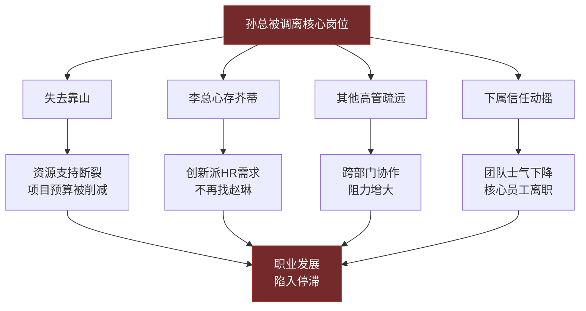
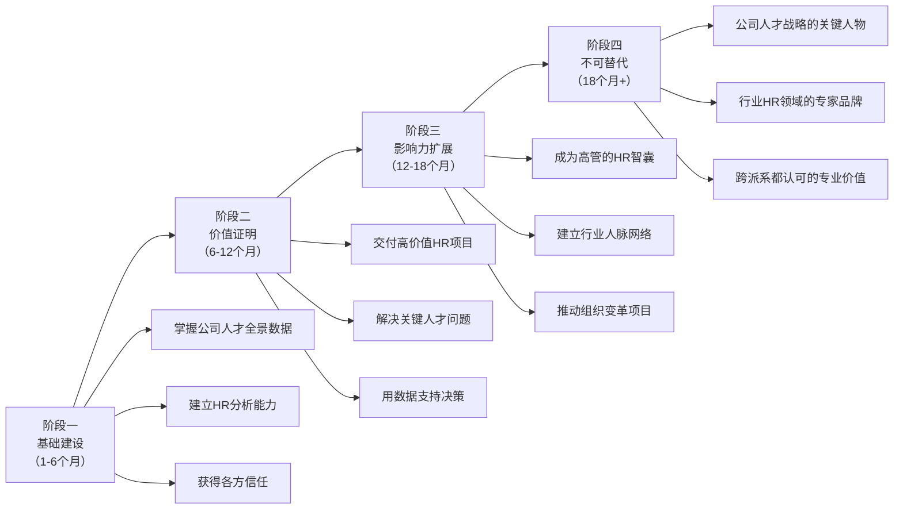
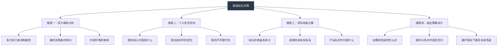

## 案例三：站队失误的教训——赵琳的职场陷阱

### 案例概述

赵琳的故事是职场站队失误的经典案例——一个有能力的HR经理，因为在错误的时间、以错误的方式选择了阵营，最终陷入了进退维谷的困境。这个案例揭示了站队行为背后的深层逻辑：**站队不是简单的"选边"，而是一次涉及权力判断、风险评估、关系管理和未来预期的复杂决策。** 任何一环的失误，都可能引发连锁反应，将你推入被动局面。

***

### 完整背景

赵琳，35岁，某中型制造企业（员工规模约2000人）的HR经理，入职该公司约一年。她此前在一家外企工作了八年，拥有扎实的人力资源管理专业能力，持有SHRM-SCP（高级人力资源管理师）认证。选择加入这家制造企业，是因为她希望获得更大的管理自主权和更快的职业上升通道。

公司的权力结构如下：

| 层级 | 人物 | 职位 | 派系归属 | 核心主张 |
|------|------|------|----------|----------|
| 第一层 | 张总 | CEO | 最终决策者 | 效率与创新并重，但倾向渐进改革 |
| 第二层 | 孙总 | 运营副总裁 | "效率派"核心 | 精益生产、成本控制、流程优化 |
| 第二层 | 李总 | 研发副总裁 | "创新派"核心 | 产品创新、技术投入、市场拓展 |
| 第三层 | 各部门经理 | 中层管理者 | 待定/中立 | 关注自身部门利益和职业发展 |

两派的分歧并非私人恩怨，而是源于公司战略方向的根本性差异：**有限的资源应该向运营效率倾斜，还是向研发创新倾斜？** 这是一个没有标准答案的问题——答案取决于公司的市场环境、竞争态势和生命周期阶段。正因为没有标准答案，这场博弈才格外复杂。

两派的具体分歧点：

| 议题 | 效率派（孙总）立场 | 创新派（李总）立场 |
|------|---------------------|---------------------|
| 年度预算分配 | 运营优化70%，研发30% | 研发50%，运营50% |
| 人才引进策略 | 优先招聘生产管理人才 | 优先引进高端研发人才 |
| 组织架构调整 | 合并冗余部门，精简人员 | 设立创新实验室，扩充研发团队 |
| 绩效考核标准 | 以成本控制和交付效率为核心 | 以创新产出和技术突破为核心 |
| 数字化转型路径 | 优先实施生产自动化 | 优先投入研发数字化平台 |

赵琳作为HR经理，立场的选择直接影响人才引进方向、培训资源分配和绩效考核体系——这些都是两派争执的核心议题。她不是一个可以"置身事外"的旁观者，而是被推到了风暴的中心。

***

### 赵琳的决策过程分析

#### 第一阶段：被"善意"俘获（入职1-3个月）

赵琳入职后，孙总对她格外关照。具体表现在：

1. **资源倾斜**：孙总在预算审批中优先支持了赵琳提出的"中层管理者领导力培训"项目，拨款80万元——这在该公司是前所未有的HR项目投入
2. **公开表扬**：在三次高管会议上，孙总主动提及赵琳的工作成果，用"专业""高效""思路清晰"等词语评价她
3. **私下关怀**：孙总在一次公司聚餐中主动与赵琳聊天，询问她的职业规划，并表示"公司需要像你这样有外企经验的人才"
4. **信息分享**：孙总偶尔在私下向赵琳透露一些高层动态，让她感觉自己被"纳入了圈子"

从心理学角度看，赵琳陷入了**互惠原则**（Robert Cialdini，《影响力》）的陷阱：孙总给予了她资源、认可和信息，她内心产生了强烈的"回报"冲动。这种冲动并非理性的利益计算，而是一种深植于人类社会行为中的本能反应——当别人对你好时，你会不自觉地想要"还人情"。

但赵琳忽略了一个关键问题：**孙总的"关照"是真诚的个人认可，还是战略性的"投资"？** 在派系博弈中，有影响力的人物往往会主动拉拢关键岗位上的人——HR经理掌握着招聘、培训、绩效考核等核心权力，是任何派系都希望争取的对象。孙总的"关照"可能两者兼有，但其中"战略投资"的成分不容忽视。

#### 第二阶段：渐进式表态（入职3-5个月）

赵琳的"站队"并非一步到位，而是一个渐进的过程：

**轻度表态**（第3个月）：
- 在部门联席会议上，当讨论培训预算时，赵琳引用了孙总"效率优先"的框架来论证自己的方案
- 在与同事的日常聊天中，偶尔表达对运营优化项目的认同

**中度表态**（第4个月）：
- 在高管会议上，赵琳主动汇报了"中层管理者执行力提升"的培训成果，数据呈现方式明显偏向"效率派"的价值观
- 在一次跨部门讨论中，赵琳对研发部提出的"技术人才特殊薪酬方案"提出了质疑，认为"应该在现有薪酬框架内解决"

**深度表态**（第5个月）：
- 在一次部门经理的私下聚餐中，赵琳说了那句致命的话："李总的创新战略不切实际，公司现在最需要的是把现有的事情做好，而不是去搞那些看不到回报的研发投入"
- 这句话被在场的某位经理传到了李总耳中

从渐进承诺理论（Escalation of Commitment）来看，赵琳的每一步表态都在强化她与"效率派"的绑定。每一次小的表态都让她更难回头——因为改变立场意味着否定自己之前的判断，这对一个自尊心强的专业人士来说是极其困难的。

#### 第三阶段：权力格局突变（入职6个月）

公司外部环境发生重大变化：一家竞争对手推出了创新产品，市场份额开始被蚕食。CEO张总认识到，单纯追求效率已无法应对竞争，公司必须在创新上加大投入。

紧接着发生了两件事：

1. **战略转向**：CEO宣布采纳"效率+创新"并重的折中方案，实际上是向"创新派"大幅倾斜——研发预算增加了40%，新成立了创新战略委员会，由李总担任负责人
2. **人事调整**：孙总因为另一项目的执行问题（生产线改造项目超支30%且延期两个月），被CEO调离核心决策岗位，转为"运营顾问"——名义上是高级职位，实际上失去了实权

权力格局在短短一个月内发生了根本性转变。

***

### 连锁反应：赵琳的处境恶化

孙总失势后，赵琳面临的困境是多维度、全方位的：

**困境一：资源支持断裂**

孙总在职时，赵琳的HR项目预算审批一路绿灯。孙总被调离后，赵琳提出的"年度培训计划"被新任运营负责人以"需要重新评估优先级"为由搁置。她负责的中层管理者培训项目的第三期经费被砍掉了60%。

**困境二：创新派的冷遇**

李总对赵琳的态度从"客气但疏远"变成了"表面客气、实质排斥"。具体表现包括：
- 创新战略委员会的HR对接工作，李总要求换人，指定由HR部门的另一位同事负责
- 研发部的人才招聘需求，李总绕过赵琳，直接找HR总监协调
- 在一次跨部门会议上，李总当众对赵琳提出的绩效考核方案提出了尖锐质疑，语气中明显带有针对性

**困境三：中立派的疏远**

那些原本保持中立的高管和部门经理，开始有意与赵琳保持距离。原因很简单：**没有人愿意被贴上"孙总派"的标签**，而与赵琳走得太近可能会让人产生这种联想。在职场中，当一个派系失势时，与该派系关联的人会经历"社交传染"效应——其他人会本能地远离，以免被牵连。

**困境四：下属的信任动摇**

赵琳手下的HR团队成员开始对她的判断力产生怀疑。一位资深HR主管私下对同事说："赵经理连自己的站队都搞不清楚，我们跟着她能有什么前途？"这种质疑虽然没有公开化，但已经影响了团队的执行力和凝聚力。

**困境五：个人品牌受损**

在整个公司层面，赵琳被打上了"孙总的人"的标签。这个标签在短期内几乎不可能撕掉——即使她实际上只是在工作中与孙总合作较多，并没有刻意站队。**在组织中，"感知即现实"（Perception is Reality）——别人怎么看你，比你实际上是什么样的人更重要。**

***

### 深层原因剖析：赵琳犯了哪些错

赵琳的困境不是单一错误导致的，而是多个错误叠加的结果。我们可以从决策科学的角度来拆解她的失误：

#### 错误一：误判权力格局的稳定性

赵琳犯了一个经典的**锚定偏差**（Anchoring Bias）错误：她以入职时的权力格局为"锚点"，假设孙总的地位是稳固的。她没有意识到权力是流动的——特别是在战略转型期，权力格局的变化速度远超常规。

**正确的权力评估框架**应该包括：

| 评估维度 | 需要回答的问题 | 赵琳的实际判断 |
|----------|---------------|---------------|
| 权力来源 | 此人的权力来自职位、能力还是关系？ | 只看到了孙总的职位权力，忽略了李总的技术权威 |
| 权力趋势 | 此人的权力在上升、稳定还是下降？ | 没有关注CEO对两派态度的微妙变化 |
| 权力弹性 | 此人遇到挫折后能否恢复？ | 没有评估孙总失势后的恢复可能性 |
| 外部变量 | 行业趋势、竞争对手动向对哪派有利？ | 完全忽略了外部竞争环境的变化 |
| CEO立场 | 最终决策者的真实倾向是什么？ | 没有深入研究CEO的决策风格和偏好 |

#### 错误二：混淆了"关系好"和"利益一致"

孙总对赵琳的关照，确实包含真诚的成分——他可能确实欣赏赵琳的能力。但赵琳犯了一个关键的认知错误：**把个人层面的好感等同于战略层面的利益绑定。**

在职场中，一个人对你好，可能有多种原因：
- 他欣赏你的能力（基于评价）
- 他需要你这个岗位的支持（基于利益）
- 他习惯于对下属友善（基于性格）
- 他在有意识地拉拢你（基于策略）

赵琳没有区分这些不同的可能性，直接将孙总的善意解读为"我们是一伙的"。这个认知错误导致她在后续的行为中过度绑定，失去了灵活性。

#### 错误三：公开表态的不可逆性

赵琳犯的最严重的错误，是在私下场合发表了针对李总的负面言论。这句话造成了两个不可逆的后果：

1. **信息泄露**：职场中没有真正的"私下场合"。在场六个人，只要有一个人转述，信息就会传播。赵琳低估了信息流动的速度和广度
2. **人身攻击**：她说的是"李总的创新战略不切实际"——这句话的主语是"李总"而非"创新战略"。批评一个方案和批评一个人，后果完全不同。前者可以被解读为"专业判断"，后者则被解读为"人身敌意"

这对应了沟通禁忌理论中的关键区分：

| 表达方式 | 性质 | 后果 | 可修复性 |
|----------|------|------|----------|
| "我认为这个方案的ROI测算需要更多数据支撑" | 就事论事 | 被视为专业意见 | 高 |
| "创新战略的方向没问题，但现阶段投入节奏需要调整" | 有建设性的不同意见 | 被视为审慎思考 | 高 |
| "李总的想法太理想化了" | 对人的判断 | 被视为对李总本人的否定 | 低 |
| "李总的创新战略不切实际" | 对人+对事的双重否定 | 被视为立场性的敌对 | 极低 |

赵琳选择了最后一种——最不可修复的表达方式。

#### 错误四：身份认同的错位

赵琳在心理上完成了从"公司HR经理"到"孙总阵营的人"的身份转换。这种身份认同的错位是最深层的错误——它不仅影响了她的行为选择，还影响了她的信息筛选和判断框架。

心理学中的**确认偏差**（Confirmation Bias）开始发挥作用：她倾向于关注支持"效率派"的信息，而忽视或低估支持"创新派"的信息。当公司外部竞争加剧时，她本应意识到创新的重要性在上升，但她的信息处理框架已经预设了"效率优先"的立场，导致她对关键信号反应迟钝。

#### 错误五：缺乏风险对冲意识

赵琳的"投资组合"严重失衡——她把所有的"社交资本"都押在了孙总一个人身上，没有建立任何对冲机制。这就像一个投资者把全部资金投入单一股票——如果这只股票上涨，回报确实丰厚；但如果下跌，损失也是毁灭性的。

一个成熟的职场政治参与者应该像投资一样进行"关系资产"的分散配置：

| 关系类型 | 占比建议 | 赵琳的实际配置 |
|----------|----------|---------------|
| 核心盟友（深度互信） | 20-30% | 80%（孙总及孙总阵营的人） |
| 重要关系（定期维护） | 30-40% | 10%（其他部门经理） |
| 弱关系（保持联系） | 20-30% | 10%（跨部门点头之交） |
| 信息触角（单向获取） | 10-20% | 0% |

***

### 如果重来：赵琳的最优策略

假设赵琳可以回到入职第一天，她应该如何行动？

#### 策略一：保持"专业中立"的核心定位

赵琳应该从一开始就给自己贴上"专业的HR"而非"某派人"的标签。具体做法：

**话术模板**（面对派系相关议题时）：

当被要求表态支持某一方时：
> "我理解孙总/李总的考虑。作为HR，我的角色是从人才和组织的角度提供数据支持。我先做个分析，看看两种方向对人才结构和组织能力分别有什么影响，然后把分析结果提交给管理层讨论。"

当有人试图拉拢时：
> "感谢孙总/李总的认可。我的专业是人力资源管理，我会在这个领域尽力为公司创造价值。至于战略方向的决策，我相信管理层会做出最有利于公司的选择。"

当被问及对另一方的看法时：
> "每个部门都有自己的专业判断，我不太适合评价其他领域的事情。我更关注的是，无论最终方向如何，HR如何配合落地。"

这些话术的核心逻辑是：**把每一个"立场选择题"转化为"专业分析题"**——不选人，只做事。

#### 策略二：建立多元关系网络

赵琳应该有意识地与各方都建立良好的工作关系：

**与孙总（运营副总裁）的关系管理**：
- 正常的工作合作，感谢他的支持，但不将合作升级为"私人联盟"
- 具体做法：定期汇报HR支持运营优化的工作进展，用数据说话，保持"专业合作伙伴"的距离
- 关键话术："孙总，这是我做的人才结构优化方案，对运营效率提升的支持力度做了量化分析，请您审阅"

**与李总（研发副总裁）的关系管理**：
- 主动了解研发部门的HR需求，提供专业支持
- 具体做法：主动约李总了解研发团队的人才痛点，提出"研发人才保留与发展"方案
- 关键话术："李总，我注意到研发部门今年的离职率比去年上升了5个百分点。我做了个分析，想跟您聊聊HR可以怎么支持研发团队的人才稳定"

**与CEO（最终决策者）的关系管理**：
- 通过高质量的专业工作获得CEO的认可
- 具体做法：提交有数据支撑的HR分析报告，展现战略思维能力
- 关键产出：每季度提交一份"组织健康度报告"，涵盖人才结构、能力缺口、文化健康度等维度

**与其他中层管理者的关系管理**：
- 建立"HR服务者"的形象，让各部门感受到HR的价值
- 具体做法：每月与各部门负责人进行一次"人才需求沟通"，主动了解需求

#### 策略三：严格的信息管理纪律

赵琳需要建立一套信息管理的纪律：

**"三不"原则**：
1. **不传递负面信息**：不向任何人转述对第三方的负面评价
2. **不评价领导决策**：不对高层的决策发表个人看法
3. **不透露他人隐私**：不将从一个渠道获得的敏感信息透露给另一个渠道

**"三做"原则**：
1. **做信息的接收者而非传播者**：多听少说，保持信息优势
2. **做话题的引导者而非参与者**：当话题滑向敏感区域时，主动引导回工作议题
3. **做分析的提供者而非判断的输出者**：提供数据和分析，让决策者自己做判断

#### 策略四：打造"不可替代性"的护城河

案例七中的赵敏之所以能在派系斗争中全身而退，关键在于她建立了"不可替代性"。赵琳也应该这样做：

**专业护城河的构建路径**：

具体行动清单：

1. **建立人才数据库**：整理公司2000名员工的能力矩阵、绩效记录、发展潜力评估，成为"最了解公司人才的人"
2. **输出高质量分析**：每季度发布"人才健康度报告"，用数据揭示人才风险和机会
3. **解决实际问题**：主动发现并解决各部门的人才痛点——降低关键岗位离职率、缩短招聘周期、提升培训效果
4. **建立行业连接**：参加HR行业会议，建立外部人脉网络，为公司引入行业最佳实践

***

### 赵琳的危机修复方案

如果已经陷入了赵琳的困境，有没有修复的可能？答案是：有，但需要时间和策略。

#### 第一步：止损（立即执行）

**停止一切可能恶化局势的行为**：
- 不再发表任何带有派系色彩的言论
- 不再与孙总阵营的人进行超出工作必要的互动
- 不在任何场合为自己之前的立场辩护

**心态调整**：
- 接受现状，不要试图"证明自己当初是对的"
- 把注意力从"过去的选择"转移到"未来的行动"

#### 第二步：重建关系（1-3个月）

**与李总的关系修复**：

不要直接找李总"解释"——这只会让事情变得更尴尬。正确的做法是**用行动而非语言来重建信任**：

1. **主动提供专业支持**：向李总提交一份"研发人才竞争力分析报告"，用数据证明你在认真思考如何支持研发创新
2. **创造自然接触机会**：在跨部门会议上，对研发相关的议题给予专业的HR视角支持
3. **通过中间人传递善意**：如果你与李总信任的某位同事关系不错，可以在自然场合中让对方感受到你对创新战略的支持

关键话术（创造自然接触时）：
> "李总，我在做公司人才盘点的时候，发现研发部门有几个关键技术岗位的人才缺口比较大。我做了个分析报告，想跟您当面沟通一下，看看HR可以怎么配合。"

注意：这里完全没有提及之前的矛盾——你不是来"道歉"的，而是来"提供价值"的。

**与中立派的关系修复**：

1. **增加互动频率**：主动参与跨部门的项目和活动，增加正面曝光
2. **提供无条件帮助**：在各部门遇到HR相关问题时，主动提供专业支持
3. **展示新的身份定位**：让别人看到你是一个"专业HR"而非"某派人"

#### 第三步：重建个人品牌（3-6个月）

**核心策略**：用新的"标签"覆盖旧的"标签"

旧标签："孙总的人" → 新标签："专业的HR管理者"

具体做法：
1. **发起中立性项目**：推动一个跨部门的、不涉及派系利益的HR项目（如员工满意度调查、企业文化建设项目）
2. **展示全局视野**：在公开场合，用公司整体利益而非某一派的立场来分析问题
3. **建立专业权威**：在HR专业领域持续输出价值，让人们提起"HR"就想到你，而非提起"孙总"才想到你

#### 第四步：做好最坏打算（持续评估）

如果修复努力持续6个月以上仍无明显改善，赵琳需要评估：

| 评估维度 | 继续留下 | 考虑离开 |
|----------|----------|----------|
| 职业发展 | 仍有上升空间，只是速度放缓 | 晋升通道已被堵死 |
| 工作环境 | 虽有不便但可以忍受 | 每天都在承受敌意和冷暴力 |
| 心理健康 | 有压力但可以管理 | 严重影响睡眠和情绪 |
| 市场机会 | 外部没有更好的选择 | 有同等或更好的机会 |

如果评估结果倾向于"离开"，那就果断行动——**有时候，最好的止损策略就是离场**。带着你的专业能力和这次的教训，到一个新环境中重新开始。

***

### 站队决策的通用分析框架

通过赵琳的案例，我们可以提炼出一个站队决策的通用分析框架。当面临站队选择时，按照以下四个维度进行评估：

**维度一：权力格局分析**

在做任何站队决定之前，先回答以下问题：

1. **各方的权力来源是什么？** 基于职位的权力容易丧失（一纸调令即可），基于能力的权力更持久，基于关系的权力取决于关系的深度
2. **权力的趋势是什么？** 是上升、稳定还是下降？有哪些信号可以判断？
3. **最终决策者的态度是什么？** CEO/老板的真实倾向是什么？他/她的决策风格是果断还是犹豫？
4. **外部环境支持哪一方？** 行业趋势、市场变化、政策调整对哪方有利？

**维度二：个人定位评估**

1. **你的核心价值是什么？** 是专业能力、人际关系、信息优势还是资源掌控？
2. **你的不可替代性有多高？** 如果你离开或被边缘化，组织会受到多大影响？
3. **你的"标签"是什么？** 别人怎么看你的立场？这个标签是主动选择的还是被动形成的？

**维度三：风险收益计算**

| 决策选项 | 最好情况 | 最坏情况 | 概率评估 |
|----------|----------|----------|----------|
| 站A队 | 获得资源、晋升、保护 | A失势后被牵连 | 取决于A的胜率 |
| 站B队 | 获得资源、晋升、保护 | B失势后被牵连 | 取决于B的胜率 |
| 保持中立 | 两边都不得罪 | 两边都不亲近 | 取决于组织文化 |
| 表面中立、暗中支持A | 兼得中立的保护和A的支持 | 被发现后信用破产 | 取决于操作水平 |

**维度四：退出策略设计**

在做任何站队决定之前，先设计好退出策略：
1. 如果局势逆转，你有什么退路？
2. 你的关系网络是否足够多元，能支撑你在新局势中生存？
3. 你的专业能力是否足够强，能让你在任何局势下都有价值？

***

### 与案例七的对比分析

本案例（赵琳）与案例七（赵敏）形成了鲜明的对比——同样面临站队困境，不同的应对策略导致了截然不同的结果：

| 对比维度 | 赵琳（站队失误） | 赵敏（成功化解） |
|----------|-----------------|-----------------|
| 入职时间 | 1年，对权力格局不够了解 | 多年，深谙组织运作 |
| 面对的困境 | 两派争执，需要选边 | 两派争执，需要选边 |
| 核心策略 | 选边站队，公开表态 | 聚焦专业，保持中立 |
| 与各方关系 | 与一方深度绑定，疏远另一方 | 与各方都保持良好工作关系 |
| 信息管理 | 公开传播派系性言论 | 严格信息中立，不传负面信息 |
| 个人品牌 | "孙总的人" | "专业的业务专家" |
| 不可替代性 | 低——HR经理可以被替换 | 高——公认的业务专家 |
| 结局 | 职业发展受阻 | 获得新领导重用 |

这个对比揭示了一个核心规律：**在派系博弈中，"不可替代性"比"忠诚度"更可靠。** 你可以失去一个靠山，但你不会失去你的专业价值。赵敏之所以能全身而退，是因为她的价值不依附于任何一个派系——无论谁掌权，都需要她的专业能力。

***

### 站队行为的心理学解读

理解站队行为背后的心理机制，可以帮助我们更好地识别和避免非理性的站队决策。

#### 从众效应（Bandwagon Effect）

当周围的同事纷纷选择阵营时，你会感受到强烈的从众压力。"大家都在选边，我不选会不会被孤立？"这种恐惧会推动你做出非理性的选择。

**应对方法**：认识到"多数人做的事不一定是对的"。在职场中，真正的高手往往是那些能抵抗从众压力、保持独立判断的人。

#### 损失厌恶（Loss Aversion）

孙总给了赵琳资源、认可和信息。如果赵琳不"回报"，她会感受到强烈的"损失厌恶"——害怕失去已经获得的好处。这种心理会推动她过度回报，甚至超出理性的范围。

**应对方法**：区分"自然的合作关系"和"被绑定的联盟关系"。感谢对方的支持不等于必须成为对方的"自己人"。

#### 光环效应（Halo Effect）

孙总的关照让赵琳产生了"孙总一定是好人/对的人"的整体印象，进而忽略了对孙总立场和决策的独立评估。

**应对方法**：对任何人的评价都应该基于具体的事实和行为，而非整体印象。一个人对你好，不代表他的所有决策都是正确的。

#### 确认偏差（Confirmation Bias）

一旦赵琳在心理上认同了"效率派"的立场，她就开始选择性地关注支持这一立场的信息，而忽视或贬低支持"创新派"的信息。这种信息筛选偏差会不断强化她的错误判断。

**应对方法**：有意识地寻找反对自己观点的信息。问自己："如果我是错的，会有什么证据？"

***

### 延伸思考：站队问题的组织层面解读

赵琳的困境不仅仅是个人决策失误的产物，也是组织管理问题的反映。一个健康的组织应该：

1. **建立明确的决策机制**：让战略分歧通过正式流程解决，而非通过派系博弈解决
2. **保护中层管理者的中立空间**：不应要求中层在高层分歧中"选边站"
3. **建立"就事论事"的文化**：鼓励对方案的讨论，禁止对人的攻击
4. **高管以身作则**：如果高管带头拉帮结派，中层就不可避免地被卷入

如果你所在的组织存在严重的派系斗争且没有改善的迹象，这本身就是一个重要的信号——**你需要评估的不仅是"站哪边"，而是"要不要继续待在这里"。**

***

### 本案例的核心教训

> 赵琳的悲剧不是"选错了队"，而是"选了队"本身。在职场中，最稳固的立场不是"我是谁的人"，而是"我是能解决问题的人"。

**六个核心教训**：

1. **不要在局势不明朗时选边**：信息不充分时的决策，本质上是赌博而非判断
2. **不要把个人好感等同于利益同盟**：对你好的人不一定值得你押上全部筹码
3. **不要在任何场合发表针对个人的负面言论**：职场中没有真正的"私下场合"
4. **不要把所有社交资本押在一个篮子里**：关系资产需要分散配置
5. **不要用"某派人"定义自己的身份**：你的身份应该是"专业的XX管理者"
6. **不要忽略外部环境的变化**：权力格局的变化往往由外部因素触发

**最后的忠告**：

在职场中，"站队"的最高境界不是"选对队"，而是**"不需要站队"**。当你足够强大——专业能力无可替代、关系网络足够多元、个人品牌足够稳固——时，不是你选择阵营，而是阵营需要你。这才是真正的职场政治智慧。

***
