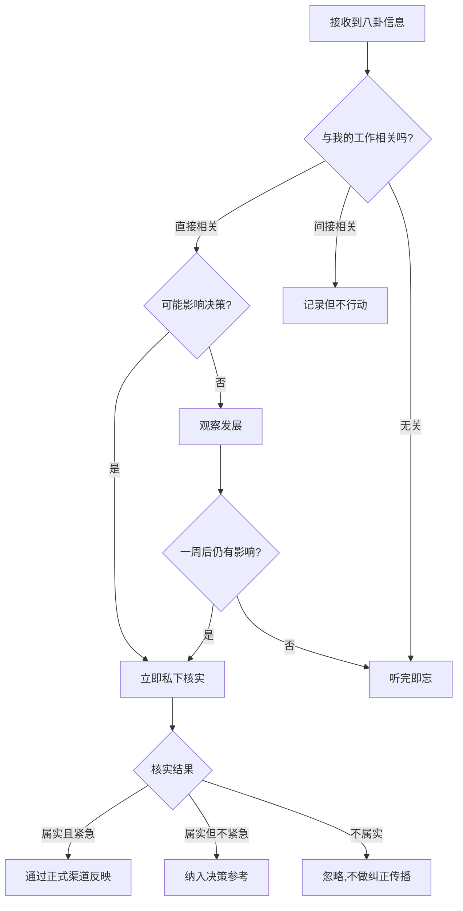

## 案例四：办公室八卦的正确处理——周明的智慧

### 一、案例背景：一个典型的八卦场景

周明是某广告公司的创意总监，入职五年，从普通设计师一路晋升，深谙组织中的人际关系运作规律。公司规模约两百人，部门之间协作频繁，信息流动速度快，也因此滋生了大量的非正式信息渠道。

公司三楼的茶水间是公认的"信息枢纽"。每天中午十一点半到一点，不同部门的同事会在这里冲咖啡、热饭、闲聊。表面上是放松休息，实际上这里是公司非正式信息网络的核心节点。谁和谁走得近、哪个项目出了问题、哪位领导最近心情不好——这些信息都在茶水间的闲聊中流转。

这天中午，周明像往常一样去茶水间倒水。市场部的同事小刘凑过来，压低声音说："周哥，你知道吗？听说市场部的张经理和客户部的李经理因为大华集团那个项目闹翻了。据说李经理在总监会上直接告了张经理的状，说市场部的方案不专业，差点丢了客户。张经理气得不行，放话说以后再也不跟客户部合作了。"

小刘说完，还补了一句："好几个市场部的人都这么说，应该八九不离十。"

这个场景在任何一家公司都不罕见。一项由哈佛商学院传播的调研数据显示，普通职场人每天花在非正式信息交流上的时间约为 52 分钟，其中涉及同事关系、人事变动和内部矛盾的内容占比超过 40%。八卦不是某个公司特有的文化问题，而是人类社会的普遍现象——社会学家将其定义为"关于不在场第三方的非正式评价性对话"。

问题不在于八卦是否存在，而在于你如何应对它。

---

### 二、周明的四步应对法

#### 第一步：倾听但不评论——做"信息海绵"而非"信息喇叭"

周明认真听完了小刘的讲述，表情平静，没有露出惊讶、兴奋或鄙夷的神色。他点了点头，只说了一句话："哦，是吗？我最近一直在忙创意部的项目，不太了解那边的情况。"

这句话看似简单，实际上经过了精心设计，包含三层含义：

| 表面意思 | 潜台词 | 实际效果 |
|---------|--------|---------|
| "哦，是吗" | 表示听到了，但没有情绪反应 | 不给对方继续深聊的信号 |
| "我最近一直在忙创意部的项目" | 我跟这件事没有利益关系 | 划清界限，避免被卷入 |
| "不太了解那边的情况" | 我没有立场发表看法 | 免除了表态的压力 |

**为什么不能直接拒绝倾听？** 直接说"我不想听八卦"或"你不要传这些"会伤害关系，让对方觉得你清高、不好相处。更重要的是，你会失去一个信息来源。在职场政治中，信息就是资源——关键在于你如何使用它。

**为什么不能评论？** 任何评论都是风险。如果你说"张经理确实有问题"，这句话可能被转述为"创意部的周明也觉得张经理不行"。如果你说"李经理不应该这样做"，又可能被解读为你在站队。沉默是最好的盔甲。

**倾听时的非语言技巧：**

- **眼神接触**：保持适度的眼神接触，表示你在认真听，但不要表现得过于感兴趣
- **身体语言**：保持中立姿态，不要前倾（表示好奇兴奋），也不要后仰（表示排斥抗拒）
- **微表情管理**：控制惊讶、窃喜、皱眉等微表情。八卦传播者会观察你的反应来判断你是否"同道中人"
- **适时点头**：表示"我在听"，但不表示"我同意"

#### 第二步：不传播——切断信息的扩散链条

周明回到工位后，没有跟任何人提起这件事。即使是在创意部内部的小群里，他也没有分享这条"新闻"。

**传播八卦的四重风险：**

1. **溯源风险**：信息一旦传播出去，就可能被追溯到你。"周明说的"比"小刘说的"更可信，因为你职位更高、口碑更好——但这恰恰意味着你承担了更大的信誉风险。

2. **变形风险**：每次传播都会经过一次"信息加工"。你原话说的是"听说他们有点分歧"，传到第三个人可能变成"周明说他们彻底闹翻了"。你无法控制别人如何转述你的话。

3. **站队风险**：传播关于某人的负面信息，天然会被理解为你对那个人有意见。即使你只是"客观转述"，听者也会认为你在表达立场。

4. **法律风险**：如果八卦内容涉及诽谤、侵犯隐私或商业机密，传播者可能承担连带法律责任。《民法典》第一千零二十四条明确规定了名誉权保护，传播不实信息造成他人名誉损害的，传播者与原始散布者承担连带责任。

**"传播"的边界在哪里？**

| 行为 | 是否算传播 | 风险等级 |
|------|-----------|---------|
| 主动把八卦告诉别人 | 是 | 极高 |
| 被问到时转述八卦内容 | 是 | 高 |
| 被问到时说"我也不太清楚" | 否 | 低 |
| 只向直接相关方核实情况 | 否（但需注意方式） | 中 |
| 向上级反映可能影响工作的信息 | 否（属于正当汇报） | 低 |

#### 第三步：私下核实——用事实替代传言

周明没有轻信小刘的话，也没有置之不理。作为创意总监，他跟市场部和客户部都有业务往来，如果两个部门真的闹翻了，可能会影响到他正在跟进的几个跨部门项目。

他找了一个切入点：与张经理和李经理都关系不错的行政部老王。周明没有直接问"张经理和李经理是不是闹翻了"，而是以"关心项目进展"为由切入。

周明的原话是："老王，大华集团那个项目我之前也参与过竞标方案，最近听说推进得不太顺利？两个部门的配合还顺畅吗？"

这个问法有三个巧妙之处：

- **以项目为切入点，而非以人**：不涉及个人恩怨，只关心工作进展
- **用"配合"而非"矛盾"**：给对方一个正面的框架来描述情况
- **以自身参与为由**：有合理的询问动机，不会显得在打听八卦

老王的回答证实了周明的判断：张经理和李经理确实在方案方向上有过分歧，张经理倾向于保守策略，李经理想要大胆创新。但双方在会后已经达成了折中方案，所谓的"闹翻""告状"完全是茶水间的过度解读。

**核实信息的五种渠道：**

1. **当事人身边可信的人**：像老王这样同时了解双方、性格稳重的同事，是核实八卦的最佳渠道。关键是选择真正客观的人，而不是某一方的"自己人"。

2. **工作场景中的自然观察**：跨部门会议上，注意双方的互动态度。是正常交流还是刻意回避？是就事论事还是冷嘲热讽？这些细节能帮你判断传言的真实性。

3. **邮件和工作群的间接线索**：不要刻意去翻查，但在正常工作往来中，注意双方的沟通频率和语气是否发生了明显变化。

4. **正式汇报渠道**：如果八卦涉及你负责的项目或团队，可以通过正常的工作汇报渠道向上级了解情况，但要以工作为出发点。

5. **时间验证**：很多八卦会在一两周内自然消散。如果不涉及紧急决策，等一等再判断，往往是最明智的做法。

**信息可信度评估框架：**

可信度 = 来源可靠性 × 信息具体程度 × 多方印证一致性 / 传播链条长度 × 情绪化程度

- 来源可靠性：当事人亲口说的 > 当事人身边人 > 间接听说 > 匿名消息
- 信息具体程度：有时间地点人物的 > 模糊描述的 > 纯猜测的
- 多方印证：三个独立来源说的一致 > 两个人说的 > 单一来源
- 传播链条：每多经过一个人，信息失真约 30%
- 情绪化程度：越激动的转述，越可能包含主观加工

#### 第四步：在合适的场合发挥正面作用——化信息为行动

核实完情况后，周明没有去找张经理或李经理"调解"，也没有把核实结果告诉小刘。他做了一件更高明的事。

在两周后的跨部门协调会上，讨论到一个需要市场部和客户部协作的新项目时，周明主动发言：

"说到跨部门协作，我特别想提一下之前大华集团那个项目。当时市场部和客户部在策略方向上有不同的看法，但最后双方找到了一个非常巧妙的折中方案，客户反馈很好。这说明不同视角的碰撞其实能产生更好的结果。张经理、李经理，你们觉得那个项目的协作经验，能不能复制到这个新项目上？"

这番话产生了几个效果：

1. **公开肯定了双方的合作成果**：把"闹翻"的叙事改写为"成功协作"的叙事
2. **给了双方面子**：在正式场合赞扬对方，比私下安慰更有效
3. **建立了正向先例**：为新项目的跨部门合作奠定了基调
4. **自然而不刻意**：看起来是在分享经验，而不是在"调解矛盾"

---

### 三、案例深度分析：为什么周明的做法有效

#### 3.1 背后的心理学原理

**信息不对称理论的应用**

周明掌握了茶水间的"小道消息"，但没有被这个信息所绑架。他通过独立核实，打破了信息不对称，将"可能错误的信息"转化为"经过验证的事实"。在信息不对称的环境中，拥有正确信息的人拥有天然的优势——但前提是你能分辨哪些信息是正确的。

**印象管理理论的体现**

社会心理学家 Erving Goffman 的"印象管理"理论指出，人们在社交互动中会有意识地管理他人对自己的印象。周明在整个过程中的表现——倾听但不评论、不传播、在公开场合发挥正面作用——都精准地塑造了一个"稳重、客观、有格局"的职业形象。

**社会交换理论的应用**

周明帮助化解了张经理和李经理之间的潜在矛盾，这是一种"社会资本投资"。根据社会交换理论，这种利他行为会在未来得到回报——两个部门的负责人都会记住周明在关键时刻的支持。

#### 3.2 不同做法的后果对比

下表展示了面对同一八卦场景，不同应对方式可能带来的后果：

| 应对方式 | 短期后果 | 长期后果 | 风险等级 |
|---------|---------|---------|---------|
| 周明的做法（听→不传→核实→正面引导） | 无即时收益 | 建立可靠口碑，获取真实信息，积累社会资本 | 低 |
| 积极传播八卦 | 获得"消息灵通"的标签，融入小圈子 | 被视为不可靠，被牵连进矛盾，失去高层信任 | 高 |
| 当面驳斥传播者 | 表明立场 | 被视为"装清高"，被八卦圈子排斥 | 中 |
| 完全回避（不听、不参与） | 保持安全 | 失去信息来源，对组织动态一无所知，在关键时刻缺乏判断依据 | 低但有隐性成本 |
| 只听不核实，直接采信 | 无即时风险 | 可能基于错误信息做出错误判断，影响工作决策 | 中 |

#### 3.3 不同职级的策略差异

周明作为创意总监，有足够的话语权在正式会议上发言。但对于不同职级的职场人，策略需要相应调整：

**基层员工（入职 0-2 年）：**

- 重点放在"听而不传"，积累对组织人际关系的认知
- 不具备在正式场合"发挥正面作用"的平台，不要强出头
- 可以做的正面行动：在自己的小范围内不参与负面讨论，用"我不太清楚"应对八卦探询

**中层管理者（3-8 年）：**

- 可以在团队内部建立"不传播八卦"的团队文化
- 在跨部门协作中，利用对八卦的了解来预判潜在矛盾，提前做好沟通准备
- 向上管理时，可以适度反映"团队士气"相关的信息，但必须以事实为基础

**高层管理者（8 年以上）：**

- 可以主动塑造组织的信息文化，建立开放透明的沟通机制
- 适度参与非正式信息交流，了解基层真实想法
- 在发现有害八卦时，通过正式渠道澄清事实，而非私下压制

---

### 四、常见误区与纠正

#### 误区一："不听八卦就能置身事外"

**错误认知：** 只要我不参与八卦，就能保持安全。

**实际情况：** 完全隔绝非正式信息渠道，意味着你会成为组织中的"信息孤岛"。当人事变动、部门重组、项目调整等重大决策发生时，你是最后一个知道的人——这比传播八卦更危险。

**纠正方法：** 保持"选择性接收"的态度。倾听，但不做价值判断；了解，但不传播；分析，但不站队。

#### 误区二："我只是如实转述，不算传播"

**错误认知：** 我没有添油加醋，只是把听到的原话告诉别人。

**实际情况：** 传播行为的定义不取决于你是否"加工"了信息，而取决于你是否将信息从一个人传递给了另一个人。即使你一字不差地转述，你仍然在传播八卦。而且，"我只是如实说的"往往成为传播者的自我开脱借口。

**纠正方法：** 用"三秒法则"——在开口之前问自己三个问题：（1）这个信息说出来对谁有好处？（2）如果当事人在场，我敢不敢说？（3）如果这句话被录下来放到公司群里，我会不会尴尬？任何一个答案是否定的，就不要说。

#### 误区三："领导应该禁止八卦"

**错误认知：** 八卦是团队管理的毒瘤，应该彻底消灭。

**实际情况：** 八卦不可能被"禁止"，试图禁止只会让它转入更隐蔽的渠道（私聊、匿名群），反而失去了解和引导的机会。社会心理学研究表明，适度的非正式交流能增强团队凝聚力和信息流通效率。

**纠正方法：** 建立"替代性沟通机制"。定期的团队分享会、匿名意见箱、一对一谈话等正式渠道能满足员工对信息的需求，减少对八卦的依赖。当正式渠道足够畅通时，八卦自然会减少。

#### 误区四："知道得越多越好"

**错误认知：** 掌握越多八卦，职场信息优势越大。

**实际情况：** 知道太多八卦本身就是一种风险。你会被贴上"八卦中心"的标签，成为别人提防的对象。更重要的是，过多的负面信息会影响你的判断力和工作情绪。

**纠正方法：** 设定"信息摄入阈值"。每天花在非正式信息交流上的时间控制在 15 分钟以内。关注与自己工作直接相关的信息，过滤掉纯娱乐性质的八卦。

#### 误区五："八卦都是假的，不用理会"

**错误认知：** 八卦都是捕风捉影，不值得花时间核实。

**实际情况：** 社会学家的研究表明，八卦中约有 65% 的内容包含至少部分事实。完全忽略八卦，可能错过重要的组织预警信号。周明的做法之所以有效，正是因为他没有轻信也没有忽略，而是通过核实来区分事实与虚构。

**纠正方法：** 采用"事实提取法"——从八卦中提取可能的事实要素（谁、什么时候、发生了什么），然后通过其他渠道验证这些事实要素，忽略情绪化描述和主观评价。

---

### 五、进阶应用：建立个人的"八卦处理系统"

#### 5.1 信息分级处理模型

将接收到的八卦按以下维度分类处理：

#### 5.2 高频场景话术库

**场景一：有人突然跟你分享八卦**

- 低风险回应："哦，这样啊。"（不追问、不评价、不传播）
- 中风险回应："你怎么知道的？"（会激发对方进一步分享，但能帮你评估信息可信度）
- 高风险回应："我也觉得 XX 有问题！"（直接表态，留下把柄）

**场景二：有人问你"你听说了吗"**

- 推荐回应："我最近一直在忙 XX 项目，好多事情都没关注。怎么了？"（既不拒绝交流，又不主动参与，同时暗示你有自己的工作重心）

**场景三：有人在你面前说第三人的坏话**

- 推荐回应："嗯，每个人看事情的角度可能不一样。"（不附和、不反驳、不表态）
- 进阶回应："XX 在我面前表现还挺好的，可能沟通上有些误会吧。"（为第三人说句公道话，但不否定分享者的感受）

**场景四：你就是八卦的主角**

- 第一反应：不要急于辩解或反击，先了解八卦的内容和传播范围
- 正确做法：找到传播链条的源头，一对一私下沟通，澄清事实
- 禁忌做法：在公开场合发怒、在群里"辟谣"、找领导告状（除非涉及严重诽谤）
- 终极策略：用行动而非语言来反驳。如果八卦说你"跟领导关系不好"，那就用你和领导的良好协作来无声回应

**场景五：下属来跟你汇报"听到的风声"**

- 先肯定态度："谢谢你告诉我这些。"
- 询问细节："你从哪里听到的？还有别人在说吗？"
- 明确边界："这个事情我会关注，但先不要跟其他人讨论。"
- 行动跟进：如果涉及团队管理问题，主动核实并处理

#### 5.3 从八卦中提取战略情报

高水平的职场人不只是"处理"八卦，而是从中提取有价值的战略情报。以下是几个实用的提取框架：

**人际关系图谱更新：** 从八卦中了解谁和谁关系好、谁和谁有矛盾，更新你对组织人际关系图谱的认知。这在跨部门协作、项目组队、利益协商时非常有价值。

**组织风向判断：** 如果近期关于某个方向的八卦突然增多（比如"公司要裁员""要成立新部门"），往往意味着确实有相关动向。八卦是正式信息泄露到非正式渠道的结果。

**领导偏好观察：** 八卦中经常包含领导的决策偏好、沟通风格、关注重点等信息。这些信息能帮你更好地做向上管理。

**潜在风险预警：** 某个项目"快黄了"、某个客户"要跑了"——这类八卦可能是真实的预警信号。提前了解，可以提前做准备。

---

### 六、案例延伸：不同组织文化下的八卦应对

周明的做法适用于大多数职场环境，但不同组织文化下需要微调策略：

| 组织文化类型 | 八卦特征 | 应对重点 |
|------------|---------|---------|
| 层级分明的国企/央企 | 八卦多围绕人事变动和领导关系 | 特别注意不传播涉及领导的八卦，核实渠道优先选择层级相近的同事 |
| 扁平化的互联网公司 | 八卦传播速度快，涉及面广 | 信息过载风险高，需要更强的过滤能力 |
| 高度政治化的传统企业 | 八卦常被用作政治工具 | 警惕"被当枪使"，核实格外重要 |
| 初创公司 | 八卦相对少但影响大 | 任何八卦都可能直接影响你的工作环境，需要快速判断和应对 |

---

### 七、关键启示总结

1. **倾听八卦，但不做传播者**：了解组织动态是必要的，但传播八卦是危险的。用"信息海绵"而非"信息喇叭"的姿态处理八卦。

2. **不轻易下结论**：八卦中的信息往往被夸大和扭曲，传播链条每多经过一环，失真率约增加 30%。用独立核实替代直接采信。

3. **利用信息做正面的事**：与其传播八卦，不如利用获得的信息来帮助解决问题、改善关系、预防风险。

4. **建立系统化的处理流程**：不要凭直觉应对八卦，建立信息分级、核实、行动的标准流程，让每一次应对都有章可循。

5. **塑造"可靠"的个人品牌**：长期来看，不传播八卦的人会被视为"可靠的人"。这种口碑在职场中是极有价值的无形资产——领导愿意跟你分享敏感信息，同事愿意跟你建立深度信任，跨部门协作时阻力更小。

6. **理解八卦的社会功能**：八卦不是纯粹的负面现象，它承担着信息传播、社会规范维护、群体凝聚等重要功能。与其对抗它，不如学会驾驭它。

***
