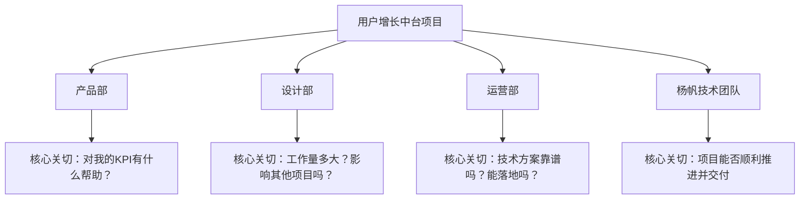
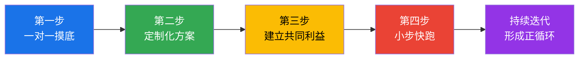
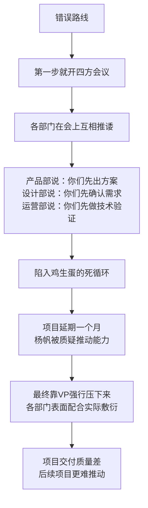

## 案例五：横向影响力的建立——杨帆的跨部门协作

横向影响力是职场政治中最考验沟通功力的场景——你没有权力命令同级同事做任何事，也不能靠行政手段强制推进。你能依赖的，只有说服力、专业判断和人际关系。本案例完整还原一位技术经理如何在没有正式权力的情况下，通过系统化的沟通策略，成功推动一个涉及三个部门的跨部门项目。

### 案例背景

杨帆是某互联网公司的技术经理，负责后端架构团队。公司近期启动了一个"用户增长中台"项目——一个需要产品、设计、运营三个部门深度协作的跨部门项目。该项目的目标是搭建统一的用户行为分析平台，为各业务线提供精细化运营的技术底座。

杨帆被指定为项目的技术负责人，但他面临一个尴尬的处境：他只对后端架构团队有管理权，对产品、设计、运营三个协作部门没有任何正式权力。他不能分配任务、不能考核绩效、不能决定优先级。他需要的，纯粹是横向影响力。

#### 项目资源需求

| 部门 | 杨帆需要的支持 | 估算工作量 | 对方当前状态 |
|------|--------------|-----------|-------------|
| 产品部 | 产品经理参与需求定义和优先级排序 | 约40人天/季度 | 正在推进3个S级项目，人手紧张 |
| 设计部 | UI/UX设计产出数据看板和操作界面 | 约30人天/季度 | 设计师被多个项目争抢，排期已满 |
| 运营部 | 运营团队提供业务场景和验收反馈 | 约20人天/季度 | 新季度KPI已定，该不在考核范围内 |

#### 利益相关方分析

杨帆在启动任何沟通之前，先做了一次系统性的利益分析。这一步是横向影响力的基础——不了解对方在想什么，你的所有努力都是盲打。

| 利益方 | 显性诉求 | 隐性诉求 | 深层焦虑 |
|--------|---------|---------|---------|
| 产品部 | 产品指标持续增长 | 不被额外项目拖累核心产品迭代 | 抽调人手导致核心产品延期，被VP问责 |
| 设计部 | 设计质量和团队口碑 | 不沦为"接单机器" | 多线作战导致产出质量下降，设计师离职 |
| 运营部 | 获得好用的数据工具提升运营效率 | 技术方案要稳定可靠 | 投入时间配合后项目烂尾，白费功夫 |
| 杨帆 | 项目成功交付 | 展现跨部门推动能力 | 各部门不配合，项目停滞，个人能力被质疑 |

### 四个部门的拒绝话术拆解

在跨部门协作中，每个部门的"拒绝"都有表面理由和真实原因。杨帆做的第一件事，就是听懂对方话里的真意。

#### 产品部："这个项目不是我们的KPI重点"

**表面意思**：这个项目对我们不重要。

**真实含义**：我手上有三个S级项目在赶进度，VP天天盯着，我不能分心做"锦上添花"的事。

**深层焦虑**：如果这个项目占用了产品经理的时间导致核心产品延期，板子打在我身上。

#### 设计部："人手不够，排不上期"

**表面意思**：我们太忙了，帮不了你。

**真实含义**：我已经接了五个项目的设计需求了，再加一个设计师要造反了。

**深层焦虑**：如果设计师因为过载离职，我是第一个被追责的。

#### 运营部："技术方案不清楚，不敢承诺"

**表面意思**：你的方案不够清楚。

**真实含义**：我以前被技术项目坑过——投入了时间配合，最后项目烂尾了，我的时间全白费。

**深层焦虑**：技术团队画的饼太大，最后做不出来，我没法向老板交代为什么要花时间配合。

### 杨帆的沟通策略设计

杨帆没有一上来就召开四方会议——这是跨部门协作中最常见的错误。在各方诉求不明、信任基础未建立的情况下，联合会议只会变成"互相推诿会"。他设计了一套四步走的策略：

#### 第一步：一对一沟通，获取真实信息

杨帆分别与三个部门的关键人物进行了私下一对一沟通。他遵循了一个核心原则：**先听后说，先问后答**。

**与产品部的沟通**：

杨帆约了产品部的高级产品经理赵鹏在公司楼下的咖啡厅。他的开场白经过精心设计：

> "赵鹏，听说你们上个季度的核心指标超额完成了，恭喜恭喜。最近我在思考用户增长中台的事，想先听听你的想法——你们产品部现在最关心什么？这个中台对你们的产品规划有没有帮助？"

话术设计逻辑：

| 话术要素 | 具体内容 | 设计意图 |
|----------|---------|---------|
| 认可对方成就 | "核心指标超额完成" | 建立好感，消除防御心理 |
| 以请教姿态切入 | "想先听听你的想法" | 表达尊重，降低对方警惕 |
| 关联对方利益 | "对你们的产品规划有没有帮助" | 暗示项目对对方有价值 |
| 不提需求 | 不说"我需要你们配合" | 信息获取阶段不引入压力 |

这次沟通让杨帆获得了关键信息：赵鹏最关心的是"这个项目能否帮助产品部建立更精准的用户画像，从而提升转化率"。如果能实现这个目标，这个项目反而能成为赵鹏的业绩亮点。

**与设计部的沟通**：

杨帆了解到设计部主管孙芳最担心的是工作量不可控。孙芳坦率地说："上一次跨部门项目，说好只需要两周的设计量，最后拖了两个月，我的设计师差点辞职。"

这让杨帆意识到，设计部的抗拒不是因为不认可项目价值，而是因为过去的被伤害经历。他需要做的，不是说服，而是重建信任。

**与运营部的沟通**：

运营部负责人李华的拒绝最为直接："技术方案不清楚，我没法评估要投入多少运营资源。"但深入沟通后，杨帆发现李华真正需要的是三样东西：明确的技术方案文档、可预期的项目里程碑、以及一个可靠的对接窗口。

#### 第二步：定制化方案——用对方的语言说话

一对一沟通结束后，杨帆做了三件关键的事：

**对产品部：绑定核心指标**

杨帆写了一份简短的《用户增长中台对产品核心指标的预期影响》，用数据说话：

| 产品指标 | 当前水平 | 中台上线后预期 | 提升幅度 |
|----------|---------|-------------|---------|
| 新用户注册转化率 | 12% | 18%（基于用户行为精准推荐） | +50% |
| 次日留存率 | 35% | 42%（基于流失预警机制） | +20% |
| 功能使用深度 | 2.3个/用户/天 | 3.5个/用户/天（基于个性化引导） | +52% |

这份材料的意图不是承诺这些数字一定能实现，而是让赵鹏看到：这个项目不是在消耗产品部的资源，而是在帮产品部达成自己的KPI。

**对设计部：分阶段降低风险**

针对孙芳对工作量不可控的担忧，杨帆将设计工作拆分为三个明确的阶段，并设定了硬性的时间盒：

| 阶段 | 设计内容 | 时间盒 | 设计资源需求 |
|------|---------|--------|------------|
| 第一阶段（MVP） | 核心数据看板基础版，仅3个关键页面 | 2周 | 1名设计师 |
| 第二阶段（迭代） | 增加5个分析模块的交互设计 | 3周 | 1名设计师（兼职） |
| 第三阶段（完善） | 运营工具界面和报告模板 | 2周 | 1名设计师（兼职） |

每个阶段结束后才启动下一阶段的设计工作，设计部可以根据自己的排期灵活安排。杨帆承诺：如果设计部在某个阶段确实排不开，项目组会调整开发节奏配合，绝不会单方面催促。

**对运营部：提供可验证的技术方案**

杨帆针对李华"技术方案不清楚"的质疑，准备了三份材料：

1. **技术方案文档**（15页）：包含系统架构图、数据流图、接口定义，让李华看到技术方案是经过认真设计的
2. **项目里程碑表**（甘特图形式）：标注了每个节点的交付物和验收标准
3. **对接窗口说明**：明确指定杨帆团队的高级工程师王磊作为日常对接人，每周五下午固定同步会

李华看完材料后说了一句关键的话："这个项目跟我以前遇到的不一样，至少看起来是认真的。"

#### 第三步：找到"共同敌人"——构建共同利益联盟

在分别获得三个部门的初步认可后，杨帆开始构建共同利益联盟。他的策略是找到一个所有部门都关心的外部威胁。

杨帆发现了一个关键情报：公司的主要竞争对手"闪动科技"最近上线了一个类似功能的用户分析平台，并在行业媒体上做了大量宣传。这个消息本身并不是秘密，但杨帆做了一件别人没做的事——他整理了一份竞品功能对比分析：

| 功能维度 | 闪动科技的平台 | 我们的现状 | 差距评估 |
|----------|-------------|-----------|---------|
| 用户行为追踪 | 全链路追踪，支持自定义事件 | 各业务线数据孤岛 | 严重落后 |
| 实时数据看板 | 秒级刷新，移动端适配 | 离线报表，仅PC端 | 严重落后 |
| 智能预警 | AI驱动的流失预警 | 人工经验判断 | 严重落后 |
| 运营自动化 | 一键推送+AB测试 | 手动操作 | 中等落后 |

杨帆在分别沟通中，以"行业动态分享"的名义将这份分析传递给三个部门的关键人物。他没有说"我们落后了，你们必须配合我"，而是说"我整理了一份竞品分析，觉得大家可能都关心这个情况"。

效果立竿见影。产品部赵鹏看完后说："如果我们不跟上，用户迟早会被闪动抢走。"设计部孙芳说："他们的设计确实比我们强，我们得重视了。"运营部李华说："他们那个运营自动化功能，正是我们需要的。"

一个原本是杨帆一个人的项目，变成了"大家都在追赶竞争对手"的共同目标。

#### 第四步：小步快跑，快速展示成果

杨帆没有等待所有部门都完全准备好才启动项目。他做了一个关键决策：先用两周时间，只靠自己的技术团队，完成一个最小可行版本（MVP）。

这个MVP只实现了最核心的功能：从一个业务线采集用户行为数据，展示在最基础的数据看板上。功能很简单，但足以证明三件事：

1. **技术可行性**：平台架构是可靠的，数据采集和展示都能正常工作
2. **业务价值**：即使只有基础数据，也能发现一些有价值的用户行为模式
3. **项目是认真的**：杨帆不是在画饼，而是在用实际行动推进

杨帆组织了一场30分钟的内部Demo，邀请三个部门的关键人物参加。Demo的效果超出预期——运营部李华当场说："这个看板如果能加上我们的运营数据，我能立刻用起来。"产品部赵鹏开始主动提出需求："能不能在看板上加一个功能转化漏斗？"

MVP的展示产生了连锁反应：各部门从"被动配合"变成了"主动参与"。

### 利益相关方的反应与方案调整

各部门在看到MVP后的态度转变，以及杨帆的应对策略：

| 部门 | 初始态度 | MVP后态度 | 杨帆的应对 |
|------|---------|----------|-----------|
| 产品部 | "不是KPI重点" | "可以加入产品规划" | 纳入产品部季度OKR的协同项 |
| 设计部 | "排不上期" | "可以抽一个人参与" | 严格遵守分阶段设计，不超范围 |
| 运营部 | "不敢承诺" | "我要先用起来" | 优先接入运营部的业务数据 |
| 高层领导 | 未关注 | "这个项目做得不错" | 定期向上汇报阶段性成果 |

### 案例结果

项目最终在三个月内顺利完成第一期上线，各项数据表现：

| 结果指标 | 目标值 | 实际值 | 达成率 |
|----------|--------|--------|--------|
| 项目交付周期 | 4个月 | 3个月 | 133%（提前完成） |
| 接入业务线数 | 2个 | 4个 | 200%（超出预期） |
| 首月日活运营用户 | 50人 | 120人 | 240%（需求旺盛） |
| 产品转化率提升 | +20% | +28% | 140% |

更重要的是，杨帆在没有正式权力的情况下，建立了一套可持续的跨部门协作机制：

- **每周五的联合同步会**成为固定机制，各部门主动参加
- **设计部**主动申请在第二期增加设计资源投入
- **运营部**将"用户增长中台使用率"纳入团队考核指标
- **产品部**将中台能力整合进了下一个版本的产品路线图

### 反面教材：如果杨帆选了错误的路线

为了更清晰地展示杨帆策略的价值，我们模拟一下如果他走了常见错误路线会发生什么：

### 常见错误与纠正方法

跨部门协作中，许多人在沟通上犯的错误不是"做错了什么"，而是"在错误的时机做了正确的事"。

| 常见错误 | 为什么是错的 | 正确做法 |
|----------|-------------|---------|
| 一开始就召集所有部门开联合会议 | 各方诉求不明确，会议变成互相推诿 | 先一对一了解各方诉求，再召开联合会议 |
| 用"公司战略"压人 | 对方表面服从，内心抗拒，后续配合敷衍 | 用对方关心的利益点说服，而非组织权威 |
| 只讲自己需要什么 | 对方没有帮你的动机 | 先讲对方能得到什么，再讲你需要什么 |
| 等所有人准备好才启动 | 永远等不到那一天 | 先做出最小成果，用事实吸引参与 |
| 每天催进度 | 让对方产生反感，配合意愿下降 | 设定明确的同步节奏（如每周一次），不过度打扰 |
| 把所有沟通放在群里 | 公开场合大家都会"打官腔"，真话在私下说 | 敏感话题一对一沟通，共识形成后再在群里确认 |
| 项目结束后就断了联系 | 下次需要协作时又要从零开始 | 维护关系，定期分享项目成果给各方 |

### 进阶分析：横向影响力的五种来源

杨帆的案例展示了横向影响力的多种来源。理解这些来源的本质，才能在不同场景中灵活运用：

#### 专业影响力

杨帆能够提供竞品分析、技术方案、MVP原型，这些都建立在他扎实的专业能力之上。专业影响力是最稳固的横向影响力来源——当你在某个领域比别人懂得多，别人自然愿意听你的建议。

**建立方法**：持续深耕专业领域，主动分享知识和见解，成为同事遇到相关问题时第一个想到的人。

#### 信息影响力

杨帆掌握的信息（竞争对手动态、各部门真实诉求、项目时间节点）让他能在沟通中始终占据主动。信息的价值不在于"我知道你不知道"，而在于"我能让信息流动到正确的人手中"。

**建立方法**：广泛阅读行业信息，保持跨部门的人际网络，成为信息的"集散地"而非"黑洞"。

#### 互惠影响力

杨帆在MVP展示中帮运营部看到了即时可用的工具价值，帮产品部找到了提升指标的新路径。这种"先给予"的做法构建了互惠网络——你帮了别人，别人自然愿意在你需要时回报。

**建立方法**：主动帮助同事解决小问题，不计较回报；在协作中优先考虑对方的利益。

#### 情感影响力

杨帆在整个过程中保持了耐心、尊重和真诚。他没有因为各部门的初始拒绝而急躁或抱怨，而是持续展示诚意。情感影响力让你成为团队中值得信赖的人。

**建立方法**：在困难时期保持冷静，真诚关心同事的感受，不传播负面情绪。

#### 过程影响力

杨帆对沟通节奏的把控——先一对一再联合、先MVP再全面推进、先私聊再群内确认——体现了对过程的精准控制。过程影响力意味着你能决定事情以什么方式、在什么时间、以什么顺序发生。

**建立方法**：提前规划沟通路径，控制关键节点的节奏，确保每一步都在你的预期范围内推进。

### 可复用的沟通模板

以下模板可以在类似场景中直接套用：

**模板一：一对一沟通邀请**

> "[对方称呼]，听说你们最近[对方的工作动态]，恭喜恭喜。我最近在思考[项目相关话题]，想先听听你的看法——你们现在最关心的是什么？这个项目对你们的[核心指标/规划]有没有帮助？"

**模板二：定制化方案呈现**

> "上次聊完之后，我根据你们的需求做了一些调整。针对你们关心的[对方核心诉求]，我们的方案是[具体方案]。这样安排的好处是[对对方的具体价值]。你看这样可行吗？"

**模板三：共同利益构建**

> "我最近注意到[竞争对手/行业趋势/市场变化]的情况，整理了一份分析。我觉得这个变化对我们几个部门都有影响，想分享给大家参考。"

**模板四：MVP展示邀请**

> "我们已经完成了一个最基础的原型，虽然功能还很简单，但能验证[核心价值点]。想邀请大家花30分钟看一下，给些反馈。"

**模板五：建立固定协作机制**

> "为了确保项目高效推进，我建议我们每周[时间]花30分钟同步一下进展和问题。如果某周没有需要讨论的议题，我们就跳过。你觉得这个节奏可以吗？"

### 适用场景与边界

横向影响力的这套方法论适用于大多数跨部门协作场景，但也有其边界：

| 场景 | 适用程度 | 说明 |
|------|---------|------|
| 技术驱动的跨部门项目 | 非常适用 | 技术经理天然具备专业影响力 |
| 产品推动的跨部门需求 | 适用 | 需要额外强化业务价值论证 |
| 公司级战略项目的横向协调 | 部分适用 | 高层支持可作为辅助手段，但不能替代横向沟通 |
| 对方部门有根本利益冲突 | 不适用 | 需要上升到共同上级裁决 |
| 紧急项目，没有时间做四步走 | 部分适用 | 跳过MVP阶段，直接带着方案和高层背书沟通 |

关键判断标准：**双方是否存在潜在的共同利益**。如果存在，横向影响力就有发挥空间；如果利益完全对立，需要借助制度机制（如项目管理委员会、PMO）来解决。

***

