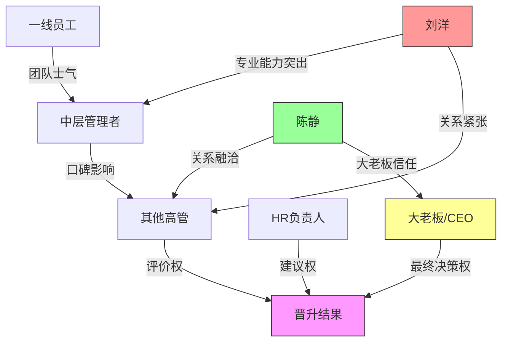
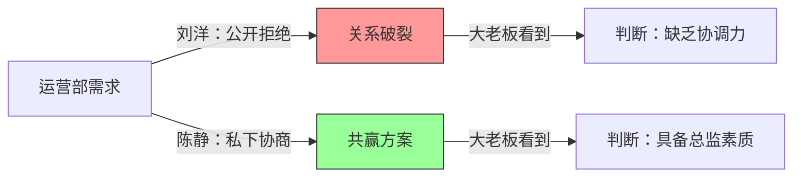

## 案例六：晋升竞争中的政治智慧——两位副总监的较量

晋升竞争是职场政治中最典型、最激烈的场景之一。它不仅考验候选人的业务能力，更是一场关于影响力、关系网络和战略思维的综合博弈。本案例通过两位副总监的真实较量，深入剖析晋升决策背后的权力逻辑，提炼出可复用的竞争策略与行动框架。

### 一、案例背景：一场没有硝烟的战争

#### 1.1 组织环境

某互联网公司产品部，团队规模约60人，下设三个产品线。公司正处于业务扩张期，产品部在组织架构中属于核心部门，直接影响公司的战略方向和营收增长。

产品总监因个人原因提出离职，公司管理层决定从内部提拔继任者，而非外部招聘。这一决策基于两个考量：一是内部候选人对公司业务更熟悉，上手更快；二是向全体员工传递"内部晋升通道畅通"的积极信号。

#### 1.2 两位候选人画像

| 维度 | 刘洋 | 陈静 |
|------|------|------|
| 年龄 | 35岁 | 33岁 |
| 出身背景 | 技术转产品 | 运营转产品 |
| 专业能力 | ★★★★★ | ★★★☆☆ |
| 向上管理 | ★★☆☆☆ | ★★★★★ |
| 横向关系 | ★★☆☆☆ | ★★★★★ |
| 下属评价 | ★★★★☆ | ★★★☆☆ |
| 政治敏感度 | ★★☆☆☆ | ★★★★★ |
| 战略视野 | ★★★☆☆ | ★★★★☆ |

**刘洋**是典型的技术型管理者。他从一线产品经理做起，凭借出色的产品感觉和严谨的逻辑思维，主导了公司多个核心产品从0到1的搭建。他信奉"用结果说话"，认为只要做出好产品，自然会得到认可。在团队内部，他以专业能力赢得了下属的尊重，但在跨部门协作和向上沟通方面存在明显短板。

**陈静**则是典型的关系型管理者。她从运营岗位转型，虽然在产品专业深度上不如刘洋，但她对用户需求的理解、对商业逻辑的把握以及对组织政治的敏感度都远超同侪。她善于在不同利益方之间找到平衡点，能够在复杂的组织环境中推动事情落地。

#### 1.3 晋升决策的隐性标准

表面上，公司公布的晋升标准是"专业能力、管理能力、战略视野"三项。但在实际决策中，大老板心中还有一套隐性标准：

- **可控性**：新总监是否能与高层保持良好沟通，而非"独行侠"
- **协调力**：能否跨部门整合资源，而非只关注本部门利益
- **稳定性**：能否在复杂局面中维持团队稳定，而非制造冲突
- **可塑性**：是否有持续成长的潜力，而非已经到达天花板

这些隐性标准很少被公开讨论，但往往决定了最终结果。

### 二、竞争态势的深度分析

#### 2.1 权力地图绘制

在晋升竞争中，谁拥有决策权、谁拥有影响力、谁能提供支持，构成了一个复杂的权力网络。

从权力地图中可以清晰看到：刘洋的支持者主要是一线员工（无决策权），而陈静的支持者是中层管理者和高层（有决策权和影响力）。这从根本上决定了竞争的走向。

#### 2.2 双方的战略选择

**刘洋的战略：实力证明战略**

刘洋的核心信念是"业绩为王"。他认为：

- 只要项目做得好，数据说话，自然能赢
- 主动争取支持是"搞政治"，不够正直
- 专业能力是晋升的唯一决定因素

这种战略在技术驱动型组织中可能有效，但在一个强调协作和综合能力的互联网公司中，局限性非常明显。

**陈静的战略：全面布局战略**

陈静的核心信念是"晋升是一场系统工程"。她认为：

- 专业能力是入场券，但不是决定因素
- 决策者看到的"你"比真实的"你"更重要
- 晋升前的3-6个月是关键的布局窗口期

她的行动覆盖了三个维度：向上管理（让决策者认可）、横向联盟（让同级支持）、向下影响（让团队拥护）。

#### 2.3 博弈论视角下的竞争分析

从博弈论的角度看，这场晋升竞争属于典型的"非零和博弈"。表面上只有一个职位，双方是对立的，但实际上：

- 刘洋如果在竞争中展现了成长，即使失败也能为下一次晋升积累资本
- 陈静如果赢得不光彩，即使晋升也会面临信任危机
- 双方如果在竞争中互相拆台，可能两败俱伤，公司转而外部招聘

最优策略不是"击败对手"，而是"最大化自己的综合评分"。

### 三、三个关键事件的深度解析

#### 3.1 事件一：项目汇报——展示能力的艺术

**场景还原**

公司安排了一场晋升答辩，要求两位候选人分别用20分钟汇报一个创新项目方案，由CEO、CTO、HR负责人和两位VP组成评审团。

**刘洋的汇报策略**

刘洋选择了一个技术壁垒很高的AI推荐系统优化方案。他的汇报结构是：

1. 技术架构（5分钟）：详细的系统设计和算法选型
2. 数据分析（5分钟）：A/B测试结果和性能指标
3. 实施计划（3分钟）：技术开发排期和里程碑
4. 风险评估（2分钟）：技术风险和应对方案

总时长15分钟，技术含量极高，但存在三个致命问题：

- **缺乏战略语境**：没有解释"为什么要做这个项目"，评委无法将方案与公司战略关联
- **过于技术化**：CTO听得懂，但CEO和HR负责人几乎听不懂
- **没有互动**：讲完就坐下了，没有给评委提问和讨论的空间

**陈静的汇报策略**

陈静选择了一个用户增长策略方案。她的汇报结构是：

1. 问题定义（5分钟）：当前增长瓶颈在哪里，为什么现在必须解决
2. 战略对齐（3分钟）：这个方案如何支撑公司年度目标
3. 方案概述（5分钟）：核心策略和关键动作（技术细节一笔带过）
4. 资源需求（3分钟）：需要哪些部门配合，预期ROI
5. 留白讨论（4分钟）：主动邀请评委提问和讨论

更关键的是，陈静在汇报前做了三件事：

- 提前一周与CTO喝了咖啡，了解他对增长问题的看法，汇报中引用了CTO的观点
- 向HR负责人请教了"公司对产品总监的核心期望是什么"，汇报中刻意突出了对应的能力展示
- 给CEO发了一份一页纸的方案摘要，让CEO带着"已知框架"来听汇报

**结果分析**

陈静的方案获得了更高评价。但从专业角度看，刘洋的方案含金量更高。这个结果揭示了一个关键真相：**晋升答辩不是技术评审，而是"能力展示+信任建立"的综合舞台**。

评委评的不是"谁的方案更好"，而是"谁更适合当总监"。陈静通过汇报展示了战略思维、跨部门协调能力和向上管理意识，这些恰恰是总监岗位的核心能力。

**可复用的汇报框架**

| 环节 | 时间占比 | 核心目标 | 常见错误 |
|------|----------|----------|----------|
| 问题定义 | 20% | 让评委认同"这个问题值得解决" | 跳过问题直接讲方案 |
| 战略对齐 | 15% | 将方案与组织目标关联 | 只关注部门利益 |
| 方案概述 | 30% | 展示专业能力和创新思维 | 过于技术化或过于空泛 |
| 资源与影响 | 15% | 展示协调能力和全局视野 | 只讲本部门的事情 |
| 开放讨论 | 20% | 展示自信、应变和倾听能力 | 防御性回应质疑 |

#### 3.2 事件二：跨部门冲突——处理矛盾的能力

**场景还原**

产品部与运营部就一个核心功能的优先级产生了分歧。运营部要求优先上线一个促销活动页面，产品部认为当前阶段应该优先优化核心用户体验。

**刘洋的处理方式**

刘洋直接在邮件中回复："这个需求优先级不合理，产品部不会排期。"

从产品专业角度看，刘洋的判断可能是正确的。但从政治角度看，这个回复犯了三个错误：

- **公开拒绝**：邮件抄送了双方领导，让运营部负责人"面子挂不住"
- **只说不做**：只说了"不"，没有提供替代方案
- **忽视诉求**：没有了解运营部提出这个需求的深层原因

**陈静的处理方式**

陈静采取了完全不同的策略：

1. **私下沟通**：先找到运营部负责人，了解他们的真实诉求（原来是季度KPI压力大，急需短期数据）
2. **寻找共赢**：提出一个折中方案——用最小成本做一个MVP版本满足运营需求，同时保留核心体验优化的主线排期
3. **向上通报**：将处理结果同步给双方领导，但强调的是"跨部门协作解决问题"，而非"谁对谁错"
4. **建立机制**：建议建立产品-运营双周对齐会，从制度上避免类似冲突

**权力动态分析**

这个事件被大老板看在眼里，成为判断"谁更适合做总监"的重要参考。原因在于：**处理冲突的方式，直接反映了一个人在组织中的定位——是"专业的孤岛"还是"协作的枢纽"**。

**跨部门冲突处理的五步法**

1. **暂停反应**：收到冲突信号后，不要立即回应，给自己24小时冷静期
2. **理解诉求**：找到对方负责人，用"我想了解一下你们的考虑"而非"你们为什么提这种需求"来开场
3. **寻找交集**：列出双方的核心利益点，找到重叠区域
4. **提出方案**：不是"你赢我输"，而是"我们都得到了想要的东西"
5. **固化机制**：将临时解决方案制度化，防止问题重复发生

#### 3.3 事件三：争取支持——联盟建设的系统工程

**刘洋的选择：等待被发现**

刘洋在整个竞争期间几乎没有主动行动。他的逻辑是：

- "我的业绩摆在那里，领导自然看得到"
- "主动找领导聊天是拍马屁"
- "同事之间保持正常工作关系就好"

这种心态在职场新人中很常见，但到了副总监级别，它会成为严重的制约因素。

**陈静的选择：系统性布局**

陈静在竞争期间完成了一系列精心设计的行动：

| 时间 | 行动 | 目标 | 话术要点 |
|------|------|------|----------|
| 第1周 | 与技术部负责人喝茶 | 化解刘洋造成的芥蒂 | "之前沟通方式不太成熟，我来替产品部道个歉" |
| 第2周 | 向CEO做第一次非正式汇报 | 展示战略思考 | "我最近在思考产品部明年的方向，想听听您的指导" |
| 第3周 | 与HR负责人沟通 | 了解岗位期望 | "想请教一下，公司对这个岗位最看重什么" |
| 第4周 | 与CTO交流技术规划 | 建立技术同盟 | "产品部的方案需要技术部的支持，想提前沟通" |
| 第5周 | 向CEO做第二次汇报 | 深化信任 | "上次您提到的几个点，我做了深入思考" |
| 第6周 | 组织跨部门午餐会 | 提升影响力 | "产品部想和各部门加深了解，一起吃个饭" |

这些行动不是"搞关系"或"拍马屁"，而是**系统性的影响力构建**。每个行动都有明确的目标、具体的策略和可衡量的效果。

**向上管理的四个层次**

| 层次 | 行为 | 效果 | 刘洋所处 | 陈静所处 |
|------|------|------|----------|----------|
| 被动汇报 | 只在被问到时才说 | 决策者不了解你 | ✓ | |
| 主动汇报 | 定期分享工作进展 | 决策者知道你在做什么 | | ✓ |
| 战略对话 | 与决策者讨论方向性问题 | 决策者认为你有高度 | | ✓ |
| 信任伙伴 | 成为决策者的"自己人" | 决策者愿意支持你 | | 接近 |

### 四、结果与深层启示

#### 4.1 最终决策

陈静获得了晋升。大老板的评语是："刘洋的业务能力毋庸置疑，但总监不仅需要做好产品，更需要带好团队、协调资源、推动战略。陈静在这些方面展现了更强的综合能力。"

这个评语透露了三个信息：

- **能力不是问题**：大老板认可刘洋的专业能力
- **差距在综合能力**：不是"谁更强"，而是"谁更适合"
- **"更需要"三个字**：说明在总监岗位上，协调能力比专业能力更重要

#### 4.2 刘洋的反思与成长

刘洋在得知结果后非常沮丧，一度想离职。他的导师与他进行了一次深入交谈：

> "你的专业能力是你的核心优势，这一点不会因为这次晋升失败而改变。但你需要认识到，在组织中，专业能力只是必要条件，不是充分条件。总监的价值不在于自己能做出多好的产品，而在于能带领团队做出多好的产品、能协调资源支持产品、能向上争取战略支持。你需要学会：
>
> 1. **向上管理**：让决策者了解你的价值和想法
> 2. **横向联盟**：与其他部门建立良好的合作关系
> 3. **政治敏感度**：理解组织中的权力动态和利益格局
> 4. **综合展示**：不仅展示'做了什么'，还要展示'为什么做'和'带来的影响'"

刘洋接受了这个建议，在接下来的一年中刻意提升自己的政治智慧，最终在下一次晋升中成功获得了总监职位。

#### 4.3 刘洋的成长路径

刘洋在失败后采取了以下行动：

- **每月一次与CEO的非正式汇报**：从"被问才答"变为"主动分享"
- **跨部门午餐计划**：每周与一位其他部门的负责人共进午餐
- **向陈静学习**：放下竞争心态，主动向陈静请教协调经验
- **参加管理培训**：系统学习领导力和组织行为学

### 五、晋升竞争的通用策略框架

#### 5.1 晋升准备的时间线

| 阶段 | 时间 | 核心任务 | 关键行动 |
|------|------|----------|----------|
| 基础建设期 | 晋升前12-6个月 | 打造核心业绩、建立关键关系 | 完成1-2个标杆项目、主动承担跨部门工作 |
| 布局期 | 晋升前6-3个月 | 提升可见度、争取关键支持 | 定期向上汇报、参与战略讨论、帮助其他部门 |
| 冲刺期 | 晋升前3-1个月 | 强化关键优势、弥补关键短板 | 准备晋升答辩、与决策者深度沟通 |
| 决战期 | 晋升前1个月 | 展示综合能力、争取最终支持 | 答辩准备、最后的关系维护 |

#### 5.2 晋升竞争中的常见误区

| 误区 | 表现 | 后果 | 纠正方法 |
|------|------|------|----------|
| 业绩万能论 | "只要做出成绩，自然能晋升" | 被"会展示"的对手超越 | 业绩是必要条件，不是充分条件 |
| 政治洁癖 | 认为搞关系是"不正直" | 错失关键支持 | 关系建设是职业素养，不是投机取巧 |
| 孤军奋战 | 不争取支持，单打独斗 | 缺乏同盟，在决策时无人力挺 | 系统性地建立支持网络 |
| 忽视对手 | 不了解竞争对手的策略和优势 | 被动应对，错失机会 | 客观分析对手，找到差异化优势 |
| 急于求成 | 竞争期间才开始布局 | 太晚，效果有限 | 至少提前6个月开始准备 |
| 公开对立 | 与竞争对手正面冲突 | 两败俱伤，公司外部招聘 | 保持专业，聚焦自身提升 |

#### 5.3 晋升自检清单

在竞争开始前，用以下清单评估自己的准备程度：

**专业能力维度**

- [ ] 是否有1-2个标杆项目可以作为晋升答辩的核心素材
- [ ] 是否掌握了岗位所需的核心专业技能
- [ ] 是否能用数据和案例证明自己的专业价值
- [ ] 是否有独特的专业优势（区别于竞争对手）

**向上管理维度**

- [ ] 决策者是否了解你的核心能力和近期成果
- [ ] 是否与决策者有过深度的战略对话
- [ ] 决策者是否认为你有"总监级"的视野和格局
- [ ] 是否了解决策者对这个岗位的核心期望

**横向关系维度**

- [ ] 是否与3个以上关键部门的负责人有良好的工作关系
- [ ] 是否有过成功的跨部门协作案例
- [ ] 其他部门的负责人是否愿意为你"背书"
- [ ] 是否能调动跨部门资源支持自己的项目

**团队影响维度**

- [ ] 团队成员是否拥护你的管理风格
- [ ] 是否培养了1-2个可以接替你当前位置的下属
- [ ] 团队的绩效和稳定性是否在部门中排名靠前
- [ ] 是否有下属在其他场合主动为你"说话"

**政治敏感度维度**

- [ ] 是否了解组织中的权力结构和利益格局
- [ ] 是否知道谁是关键决策者、谁是关键影响者
- [ ] 是否能识别组织中的隐性规则和潜台词
- [ ] 是否能在复杂局面中保持冷静和判断力

### 六、本案例的核心启示

**第一，晋升是一场系统工程，不是一次考试。** 从决定竞争到最终结果，可能跨越数月甚至一年。在这个过程中，每一天的行动都在为最终结果积累或消耗"资本"。等到竞争开始才行动，往往为时已晚。

**第二，专业能力是入场券，综合能力是胜负手。** 在基层岗位，专业能力可能是决定性因素。但越往高层走，"协调资源、推动战略、影响决策"的能力越重要。这不是说专业能力不重要，而是说仅靠专业能力不够。

**第三，"会做事"和"会展示"同样重要，但"会展示"不等于"吹牛"。** 陈静的"展示"不是夸大其词，而是用决策者能理解的语言，讲述自己的价值。这是一种沟通能力，也是一种政治智慧。

**第四，政治敏感度不是"圆滑世故"，而是"理解组织运行规律"。** 刘洋不是不优秀，而是不理解组织决策的逻辑。当他理解了这个逻辑并调整了行为后，他同样成功晋升了。

**第五，失败是最好的学习机会。** 刘洋如果没有这次失败，可能会一直在"专业能力强但晋升不上去"的困境中打转。这次失败让他看清了自己的短板，并有针对性地进行了提升。

***
