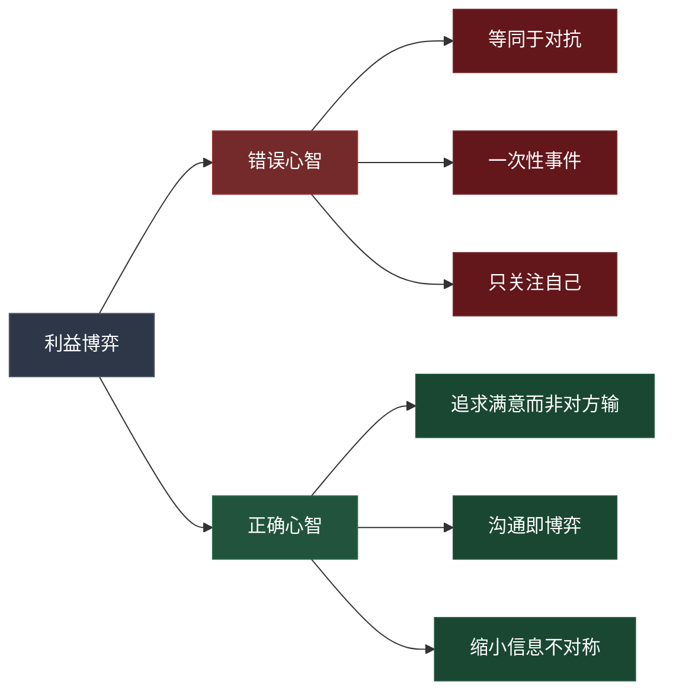
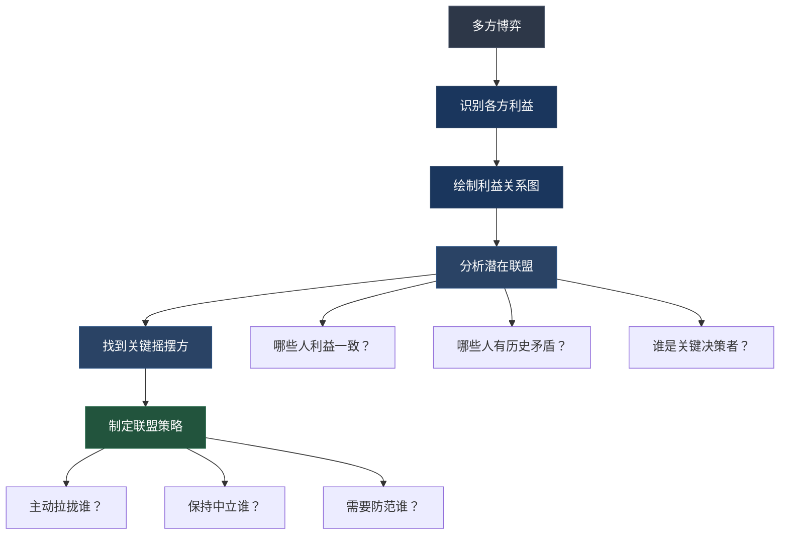

## 一、利益博弈中的沟通策略

理论部分已经帮我们建立了认知框架——理解了博弈论的底层逻辑（零和与正和）、利益的八维分析、以及权力的五种来源。本节的核心任务是将这些理论转化为**可执行的沟通行动**：当你面对一场具体的利益博弈时，该说什么、怎么说、何时说、对谁说。

### 1.1 利益博弈的沟通心智模型

在进入具体技巧之前，先校准你的心智模型。很多人在利益博弈中犯的第一个错误不是说错了话，而是**想错了方向**。

#### 1.1.1 三种错误心智模型

**错误一：把博弈等同于对抗**

"他想要这个项目，我也想要，所以我们是对立的。"这种想法把博弈简化成了拳击赛——两个人只能有一个赢家。现实中的职场博弈更像一场谈判桌上的多方对话，每个人都有多个诉求，每个诉求的优先级不同，交换的空间远比想象中大。

**错误二：把博弈视为一次性事件**

"这次谈完就结束了。"职场中的利益博弈几乎都是**重复博弈**——你和同一个上级、同一批同事、同一个部门会反复打交道。在重复博弈中，声誉是最重要的资产。一次"赢"如果损害了你的声誉，会在后续博弈中持续付出代价。

**错误三：只关注自己的利益**

"我要争取到什么。"只盯着自己目标的人，往往忽略了对方的诉求、约束和压力。而恰恰是**理解对方**，才是找到突破口的关键。对方说"不行"，可能不是因为不想帮你，而是因为他自己也面临来自上级的压力。

#### 1.1.2 正确的心智模型

正确的利益博弈沟通建立在三个认知基础上：

**认知一：博弈的目标是"我满意"，不是"他输"**

零和思维会让你陷入不断消耗的拉锯战。真正的高手追求的是"帕累托改进"——在不损害对方利益的前提下，增加自己的收益。很多时候这完全可行，因为双方在意的东西往往不一样。

**认知二：沟通本身就是博弈的一部分**

你选择说什么、不说什么、怎么说、对谁说、何时说——这些沟通决策本身就在塑造博弈格局。一次精心准备的沟通可以改变对方对局势的判断，从而改变博弈的走向。沟通不是博弈的"附属品"，而是博弈的核心武器。

**认知三：信息不对称是博弈的关键变量**

谁掌握的信息更多，谁在博弈中就更有优势。这包括：对方的真实诉求是什么、对方的底线在哪里、对方有哪些替代方案、组织中有哪些隐性规则在起作用。**沟通的目的之一就是缩小信息不对称——通过倾听、提问和观察来获取信息，而不是仅仅传递信息。**

### 1.2 博弈沟通四步法

博弈沟通不是一个"临场发挥"的过程，而是一个**系统化的准备和执行流程**。以下四步法适用于几乎所有职场利益博弈场景。

#### 第一步：利益诊断

在开口之前，先做全面的利益诊断。这一步的目标是建立一张完整的"利益地图"，帮你理解博弈的全貌。

**诊断维度一：对方的利益结构**

不要只问"对方想要什么"，要问以下五个问题：

| 问题 | 目的 | 示例 |
|------|------|------|
| 对方最想要什么？ | 识别核心诉求 | 部门经理最想要的是完成年度KPI |
| 对方最担心什么？ | 识别恐惧和底线 | 担心项目失败影响年终评定 |
| 对方的上级对他有什么期望？ | 理解对方受到的约束 | CEO要求本季度削减成本 |
| 对方有什么替代方案？ | 评估对方的谈判筹码 | 如果我不合作，他可以找外包 |
| 对方的决策受谁影响？ | 识别隐性利益相关者 | 他的导师是VP，意见权重很大 |

**诊断维度二：自己的利益结构**

用同样五个问题审视自己。很多人的错误在于只清楚自己"想要什么"，却不清楚自己"能放弃什么"。在博弈前，必须把利益分为三类：

- **核心利益**（绝对不能让步）：如职业底线、道德原则
- **重要利益**（尽量争取）：如项目主导权、资源分配
- **可交换利益**（可以用来交换的筹码）：如时间安排、署名顺序、工作方式的灵活性

**诊断维度三：利益交集和冲突点**

把双方的利益放在一起，标注三类区域：

利益地图
├── 共同利益区（双方都想要的）：项目成功、团队稳定
├── 交换利益区（我不要他要 / 他不要我要）：训练机会、曝光机会
└── 冲突利益区（双方都想要但资源有限）：同一个晋升名额、同一笔预算

共同利益区是沟通的"锚点"——从这里出发，双方更容易建立信任。交换利益区是谈判的"筹码"——在这里做文章可以创造共赢。冲突利益区是博弈的"战场"——需要更精细的策略来处理。

**实操工具：利益诊断表**

在重要博弈前，花15分钟填写以下表格：

博弈场景：__________________________
日期：__________  对方：__________

对方的核心诉求：____________________
对方的恐惧/底线：___________________
对方上级的期望：____________________
对方的替代方案：____________________
对方的隐性影响者： __________________

我的核心利益（不可让步）：__________
我的重要利益（尽量争取）：__________
我的可交换筹码：____________________

共同利益区：________________________
交换利益区：________________________
冲突利益区：________________________

#### 第二步：价值交换设计

利益诊断完成后，下一步是设计交换方案。这一步的核心原则是：**用你不那么在意但对方很在意的东西，换取你很在意但对方不太在意的东西。**

听起来简单，但实际操作中有三个关键细节：

**细节一：理解"价值的主观性"**

同一个东西，在不同人眼中的价值完全不同。一个案例：某公司有两个员工争夺同一个培训名额。A需要这个培训来提升技能，B已经有了相关技能但需要这个培训证书来申请内部转岗。培训名额的价值对A和B来说是不同的——A看重的是知识，B看重的是证书。解决方案：A去参加培训并承诺回来后给B做内部分享（A获得了知识），B拿到培训公司的推荐信用于转岗申请（B获得了背书），培训名额归A。

**细节二：设计"分阶段交换"**

不要试图一次谈判解决所有问题。把大交换拆成小交换，降低每一步的心理门槛。例如："这次我支持你的提案，下个月的资源分配会议上你帮我争取预算。"分阶段交换还有另一个好处——每完成一次小交换，双方的信任就增加一分，为后续更大的合作创造条件。

**细节三：准备多个方案**

永远不要只准备一个方案进入谈判。准备至少三个方案：

| 方案类型 | 说明 | 用途 |
|----------|------|------|
| 理想方案 | 最大化自己的利益 | 作为谈判起点 |
| 公平方案 | 双方利益大致均衡 | 作为务实目标 |
| 底线方案 | 自己能接受的最低条件 | 作为退守底线 |

从理想方案开始谈，但心里清楚底线在哪里。有了多个方案，你在谈判中就不会因为"要么全要、要么全失"的极端心态而做出不理智的决定。

#### 第三步：沟通执行

这是四步法中唯一涉及"开口说话"的环节。前面两步的准备工作，都会在这一刻体现价值。

**沟通开场：先展示理解，再提出方案**

错误的开场："我需要你在这个项目上支持我。"——直接提需求，没有铺垫，对方的第一反应是防御。

正确的开场："我理解你在这个季度面临很大的成本控制压力（展示理解），我在想有没有一种方式，既能帮你完成成本目标，也能推进我们部门正在做的客户优化项目（提出共赢框架）。"——先站在对方立场说话，让对方感到"你懂我"。

**核心句式模板**

在利益博弈沟通中，以下句式经过验证，能有效降低对方的防御心理：

模板一（理解+提议）：
"我理解你需要[对方的核心诉求]，我可以在[我的可交换筹码]方面支持你，
同时我希望[我的核心诉求]能够得到保障。"

模板二（共同利益+行动）：
"我们都希望[共同利益]，如果我们在[具体事项]上协同，
可能对双方的[具体指标]都有帮助。你觉得呢？"

模板三（让步+条件）：
"[某事项]我可以做出调整（让步），如果[对方的对应让步]的话。
这样我们双方都能[共赢结果]。"

**沟通中的关键技巧**

| 技巧 | 说明 | 示例 |
|------|------|------|
| 用问题代替陈述 | 问题激发对方思考，陈述触发对方防御 | "你对这个方案怎么看？"而非"我认为这个方案很好" |
| 先说"是"再说"但是" | 先认可再转折，减少对方的抵触 | "你说得对，成本确实重要。同时我们也可以考虑……" |
| 给对方选择权 | 两个方案让对方选，而不是一个方案让对方接受 | "方案A和方案B，你觉得哪个更可行？" |
| 用数据说话 | 数据比观点更有说服力 | "过去三个季度的数据表明……"而非"我觉得……" |
| 沉默的力量 | 提出关键问题后，闭嘴等对方回答 | 不要在对方思考时急于补充，沉默是你最好的谈判工具 |

#### 第四步：承诺锁定

口头达成的共识如果不落地，就像写在水上的字——转眼就消失。承诺锁定是四步法中容易被忽略但至关重要的一环。

**锁定的方式和适用场景**

| 锁定方式 | 正式程度 | 适用场景 | 注意事项 |
|----------|----------|----------|----------|
| 口头确认 | 低 | 日常小约定 | 适合信任度高的关系，但风险较大 |
| 即时消息确认 | 中低 | 中等重要的约定 | 微信/钉钉记录可作为后续参照 |
| 邮件确认 | 中高 | 重要约定 | 会后24小时内发送，抄送相关人 |
| 会议纪要 | 高 | 多方参与的决策 | 需要主持人或记录人确认 |
| 正式文档 | 最高 | 合同级别的重要协议 | 涉及法务审核 |

**邮件确认模板**

主题：[会议名称] 确认事项

[称呼]：

感谢今天的沟通。根据我们讨论的内容，确认以下事项：

1. [事项一]：由[负责人]在[时间]前完成
2. [事项二]：[具体内容]
3. [事项三]：[具体内容]

如有遗漏或需要调整，请回复说明。

[署名]

关键原则：**越重要的约定，锁定形式越正式。** 口头承诺在利益冲突面前几乎没有约束力——不是因为对方不诚实，而是因为人的记忆会随时间推移而"选择性遗忘"对自己不利的部分。

### 1.3 处理利益冲突的四大核心策略

当利益诊断发现双方存在明显的冲突点时，以下四种策略可以帮助你找到突破口。每种策略都有其适用场景和操作要点。

#### 策略一：扩大蛋糕

**原理**：不在现有的固定资源上争夺，而是寻找创造新资源或新机会的方式，将零和博弈转化为正和博弈。

**适用场景**：双方争夺的资源是可以"做大"的，如预算、项目机会、客户资源。

**操作步骤**：

1. 分析当前"蛋糕"的构成——资源的总量和分配方式
2. 思考蛋糕能否被"做大"——是否有新的资源来源、新的合作模式、新的价值创造方式
3. 提出共赢方案——"如果我们合作，可以一起向高层争取更多"
4. 用数据支撑——展示"做大"的可行性和预期收益

**完整场景示例**：

> 场景：产品部和技术部各需要50万预算，但公司只批了60万。
>
> 产品部经理的沟通策略："王总，我知道技术部也需要预算。但我在想，如果我们两个部门联合起来，一起提交一个'用户体验优化'的联合项目方案，也许可以申请到单独的创新预算。产品部做用户调研和需求定义，技术部做技术实现，这个方案对两边都有好处。我们可以先各自缩减到35万，同时联合申请30万的创新基金。"
>
> 结果：两个部门都获得了比原来更多的资源——各35万+从创新基金中分配的15万，总计各50万。而且联合项目还增进了两个部门的协作关系。

#### 策略二：时间换空间

**原理**：如果当前无法达成全面一致，先就部分事项达成共识，将分歧留到条件成熟时再解决。

**适用场景**：谈判陷入僵局、双方情绪激动、需要更多时间收集信息、或者外部环境即将发生变化。

**操作步骤**：

1. 识别哪些事项可以先达成共识——通常是没有争议或争议较小的部分
2. 提出分阶段方案——"我们先就A和B达成一致，C的问题我们X时间再讨论"
3. 明确"X时间"的具体条件——不是无限期拖延，而是有清晰的判断标准
4. 锁定已达成的共识——用邮件或纪要确认

**完整场景示例**：

> 场景：两个部门在年度计划中对三个项目的优先级有分歧，讨论了两轮都无法达成一致。
>
> 沟通策略："我们在这三个项目的优先级上确实有不同看法，这很正常——因为我们的视角不同。但我也注意到，项目A我们其实已经达成了共识，都认为应该最优先推进。我建议：我们先锁定项目A的资源配置和时间表，项目B和C我们各自回去收集更多数据，下周五再开会讨论。你觉得这样安排可以吗？"
>
> 效果：避免了僵持导致三个项目全部延误的风险；同时，"下周五"给出了明确的时间节点，不是无限期搁置。

**注意事项**：时间换空间不是逃避问题。使用这个策略时必须做到两点：（1）设定明确的再讨论时间；（2）在间隔期间积极收集信息、寻找方案。如果"时间换空间"变成了"拖着不办"，你将失去对方的信任。

#### 策略三：第三方介入

**原理**：引入双方都信任的第三方来协调、调解或仲裁，打破双方直接对峙的僵局。

**适用场景**：双方立场严重对立、直接沟通已经无效、需要更高权威来裁决、或者需要"缓冲"来降低情绪张力。

**第三方的角色和选择**

| 第三方类型 | 适用场景 | 选择标准 | 注意事项 |
|-----------|----------|----------|----------|
| 共同上级 | 双方无法自行解决的重大分歧 | 对双方都有管辖权，且相对公正 | 慎用——频繁动用上级会暴露你的协调能力不足 |
| HR/中立部门 | 涉及制度、流程或公平性的争议 | 有专业能力和中立立场 | HR的第一职责是保护公司，不一定是保护你 |
| 资深同事 | 信任度高、非正式场合的调解 | 双方都信任、有经验、口风紧 | 注意保密，不要让调解变成"搬弄是非" |
| 外部专家 | 专业性争议（技术方案选择等） | 有公认的专业权威性 | 确保专家没有利益偏向 |

**操作步骤**：

1. 先私下与第三方沟通，确保对方理解双方的立场
2. 确认第三方愿意并且有时间介入
3. 向对方提出第三方介入的建议——用"求同"的方式："我们都想把这件事解决好，XX在这件事上很有经验，听听他的建议如何？"
4. 在第三方在场时保持理性，聚焦问题本身

**风险提示**：第三方介入最大的风险是"引狼入室"——如果第三方并不真正中立，或者第三方利用介入的机会获取信息为自己谋利，你可能比不引入第三方时更被动。因此，在选择第三方时，必须评估对方的动机和可信度。

#### 策略四：利益互换

**原理**：在你不在意但对方在意的事项上让步，换取对方在你在意的事项上的让步。本质是利用"价值的主观性差异"来创造交换空间。

**适用场景**：双方的核心利益不同（这是最关键的条件），交换的事项在各自的价值排序中差距明显。

**操作步骤**：

1. 回顾利益诊断——找到"你不在意但他很在意"和"他不在意但你很在意"的事项
2. 设计交换方案——确保双方都觉得自己"赚了"
3. 提出交换时先让步——先展示你的诚意，"这个我可以做出调整"，再提出你的诉求
4. 确保交换对等——不要让对方觉得你在"施舍"，也不要让自己觉得在"被勒索"

**完整场景示例**：

> 场景：年底评优，两个同事都有资格，但只有一个名额。
>
> A的沟通策略："老李，今年的年度优秀员工你比我更合适——你带的那个项目确实做得漂亮。我希望你评上之后，能在明年Q1的技术分享会上帮我推荐一下，我想讲一下我们团队在自动化测试方面的经验。这个分享对我明年的晋升评估很重要。"
>
> 解析：A放弃了评优名额（对A来说是荣誉，但不影响核心利益），换取了明年的曝光机会（对A的晋升有实质帮助）。老李得到了评优（他的核心诉求），只需要做一个推荐（对他来说几乎零成本）。双方都觉得"划算"。

**进阶技巧：创造"虚拟筹码"**

有些时候，你手中看起来没有可以交换的东西。但实际上，以下这些"虚拟筹码"常常被低估：

- **信息**：你知道但对方不知道的行业趋势、组织动态、决策者偏好
- **背书**：在关键时刻为对方说一句好话、推荐一下
- **时间**：在对方赶工时帮一把、调整自己的时间表配合对方
- **注意力**：在会议中支持对方的提案、在公开场合认可对方的贡献
- **灵活性**：在工作方式、流程细节上的灵活调整

### 1.4 博弈沟通中的心理学技巧

除了四步法和四大策略，以下心理学原理在博弈沟通中具有实用价值。理解这些原理不是为了"操纵"对方，而是为了更有效地传递你的立场、降低沟通阻力。

#### 1.4.1 锚定效应

**原理**：人在做判断时，会被接收到的第一个信息强烈影响（"锚"）。后续的判断会围绕这个锚做调整。

**应用**：在提出方案时，先给出一个略高于你实际期望的条件作为"锚"。对方的反议价通常会围绕你的锚进行调整，最终结果更可能接近你的真实期望。

**示例**：你实际希望增加2个HC（人头），可以先提4个。对方可能会砍到2-3个——这正好落在你的期望范围内。

**注意**：锚不能离谱。如果一个HC都没有的团队你开口要10个，对方会觉得你不靠谱，谈判氛围会恶化。合理的锚通常在你真实期望的1.3-1.8倍之间。

#### 1.4.2 互惠原则

**原理**：人在收到好处后，会产生回报的内在驱动力。这是人类社会合作的底层机制。

**应用**：在博弈开始前，先主动为对方做一些有价值的事情——分享一个有用的信息、帮对方解决一个小问题、在公开场合支持对方。这些"前期投资"会在博弈中产生回报。

**关键**：互惠必须是真诚的。如果对方感觉你在"做交易"而非真心帮忙，互惠效应会适得其反。

#### 1.4.3 损失厌恶

**原理**：人对"失去"的敏感度大约是"获得"的2倍。失去100元带来的痛苦，需要获得200元才能弥补。

**应用**：在沟通中，与其强调"这样做你能获得什么"，不如强调"如果不这样做你会失去什么"。但这个技巧需要谨慎使用——过度渲染损失会让对方觉得你在威胁或制造焦虑。

**正确用法**："如果我们不在这次项目中尝试这个方案，可能要等到明年才有机会——而明年的竞争会更激烈。"（温和地呈现机会成本）

**错误用法**："如果你不支持我，后果自负。"（这是威胁，不是沟通）

#### 1.4.4 承诺一致性

**原理**：人一旦做出承诺（尤其是公开承诺），就会倾向于保持行为与承诺一致。因为不一致会带来心理不适。

**应用**：在博弈中，先引导对方在小事上做出承诺，再逐步推进到更大的议题。例如：先让对方认可"这个项目对我们部门很重要"这个前提，再讨论"那我们应该投入多少资源"——因为对方已经认可了前提，就很难在资源投入上完全拒绝。

**示例**："你也同意客户体验是我们今年最重要的方向之一，对吧？（等对方确认）那我们在客户体验优化上的投入，是否也应该反映这个优先级？"

### 1.5 五种典型博弈场景的沟通策略

理论和方法最终要落地到具体场景。以下是五种最常见、也最让人头疼的博弈场景，每种都给出完整的沟通策略。

#### 场景一：跨部门资源争夺

**背景**：你和另一个部门经理需要同一笔预算、同一批人力或同一个技术资源。

**策略**：扩大蛋糕 + 利益互换

**沟通路径**：

1. 私下先与对方沟通，了解对方的核心诉求和紧迫程度
2. 分析是否有"扩大蛋糕"的可能——联合申请、分期使用、资源共享
3. 如果蛋糕无法扩大，分析是否有交换空间——对方更看重的资源是什么？你能提供什么替代价值？
4. 携带方案（而非问题）去找共同上级做最终决策

**话术参考**："张经理，我知道你们部门也需要这批开发资源。我在想，如果我们两个部门错峰使用——你们在Q2集中使用，我们在Q3集中使用——也许可以共享同一批资源，两边都不耽误。而且两个部门的项目如果能在时间线上协同，对公司的整体交付效率也有好处。"

#### 场景二：晋升竞争

**背景**：你和一个同事竞争同一个晋升名额，能力相当，各有所长。

**策略**：差异化定位 + 长期声誉管理

**沟通路径**：

1. 不要贬低对手——在博弈中攻击竞争对手是最低效且风险最高的策略
2. 向决策者展示你的独特价值——不是"我比他好"，而是"我能带来他带不来的东西"
3. 如果晋升结果不如预期，保持风度——这是一次重复博弈，还有下一次
4. 如果晋升成功，主动给竞争对手一个"台阶"——"这次如果没有你的支持，我做不到"，为未来的合作铺路

#### 场景三：预算削减谈判

**背景**：公司要求你削减部门预算，但你认为这些预算都有必要。

**策略**：数据驱动 + 分级取舍

**沟通路径**：

1. 不要一上来就抗拒——先表示理解和配合："我理解公司需要控制成本"
2. 用数据展示每一项预算的ROI——把"我要钱"转化为"投资回报"
3. 主动提出分级方案——"如果必须削减，我建议先砍这三项（低ROI），保留这三项（高ROI）"
4. 提出替代方案——"如果预算削减到这个水平，我们需要调整以下目标的预期"

#### 场景四：功劳归属争议

**背景**：项目成功后，多方都希望获得功劳，或者有人试图抢占你的功劳。

**策略**：主动管理 + 共享荣誉

**沟通路径**：

1. **事前预防**比事后争夺更有效——在项目过程中，定期通过邮件、周报等方式留下你贡献的记录
2. 在汇报中主动提及合作者——"这个成果离不开XX团队的支持"，对方也会在他们的汇报中提及你
3. 如果有人明显抢占功劳，不要公开对抗——私下找对方沟通："我注意到汇报中没有提到我们团队的贡献，我相信这是遗漏，能帮忙补充一下吗？"
4. 如果对方拒不纠正，通过正式渠道（如向共同上级补充汇报）来确保你的贡献被看到

#### 场景五：政策/流程变更的推行

**背景**：你需要推行一项新政策或流程变更，但会触动部分人的利益。

**策略**：提前沟通 + 渐进推行 + 利益补偿

**沟通路径**：

1. **提前沟通**——在正式推行前，先与核心利益相关者一对一沟通，听取他们的顾虑
2. **展示共赢**——说明新政策对"他们"也有好处，而不只是对公司有好处
3. **渐进推行**——分阶段实施，先试点再全面，给人们适应的时间
4. **利益补偿**——如果变更确实会让某些人的利益受损，主动提出补偿措施

### 1.6 常见博弈沟通误区

即使掌握了策略和技巧，在实际操作中仍然容易踩坑。以下是最常见的六个误区及其纠正方法。

#### 误区一：过度暴露自己的底线

**表现**：在沟通中过早、过多地透露自己的核心利益和底线。

**纠正**：先听后说。让对方先表达立场，你再根据对方的信息来调整自己的表达。在不确定对方的真实意图之前，保持模糊但友好的态度。

**错误示范**："我必须要这个项目的主导权，这是我的底线。"
**正确示范**："我对这个项目很有兴趣，具体怎么分工我们可以一起讨论。"

#### 误区二：把"强硬"当成"有力量"

**表现**：用高声调、强硬措辞、不退让的姿态来展示自己的"力量感"。

**纠正**：真正的力量来自**你有替代方案（BATNA）**，而不是你的态度。保持冷静、有理有据、态度平和但立场坚定——这比"强硬"更有力量。

**哈佛谈判项目的经典结论**："在谈判桌上，最有力量的人往往是最安静的那个——因为他知道自己的替代方案是什么，不需要通过态度来弥补信息上的弱势。"

#### 误区三：忽略情绪管理

**表现**：在博弈中被对方的态度或语言激怒，做出情绪化反应。

**纠正**：博弈沟通中，情绪是工具，不是反应。对方的情绪可能是策略性的（故意激怒你），也可能是真实的（他确实很有压力）。无论哪种情况，你的情绪化反应都只会削弱你的立场。

**实用技巧**：当感到情绪上升时，在心里默数5秒再开口。或者用这句话给自己争取缓冲时间："这个角度我需要想一想，我们先聊下一个议题？"

#### 误区四：只看单次博弈结果

**表现**：在这次谈判中"赢了"，但损害了与对方的长期关系。

**纠正**：每次博弈都问自己："如果我这样做，下次这个人还愿意和我合作吗？"在重复博弈中，声誉是最重要的资产。一次"惨胜"如果让你被贴上"难合作"的标签，代价远大于这次博弈的收益。

#### 误区五：忽视沉默的第三方

**表现**：只关注谈判桌上的直接对手，忽略了不在场但有影响力的人。

**纠正**：利益博弈中，真正的决策者往往不在谈判桌上。你的上级、对方的上级、HR、其他部门的利益相关者——这些人虽然不在场，但他们的态度会直接影响博弈的结果。在沟通前，分析"不在场的利益相关者"，在沟通后，及时向他们同步关键信息。

#### 误区六：把"达成一致"当成唯一目标

**表现**：为了达成一致而做出过度让步，或者在无法达成一致时感到失败。

**纠正**：有时候，"不达成一致"比"达成一个糟糕的协议"更好。如果你的核心利益在当前方案中完全无法得到保障，退一步说"我需要更多时间考虑"或者"这个方案我暂时无法接受，但我们可以在XX方面先合作"——这比勉强同意然后后续反悔要好得多。

### 1.7 进阶：复杂博弈的应对框架

当博弈从"两人对话"升级为"多方角力"时，需要更复杂的分析和策略框架。

#### 1.7.1 多方博弈的联盟分析

在三人或以上的博弈中，联盟关系变得至关重要。分析框架：

**关键原则**：在多方博弈中，"摇摆方"通常比"铁杆盟友"更重要——因为铁杆盟友已经确定，而摇摆方的立场决定了博弈的走向。把主要沟通精力放在摇摆方身上。

#### 1.7.2 信息战的攻防

在复杂博弈中，信息就是武器。你需要同时做好两件事：

**信息收集**：通过正式渠道（会议、报告）和非正式渠道（闲聊、午餐、行业活动）收集关键信息。特别关注：决策者的偏好变化、其他参与者的动向、组织即将发生的变化。

**信息保护**：不要让对手知道你的底线、你的替代方案、你的联盟策略。一个实用原则：**在博弈中，对不同的人说不同的话不叫"说谎"，叫"策略性信息披露"。** 但底线是不造谣、不传谣、不歪曲事实。

#### 1.7.3 长期博弈中的声誉管理

在职场这个"无限次重复博弈"中，你的声誉是最重要的战略资产。以下三条声誉管理原则：

1. **一致性**：你的行为模式应该稳定可预测。今天说A明天说B的人，没人敢与之合作。
2. **可靠性**：承诺的事一定要做到。宁可少承诺也不要不兑现。
3. **公正性**：在博弈中保持基本的公平——不赶尽杀绝，不落井下石。今天被你"打败"的人，可能是你未来最需要的盟友。

> **本节总结**：利益博弈中的沟通，本质上是一门"在约束条件下创造价值"的艺术。约束条件是各方的利益诉求，价值是各方都满意的结果。掌握了四步法（利益诊断→价值交换设计→沟通执行→承诺锁定）、四大策略（扩大蛋糕/时间换空间/第三方介入/利益互换）和心理学技巧，你就能在大多数职场博弈中找到有效的沟通路径。但所有技巧的前提是：理解规则、保持底线、着眼长期。
