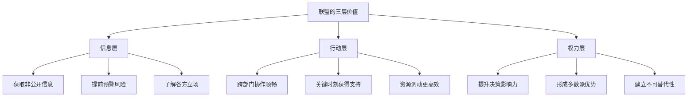
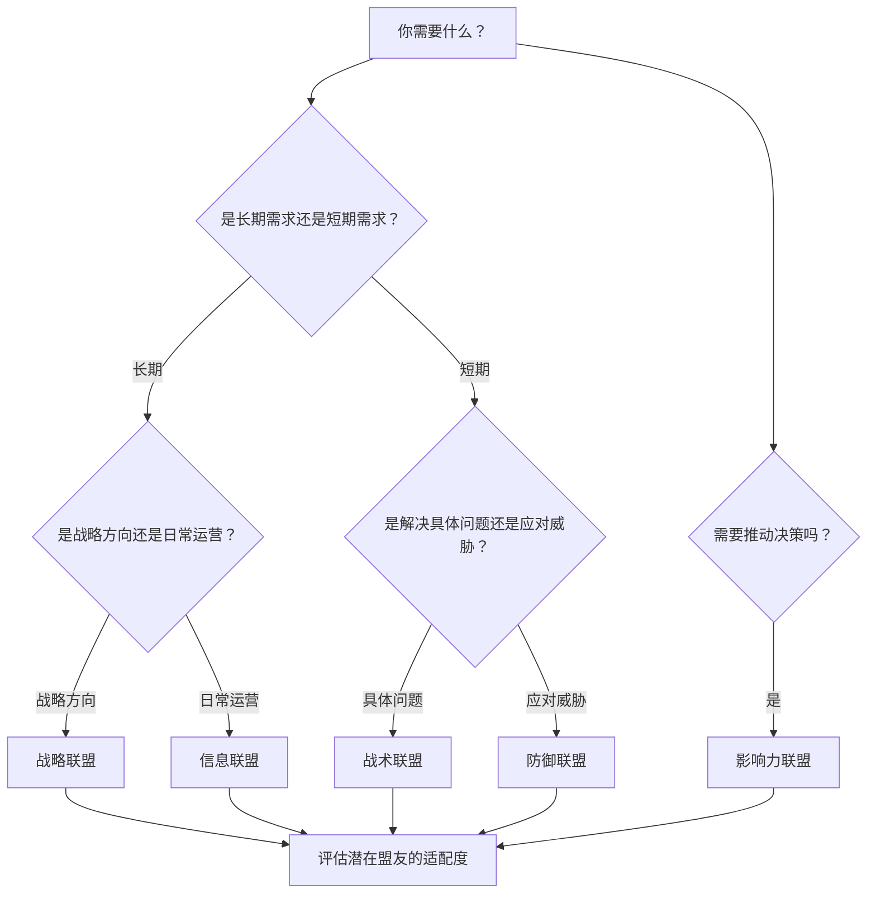
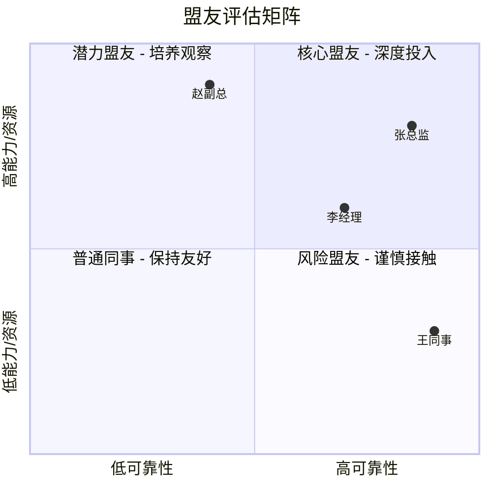

## 二、联盟建立技巧

在组织中，没有任何一个人能单凭个人能力推动所有事情。即使你是最优秀的执行者、最敏锐的策略师，也必须面对一个现实：**你的影响力边界，取决于你所拥有的联盟网络的质量和广度**。联盟建立不是"搞关系"，而是一项需要系统思维、长期投入和高超沟通技巧的核心职场能力。

### 2.1 联盟的本质：从社会交换到权力网络

#### 2.1.1 什么是联盟

联盟（Alliance）是指两个或多个个体之间基于共同利益或互补需求而形成的协作关系。它不同于友情——友情基于情感认同，联盟基于**理性的利益计算和互惠预期**。这并不是说联盟是冷酷的，而是说它的运作逻辑是"我帮你达成目标，你帮我达成目标"，双方在合作中各取所需。

从组织行为学的角度，联盟是**社会交换理论**（Social Exchange Theory, Blau 1964）在职场中的具体表现。社会交换理论认为，人际互动本质上是一种资源交换过程——这里的"资源"不仅包括金钱和物质，还包括信息、影响力、情感支持、声誉背书等无形资产。当交换双方都认为"收益≥成本"时，关系就会持续；当一方感到长期亏损时，关系就会瓦解。

#### 2.1.2 为什么个人需要联盟

很多人相信"靠实力说话"，认为只要工作做得好，自然会得到认可。这种想法在理论上没有错，但在实践中是不完整的。原因有三：

**第一，组织决策是集体博弈的结果，不是个人能力的排名赛。** 谁晋升、谁负责关键项目、资源如何分配——这些决策涉及多方利益，最终结果取决于各方力量的对比。一个孤立的高绩效者，在博弈中的权重可能远低于一个能力中等但拥有广泛联盟的人。

**第二，信息在组织中是不对称分布的。** 你不知道的事情，可能正在深刻影响你的职业发展。联盟网络是你最重要的信息来源——盟友会提前告诉你"上面正在讨论组织架构调整"、"那个项目有隐藏风险"、"某某对你有意见"。没有联盟的人，永远是最后知道消息的人。

**第三，信任需要时间积累，而危机不会等你准备好。** 当你突然需要某个人的支持——比如你在会议上被误解、你的项目被质疑、你的方案需要跨部门配合——如果你之前没有建立联盟关系，临时求助的效果会大打折扣。

#### 2.1.3 联盟的三层价值模型

**信息层**是最基础的价值。通过联盟网络，你能获取正式渠道无法获得的信息——谁在背后反对你的方案、老板最近在关注什么、哪个部门即将有人员变动。这些"软信息"往往比正式通知更有行动指导意义。

**行动层**是中间层的价值。当你的方案需要其他部门配合、当你的项目需要额外资源、当你的决策需要关键人物背书时，联盟关系能让你的请求从"陌生人的求助"变成"盟友间的协作"，成功率会大幅提升。

**权力层**是最高层的价值。在组织的权力游戏中，你的话语权不仅取决于你的职位和能力，还取决于有多少人站在你这一边。一个拥有广泛联盟的人，在任何集体决策中都是不可忽视的力量。

#### 2.1.4 联盟与关系的区别

很多人把"联盟"和"关系好"混为一谈，这是一个重要的认知误区。

| 维度 | 人际关系 | 职场联盟 |
|------|----------|----------|
| 基础 | 情感认同、共同兴趣 | 利益互补、目标一致 |
| 时效性 | 长期稳定，不受利益变化影响 | 随利益格局变化而调整 |
| 期望 | 不期望即时回报 | 有明确的互惠预期 |
| 边界 | 模糊，越亲密越好 | 清晰，有明确的合作范围 |
| 失效信号 | 感情破裂 | 互惠失衡或目标不再一致 |

你可以和一个人关系很好但不是盟友（比如你的好朋友不在你的工作领域，帮不上忙），也可以和一个人是盟友但关系一般（你们不一起吃饭，但在关键议题上互相支持）。最理想的状态是**盟友兼朋友**，但不要指望所有盟友都是朋友，也不要把所有朋友都当盟友。

### 2.2 联盟的类型与选择策略

#### 2.2.1 联盟的五种基本类型

不同的职场场景需要不同类型的联盟。盲目地"广交朋友"不如精准地建立适合当前需求的联盟。

**战略联盟**——基于长期共同目标建立的深度合作关系。双方在职业发展方向上有高度一致性，会长期互相支持。比如你和另一个部门的负责人，都希望推动公司数字化转型，那么你们可以在各自的领域发力，互相为对方的方案站台。战略联盟的特点是**稳定性高、投入大、回报周期长**。

**战术联盟**——为解决特定问题而建立的短期合作关系。你正在推进一个项目，需要某个人的数据支持，你帮他解决了一个技术难题，他帮你提供数据。项目结束后，联盟自然淡化。战术联盟的特点是**目标明确、见效快、不需要深度信任**。

**防御联盟**——当面临共同威胁或竞争压力时建立的互助关系。比如公司裁员潮中，几个中层管理者互相通气、互相保护；或者面对一个强势的竞争对手，几个人形成松散的协调机制。防御联盟的特点是**由外部压力驱动、凝聚力强但不稳定**。

**信息联盟**——以信息共享为核心的关系网络。成员之间定期交流行业动态、公司内部消息、市场变化等。这种联盟不需要互相提供实质性帮助，但信息本身就有巨大价值。信息联盟的特点是**低维护成本、高信息回报**。

**影响力联盟**——在组织决策中形成合力的关系网络。当需要推动某个决策、反对某个方案、或在资源分配中争取更大份额时，多个影响力联盟成员同时发声，效果远大于个人单独行动。影响力联盟的特点是**高度策略性、需要协调一致、有时限性**。

#### 2.2.2 选择联盟类型的决策框架

实际工作中，你不需要只选择一种类型的联盟。一个成熟的职场人通常同时维护多种类型的联盟网络——几个战略盟友、若干战术盟友、一个信息交流圈、以及在需要时能快速组建的影响力联盟。

### 2.3 识别潜在盟友：评估模型与信号判断

#### 2.3.1 盟友评估的四维模型

不是所有人都适合做盟友。选错盟友的代价可能比没有盟友更大——你投入了时间、信任和资源，换来的可能是失望甚至背叛。以下是评估潜在盟友的四个核心维度：

**维度一：利益一致性**

这是最重要的维度。利益一致不是说"你们的利益完全相同"（这种情况很少），而是"你们的利益不冲突，且可以互相增益"。具体判断标准：

- 你们是否在不同领域有各自的优势？（互补性）
- 一方的成功是否有助于另一方？（正向关联）
- 是否存在竞争性的晋升通道或资源争夺？（潜在冲突）
- 如果对方的目标和你的目标发生冲突，对方会如何选择？（优先级排序）

**维度二：能力与资源匹配**

好的盟友应该能提供你没有的东西。这里的"能力"是广义的——包括专业技能、人脉资源、信息渠道、组织影响力、甚至是性格上的互补。评估时问自己：

- 对方有什么是你需要但自己不具备的？
- 你有什么是对方需要的？
- 这种交换是否对等，还是长期失衡？

**维度三：可靠性评估**

可靠性是联盟的基石。一个能力很强但不可靠的盟友，比没有盟友更危险——因为你无法预测他什么时候会掉链子，甚至反过来伤害你。可靠性可以通过以下信号判断：

| 高可靠性信号 | 低可靠性信号 |
|-------------|-------------|
| 说到做到，承诺的事情一定兑现 | 经常口头答应但不执行 |
| 对其他人的承诺也认真履行 | 背后说盟友坏话 |
| 在你不在场时仍然维护你的利益 | 只在你面前表现友好 |
| 坦诚沟通，有问题直接说 | 表面和气，背后搞小动作 |
| 承认自己的错误 | 把错误推给别人 |

**维度四：价值观兼容性**

价值观不是道德评判，而是指"你们做事的方式是否兼容"。一个追求效率的人和一个追求完美的人可以是盟友，但如果一个坚持透明沟通而另一个习惯信息封锁，联盟会充满摩擦。关键的价值观维度包括：

- 信息共享的开放程度
- 冲突解决的方式偏好
- 对风险的态度
- 对承诺的重视程度
- 对竞争的态度（共赢还是零和）

#### 2.3.2 识别盟友的五个关键时刻

盟友不是在简历或自我介绍中识别出来的，而是在**关键时刻的行动**中判断出来的。以下五个场景是观察潜在盟友质量的最佳窗口：

**场景一：你遇到困难时。** 当你的项目出了问题、你被领导批评、你面临棘手的决策时，观察谁主动提供帮助、谁保持沉默、谁在背后幸灾乐祸。真正有联盟意愿的人，会在你困难时伸出援手，而不是等到你风光时再来锦上添花。

**场景二：利益冲突时。** 当你和潜在盟友的利益出现小分歧时，观察对方如何处理。是坦诚沟通寻找共赢方案，还是暗中为自己的利益最大化而不顾你的感受？小的利益冲突是联盟的"压力测试"。

**场景三：有第三方在场时。** 观察潜在盟友在你不在场时如何谈论你。你可以通过信息网络了解：他在别人面前是维护你、保持中立、还是贬低你？一个人的"背后行为"比"面前行为"更能反映真实态度。

**场景四：需要表态时。** 当组织中出现争议议题，需要每个人表态时，观察潜在盟友是否愿意公开支持你的立场。公开表态有成本（可能得罪另一方），愿意付出这个成本的人更值得信任。

**场景五：他对待"无用之人"的态度。** 观察潜在盟友如何对待那些"对他没有利用价值"的人——实习生、外包人员、即将离职的同事。一个人对弱者的态度，反映的是他的真实品格，而不是策略。

#### 2.3.3 盟友画像矩阵

将潜在盟友放在以下矩阵中，可以帮助你做出更清晰的判断：

**右上（高可靠+高能力）**：核心盟友，值得深度投入时间和信任。

**右下（高可靠+低能力）**：潜力盟友，可靠性好但能力有限，可以培养。

**左上（低可靠+高能力）**：风险盟友，能力强但不可靠，保持接触但不交心。

**左下（低可靠+低能力）**：普通同事，保持基本的职场礼貌即可。

### 2.4 建立联盟的完整流程

#### 2.4.1 第一阶段：建立连接

联盟的起点是让对方注意到你，并产生"这个人值得认识"的印象。这不是靠社交技巧，而是靠**展现价值**。

**方法一：主动提供帮助。** 这是最有效的破冰方式。不是讨好，而是真正解决对方的问题。关键是**具体且不越界**——

> "我看到你最近在负责新市场的拓展，我们部门之前做过类似的调研，有一些数据可能对你有用，要不要我整理一份给你？"

这句话的效果远好于"有什么需要帮忙的尽管说"。前者展现了你的价值和诚意，后者只是一句客套话。

**方法二：创造共同经历。** 一起开会、一起做项目、一起加班赶deadline——共同经历是建立信任的催化剂。心理学研究表明，共同经历困难（如一起解决棘手问题）比共同经历愉快（如一起吃饭）更能建立深层信任。

**方法三：借助共同连接。** 如果你和潜在盟友有共同的朋友或同事，可以通过第三方介绍或引荐来建立初始连接。这比直接搭讪更自然，也更有信任基础。

**方法四：展现专业能力。** 在会议、项目汇报、技术讨论中展现你的专业能力，让潜在盟友认识到"这个人有能力，值得合作"。专业能力是最硬的社交货币。

#### 2.4.2 第二阶段：建立信任

有了初始连接之后，下一步是将"认识"升级为"信任"。信任不是一天建立的，需要通过一系列小的互动逐步积累。

**信任积累的阶梯模型：**

| 阶段 | 行为 | 预期 |
|------|------|------|
| 礼貌互动 | 正常的职场交流 | 对方回应基本礼貌 |
| 信息分享 | 分享一些非敏感的有价值信息 | 对方也开始分享信息 |
| 小规模协作 | 完成一个小型的互助任务 | 对方认真履行承诺 |
| 中等信任 | 分享更敏感的信息，提出更大请求 | 对方保守秘密，完成请求 |
| 深度信任 | 在关键议题上公开支持对方 | 对方也为你站台 |

这个阶梯模型的核心原则是**渐进式信任**——不要一开始就过度暴露自己或提出过大的请求，也不要期望对方一开始就对你推心置腹。信任是一点一点建立的，每一步都需要对方的回应来验证。

**信任的"存款-取款"类比：** 把信任想象成一个银行账户。每次你兑现承诺、保守秘密、提供帮助，都是在"存款"；每次你食言、泄密、让对方失望，都是在"取款"。只有当账户余额足够高时，你才能进行大额"取款"（比如在关键时刻要求对方站队支持你）。

#### 2.4.3 第三阶段：深化合作

当基本信任建立后，需要通过更深入的合作来巩固联盟关系。

**互惠升级策略：** 从简单的信息交换，逐步升级到资源共享、行动配合、立场协调。每一步升级都需要在前一步成功的基础上进行。

**建立"共同叙事"：** 高质量的联盟不仅仅是"你帮我、我帮你"，还需要有共同的叙事——"我们都在推动公司的XX改革"、"我们都认为行业未来的发展方向是YY"。共同的叙事让联盟更有凝聚力和方向感。

**创造"共同利益点"：** 主动寻找你和盟友可以共同获益的领域。比如，你们可以共同推动一个跨部门项目，双方都能从中获得业绩、经验和影响力。共同利益点越多，联盟越稳固。

#### 2.4.4 第四阶段：维护与更新

联盟不是一劳永逸的，需要持续维护。以下是维护联盟的关键策略：

**定期"充值"：** 不要只在需要帮助时才联系盟友。平时就应该保持互动——分享有用的信息、在对方需要时主动帮忙、偶尔一起吃饭聊天。如果每次联系都是"有事相求"，对方会逐渐感到被利用。

**主动报告进展：** 如果盟友帮过你一件事，事后一定要主动告诉对方结果——"上次你给我的建议太有用了，项目顺利通过了，多亏了你"。这不仅是礼貌，更是在确认"我们的互惠是有效的"。

**适应变化：** 组织在变化，人也在变化。你的盟友可能升职了、换部门了、职业方向变了。联盟关系也需要随之调整。有些联盟会升级（从战术到战略），有些会降级（从深度合作到一般联系），有些会自然消散。这些都是正常的。

### 2.5 联盟沟通的核心技巧

#### 2.5.1 提案沟通：如何让盟友支持你的方案

当你需要盟友在某个议题上支持你时，沟通方式至关重要。以下是高效的提案沟通框架：

**第一步：了解对方立场。** 在正式请求之前，先通过非正式渠道了解盟友对这个议题的态度——支持、反对、中立还是根本不关心。这决定了你的沟通策略。

**第二步：找到对方的利益点。** 不要只从自己的角度出发说明为什么需要支持，要从对方的角度说明**为什么支持你对他也有好处**。比如：

> "这个方案如果通过，我们部门的效率能提升30%，你们部门的报表也能提前两天出来。"

**第三步：降低对方的支持成本。** 公开支持你可能让盟友得罪另一方。你可以通过以下方式降低对方的成本：

- 提供支持的具体理由和数据，让对方有话可说
- 在私下场合先达成共识，减少对方的"意外表态"成本
- 明确表示"不需要你公开站队，只需要在XX场合投赞成票"

**第四步：提供对等交换。** "这次你帮我推动这个方案，下次你部门的预算申请，我会全力支持。"明确的对等交换比模糊的"以后我会帮你的"更有效。

#### 2.5.2 危机沟通：联盟在关键时刻的作用

当联盟真正体现价值的时刻，往往是你遭遇危机的时候——被误解、被攻击、被边缘化。此时你需要盟友做什么，以及如何沟通：

**信息型求助：** "我听说上面对我的方案有不同意见，你了解具体情况吗？"——这是最轻量级的求助，只需要盟友提供信息。

**建议型求助：** "我现在遇到一个棘手的问题，想听听你的看法。"——这需要盟友花时间和精力帮你分析，但不需要对方承担风险。

**行动型求助：** "下周的评审会上，如果他们质疑这个方案的可行性，你能不能从技术角度帮我说明一下？"——这需要盟友付出行动，有明确的时间和场景要求。

**公开型求助：** "我希望你能在会议上公开支持我的立场。"——这是最高级别的求助，要求盟友为你承担声誉风险。只有在信任足够深、利益足够一致时才应该提出。

#### 2.5.3 日常维护沟通模板

联盟的日常维护不需要复杂的话术，关键是**频率和质量**。以下是一些实用的沟通模板：

**信息分享型：** "看到一篇关于XX行业的报告，想到了你在做的项目，分享给你看看。"

**关心询问型：** "上次你说部门在做架构调整，进展怎么样了？有什么我能帮忙的吗？"

**成果反馈型：** "上次你帮我分析的那个问题，我用了你建议的方案，效果很好。跟你分享一下结果。"

**社交型：** "这周五有个行业分享会，主题跟你的领域相关，要不要一起去？"

**预警型：** "提醒你一下，下周的管理层会议上可能会讨论XX议题，你可以提前准备一下。"

### 2.6 联盟的边界管理

#### 2.6.1 为什么联盟需要边界

没有边界的联盟，最终会变成两种东西：**派系或人身依附**。派系意味着你被贴上"某某的人"的标签，失去独立性；人身依附意味着你为了维护联盟关系而不断牺牲自己的判断和利益。这两种结果都对你的长期职业发展有害。

健康的边界让联盟保持在"互惠合作"的范畴内，而不是滑向"无条件忠诚"的深渊。

#### 2.6.2 边界管理的五条原则

**原则一：保持判断独立性。** 你可以支持盟友的立场，但必须是基于你自己的判断，而不是盲目附和。如果盟友做了一个你认为错误的决定，你应该私下坦诚沟通，而不是违心支持。一个只会说"是"的盟友，对双方都没有价值。

**原则二：不参与有害行为。** 如果盟友要求你做违反职业道德、公司规定或法律的事，必须果断拒绝。联盟的底线是"不伤害他人、不违反规则"。一次违规可能毁掉你所有的职业声誉。

**原则三：维持多元网络。** 不要让自己成为"某个人的人"。在组织中，你应该有多个不同方向的联盟关系，而不是只依附于一个核心盟友。多元网络的好处：

- 风险分散：不会因为一个盟友的变动而全线崩溃
- 信息多元：从不同角度了解组织动态
- 选择自由：在不同议题上可以选择与不同盟友合作

**原则四：明确合作范围。** 在联盟关系中，双方都应该清楚"我们合作的范围是什么"。不是所有事情都需要盟友介入，也不是所有事情都适合请盟友帮忙。过度依赖盟友会让对方感到负担。

**原则五：接受联盟的有限性。** 联盟不是万能的。有些事情你需要自己面对，有些决定你需要自己做出。把联盟当成"增强自身能力的工具"，而不是"替代自身能力的拐杖"。

#### 2.6.3 边界被突破时的应对策略

当你感到联盟关系越界时（盟友开始要求你做不舒服的事、过度索取、试图控制你），以下是应对步骤：

**第一步：温和但清晰地重申边界。** "我很珍惜我们的合作关系，但这件事我没办法配合，因为这超出了我的原则范围。"

**第二步：解释原因而非攻击对方。** 不要说"你太过分了"，而要说"这个做法可能会给我们双方带来风险"。

**第三步：提供替代方案。** "我不能帮你做A，但我可以在B方面提供支持。"

**第四步：如果对方持续越界，考虑降级联盟。** 从战略联盟降级为战术联盟，甚至从盟友降级为普通同事。这是一个艰难但必要的决定。

### 2.7 联盟失败的常见原因与应对

#### 2.7.1 七种常见的联盟失败模式

**失败一：单方面索取。** 你总是在向盟友要东西，却很少提供价值。久而久之，盟友会感到被利用，联盟关系名存实亡。

> 纠正方法：建立互惠意识。每次请求帮助前，先想想"我最近为对方做了什么？"如果答案是"没有"，先做点什么再开口。

**失败二：过度依赖单一盟友。** 你把所有鸡蛋放在一个篮子里，一旦这个盟友离职、失势或改变立场，你就全面被动。

> 纠正方法：分散联盟投资。每个关键领域至少有2-3个盟友，确保不会因为任何一个人的变动而失去全部支持。

**失败三：忽视维护。** 你建立了联盟就放任不管，直到需要帮助时才想起来联系对方。这时对方可能已经记不清你是谁，或者感到被忽视。

> 纠正方法：设置定期提醒。每个月至少和核心盟友有一次有价值的互动——不一定要见面，一条有用的信息、一句关心的问候就够了。

**失败四：选错盟友。** 你和一个可靠性差、价值观不兼容或利益根本冲突的人建立了联盟，结果投入的资源全部浪费。

> 纠正方法：联盟初期保持试探性投入，通过小规模合作验证对方的可靠性和兼容性，再逐步加大投入。

**失败五：联盟变成了派系。** 你和几个盟友形成了一个封闭的小圈子，排挤圈子外的人。这会让你在组织中被孤立。

> 纠正方法：保持联盟的开放性。不要把联盟变成封闭的"小团体"，允许成员同时拥有其他联盟关系，在合适的场合引入新成员。

**失败六：在利益冲突时没有预案。** 你和盟友的利益本来一致，但组织变化导致利益出现冲突，你们都不知道如何处理，联盟关系因此破裂。

> 纠正方法：在联盟建立之初就坦诚讨论"如果我们利益冲突了怎么办"。约定一个沟通机制——先私下坦诚沟通，寻找共赢方案，实在不行再各自为战但不互相伤害。

**失败七：忽视权力动态变化。** 盟友升职了、你降职了、组织重组了——权力动态的变化会让联盟关系失衡。忽视这种变化会导致"你以为的平等联盟在对方眼中已经不是了"。

> 纠正方法：定期重新评估联盟关系。权力变化后，主动调整联盟的期望和合作方式，不要假装什么都没变。

### 2.8 进阶：高级联盟策略

#### 2.8.1 构建"联盟网络"而非"联盟关系"

初级的联盟思维是"我和A是盟友"、"我和B是盟友"，这是点对点的关系。高级的联盟思维是构建一个**网络**——你的盟友之间也有连接，整个网络形成一个信息和影响力的生态系统。

构建联盟网络的策略：

- **做连接者：** 把你认识的、可能会互相受益的人介绍给彼此。你不需要参与他们之间的所有互动，但"介绍人"这个角色本身就为你积累了大量的社会资本。
- **创造共同场景：** 组织小范围的交流活动——工作午餐、行业讨论、问题分析会——让你的盟友们在轻松的环境中互相认识和建立连接。
- **成为信息枢纽：** 当你成为信息网络的中心节点（所有人都通过你获取信息和建立连接），你的不可替代性会大幅提升。

#### 2.8.2 联盟的动态调整策略

组织不是静态的，联盟也不应该是。你需要根据以下变化动态调整联盟策略：

**组织重组时：** 新的组织架构可能改变利益格局。原来的盟友可能变成竞争对手，原来的对手可能变成潜在盟友。此时需要快速重新评估所有联盟关系。

**人事变动时：** 关键人物的加入或离开会改变联盟的平衡。新来的领导可能带来新的权力格局，你需要在第一时间建立新的联盟连接。

**战略方向变化时：** 公司战略转型会让一些联盟变得更有价值，另一些变得无关紧要。此时需要将资源重新分配到最有价值的联盟关系上。

#### 2.8.3 跨层级联盟的建立技巧

和上级建立联盟（向上联盟）与和平级建立联盟有本质区别：

**向上联盟的核心是"成为上级的解决方案"。** 不是讨好上级，而是帮助上级解决他面临的问题——你的工作成果是他业绩的一部分，你的专业能力是他决策的支撑，你的信息是他视野的延伸。向上联盟的沟通要更加注意：不越级汇报、不挑战权威、在合适的场合提供有建设性的建议。

**向下联盟的核心是"成为下属的赋能者"。** 帮助下属成长、为下属争取资源和机会、在下属犯错时承担保护责任。向下联盟不需要利益交换，但需要真诚的投入。下属的支持虽然在组织权力结构中权重较低，但在执行层面是决定性的。

**跨部门联盟的核心是"理解对方的KPI"。** 每个部门都有自己的考核指标和压力来源。建立跨部门联盟的第一步是理解对方的KPI是什么、压力在哪里，然后找到你的需求和对方KPI之间的交集。

### 2.9 实战案例分析

#### 案例一：推动跨部门项目

**背景：** 产品经理张明需要推动一个跨部门的数字化项目，涉及技术部、运营部和市场部。技术部总监李强对这个项目持怀疑态度，认为投入产出比不高。

**策略：** 张明没有直接找李强要求支持，而是分三步走：

1. 先和运营部经理建立战术联盟——运营部一直抱怨数据不互通，这个项目能解决他们的痛点。张明提供了一份详细的需求分析报告，运营部经理很认可。
2. 通过运营部经理了解了李强的真实顾虑——不是反对数字化，而是担心技术部资源被分散。张明调整方案，让项目分阶段实施，第一阶段只需要技术部投入20%的资源。
3. 在正式会议上，运营部经理率先表态支持（预先协调好的），张明展示了调整后的方案（降低了技术部的投入门槛），李强的反对理由不再成立，项目顺利通过。

**关键学习：** 联盟不是一次性操作，而是一个系统工程。张明用了两周时间建立联盟、了解信息、调整方案，最终用联盟网络的力量推动了项目的通过。

#### 案例二：应对职场危机

**背景：** 王芳负责的一个重要项目出现了延期，被上级在管理层会议上点名批评。她感到压力巨大，担心影响年终考评。

**策略：** 王芳做了两件事：

1. **信息收集：** 通过盟友了解上级批评的真实意图——不是要追究责任，而是希望项目尽快回到正轨。这个信息让她避免了过度恐慌。
2. **联合行动：** 她找到技术部的盟友一起制定了加速方案，并请技术部总监在下次会议上从技术角度为项目延期做了解释（客观原因导致的技术难点，而非管理失误）。

**结果：** 上级对加速方案表示认可，项目在一个月后顺利完成，王芳的考评不仅没受影响，还因为"危机处理能力"获得了加分。

#### 案例三：联盟失败的教训

**背景：** 刘华和部门副总监赵强建立了深度联盟，几乎所有工作决策都会找赵强商量，也经常在公开场合为赵强站台。他因此被同事们贴上了"赵强的人"的标签。

**转折：** 赵强在一次政治斗争中落败，被调离核心岗位。刘华因为过于明显的站队行为，被赵强的对手列入了"不可信任"名单。

**教训：** 联盟需要多元，不能依附于单一人物。同时，联盟关系的公开程度需要谨慎控制——你可以私下和盟友深度合作，但在公开场合保持适度的独立性。

### 2.10 自检清单

在推进联盟建立的过程中，定期用以下清单检查自己的联盟状态：

**广度检查：**
- [ ] 在组织的关键部门中，是否都有至少一个盟友？
- [ ] 联盟网络是否覆盖了信息、行动和权力三个层面？
- [ ] 是否存在过度依赖单一盟友的风险？

**深度检查：**
- [ ] 核心盟友的信任等级是否足够支撑关键时刻的请求？
- [ ] 最近一次为盟友提供实质性帮助是什么时候？
- [ ] 联盟关系中是否存在未解决的摩擦或误解？

**健康度检查：**
- [ ] 联盟关系是否保持在"互惠合作"而非"派系依附"的范畴？
- [ ] 是否有足够的判断独立性，能对盟友说"不"？
- [ ] 盟友是否有越界行为未被及时处理？

**时效性检查：**
- [ ] 是否根据最新的组织变化调整了联盟策略？
- [ ] 有哪些联盟关系需要加强、哪些需要淡化？
- [ ] 是否有新的潜在盟友值得接触？
