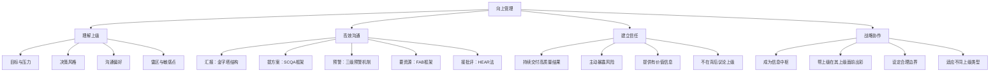

## 三、向上管理进阶

向上管理（Managing Up）是职场政治中最核心、最被低估的能力。它决定了你在组织中的资源获取效率、晋升速度和职业安全边际。本节从本质认知出发，系统讲解如何理解上级、建立信任、高效沟通，并在复杂的组织政治中保护自己、推动目标。

### 3.1 向上管理的本质：不是讨好，是协作

很多人对"向上管理"有本能的抵触，觉得这是拍马屁、搞关系。这种误解导致大量专业能力强的人在职场中被埋没——他们不是做不好事，而是不会让对的人知道自己做得好。

**向上管理的准确定义是：主动管理你与上级之间的协作关系，使双方的目标、节奏和信息流保持对齐，从而最大化团队产出和个人发展空间。**

这个定义里有三个关键词：

- **主动**——不是等上级来找你，而是你主动建立沟通节奏、主动暴露风险、主动对齐期望。
- **协作**——不是单方面的服从或讨好，而是双向的价值交换。你帮上级解决问题、达成目标，上级为你提供资源、保护和成长机会。
- **对齐**——上级和下属之间天然存在信息不对称。上级不了解你的具体工作细节，你不了解上级面临的全局压力。向上管理就是在缩小这个信息差。

#### 向上管理的理论基础

彼得·德鲁克在《卓有成效的管理者》中提出：**"管理上级是下属的责任，也是使自己有效的关键。"** 他认为，每个人都有责任让自己的上级发挥长处、做出贡献，就像上级有责任让下属发挥长处一样。

约翰·加巴罗（John Gabarro）和约翰·科特（John Kotter）在哈佛商学院的经典论文《管理你的老板》（Managing Your Boss）中指出，向上管理失败的两大根源是：**误以为上级应该来适应你**，以及**误以为向上管理就是在操纵关系**。实际上，向上管理是一种基于相互理解和尊重的职业协作能力。

从组织行为学的角度看，上下级关系本质上是一种**委托-代理关系**。上级是委托人，你是代理人。委托人需要代理人提供信息（以减少不确定性）、执行任务（以实现目标）和管理风险（以避免损失）。理解这个结构，你就明白上级到底需要你什么——不是无条件服从，而是**可靠的信息、高质量的执行和可控的风险**。

#### 向上管理的四个层次

| 层次 | 描述 | 典型表现 | 典型结果 |
|------|------|----------|----------|
| 第一层：被动服从 | 等指令、做执行、不主动 | 上级说什么做什么，从不主动汇报 | 容易被忽视，晋升慢 |
| 第二层：主动汇报 | 定期同步进度，暴露问题 | 周报、阶段性汇报、遇到问题及时沟通 | 上级觉得你"靠谱"，但只是合格 |
| 第三层：预期管理 | 对齐目标、管理期望、主动预警 | 提前沟通风险、管理上级的时间和注意力 | 上级觉得你"省心"，开始授权 |
| 第四层：战略协作 | 成为上级的智囊和信息源 | 提供行业洞察、协助上级做决策、帮上级应对他的上级 | 上级觉得你"不可替代"，主动为你争取机会 |

大多数职场人卡在第一层和第二层。从第二层到第三层是质变——你需要从"汇报者"变成"管理者"。从第三层到第四层是另一个质变——你需要从"执行者"变成"战略伙伴"。

### 3.2 深度理解你的上级：建立"上级画像"

向上管理的第一步不是沟通技巧，而是**认知**。你必须像产品经理研究用户一样研究你的上级。以下是需要搞清楚的核心维度：

#### 3.2.1 目标与压力结构

每个上级都有两层目标：**组织赋予的正式目标**（KPI、OKR、战略方向）和**个人驱动的隐性目标**（晋升、影响力、职业安全感、个人声誉）。

搞清楚这些的方法：

- **直接观察**：他/她在会议上强调什么？在汇报中关注哪些数据？在资源分配上优先什么？
- **间接打听**：和上级的同级、前任下属、HR交流，了解他/她的工作风格和关注点。
- **直接询问**：在一对一沟通中，主动问："领导，这个季度您最关注的目标是什么？我可以在哪些方面给您更多支持？"

特别要注意**上级的上级在考核什么**。你的上级最在意的事情，往往不是他自己想出来的，而是他的上级对他的要求。理解这条"目标传导链"，你就能预判上级的行为模式。

#### 3.2.2 决策风格

不同上级的决策方式差异巨大，用错方式会导致严重的信任损耗。

| 决策风格 | 特征 | 你应该怎么做 | 你不应该做什么 |
|----------|------|-------------|---------------|
| 数据驱动型 | 要看数据、看分析、看对比 | 准备充分的数据支撑，给出量化分析 | 不要只讲故事、只凭感觉、只说"我觉得" |
| 直觉快速型 | 凭经验判断，决策快 | 简明扼要，突出关键信息，给结论 | 不要长篇大论、不要铺垫太多背景 |
| 民主讨论型 | 喜欢团队讨论，集思广益 | 积极参与讨论，提供不同视角 | 不要沉默不语，也不要一开始就下定论 |
| 独断型 | 习惯自己决定，不太听意见 | 尊重其权威，在私下场合提供补充建议 | 不要在公开场合反驳，不要挑战其决定权 |
| 规避风险型 | 谨慎，怕出错 | 提前评估风险，给出风险缓解方案 | 不要只说好处不说风险，不要逼迫快速决策 |

#### 3.2.3 沟通偏好

这一点直接影响你的日常工作效率。需要搞清楚：

- **信息密度偏好**：喜欢详细报告还是一页纸摘要？有人觉得"细节决定成败"，有人觉得"超过三页就是浪费时间"。
- **沟通渠道偏好**：喜欢面对面、电话、即时消息还是邮件？有人讨厌被打断，有人讨厌等邮件回复。
- **时间节奏偏好**：喜欢早上沟通还是下午？喜欢固定一对一还是随时找？有人有"晨会洁癖"，有人下午才有精力。
- **反馈风格偏好**：喜欢实时反馈还是阶段性反馈？喜欢直接批评还是委婉建议？

**实操方法**：在入职后的前两周，刻意测试不同沟通方式，观察上级的反应。比如第一周发一封详细的邮件汇报，第二周发一封简短的摘要加一句"需要详细数据请告诉我"，对比两次的回复速度和态度。

#### 3.2.4 雷区与敏感点

每个上级都有自己的"雷区"——触碰会导致信任急剧下降的领域。常见的雷区包括：

- **被当众质疑权威**：有些上级私下可以接受不同意见，但绝不能在公开场合被反驳。
- **信息盲区**：上级最怕的事情是"被自己的上级问到自己不知道的事情"。如果你让他/她在自己的上级面前出了丑，代价是巨大的。
- **越级汇报**：绝大多数上级对越级汇报极其敏感。即使你有正当理由，也要先告知直接上级。
- **被代表**：未经同意就以团队或上级的名义做决定、发邮件、做承诺。
- **重复犯错**：第一次犯错可以被原谅，第二次犯同样的错会被标记为"不可靠"。

### 3.3 核心沟通技巧：五个高频场景的完整处理方案

#### 3.3.1 汇报工作：金字塔结构 + 结论先行

**为什么要结论先行？** 因为上级的时间和注意力是稀缺资源。根据麦肯锡的调研，高管平均每天处理的信息量超过200条。你的汇报如果前三十秒没有抓住重点，后续内容的信息传递效率会下降60%以上。

**金字塔汇报结构：**

第一层（结论）：项目进展正常 / 存在风险 / 需要决策
第二层（关键事实）：3个支撑结论的核心事实
第三层（详细数据）：具体的数字、时间线、对比
第四层（下一步建议）：你建议怎么做，需要什么支持

**实战模板——项目进度汇报：**

> "领导，XX项目整体进度正常，预计按时交付。（结论）
>
> 三个方面说明：第一，核心功能已开发完成，测试通过率98%；第二，UI设计已定稿，正在进行前端适配；第三，第三方接口对接完成80%，剩余部分预计本周五完成。（关键事实）
>
> 有一个潜在风险需要提前跟您沟通：第三方接口的响应速度比预期慢30%，如果不改善，可能影响整体上线时间。我已经联系对方技术负责人，他承诺本周三前优化。如果周三没有改善，我建议启用备选方案。（风险预警 + 建议）"

**常见错误：**
- 从背景开始讲起，铺垫了五分钟还没说结论。上级在第二分钟就走神了。
- 把所有细节都汇报，没有区分重点和非重点。上级不知道你到底想说什么。
- 只说进展顺利，不提风险。等到出了问题才暴露，上级会怀疑你的判断力。

#### 3.3.2 提出问题：方案前置，决策辅助

**核心原则：不要带问题去，要带方案去。**

上级不希望你只做"问题传递者"——把问题原封不动地甩给他。上级需要的是"决策辅助者"——你把问题分析清楚，把方案准备好，让他做选择题而不是填空题。

**SCQA问题汇报框架：**

| 步骤 | 内容 | 示例 |
|------|------|------|
| S - Situation（背景） | 简述当前情况 | "我们在推进XX项目时遇到了供应商交期延误" |
| C - Complication（冲突） | 说明问题是什么 | "原定10月15日到货的设备，供应商最新反馈要延迟到11月5日" |
| Q - Question（问题） | 明确需要回答的问题 | "我们需要决定如何调整项目计划" |
| A - Answer（方案） | 给出你的解决方案 | "我建议两个方案……" |

**方案呈现格式：**

> "领导，XX问题出现了。我分析了情况，想到了两个方案：
>
> **方案A**：调整项目排期，将交付时间从10月30日推迟到11月20日。优势是风险低、不需要额外成本；风险是可能影响客户满意度。
>
> **方案B**：临时寻找替代供应商。优势是不耽误工期；风险是成本增加约15%，且新供应商的质量需要验证。
>
> **我的建议**：如果客户对时间敏感，走方案B；如果客户能接受延期，走方案A更稳妥。我倾向于方案B，因为这个客户的续约率对我们Q4的业绩影响很大。您怎么看？"

**为什么至少给两个方案？** 只给一个方案，上级会觉得你没有充分思考；给三个以上，上级会觉得你没有判断力。两个方案加一个推荐，是最优的信息架构。

#### 3.3.3 管理期望：风险预警的"三级预警"机制

等出了问题再汇报，是最糟糕的向上沟通方式。上级最恐惧的不是问题本身，而是**"我居然不知道这个问题"**——这意味着他失去了对局面的掌控感。

**三级预警机制：**

| 预警级别 | 触发条件 | 汇报方式 | 汇报内容 |
|----------|----------|----------|----------|
| 绿色预警 | 存在潜在风险，但可控 | 周报中提及 | "关注点：XX可能影响进度，已制定预案" |
| 黄色预警 | 风险升级，需要决策支持 | 单独沟通（即时消息或面谈） | "XX风险升级，目前进展是……我需要您的支持是……" |
| 红色预警 | 重大问题，可能影响关键目标 | 立即当面或电话沟通 | "紧急情况：XX发生了……影响是……我已采取的措施是……需要您立即决定的是……" |

**关键原则：预警永远比汇报早。** 宁可发一个"虚惊一场"的预警，也不要在问题爆发时让上级说"你怎么不早告诉我"。

**预警话术模板：**

> "领导，提前跟您同步一个情况。XX项目目前遇到一个潜在风险：[具体描述]。我已经采取了[措施A]和[措施B]来应对，目前影响可控。但为了以防万一，我想提前跟您报备，如果情况恶化，可能需要您协调[具体资源/支持]。我会在[具体时间]给您更新进展。"

这段话术做了四件事：**说明情况**（不隐瞒）、**展示主动性**（已采取措施）、**降低上级焦虑**（影响可控）、**设定预期**（会持续跟进）。

#### 3.3.4 争取资源：用"投资回报"的语言

向上级要人、要钱、要时间，本质是在做一次"内部销售"。上级手中的资源是有限的，他需要在多个团队和项目之间分配。你要做的不是说"我需要"，而是说"这值得"。

**资源争取的FAB框架：**

- **F - Feature（特征）**：你要什么资源？具体数量和时间。
- **A - Advantage（优势）**：这个资源能带来什么能力或改善？
- **B - Benefit（收益）**：对上级的目标、部门的KPI、公司的战略有什么具体贡献？

**错误示范：**
> "领导，我们人手不够，需要再加两个人。"（只说了需要，没说为什么值得）

**正确示范：**
> "领导，我想申请增加两名后端工程师。原因是目前项目积压了15个技术债务项，如果不处理，系统可用性会在Q4跌破99.5%的SLA标准。新增两名工程师后，预计可以在6周内清完技术债务，将可用性恢复到99.9%，同时释放现有团队50%的维护时间用于新功能开发。这相当于用两个月的薪资投入，换回一整个季度的开发产能。"

**进阶技巧——锚定上级的上级的KPI：** 如果你知道部门总监在意什么指标（比如客户满意度、系统稳定性、收入增长），就把你的资源需求和这些指标挂钩。这样你的上级在争取预算时也有了向上汇报的素材——你帮他准备好了弹药。

#### 3.3.5 接受批评：情绪管理 + 结构化回应

面对上级的批评，大多数人的第一反应是辩解或沉默。这两种反应都不理想——辩解会让上级觉得你不接受反馈，沉默会让上级觉得你不重视。

**HEAR四步回应法：**

1. **H - Hear（倾听）**：认真听完，不打断。用身体语言表示你在听（点头、目光接触）。
2. **E - Empathize（共情）**：表示你理解对方的感受和立场。"我理解您的顾虑，这确实影响了项目进度。"
3. **A - Acknowledge（承认）**：承认问题的存在，不推卸。"这个问题确实是我考虑不周，在XX环节没有做好充分的准备。"
4. **R - Respond（回应）**：给出改进方案。"我计划在下周之前完成XX改进，并且会建立一个检查机制防止类似问题再次发生。"

**特别场景处理：**

- **批评不公平时**：不要当场反驳。先用HEAR框架回应，事后再私下沟通。"领导，关于今天会议上提到的XX问题，我回去仔细想了一下，想跟您补充一些当时的情况……"（注意：用"补充"而不是"纠正"，给双方台阶）
- **公开场合被批评**：控制情绪，简洁回应。不要在众人面前展开辩解，会把事情扩大化。会后单独找上级沟通。
- **被批评的内容你不确定对错**：先接受，回去核实。"谢谢您的反馈，我回去核实一下具体情况，明天给您一个完整的回复。"

### 3.4 高级策略：从执行者到战略伙伴

#### 3.4.1 成为上级的"信息中枢"

上级每天面对的信息洪流远超你的想象。如果你能成为他/她获取高质量信息的关键渠道之一，你的不可替代性会大幅提升。

**具体做法：**

- **行业情报**：关注你所在行业的动态、竞品动向、技术趋势，定期给上级分享有价值的摘要。不需要长篇大论，一条有价值的信息就够了。"领导，看到XX竞品刚发布了新功能，和我们正在做的YY很相似，可能需要关注一下。"
- **团队温度计**：如果你能客观、准确地反映团队的状态（士气、困惑、期望），你就成了上级的"传感器"。但注意：这不等于打小报告。你传递的是集体反馈，不是个人是非。
- **跨部门情报**：在跨部门协作中，了解其他团队的动向和计划，提前帮上级预判可能的冲突或合作机会。

#### 3.4.2 帮助上级在他的上级面前"出彩"

理解上级的上级关注什么，帮助你的直接上级准备好答案和素材。这是一种极其高明的向上管理策略——你不是在讨好上级，而是在帮他解决他最焦虑的问题。

**场景示例：**

你知道下周部门总监要听季度汇报，你的经理正在准备PPT。你可以主动提供：数据整理好了、关键结论提炼出来了、可能被追问的问题和答案都准备了。你的经理在总监面前表现好了，自然会记住是谁帮了他。

**关键边界：** 这一切必须在"辅助"的框架内进行，不能变成"你替上级做决定"或"你在上级的上级面前邀功"。最好的方式是幕后支持，让上级带着你的成果去呈现。

#### 3.4.3 建立"安全边界"：管理上级期望的边界

很多人把向上管理理解为"无限满足上级"，这是危险的。真正的向上管理能力包括**设定合理边界**。

**需要设定边界的常见场景：**

- **不合理的deadline**：上级要求三周完成需要六周的工作。不要直接说"做不了"，而是说"三周可以完成核心功能，但如果要包含XX和YY，需要五到六周。您希望先交付核心版本还是等完整版本？"
- **职责范围模糊**：上级不断给你加活，导致核心工作受影响。用数据说话："目前手上有A、B、C三个项目，如果加上D项目，我建议暂停B项目或者增加一个人分担C项目的部分工作。您看哪个方案合适？"
- **过度微观管理**：上级事无巨细都要插手。用"主动同步"代替"被动汇报"——增加汇报频率和详细程度，让上级感到掌控感，从而减少主动干预。

#### 3.4.4 适应不同类型的上级：分类策略

不同类型的上级需要完全不同的管理策略。一刀切的方法只会让你在某些上级面前碰壁。

| 上级类型 | 核心特征 | 沟通策略 | 汇报风格 | 雷区 |
|----------|----------|----------|----------|------|
| 控制型 | 喜欢掌控一切细节 | 频繁汇报、事前请示、提供完整细节 | 高频、详细、主动征求批准 | 不要自作主张、不要信息黑洞 |
| 放手型 | 不喜欢管太细，信任下属 | 简明汇报、自主决策、聚焦成果 | 低频、精炼、突出结果 | 不要事事请示、不要浪费其时间 |
| 分析型 | 注重数据和逻辑 | 准备充分的数据、逻辑清晰的论证 | 结构化、有数据、有对比 | 不要凭感觉、不要情绪化表达 |
| 关系型 | 注重团队和谐与人际 | 展示团队合作、强调共同目标 | 温和、注重情感、肯定团队 | 不要攻击同事、不要破坏氛围 |
| 结果型 | 只看结果不看过程 | 简洁聚焦、突出成果、减少解释 | 极简、结论先行、数据说话 | 不要长篇解释过程、不要找借口 |
| 专家型 | 对专业能力要求极高 | 展示专业深度、做好技术准备 | 专业、精确、经得起质疑 | 不要犯低级错误、不要含糊其辞 |
| 新任型 | 刚上任，需要快速出成绩 | 主动提供背景信息、帮助其快速了解团队 | 帮助性、信息性、支持性 | 不要搞小圈子、不要消极配合 |

**如何判断上级类型？** 观察上级在会议中最关注什么、提问的风格是什么、表扬下属时用什么措辞、批评下属时用什么方式。通常入职两周内就能判断出来。

**当上级类型难以判断时：** 采用"安全策略"——汇报频率中等、信息量适中、结论先行、主动暴露风险、不越级。这五个行为在所有类型的上级面前都不会犯大错。

#### 3.4.5 应对"困难上级"

不是所有上级都值得管理——有些上级本身就有严重问题。但即使面对困难上级，向上管理的框架仍然适用，只是策略需要调整。

**常见困难上级类型及应对：**

**（1）情绪化上级**

特征：心情好时什么都好说，心情差时看什么都不顺眼。决策受情绪影响大，对人的态度不稳定。

应对策略：
- 学会"读情绪"——选择上级状态好的时候沟通重要事项。
- 不要在上级情绪激动时做重大汇报或提要求。
- 用数据和事实降低情绪对决策的影响。
- 沟通时保持冷静，不要被对方的情绪带走。

**（2）微观管理型上级**

特征：对每个细节都要过问，不信任下属的判断，频繁检查进度，喜欢事事亲力亲为。

应对策略：
- 短期内增加汇报频率和详细度，满足其掌控欲。
- 逐步建立信任后，试探性地争取更多自主权。
- 用"主动同步"替代"被动检查"——在他来查之前先告诉他。
- 尊重其权威感，重要决定仍请示，但可以扩大"不重要"的定义范围。

**（3）功劳型上级**

特征：团队的成绩归自己，团队的问题推给下属。在上级面前不提团队贡献。

应对策略：
- 重要成果用邮件留痕（抄送相关人），确保你的贡献有记录。
- 在跨部门会议上适度展示自己的工作（不越级邀功，但确保被看见）。
- 如果长期如此且无法改善，考虑换团队——这种上级不会为你的成长投资。

**（4）不作为型上级**

特征：不做决定、不给反馈、不争取资源、不承担风险。所有事情都要下属自己搞定。

应对策略：
- 减少对上级的依赖，培养独立决策能力。
- 重要事项用邮件正式请示并留痕，保护自己。
- 主动拓展与上级的上级和其他部门的联系，弥补信息和资源的空缺。
- 这种环境实际上锻炼你的独立能力，但长期来看会限制你的成长天花板。

### 3.5 向上管理中的常见误区

#### 误区一：把向上管理等同于"搞关系"

**错误认知**：只要和上级关系好就行了，工作能力次之。

**事实**：关系好只是基础，但如果你不能帮上级解决问题、达成目标，关系再好也会被替代。上级需要的是"能打硬仗的队友"，不是"只会陪笑的跟班"。

#### 误区二：只在需要的时候才找上级

**错误认知**：没事别找上级，有事再说。

**事实**：只在需要资源或出了问题时才找上级，上级对你的印象就是"这个人总是带来麻烦"。你需要建立常规的沟通节奏（比如每周一对一、每月工作总结），让上级对你的整体状态有持续感知。

#### 误区三：过度汇报

**错误认知**：汇报越多上级越觉得我勤快。

**事实**：汇报过多会让上级觉得你缺乏独立判断能力，需要事事请示。找到上级期望的汇报频率和粒度是关键——过高和过低都有问题。

#### 误区四：隐藏坏消息

**错误认知**：先把问题解决了再说，免得上级担心。

**事实**：这是向上管理中最致命的错误之一。上级最恐惧的不是问题，而是"不知道问题存在"。你隐瞒的消息，最终可能以更糟糕的方式被上级知道——从别人嘴里。到那时，你失去的不只是信任，还有上级的保护。

#### 误区五：和上级的上级走得太近

**错误认知**：直接上级给不了我想要的，我要找更大的领导。

**事实**：越级是职场大忌。即使你和上级的上级关系很好，一旦被直接上级发现，你们之间的信任会彻底崩塌。正确的做法是：通过正式渠道（如跨级汇报、项目展示）让你的能力被看见，但日常沟通和决策仍通过直接上级。

#### 误区六：认为"做好自己的事就够了"

**错误认知**：我只要把工作做好，上级自然会看到。

**事实**：上级管理的人可能有十几个甚至几十个，他没有精力去深入了解每个人的工作细节。你需要主动让你的工作成果被看见——不是邀功，而是正常的汇报和同步。**做得好但不被知道，等于没做。**

### 3.6 向上管理的长期修炼

向上管理不是一套固定的技术，而是一种需要持续修炼的思维方式。以下几点是长期修炼的核心：

**建立信任账户**：你和上级之间存在一个"信任账户"。每次你按时交付、主动预警、提供有价值的信息，就是在存款；每次你隐瞒问题、犯低级错误、做出承诺但没兑现，就是在取款。当账户余额足够高时，上级会给你更多的自主权和容错空间。

**管理多个"上级"**：在矩阵式组织中，你可能同时向多个上级汇报。这时你需要明确优先级——谁对你的绩效考核影响最大？谁对你的职业发展影响最大？不要试图讨好所有人，那会让你精力分散、左右为难。

**向上管理的终极目标**：不是让上级喜欢你，而是让你和上级之间形成**高效、透明、互信**的协作关系。当你的上级能在关键时刻信任你的判断、把重要任务交给你、主动为你的晋升争取机会时，你就真正掌握了向上管理。

> **本节要点回顾**：向上管理的本质是协作，不是讨好。核心三步——理解上级（目标、风格、雷区）、高效沟通（结论先行、方案前置、风险预警）、建立信任（持续交付、主动同步、信息价值）。在此基础上，进阶策略包括成为信息中枢、帮上级出彩、设定边界、适应不同类型的上级。最常见的误区是"做好自己的事就够了"——不被看见的好工作，等于没做。
