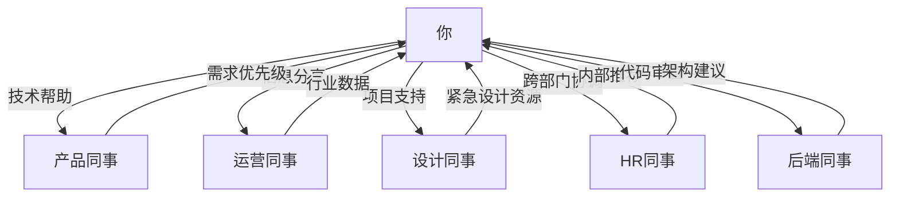

## 四、横向影响力

### 4.1 为什么横向影响力是职场最难的能力

在职场权力的三个方向上——向上（管理上级）、向下（管理下属）、横向（影响同级），横向影响力是唯一完全**没有正式权力支撑**的方向。你不能命令同事做什么，不能用绩效考核施压，也不能用晋升激励。你唯一能做的，是**说服、激励和协作**。

哈佛商学院教授约翰·科特（John Kotter）在研究中发现：在现代组织中，一个中层管理者大约有 **60%-80% 的工作**需要依赖同级别或跨部门的同事来完成，而这些人并不向他汇报。这意味着，如果你只会"向上管理"和"向下管理"，你最多只能做好 20%-40% 的工作。

横向影响力的难度还体现在以下方面：

| 挑战维度 | 具体表现 | 与纵向管理的对比 |
|---------|---------|----------------|
| 无正式权力 | 无法用行政命令推动 | 向下管理可以直接指令 |
| 目标差异 | 各部门KPI不同，利益经常冲突 | 上下级目标通常对齐 |
| 信息不对称 | 不了解对方的工作约束和压力 | 上下级有定期汇报机制 |
| 关系对等 | 没有天然的权威差序 | 上下级有明确的层级关系 |
| 竞争关系 | 同级之间可能争夺同一资源/晋升 | 上下级竞争较少 |

但横向影响力也有一个巨大的优势：**它是双向的**。当你影响同级的同时，你也在被他们影响。这种双向互动如果经营得当，会形成一个**互利共生的协作网络**，成为你职业生涯最坚实的底座。

### 4.2 四大横向影响力来源

横向影响力不是凭空产生的，它有四个明确的来源。每个来源有不同的建立路径和适用场景。

#### 4.2.1 专业影响力：成为"被需要的人"

专业影响力是最稳固、最持久的横向影响力来源。它的本质是：**你拥有别人需要但不具备的能力或知识**。

**建立路径：**

1. **选择一个"能力锚点"**——找到一个你有天赋、团队有需求的交叉领域。不是要你成为全栈专家，而是要成为某个细分领域的"第一联想人"。比如：
   - "数据可视化找小王，他做的图表最清晰"
   - "性能优化找老张，他调过我们最大规模的系统"
   - "客户谈判找李姐，她最懂甲方心理"

2. **主动展示，而非被动等待**——不要等着别人来找你，要创造"被看见"的机会：
   - 在周会上分享一次技术方案的思考过程
   - 写一篇内部技术文档，解决一个团队长期痛点
   - 主动帮同事解决一个你擅长领域的问题

3. **建立"能力品牌"**——让你的专业能力形成记忆标签：
   - **一致性**：在多个场景中反复展现同一能力
   - **可见性**：让至少 5-10 个人知道你擅长什么
   - **口碑链**：让帮助过的人愿意帮你传播

4. **保持学习深度**——专业影响力最大的威胁是"被超越"。你需要持续深耕，保持在领域的前沿位置。

> **关键提醒**：专业影响力不是"炫技"。如果你帮同事解决问题时总带着"这你都不会？"的态度，你的专业能力越强，同事越不想找你。**真正的专业影响力 = 能力 × 态度**。

#### 4.2.2 信息影响力：成为"信息枢纽"

信息影响力的核心是：**你总是比别人更早、更准、更全面地掌握关键信息**。在组织中，信息就是权力。

**信息枢纽的三个层次：**

Level 1: 信息中转站
    ——能快速转发有价值的信息
    ——建立"有事问TA"的口碑
    ——风险：可替代性高

Level 2: 信息加工者
    ——不仅转发，还能解读、分析、提炼
    ——"我觉得这个消息对我们组意味着……"
    ——风险：需要时间精力投入

Level 3: 信息策展人
    ——建立系统化的信息收集和分发机制
    ——定期分享行业报告、竞品分析、政策解读
    ——成为团队的"智库"
    ——最高价值，但维护成本最高

**具体做法：**

1. **建立信息来源网络**
   - 订阅 3-5 个行业核心信息源（公众号、Newsletter、技术社区）
   - 与公司其他部门保持 1-2 个"信息联络人"关系
   - 参加跨部门会议时，主动了解对方部门的动态

2. **建立信息分享机制**
   - 每周在团队群里分享 2-3 条行业动态
   - 在项目群里转发与项目相关的政策变化或竞品动作
   - 在 1-on-1 中与同事交换"你最近在关注什么"

3. **注意信息分享的边界**
   - 不传播未经证实的内部消息
   - 不用信息差操控他人
   - 区分"帮助他人"和"显示自己消息灵通"

#### 4.2.3 情感影响力：成为"关系节点"

情感影响力的核心是：**你在人际互动中让别人感到舒服、被理解、被支持**。这种影响力在压力大的组织环境中尤其有价值。

**情感影响力的四个维度：**

1. **共情能力**——能准确感知同事的情绪状态
   - 同事加班到深夜时，一句"辛苦了，明天再弄"比"加油"有效十倍
   - 同事方案被否决时，先表达理解再给建议："被拒确实很沮丧，我上次也经历过……"

2. **情绪稳定性**——在团队混乱时保持冷静
   - 项目延期时，不慌不忙地分析问题而不是跟着焦虑
   - 出现冲突时，充当调解者而非火上浇油

3. **关心的持续性**——不是偶尔的嘘寒问暖，而是持续的关注
   - 记住同事提过的家里情况、职业困惑
   - 在同事需要帮助时主动出现，而不是等被请求
   - 在同事取得成绩时真诚祝贺

4. **社交节律感**——知道什么时候该出现，什么时候该退后
   - 同事忙得焦头烂额时，不要拉着聊八卦
   - 同事心情低落时，不要假装看不见

> **实践技巧**：建立一个简单的"关系笔记"——记录团队成员的生日、兴趣、家庭情况、职业目标。不需要很正式，手机备忘录就够。在合适的时候提及，对方会感到被重视。

#### 4.2.4 互惠影响力：编织"互助网络"

互惠影响力是最具战略性的横向影响力来源。它的底层逻辑是**社会交换理论**——人类社会的基本运作规则是"你帮我，我帮你"。

**互惠网络的建设策略：**

1. **主动投入，不计即时回报**
   - 帮同事解决一个技术问题，不要求立刻回报
   - 分享一个工作机会的信息给可能需要的人
   - 在会议上为同事的提案提供支持

2. **记录互助账簿（心理层面）**
   - 你帮过谁，帮了什么，他们后来有没有机会回报
   - 谁帮过你，你还欠着什么人情
   - 注意：这个"账簿"只是自我管理工具，不是讨债清单

3. **确保互惠的多样性**
   - 不要只和同一群人互帮互助
   - 主动扩展到不同部门、不同层级
   - 帮助的类型要多样：技术支持、信息分享、情绪支持、资源协调

4. **接受帮助时给予正反馈**
   - 当同事帮你时，表达感谢并说明帮助的价值
   - "上次你给的建议太有用了，我用那个方法解决了XX问题"
   - 这会让帮助者感到"帮你是值得的"

**互惠网络的结构图：**

> **警惕"互惠陷阱"**：如果你发现自己总是在帮别人，而对方从不回报，这不是互惠网络，这是被单方面消耗。适时调整关系投入的比重。

### 4.3 跨部门沟通的完整方法论

跨部门沟通是横向影响力中最具挑战性的场景。不同部门有不同的目标体系、专业术语、工作节奏甚至价值观。以下是一套完整的跨部门沟通方法论。

#### 4.3.1 沟通前：情报收集与策略制定

在发起跨部门沟通之前，先做好以下功课：

**第一步：理解对方部门的KPI和压力源**

| 部门 | 典型KPI | 压力来源 | 沟通切入点 |
|------|--------|---------|-----------|
| 产品部 | DAU/MAU、功能上线率 | 需求多、资源少、排期紧 | 强调如何帮他们加速交付 |
| 技术部 | 系统稳定性、交付质量 | 需求变更频繁、技术债务 | 尊重技术评估，给足时间 |
| 销售部 | 签单额、回款率 | 客户要求多变、竞品压力 | 强调如何帮他们赢单 |
| 运营部 | 用户留存、活动效果 | 数据压力、预算有限 | 提供数据支撑和资源支持 |
| 财务部 | 预算合规、成本控制 | 各部门超预算、审计压力 | 提前规划预算，减少突击报销 |
| HR部 | 招聘到岗率、员工满意度 | 人手不足、政策变化 | 理解流程复杂度，提前沟通 |

**第二步：明确自己的核心诉求和底线**

用"诉求三问法"梳理：

1. 我想要什么？（核心诉求，用一句话概括）
2. 我能让步什么？（可妥协的空间）
3. 我不能接受什么？（底线）

**第三步：预判对方可能的反应和阻力**

场景预演表：
┌─────────────────────────────────────────────┐
│ 对方可能的反应：                               │
│   反应A: 直接同意 → 方案：感谢+明确后续步骤      │
│   反应B: 犹豫不决 → 方案：提供数据支撑+试点方案   │
│   反应C: 直接拒绝 → 方案：了解原因+调整诉求       │
│   反应D: 推给上级 → 方案：准备方案材料+联合汇报    │
└─────────────────────────────────────────────┘

#### 4.3.2 沟通中：五个关键技巧

**技巧一：用对方的语言说话**

每个部门都有自己的"方言"。用对方的语言，你的诉求才听得进去。

- 和销售说："这个功能上线后，客户的续约率预计提升 15%"
- 和技术说："这个方案复用了现有的缓存架构，开发量控制在 3 人天以内"
- 和财务说："这个投入的ROI预计在 Q3 回正"
- 和产品说："这个优化能降低 20% 的用户流失率"

**技巧二：寻找共同利益，重构问题框架**

把"你的事"变成"我们的事"是跨部门沟通最重要的心法。

错误示范：
"我们部门需要你们在月底前完成这个接口开发。"
→ 对方感觉：又来给我们派活了

正确示范：
"这个接口对接完成后，你们的系统也能获取到我们的实时数据，
不需要再手动同步了。月底前完成的话，能赶上Q2的版本发布，
对你们的Q2 KPI也有帮助。"
→ 对方感觉：这是一个双赢的项目

**技巧三：给对方选择，而非命令**

人在有选择权时更容易配合。即使你内心有一个最优解，也要给对方至少两个选项。

"方案A和方案B都能实现目标，方案A速度快但需要你们多投入2天，
方案B时间宽裕但需要调整一下接口格式。你觉得哪个对你们更合适？"

**技巧四：承认对方的困难，表达理解**

跨部门沟通中，最有效的润滑剂是**对对方处境的理解和承认**。

"我知道你们现在同时在推三个项目，人手确实紧张。
所以我们尽量把需求简化了，只需要你们支持这一个接口。
如果实在排不开，我们也可以先用mock数据跑起来，等你们有空了再接。"

**技巧五：留有余地，不要把话说死**

不要说："这个必须这周五完成。"
要说："理想情况这周五完成，最晚不超过下周三。如果有问题随时沟通。"

不要说："这个方案就是这样，不能改。"
要说："这是我们目前最推荐的方案，如果你们有更好的想法我们可以一起讨论。"

#### 4.3.3 沟通后：跟进与反馈闭环

跨部门沟通的效果，80%取决于沟通后的跟进。

1. **24小时内发送会议纪要**
   - 明确双方达成的共识
   - 列出各自的待办事项和截止日期
   - 抄送双方的直属上级（视情况而定）

2. **设定检查点**
   - 不要等到截止日期才跟进
   - 在中间节点主动询问进展："接口进度怎么样了？有什么阻塞点吗？"

3. **完成后给予正反馈**
   - "这次对接很顺畅，多亏了你们的配合"
   - 在对方上级面前表达认可
   - 在团队内部也提到对方的支持

### 4.4 横向影响力的进阶策略

#### 4.4.1 "弱关系"的力量

社会学家格兰诺维特（Granovetter）提出的"弱关系理论"指出：**对你最有价值的信息和机会，往往来自不太熟悉的人（弱关系），而非你的亲密朋友（强关系）**。

在职场中，这意味着：

- 不要只维护团队内部的强关系，要主动拓展跨部门的弱关系
- 每月至少认识 2-3 个新的跨部门同事
- 参加公司层面的活动（年会、兴趣小组、培训）来扩展弱关系网络

#### 4.4.2 "战略性吃亏"

在横向关系中，偶尔"吃点亏"是高明的长期策略：

- 在资源分配上主动让步一次，换来对方在关键时刻的支持
- 接手一个别人不愿干的跨部门协调工作，展示你的格局和能力
- 在功劳分配上少拿一点，让更多人愿意与你合作

> **注意**：战略性吃亏的前提是"被看见"。如果你默默吃亏对方完全不知道，那就只是亏了，没有战略价值。

#### 4.4.3 构建"跨部门联盟"

当你的横向影响力积累到一定程度，可以有意识地构建跨部门联盟：

联盟建设四步法：

Step 1: 识别"关键节点人物"
    → 每个部门都有1-2个信息灵通、人脉广泛的人
    → 找到他们，建立深度关系

Step 2: 建立定期交流机制
    → 每月一次非正式午餐或咖啡
    → 不聊具体项目，只聊行业趋势和部门动态

Step 3: 创造共同经历
    → 一起做一个跨部门项目
    → 一起参加培训或外部活动
    → 共同经历是最强的关系粘合剂

Step 4: 从双边到多边
    → 把你的A-B关系扩展为A-B-C-D网络
    → 介绍你的朋友们互相认识
    → 你自然成为网络的中心节点

#### 4.4.4 处理横向冲突的"三步法"

同级之间难免有冲突——资源争夺、意见分歧、责任推诿。处理横向冲突的方法：

**第一步：私下沟通，不要公开对质**

❌ 在群里/会议上质问："你们部门为什么还没交付？"
✅ 私下找对方："接口的事进展怎么样了？有什么我能帮忙的吗？"

**第二步：聚焦问题，不要攻击人**

❌ "你们部门总是拖延，每次都不按时交付。"
✅ "这次的交付延迟了3天，影响了我们的测试排期。我们来看看怎么避免下次再出现这种情况。"

**第三步：共同寻找解决方案**

"我理解你们人手紧张，我们也确实需要这个接口。
要不这样：我们把接口拆成两期，先把核心功能对接上，
二期的功能等你们排期宽裕了再做。你看这样行不行？"

### 4.5 常见误区与纠正

| 误区 | 正确做法 | 原因分析 |
|------|---------|---------|
| 只在需要帮忙时才联系同事 | 平时就维护关系，不要"临时抱佛脚" | 临时求助让人感觉被利用 |
| 用"上面要求的"来压同事 | 说明业务价值和共同利益 | "上面要求"会激发逆反心理 |
| 把功劳全揽在自己身上 | 公开感谢协作方的贡献 | 抢功是横向关系的毒药 |
| 遇到跨部门阻力就向上告状 | 先尝试自己解决，实在不行再求助 | 频繁告状会破坏你的横向信任 |
| 只和同部门的人搞好关系 | 主动拓展跨部门人脉 | 只有部门内的关系是不够的 |
| 用情绪化方式表达不满 | 理性表达诉求，聚焦解决方案 | 情绪化会破坏长期关系 |
| 等着别人来找你合作 | 主动出击，先付出再收获 | 被动等待永远建不起影响力 |

### 4.6 实战模板

#### 4.6.1 跨部门协作需求沟通邮件模板

主题：【协作请求】XX项目接口对接 —— 预计3人天工作量

Hi [对方姓名/团队]，

我们正在推进XX项目，需要与贵团队对接[具体接口/功能]。

【背景】
这个项目的业务目标是[一句话说明]，预计影响[数据指标]。

【对贵团队的价值】
- 接口打通后，你们的[具体好处]
- 预计能帮你们[具体改善]

【需求描述】
- 需要支持的内容：[具体描述]
- 预计工作量：[X人天]
- 期望完成时间：[日期]

【可选方案】
- 方案A：[描述]，优点/缺点
- 方案B：[描述]，优点/缺点

方便的话，这周找个时间面聊15分钟？我来你们工位也行。

谢谢！
[你的名字]

#### 4.6.2 横向影响力自评量表

每月花 5 分钟评估自己的横向影响力：

评分标准：1=很差 2=一般 3=中等 4=良好 5=优秀

专业影响力：
  __ 同事遇到我的专业领域问题会主动找我
  __ 我在团队中有明确的"能力标签"

信息影响力：
  __ 我经常能提供别人不知道的有价值信息
  __ 我建立了稳定的信息获取渠道

情感影响力：
  __ 同事愿意和我聊工作以外的话题
  __ 在团队压力大时，我能稳定大家情绪

互惠影响力：
  __ 我有3个以上不同部门的互助伙伴
  __ 我帮过的人也愿意在我需要时帮忙

跨部门能力：
  __ 我能顺利推动跨部门协作项目
  __ 我了解至少3个部门的KPI和工作方式

总分：__/25
目标：每月提升2分

### 4.7 从横向影响力到组织影响力

横向影响力的最终目标不是"和同事搞好关系"，而是**建立一个以你为中心的协作网络**。这个网络让你在组织中拥有超越职级的影响力——即使你没有头衔，你的声音也能被听到；即使你不是领导，你推动的事情也能被落实。

当你同时具备专业影响力、信息影响力、情感影响力和互惠影响力时，你就拥有了一个完整的横向影响力体系。这个体系不会因为换了一个领导、换了一个项目而失效——它是你自己的职业资本，跟着你走。

