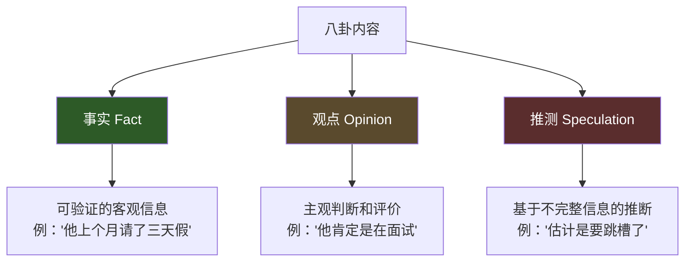
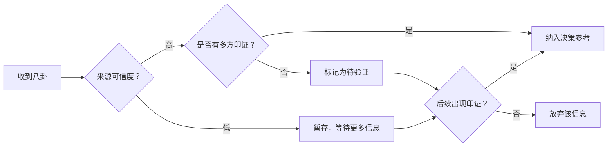

## 五、办公室八卦处理

### 5.1 八卦的本质：为什么办公室一定有八卦

在讨论如何处理八卦之前，必须先理解一个事实：**八卦是人类社会的底层操作系统，它不会消失，也永远不可能被"禁止"。**

进化心理学家罗宾·邓巴（Robin Dunbar）的研究表明，人类语言的进化动力之一就是"社会梳理"——灵长类动物通过互相梳理毛发建立信任和联盟，而人类进化出语言后，"闲聊"和"八卦"替代了物理梳理的功能。研究显示，日常对话中约有65%的内容属于社会性信息交换（即八卦的广义定义），这一比例在不同文化中高度一致。

在组织行为学的视角下，办公室八卦至少承担以下功能：

| 功能 | 说明 | 示例 |
|------|------|------|
| **信息传递** | 绕过正式渠道传递组织动态 | "听说B部门要被合并" |
| **关系建立** | 通过共享秘密建立亲密感 | "我只告诉你一个人……" |
| **权力博弈** | 通过信息差构建影响力 | 故意透露某人即将升职的消息 |
| **压力释放** | 在不确定环境中宣泄焦虑 | "老板最近心情不好，大家小心" |
| **规范维护** | 通过议论强化组织行为边界 | "他居然在会上直接怼客户" |
| **地位竞争** | 通过贬低他人抬升自身 | "他那个项目其实是我做的" |

理解八卦的功能分类至关重要——**不同类型的八卦需要完全不同的应对策略**。把所有八卦一棍子打死的人，会失去重要的信息渠道；把所有八卦都当真的人，则会成为谣言的牺牲品。

### 5.2 八卦的分类体系

并非所有八卦都是等价的。根据内容性质和意图，办公室八卦可以分为以下几类：

#### 5.2.1 按内容性质分类

**中性八卦**——关于日常事件的闲聊

内容范围：谁换了发型、谁家孩子考上了大学、谁中午吃了什么。这类八卦风险最低，功能上主要是社交润滑剂。适度参与中性八卦不仅无害，还能帮助你融入团队。

**信息型八卦**——关于组织变动的非正式消息

内容范围：人事调整、部门重组、项目进展、战略方向。这类八卦的价值最高，但也最容易被扭曲。需要交叉验证才能采信。

**负面八卦**——关于特定个体的批评或攻击

内容范围：能力质疑、人品攻击、隐私泄露、行为批评。这类八卦风险最高，参与其中可能让你成为下一个目标。

**恶意八卦**——有明确意图的造谣和中伤

内容范围：捏造事实、断章取义、恶意揣测。这类八卦背后通常有明确的利益驱动——有人在故意操纵舆论。

#### 5.2.2 按传播意图分类

| 类型 | 传播者意图 | 识别信号 | 风险等级 |
|------|-----------|----------|----------|
| 无意闲聊 | 打发时间、建立连接 | 语气轻松、无明确目的 | ★☆☆☆☆ |
| 试探气球 | 测试你的立场和口风 | "你觉得XX怎么样？""你听说了吗？" | ★★★☆☆ |
| 定向投喂 | 故意给你特定信息 | 选择只告诉你、强调"别外传" | ★★★★☆ |
| 舆论操控 | 有目的地改变集体认知 | 多人同时传播同一版本 | ★★★★★ |
| 转移火力 | 把注意力引向别人 | 某人突然成为话题中心 | ★★★★☆ |

**关键识别技巧**：当同一个人的"负面消息"在短时间内被多人从不同角度提及，而这些人之间又存在明显关联时，大概率是有组织的舆论操控，而非自然传播。

### 5.3 处理八卦的核心原则

#### 原则一：只听不说——成为信息的"黑洞"

这是处理八卦最重要的一条原则。具体操作分为三层：

**第一层：主动倾听。** 当有人开始八卦时，不要表现出抗拒或不耐烦。用适度的倾听信号（点头、"嗯"、"是吗"）维持对话，但不要追问细节，更不要发表评价。

**第二层：情绪同步，观点留白。** 对方说"XX太过分了"时，你可以说"听起来你挺生气的"（情绪标注），但不要说"我也觉得他过分"（观点认同）。情绪标注让对方感到被理解，但你没有对事实做任何判断。

**第三层：信息归档，不对外转发。** 听到的信息只用于自己的判断和决策，绝不转述。一旦你开始转发，你就从"接收者"变成了"传播者"，风险层级完全不同。

> **话术模板：中性回应**
>
> - "哦，这样啊。"（不表态）
> - "我倒没注意到。"（不确认）
> - "每个人看法不一样吧。"（不站队）
> - "这个我真不太清楚。"（不参与判断）
> - "是吗？我还第一次听说。"（保持距离）

#### 原则二：不站队——保持战略模糊

当有人在你面前说另一个人的坏话时，你的反应会成为对方判断你立场的依据。三种错误反应及其后果：

| 错误反应 | 对方的解读 | 后果 |
|----------|-----------|------|
| 附和："对，他确实不行" | 你站在我这边 | 你的话会被传播，成为攻击依据 |
| 反驳："他其实挺好的" | 你是对方的人 | 你被标记为敌对阵营 |
| 沉默不语 | 你不信任我 | 关系降温，可能被孤立 |

**正确做法**：用"软转移"技术——先认可对方的情绪，再自然地把话题引向无关方向。

> **话术模板：软转移**
>
> - "嗯，我能理解你的感受。对了，周五那个会你准备得怎么样了？"
> - "职场上确实不容易。哎，中午一起吃饭？新开了家店。"
> - "每个人都有自己的风格吧。话说你知道下季度预算的事吗？"

#### 原则三：不提供"弹药"——管住自己的嘴

在八卦场合，每个人都在不经意间暴露信息。这些信息会被收集、存储、并在未来的某个时刻被用出来。具体需要守住的边界：

**绝对不能说的：**
- 你对任何同事的负面评价（即使是"客观评价"）
- 你从上级那里听到的未公开信息
- 你个人的隐私和弱点
- 任何涉及薪资、晋升的敏感话题
- 对公司政策或战略方向的抱怨

**可以说但要注意方式的：**
- 对工作流程的改进建议（聚焦事情，不涉及人）
- 行业趋势和公开新闻（没有内部敏感信息）
- 个人的中性生活信息（适度展示真实自我）

**一个实用的判断标准**：在说出任何话之前，假设这句话会被完整地、一字不差地传到当事人耳中，并且会被断章取义。如果这个场景下你会感到被动，就不要说。

#### 原则四：区分事实、观点与推测

八卦中的信息通常混杂着三个层次的内容，听者必须具备区分能力：

**实操方法**：听到八卦时，在心里做一次"三层拆解"。以"听说张总要被调走了"为例：

- **事实层**：有人在传播这个消息。但这个消息本身的来源是什么？是张总亲口说的？还是人事部透露的？还是某人的猜测？
- **观点层**：传播者认为这是"调走"而非"升职"——这里已经注入了主观判断。
- **推测层**：为什么要调走？是对业绩不满还是正常轮岗？没有任何信息支撑。

只记录事实层的信息，对观点和推测保持怀疑。

#### 原则五：远离恶意八卦——划清法律与道德边界

有些八卦已经越过了"闲聊"的边界，进入了诽谤和侵权的领域。以下情况必须果断远离：

- **涉及个人隐私**：家庭状况、健康问题、感情生活
- **涉及人格侮辱**：恶意绰号、人身攻击
- **涉及职业造谣**：捏造工作失误、编造能力缺陷
- **涉及违法指控**：未经证实的腐败、欺诈暗示

参与恶意八卦不仅有道德风险，还有法律风险。根据《中华人民共和国民法典》第1024条，民事主体享有名誉权，任何组织或个人不得以侮辱、诽谤等方式侵害他人的名誉权。在微信群、企业微信等电子平台上传播不实信息，都有电子证据留痕，一旦追责，传播者也需要承担连带责任。

### 5.4 当八卦指向你时的应对策略

被八卦是每个职场人都可能遇到的情况。处理方式直接影响你的职业形象和人际关系。

#### 5.4.1 评估八卦的严重程度

不是所有针对你的八卦都需要回应。按照严重程度分级处理：

| 级别 | 特征 | 应对策略 |
|------|------|----------|
| 轻微 | 无关痛痒的闲谈（穿着、习惯等） | 忽略，不当回事 |
| 中等 | 能力质疑、性格评价 | 用行动证明，不在言语上纠缠 |
| 严重 | 不实指控、恶意中伤 | 正式澄清，必要时走组织渠道 |
| 危机 | 涉及违法、道德底线的造谣 | 收集证据，法律途径解决 |

#### 5.4.2 轻微-中等情况的应对

**方法一：用事实消解谣言**

最好的辟谣不是反驳，而是用行动展示事实。如果有人说你"能力不行"，不要去解释和辩护——把下个项目做好就是最有力的回应。

**方法二：增加信息透明度**

很多八卦的根源是信息真空。人们在缺乏信息时会本能地"脑补"。如果你的工作、态度、立场有更大的可见性，八卦的空间就更小。

**方法三：与关键人物建立直接沟通**

如果你知道哪些人可能在传播关于你的信息，主动与他们建立直接沟通渠道。很多误解在直接对话中会自然消解。

> **话术模板：主动澄清**
>
> "我最近听到一些关于XX的传言，想直接跟你说清楚——实际情况是……我更希望我们之间有什么疑问可以直接聊，不要被第三方的信息影响。"

#### 5.4.3 严重情况的应对

当八卦已经严重影响你的工作和声誉时，需要更正式的处理方式：

**第一步：收集证据。** 记录八卦的来源、传播路径、具体内容和时间节点。电子平台的消息记录要截图保存。

**第二步：找到源头。** 追溯八卦的最初传播者。这不是为了报复，而是为了精准澄清。

**第三步：正式沟通。** 与源头当事人进行一对一沟通，态度坚定但不激烈：

> **话术模板：严肃澄清**
>
> "我了解到最近有一些关于我的说法在传播，具体是[内容]。我需要明确告诉你，这不是事实。这件事对我造成了实际影响。我希望到此为止。如果你对我的工作有任何疑问，欢迎直接找我谈。"

**第四步：升级处理。** 如果正式沟通无效，可以向直属上级或HR反映情况。注意：只陈述事实，不添加情绪化评价。提供你收集的证据。

### 5.5 将八卦转化为战略信息源

高段位的职场人不会简单地回避八卦，而是将其作为**非正式信息系统**来利用。

#### 5.5.1 建立你的"信息网络"

在每个组织中，都有几个天然的"信息枢纽"——他们不一定职位高，但消息灵通、人脉广泛。识别这些人并与他们保持良好关系，你就拥有了组织的"非正式新闻源"。

信息枢纽通常有以下特征：
- 在公司工作时间较长（3年以上）
- 跨部门社交广泛，不只在自己部门活动
- 性格外向，乐于分享
- 在公司餐厅、茶水间等社交场景中很活跃

**注意**：与信息枢纽保持关系≠成为八卦传播者。你的角色是"听众"，不是"中转站"。

#### 5.5.2 从八卦中提取情报

真正有价值的不是八卦本身，而是八卦背后反映的组织信号：

| 八卦内容 | 可能的真实信号 | 行动建议 |
|----------|---------------|----------|
| "听说要裁员" | 组织可能正在经历调整 | 更新简历，关注内部机会 |
| "XX和领导关系很好" | XX可能成为关键节点 | 评估是否需要与其建立合作 |
| "那个项目好像不太顺利" | 该方向可能存在风险 | 如果你涉及其中，提前准备预案 |
| "新来的总监很强势" | 管理风格可能变化 | 观察并适应新领导的偏好 |
| "公司要开拓新业务" | 可能有新的发展机会 | 主动了解新业务方向，储备能力 |

#### 5.5.3 建立"八卦验证机制"

不要轻信任何单一来源的八卦信息。建立一个简单的验证框架：

**"三方印证"原则**：如果同一信息从三个独立来源得到确认，可信度显著提高。注意"独立"二字——如果三个人都是从同一个人那里听说的，那只算一个来源。

### 5.6 特殊场景的八卦应对

#### 5.6.1 被拉入"八卦小团体"

有时你会被邀请加入某个固定的八卦圈子——午餐小群、下午茶团体、下班后聚会。这些圈子有社交价值，但也有风险。

**加入前的评估清单**：
- 这个圈子的主要话题是什么？（工作吐槽 vs 人身攻击 vs 专业交流）
- 圈子里有谁？（是否跨越了你不想跨越的阵营边界）
- 如果圈子里的对话内容被公开，你会不会被动？（"阳光测试"）

**如果已经加入，设置参与边界**：
- 参加聚会但不主动发起八卦话题
- 在群聊中保持适度沉默，不接任何攻击性话题
- 不在群聊中发任何你不想被截图的文字

#### 5.6.2 领导主动和你八卦

当上级主动与你分享八卦时，这是一种信任信号，但也是一种微妙的测试。领导可能在试探你的口风、忠诚度或判断力。

**应对原则**：
- 倾听并表示感谢信任
- 不追问细节，不评价当事人
- 不把领导的话转述给任何人
- 用模糊的正向词回应："嗯，我理解""确实挺复杂的"

**绝对不要做的事**：
- 趁机打小报告或攻击他人
- 表示你也"知道一些内幕"来讨好领导
- 把领导的八卦当作"权威信息"直接传播

#### 5.6.3 八卦涉及你的直属上级

当八卦的主角是你的直接领导时，情况尤为棘手。你每天都要和这个人打交道，任何立场都会直接影响你的日常工作。

**核心策略**：保持绝对中立，不参与任何评价。

如果有人说你领导的坏话——不附和，也不反驳。如果有人说你领导的好话——可以认可但不过度热情。因为在你不知道全貌的情况下，你无法判断这些信息的真实性和传播者的意图。

#### 5.6.4 跨部门八卦

跨部门八卦往往涉及部门间的利益冲突。当其他部门的人在你面前议论你的部门或同事时：

- **不要成为"内奸"**：不要为了讨好对方而出卖自己部门的信息
- **不要成为"间谍"**：不要把对方部门的八卦带回来邀功
- **保持职业形象**：倾听后中性回应，不为任何一方站台

### 5.7 数字时代的八卦管理

#### 5.7.1 电子平台八卦的特殊风险

在微信群、企业微信、飞书、钉钉等平台上发生的八卦，与线下八卦有本质区别：

| 维度 | 线下八卦 | 电子平台八卦 |
|------|---------|-------------|
| 留痕性 | 无记录，口说无凭 | 完整截图记录，永久保存 |
| 传播范围 | 受限于物理接触 | 瞬间扩散，无法控制 |
| 脱离语境 | 可以通过语气理解上下文 | 截图断章取义，极易误解 |
| 法律效力 | 证据难以固定 | 可直接作为电子证据 |
| 可控性 | 对话可以修正和补充 | 发出去就收不回来 |

#### 5.7.2 数字平台的行为准则

**绝对不要在任何电子平台上做的事**：
- 在任何群聊中评价同事的能力或人品
- 转发任何未经证实的组织变动消息
- 在非工作群中讨论公司内部事务
- 发送任何带有情绪色彩的关于具体人的文字
- 私聊中与他人讨论第三方的隐私

**如果收到不当八卦信息**：
- 不回复、不转发、不截图传播
- 如果内容严重，保存原始记录作为证据
- 如果发送者与你关系亲近，可以私下提醒对方注意风险

### 5.8 八卦处理的进阶心法

#### 5.8.1 "棋盘思维"——看穿八卦背后的利益格局

每个八卦的传播路径都不是随机的。问自己三个问题：

1. **谁从这个八卦的传播中获益？** 如果某个八卦让特定的人或团队受益，那这个八卦很可能不是自然产生的。
2. **这个八卦在什么时候出现？** 在人事调整前、绩效评估期、项目竞标时出现的八卦，往往有更深层的动机。
3. **谁在推动这个八卦的传播？** 找到传播链条中的关键节点，就能看清利益格局。

#### 5.8.2 "情感账户"理论——八卦是社交货币

在职场关系中，倾听他人的八卦是一种"存款"行为。当有人向你倾诉或分享八卦时，他们实际上在表达信任。如果你能妥善回应（倾听但不传播），你的"情感账户"就在增长。

但要注意：**存款是有上限的**。如果你总是倾听却从不分享任何自己的信息，对方会感到不对等。适度分享一些无伤大雅的个人信息（周末去哪玩了、最近看了什么书），维持关系的对等感。

#### 5.8.3 长期主义视角——声誉是最重要的资产

在八卦问题上，短期收益和长期声誉往往是对立的：

- 传播八卦可能让你短期内获得社交资本，但长期会让你失去信任
- 附和别人的攻击可能让你短期内获得盟友，但长期会让你被贴上"不靠谱"的标签
- 沉默和中立可能让你短期内显得"不合群"，但长期会建立"可信赖"的声誉

**三年法则**：在一家公司工作三年以上的人，通常都知道谁可以信任、谁不可以。那些长期保持中立、不参与恶意八卦的人，最终会成为所有人都愿意与之合作的人。

### 5.9 常见误区与纠正

| 常见误区 | 问题所在 | 正确做法 |
|----------|---------|----------|
| "我不听八卦，保持清高" | 失去重要的非正式信息渠道 | 倾听但不传播，保持信息敏感度 |
| "八卦都是垃圾，完全不理会" | 可能错过组织变动的预警信号 | 区分八卦类型，提取有价值信息 |
| "别人八卦我，我要当面怼回去" | 激化冲突，暴露你的信息来源 | 分级应对，轻微忽略，严重正式沟通 |
| "领导和我八卦是信任我" | 可能是试探，也可能是陷阱 | 感谢信任但不参与评价 |
| "在群里说几句没事" | 电子留痕，风险远大于线下 | 文字平台上零八卦 |
| "我只是听，又没传播" | 如果你转发了"只告诉你"的内容 | 严格遵守信息隔离 |
| "八卦帮我了解公司真相" | 八卦中混杂大量推测和偏见 | 用"三层拆解"过滤信息 |
| "和大家八卦能拉近关系" | 以八卦为基础的关系很脆弱 | 用专业能力和真诚建立关系 |

### 5.10 本节自检清单

定期用以下清单检查自己的八卦处理能力：

- [ ] 我能在八卦场合保持冷静，不被情绪带走
- [ ] 我能在听到八卦后区分事实、观点和推测
- [ ] 我从来没有在电子平台上留下任何八卦类的文字记录
- [ ] 我知道组织中哪些人是"信息枢纽"，并与他们保持良好关系
- [ ] 我能在被八卦时根据严重程度选择正确的应对策略
- [ ] 我能在领导和我八卦时保持职业和中立
- [ ] 我在八卦问题上有明确的个人原则并一贯执行
- [ ] 我的同事评价我"靠谱"——不会背后说人坏话
- [ ] 我能从八卦中提取有价值的信息用于职业决策
- [ ] 我在处理八卦问题时考虑的是长期声誉而非短期收益

***

