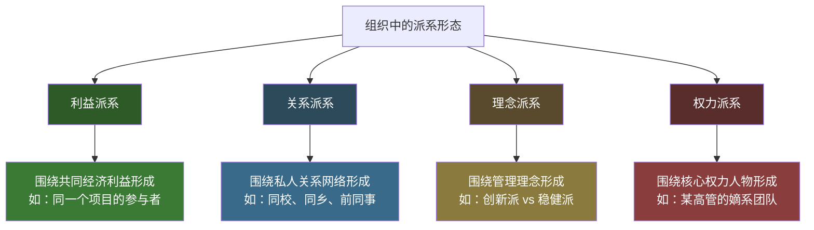
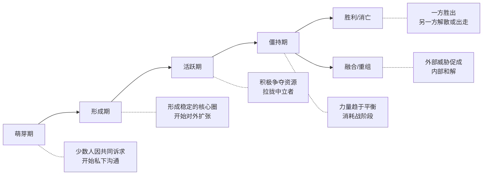

## 六、派系斗争中的沟通策略

派系是组织中最复杂、最敏感、也最考验智慧的政治生态。不同于利益博弈的"你争我夺"或八卦传播的"信息流动"，派系斗争是一种**结构性的权力对抗**——它有明确的阵营划分、持续的拉锯过程、以及深远的职业影响。处理不好，你可能成为派系斗争的炮灰；处理得当，你可以在各方博弈中获得超越任何单一派系的影响力。

### 6.1 派系的本质：为什么组织必然产生派系

在讨论策略之前，必须先理解一个事实：**派系不是组织的"病态"，而是组织的"常态"。** 只要组织中存在资源稀缺性（晋升名额有限、预算有限、话语权有限），就必然会出现围绕资源分配的竞争，而派系就是竞争的组织化形态。

#### 6.1.1 派系形成的组织行为学解释

组织行为学家杰弗里·普费弗（Jeffrey Pfeffer）在其经典著作《组织中的权力》中指出：组织中的正式结构（组织架构图）只描述了权力的"表层"，真正的决策往往发生在正式结构之外的非正式联盟网络中。这些联盟网络，就是派系。

派系形成有三个必要条件：

| 条件 | 说明 | 示例 |
|------|------|------|
| **资源稀缺** | 组织中的关键资源（权力、预算、晋升）无法满足所有人的需求 | 3个部门争1个VP名额 |
| **利益分化** | 不同群体对资源分配有不同的诉求和优先级 | 技术团队要研发投入，销售团队要市场推广 |
| **信息不对称** | 不同群体掌握的信息不同，导致判断和立场差异 | 管理层知道战略方向，执行层只看到眼前 |

当这三个条件同时存在时，派系就会自然形成——不需要有人"煽动"或"阴谋策划"，这是组织中人的行为的自然结果。

#### 6.1.2 派系的四种典型形态

并非所有派系都是一样的。根据形成基础和运作方式，组织中的派系可以分为以下四种典型形态：

**利益派系**——因共同的经济利益而结盟

这是最常见、也最"现实"的派系类型。成员之间的关系本质上是**交易关系**：你帮我拿下这个项目，我帮你争取那个资源。利益派系的特点是稳定性取决于利益的一致性——一旦共同利益消失（项目结束、资源分配完毕），派系就可能松散甚至解体。

识别信号：派系成员在资源分配会议上的立场高度一致；跨部门协作时总是互相支持；私下交流频繁但话题集中于工作利益。

**关系派系**——因私人纽带而结盟

这类派系基于血缘、地缘、学缘或业缘关系形成。典型表现包括：校友抱团（"XX大学帮"）、同乡会（"湖南帮""东北帮"）、前公司同事联盟（"XX公司出来的那批人"）。关系派系的特点是**信任门槛低、忠诚度高、排外性强**。

识别信号：成员在非工作场景互动频繁（聚餐、旅游、家庭往来）；对彼此的私生活非常了解；在涉及成员的争议中倾向于无条件支持。

**理念派系**——因管理哲学而结盟

当组织面临战略方向选择时，不同管理理念的人会自然聚拢。例如：激进创新派 vs 稳健保守派、国际化派 vs 本土化派、产品驱动派 vs 销售驱动派。理念派系的特点是**有明确的"纲领"**，成员因为真心认同某种方向而聚集，而非纯粹的利益计算。

识别信号：在战略讨论中同一群人总是持相似观点；有非正式的"理论交流"（读书会、行业研讨）；对组织方向有明确的书面建议。

**权力派系**——因核心人物而结盟

这是组织中最典型也最危险的派系形式。以某个权力核心为中心，形成"中心-卫星"式的辐射结构。核心人物通常是高管或实权中层，"卫星"则是其直接下属、曾经的下属、以及因各种原因依附于他的人。权力派系的特点是**稳定性高度依赖核心人物的地位**——一旦核心人物失势，整个派系可能瞬间瓦解。

识别信号：某些人的职业发展与某个领导的任职时间高度相关；在人事变动中，某领导的下属总是"有进无出"；该领导的"建议"在组织中的实际执行力远超其正式权限。

#### 6.1.3 派系的生命周期

理解派系的生命周期有助于你判断当前局势和选择策略：

**关键洞察**：派系斗争最危险的时刻不是"打得最凶"的时候，而是**平衡被打破的时刻**——一方突然得势（如核心领导升职/调走）、外部环境剧变（如公司被收购、行业危机）。在这些转折点上，你的站队选择会被放大检视。

### 6.2 派系斗争中的七条核心原则

掌握以下七条原则，你就能在派系斗争中保持主动权，而不是被裹挟其中。

#### 原则一：不轻易站队——保持战略选择权

这是派系斗争中最重要的原则，也是大多数人最常犯错误的地方。

**为什么不能轻易站队？**

1. **信息不充分**：在派系斗争的早期和中期，你很难准确判断哪一方会最终胜出。过早站队等于在信息不完整的情况下做不可逆的决策。
2. **被工具化**：过早站队的人往往不是被当作"伙伴"，而是被当作"棋子"——你被拉进阵营不是因为对方尊重你，而是因为你有用。一旦你的利用价值消失，你会被毫不犹豫地抛弃。
3. **失去灵活性**：一旦你公开站队，你的行动空间就被大幅压缩。你无法再与另一方正常沟通，无法在两个阵营之间充当桥梁，也无法在局势变化时灵活调整。

**什么时候必须站队？**

保持中立不是永远不站队，而是在**最有利的时机、以最有利的方式**做出选择。以下三种情况意味着你必须做出选择：

| 必须站队的信号 | 判断依据 | 应对方式 |
|---------------|---------|---------|
| 组织明确要求表态 | 上级或HR正式要求你在两个方案/方向中选一个 | 基于专业判断而非派系关系选择 |
| 阵营冲突已经不可调和 | 双方公开对立，中立者被两边排斥 | 选择与你核心利益更一致的一方 |
| 你的生存空间被压缩 | 不站队意味着两边都不信任你、资源都被切断 | 选择更有长期前景（而非当前实力）的一方 |

**站队时的沟通策略**：

如果你最终不得不站队，用**专业理由而非派系理由**来解释你的选择。不要说"我支持张总"，而是说"我认为这个技术方向更符合公司的长期发展"。专业理由为你保留了在不同情境下的解释空间——如果将来风向变了，你可以用新的专业判断来解释立场变化，而不是被视为"叛徒"。

#### 原则二：保持与各方的良好关系——不撕破脸

即使你内心有倾向，也不要与另一方撕破脸。职场中"没有永远的敌人"——今天的对手可能是明天的盟友。这不是虚伪，而是**职业成熟度的体现**。

**具体做法**：

- **日常交往不中断**：即使你知道对方属于"对立阵营"，在走廊、电梯、茶水间遇到时仍然正常打招呼、闲聊。不要让派系立场影响基本的社交礼貌。
- **工作协作保持专业**：如果你们有工作交集，在工作中保持专业态度。该提供的信息提供，该配合的配合。"因为派系立场而在工作上设置障碍"是职场中最蠢的行为之一——它会让你在所有人眼中失去可信度。
- **不参与攻击对方的言论**：当你的"盟友"在你面前攻击对方时，不要附和。用"嗯""确实挺复杂的""每个人看法不一样"等中性表达保持距离。

> **话术模板：平衡回应**
>
> 当有人问你"你站在哪边"时：
> - "我觉得两边都有道理，具体怎么处理还是看领导的判断吧。"
> - "我对这个问题还在思考，可能需要了解更多情况。"
> - "我只关心怎么把工作做好，派系的事我不太参与。"
>
> 当有人在你面前攻击另一方时：
> - "嗯，确实挺复杂的。"（不表态）
> - "他做事有自己的风格，我们关注自己的事情就好。"（不评价）
> - "这个我不太好评价，毕竟我不是当事人。"（划清边界）

#### 原则三：用专业说话——打造"不可替代性"

在派系斗争中，最安全的立场是**"我只关心做好工作"**。用专业能力和工作成果作为你的"护身符"。

**为什么专业能力是最佳保护？**

无论哪个派系最终胜出，组织都需要能干活的人。如果你的工作成果有目共睹，任何掌权的派系都需要你——而不是报复你。派系斗争的"清洗"通常针对的是那些"站错队且没有核心价值"的人，而不是"中立但有核心能力"的人。

**如何建立不可替代性？**

- **掌握关键技能**：成为团队中某个关键技术或流程的"唯一专家"。当别人遇到这个问题只能找你时，任何派系都不敢轻易动你。
- **拥有关键关系**：维护与客户、合作伙伴、政府主管部门的关系。这些外部关系是你的"护城河"——内部斗争再激烈，谁也不敢得罪能带来客户和收入的人。
- **控制关键信息**：成为组织中某个重要信息流的节点。不是故意垄断信息，而是通过你的角色和位置，自然而然地成为"必须经过你"的信息枢纽。

#### 原则四：掌握信息优势——知道但不说

了解各方的立场、诉求和策略，但不轻易透露你所掌握的信息。信息优势是派系博弈中最有力的武器。

**信息收集的三层架构**：

| 层级 | 信息类型 | 获取方式 | 使用方式 |
|------|---------|---------|---------|
| **公开层** | 组织公告、会议记录、公开表态 | 正常工作渠道 | 用于理解"台面上"的立场 |
| **半公开层** | 非正式交流中的暗示、试探 | 与各方保持良好关系 | 用于判断"台面下"的真实意图 |
| **隐秘层** | 核心决策过程、私下交易 | 极少数信任关系 | 仅用于自我保护，绝不外传 |

**信息管理的关键规则**：

1. **多听少说**：在派系相关的讨论中，你的话越少，越安全。每多说一句话，就多一个被断章取义的风险。
2. **不传话**：绝对不要在两个派系之间传话。"A派的人说你们如何如何"——这种行为会让你立刻成为两边都不信任的人。
3. **信息隔离**：从A派系获得的信息，绝不在B派系面前透露，反之亦然。建立严格的信息隔离墙。
4. **延迟判断**：听到任何派系相关的信息，不要立即做出反应。在心里标记"待验证"，用时间和更多的信息来源来确认。

#### 原则五：避免成为"工具人"——识别利用性站队邀请

当一个派系主动拉拢你时，不要觉得受宠若惊。先冷静分析：**他们为什么需要我？**

**常见的利用模式**：

| 利用模式 | 对方的真实意图 | 识别信号 | 应对方式 |
|---------|--------------|---------|---------|
| **凑人头** | 需要更多"支持者"来展示声势 | 平时不来往，投票/表态时突然热情 | 礼貌但模糊地回应，不给明确承诺 |
| **当枪使** | 需要有人替他们说"不方便说的话" | 建议你在会议上提出某个敏感话题 | "这个话题我觉得XX（对方核心人物）提更合适" |
| **挖信息** | 想通过你获取对方阵营的信息 | 频繁打听另一方的动向和内部消息 | "我跟他们接触不多，不太了解" |
| **背黑锅** | 需要有人在失败时承担责任 | 把高风险任务推给你，承诺"全力支持" | 明确责任边界，要求书面授权和资源保障 |
| **做试探** | 通过你的反应测试对手的底线 | 让你向另一方传递特定信息 | "我觉得你们直接沟通更有效" |

**核心判断标准**：如果一个派系给你的"角色"是可替代的（谁都可以当这个"支持者"），那你就是棋子；如果给你的"角色"是基于你的专业能力（需要你的特定技能或关系），那才可能是真正的合作。

#### 原则六：成为桥梁而非墙——跨派系的价值定位

最高段位的派系生存策略不是"选边站"，而是**成为各方都需要的桥梁型人物**。

桥梁型人物的核心价值在于：他们可以在不泄露任何一方机密的前提下，**促进各方的理解和沟通**。在派系斗争中，最大的损失往往不是某一方"赢了"，而是双方的沟通完全断裂、信任彻底崩塌。桥梁型人物的存在，为组织保留了"最低限度的合作可能性"。

**如何成为桥梁？**

1. **维护与各方的独立关系**：不依附于任何一方，但与各方都保持可信赖的工作关系。
2. **在公开场合保持中立立场**：在会议和讨论中，你的发言应该聚焦于"事实和数据"而非"立场和阵营"。
3. **在私下沟通中传递善意**：不是传递信息（那是传话），而是传递态度——"张总其实也理解你们的难处""李总对这个方案没有敌意，主要是担心风险"。
4. **在冲突时刻充当缓冲**：当两个派系的人在会议上剑拔弩张时，你可以充当"翻译"——把双方的情绪化表达翻译成理性的诉求，帮助双方看到共同利益。

**桥梁型人物的风险与限制**：

- 如果派系斗争已经进入"你死我活"的阶段，桥梁空间会被极度压缩，继续当"和事佬"反而会让两边都觉得你"不可靠"。
- 桥梁型人物需要极高的情商和沟通能力。如果你做不到"传善不传话"，就不适合这个角色。
- 桥梁角色的成功取决于你的个人声誉——如果任何一方完全不信任你，桥梁就建不起来。

#### 原则七：知道何时离开——自保优先

如果派系斗争已经严重影响了你的工作和心理健康，考虑离开。有时候，"不做选择"本身就是一种选择——选择保护自己。

**判断是否应该离开的信号**：

| 信号 | 严重程度 | 建议 |
|------|---------|------|
| 你的工作成果被派系立场否定或无视 | ⚠️ 中等 | 尝试向上级或HR反映，观察是否有改善 |
| 你在两个派系之间被反复挤压，无法正常工作 | 🔴 严重 | 开始规划退出策略，更新简历 |
| 派系斗争已经导致你的心理健康出现问题 | 🔴 严重 | 优先保护自己，不要犹豫离开 |
| 组织文化已经全面"派系化"，专业能力不再重要 | ⚫ 危机 | 立即寻找新的职业机会 |

**离开时的沟通策略**：

- 不要在离职沟通中提及派系问题——用"个人发展""职业规划"等中性理由
- 不要带走任何派系的"秘密"——这会毁掉你的行业声誉
- 保持与前同事（包括各派系的人）的关系——你不知道将来谁会在什么地方帮助你

### 6.3 五种典型派系场景的沟通策略

#### 场景一：被两方同时拉拢

**背景**：组织中两个主要派系都在争取你的支持。你可能是某个关键岗位的负责人、某个重要项目的管理者、或者仅仅是"人多力量大"中的那个人数。

**沟通策略：模糊立场，展示专业价值**

第一步：对双方的拉拢表示感谢（但不承诺）
话术："谢谢你的信任，我会认真考虑的。"

第二步：用工作优先来搪塞明确的站队要求
话术："现在手头这个项目到了关键阶段，我先把精力放在工作上，
等项目告一段落我们再聊这个话题。"

第三步：如果被追问，用专业判断而非派系关系来解释你的选择
话术："我对XX方案的支持是基于技术可行性评估，不是基于谁提出的。
如果有更好的方案，我同样支持。"

**关键要点**：被拉拢是好事——说明你有价值。但你的目标不是"两边讨好"，而是"两边都保留合作空间"。区别在于：两边讨好是虚伪的承诺，保留空间是真诚的模糊。

#### 场景二：被迫在会议上表态

**背景**：在一次关键会议上，两个派系就某个决策发生激烈争论，你的上级或同事突然问你："你怎么看？"

**沟通策略：用事实和数据回应，而非立场**

这是最考验功力的时刻。你的回答会被双方解读为"站队信号"。以下是三种应对方式：

**方式一：提出客观数据**

"我从数据来看，方案A在短期内ROI更高（+15%），但方案B的长期可持续性更好（三年复合增长率+30%）。具体选哪个，取决于公司对短期和长期的优先级判断。"

效果：你展示了专业价值，但把决策权留给了上级。两方都不会觉得你在"站队"。

**方式二：提出第三选择**

"我注意到两个方案其实在某些方面是可以合并的——A方案的市场策略加上B方案的技术架构，可能是一个更好的组合。我们可以做个更详细的评估吗？"

效果：你展示了整合能力，同时避免了在两个方案之间做非此即彼的选择。

**方式三：延后表态**

"这个问题涉及到XX和YY两个维度，我需要再评估一下数据。我明天给大家一个书面分析。"

效果：给自己争取了思考和缓冲的时间。延后表态不是逃避——而是用更成熟的分析来替代临场反应。

#### 场景三：你的直属上级属于某个派系，要求你配合

**背景**：你的直接领导是某派系的核心成员，他要求你做一些"配合派系利益"的事情——比如在汇报中选择性地呈现数据、在投票中按指示表态、或者拒绝与另一方的人员合作。

**沟通策略：在"服从"和"自保"之间找到平衡**

这是最棘手的场景之一。完全服从会让你成为派系附庸，公然违抗会影响你的日常工作。

| 领导的要求 | 合理程度 | 你的回应 |
|-----------|---------|---------|
| "这个方案你支持一下" | 合理（正常工作安排） | 可以配合，但在表态时用专业语言 |
| "汇报中把XX数据去掉" | 灰色地带 | "去掉的话数据不完整，可能会被质疑，我建议保留但换个角度呈现" |
| "你去打探一下他们部门的动向" | 不合理 | "我和他们接触不多，可能直接问X总更有效" |
| "这个项目我们不配合他们" | 不合理 | "完全不配合可能影响整体进度，我们可以减少参与度但保持基本沟通" |

**核心原则**：在合理范围内配合领导，但在以下三条底线上绝不退让——

1. **不做违反职业道德的事**（伪造数据、隐瞒关键信息）
2. **不做违法的事**（商业贿赂、侵犯商业秘密）
3. **不出卖个人声誉**（造谣、公开攻击、充当打手）

如果领导持续要求你突破这些底线，你需要开始考虑转岗或离开。对领导说"不"时，用**风险提示**而非**道德说教**的方式："这样做如果被发现，可能会有XX风险"比"这样做不对"更容易被接受。

#### 场景四：派系斗争导致跨部门协作受阻

**背景**：你需要与另一个部门协作完成一个项目，但你们两个部门的领导分属不同派系，导致合作受到各种隐形阻碍——对方拖延交付、不分享关键信息、在联合会议上唱反调。

**沟通策略：绕过派系冲突，在执行层面建立直接合作关系**

第一步：识别对方部门中的"务实派"
不是所有人都深度卷入派系斗争。找到对方部门中那些
以工作为导向、不太参与政治的人，与他们建立直接沟通渠道。

第二步：建立执行层面的定期沟通机制
不要依赖两个部门领导的沟通——那可能会被派系立场绑架。
建立"执行层联席会"，由双方的实际执行人员直接沟通。

第三步：用共同目标来凝聚合作
在沟通中反复强调"我们有一个共同的目标——项目成功"。
把双方的注意力从"谁说了算"转移到"怎么把事做好"。

第四步：记录和留痕
所有跨部门协作的重要决策都通过邮件或会议纪要确认。
这既保护了你，也减少了因"记忆偏差"导致的扯皮。

**话术模板**：

"王经理，我知道我们两个部门在一些事情上看法不同，但这个项目对我们双方都很重要——项目成功了，咱们两个部门都有功劳。我的想法是，我们在执行层面先对齐——XX和XX这两件事你们那边进展怎么样了？有什么需要我们配合的？"

#### 场景五：派系斗争的"地震"时刻——核心人物变动

**背景**：某个派系的核心领导突然离职、调任或失势，组织格局发生剧变。这是派系斗争中最敏感、最考验判断力的时刻。

**沟通策略：冷静观察，谨慎行动**

**第一阶段（变动后1-2周）：沉默期**

不要急于表态或行动。这个阶段各方都在重新评估局势，你的任何动作都会被放大解读。

- 不要主动向"得势方"示好——显得太功利
- 不要急于与"失势方"划清界限——显得太无情
- 正常工作，正常交流，不参与任何关于变动的讨论

**第二阶段（变动后2-4周）：观察期**

开始观察新的权力格局，但不要采取明确行动。

- 关注新领导的管理风格和人事布局
- 评估自己的岗位和职责是否受影响
- 与各方保持正常的工作关系

**第三阶段（变动后1-2月）：适应期**

新的格局基本明朗后，开始调整自己的策略。

- 如果你之前与失势方关系密切，主动与新领导建立工作层面的沟通
- 用工作汇报、项目合作等"正常理由"创造接触机会
- 不需要"表忠心"——只需要展示你的专业能力和合作态度

### 6.4 派系斗争中的沟通技巧工具箱

#### 6.4.1 "三不"话术体系

在派系相关的沟通中，以下三类话术经过反复验证，能有效保护你：

**不评价——对任何人和事不做价值判断**

❌ "张总那样做确实不对。"
✅ "嗯，情况确实挺复杂的。"

❌ "李总的方案明显更好。"
✅ "两个方案各有侧重，需要看公司的优先级。"

❌ "他就是在搞政治。"
✅ "每个人做事的方式不一样吧。"

**不承诺——对任何站队邀请不给明确答复**

❌ "好，我支持你们。"
✅ "我理解你的立场，我会认真考虑。"

❌ "放心，投票的时候我站你这边。"
✅ "我会根据专业判断来做出选择。"

❌ "我跟你们是一条心的。"
✅ "大家都是为了公司好，具体的事我们到时候再看。"

**不传话——不在不同派系之间传递信息**

❌ "张总那边的人说了，他们准备……"
✅ "这个我不太了解，你可以直接和他们确认。"

❌ "你知道吗？李总私下其实……"
✅ "这种事我不太方便说，毕竟不是当事人。"

❌ "我告诉你一个内部消息……"
✅ （最安全的做法：根本不传话）

#### 6.4.2 信息管理矩阵

在派系环境中，不同类型的信息需要不同的管理策略：

| 信息类型 | 举例 | 管理策略 |
|---------|------|---------|
| 你自己的职业规划 | 想转岗、想升职、想离开 | 绝对保密，不对任何派系透露 |
| 你对各方的评价 | 对某领导的看法、对某方案的判断 | 绝不外传，只在心里保留 |
| 工作中的客观事实 | 项目进度、数据、技术方案 | 可以正常交流，不受派系影响 |
| 你从一方获知的另一方信息 | "张总那边的人说……" | 接收但不传播，不作为决策依据 |
| 组织层面的公开信息 | 公司战略、制度变化 | 正常讨论，但不做派系化解读 |

#### 6.4.3 危机沟通模板

当派系斗争直接波及到你时，以下模板可以帮助你应对：

**情况一：被公开质疑立场**

场景：在会议上有人说"你不是一直支持XX方案的吗？怎么现在又变了？"

回应模板："我的立场一直是基于专业判断。之前支持XX方案是因为当时的数据表明它更合理；现在情况有了新的变化（简述变化），我需要根据最新的信息重新评估。这不是'变'，而是'更新判断'。"

**情况二：被要求选边站**

场景：你的上级明确问你"你到底支持我还是支持他？"

回应模板："领导，我一直是跟着工作走的。您安排的工作我全力完成，这是我的本分。在XX和YY的问题上，我的想法是（用专业分析替代立场表态），具体的决定当然由您来做。"

**情况三：被卷入公开冲突**

场景：两个派系的人在你面前吵起来，其中一方试图拉你"评评理"。

回应模板："两位都冷静一下。这个问题的核心是XX（聚焦问题本身），我觉得我们现在需要的是一个解决方案，而不是争论谁对谁错。要不我们先各自把诉求列出来，找个时间一起梳理？"

### 6.5 派系斗争中的常见误区

| 常见误区 | 问题所在 | 正确做法 |
|----------|---------|---------|
| "我不参与政治，只要做好工作就行" | 忽视政治不代表政治不存在——你会在不知不觉中被派系化 | 主动了解组织政治生态，但不深度卷入任何一方 |
| "跟着最强的派系走准没错" | 最强的派系不一定能笑到最后；而且在强势派系中你只是"众多附庸之一" | 选择与你专业能力和职业规划最匹配的方向 |
| "两边都不得罪就是最好的策略" | 过度模糊可能让两边都觉得你"不可靠""滑头" | 模糊立场但明确专业原则——"我不选边，但我有判断标准" |
| "领导对我好，我就该跟着领导" | 个人情感不能替代职业判断；领导的派系归属不等于你的职业方向 | 与领导保持良好关系，但保留独立思考的空间 |
| "派系斗争与我无关，我是技术人员" | 技术人员同样受到资源分配、晋升决策、项目优先级的影响 | 技术能力是你的底牌，但不是你的全部——你需要了解技术决策背后的政治逻辑 |
| "我要做正义的化身，反对一切派系行为" | 用道德视角看政治问题会让你做出不切实际的判断和行动 | 接受派系存在的客观性，用建设性的方式参与（或不参与） |
| "只要我能力够强，谁都不敢动我" | 能力强但政治幼稚的人，往往死得最惨——因为你不构成威胁时别人不会在意你，但你能力足够强时反而成为被针对的对象 | 能力是基础，但你需要同时具备政治敏感度来保护自己的能力发挥空间 |
| "在微信群里表个态没什么" | 电子平台上的任何表态都会被截图保存，成为永久的"证据" | 涉及派系的话题，绝不在线上发表任何意见 |

### 6.6 派系斗争的进阶心法

#### 6.6.1 "动态博弈"思维——派系关系是不断变化的

很多人把派系关系看作"静态标签"——"他是张总的人""她是李总那边的"。但现实中的派系关系是**动态博弈**：

- 今天的盟友可能因为一次利益冲突变成明天的对手
- 今天的对手可能因为一个共同的外部威胁变成明天的盟友
- 派系内部也存在博弈——不是铁板一块

**实操建议**：不要根据过去的关系来判断未来的立场。每季度重新评估一次你与各方的关系状态，更新你的"组织政治地图"。

#### 6.6.2 "利益坐标"分析法

当你需要判断某个人的派系立场时，不要看他说了什么，而是分析他的**利益坐标**：

利益坐标分析框架：
├── 他的核心利益是什么？（晋升、薪酬、工作内容、工作环境）
├── 哪个派系更能满足他的核心利益？
├── 他目前的言行是否与他的利益坐标一致？
│   ├── 一致：他的立场是真实的
│   └── 不一致：他可能在伪装、或在等待更好的机会
└── 他有没有"转换阵营"的成本？
    ├── 高成本：背叛现有阵营的代价大，立场更稳定
    └── 低成本：随时可能跳槽，立场不稳定

#### 6.6.3 "外部威胁"效应——利用共同敌人促成内部合作

博弈论中有一个经典发现：**共同的外部威胁是打破内部对立最有效的力量**。当组织面临外部竞争、行业危机、监管压力时，派系之间的内部斗争往往会暂时缓和——因为"外部敌人"迫使各方认识到"内斗消耗的是整个组织的战斗力"。

**应用场景**：如果你身处派系斗争激烈的环境，可以有意识地引导大家关注外部竞争和共同挑战。"竞品又出新功能了""行业政策又要变了"——这些信息能帮助团队把注意力从内斗转移到外部威胁上。

但注意：这个策略只能缓解，不能根除。一旦外部威胁降低，派系斗争大概率会恢复。长期而言，你需要在外部威胁的"窗口期"建立足够强的个人影响力和合作关系，为日后的内斗回归做好准备。

#### 6.6.4 "中间人"的价值——成为两方都需要的稀缺资源

如果你在派系之间保持中立，但同时与两方都维持专业信任，你就获得了一个独特的生态位：**两方都需要你来传递善意、协调分歧、或者在正式渠道之外建立缓冲**。

这个位置的价值非常高，但也非常脆弱。维持它需要两个前提条件：

1. **你能做到"传善不传话"**——帮两边理解对方的真实意图（善意层面），但绝不传递具体的策略信息（事实层面）。
2. **两方都认为你是"可信赖的"**——如果你的中立被任何一方解读为"墙头草"，这个生态位就消失了。

### 6.7 数字时代的派系沟通风险

#### 6.7.1 电子平台上的派系表态

在微信群、企业微信、飞书群等平台上发生的派系相关沟通，风险远大于线下：

| 风险类型 | 说明 | 防范措施 |
|---------|------|---------|
| 截图泄露 | 你的任何发言都可能被截图传播 | 涉及派系的话题绝不在文字平台表态 |
| 断章取义 | 一句完整的话被截取其中一部分 | 如果被要求表态，用语音或面对面沟通 |
| 永久留痕 | 文字记录不会消失 | 假设你写的每一条消息都会被所有人看到 |
| 群体压力 | 在群里有人@你要求表态 | 不回复，私聊解释"不方便在群里讨论" |

**绝对规则**：涉及派系立场的话题，**只在面对面或电话中讨论**，绝不留下文字记录。这不仅保护你免受断章取义，也防止未来的任何一方利用你的历史发言来攻击你。

#### 6.7.2 社交媒体上的组织身份

在朋友圈、微博等个人社交媒体上，也要注意派系相关的内容管理：

- 不要转发任何带有派系色彩的组织内部信息
- 不要对组织内的争议事件发表公开评论
- 不要在社交媒体上过度展示与某个领导的私人关系——这会被解读为"站队信号"

### 6.8 本节自检清单

定期用以下清单检查自己在派系斗争中的行为是否安全：

- [ ] 我没有公开地、明确地站队任何一个派系
- [ ] 我与组织中不同阵营的人都保持着正常的工作关系
- [ ] 我在派系相关话题上做到了"只听不说"
- [ ] 我从未在电子平台上留下任何涉及派系立场的文字
- [ ] 我的工作成果和专业能力是我的核心保护
- [ ] 我能识别出哪些"拉拢邀请"是利用性的
- [ ] 我没有被当作两个派系之间的"传话筒"
- [ ] 我了解当前组织中各主要派系的诉求和力量对比
- [ ] 我有明确的职业底线，不会为了派系利益突破
- [ ] 我已经为最坏情况（派系地震）准备了预案

***

> **本节要点**：派系斗争是组织中最复杂的政治生态。沟通策略的核心是——**不轻易站队，保持与各方的良好关系，用专业能力构建不可替代性，掌握信息优势但不传话，成为桥梁而非墙，知道何时离开。** 所有策略的底层逻辑是：理解各方的利益和诉求，在保护自己的前提下，保持最大的行动自由度和职业选择权。

***
