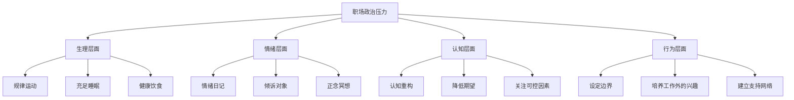

## 七、职场政治中的自我保护

职场政治是一场没有硝烟的持久战。你可能不主动参与博弈，但你无法退出这场游戏——只要你在组织中工作，你就是棋盘上的一枚棋子。自我保护不是懦弱，而是一种战略性的生存智慧。它让你在复杂的组织环境中保全实力、积累资本，等待属于自己的时机。

本节从**声誉建设、信息防护、危机应对、法律意识、心理韧性**五个维度，系统梳理职场自我保护的完整方法论。

### 7.1 建立坚不可摧的职业声誉

声誉是你在职场中最重要的无形资产。它决定了别人在你不在场时如何谈论你、决策者在权衡人选时如何评估你、以及在危机发生时有多少人愿意站出来为你说话。

#### 7.1.1 声誉的四个支柱

| 支柱 | 定义 | 具体行为 | 反面行为 |
|------|------|----------|----------|
| **一致性** | 言行一致，表里如一 | 承诺的事情无论大小都兑现；公开场合和私下表达的立场一致 | 当面一套背后一套；对不同人说不同版本的话 |
| **专业性** | 用能力而非关系获取地位 | 交付高质量的工作成果；对领域知识有深度理解；遇到问题先找方案再汇报 | 遇到难题就推给他人；只做表面文章不深入本质 |
| **可靠性** | 值得托付和信赖 | 关键时刻能扛事；deadline之前不掉链子；信息传递准确无误 | 经常迟到、延期、忘事；答应帮忙但最后不了了之 |
| **正直性** | 有底线有原则 | 拒绝参与不正当行为；看到不公正的事敢于发声（方式得当） | 为了利益出卖同事；明知有问题但选择沉默附和 |

#### 7.1.2 声誉的长期投资策略

声誉不是一天建成的，但可以一夜之间毁于一旦。以下策略帮助你持续投资声誉资本：

**日常行为管理**：

- **小事见人品**。帮忙打印文件时顺手整理好、会议结束时主动清理白板、借了同事的东西准时归还——这些微小的行为长期积累，塑造别人对你的基本判断。
- **控制情绪波动**。在压力下保持冷静的人，会被视为"靠得住"的人。发脾气、摔东西、阴阳怪气——这些行为会在同事心中留下难以磨灭的负面印象，远超你事后道歉所能弥补。
- **避免负面标签**。"那个爱抱怨的人""那个总迟到的人""那个抢功劳的人"——一旦被贴上这样的标签，你做的所有好事都会被自动过滤掉。心理学上称之为**首因效应**和**确认偏误**：人们倾向于用第一次形成的印象来解读后续行为。

**关键时刻的表现**：

- **项目危机时主动补位**。项目出了严重bug、客户突然发难、团队成员突然离职——这些时刻是展示担当的最佳时机。平时表现80分的人，在危机时刻挺身而出，比平时表现95分但危机时消失的人，获得的信任更多。
- **功劳分享时先人后己**。项目成功后，公开感谢团队成员的贡献，把功劳归于集体。你的上级和同事都清楚谁是核心贡献者，主动谦让不会减少你的功劳，反而会增加你的声誉。
- **犯错时坦诚面对**。犯了错第一时间承认，说明原因，提出补救方案。试图掩盖错误，最终被发现的后果远远严重于错误本身。

#### 7.1.3 声誉修复的策略

如果声誉已经受损，可以采取以下修复策略：

1. **承认问题**：不要试图辩解或否认，直接承认"我之前的做法确实有不妥之处"
2. **展示改变**：用持续的行为（不是一两次表态）来证明你已经改变
3. **找到支持者**：找到仍然信任你的人，通过他们的背书来重建信用
4. **耐心等待**：声誉修复需要时间，通常至少需要3-6个月的持续正面表现

> **案例**：某互联网公司的产品总监张晨，因为一次在全员会议上直接反驳了CEO的方案，被贴上"不懂政治""情商低"的标签。此后半年，他刻意在公开场合保持建设性表达方式——即使反对某个方案，也会先肯定对方的出发点，再用数据和逻辑提出替代方案，而不是直接否定。半年后，他在公司内部的形象从"刺头"转变成了"有想法、有方法的人"。

### 7.2 信息防护与文档化

职场中最危险的武器不是权力，而是信息。谁掌握了信息，谁就掌握了主动权。自我保护的核心之一，就是管理好信息的流向和留痕。

#### 7.2.1 为什么要文档化

职场中"口说无凭"是最常见的陷阱。以下是文档化能保护你的典型场景：

| 场景 | 无文档的后果 | 有文档的保护 |
|------|-------------|-------------|
| 上级口头交代任务但事后否认 | 你成了"自作主张"的人 | 有邮件/聊天记录证明是对方的指令 |
| 同事承诺配合但最后没做到 | 项目延期的责任落在你身上 | 有会议纪要和任务分配记录 |
| 会议中达成共识但有人反悔 | 你成了"理解错误"的人 | 有会议纪要和参会人确认 |
| 被指控工作失误 | 百口莫辩 | 有完整的工作日志和过程记录 |
| 绩效评估时上级质疑产出 | 无法量化自己的贡献 | 有阶段性成果记录和数据 |

#### 7.2.2 文档化的具体方法

**关键沟通留痕**：

- **重要口头沟通后补一封确认邮件**。格式："刚才我们沟通确认了XXX，下一步我将按照XXX方案推进，如有问题请回复确认。"这既是一种礼貌的确认，也是一种自我保护。
- **会议纪要在24小时内发出**。记录参会人、讨论要点、决策结果、后续行动项（负责人+截止日期）。发送时CC所有参会人。
- **任务接收时确认边界**。收到任务时，明确确认：目标是什么、交付标准是什么、截止时间是什么、需要什么资源支持。最好以文字形式确认。

**日常工作记录**：

```markdown
# 工作日志模板

## 日期：2026-06-25

### 今日完成
- [ ] 任务A：完成了XX模块的开发，已提交代码评审
- [ ] 任务B：与市场部确认了XX方案，对方反馈需要调整YY

### 待跟进
- 等待XX回复确认ZZ事项（已发送邮件，cc了领导）
- XX项目的截止日期是周五，目前进度70%，需要YY支持

### 关键沟通记录
- 14:00 与王总沟通，确认方案B为最终方案
- 16:00 收到客户反馈，对方对XX不满意，需要调整
```

**敏感信息管理**：

- **邮件分级**：普通邮件正常发送；敏感邮件加密或使用公司内部系统；涉及法律风险的内容咨询法务后再发送。
- **聊天记录**：微信/钉钉/飞书中的重要沟通，定期截图或导出备份。不要依赖单一平台存储关键信息。
- **文件版本**：重要文档使用版本管理，保留修改历史。Git不仅是代码工具，也是文档管理利器。

#### 7.2.3 文档化的分寸拿捏

文档化是保护手段，但如果做得过于明显，会让人觉得你"城府深""不信任同事"。以下是平衡的建议：

- **自然融入工作流**：把文档化当作工作习惯的一部分，而不是刻意为之。"我习惯发会议纪要方便大家回顾"比"我发邮件确认以防你反悔"好得多。
- **语气保持中性**：确认邮件的语气应该是协作性的，而不是防备性的。避免"特此确认""请签字确认"等法律感过强的措辞。
- **不需要记录一切**：只记录关键决策、重要承诺和可能产生争议的内容。日常闲聊不需要记录，否则你会活成一个"记录员"而不是"工作者"。

### 7.3 危机应对策略

#### 7.3.1 当被误解或指责时

被误解是职场中极其常见的危机。处理不当，小误会可以演变成大冲突。以下是系统的应对框架：

**第一步：控制情绪（黄金30秒）**

被指责或误解时，人的第一反应是愤怒或委屈。但任何在情绪驱动下的回应——无论是当场反驳、脸色变差、还是事后在微信群吐槽——几乎都会让情况恶化。

心理学研究表明，强烈情绪的生理反应通常在30秒内达到峰值，之后开始消退。给自己30秒的缓冲：
- 深呼吸三次
- 喝一口水
- 说一句"让我想想这个问题"来争取时间

**第二步：还原事实（而非立场）**

不要急于辩解"我不是那样的"，而是先搞清楚事实链：
- 发生了什么？（客观事实）
- 谁说了什么？（信息来源）
- 对方是怎么得出结论的？（推理过程）
- 我的信息和对方的信息有什么差异？（信息差在哪里）

**第三步：选择合适的回应方式**

| 情况 | 建议回应方式 | 示例 |
|------|-------------|------|
| 对方出于误解 | 私下沟通，补充对方缺失的信息 | "关于XX项目的情况，可能有些信息没有同步到你这边，我补充一下背景……" |
| 对方出于利益 | 用事实和数据说话，避免情绪化 | "我理解你的顾虑，这是项目进展的数据，我们看一下客观情况……" |
| 对方出于恶意 | 保持冷静，收集证据，必要时升级处理 | 不正面冲突，但保留所有证据，通过正式渠道解决 |
| 公开场合被指责 | 先接住，会后再处理 | "这个意见很好，我会后详细了解一下情况再跟你沟通。" |

**第四步：向上管理**

如果误解来自上级，处理方式需要更加谨慎：
- **不要公开反驳**。即使你是对的，公开反驳上级也会让对方下不来台。
- **私下用数据沟通**。选择一对一的时间，带着事实和数据去沟通，让上级自己得出结论。
- **给上级台阶下**。"可能是我的汇报不够清楚，导致了误解，我后续改进汇报方式。"这样既澄清了事实，又维护了上级的面子。

#### 7.3.2 当卷入派系斗争时

派系斗争是职场中最复杂的自我保护场景。详细策略已在"派系斗争中的沟通策略"一节中展开，此处聚焦于**自我保护的底线思维**：

**你的底线清单**：

1. **不做炮灰**。如果某个派系试图利用你去攻击另一方（比如让你传递负面信息、让你做"枪手"），坚决拒绝。"这件事我不太了解，建议直接沟通比较好。"
2. **不做双面人**。不要同时向两个派系示好、传递不同版本的信息。一旦被发现，你将失去所有人的信任。
3. **不做沉默的帮凶**。如果派系斗争涉及违法行为（如财务造假、利益输送），你有义务通过合规渠道举报。沉默不是自我保护，而是共犯。

**安全的沟通策略**：

立场表达公式：
"我对事不对人" + "我的出发点是把工作做好" + "具体建议是XXX"

示例：
"这个决策我觉得有一些风险点需要考虑（对事不对人），
主要是从项目交付的角度出发（工作导向），
建议我们可以先做一个小范围的试点验证（具体建议）。"

#### 7.3.3 当面临不公正待遇时

不公正待遇包括但不限于：被无故降薪、被排除在重要项目之外、被边缘化、被抢功劳、被恶意差评。以下是分层应对策略：

**第一层：直接沟通（适用于轻度问题）**

选择一对一的时间，以合作的姿态沟通：
- "我注意到最近几个重要项目我没有被纳入，想了解一下原因，看看我可以在哪些方面调整。"
- 不要上来就说"你不公平"，而是先了解情况，再表达感受。

**第二层：正式渠道（适用于中度问题）**

如果直接沟通无果：
- 整理完整的事实链和证据
- 通过HR或正式的申诉渠道反映
- 保持书面记录，避免仅口头沟通

**第三层：法律手段（适用于严重问题）**

如果涉及劳动权益侵害（如违法降薪、违法解除劳动合同、职场霸凌等）：
- 咨询专业劳动法律师
- 保留所有证据（邮件、聊天记录、录音——注意录音的合法性因地区而异）
- 通过劳动仲裁或法律诉讼维护权益

### 7.4 法律意识与合规边界

职场自我保护不能只靠人际关系技巧，还需要基本的法律意识。

#### 7.4.1 劳动合同的核心关注点

| 关注项 | 为什么重要 | 常见陷阱 |
|--------|-----------|---------|
| 岗位和职责描述 | 决定你能被要求做什么 | "以及领导安排的其他工作"过于宽泛 |
| 薪酬结构 | 底薪比例影响加班费、赔偿金基数 | 底薪很低+大量补贴/奖金的结构 |
| 竞业限制条款 | 离职后的就业自由 | 竞业补偿金过低或未约定 |
| 保密协议范围 | 影响离职后的信息自由 | 范围过宽，连行业常识都算保密 |
| 解除条件 | 决定你被辞退时的权益 | "末位淘汰""不胜任即辞退"等不合理条款 |

#### 7.4.2 职场中的常见法律风险

**知识产权归属**：
- 在工作中使用公司资源（电脑、时间、信息）创作的成果，通常归属公司
- 如果你想做个人项目（如副业、开源项目），确保不使用公司资源、不涉及公司业务领域、不违反竞业条款
- 建议在开始副业前，仔细阅读劳动合同中的知识产权条款

**信息安全义务**：
- 不要通过个人邮箱/网盘传输公司文件
- 不要在社交媒体上晒包含敏感信息的工作截图
- 离职时不要带走任何公司文件（即使是你自己创建的）

**职场性骚扰/霸凌的应对**：
- 第一时间保留证据（聊天记录、邮件、录音）
- 向HR正式投诉，要求书面回复
- 如果公司不处理或处理不力，向劳动监察部门或妇联举报

#### 7.4.3 离职场景的自我保护

离职是法律风险高发的场景：

1. **主动离职**：提前30天书面通知（试用期提前3天），保留通知的书面证据
2. **被辞退**：要求公司出具书面解除通知和解除理由；不要签署不理解的文件；经济补偿金按N+1计算（N为工作年限）
3. **竞业限制**：如果公司要求你签竞业协议，确认补偿金额（通常不低于离职前12个月平均工资的30%）和限制范围
4. **离职交接**：做好交接清单，双方签字确认，保留副本

### 7.5 心理韧性建设

职场政治带来的压力不仅是外部的，更是内部的。你可能面对不公正、被孤立、被误解——如果没有足够的心理韧性，这些经历会逐渐消磨你的职业热情和自信心。

#### 7.5.1 认知重构：从受害者到观察者

面对不公正对待时，人的第一反应是"为什么是我""太不公平了"——这是**受害者心态**。它会让你陷入愤怒和委屈的循环，消耗大量心理能量。

更健康的认知模式是**观察者心态**：
- "这个组织的权力结构是如何运作的？"
- "这个人的行为背后有什么利益驱动？"
- "在这个局势中，我有哪些选项？"

观察者心态不是冷漠，而是一种**战略性的情绪管理**——你允许自己感受到情绪，但不被情绪驱动行为。

#### 7.5.2 压力管理的四个层次



**生理层面**：长期压力会导致免疫力下降、失眠、胃肠问题。规律运动（每周3次以上、每次30分钟以上有氧运动）是对抗压力最有效的生理手段之一。

**情绪层面**：找一个信任的人（伴侣、好友、导师）定期倾诉。不需要对方给建议，仅仅是"被听见"本身就具有治愈作用。如果压力持续且严重，寻求专业心理咨询不丢人。

**认知层面**：练习"控制圈"思维——区分"我能控制的"和"我不能控制的"。你不能控制别人的行为、公司的决策、市场的变化，但你能控制自己的反应、自己的能力提升、自己的职业选择。

**行为层面**：培养工作之外的兴趣和社交圈。如果你的全部社交和成就感都来自职场，那么职场政治对你的打击将是毁灭性的。

#### 7.5.3 设定边界的能力

自我保护的高级形态不是被动防御，而是主动设定边界：

- **工作时间的边界**："非紧急情况，我下班后不回复工作消息。"——这条边界需要你用持续的行为来建立，而不是靠一次宣言。
- **任务量的边界**："我可以帮这个忙，但目前手上有A和B，如果接了C，哪个可以延后？"——这不是拒绝，而是让对方参与优先级决策。
- **人际互动的边界**："我不参与这类讨论。"——对于八卦、站队等话题，简单而坚定地划线，比含糊其辞更有效。

### 7.6 建立自我保护的预警系统

与其在危机发生后被动应对，不如提前建立一套预警系统，在问题萌芽阶段就识别和处理。

#### 7.6.1 职场风险信号清单

| 信号等级 | 具体表现 | 建议行动 |
|---------|---------|---------|
| **黄色预警** | 突然被排除在某些会议之外；收到来自上级的模糊负面反馈；同事对你的态度微妙变化 | 主动沟通了解情况；审视近期的言行是否有疏漏；加强与关键关系人的联系 |
| **橙色预警** | 被调离核心项目；绩效评估突然下降；被安排到边缘岗位 | 整理事实链和证据；与HR沟通了解原因；开始更新简历和拓展外部人脉 |
| **红色预警** | 被明确告知"不受欢迎"；收到书面的绩效改进通知（PIP）；工作资源被大幅削减 | 立即咨询劳动法律师；全面保留证据；开始积极寻找外部机会 |

#### 7.6.2 关系健康度定期检查

每个月花15分钟审视以下问题：

□ 我的上级最近对我的态度有没有变化？
□ 核心同事对我的态度有没有变化？
□ 我最近有没有什么言行可能引发误解？
□ 我是否被排除在了什么重要的信息圈之外？
□ 我最近的工作成果是否被公平地记录和认可？
□ 我手头有哪些"证据"能证明我的贡献？

如果有2个以上的答案让你不安，就需要立即采取行动——主动沟通、修复关系、或开始准备退路。

### 7.7 自我保护的误区与纠正

| 常见误区 | 为什么是错的 | 正确做法 |
|---------|-------------|---------|
| "只要做好工作就够了，不用管政治" | 工作成果需要被看见、被认可才能转化为职业资本 | 做好工作的同时，主动管理可见度和关系网络 |
| "低调做人就安全" | 过度低调等于透明，透明的人最容易被牺牲 | 保持适度的存在感，在关键时刻展示价值 |
| "忍一忍就过去了" | 持续的忍让会被解读为软弱，招来更多不公正 | 小事可以忍，原则问题必须表态 |
| "我有证据就不怕" | 职场不是法庭，赢了道理输了关系等于输了 | 证据是底线保障，但优先通过沟通和关系解决问题 |
| "站队才能生存" | 选错队的代价远大于不站队 | 建立多元的关系网络，而非依赖单一靠山 |
| "离职是失败" | 在毒性环境中死撑才是真正的失败 | 离职是战略撤退，是为了在更好的环境中发挥能力 |

> **核心要义**：职场自我保护的本质不是"战斗"或"逃避"，而是**清醒**——清醒地理解组织的权力结构，清醒地评估自己的处境和选项，清醒地选择行动策略。最强大的自我保护不是防御，而是让自己变得不可或缺——当你足够强大时，政治斗争很难真正伤到你。
