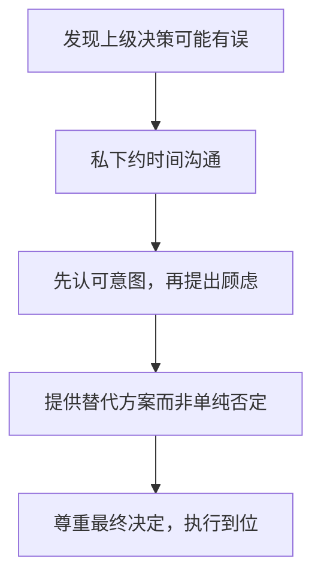

## 八、职场政治中的沟通禁忌

职场沟通中，有些话一旦说出口就无法收回，有些行为一旦做出就会被贴上标签。沟通禁忌不是"潜规则"，而是无数人用职业代价换来的经验总结。本章系统梳理职场政治中必须避开的沟通雷区，帮助你在复杂的组织环境中保护自己、维护关系、守住职业底线。

### 8.1 为什么沟通禁忌如此重要

#### 8.1.1 信息传播的不可控性

职场中的信息传播遵循一个残酷的规律：**你无法控制信息离开你嘴之后的走向**。

你以为的传播路径：
  你 → 信任的同事A → 结束

实际的传播路径：
  你 → 同事A → 同事A的密友B → B的午餐群 → 整个部门 → 当事人

一项针对500家企业的内部沟通研究显示：员工私下传递的负面信息，平均经过3.2次转手后到达当事人耳中，且每次转手都会发生15%-30%的信息扭曲。也就是说，你原本一句"我觉得老王那个方案有点保守"，传了三轮之后可能变成"小张说老王的方案根本不行"。

#### 8.1.2 标签效应与信任损耗

职场中一旦被贴上"爱说闲话""不靠谱""站队明显"的标签，这个标签的半衰期极长。心理学中的**首因效应**和**证实偏差**会让人倾向于用第一次印象来解读你后续的所有行为：

| 标签类型 | 形成速度 | 消除难度 | 影响范围 |
|---------|---------|---------|---------|
| 爱传八卦 | 1-2次行为 | 6-12个月 | 跨部门传播 |
| 不尊重上级 | 1次公开行为 | 难以完全消除 | 直接影响晋升 |
| 站队明显 | 2-3次表态 | 组织变动前持续 | 被对立面针对 |
| 泄露隐私 | 1次行为 | 几乎不可逆 | 信任崩塌 |

### 8.2 绝对不能做的事：六大沟通红线

#### 8.2.1 不要在背后评价同事的能力和人品

**为什么这是红线：** 背后评价的本质是"信息不对称下的单方面判断"，而职场中没有人能掌握全貌。你基于片面信息做出的评价，一旦传开就会变成"定性"。

**真实场景：**
- 你在茶水间跟同事说"老李做项目总是拖后腿"——你不知道老李同时在支持三个项目，其中一个是你没参与的核心项目
- 你跟关系好的同事吐槽"新来的小王什么都不懂"——你不知道小王是CTO亲自招进来的人

**正确做法：**

当你对某人有负面感受时，区分"事实"和"评价"：

❌ 评价型（危险）："老李这个人不靠谱"
✅ 事实型（安全）："上次项目中，老李负责的模块延迟了三天交付"

❌ 评价型（危险）："小王能力不行"
✅ 事实型（安全）："小王目前还在熟悉业务流程，我建议前期多给一些指导"

**黄金法则：** 只说你能当着当事人面说的话。如果你的话当面说不出口，背后更不能说。

#### 8.2.2 不要公开挑战上级的权威

**为什么这是红线：** 组织的本质是权力结构。公开挑战上级，即使你在事实上是对的，在政治上也是错的。上级需要维护团队中的权威感才能有效管理，公开挑战会让上级陷入"不反击就失去威信"的困境——而上级几乎always选择反击。

**公开挑战的具体形式（都要避免）：**

1. **会议上直接否定上级的方案**："这个方案我觉得行不通"
2. **在群里纠正上级的错误**："领导，你这个数据不对"
3. **当着下属面质疑上级的决策**："上面又拍脑袋了"
4. **通过转发文章/截图暗示上级判断失误**

**正确做法——异议的四步私下沟通法：**

**话术模板：**

第一步（认可意图）：
"领导，我理解您推动这个方案是为了提升效率，这个方向我觉得是对的。"

第二步（提出顾虑）：
"我有一个担心想跟您私下聊聊——从技术角度看，当前的基础设施可能
支撑不了这个方案的并发量，如果上线后出问题，影响会比较大。"

第三步（提供替代方案）：
"我整理了一个分阶段的方案，第一期先用轻量级方案验证可行性，
第二期再全面升级。我做了一份对比分析，您看是否方便过一下？"

#### 8.2.3 不要参与负面八卦和小团体议论

**为什么这是红线：** 负面八卦的本质是"用贬低他人来建立群体认同"。短期看，参与八卦能让你感觉"融入了圈子"；长期看，你会被定义为"这个圈子的人"，一旦圈子失势，你也跟着遭殃。

**八卦的三个层次和风险等级：**

| 层次 | 典型表现 | 风险等级 | 后果 |
|------|---------|---------|------|
| 信息交换型 | "听说市场部要重组" | 低 | 无害，但容易滑向更高层次 |
| 观点评判型 | "我觉得老陈能力一般" | 中 | 被贴标签，信息可能传开 |
| 恶意攻击型 | "他就是靠关系上来的" | 高 | 涉及诽谤，可能承担法律责任 |

**如何在不得罪人的情况下退出八卦：**

场景：午饭时同事开始八卦另一个同事

❌ 直接走开——显得不合群，可能被孤立
❌ 热情参与——留下把柄，标签风险

✅ 中性转移话题：
   "对了，你们有没有看到昨天产品部发的那个新功能提案？"

✅ 给出中立回应后转移：
   "每个人做事风格不同吧。哎，下午那个会你们准备好了吗？"

✅ 轻描淡写+物理离开：
   "哈哈，我先去接杯水，你们聊。"

#### 8.2.4 不要泄露他人告知你的私密信息

**为什么这是红线：** 信任是职场中最稀缺的资源，一旦破坏几乎无法修复。当别人向你倾诉私密信息时，他们是在用信任"投资"这段关系。你泄露一次，不仅失去这个人，还会连带失去所有知道这件事的人的信任。

**常见的泄露形式（很多人意识不到）：**

1. **转述型泄露**："小陈跟我说他打算跳槽了"——即使你是出于关心
2. **暗示型泄露**："最近可能会有人事变动，具体我不能说"——比直说更具杀伤力，因为引发猜测
3. **场景型泄露**：在非私密场合讨论他人的私密话题，比如在工位上聊"老王离婚的事"
4. **匿名型泄露**："我有个朋友遇到个事……"——职场圈子太小，一猜就中

**处理原则——"保险箱原则"：**

别人告诉你的私密信息，放进你脑中的"保险箱"，钥匙只有你一个人有。即使当事人自己公开了，你也应该后于当事人表态，而不是主动去传播。

#### 8.2.5 不要在情绪激动时做任何书面沟通

**为什么这是红线：** 书面沟通（邮件、IM、文档评论）有三个致命特征——**可截图、可转发、可留档**。口头说的话可以否认、可以模糊、可以事后解释，但白纸黑字的东西没有回旋余地。

**高危场景清单：**

- 刚被批评后回复邮件——容易带情绪措辞
- 对接人反复出错后在群里发飙——截图广泛传播
- 项目出了问题后写复盘邮件——甩锅痕迹明显
- 对上级不满时发朋友圈/微博——被同事看到

**24小时冷静法则：**

当你感到愤怒、委屈、不甘时：

1. 把要说的话写在一个私人文档里（不要写在邮件/IM里）
2. 关掉这个文档，去做别的事
3. 24小时后重新打开这个文档
4. 问自己：这段话如果被截图发到全公司群，我能接受吗？
5. 如果答案是否，重写；如果答案是"看情况"，删掉重写

#### 8.2.6 不要轻易暴露你的真实政治立场和派系倾向

**为什么这是红线：** 组织中的派系关系是动态变化的。今天的弱势方可能是明天的强势方，今天的核心圈子可能是明天被清洗的对象。过早、过明确地暴露立场，会让自己失去回旋空间。

**"模糊立场"的沟通技巧：**

场景：两位领导意见不合，有人来试探你的立场

❌ "我支持张总的想法"——得罪李总
❌ "我觉得两边都有道理"——两边都不信任你
❌ "我无所谓，听领导安排"——显得没主见

✅ "这个事情我还在思考，我更关心的是怎么把项目做好。
    两位领导的出发点都是为了项目，具体方案上可能侧重点不同。
    我先把手头的技术评估做完，到时候看数据说话。"

### 8.3 需要谨慎处理的五大场景

#### 8.3.1 当被问及对某人的看法时

这是职场中最常见的试探性问题，提问者可能有各种目的：收集情报、拉你站队、甚至设套。

**三步防御法：**

第一步：确认对方的真实意图
  "你问这个是有什么具体的事情需要了解吗？"

第二步：只陈述可验证的事实，不做主观评价
  "我和他合作过两个项目，A项目他负责的部分按时交付了，
   B项目有一些延期，主要是因为需求变更比较频繁。"

第三步：以发展性的眼光结尾
  "总体来说他在成长中，上次那个技术分享做得挺好的。"

**评价他人的安全框架：**

┌─────────────────────────────────────────────┐
│           安全评价框架                        │
├─────────────────────────────────────────────┤
│ ✅ 安全区域：                                │
│   • 公开场合展示的能力（会议表现、公开演讲）    │
│   • 有据可查的工作成果（项目交付、数据指标）    │
│   • 正面的、具体的优点                        │
│                                             │
│ ⚠️ 灰色区域（谨慎）：                        │
│   • 工作风格差异（可能被解读为否定）           │
│   • 能力短板（除非你是直接上级做绩效沟通）      │
│   • 性格特点（容易被贴标签）                   │
│                                             │
│ ❌ 禁区：                                    │
│   • 人品判断                                 │
│   • 私生活                                   │
│   • 与他人的关系                              │
│   • 未经证实的传闻                            │
└─────────────────────────────────────────────┘

#### 8.3.2 当被要求选择立场时

职场中经常出现"二选一"的局面——两个方案、两位领导、两个部门。直接选边站会让你成为另一方的靶子。

**"第三选择"沟通法：**

不要在对方给定的选项中选择，而是提出更高的目标维度：

模板："我理解A方案和B方案各自的出发点。如果我们的核心目标是X，
那我建议我们可以看看是否有结合两者优势的方案C。
具体来说，A方案的[优点]加上B方案的[优点]，
可能在[核心目标]上效果更好。我来做个对比分析？"

**不同场景下的回应策略：**

| 场景 | 风险 | 回应策略 |
|------|------|---------|
| 两位领导方案冲突 | 选哪个都得罪人 | 提供数据驱动的评估，让数据说话 |
| 两个部门互相甩锅 | 被卷入部门冲突 | 聚焦问题本身，提出跨部门协作方案 |
| 新老领导交接期 | 新旧势力交替风险 | 对两边都保持专业态度，不做比较 |
| 内部竞聘 | 选边后输了很被动 | 保持中立，强调"无论谁上我都全力配合" |

#### 8.3.3 当面对不公正待遇时

不公正待遇是职场中最考验沟通能力的场景。反应过激会被认为"情绪化"，忍气吞声会被认为"好欺负"。

**分层应对策略：**

第一层：确认是否真的不公正
  → 是所有同级别的人都这样，还是只针对你？
  → 是否有你不知道的信息（如组织调整、预算限制）？
  → 有没有可能是误解？

第二层：收集证据和事实
  → 保留相关的邮件、会议记录、工作成果
  → 找到可以佐证的第三方（不是"帮你说好话"的人，而是"能证明事实"的人）
  → 对比同级别同事的待遇（客观数据，不是感觉）

第三层：选择合适的沟通渠道
  → 优先：与直接上级一对一沟通
  → 次选：通过HR或正式申诉渠道
  → 最后：越级沟通（代价最大，慎用）

第四层：沟通时的话术
  → 聚焦事实和影响，不做人格攻击
  → 表达感受而非指控
  → 提出期望而非要求

**话术示例——与上级谈不公正待遇：**

❌ 指控型："您分配项目的时候不公平，好的项目都给了老刘。"

✅ 事实+感受+期望型：
   "领导，我想跟您聊一下关于项目分配的事情。
   过去三个季度，我主要接手的是维护类项目，
   新建项目更多分配给了老刘和小陈。
   我理解您可能有全盘考虑，但从我的角度，
   我担心长期做维护类项目会影响我的成长空间。
   我希望下一季度能有机会参与新建项目，
   我觉得以我的经验可以承担[具体项目]的核心模块。
   您觉得呢？"

#### 8.3.4 当你的上级在公开场合批评你时

这是一个高压力场景，很多人的本能反应是反驳或沉默——两种都不理想。

**当场回应的"三不原则"：**

- **不反驳**：公开反驳只会让局面更难看，上级会加大批评力度
- **不沉默**：完全沉默可能被解读为"不服气"或"认了"
- **不道歉过度**：过度道歉反而强化了问题的严重性

**最佳回应模板：**

"谢谢领导指出，这个问题我确实需要改进。
 会后我整理一个改进方案跟您对齐。"

然后在会后私下沟通，补充说明情况、询问具体改进方向。

#### 8.3.5 当你发现公司或上级的重大问题时

发现问题容易，沟通问题才难。举报或揭发的时机、方式、渠道选错了，不仅问题没解决，自己反而成了"麻烦制造者"。

**举报/揭发的风险评估矩阵：**

                    影响范围
                小           大
           ┌──────────┬──────────┐
     低    │ 可以内部 │ 通过正式 │
  证据     │ 沟通解决 │ 渠道上报 │
  强度     ├──────────┼──────────┤
     高    │ 建议先   │ 必须走   │
           │ 私下沟通 │ 正式渠道 │
           └──────────┴──────────┘

**安全揭发的检查清单：**

- [ ] 你是否掌握了确凿证据（不是听说、不是猜测）？
- [ ] 你是否尝试过在更小范围内解决？
- [ ] 你是否了解公司的正式举报渠道和保护政策？
- [ ] 你是否做好了最坏情况的心理准备（打击报复）？
- [ ] 你是否咨询过可信赖的mentor或外部律师？
- [ ] 你的举报动机是否纯粹（为了纠正问题，而非个人恩怨）？

### 8.4 数字时代的沟通禁忌新维度

#### 8.4.1 企业IM（钉钉/飞书/企业微信）的雷区

企业IM的特殊性在于：**记录永久保存、可被管理员查看、消息可被转发截图**。

**高频踩雷行为：**

| 行为 | 风险 | 为什么危险 |
|------|------|-----------|
| 在工作群吐槽公司决策 | 高 | 群聊记录可被HR调取 |
| 私聊中讨论敏感话题 | 中高 | 对方可能截图转发 |
| 用表情包讽刺同事/上级 | 中 | 截图后缺乏语境，被放大解读 |
| 在群里抢红包后消失 | 低 | 潜规则：抢了红包要互动 |
| 已读不回领导消息 | 中 | 多次已读不回会被视为态度问题 |

**IM沟通的安全守则：**

1. 涉及评价性内容，永远不要打字——打电话或面谈
2. 涉及争议性话题，先想"如果截图发到全员群我能不能接受"
3. 不在任何IM上讨论离职、薪资、跳槽话题
4. 群聊中不要做第一个表态的人（尤其是敏感话题）

#### 8.4.2 朋友圈/社交媒体的职场政治

**危险行为清单：**

- 发朋友圈吐槽加班、吐槽工作——可能被领导看到
- 转发竞对公司的好消息——被解读为"身在曹营心在汉"
- 炫耀收入或offer——引发同事嫉妒或HR关注
- 在朋友圈与同事公开争论——私人矛盾公共化
- 发表与公司价值观相悖的观点——被截图作为"证据"

**安全策略：**

方案一（最安全）：朋友圈对同事分组不可见
方案二（较安全）：只发积极正面、无争议的内容
方案三（最灵活）：维护两个微信号——工作号和私人号

#### 8.4.3 邮件的政治学

邮件不仅是沟通工具，更是**政治工具**。抄送谁、不抄送谁、什么时候发、措辞如何，都传递着政治信号。

**邮件中的隐含信号：**

| 操作 | 隐含信号 | 适用场景 |
|------|---------|---------|
| 抄送你的上级 | "这件事我在让领导知道进展" | 跨部门协作、争议事项 |
| 抄送对方的上级 | "这件事你最好重视" | 对方不配合时的升级信号 |
| 密送某人 | "我在悄悄拉第三方知情" | 需要证人但不想暴露 |
| 回复时删除抄送人 | "我想缩小知情人范围" | 敏感话题收敛讨论范围 |
| 全员回复 | "我要让所有人看到" | 澄清事实、自保 |

### 8.5 常见误区与纠正

#### 误区一："我跟他说得很清楚，这只是私下聊天"

**现实：** 职场中没有"私下"。任何你不在当事人面前说的话，都有50%以上的概率传到当事人耳中。"私下"只是你的自我安慰。

**纠正：** 把每一次职场对话都当作可能被录音的对话来对待。

#### 误区二："我只是实话实说，有什么问题？"

**现实：** 实话和该说的话是两回事。"老王确实能力不行"可能是你的观察，但公开说出来就是政治自杀。职场沟通的目标不是"说真话"，而是"用可接受的方式达成可接受的结果"。

**纠正：** 真话要分场合、分对象、分方式说。同样的事实，"老王的方案在数据验证环节需要加强"比"老王的能力不行"安全一百倍。

#### 误区三："反正我没恶意，别人怎么想是他们的事"

**现实：** 沟通的效果取决于接收方的理解，而不是发送方的意图。你说"我只是开个玩笑"，但对方已经受伤了——你的"无恶意"不能消除伤害。

**纠正：** 对自己说的话负责，包括考虑接收方的感受和可能的解读。

#### 误区四："不站队就不会得罪人"

**现实：** 完全不表态有时比表态更危险。在需要支持的时刻保持沉默，会让你失去所有人的信任——"这人靠不住，关键时刻指望不上"。

**纠正：** 不站队≠不表态。你可以在具体事务上表态支持，但不在人事关系上选边站。"我支持这个方案因为它数据更充分"——这是事务表态，不是政治站队。

#### 误区五："有问题直接说就好，不用拐弯抹角"

**现实：** 职场中"直接说"往往等于"不给面子"。中国文化语境下，沟通效果 = 信息内容 × 表达方式。方式不对，再正确的内容也会被拒绝。

**纠正：** 学会"建设性表达"——用"我觉得可以怎么做得更好"替代"你这样做有问题"。

### 8.6 职场沟通禁忌的自检工具

#### 日常沟通自检清单

每次进行敏感沟通前，用以下清单自检：

□ 内容检查
  - 这段话涉及评价他人吗？→ 转为陈述事实
  - 这段话涉及敏感信息吗？→ 确认是否有权限分享
  - 这段话涉及立场选择吗？→ 重新措辞，保持灵活性

□ 渠道检查
  - 这件事适合打字沟通吗？→ 敏感内容改为面谈或电话
  - 抄送/密送的人合适吗？→ 多一个人多一份风险
  - 发送时机合适吗？→ 情绪激动时暂缓

□ 后果检查
  - 如果这段话被截图发到全员群，我能接受吗？
  - 如果当事人就在我身后，我还敢说吗？
  - 三年后回看这段沟通，我会后悔吗？

#### 危机处理快速评估

当你意识到自己可能已经踩雷时：

第一步：评估影响面
  → 知道的人有多少？信息还在传播吗？

第二步：止损而非补救
  → 不要试图"解释"或"澄清"，往往越描越黑
  → 如果是IM上的失言，可以撤回（但要知道对方可能已截图）

第三步：主动但低调地修复关系
  → 私下找当事人坦诚沟通
  → 承认不当，不找借口
  → 用后续行动证明改变，而非用语言承诺

第四步：吸取教训，建立防线
  → 复盘踩雷的触发条件
  → 设置自己的"红线提醒"

### 8.7 进阶：高手的政治沟通艺术

#### 8.7.1 "沉默表态"技术

高手从不明确表态，但每个人都知道他的立场。这是通过**选择性沉默**和**选择性发声**来实现的：

- 在A方案讨论时保持沉默——暗示"我不太认同"
- 在B方案讨论时积极发言——暗示"我支持这个方向"
- 在两者之间不做对比——保持"我只是就事论事"的形象

#### 8.7.2 "借力打力"话术

当有人试图把你拉入政治漩涡时，借用对方的话来保护自己：

对方："你觉得张总和李总谁说得对？"

❌ "我觉得张总说得对"——得罪李总
❌ "我不方便评价"——显得胆小

✅ "你刚才提的那个观点挺有意思的——你更关注的是方案A还是方案B的
    可行性？从技术角度我倒是可以分析一下。"
    → 把"站队问题"转化为"技术讨论"

#### 8.7.3 建立"安全沟通网络"

不是所有人都值得你进行深度沟通。建立一个分层的沟通网络：

核心层（2-3人）：可以讨论敏感话题、获取政治情报
  → 标准：认识2年以上，有过利益考验，从未泄露你的信息

中间层（5-8人）：可以讨论工作问题，但不涉及人事政治
  → 标准：合作过项目，工作上有互信基础

外围层（其他所有人）：只进行工作必要的沟通
  → 标准：所有人默认在此层，需要时间验证才能升级

### 8.8 本章小结

职场政治中的沟通禁忌，本质上是一套**风险管理机制**。遵守这些禁忌不是让你变得虚伪，而是让你在复杂的组织环境中保护自己的职业发展空间。

**核心记忆点：**

1. **背后评价是最大的雷区**——只说你能当面说的话
2. **公开挑战权威是政治自杀**——异议要私下表达
3. **八卦是糖衣毒药**——短期融入圈子，长期损害信任
4. **书面沟通没有"私下"**——所有打字内容都可能被截图
5. **不站队不等于不表态**——在事务上积极，在人事上中立
6. **情绪激动时不要沟通**——24小时冷静法则
7. **信任一旦破坏无法修复**——对他人隐私保持绝对保密

> **记住：职场中最高级的沟通能力，不是会说什么，而是知道什么不该说。**
