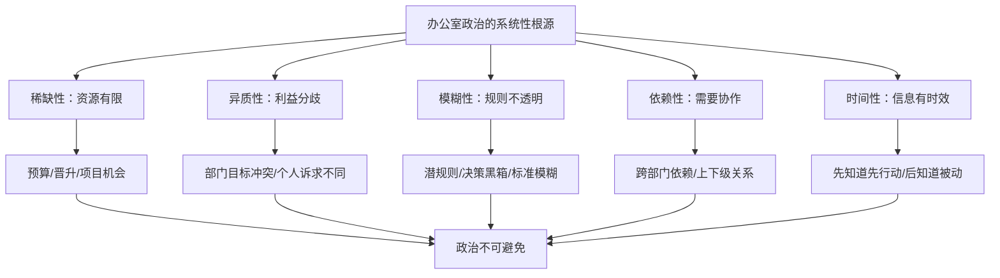
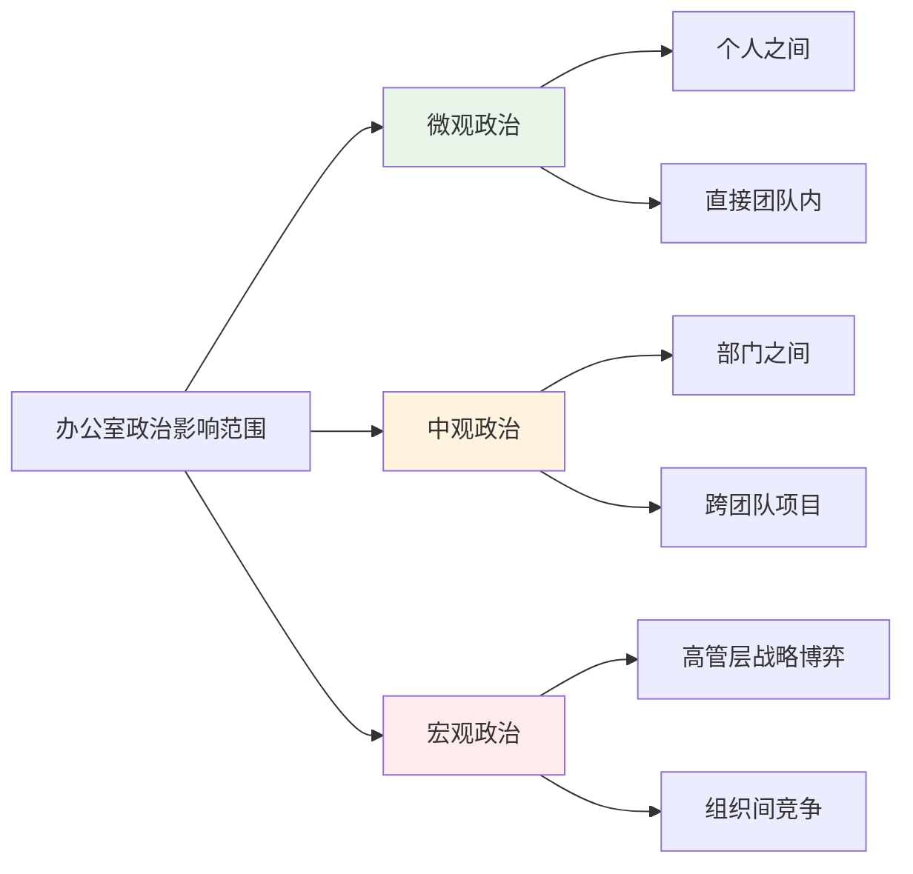
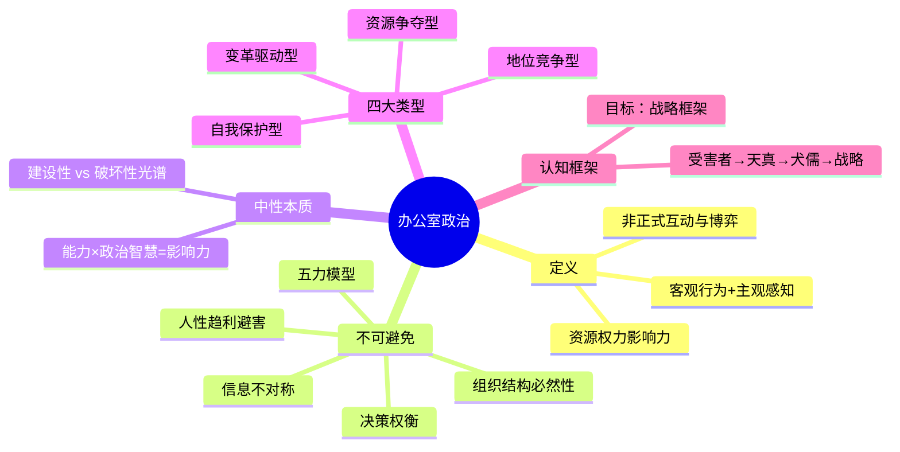

## 一、什么是办公室政治

> "你不必喜欢政治，但你必须理解政治。不理解政治的人，不是被政治忽略，而是被政治碾压。"
> —— 哈佛商学院教授 Rosabeth Moss Kanter

办公室政治是职场中最被误解、最被妖魔化、也最不可回避的现象。多数职场人对"政治"的第一反应是排斥——他们将其等同于勾心斗角、拉帮结派、溜须拍马。这种认知偏差本身就是一种政治盲区，而这种盲区的代价往往是：升职时被忽略、项目资源被抢走、功劳被他人收割、离职时才发现自己一直在"裸泳"。

本节将从根本上重新定义办公室政治，建立正确的认知框架，为后续章节的实操方法论奠定基础。

### 1.1 办公室政治的学术定义

#### 1.1.1 组织行为学视角

办公室政治（Office Politics），学术界更准确的表述是**组织政治行为（Organizational Political Behavior）**。

Pfeffer（1992）在《Managing with Power》中给出的经典定义：**组织政治是指那些不被组织正式权威体系认可的、旨在影响组织决策和资源分配的行为。**

Mintzberg（1983）在《Power In and Around Organizations》中将其定义为：**个体或群体通过权力和影响力的非正式运用，来获取其在正式渠道中无法获得的利益。**

Ferris et al.（1989）从感知角度定义：**组织成员对工作环境中他人自利行为程度的主观认知。**

综合以上权威定义，我们可以提炼出一个更完整的理解：

**办公室政治是组织成员为了获取、分配和维护资源、权力和影响力而进行的非正式互动和博弈。它既是一种客观存在的行为模式，也是一种主观的组织感知。**

#### 1.1.2 三个核心要素

这个定义包含三个关键要素，缺一不可：

**要素一：非正式性**

办公室政治发生在正式的组织架构和流程之外。它存在于茶水间的对话中、会议室的眼神交流中、午餐时的闲聊中、以及那些"不方便写在邮件里"的沟通中。

正式流程告诉你"应该怎么做"，政治现实告诉你"实际怎么做"。两者的差距，就是政治存在的空间。

举个例子：公司规定晋升需要经过"直属上级推荐→HR审核→评审委员会投票"的正式流程。但在实际操作中，谁进入候选名单、评审委员会成员的倾向、投票前的私下沟通——这些才是决定结果的真正力量。正式流程只是为已经达成的政治共识赋予合法性。

**要素二：资源导向**

政治行为的根本驱动力是资源。在组织语境下，"资源"包括：

| 资源类型 | 具体内容 | 稀缺程度 |
|---------|---------|---------|
| 财务资源 | 预算、奖金、加薪、股权 | 高 |
| 职位资源 | 晋升机会、头衔、汇报关系 | 极高 |
| 项目资源 | 优质项目分配、核心业务参与权 | 高 |
| 信息资源 | 战略方向、高层动向、行业情报 | 中高 |
| 关系资源 | 高层人脉、跨部门合作、外部关系 | 中 |
| 时间资源 | 工作节奏掌控、休假、弹性安排 | 中低 |
| 认可资源 | 表彰、曝光机会、代表团队发言 | 中 |
| 发展资源 | 培训机会、轮岗、导师指导 | 中 |

资源总是有限的，而人们对资源的需求总是无限的。这种**稀缺性**是政治存在的根本经济学原因——当蛋糕不够大、且切法不透明时，切蛋糕的过程必然充满博弈。

**要素三：权力博弈**

政治行为的核心是权力——谁有权决定资源的分配？谁有能力影响决策？谁在组织中有发言权？

权力不等于职位。一个没有管理头衔但掌握关键技术的工程师，可能比他的总监拥有更大的实际影响力。一个入职不久但与CEO有校友关系的新人，可能比工作十年的老员工获得更多关注。理解权力的真实分布——而非组织架构图上的正式分布——是理解办公室政治的关键。

### 1.2 为什么职场政治不可避免

很多人希望"远离政治，专心做事"。这种想法可以理解，但在现实中几乎不可能实现。不是因为你"不够好"或"不够努力"，而是因为政治是组织运作的底层逻辑。

#### 1.2.1 组织的本质是权力结构

任何组织都有层级、有分工、有资源分配。只要存在层级和资源差异，就必然存在利益博弈。

从组织理论的角度看，这是**结构必然性**。Weber（1947）的官僚制理论指出，正式组织通过层级结构实现协调，但层级本身就创造了权力差异。有权力差异的地方，就有围绕权力的博弈——这是组织的内在属性，不是可以"取消"的外在干扰。

即使在一个完全扁平化的组织中——比如一家10人创业公司——依然存在"谁的声音更大"、"谁的方案被采纳"、"谁负责与投资人沟通"等非正式权力分配问题。只要资源有限、决策需要权衡，政治就不会消失，它只是换了一种形态。

#### 1.2.2 人的本性是趋利避害

人们会本能地为自己和自己所在的群体争取更多资源。这不是道德问题，而是人类进化形成的生存本能。

社会心理学中的**社会认同理论（Social Identity Theory, Tajfel & Turner, 1979）** 指出，人类天然倾向于将自己归入某个群体（内群体），并对内群体成员给予偏好，对外群体成员产生偏见。在组织中，这就表现为部门之间的资源争夺、派系之间的影响力竞争。

进化心理学进一步解释：人类在资源竞争中发展出复杂的联盟策略、信息操控能力和声誉管理机制。这些"硬件"深植于我们的大脑，不会因为我们穿上西装走进写字楼就自动关闭。

#### 1.2.3 信息不对称是常态

在组织中，信息就是权力。掌握更多信息的人天然拥有更大的影响力，而人们会本能地利用信息优势来为自己谋利。

信息不对称体现在多个层面：

- **上下级之间**：上级掌握战略方向和预算信息，下级掌握一线执行和客户反馈。双方都有对方需要的信息，也都有选择性分享信息的动机。
- **跨部门之间**：每个部门对自己领域的了解远超其他部门，这种信息壁垒既是协作的障碍，也是政治操作的空间。
- **正式与非正式渠道**：很多关键信息不会出现在正式的会议纪要或邮件中，而是通过走廊对话、午餐闲聊、私下电话流通。掌握非正式信息渠道的人，往往比只依赖正式渠道的人更早知道"即将发生什么"。

信息不对称的本质是：**知道的越早、越多、越准确的人，在决策博弈中的位置越有利。** 这种优势不会通过"消除信息不对称"来解决——因为分享信息本身就是一个政治行为（我为什么要告诉你？告诉你对我有什么好处？）。

#### 1.2.4 决策永远涉及权衡

组织中的决策很少是"纯理性"的。预算分配、人事任命、项目优先级等决策，都涉及多方利益的权衡和博弈。

Herbert Simon 的**有限理性理论（Bounded Rationality）** 告诉我们：决策者不可能拥有完美信息，也不可能计算出最优解。他们只能在有限的信息和认知能力下做出"足够好"的决策。而"足够好"的标准，对不同利益方来说是不一样的。

当理性分析无法给出唯一答案时——比如"应该先做A项目还是B项目"、"应该提拔张三还是李四"——最终的决定往往取决于：

- 谁的声音被听到了（影响力）
- 谁的论据更有说服力（沟通能力）
- 谁和决策者关系更近（信任关系）
- 谁的方案风险更低或收益更高（理性分析）
- 组织当前最紧迫的需求是什么（情境因素）

前三个因素，正是政治的核心领域。

#### 1.2.5 五力模型：办公室政治的系统性根源

我们可以用一个更系统的框架来理解办公室政治的根源：

这五个因素同时存在于任何组织中，且无法被完全消除。它们共同构成了政治存在的系统性基础。理解这一点的意义在于：**政治不是某些"坏人"制造的问题，而是组织运作的结构性副产品。** 责怪政治存在，就像责怪重力存在一样无意义——你需要做的是学会在重力下行走，而不是期待重力消失。

### 1.3 政治≠权术：重新理解"政治"这个词

一个重要的认知澄清：**政治本身是中性的，就像金钱是中性的一样。关键在于你如何使用它。**

中文语境中"政治"一词常常带有负面联想——阴谋、权术、尔虞我诈。这种联想并非完全没有道理（历史和文学作品中充满了这样的叙事），但它严重窄化了我们对政治的理解，导致很多人把"不参与政治"当成了一种道德优越感。

实际上，政治行为是一个从建设性到破坏性的连续光谱：

| 维度 | 建设性政治 | 中性政治 | 破坏性政治 |
|-----|-----------|---------|-----------|
| 核心动机 | 组织利益优先，兼顾个人发展 | 组织与个人利益并重 | 个人利益至上 |
| 影响方式 | 通过专业知识和洞见影响决策 | 通过关系和信息影响决策 | 通过操纵和欺骗影响决策 |
| 利益分配 | 寻求多方共赢的解决方案 | 在竞争中争取合理份额 | 只关心自己的利益 |
| 信息使用 | 分享有价值的信息，建立信任 | 选择性分享信息 | 用谣言和误导影响判断 |
| 人际关系 | 建立真诚的信任和互惠关系 | 维护有用的关系网络 | 利用他人、过河拆桥 |
| 组织影响 | 增强组织整体效能 | 对组织效能影响中性 | 损害组织整体效能 |
| 长期结果 | 赢得声誉和持久影响力 | 短期获利，长期不稳定 | 短期获利，长期被孤立 |

**我们的目标不是远离政治，而是成为建设性政治的参与者。** 这意味着：

1. **接受政治的存在**：不抱怨、不回避，把它当作组织生活的常规背景。
2. **理解政治的规则**：就像理解交通规则一样——知道规则不是为了钻空子，而是为了安全高效地到达目的地。
3. **运用政治的能力**：用正当的方式建立影响力、推动议程、保护自己和团队的利益。
4. **保持政治的底线**：不为短期利益牺牲长期信誉，不在博弈中丢失原则。

### 1.4 办公室政治的四大类型

并非所有政治行为都长一个样。理解政治的类型分类，有助于你识别正在发生什么，以及如何应对。

#### 1.4.1 按行为动机分类

**（1）资源争夺型政治**

最常见的类型。当两个部门竞争同一笔预算、两个团队竞争同一个项目、两个候选人竞争同一个晋升名额时，资源争夺型政治就会出现。

特征：零和博弈思维（你多我就少）、竞争性强、容易升级为公开冲突。

典型场景：年终预算分配会议上，各部门负责人各显神通——有人用数据说话，有人打感情牌，有人暗示如果不给预算就会出大问题。

**（2）地位竞争型政治**

争夺的不是具体资源，而是影响力和话语权——谁的意见更重要、谁在领导心中的地位更高、谁在组织中有更大的"隐性权力"。

特征：竞争方式更隐蔽、更持久、更依赖关系网络。

典型场景：两位副总裁在CEO面前争夺对新业务方向的主导权。表面上是"战略分歧"的理性讨论，实际上是两个权力中心的影响力较量。

**（3）自我保护型政治**

不是为了获取更多，而是为了保护已有——保住自己的位置、防止他人侵犯自己的领地、避免成为替罪羊。

特征：防御性、反应式、往往与安全感缺失有关。

典型场景：一个中层管理者发现公司正在推动组织架构调整，可能合并他所在的部门。他开始积极向高层展示部门的价值，同时与其他部门建立联盟，以确保调整不会损害自己的位置。

**（4）变革驱动型政治**

为了推动组织变革——新战略、新流程、新文化——而进行的政治活动。变革者需要克服既得利益者的阻力，这必然涉及政治操作。

特征：目的具有正当性、手段可能涉及利益交换和联盟建设。

典型场景：一位新任CTO希望推动技术架构的全面升级，但这会影响现有团队的工作方式和部分人的既得利益。他需要先获得CEO的支持，再逐步争取关键人物的认同，最后才推动执行。

#### 1.4.2 按影响范围分类

- **微观政治**：你和同事之间、你和直属上级之间的日常互动。这是你最能直接感知和影响的层面。
- **中观政治**：部门之间的资源竞争、跨团队项目的协调博弈。你需要在这个层面建立跨部门影响力。
- **宏观政治**：高管层的战略方向之争、组织文化的塑造、并购重组等重大决策。对多数人来说，这个层面主要是"感知和适应"，而非"参与和影响"。

不同层级的员工，主要活跃在不同的政治层面：

| 层级 | 主要政治活动范围 | 典型政治行为 |
|-----|---------------|------------|
| 一线员工 | 微观 | 建立同事关系、争取好项目、管理上级期望 |
| 基层管理者 | 微观 + 中观 | 团队资源分配、跨团队协调、向上管理 |
| 中层管理者 | 中观 + 宏观 | 部门利益维护、战略方向影响力、高管关系 |
| 高管 | 宏观 | 战略决策博弈、权力结构设计、组织文化塑造 |

### 1.5 办公室政治的典型模式与信号

识别政治正在发生的能力，是政治智慧的第一步。以下是组织中常见的政治模式和它们的信号。

#### 1.5.1 常见政治模式

**模式一：联盟政治（Coalition Politics）**

多个利益相关方结成联盟，共同推动某个议程或抵制某个决策。

信号：
- 某些人在会议上的立场总是高度一致
- 重大决策前，相关方之间有大量私下沟通
- 某些人突然开始支持以前反对的观点

**模式二：信息政治（Information Politics）**

通过控制信息的获取、传播和解读来影响决策。

信号：
- 某些人总能"提前知道"即将发生的事
- 关键信息只在特定人群中流通
- 某些报告或数据被"包装"过，带有明显的倾向性

**模式三：形象政治（Image Politics）**

通过塑造特定的形象和叙事来影响他人的认知和决策。

信号：
- 某些人非常擅长在高管面前"表演"
- 项目成果的汇报方式远比实际成果更华丽
- 某些人被称为"高管红人"但实际贡献存疑

**模式四：程序政治（Procedural Politics）**

通过操控决策程序——比如会议议程、评审流程、投票规则——来影响结果。

信号：
- 某些议题总是被"安排"在会议的最后，导致时间不足无法深入讨论
- 评审标准突然调整，恰好对某一方有利
- 决策流程变得异常复杂或异常简单，取决于对谁有利

#### 1.5.2 政治信号检查清单

以下信号不一定意味着政治正在发生，但多个信号同时出现时，值得提高警觉：

- [ ] 突然有人对你的工作表现出异常的关注或热情
- [ ] 某些会议被取消、推迟或改变了参与者
- [ ] 你的上级开始问一些与你日常工作不太相关的问题
- [ ] 同事之间出现了以前没有的"小圈子"
- [ ] 组织架构或汇报关系有调整的传闻
- [ ] 某些人的行为模式突然改变（比如以前沉默的人开始积极发言）
- [ ] 关键决策的时间线被压缩或延长
- [ ] 有人开始主动"分享"对某人或某事的看法
- [ ] 你的信息来源突然减少或增加

### 1.6 办公室政治的心理学基础

理解政治行为背后的心理机制，有助于你更准确地解读他人的行为，也有助于你更好地管理自己的政治行为。

#### 1.6.1 归因偏差

人们对政治行为的解读深受归因偏差影响：
- **基本归因错误**：别人的政治行为被归因为"人品问题"（他就是个阴谋家），自己的政治行为被归因为"情境需要"（我只是在保护自己）。
- **自利偏差**：成功时归因于自己的能力，失败时归因于政治因素（"要不是有人搞鬼，我早就……"）。

认识到这种偏差的存在，有助于你更客观地评估政治局势，而不是简单地给人贴标签。

#### 1.6.2 认知框架

每个人的"政治认知框架"决定了他们如何解读同样的事件：

- **受害者框架**："所有人都在针对我。"——把所有不利事件都解读为政治迫害。
- **天真框架**："只要我把工作做好，一切都会好的。"——忽视政治因素的作用。
- **犬儒框架**："一切都是政治，没有公平可言。"——过度政治化，丧失对专业能力的信心。
- **战略框架**："政治是组织运作的一部分，我需要理解它、适应它、运用它。"——这是最健康也最有效的框架。

#### 1.6.3 情绪智力与政治敏感度

Goleman（1995）的情绪智力理论指出，高情绪智力的人在四个方面表现出色：自我意识、自我管理、社会意识、关系管理。这四个方面与政治敏感度高度相关：

- **自我意识**：知道自己在组织中的位置、优势和弱点
- **自我管理**：控制冲动反应，不在情绪激动时做政治决策
- **社会意识**：读懂组织中的权力动态和人际氛围
- **关系管理**：有效地建立联盟、处理冲突、影响他人

### 1.7 常见认知误区

在正式进入后续章节的实操方法论之前，有必要清除几个常见的认知误区：

**误区一："我不参与政治，政治就不会影响我"**

事实是：不参与政治的你，不是政治的旁观者，而是政治的**被动承受者**。当资源分配的决定做出时，没有人为不在场的人说话。你的沉默不会被解读为"专注工作"，而会被解读为"没有想法"或"不值得拉拢"。

**误区二："政治只存在于大公司"**

只要有两个人以上、有资源需要分配，就有政治。初创公司可能因为两个联合创始人之间的权力博弈而分裂。自由职业者需要管理客户关系中的政治动态。政治的形态随组织规模变化，但本质不变。

**误区三："搞政治的人都是能力不行的人"**

这是最危险的误区之一。它让你把"有能力"和"不懂政治"画上等号，从而为自己的政治盲区找到一个体面的借口。事实是，职场中最有影响力的人，往往是**能力强且政治智慧高**的人。两者不是替代关系，而是乘法关系——能力 × 政治智慧 = 实际影响力。

**误区四："政治手段都是不道德的"**

这取决于你使用什么样的手段。用专业知识说服决策者是政治行为，但不不道德。建立跨部门联盟推动有价值的项目是政治行为，但不不道德。选择性地分享信息以获得先发优势是政治行为，但未必不道德。政治行为的道德性取决于具体手段和意图，而非"政治"这个标签本身。

**误区五："等我到了管理层再考虑政治"**

恰恰相反。越早理解政治的运作逻辑，越早能够在职业发展中做出更明智的选择。在你成为管理者之前，你已经需要：管理与上级的关系、在团队中建立影响力、争取好的项目和资源、在绩效评估中被公正对待。这些都是政治技能。

### 1.8 本节核心要点

**一句话总结**：办公室政治是组织运作的底层操作系统。你可以不喜欢它，但你不能不理解它。理解它不是为了变得"世故"，而是为了在复杂环境中更有效地工作、更公平地获得回报、更清醒地做出选择。

接下来的章节，我们将从"是什么"转向"怎么做"——如何在保持原则的前提下，建立你的组织影响力。
