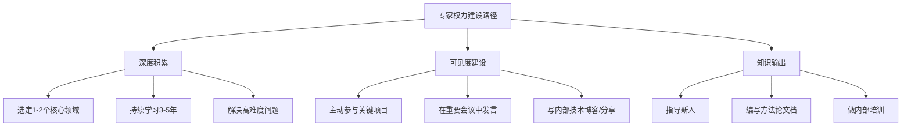
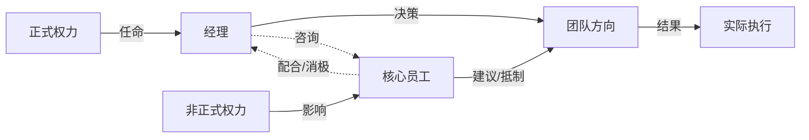

## 二、权力理论

理解权力是掌握职场政治的基石。权力本身是中性的——它是一种影响他人行为、获取资源、推动决策的能力。问题不在于有没有权力，而在于你是否理解权力的运作机制，以及你选择如何使用它。

本节从经典理论出发，系统梳理权力的来源、分类、动态变化规律，以及如何在实际工作中识别、获取和运用不同类型的权力。

### 2.1 权力的经典来源：弗伦奇-雷文模型

1959年，社会心理学家约翰·弗伦奇（John French）和伯特伦·雷文（Bertram Raven）发表了开创性论文《社会权力的基础》，将权力的来源系统性地划分为五种类型。此后雷文又补充了第六种——信息权力。这一模型至今仍是组织行为学中最广泛引用的权力分类框架。

#### 2.1.1 法定权力（Legitimate Power）

法定权力来自正式的组织任命和层级结构。你是部门经理，你就拥有分配任务、审批预算、评估绩效的权力。下属之所以服从，是因为组织制度赋予了你这个位置相应的权限。

**运作机制**：法定权力依赖于组织成员对层级制度的内化认同。人们从小接受"要听上级的话"的教育，进入组织后通过劳动合同进一步确认了这种服从关系。

**实际表现**：
- 签字审批权——报销、采购、请假都需要你的签字
- 会议召集权——你有权要求下属参加你组织的会议
- 信息获取权——你能看到下属看不到的公司数据和战略信息
- 资源分配权——预算、人员、设备由你决定如何分配

**局限性**：法定权力只能让人"服从"，不能让人"投入"。一个经理可以用法定权力要求员工加班，但无法用法定权力让员工发自内心地把工作做到极致。过度依赖法定权力的管理者，往往只能得到最低限度的配合。

**典型场景**：新上任的部门经理发现，虽然自己有管理权，但团队成员对他的指令只是表面配合。这是因为他只有法定权力，还没有建立其他维度的影响力。

#### 2.1.2 奖赏权力（Reward Power）

奖赏权力是你给予他人好处的能力。这些好处可以是有形的（加薪、奖金、晋升），也可以是无形的（好项目、培训机会、公开表扬、灵活工作安排）。

**运作机制**：奖赏权力通过正向激励起作用。当一个人预期自己的行为会得到奖励时，他就更有动力去执行这种行为。心理学中的操作性条件反射理论对此有充分解释。

**奖赏的层级**：

| 层级 | 具体形式 | 有效性 | 可控性 |
|------|----------|--------|--------|
| 生存层 | 薪资、福利、工作保障 | 高 | 低（受限于HR政策） |
| 发展层 | 晋升、好项目、培训机会 | 很高 | 中 |
| 认可层 | 公开表扬、荣誉称号、推荐信 | 高 | 高 |
| 关系层 | 信任、指导、引荐人脉 | 很高 | 高 |

**关键变量**：奖赏权力的有效性取决于三个条件——
1. **价值匹配**：你给的东西必须是对方想要的。对一个追求工作生活平衡的员工许诺加薪让他承担更多工作，反而会适得其反。
2. **因果关联**：对方必须清楚地知道"做了X就能得到Y"。模糊的承诺没有激励效果。
3. **兑现记录**：你过去的承诺是否兑现了。一个从不兑现承诺的领导，其奖赏权力趋近于零。

**典型陷阱**：有些管理者习惯性地用口头承诺替代实际奖赏——"好好干，年底给你加薪"。如果这句话说了三次都没兑现，它就从激励变成了侮辱。

#### 2.1.3 强制权力（Coercive Power）

强制权力是你对他人施加惩罚的能力——批评、降职、边缘化、扣奖金、开除等。它是奖赏权力的反面。

**运作机制**：强制权力通过恐惧起作用。人们为了避免负面后果而服从。神经科学研究表明，恐惧会激活大脑的杏仁核，触发"战或逃"反应。在职场环境中，"战"意味着对抗或离职，"逃"意味着消极服从或心理退缩。

**短期效果与长期代价**：

| 维度 | 短期效果 | 长期代价 |
|------|----------|----------|
| 行为服从 | 快速有效 | 仅限最低限度配合 |
| 工作质量 | 可能提升 | 创新力归零 |
| 团队氛围 | 紧张但有序 | 恐惧文化蔓延 |
| 人员流动 | 暂时稳定 | 核心人才流失 |
| 信息流动 | 向上汇报增加 | 坏消息被隐藏 |

**适用场景**：强制权力并非完全不可用。以下场景中，果断使用强制权力是必要的——
- 严重违反职业道德或法律红线（贪腐、骚扰、泄密）
- 危机时刻需要快速统一行动（安全事故、重大客户投诉）
- 明确的反复违规且其他手段已失效

**核心原则**：强制权力是"手术刀"而非"日常工具"。用多了会钝化——不仅团队会麻木，你自己也会习惯于用惩罚来管理，逐渐丧失用正向手段影响他人的能力。

#### 2.1.4 专家权力（Expert Power）

专家权力来自你的专业知识、技能和经验。当你是某个领域的权威时，人们会自然地尊重和采纳你的意见——不是因为你有职位权力，而是因为他们相信你的判断更准确。

**运作机制**：专家权力通过信任和依赖起作用。当人们面对自己不擅长的问题时，会本能地寻求专家的意见。这种服从是自愿的、发自内心的，而非被动的。

**专家权力的独特优势**：
- **最强的说服力**：同样的建议，从专家口中说出和从普通同事口中说出，接受度完全不同
- **跨越层级**：一个技术专家可以影响CEO的决策，而不需要任何正式权力
- **最难被取代**：职位可以被撤掉，关系可以被切断，但专业知识是你的核心资产
- **自驱增长**：使用专家权力的过程本身就在强化你的专业能力（教是最好的学）

**如何建立专家权力**：

**典型案例**：某互联网公司的资深架构师，职级只是P7，但在技术选型、架构评审、事故复盘等场景中，他的意见比很多总监更有分量。原因很简单——过去五年公司所有重大技术决策他都参与过，每一次他的判断都被证明是正确的。这种积累出的专家权力，比任何职位任命都更有说服力。

#### 2.1.5 参照权力（Referent Power）

参照权力来自你的人格魅力、价值观和人际关系。人们因为喜欢你、尊重你、认同你而愿意被你影响。通俗地说，就是"人格感召力"。

**运作机制**：参照权力基于认同心理学。当一个人认同另一个人时，他会不自觉地模仿对方的行为、采纳对方的观点、响应对方的请求。这种认同可以来自共同经历、相似价值观、人格魅力、或者单纯的善意。

**参照权力的构成要素**：

- **真诚性**：你是否言行一致、表里如一。人们能敏锐地察觉到虚伪。
- **共情能力**：你是否真正理解他人的处境和感受，而不只是假装关心。
- **利他行为**：你是否在不需要回报的情况下帮助过他人。这种"无偿投资"会积累大量信任资本。
- **情绪稳定性**：你是否在压力下保持冷静、理性。情绪化的人很难获得他人的深层信任。
- **价值观一致性**：你所代表的价值观是否被他人认同。一个以公平著称的领导者，其参照权力远大于一个以手段著称的领导者。

**最难建立，也最难被剥夺**：参照权力的建设周期很长，但它也是最稳固的权力形式。一个人即使离职了，他积累的人格影响力也不会消失——前同事、前下属、前客户仍然会信任他、追随他。

#### 2.1.6 信息权力（Information Power）

信息权力是雷文后来补充的第六种权力来源，指你掌握和控制关键信息的能力。

**信息权力的两个维度**：
1. **获取**：你能获得别人获取不到的信息（如高层会议内容、战略规划、人事变动）
2. **传播**：你能控制信息的传播——决定谁在什么时间获得什么信息

**运作机制**：在组织中，信息就是货币。掌握关键信息意味着你能更准确地判断形势、更早地做出反应、在谈判中占据主动。控制信息传播则意味着你能影响他人的决策——因为人的决策质量取决于他所掌握的信息质量。

**信息权力的脆弱性**：与专家权力不同，信息权力非常脆弱。一旦信息被公开，你基于这条信息的权力就立刻归零。因此，信息权力是"消耗品"，不能囤积——你需要在合适的时机、向合适的人、释放合适的信息，才能最大化其价值。

### 2.2 六种权力的对比与组合

#### 2.2.1 权力类型全景对比

| 维度 | 法定权力 | 奖赏权力 | 强制权力 | 专家权力 | 参照权力 | 信息权力 |
|------|----------|----------|----------|----------|----------|----------|
| 来源 | 组织任命 | 资源控制 | 惩罚能力 | 知识技能 | 人格魅力 | 信息掌控 |
| 持续性 | 任期制 | 资源耗尽即消退 | 依赖恐惧 | 长期 | 最持久 | 信息泄露即消退 |
| 影响深度 | 服从 | 交易性配合 | 恐惧性服从 | 信任与认同 | 心理认同 | 依赖 |
| 可转移性 | 不可转移 | 部分可转移 | 不可转移 | 完全可转移 | 完全可转移 | 不可转移 |
| 适用场景 | 正式管理 | 激励下属 | 危机/违规 | 专业决策 | 长期影响 | 谈判/博弈 |
| 建设速度 | 快（任命即可） | 中 | 快 | 慢 | 最慢 | 取决于位置 |
| 建设难度 | 低 | 中 | 低 | 高 | 最高 | 中 |

#### 2.2.2 权力组合策略

单一权力类型的效果有限，高效的领导者通常会组合使用多种权力。以下是几种经典的组合模式：

**"铁三角"组合：法定 + 奖赏 + 强制**
- 适合场景：新任管理者初期建立权威
- 风险：如果只依赖这三种，会形成"暴政式管理"，团队表面服从但内心抗拒

**"专家+参照"组合**
- 适合场景：技术团队负责人、项目负责人（没有正式行政权力但需要推动事情）
- 优势：这是最有生命力的权力组合，因为它不依赖组织任命，可以随身携带
- 长期价值：即使换了公司，这两种权力依然有效

**"信息+专家"组合**
- 适合场景：咨询顾问、分析师、参谋角色
- 优势：在谈判和决策场景中极具影响力
- 典型角色：CEO的战略顾问、投资机构的研究员

### 2.3 正式权力与非正式权力

#### 2.3.1 正式权力的本质

正式权力是写在组织架构图上的权力——谁向谁汇报、谁有什么审批权限、谁负责什么业务。它的特点是：

- **显性化**：白纸黑字写在岗位说明书和组织架构图上
- **制度化**：有明确的行使规则和约束条件
- **可审计**：权力的行使有记录可查
- **时效性**：与任期挂钩，离职即消失

#### 2.3.2 非正式权力的本质

非正式权力不在组织架构图上，但实际存在于组织的日常运作中。它的来源极其多样：

- **历史积累**：公司元老，见证了公司从小到大的全过程，了解所有"潜规则"和"历史遗留问题"
- **信息枢纽**：处于信息流通的关键节点，所有部门的消息都要经过他
- **人脉网络**：与公司内外的关键人物有深厚关系，能"一个电话搞定事情"
- **专业口碑**：在特定领域有不可替代的专业声誉
- **社交黏合剂**：团队的"精神领袖"，大家愿意跟他说心里话，他在的时候团队凝聚力强
- **外部背景**：与高管有私人关系，或者掌握某些对组织有威胁的信息

#### 2.3.3 正式权力与非正式权力的博弈

**关键洞察**：在很多组织中，非正式权力的影响力往往超过正式权力。决策不总是在会议室里做出的，而是在会议室之前的非正式沟通中就已经基本确定了。正式会议上的讨论，很多时候只是对已达成共识的确认。

**经典场景**：
- 一个部门经理推行新流程，会议上没有人反对，但私下里大家都在问老张怎么看。老张说"这个流程不太靠谱"，结果推行了三个月就不了了之。
- 一个高管空降到公司，拥有最大的正式权力，但因为不了解公司的"隐性权力网络"，推行的改革处处碰壁。

**非正式权力的识别方法**：
1. **观察信息流向**：谁总是第一个知道消息？谁的消息总是准确的？
2. **观察决策前沟通**：重大决策前，大家会私下找谁商量？
3. **观察冲突调解**：团队出现分歧时，谁的话能让双方都听进去？
4. **观察人员流动**：某人离职时，有多少人跟着走？
5. **观察资源获取**：谁能不走正式流程就拿到资源？

### 2.4 权力的动态变化

权力不是静态的，而是处于持续的流动和重新分配之中。理解权力的动态变化规律，是进行有效职场政治沟通的前提。

#### 2.4.1 组织变革中的权力洗牌

**重组与并购**：组织结构调整是权力重新分配的最大催化剂。新部门的成立意味着新权力中心的诞生，旧部门的合并意味着权力博弈的开始。在这种时刻，"谁去谁留"、"谁的方案被采纳"、"谁负责新业务"都是权力争夺的焦点。

**领导层变动**：每一个新领导上任，都会带来自己的"权力圈"。旧领导的核心圈子可能被边缘化，而之前不受重视的人可能迎来机会。这就是为什么有人说"一朝天子一朝臣"——不是因为新领导喜欢任人唯亲，而是因为信任是稀缺资源，新领导需要时间建立信任，在此期间他会优先依赖自己了解的人。

#### 2.4.2 业务重心转移带来的权力流动

当某个业务成为公司的战略重点时，负责该业务的人权力会自然上升。

**典型案例**：2015年前后，很多传统企业开始数字化转型。IT部门从"支持部门"一跃成为"战略部门"，CIO的权力和话语权显著提升。而一些传统业务部门因为被数字化替代或颠覆，其负责人的影响力则相应下降。

**启示**：如果你处于一个正在上升的业务领域，你的权力会随着业务的增长而自然增长。如果你的业务在萎缩，你需要主动寻找新的权力来源来弥补。

#### 2.4.3 信息不对称的权力效应

掌握关键信息的人权力会增加，信息被公开后权力会下降。

**信息权力的生命周期**：

**实际操作**：
- 你知道公司即将裁员→在裁员名单确定前，你有极大的信息权力
- 你把这个信息告诉了关系好的同事→你获得了他们的人情（权力变现）
- 裁员消息传开→你的信息权力归零，但你积累的人情还在

#### 2.4.4 外部环境对内部权力的影响

- **行业趋势**：AI浪潮来了，懂AI的人在公司里的话语权突然增大
- **政策变化**：数据安全法出台，合规部门的权力显著提升
- **市场竞争**：竞争对手推出了颠覆性产品，市场部和技术部的压力陡增，其权力也会因被需要而提升
- **危机事件**：疫情来了，远程办公基础设施的负责人的权力突然变得关键

### 2.5 权力的感知与评估

#### 2.5.1 你有多少权力？——自我评估框架

大多数人要么高估自己的权力（盲目自信），要么低估自己的权力（缺乏自信）。以下是一个实用的自我评估框架：

**对上影响力**：
- 你的上级在做决策前会主动征求你的意见吗？
- 你能在多大程度上影响上级的决策？
- 你能否直接与上级的上级沟通？

**对下影响力**：
- 你的团队成员是否愿意为你做超出职责范围的事情？
- 你离开团队后，有多少人愿意跟随你？
- 团队成员遇到困难时，是否第一时间想到你？

**横向影响力**：
- 跨部门协作时，对方部门是否愿意配合你？
- 你在公司内部是否有"一呼百应"的号召力？
- 你能否推动一个没有正式授权的项目？

**外部影响力**：
- 行业内有多少人知道你？
- 你离开当前公司后，有多少外部关系仍然有效？
- 猎头联系你的频率如何？

#### 2.5.2 读懂组织中的权力地图

每个组织都有一张隐性的权力地图。读懂这张地图，是职场政治沟通的基础。

**识别关键权力节点**：
1. **决策者**：最终拍板的人是谁？注意，这不一定是职位最高的人
2. **影响者**：决策者最信任谁的意见？这个人可能职位不高但影响力巨大
3. **守门人**：谁能决定信息是否到达决策者？（助理、秘书、核心幕僚）
4. **反对者**：谁有动机和能力阻止你的方案？
5. **盟友**：谁与你有共同利益，可以互相支持？

### 2.6 权力运用的伦理边界

#### 2.6.1 权力的"好"与"坏"

权力本身没有道德属性，但权力的运用方式有。以下是一个简单的伦理判断框架：

- **正当运用**：为了组织目标、团队利益、公平原则而使用权力
- **灰色地带**：为了个人职业发展而使用权力，只要不损害他人利益
- **不当运用**：为了个人私利而损害他人利益或组织利益

#### 2.6.2 常见的权力滥用模式

| 滥用模式 | 具体表现 | 后果 |
|----------|----------|------|
| 信息封锁 | 故意不分享关键信息，制造信息差 | 组织决策质量下降 |
| 资源垄断 | 把好资源都留给自己和亲信 | 团队内部不公平感加剧 |
| 选择性执行 | 对不同人执行不同标准 | 制度公信力丧失 |
| 隐性威胁 | 不直接惩罚，但暗示后果 | 恐惧文化蔓延 |
| 功劳窃取 | 把团队的功劳据为己有 | 团队士气崩塌 |

#### 2.6.3 权力运用的"体检清单"

在使用任何一种权力之前，问自己三个问题：
1. **目的正当性**：我这样做是为了什么？这个目的是正当的吗？
2. **手段合理性**：我使用的手段与目的相称吗？有没有伤害更小的替代方案？
3. **可公开性**：如果我的行为被公之于众，我能坦然面对吗？

### 2.7 本节小结

权力理论为理解职场政治提供了基本框架。六种权力来源（法定、奖赏、强制、专家、参照、信息）不是孤立存在的，它们相互交织、此消彼长。正式权力和非正式权力的博弈是组织运作的常态。权力的动态变化意味着没有永远的赢家，也没有永远的输家。

对于职场沟通而言，关键启示是：
- **永远不要只依赖一种权力来源**——特别是不要只依赖法定权力
- **专家权力和参照权力是最值得长期投资的**——它们可转移、可积累、不会因换工作而消失
- **读懂权力地图是有效沟通的前提**——在开口之前，先搞清楚谁有权力、谁有影响力、谁是盟友
- **权力运用必须有伦理底线**——短期的权力滥用可能带来长期的声誉毁灭

***
