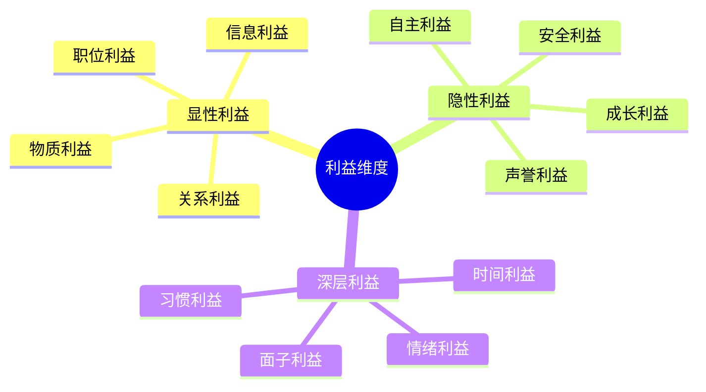
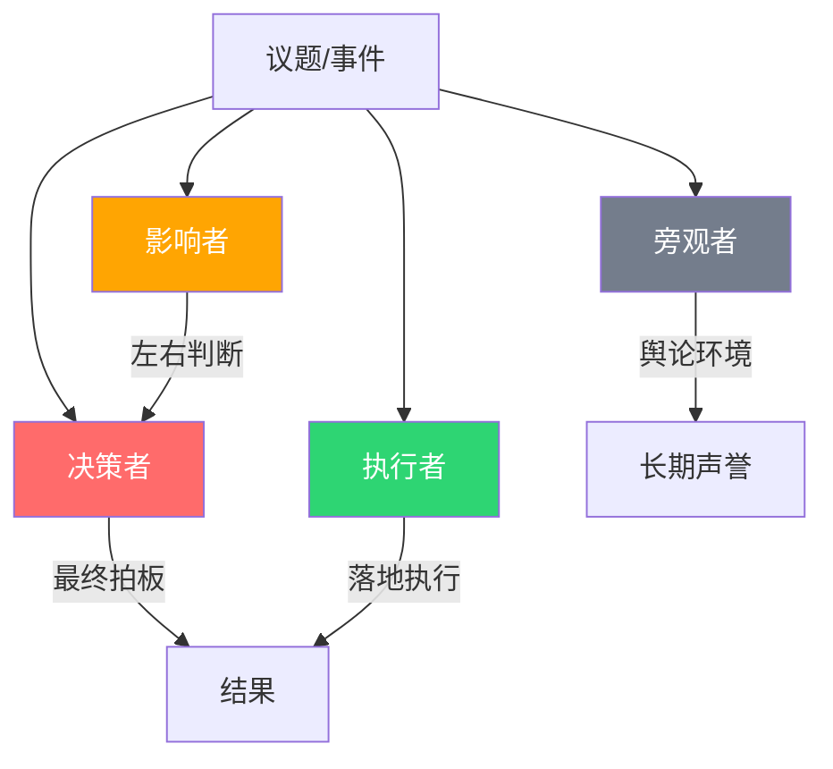
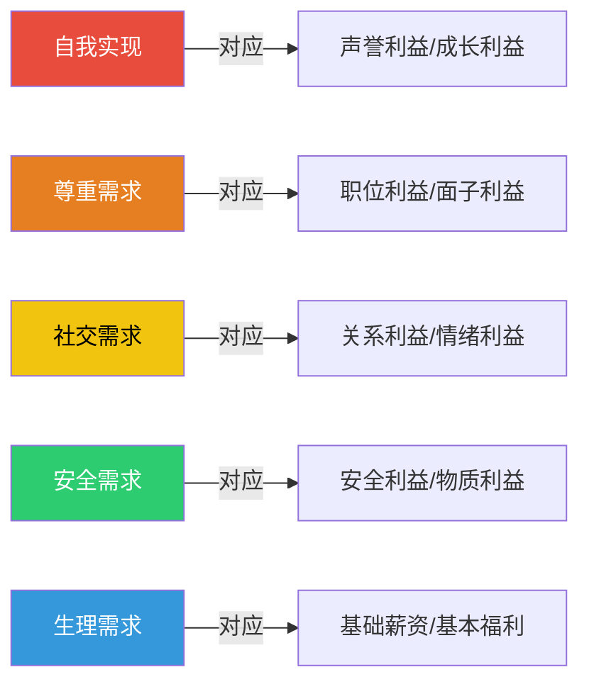
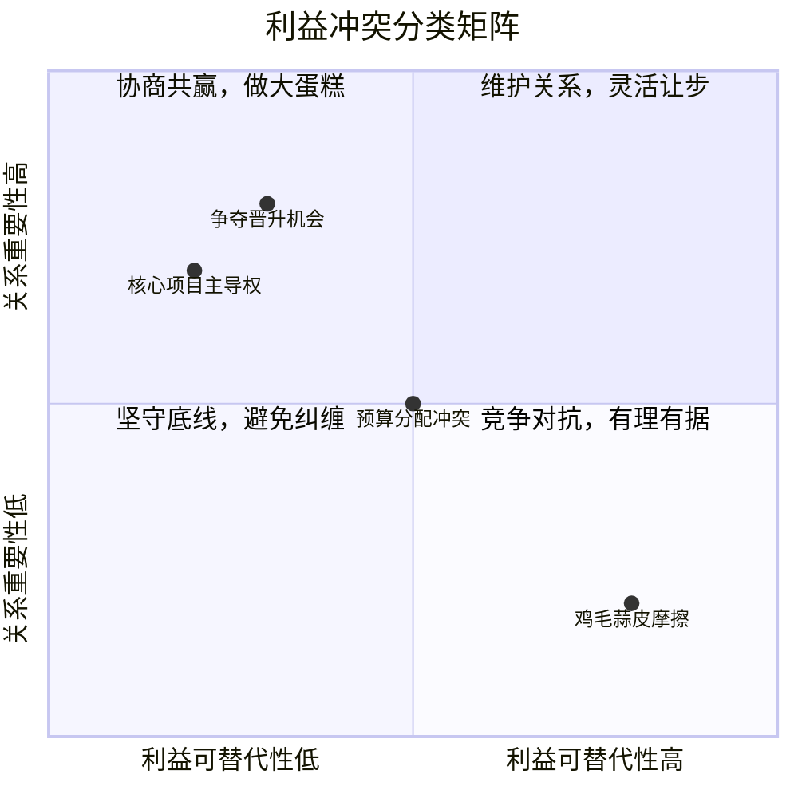

## 四、利益分析框架

在职场政治中，几乎所有冲突、合作、站队、博弈的背后，都可以追溯到一个根本问题：**谁的利益在哪里？** 如果你看不清利益格局，就无法预判他人的行为，也无法为自己的行动找到支点。利益分析框架就是帮你把混沌的职场局势"拆解成可操作的棋盘"的核心工具。

### 4.1 理解"利益"的多维性

很多人对"利益"的理解过于狭隘，以为利益就是钱和职位。实际上，职场中的利益是一个多维光谱，每个人同时在多个维度上追求不同的目标。

#### 4.1.1 八大利益维度详解

| 利益维度 | 具体表现 | 驱动力 | 典型信号 |
|----------|----------|--------|----------|
| 物质利益 | 薪资、奖金、股票、福利、报销额度 | 经济安全感、生活品质 | 对预算审批极度敏感，主动争取加薪 |
| 职位利益 | 晋升、头衔、职权范围、汇报层级 | 权力欲、社会地位 | 频繁提及"我的团队"，争夺汇报关系 |
| 信息利益 | 获取关键信息、参与核心会议、掌握内部动态 | 控制感、战略优势 | 主动要求加入邮件组，热衷参加各种会议 |
| 关系利益 | 与高层的私人关系、行业人脉、圈层归属 | 社会资本、庇护 | 经常提及"我和XX总聊过"，善于组局 |
| 安全利益 | 工作稳定性、不犯错、不被针对 | 风险规避、恐惧 | 行事保守，避免创新，推卸责任 |
| 成长利益 | 学习机会、培训资源、新项目、新挑战 | 自我实现、能力提升 | 主动请缨做新项目，频繁询问培训机会 |
| 声誉利益 | 行业知名度、专业认可、个人品牌 | 尊重需求、社会认可 | 热衷分享成果，在公开场合展示专业性 |
| 自主利益 | 工作灵活性、决策自主权、不受微观管理 | 独立性、掌控感 | 抵触过多汇报要求，偏好弹性工作制 |

#### 4.1.2 利益的隐性维度

除了上述八个显性维度，还有几个容易被忽略的隐性利益：

**情绪利益**：在职场中获得的情感满足——被尊重、被需要、被认可的感觉。有些管理者表面上不在乎下属的态度，但实际上，下属的"服帖"本身就是一种情绪利益。当这种利益被剥夺（比如下属公开质疑），他们的反应可能远超你的预期。

**时间利益**：对时间资源的控制权。一个每天加班到十点的中层管理者，你给他加薪10%不如给他一天弹性工作日更有吸引力。理解对方在时间上的"痛点"，往往能找到出人意料的交换筹码。

**面子利益**：在中国职场中，面子是一种硬通货。公开场合让领导"下不来台"，可能比你工作失误造成的后果更严重。面子利益的核心是**公开场合的尊重感**，它往往比实际利益更能驱动人的行为。

**习惯利益**：人们天然倾向于维持已有的工作模式和舒适区。任何改变现状的提案都会遭遇阻力，即使改变在客观上是有利的。这就是为什么"变革管理"如此困难——你在对抗的不是理性，而是惯性。

#### 4.1.3 利益的动态性

利益不是静态的。一个人在不同阶段追求的东西完全不同：

- **入职1-2年**：成长利益 > 物质利益 > 安全利益。新人最需要学习机会和存在感。
- **入职3-5年**：职位利益 > 物质利益 > 声誉利益。进入上升期，渴望晋升和认可。
- **入职5-10年**：关系利益 > 自主利益 > 职位利益。开始关注圈层和话语权。
- **入职10年以上**：安全利益 > 自主利益 > 情绪利益。稳定压倒一切，不愿折腾。

一个刚入职的95后可能最看重"成长机会"和"工作自主权"，而一个50岁的老员工可能最在意"工作稳定"和"不被边缘化"。如果你用同一套话术应对所有人，效果必然大打折扣。

### 4.2 利益相关者分析

在任何职场互动中，第一步都是**系统性地识别所有利益相关者及其核心利益**。很多人只关注直接对话方，忽略了"旁观者"和"间接影响者"——而后者往往才是决定事情走向的关键力量。

#### 4.2.1 利益相关者识别矩阵

不要只盯着眼前的人，要画出完整的利益地图。以下是一个结构化的分析模板：

利益相关者分析卡
├── 基本信息
│   ├── 姓名/角色：________
│   ├── 与我的关系：________（上级/同级/下属/跨部门/外部）
│   └── 在此事中的角色：________（决策者/执行者/影响者/旁观者）
│
├── 利益分析
│   ├── 核心利益诉求：________
│   ├── 隐性利益诉求：________
│   ├── 他/她最担心什么：________
│   ├── 他/她最渴望什么：________
│   └── 利益优先级排序：________
│
├── 权力分析
│   ├── 权力来源：________（职位/信息/关系/专业/资源）
│   ├── 权力大小：________（高/中/低）
│   └── 权力变化趋势：________（上升/稳定/下降）
│
├── 立场预判
│   ├── 对此事的可能立场：________（支持/反对/中立/观望）
│   ├── 立场的坚定程度：________（铁板钉钉/可争取/随大流）
│   └── 影响其立场的关键因素：________
│
└── 策略建议
    ├── 我能满足他/她什么需求：________
    ├── 我需要他/她做什么：________
    └── 沟通策略：________（直接/间接/通过第三方/暂时搁置）

#### 4.2.2 四类关键角色

在任何一个职场议题中，利益相关者通常可以分为四类角色：

**决策者（Decider）**：最终拍板的人。不一定是最高的领导，而是对这件事有最终决定权的人。分析重点：他/她的决策标准是什么？他/她最看重哪些利益维度？

**影响者（Influencer）**：能左右决策者判断的人。可能是领导的信任顾问、某个技术专家、或者领导的"心腹"。分析重点：他/她的观点是什么？如何影响他/她的观点？

**执行者（Implementer）**：决策做出后负责落地的人。执行者的配合程度决定了方案能否真正实施。分析重点：执行难度对他/她的利益有何影响？他/她是否愿意配合？

**旁观者（Bystander）**：看似与此事无关，但实际上在观察、判断、记账的人。旁观者的态度决定了你在组织中的"舆论环境"。分析重点：他/她会如何看待我的行为？对我的长期声誉有何影响？

#### 4.2.3 实操案例：一次跨部门资源争夺

**场景**：产品部和技术部争夺同一个高级工程师的调配权。

**利益分析**：

| 角色 | 人物 | 核心利益 | 隐性利益 | 可能立场 |
|------|------|----------|----------|----------|
| 决策者 | CTO | 项目整体进度 | 不想得罪任何一方 | 看谁的理由更充分 |
| 影响者A | 产品总监 | 产品迭代速度 | 向CEO证明产品部的价值 | 支持产品部 |
| 影响者B | 技术总监 | 系统稳定性 | 维护技术部的人员规模 | 支持技术部 |
| 执行者 | 高级工程师本人 | 个人发展空间 | 想去更有挑战的项目 | 两边都不想得罪 |
| 旁观者 | 其他工程师 | 公平感 | 观察公司如何对待技术人员 | 看热闹，但心里在记账 |

**分析结论**：CTO不想得罪人，所以最终决策会"看起来很理性"。谁能在理性层面提供更有说服力的论据（数据、项目优先级、ROI），谁就更可能胜出。同时，工程师本人的态度是关键变量——如果他明确表态想去某一方，CTO就有了"顺水推舟"的理由。

### 4.3 利益的优先级排序

识别利益之后，下一步是排序。不同的人在不同阶段、不同情境下，利益的优先级完全不同。

#### 4.3.1 马斯洛需求层次与利益映射

马斯洛的需求层次理论可以帮我们理解利益优先级的底层逻辑：

**关键洞察**：当低层需求未被满足时，高层需求的吸引力会大幅降低。一个月薪5000的员工，你跟他谈"个人成长"和"行业影响力"，远不如直接谈加薪有效。反过来，一个年薪百万的高管，你跟他加薪10万可能毫无波澜，但一个"行业论坛的演讲机会"可能让他兴奋不已。

#### 4.3.2 情境性优先级变化

同一个人在不同情境下，利益优先级会发生剧烈变化：

| 情境 | 最高优先级利益 | 典型行为 |
|------|---------------|----------|
| 公司裁员期 | 安全利益 | 主动加班，避免犯错，讨好领导 |
| 晋升窗口期 | 职位利益 | 争取曝光机会，展示成果 |
| 项目失败后 | 安全利益 > 面子利益 | 推卸责任，寻找替罪羊 |
| 新领导上任 | 关系利益 > 安全利益 | 积极表态，建立信任 |
| 行业景气期 | 成长利益 > 物质利益 | 愿意冒险，尝试新事物 |
| 行业衰退期 | 安全利益 > 一切 | 保守行事，储备资源 |
| 刚拿到大项目 | 自主利益 > 职位利益 | 争取更多决策权 |

#### 4.3.3 利益优先级速判法

如何快速判断一个人当前的利益优先级？看三个信号：

**信号一：时间分配**。一个人把时间花在哪里，他真正的利益就在哪里。一个天天加班做PPT的中层，显然在追求"展示型"利益（职位/声誉）。

**信号二：情绪触发点**。什么事情能让他愤怒、兴奋、焦虑？愤怒说明利益被侵犯，兴奋说明利益被满足，焦虑说明利益面临威胁。

**信号三：决策偏好**。面对两个选项时他选什么？选稳定还是选挑战？选短期还是选长期？选择揭示真实的优先级。

### 4.4 利益交换与创造

分析利益的最终目的不是"看透别人"，而是**找到交换和创造价值的路径**。这是利益分析框架最核心的应用层。

#### 4.4.1 利益交换的基本原则

**原则一：对等交换**。你给对方的，要和你从对方那里获得的在"感知价值"上对等。注意是"感知价值"而不是"客观价值"——你觉得不重要的东西，对方可能视若珍宝。

**原则二：非对称交换**。最好的交换是"对你很重要但对我成本低"的东西换取"对我很重要但对你成本低"的东西。比如：你帮领导在会议上"捧场"（对你成本低），领导在晋升评审中为你说话（对你价值高）。

**原则三：延迟交换**。不是所有交换都要立即兑现。先投入，建立"利益账户"的余额，在需要的时候再支取。这就是"人情债"的本质——一种跨时间的利益交换。

**原则四：多方交换**。复杂的职场议题往往不是A和B之间的简单交换，而是A、B、C、D之间的多方利益编织。你可能需要先帮C解决一个问题，才能获得C的支持去说服B，最终影响A的决策。

#### 4.4.2 利益创造的五种方法

大多数人的思维停留在"分蛋糕"——资源有限，你多我就少。高手的做法是"做大蛋糕"：

| 方法 | 核心思路 | 典型应用 |
|------|----------|----------|
| 扩大资源池 | 引入新的资源，让双方都不需要让步 | 争取额外预算、引入第三方资源 |
| 绑定共同目标 | 找到双方都关心的更高层级目标 | "我们都希望产品成功" |
| 时间换空间 | 将冲突延后，用时间创造新的可能性 | 先试点，再推广，用数据说话 |
| 交换维度转换 | 在A维度上的让步换B维度上的收益 | 放弃项目主导权，换取人员调配权 |
| 创造新选项 | 跳出原有框架，创造双方都没想到的方案 | 不是选A或B，而是设计一个全新的C方案 |

#### 4.4.3 利益交换的沟通话术

分析完利益之后，如何在沟通中落地？以下是几种常用的表达模式：

**暗示性交换**："我知道您一直在推动X项目，如果我能在这方面帮上忙，不知道在Y事情上您是否能支持一下？"——用"帮忙"包装交换，降低对方的防御心理。

**共同利益绑定**："这个方案对咱们两个部门都有好处，产品部能提前上线，技术部也能分到更多资源。"——强调双赢，避免零和博弈的对抗感。

**价值展示**："我注意到您最近在推数字化转型，我这边正好有一些行业案例和数据，改天整理给您看看？"——先提供价值，为后续的利益交换建立基础。

**间接谈判**："我听说XX总对这个方向很感兴趣，如果咱们能一起推动，对大家都是好事。"——引入第三方增强说服力，同时暗示背后有支持力量。

### 4.5 利益冲突的分类与应对

职场中的利益冲突并不是铁板一块，不同类型的冲突需要不同的应对策略。

#### 4.5.1 四种利益冲突类型

**高关系 + 低替代性（协商区）**：双方的利益都很重要，但关系也必须维护。策略是"做大蛋糕"——寻找创造性的解决方案，扩大资源池。

**高关系 + 高替代性（让步区）**：对方的利益可以被替代满足，但关系很重要。策略是"灵活让步"——在这件事上给面子，在其他事情上找回来。

**低关系 + 低替代性（竞争区）**：利益核心且不可让步，关系也不重要。策略是"有理有据地竞争"——用数据、规则、上级支持来争取。

**低关系 + 高替代性（回避区）**：利益可以被替代，关系也不重要。策略是"避免纠缠"——不要在这种事上浪费精力。

#### 4.5.2 利益冲突的化解六步法

当利益冲突已经发生时，按以下步骤处理：

**第一步：冷静识别**。不要被情绪驱动，先问自己："这到底是谁的利益和谁的利益在冲突？冲突的核心是什么？"

**第二步：换位思考**。站在对方的角度想：他/她为什么要这样做？他/她最怕什么？他/她的底线在哪里？

**第三步：寻找共同利益**。即使在激烈冲突中，双方也一定有共同利益。比如：都希望项目成功、都不想被上级批评、都不希望团队分裂。

**第四步：提出替代方案**。不要死磕一个方案，提出2-3个替代方案，让对方有选择的空间。有选择权的人更容易接受结果。

**第五步：借助第三方**。如果双方僵持不下，引入双方都信任的第三方来调解。第三方可以是共同的上级、HR、或者双方都尊重的同事。

**第六步：建立长效机制**。冲突解决后，建立预防机制——定期沟通、利益分配的透明化、冲突升级的处理流程。

### 4.6 利益分析的常见陷阱

#### 陷阱一：投射效应——以为别人和自己想要的一样

你最看重成长机会，就以为别人也最看重成长机会。这是最常见的认知偏差。**解决方案**：永远从观察和验证出发，不要从假设出发。直接问对方"你最看重什么"虽然不能每次都做，但至少可以从侧面了解。

#### 陷阱二：静态思维——忽略利益的动态变化

三个月前分析的利益格局，今天可能已经完全不同。人事变动、项目进展、市场环境都会改变利益格局。**解决方案**：定期更新你的利益地图，至少在重大事件发生后重新评估。

#### 陷阱三：只看表面——忽略隐性利益

一个人公开说的理由往往不是真正的理由。"我反对这个方案是因为风险太大"——真的只是因为风险吗？可能是因为这个方案会削弱他的权力，或者让他丢面子。**解决方案**：永远多想一层——"除了他/她说的理由，还有什么可能的隐性利益在驱动？"

#### 陷阱四：零和思维——以为你得就是我失

很多人一谈到"利益分析"就进入零和博弈思维。但实际上，大多数职场互动都可以通过创造性方案变成正和博弈。**解决方案**：在得出"必须竞争"的结论之前，先花10分钟想想"有没有做大蛋糕的可能"。

#### 陷阱五：过度算计——把所有人都当棋子

利益分析是工具，不是目的。如果你把每一次互动都变成精密的利益计算，你会变得冷漠、疏远，最终失去真诚的人际关系。**解决方案**：利益分析用于理解局势、预判风险，但沟通时要保持真诚和善意。"看透不说透"才是高手。

### 4.7 利益分析的进阶应用

#### 4.7.1 利益联盟的构建

当你需要推动一个重大议题时，光靠你一个人的力量往往不够。你需要构建一个利益联盟——找到那些与你有共同利益的人，形成合力。

**联盟构建四步法**：

1. **利益地图绘制**：列出所有与议题相关的利益相关者，标注他们的利益诉求和可能立场。
2. **盟友识别**：找到那些与你利益一致（或至少不冲突）的人，优先联系。
3. **利益对齐**：用对方听得懂的语言，说明这个议题如何服务于他们的利益。
4. **承诺锁定**：在正式场合之前，私下确认盟友的支持，避免公开场合的意外。

#### 4.7.2 用利益分析预判组织行为

利益分析最强大的应用是**预判**——在别人行动之前，就能推断出他们大概率会怎么做。

**预判公式**：当一个人的核心利益受到威胁时，他/她会优先选择那个**对自身利益损害最小**的行动方案，即使这个方案在客观上不是最优的。

**案例**：公司宣布组织架构调整。你知道某位总监的核心利益是"保住自己的管辖范围"，那么你就可以预判：他会极力争取新架构中尽可能多的汇报线归他管。基于这个预判，你可以提前准备应对方案。

#### 4.7.3 利益分析在谈判中的应用

谈判是利益分析最直接的应用场景。谈判的本质不是"说服对方接受我的方案"，而是"找到双方利益的最大交集"。

**谈判前的准备清单**：

- 我的核心利益是什么？底线是什么？
- 对方的核心利益是什么？底线可能是什么？
- 有哪些利益是双方共享的？
- 有哪些利益是可以交换的？
- 如果谈崩了，双方各自的BATNA（最佳替代方案）是什么？
- 有没有"做大蛋糕"的可能？

### 4.8 本节工具箱

#### 工具一：利益分析画布

将以下画布打印出来，每次遇到复杂的职场议题时填写一份：

┌─────────────────────────────────────────────────┐
│                   利益分析画布                      │
├─────────────────────────────────────────────────┤
│ 议题：________________  日期：________________     │
│                                                     │
│ 【利益相关者】                                       │
│ 1. ____________  核心利益：______ 立场：______      │
│ 2. ____________  核心利益：______ 立场：______      │
│ 3. ____________  核心利益：______ 立场：______      │
│                                                     │
│ 【我的利益】                                         │
│ 核心利益：______________________________            │
│ 底线：____________________________________          │
│ 可让步的：______________________________            │
│                                                     │
│ 【共同利益】                                         │
│ ________________________________________________   │
│                                                     │
│ 【交换筹码】                                         │
│ 我能给的：______________________________            │
│ 我想要的：______________________________            │
│                                                     │
│ 【策略】                                             │
│ 首选方案：______________________________            │
│ 备选方案：______________________________            │
│ 底线方案：______________________________            │
└─────────────────────────────────────────────────┘

#### 工具二：利益相关者影响力评分表

对每个利益相关者打分（1-5分），帮助你决定优先争取谁：

| 维度 | 权重 | 人物A | 人物B | 人物C |
|------|------|-------|-------|-------|
| 对议题的决策权 | 30% | ? | ? | ? |
| 与我的关系质量 | 20% | ? | ? | ? |
| 利益与我的一致性 | 25% | ? | ? | ? |
| 可说服程度 | 15% | ? | ? | ? |
| 在组织中的影响力 | 10% | ? | ? | ? |
| **加权总分** | 100% | ? | ? | ? |

得分最高的人，就是你最应该优先争取的盟友。

### 4.9 本节要点

利益分析是职场政治中最重要的分析工具。掌握以下核心要点：

1. **利益是多维的**：不要只看到物质和职位，还有信息、关系、安全、成长、声誉、自主、情绪、面子、时间、习惯等多个维度。
2. **利益是动态的**：同一个人在不同阶段、不同情境下，利益优先级完全不同。
3. **利益分析要系统化**：用结构化的模板识别决策者、影响者、执行者和旁观者。
4. **利益可以交换和创造**：最好的策略不是争抢现有蛋糕，而是做大蛋糕。
5. **利益分析是理解工具，不是算计工具**：用它来理解局势、预判风险，但沟通时保持真诚。
6. **定期更新你的利益地图**：组织在变，人在变，利益格局也在变。

***
