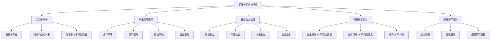
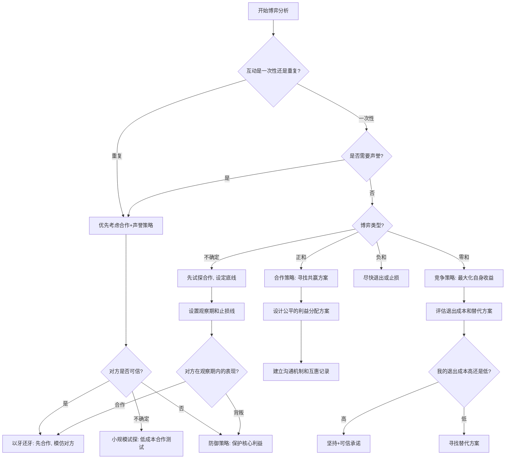

## 五、博弈论在职场中的应用

> "博弈论的精髓不在于教你如何击败对手，而在于帮你理解：为什么明明所有人都在做对自己最优的选择，结果却对所有人都更差。" —— 罗杰·迈尔森（2007年诺贝尔经济学奖得主）

职场是一个由人构成的复杂系统。每一天，你都在与他人进行着无数次"博弈"——与同事竞争晋升名额，与上级协商资源分配，与跨部门团队决定合作深度，与外部供应商谈判合同条款。这些互动的共同特征是：**结果不由你一个人决定，而是由所有参与者的策略共同决定。**

博弈论（Game Theory）正是研究这类多主体决策问题的数学理论。它不假设你是孤立的决策者，而是将你的决策置于"他人也在做决策"的真实语境中分析。1944年，约翰·冯·诺依曼与奥斯卡·摩根斯坦出版《博弈论与经济行为》，奠定了这一学科的理论基础。此后，约翰·纳什提出的"纳什均衡"概念（1950年）、托马尔·谢林将博弈论扩展到社会冲突领域的开创性工作、罗伯特·阿克塞尔罗德通过计算机锦标赛揭示的重复博弈合作演化规律，以及机制设计理论的深入发展，使博弈论成为经济学、政治学、生物学乃至计算机科学的核心分析工具。

本节将博弈论的理论精华提炼为职场人可直接使用的分析框架和行动策略。我们不会做数学推导，但会确保每个概念的**底层逻辑清晰**、**职场映射准确**、**行动指引可执行**。

---

### 5.1 为什么职场人需要懂博弈论

博弈论不是学术界的抽象游戏。它提供的是一种**结构化思维方式**——当你面对复杂的人际互动时，不凭直觉和情绪做决策，而是系统地分析互动结构、识别最优策略。

**博弈论能为职场人解决的核心困惑**：

| 困惑 | 博弈论的解答 | 核心模型 |
|------|-------------|---------|
| "我主动合作，对方却搭便车" | 你的互动是囚徒困境，需要建立惩罚机制和声誉约束 | 囚徒困境 |
| "明明是我的功劳，被别人抢了" | 你没有发出有效的能力信号，信号缺乏可信性和可验证性 | 信号博弈 |
| "两个人争同一个位置，谁都不让" | 这是胆小鬼博弈，需要评估退出成本和寻找第三条路 | 胆小鬼博弈 |
| "部门之间互相推诿" | 公地悲剧——激励结构导致个人理性与集体利益不一致 | 公地悲剧 |
| "站队选错了怎么办" | 联盟博弈中你需要评估联盟稳定性和退出成本 | 联盟博弈 |
| "领导的方案有明显问题但没人敢说" | 这是纳什均衡——沉默的均衡，需要改变博弈结构 | 纳什均衡 |
| "我总是被信息不对称所害" | 你需要系统地建立信息网络和控制信息流出策略 | 信息不对称 |
| "总是被对方先发制人" | 你需要理解先手/后手优势，运用承诺装置改变博弈时序 | 斯塔克尔伯格博弈 |

**博弈论思维的三个核心转变**：

1. **从"我要怎么做"到"我们各自会怎么做"**。传统思维关注自己的行动，博弈论思维要求你同时思考对方的策略空间、对方对你策略的反应、以及双方策略的交互结果。
2. **从"这次博弈"到"整个博弈序列"**。职场不是一次性交易，而是长期反复的互动。今天的行为会影响明天的博弈条件。声誉、信任、合作关系都是在多次博弈中积累或消耗的资产。
3. **从"改变自己"到"改变博弈结构"**。当博弈的结果不理想时，最深层的策略不是改变自己的行为，而是改变博弈的规则、激励结构和信息分布——让"好结果"成为所有人的最优选择。

### 5.2 博弈的基本要素

任何一场职场博弈都包含以下五个要素，缺一不可。掌握这些要素，你就拥有了分析任何职场博弈场景的基本框架。

#### 5.2.1 参与者（Players）

博弈中的决策主体。职场博弈的参与者**远不止**直接对话的两个人。一个晋升决策的参与者可能包括：你本人、竞争者、你的直属上级、上级的上级、HR负责人、与你关系密切的同事（他们可能为你说话或不说）、其他部门的利益相关者（他们的意见可能被征询）。

**分析步骤**：

1. **直接参与者**：与你有直接利害冲突或合作关系的人。
2. **间接利益相关者**：不受直接影响但能影响结果的人（如上级的上级、HR、其他部门负责人）。
3. **潜在参与者**：当前不在博弈中但可能被引入的人（如外部顾问、客户、猎头）。
4. **旁观者**：不直接参与但会观察和评价博弈过程的人（如其他同事、行业圈子）。旁观者很重要——他们对博弈过程的评价会影响你的长期声誉。

**关键警示**：遗漏一个关键参与者，整个分析就会出错。在做出任何博弈决策之前，花时间画出完整的参与者图谱——这是最值得投入的一步。

#### 5.2.2 策略（Strategies）

每个参与者可选择的行动方案。策略不是单一行为，而是一个完整的行动计划，涵盖"如果对方做A我就做B，如果对方做C我就做D"的条件序列（博弈论中称为"策略"与"行动"的区别——一个策略可能包含多个条件行动）。

职场中的常见策略类型：

| 策略类型 | 核心逻辑 | 适用场景 | 风险 |
|---------|---------|---------|------|
| 主动合作 | 率先释放善意，期待对等回报 | 长期关系、正和博弈 | 被搭便车 |
| 条件合作 | 先合作，根据对方行为调整 | 重复博弈、不确定对方类型 | 需要观察和反应能力 |
| 战略退让 | 主动让出低优先级利益换取高优先级利益 | 多议题谈判 | 被视为软弱 |
| 竞争对抗 | 坚守底线，展现不可退让的立场 | 零和博弈、核心利益 | 关系破裂 |
| 战略模糊 | 不明确表态，保留多种选择空间 | 信息不对称、局势不明朗 | 被认为缺乏立场 |
| 战略退出 | 主动退出当前博弈，寻找替代方案 | 博弈对自己不利 | 放弃潜在收益 |

#### 5.2.3 收益（Payoffs）

不同策略组合下各参与者获得的结果。收益**不仅仅是**金钱和职位，还包括声誉、关系、信息、心理满足感、学习成长等多维价值。

**收益评估的常见盲区**：

- **忽略隐性收益**：信任是职场中最昂贵的隐性资产。一个看似"理性"的决策如果损害了信任关系，长期来看可能得不偿失。
- **忽略时间维度**：当下的收益和一年后的收益不等价。贴现率取决于你的职业阶段和当前处境。
- **忽略替代方案价值**：评估收益时不要只看"如果我这样做会怎样"，还要看"如果我不参与这个博弈，把时间和精力投入到其他地方会怎样"。

#### 5.2.4 信息（Information）

参与者对博弈结构和其他参与者策略的了解程度。信息是职场博弈中**最关键**的变量之一。

信息状态的分类：

| 信息类型 | 含义 | 职场映射 |
|---------|------|---------|
| 完全信息 | 所有参与者都了解博弈的全部结构 | 罕见——仅限于规则极其透明的场景 |
| 不完全信息 | 至少有一个参与者不了解其他参与者的"类型"（能力、意图、偏好） | 最常见——你不知道上级的真实意图、同事的真实能力 |
| 完美信息 | 所有参与者都知道之前发生的所有行动 | 部分场景——如公开的项目进度 |
| 不完美信息 | 有人不知道其他人之前做了什么 | 大多数场景——如私下谈话、背地里的操作 |

#### 5.2.5 规则（Rules）

博弈的约束条件。组织制度、行业惯例、法律法规、文化规范都是博弈的"规则"。

规则分为两类：
- **显性规则**：明文规定的制度，如晋升标准、考核办法、审批流程。
- **隐性规则**：不明说但广泛遵守的规范，如"不要越级汇报""不要在公开场合批评领导""新人要多干活少抱怨"。

**理解隐性规则是有效参与博弈的前提**。很多职场新人的困境不是能力不足，而是不了解隐性规则——在不知道游戏规则的情况下参与游戏，输是必然的。

### 5.3 零和博弈与正和博弈：你的互动属于哪种类型

判断互动的博弈类型是选择策略的第一步。判断错误会导致灾难性后果——用零和思维处理正和博弈会错失合作机会，用正和思维处理零和博弈会被对手利用。

#### 5.3.1 零和博弈

一方的收益严格等于另一方的损失，总收益为零。"你多我就少"是零和博弈的核心逻辑。

**典型的职场零和场景**：
- 唯一的晋升名额——你上了他就没机会。
- 固定预算的分配——给你多了他就少了。
- 年终评级中的强制排名（如末位淘汰制下的ABC分级）。
- 同一个客户只有一个供应商中标。

**零和博弈的策略要点**：
1. 不要天真地在零和博弈中寻求"双赢"——不存在双赢，你只是在转移损失。
2. 在零和博弈中，**信息是最核心的武器**——了解对手的策略比展示自己的策略更重要。
3. 零和博弈中，**承诺和可信威胁**至关重要——让对手相信你会竞争到底，可以迫使对方提前退让。
4. 但也要评估：这场零和博弈值得你投入多少资源？有时退出零和博弈是最优策略。

#### 5.3.2 正和博弈

通过合作或创造性方案，双方的总收益可以扩大。"合作让我们都更好"是正和博弈的核心逻辑。

**典型的职场正和场景**：
- 跨部门项目协作——各自贡献能力，共同做大蛋糕。
- 知识分享——教会别人不影响自己的存量，但提升了团队的增量。
- 商业谈判中整合利益——满足对方低优先级需求来换取自己高优先级需求的满足。
- 联合提案——两个部门的方案单独看都不够有说服力，合并后效果倍增。

#### 5.3.3 负和博弈

双方的总收益在减少，但因为互不信任或情绪驱动，谁都无法单方面退出。这是最糟糕的博弈状态。

**典型的负和场景**：
- 办公室内耗——两个人互相拆台，结果两个人在领导眼中都减分。
- 部门间的报复性不合作——你卡我的审批，我延迟你的数据，最后项目延期，双方都要担责。
- 辞职前的摆烂——你不好好交接，新来的人接手困难，领导对你的评价也下降，三输。

**负和博弈的唯一正确策略是尽快退出**。如果无法退出，至少单方面停止恶化行为——这虽然不能立即改善结果，但防止了进一步损失。

#### 5.3.4 关键判断框架

| 判断维度 | 零和特征 | 正和特征 | 负和特征 |
|----------|---------|---------|---------|
| 资源性质 | 固定总量，不可扩展 | 可创造、可共享、可放大 | 正在被消耗或毁灭 |
| 目标关系 | 完全对立（你赢=我输） | 部分一致（存在共同利益区） | 双方行为相互消耗 |
| 互动频率 | 一次性或低频 | 长期反复互动 | 长期但恶化 |
| 可选方案 | 有限，非此即彼 | 丰富，存在创造性方案 | 双方都无好选项 |
| 信任水平 | 低，无合作基础 | 较高，有合作意愿 | 极低，互相敌对 |
| 情绪状态 | 冷静竞争 | 积极合作 | 愤怒、报复 |

#### 5.3.5 如何将零和博弈转化为正和博弈

这不是天真的理想主义，而是基于博弈结构分析的理性策略。具体方法：

**1. 扩大利益蛋糕**
不要在固定资源上争，而是寻找增量。例如：两个部门争一个培训预算，可以联合申请一笔更大的预算，或者引入外部免费资源（供应商提供的培训、在线课程平台的企业版试用）。两个团队争一个客户名额，可以共同开发更大的市场。

**2. 差异化需求交换**
找到双方需求的差异点进行交换。A部门要预算额度，B部门要项目署名权，各取所需。你想要技术深度的提升机会，同事想要管理经验——你帮他承担技术工作，他让你参与项目管理，双方都得到自己更需要的东西。

**3. 建立互惠记录**
在你不需要的资源上主动让步，积累"人情账户"，在未来需要对方支持时提取。博弈论中的"以牙还牙"策略证明，在长期关系中，先合作再等待回报是最优策略。

**4. 引入第三方协调**
有时双方僵持是因为缺乏可信的承诺机制。引入双方信任的第三方（如共同上级、HR、行业专家）可以打破僵局——第三方可以监督承诺、调解争端、提供新的信息。

**5. 改变评价维度**
如果当前的评价标准导致零和竞争（如只有一个"最佳员工"名额），可以推动多元化的评价体系（如设立"技术突破奖""最佳协作奖""创新贡献奖"等多个维度）。

### 5.4 纳什均衡：为什么"明明不好，却改不了"

纳什均衡（Nash Equilibrium）是博弈论中最核心的概念之一，由数学家约翰·纳什在1950年提出，并因此获得1994年诺贝尔经济学奖。

**纳什均衡的精确定义**：在给定其他参与者策略不变的情况下，没有任何一个参与者能通过单方面改变自己的策略来获得更好的收益。换言之，纳什均衡是一个"谁都不想先动"的稳定状态——**即使这个状态对所有人都不是最优的。**

纳什均衡的核心洞察是：个体理性不一定导致集体最优。每个人的局部最优选择组合在一起，可能形成一个所有人都不满意的全局困境。

#### 5.4.1 职场中的纳什均衡案例

**案例一：会议沉默均衡**

在一次部门会议中，领导提出了一个明显有漏洞的方案。所有人都注意到了问题，但没有人发言。为什么？

收益分析：
- 如果你提出反对意见，可能得罪领导（个人成本-3），问题得到解决（集体收益+5）。
- 如果别人提了，你也获得了问题被解决的好处（搭便车收益+5），个人成本为0。
- 在给定其他人不发言的条件下，你的最优策略是不发言（0 > -3）。

结果：所有人都不发言，形成沉默的均衡。问题不被解决，所有人都知道方案有问题但只能执行，最后项目失败，所有人都受损。

**打破方法**：
- 机制层面：建立"先匿名收集意见再公开讨论"的决策机制，降低发言的个人成本。
- 个人层面：拥有足够高地位和信任度的人率先发言，为其他人创造安全空间。
- 文明层面：建立"对事不对人"的文化，将提出反对意见的行为定义为"专业负责"而非"不给面子"。

**案例二：加班文化均衡**

团队中所有人都在加班，即使工作效率已经很低。如果你准时下班，可能被视为"不够投入"。

收益分析：
- 在给定其他人加班的条件下，你准时下班的风险（被认为不投入）远大于你加班的成本（多花2小时）。
- 即使所有人都意识到加班是低效的，没有人愿意先走。

这是一个"逐底竞争"（Race to the Bottom）的纳什均衡——所有人都更累了，产出并没有增加，但没有人敢先停。

**打破方法**：
- 改变博弈规则：引入"以结果而非工时衡量绩效"的评价体系。
- 引入外部标杆：让团队看到行业标杆公司的效率对比数据。
- 领导以身作则：如果领导自己准时下班，会显著改变博弈结构。

**案例三：推诿均衡**

跨部门协作中，出了问题大家都推卸责任。

收益分析：
- 主动担责：可能承担所有后果（-5），但换来信任（+2）——净收益-3。
- 推卸责任：协作效率下降（-1），但个人风险最小（0）——净收益-1。
- 在给定其他人推诿的条件下，-1 > -3，推诿是更优策略。

**打破方法**：
- 建立明确的责任分工——RACI矩阵、项目里程碑责任归属。
- 使推诿成本高于担责成本——推诿行为被记录并影响绩效评估。
- 使担责成本降低——建立容错机制，允许在合理范围内犯错。

**案例四：信息囤积均衡**

每个人都知道一些对团队有价值的信息，但分享信息会降低自己的信息优势。在给定其他人不分享的条件下，你也不分享。

**打破方法**：
- 将信息分享纳入绩效考核——使分享的收益（绩效加分）大于不分享的收益（信息优势）。
- 建立"信息分享是默认行为"的文化——新入职时就设定预期。
- 使用工具降低分享成本——建立团队Wiki、Slack频道、周会分享机制。

#### 5.4.2 理解纳什均衡的深层价值

当你发现一个"明明不好但改不了"的现象时，**不要简单归因为"大家都笨"或"文化不好"**。用纳什均衡分析你会发现，每个个体的行为在其局部视角下都是"理性"的——问题出在**博弈结构**上。

要改变结果，**必须改变结构**（规则、激励、信息），而不能只呼吁"大家要合作""大家要积极"。道德呼吁在博弈论面前是苍白的——如果博弈结构不变，改变个体行为的呼吁最多只能产生短期效果，很快就会回到均衡状态。

**改变博弈结构的三个杠杆**：

1. **改变收益**：使"好行为"的收益增加或"坏行为"的收益减少（如将协作指标纳入考核）。
2. **改变信息**：减少信息不对称，使隐藏行为变得可见（如公开项目贡献数据）。
3. **改变规则**：引入新的约束或自由度，使原本的均衡不再稳定（如引入轮值制度打破固定格局）。

### 5.5 囚徒困境：职场合作的核心难题

囚徒困境（Prisoner's Dilemma）是博弈论中最经典、最具现实解释力的模型。它的核心矛盾是：**个体理性导致集体非理性**——每个人都做出了对自己最优的选择，结果却对所有人都更差。

#### 5.5.1 收益矩阵

| | 对方合作 | 对方背叛 |
|---|---------|---------|
| **我合作** | 双赢（+3, +3） | 我吃大亏（-1, +5） |
| **我背叛** | 我占大便宜（+5, -1） | 双输（+1, +1） |

无论对方怎么选，"背叛"对我来说都是更好的选择（+5 > +3，+1 > -1）。但如果双方都这样思考，就都选择了"背叛"，得到（+1, +1）——远不如双方合作的（+3, +3）。

这就是囚徒困境的核心悲剧：**占优策略（Dominant Strategy）的组合导致了对所有人都更差的结果。**

#### 5.5.2 职场中的囚徒困境场景

**场景一：跨部门资源共享**

两个部门各自拥有对方需要的资源（数据、人力、技术）。如果都分享，项目效率大幅提升（+3, +3）；如果都不分享，各自低效运转（+1, +1）；如果一方分享另一方不分享，分享方的资源被白用（-1, +5）。

结果：大家都选择不分享，项目效率低下。

**场景二：知识分享困境**

你把自己的经验分享给同事，如果对方也分享，团队整体水平提升（+3, +3）；如果对方只获取不分享，你白送了竞争优势（-1, +5）。

结果：大家都倾向于留一手，组织的学习能力停滞。

**场景三：联合项目投入**

联合项目中，如果都全力投入，项目大获成功（+3, +3）；如果一方偷懒，另一方承担更多（-1, +5）。结果：大家都想搭便车，项目质量下降。

**场景四：供应商竞标中的价格战**

两个供应商竞标同一项目，如果都不降价，都保持合理利润（+3, +3）；如果一方降价，拿下项目（+5, -1）；如果都降价，利润缩水（+1, +1）。结果：价格战使双方都亏损。

#### 5.5.3 打破囚徒困境的五种机制

**机制一：重复博弈——"这次不是最后一次"**

当互动不是一次性的而是长期反复的时候，合作变得可持续。因为这次你背叛了对方，下次对方会报复——未来的合作收益远大于一次背叛的收益。

罗伯特·阿克塞尔罗德在1984年的经典锦标赛中证明，"以牙还牙"（Tit-for-Tat）策略——**第一步合作，之后模仿对方上一步的做法**——在重复博弈中表现最优。这个策略具有四个关键特征：
- **善良性**：从不首先背叛。
- **可激怒性**：对背叛立即报复。
- **宽容性**：对方恢复合作后立即原谅。
- **清晰性**：策略简单明确，容易被对方理解。

**职场启示**：把每次互动都当作长期关系的一环，而不是孤立事件。即使这次你可以在资源争夺中"赢"对方，考虑到未来还要合作多次，这次让步可能换来更有价值的长期回报。

**但要注意"终局效应"**（End-game Effect）：如果互动即将结束（如一方即将离职），背叛的未来惩罚不再存在，合作可能瓦解。应对方法是在博弈结束前引入"遗产机制"——如离职交接中的口碑评价。

**机制二：声誉机制——"你的历史会被记住"**

在组织中，你的合作/背叛历史会被记录——不是正式记录，而是**口碑**。一个有"合作者"声誉的人更容易获得他人的合作；一个有"搭便车者"标签的人会被处处防备。

声誉是一种"隐性合约"——你通过持续的合作行为积累信用，其他人基于你的信用决定是否与你合作。

**机制三：惩罚机制——"背叛有代价"**

对背叛行为建立可信的惩罚预期。在组织中，这可以通过制度实现——将协作指标纳入绩效考核，对破坏合作行为追责。

**关键是惩罚必须可信**。如果你威胁说"不合作就告领导"但从未真的做过，威胁就不起作用。在博弈论中，这叫"承诺的可信性"（Credibility of Commitment）——只有可执行的威胁才会影响对方的行为。

**机制四：沟通与承诺——"让我们谈谈"**

面对面沟通比书面沟通更能促进合作，因为它增加了人际连接和情感共鸣。研究表明，在囚徒困境实验中，允许参与者面对面沟通后，合作率从约40%提升至70%以上。

**具体做法**：
- 在关键决策前进行一对一沟通，表达合作意愿和具体承诺。
- 使用"条件承诺"而非"无条件承诺"："如果你在X方面配合，我承诺在Y方面全力支持"。
- 建立定期沟通机制，减少信息滞后和误解。

**机制五：改变收益结构——"让合作成为最优选择"**

从根本上改变博弈的收益矩阵。比如将跨部门项目的成果同时计入两个部门的KPI，使"合作"的收益更高，"背叛"的收益更低。

**这是打破囚徒困境最有效但实施成本最高的方法**。它需要组织层面的制度设计，而不仅仅是个人层面的策略选择。作为个人，你可以做的就是推动制度变革——向上级建议更合理的考核机制。

#### 5.5.4 有条件合作的最优策略

博弈论研究证明，在重复囚徒困境中，最优策略是**有条件的善意策略**（Conditional Cooperation）。具体特征：

1. **不要第一个背叛**（善良性）。
2. **对背叛进行报复**（可激怒性）——但报复是等量的，不过度。
3. **对方恢复合作后原谅**（宽容性）——不记仇。
4. **策略明确，让对方能预测你的行为**（清晰性）——避免被误解。
5. **根据对方的总体行为模式调整合作深度**——对长期合作者给予更多信任，对反复背叛者降低合作投入。

**特别强调**：无条件合作不是"好人"，而是"傻瓜策略"（Sucker's Payoff）。博弈论明确指出，无条件合作者在混合群体中的表现最差——因为搭便车者会持续利用他们。真正的智慧是"有条件的善良"——愿意合作，但也有底线和报复能力。

### 5.6 重复博弈与声誉资本

#### 5.6.1 重复博弈的性质转变

职场中的绝大多数互动都不是"一次性"的。你和同事每天见面，和上级每周汇报，和跨部门合作伙伴每个季度协作。这种长期反复的互动结构，就是博弈论中的"重复博弈"（Repeated Game）。

重复博弈从根本上改变了博弈的性质。在**一次性博弈**中，欺骗和背叛可能是"理性"的——因为你不需要承担未来后果。但在**重复博弈**中，背叛的代价极高：你还要和这些人长期共事，你的行为会被记住并影响未来的互动。

**民间定理（Folk Theorem）** 是重复博弈理论的核心结论：在无限重复博弈中，只要参与者足够重视未来（即"贴现因子"足够高），任何介于"最大最小收益"和"最优合作收益"之间的结果都可以通过适当的策略实现为纳什均衡。

**通俗解释**：只要你足够看重未来，合作就是可以维持的。但如果你不在乎未来（比如即将离职、即将转行），合作就容易瓦解。

**职场中的"贴现因子"影响因素**：

| 因素 | 贴现因子高（更看重未来） | 贴现因子低（更看重眼前） |
|------|----------------------|----------------------|
| 职业稳定性 | 计划长期在公司发展 | 即将离职或转行 |
| 互动频率 | 与对方频繁互动 | 偶尔接触 |
| 行业圈子 | 行业小、口碑传播快 | 行业大、互不相识 |
| 组织文化 | 重视长期关系和口碑 | 流动性高、短期导向 |
| 个人性格 | 有耐心、重视关系 | 急躁、重视即时回报 |

#### 5.6.2 声誉资本的运作机制

声誉本质上是一种"隐性合约"——你通过持续的合作行为积累信用，其他人基于你的信用决定是否与你合作。

**声誉资本的三个关键特征**：

**1. 积累慢，消耗快**

需要十次合作行为才能建立的声誉，一次背叛就可能崩塌。这意味着维护声誉的边际成本远低于重建声誉的成本。一旦建立良好的声誉，就要格外珍惜——不要为了一次小利而赌上长期积累。

**2. 信号放大效应**

在组织中，负面信息的传播速度和覆盖范围远大于正面信息。心理学中的"负面偏差"（Negativity Bias）使人们对负面信息的记忆和传播偏好远高于正面信息。一次严重的背叛行为可能被整个组织知道，而十次默默的合作只有直接参与者知道。

**启示**：主动管理和放大正面声誉信号。不要假设"做就好，别人会看到"——你需要确保关键人物知道你的合作行为。

**3. 路径依赖**

早期建立的声誉会形成"锚定效应"，影响他人对你后续行为的解读。如果你一开始就建立了合作者形象，偶尔的"不合作"会被归因为外部原因（"他可能这次确实有困难"）；反之，如果早期就有背叛记录，即使后来真心合作也会被怀疑动机。

**启示**：入职初期、加入新团队初期是建立声誉的黄金窗口。在这段时间里，主动展示合作意愿和能力，会为未来建立一个有利的"声誉锚点"。

#### 5.6.3 声誉管理的实操策略

| 策略 | 具体做法 | 注意事项 |
|------|---------|---------|
| 一致性 | 承诺的事情一定做到，做不到的事情不承诺 | 不要为了取悦而过度承诺——失信比不承诺更糟糕 |
| 可见性 | 让关键人看到你的合作行为 | 不是作秀，而是确保信息传递——在周会上汇报协作进展 |
| 主动性 | 在别人求助前主动提供帮助 | 建立"先手合作"的标签，让人觉得你"总是乐于助人" |
| 边界性 | 对不合理要求明确说不 | 无底线的讨好不是合作，是软弱——反而会降低你的声誉 |
| 修复性 | 一旦出现失误，立即承认并修复 | 拖延和掩饰会加速声誉崩塌——坦诚面对错误反而能增强信任 |
| 差异化 | 对不同的人采取不同的合作深度 | 对长期盟友深度合作，对陌生人初始合作后观察 |

#### 5.6.4 声誉修复：如何从背叛记录中恢复

如果你已经有了"搭便车者"或"不靠谱"的声誉，如何修复？

1. **承认问题**：不要试图掩饰或辩解，直接承认之前的不当行为。
2. **解释改变**：说明为什么你改变了——新的认知、新的承诺、新的机制。
3. **从小承诺开始**：先做一些小的、容易兑现的承诺，逐步重建信任。
4. **增加可见性**：主动让对方看到你的合作行为，而不仅仅是承诺。
5. **寻求背书**：请已经信任你的人为你担保——第三方的信任传递比自我声明有效得多。
6. **耐心等待**：声誉修复需要时间——可能需要3-5次成功合作才能改变印象。

### 5.7 承诺装置：如何让你的威胁和承诺可信

在博弈论中，一个策略的效果取决于它是否**可信**。如果你说"我会全力以赴竞争这个岗位"，但对方知道你其实有更好的外部机会，你的威胁就不可信。如果你说"如果你帮我这次，以后我一定回报"，但对方知道你有过不回报的记录，你的承诺就不可信。

**承诺装置（Commitment Device）** 是一种让你的承诺或威胁变得可信的机制——它通过改变你的未来选项，使你"必须"执行承诺。

#### 5.7.1 职场中的承诺装置

**公开承诺**：在公开场合（如全员会议、群聊）做出承诺。公开承诺增加了违约的社会成本——如果食言，不仅要面对对方，还要面对所有旁观者的评价。这就是为什么"写邮件确认"比口头承诺更有效——邮件是可引用、可转发的公开记录。

**沉没成本投入**：在项目上投入大量时间和资源，表明你不会轻易放弃。比如主动承担一个困难项目的核心工作，投入加班和精力——这向所有人发出了"我认真对待这件事"的信号。

**绑定第三方**：让关键利益相关者支持你的立场。比如获得了上级的书面背书、获得了客户的明确需求——这些第三方的支持使你的立场更加不可动摇。

**缩小选项空间**：主动减少自己的可选项，使"执行承诺"成为你唯一的理性选择。比如在谈判中提前终止与其他候选供应商的接触，让当前谈判对象知道你"已经没有其他选择"。

**创建退出成本**：让自己如果违约将面临巨大损失。比如在合同中加入惩罚条款、在项目中投入了难以回收的专用资产。

#### 5.7.2 使用承诺装置的注意事项

1. **不要过度承诺**：承诺装置是一把双刃剑——它让你的承诺更可信，但也限制了你的灵活性。在环境可能变化的情况下，保留适度的灵活性比完全锁死更明智。
2. **确保承诺可执行**：不要做出你实际上无法执行的承诺。不可执行的公开承诺会比沉默更伤害你的声誉。
3. **区分承诺和威胁**：承诺是"我会做什么"，威胁是"如果你不做X，我就做Y"。威胁的可信性尤其难以建立——因为执行威胁通常对你也有成本。

### 5.8 胆小鬼博弈：谁先让步

胆小鬼博弈（Game of Chicken）描述了两个参与者面对冲突时"谁先退让"的困境。双方都坚持则两败俱伤，一方退让则退让方损失面子但避免灾难，双方都退让则问题搁置。

**收益矩阵**：

| | 对方坚持 | 对方退让 |
|---|---------|---------|
| **我坚持** | 两败俱伤（-5, -5） | 我赢（+3, -1） |
| **我退让** | 对方赢（-1, +3） | 平手（0, 0） |

胆小鬼博弈与囚徒困境的关键区别：在囚徒困境中，背叛是占优策略；在胆小鬼博弈中，**没有占优策略**——你的最优策略取决于你对对方行为的判断。

#### 5.8.1 职场中的胆小鬼博弈场景

- **晋升竞争**：两个人争同一个晋升机会，如果都强硬到底，可能在领导面前互揭老底，两败俱伤；如果一方退让，退让方保全面子但失去机会。
- **预算争夺**：两个部门争同一笔预算，如果都不退让，可能导致预算分配决策搁置，谁都拿不到。
- **意见冲突**：在方案评审中，两个技术方案的支持者各不退让，如果僵持不下，项目延期对双方都不利。
- **薪资谈判**：你坚持要求加薪30%，公司坚持只加10%，如果僵持不下，你可能离职，公司可能失去人才——双方都损失。

#### 5.8.2 应对胆小鬼博弈的五大策略

**策略一：评估退出成本**

在进入胆小鬼博弈之前，先评估自己的退出成本。退出成本高的一方在博弈中占据优势——因为对方知道你"承受得起"坚持到底。如果你的退出成本确实低（比如你有其他更好的机会），硬撑不如尽早寻找替代方案。

**策略二：可信承诺**

如果你决定坚持，需要让对方相信你"真的不会退让"。方法包括：公开表态（"我已经向领导汇报了我的方案"）、沉没成本投入（在项目上投入大量时间和资源，表明你不会轻易放弃）、绑定第三方（让关键利益相关者支持你的立场）。

**策略三：战略模糊**

让对手不确定你的策略。如果你明确表现出"一定要争"，对方可能也强硬；如果你明确表现出"无所谓"，对方会乘虚而入。适度的模糊性——"我很重视这个机会，但我更看重团队的整体利益"——给双方都留下了回旋空间。

**策略四：寻找第三条路**

最聪明的策略不是在"坚持"和"退让"之间选择，而是创造新的选项。例如：
- 两个人争一个晋升名额 → 能否争取设立两个不同方向的高级岗位？
- 两个部门争一笔预算 → 能否找到外部资金来源扩大总预算？
- 两个方案各不退让 → 能否整合两个方案的优势，创造第三方案？

**策略五：设置截止时间**

胆小鬼博弈之所以危险，是因为双方都在等待对方先退让。设置明确的截止时间（"下周五之前我们必须达成一致，否则我会提交我的方案"）可以避免无限期僵持。截止时间的力量在于它将博弈从"比谁先退"变成"在限定时间内找到方案"。

### 5.9 信号博弈：如何证明你的能力

信号博弈（Signaling Game）由经济学家迈克尔·斯彭斯在1973年提出，并因此获得2001年诺贝尔经济学奖。最初用于解释劳动力市场中教育的筛选功能，但其逻辑适用于所有信息不对称场景。

**核心逻辑**：在信息不对称的环境中，拥有私有信息的一方（如你知道自己的真实能力）需要通过可信的信号来传递信息，而接收方（如领导、同事）则根据信号来推断你的类型。

#### 5.9.1 有效信号的三个条件

**条件一：成本差异性（Costly Signaling）**

信号对高能力者的成本必须低于低能力者。如果一个信号对所有人都同样容易发出，它就无法区分能力——也就没有信号价值。

例如：获得一个顶级认证对真正有经验的人而言是投入时间准备考试（边际成本低），对没有经验的人则需要从零学习（边际成本高）。成本差异明显，因此认证是有效信号。

反例：在简历上写"精通Office"——这对所有人都容易，因此没有信号价值。

**条件二：可信性（Credibility）**

信号必须难以伪造。可验证的成果（公开项目、数据、第三方背书）比自我声明更可信。

| 信号类型 | 可信度 | 原因 |
|---------|-------|------|
| 可运行的系统/产品 | 极高 | 直接可验证，无法伪造 |
| 第三方背书（客户评价、行业奖项） | 高 | 需要第三方配合，伪造成本高 |
| 可量化的业务数据（收入增长、效率提升） | 高 | 有据可查 |
| 面试中的技术演示 | 中高 | 实时表现，难以伪装 |
| 证书和学历 | 中 | 获取有成本，但无法区分实际能力 |
| 简历描述和自我声明 | 低 | 几乎零成本，容易夸大 |

**条件三：相关性（Relevance）**

信号必须与想要展示的能力直接相关。展示技术领导力的最佳信号是可运行的系统和可衡量的业务成果，而不是参加管理培训的证书。展示合作能力的最佳信号是有据可查的跨部门协作成果，而不是"善于沟通"的自我描述。

#### 5.9.2 信号策略的系统构建

**日常信号 vs 专项信号**

- **日常信号**：在日常工作中持续展示的专业判断力、问题解决能力和协作能力。这些信号不显眼，但因为难以伪造且持续积累，长期来看是最有说服力的能力证明。
- **专项信号**：针对特定目标的集中展示，如竞聘述职、项目汇报、行业演讲。

两类信号互补：日常信号建立基线信任，专项信号在关键节点放大影响。如果只有专项信号而缺乏日常信号的支撑，会显得"表演型"——可信度大打折扣。

**信号组合的"证据链"**

单一信号容易被质疑，多维度的一致信号形成"证据链"更有说服力。例如：

1. 一份出色的项目成果（成果信号）
2. 项目中使用了你独创的方法论（创新信号）
3. 同事和上级的一致好评（社会验证信号）
4. 被邀请在公司技术分享会上做演讲（权威认可信号）

四个信号相互印证，远比任何单一信号更有说服力。

**信号时机**

在关键决策窗口期（绩效评估前、晋升评审期、项目竞标时）强化信号效果最佳。在没有决策窗口时过度展示信号，反而可能被视为"爱表现"或"有企图心"——适得其反。

**策略**：提前了解公司的决策周期，在窗口期前1-2个月开始有意识地增强信号输出。

#### 5.9.3 避免信号陷阱

| 陷阱 | 表现 | 后果 | 纠正方法 |
|------|------|------|---------|
| 过度包装 | 成果被夸大或与实际不符 | 一旦被核实，声誉崩塌 | 只展示可以被独立验证的内容 |
| 信号错配 | 用与目标无关的信号证明自己 | 浪费精力，效果甚微 | 明确目标能力，对齐信号方向 |
| 信号通胀 | 所有人都发同样的信号 | 信号失效，需要更强的区分信号 | 寻找差异化信号，建立独特标签 |
| 忽略日常 | 只在关键时刻表演 | 缺乏一致性支撑，可信度低 | 日常积累+关键时刻放大 |
| 信号成本过低 | 选择容易发出的信号 | 无法区分能力，信号无效 | 选择有区分度的、需要真实能力支撑的信号 |

### 5.10 斯塔克尔伯格博弈：先手与后手的智慧

斯塔克尔伯格博弈（Stackelberg Game）研究的是**序贯博弈**——一方先行动，另一方观察到先行者的决策后再行动。与前面讨论的同时博弈不同，序贯博弈中**时序**本身就是一种策略资源。

#### 5.10.1 先手优势

在某些博弈中，先行动者可以创造"既成事实"，迫使后行动者只能在给定条件下做选择。

**职场中的先手优势场景**：
- **议题设定**：在会议前先提出方案框架的人，往往能设定讨论的方向——后续的讨论都是在这个框架内进行的微调，而不是根本性的质疑。
- **资源抢占**：率先向上级汇报项目进展的部门，更容易获得追加资源——因为上级已经对这个部门的项目建立了"正在进行"的认知。
- **定义问题**：谁先定义问题，谁就主导了解决方案的方向。如果你先把问题框定为"技术问题"，解决方案就偏向技术路线；如果框定为"管理问题"，解决方案就偏向管理路线。

#### 5.10.2 后手优势

在另一些博弈中，后行动者拥有信息优势——他们可以观察先行动者的行为，再做出最优反应。

**职场中的后手优势场景**：
- **薪资谈判**：在面试中，"先出价的人吃亏"——因为先出价者暴露了自己的底线，后出价者可以据此调整策略。
- **竞标博弈**：在竞标中，后出价者可以看到先出价者的报价范围，从而制定更有针对性的报价。
- **技术方案评审**：最后发言的人可以综合前面所有人的观点，提出一个"兼容并蓄"的方案——这比第一个发言的人有优势。

#### 5.10.3 如何在职场中运用时序策略

1. **识别你想要的是先手还是后手**：如果你有信息优势且想主导方向，争取先手；如果你需要更多信息才能做出好决策，争取后手。
2. **不要被动接受时序**：时序往往不是给定的，可以通过主动行动来改变——比如提前发送会议议程（先手），或者要求"让我考虑一下再回复"（后手）。
3. **在先手博弈中，行动比语言更有力**：与其说服别人接受你的方案，不如先做出一个原型——行动是最强的信号。
4. **在后手博弈中，信息收集是关键**：尽可能多地了解先行动者的信息和意图，再做出反应。

### 5.11 公地悲剧：为什么"与我无关"的事总没人管

公地悲剧（Tragedy of the Commons）由生态学家加勒特·哈丁在1968年提出。核心逻辑是：当一种资源是公共的、使用是免费的时候，每个人都有动机过度使用，最终导致资源枯竭——即使所有人都知道过度使用的后果。

#### 5.11.1 职场中的公地悲剧

**公共知识库**：公司建立了内部知识库，鼓励大家分享经验。但每个人都想"获取"而不想"贡献"，因为贡献需要花费时间而收益由全体共享。结果：知识库内容匮乏、过时，逐渐无人使用。

**团队氛围**：良好的团队氛围是公共品。每个人都受益于积极的氛围，但维护氛围需要个人付出（如控制情绪、主动沟通、包容差异）。如果有人破坏氛围但不受惩罚，其他人也会逐渐放弃维护。

**代码质量**：公共代码库中，如果每个人只关心自己的功能是否实现而不关心整体代码质量，技术债务会不断累积，最终所有人都要为维护困难买单。

**共享设备和资源**：会议室、打印机、共享测试设备——当使用成本为零时，过度使用和不维护是必然结果。

**客户关系**：当客户被视为"公司的"而非"某个人的"时，过度使用客户资源（如频繁打扰、不一致的服务质量）会导致客户流失——这是所有人的损失。

#### 5.11.2 解决公地悲剧的四种方法

**方法一：产权界定——"这块地有人管"**

将公共资源的管理权明确分配给特定的人或团队。产权界定改变了博弈结构——当资源有了明确的"所有者"，所有者有激励维护资源的长期价值。

具体做法：
- 指定知识库的"管理员"负责审核和更新内容。
- 为共享代码库设立代码审核制度和"代码守护者"（Code Owner）角色。
- 为每个客户指定"客户关系负责人"。

**方法二：使用规则——"有规矩才有方圆"**

建立清晰的使用规范和配额。

具体做法：
- 会议室预约制度（每人每天最多预约2小时）。
- 共享设备的使用时间限制和预约机制。
- 代码提交的质量门槛（通过CI/CD自动检查）。
- 知识库贡献的最低频率要求。

**方法三：监督与惩罚——"违规有代价"**

对违规行为进行监督和惩罚。关键是惩罚必须可信且执行一致——如果规则存在但从不执行，规则就形同虚设，甚至比没有规则更糟糕（因为会培养"规则无用"的心态）。

**方法四：利益绑定——"公共品好了你也好"**

将公共品的状况与个人利益挂钩。这是最根本的解决方案——当维护公共品成为个人利益的一部分时，维护行为就变成了自利行为。

具体做法：
- 将知识库贡献纳入绩效考核。
- 将代码质量指标与团队奖金关联。
- 将客户满意度与服务团队的绩效直接挂钩。

### 5.12 联盟博弈：职场中的合纵连横

在组织决策中，单个参与者往往力量有限。通过建立联盟，参与者可以增强自己的影响力。

#### 5.12.1 联盟形成的条件

**共同利益**：联盟的基础是共同利益。但共同利益不一定是天然存在的，也可以被"创造"——通过重新框定问题、扩大利益蛋糕、找到不同参与者的差异化需求。

**协同效应**：联盟的联合收益必须大于各自行动的收益之和（1+1 > 2）。如果1+1不大于2，联盟就没有存在的意义——额外的协调成本会侵蚀收益。

**互补能力**：最稳定的联盟基于能力互补而非重复。你需要盟友拥有你没有的东西——不同的信息渠道、不同的决策影响力、不同的专业能力、不同的利益诉求。

#### 5.12.2 最小获胜联盟原则

政治学家威廉·里克在《政治联盟理论》中提出了一个反直觉的原则：**最小获胜联盟**（Minimum Winning Coalition）——参与者倾向于建立刚好能获胜的最小联盟，因为联盟越大，每个成员分到的利益越小。

**职场启示**：不要贪图联盟规模。一个由3个核心决策者组成的紧密联盟，可能比一个由10个人组成的松散联盟更有效。联盟越大，协调成本越高，泄密风险越大，利益分配越复杂。

#### 5.12.3 联盟的稳定性：沙普利值

联盟面临的最大挑战是"分配问题"——如何分配联盟收益。博弈论中的**沙普利值（Shapley Value）** 提供了一种分配原则：基于每个参与者对联盟的边际贡献来分配收益。

**通俗地说**：你对联盟的不可替代性越高，你应分到的收益越大。如果你加入联盟后联盟的价值增加了30%，而其他人加入只增加了10%，你就应该分到更多。

**职场中的应用**：
- 在联合项目中，功劳分配应基于实际贡献而非职位或资历。
- 如果你想在联盟中获得更多话语权，就要提升自己的不可替代性——掌握独有的信息、技能或资源。

#### 5.12.4 联盟策略的实操建议

| 策略 | 具体做法 | 风险与注意事项 |
|------|---------|--------------|
| 选择盟友 | 优先选择利益一致、能力互补、信用良好的盟友 | 选择错误的盟友比没有盟友更危险——盟友的背叛比对手的攻击更致命 |
| 控制规模 | 最小获胜联盟——够用就好，不要贪多 | 联盟越大，协调成本越高，信息泄露风险越大 |
| 公平分配 | 基于贡献分配，而非平均分配 | 不公平的分配会瓦解联盟——沙普利值提供了客观的分配标准 |
| 保持灵活 | 定期评估联盟状态，及时调整 | 僵化的联盟无法应对变化——环境变了，联盟也要变 |
| 管理退出 | 为盟友保留退出选项，降低退出成本 | 强制绑定会制造怨恨——自由选择加入的联盟比强制联盟更稳定 |
| 信息管理 | 联盟内部信息充分共享，对外信息严格控制 | 信息泄露可能被对手利用——限制联盟核心信息的知悉范围 |

#### 5.12.5 联盟的道德边界

联盟博弈有明确的道德边界。建立联盟是为了高效推进**正当目标**，而不是搞小团体排挤他人。

**红线判断标准**：
- 联盟的目标是推进正当工作目标，还是损害第三方利益？
- 联盟的行为是否绕过了正当程序？
- 联盟的存在是否让非联盟成员受到了不公正的待遇？

如果联盟的目的是损害第三方利益或绕过正当程序，它就从"政治智慧"变成了"办公室政治毒瘤"——短期可能有效，长期必然反噬。

### 5.13 信息不对称：职场博弈中的隐形变量

信息不对称是职场博弈中最关键的结构性因素之一。在大多数职场互动中，各方拥有的信息是不均等的——你知道的我不知道，我知道的你不知道。

#### 5.13.1 信息不对称的常见来源

**层级信息差**：上级比下级更了解公司战略方向、预算状况、人事变动计划。同级之间则各自掌握本部门的内部信息。高层会议上的一句话，可能意味着三个月后的组织架构调整——但普通员工要等到通知出来才知道。

**专业信息差**：技术部门比业务部门更了解系统能力和限制，业务部门比技术部门更了解市场需求和客户痛点。这种信息差导致了大量的沟通成本和决策失误。

**关系信息差**：与领导关系近的人更早获知组织变动信息，与行业联系密切的人更早获知市场趋势。关系网络是最重要的信息渠道之一。

**时间信息差**：信息在组织中的传播需要时间，越早获知信息的人越有策略优势。提前一周知道公司要成立新部门，和通知出来那天才知道，策略空间完全不同。

**意图信息差**：最难获取的信息是他人的真实意图。领导支持你的方案是真心还是客套？同事主动帮忙是善意还是有所图？这类信息只能通过长期观察和试探性互动来逐步揭示。

#### 5.13.2 信息不对称下的三大策略

**策略一：主动获取信息**

- 建立广泛的**信息网络**，不仅限于自己部门。与不同部门的同事建立非正式关系，参加跨部门活动。
- 参加跨部门会议、非正式社交场合。很多关键信息在茶歇和午餐时传递。
- 培养"信息敏感度"——学会从碎片化信息中拼出完整图景。领导最近频繁出差可能意味着公司在谈新业务，HR突然大量招聘某个方向可能意味着新项目启动。
- 注意信息的**时效性**——过时的信息比没有信息更危险，因为它会给你错误的判断。

**策略二：控制信息流出**

- 不是所有信息都适合分享。评估分享信息的收益和风险——有时主动分享信息能换取信任和对等信息。
- 信息分享遵循**对等原则**：你分享的信息的价值应大致等于你期望获得的信息的价值。
- 避免成为"信息孤岛"——完全不分享信息的人最终会被信息网络孤立，因为信息交换是双向的。
- 避免成为"信息广播站"——什么信息都往外说的人会失去信息网络的信任。

**策略三：减少信息不对称**

- 在做出重要决策前，主动向相关方收集信息。使用结构化的提问框架来系统性地获取信息。
- 建立定期沟通机制（如一对一会议、项目同步会），减少信息滞后。
- 学会提问——好的问题比好的回答更能帮助你获取信息。"你对这个方案怎么看？"不如"你觉得这个方案最大的风险是什么？"更能引出有价值的信息。
- 学会解读沉默和回避——当对方对某个话题含糊其辞时，这本身就是一种信息。

### 5.14 文化维度下的博弈差异

博弈论的基本框架是普适的，但博弈行为的具体表现会因文化差异而显著不同。在中国职场环境中，博弈有一些独特的特征：

#### 5.14.1 关系（Guanxi）作为博弈资源

在中国职场中，"关系"不仅是社交网络，更是一种博弈资源。关系网络决定了你的信息获取能力、联盟形成速度和承诺的可信性。一个关系广泛的人在联盟博弈中的议价能力远高于一个孤立的个体。

**关系的博弈论解读**：关系本质上是一种"隐性合约网络"——你通过帮别人忙积累信用，未来需要时可以兑换为支持。这与博弈论中"声誉机制"的逻辑完全一致，但中国职场中的关系网络更密集、更持久、更具影响力。

#### 5.14.2 面子（Face）作为博弈变量

面子在中国职场博弈中是收益矩阵的重要组成部分。很多在西方职场中"理性"的博弈行为，在中国职场中会因为"不给面子"而产生额外成本。

**面子对博弈结构的影响**：
- **公开批评**：在西方职场中，公开指出方案问题可能是"专业负责"；在中国职场中，这可能被视为"不给面子"——批评者的收益矩阵中增加了"得罪人"的成本。
- **替代方案**：先私下沟通、再公开讨论，或者用"建议"而非"反对"的方式提出异议——这些都是调整收益矩阵后的理性策略。
- **面子的互惠性**：给别人面子是合作信号，折别人面子是背叛信号。在重复博弈中，给面子的行为会积累声誉资本。

#### 5.14.3 层级权力的博弈影响

中国职场中的层级权力对博弈结构的影响更大。在扁平化组织中，同事之间的博弈更接近"对称博弈"；在层级分明的组织中，上下级之间的博弈更接近"非对称博弈"——上级拥有更多的信息、资源和规则制定权。

**策略启示**：
- 与上级的博弈中，信息不对称和权力不对称是最大的结构性因素。直接对抗的成本极高，"向上管理"的核心是**改变信息分布**和**影响上级的收益评估**。
- 与同级的博弈中，关系网络和声誉是最重要的资源。
- 与下级的博弈中，激励设计和规则制定是最有效的策略工具。

### 5.15 博弈分析实操工具

#### 5.15.1 博弈分析四步法

**第一步：画出博弈结构**

场景描述：_________________________
参与者：  1. _______  2. _______  3. (隐性) _______
各方核心利益：1. _______  2. _______  3. _______
博弈类型：□ 零和  □ 正和  □ 负和  □ 不确定
互动频率：□ 一次性  □ 重复博弈
信息状态：□ 我信息优势  □ 对方信息优势  □ 对称
时序特征：□ 同时决策  □ 我先手  □ 对方先手

**第二步：列出策略选项**

我的可选策略：
  A. _______ (预期收益: ___  风险: ___)
  B. _______ (预期收益: ___  风险: ___)
  C. _______ (预期收益: ___  风险: ___)
对方最可能的策略：_______
对方的替代方案（BATNA）：_______

**第三步：评估收益矩阵**

|            | 对方策略X | 对方策略Y |
|------------|----------|----------|
| 我的策略A  | (__, __) | (__, __) |
| 我的策略B  | (__, __) | (__, __) |

**第四步：选择最优策略**

纳什均衡点：_______
我的最优策略：_______
是否需要调整博弈结构：□ 是(如何调整: _______)  □ 否
风险预案：如果对方不按预期行动，我的应对方案是_______
声誉影响评估：这个决策对我的长期声誉有什么影响？_______

#### 5.15.2 策略选择决策树

#### 5.15.3 职场博弈快速诊断清单

遇到复杂的人际博弈场景时，用这个清单快速诊断：

- [ ] **参与者**：我是否识别了所有直接和间接参与者？
- [ ] **类型**：这是零和、正和还是负和博弈？有没有可能转化类型？
- [ ] **时序**：我们是同时决策还是序贯决策？先手还是后手？
- [ ] **信息**：谁的信息更多？我能否减少信息不对称？
- [ ] **频率**：这是一次性博弈还是重复博弈？声誉是否重要？
- [ ] **替代方案**：我的BATNA（最佳替代方案）是什么？对方的呢？
- [ ] **承诺**：我的承诺/威胁是否可信？是否需要承诺装置？
- [ ] **文化**：面子、关系、层级如何影响这个博弈？
- [ ] **旁观者**：谁在观察这场博弈？他们的评价对我重要吗？
- [ ] **长期影响**：这个决策一年后我会后悔吗？

### 5.16 本节要点

博弈论为理解职场政治提供了精确的分析框架。掌握以下核心要点：

1. **识别博弈类型**：先判断互动是零和、正和还是负和，再选择相应策略。能转化为正和的场景，尽量不走零和路线。
2. **理解纳什均衡**：很多"不好但改不了"的现象是纳什均衡——问题出在结构而非个人。要改变结果，必须改变规则和激励。
3. **善用重复博弈**：职场是长期博弈，信任和声誉是最有价值的长期资产。以长期视角做短期决策。
4. **掌握信号策略**：通过成本差异性、可信性、相关性三个条件筛选有效信号，建立多维度信号组合。
5. **管理信息不对称**：主动获取信息、控制信息流出、建立信息网络——信息是最核心的博弈资源。
6. **运用承诺装置**：通过公开承诺、沉没成本、绑定第三方等机制，让你的承诺和威胁变得可信。
7. **理解先手后手**：根据博弈结构选择先手（主导议题）或后手（收集信息），不要被动接受时序安排。
8. **避免常见误区**：不是所有互动都是零和，合作不等于当好人，理性不等于冷酷。
9. **使用分析工具**：用博弈分析四步法、决策树和快速诊断清单来处理复杂场景，而不是凭直觉行事。

博弈论不是万能的——职场中的人际互动远比数学模型复杂，包含了情感、文化、偶然性等难以量化的因素。但博弈论提供了一个有力的**思考框架**，帮助你在复杂的政治环境中做出更理性、更有效的决策。最终，博弈论的最高境界不是"算计"，而是**看清结构后的坦诚合作**——因为理解了博弈的结构，你才能真诚地、有策略地、可持续地与他人合作。
