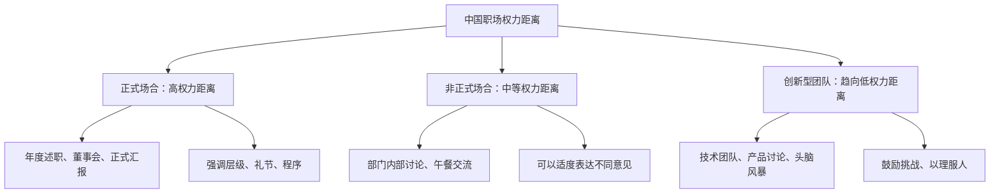
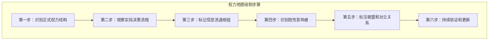
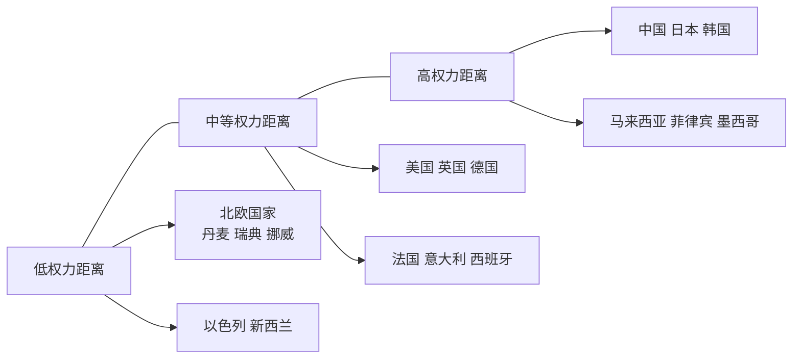

## 六、权力动态与沟通策略

权力理论帮我们理解了权力的来源和分类（见第二节），但理论本身不能直接指导你在具体场景中说什么、怎么说。本节的核心任务是将权力认知转化为**可执行的沟通行动**——当权力关系影响了沟通的每一个环节时，你该如何调整自己的沟通策略，以在不同权力位置上都能有效推动目标。

### 6.1 权力如何塑造沟通：底层机制

#### 6.1.1 权力对沟通的五重影响

权力不是沟通的"背景"，而是沟通的"操作系统"。它从五个维度深度塑造了每一次组织沟通的走向：

| 影响维度 | 具体表现 | 底层机制 |
|---------|---------|---------|
| **信息流** | 权力高者获取信息更多、更早、更全面 | 组织层级天然制造信息不对称 |
| **话语权** | 权力高者发言被认真对待，权力低者发言常被忽略或打断 | 权威偏差（Authority Bias）导致人们自动给高权力者更多注意力 |
| **议题设置** | 权力高者决定"讨论什么"，权力低者只能在被设定的框架内回应 | 谁设定议题，谁就控制了讨论的边界 |
| **决策权重** | 同样的论点，从高权力者口中说出权重更大 | 信源可信度效应（Source Credibility Effect） |
| **情绪劳动** | 低权力者需要付出更多情绪劳动来"管理印象" | 权力不对称导致低权力者更在意对方感受 |

**实际含义**：这意味着同样一句话，从不同权力位置说出，效果截然不同。"我觉得这个方案需要再想想"——如果出自CEO，项目可能被叫停；如果出自实习生，可能被直接忽略。理解这个机制，不是让你放弃表达，而是让你**选择最有效的表达方式**。

#### 6.1.2 权力距离如何影响沟通模式

荷兰社会心理学家吉尔特·霍夫斯泰德（Geert Hofstede）提出的"权力距离"（Power Distance）概念，描述了一个社会或组织中，权力分配不平等被接受的程度。这个维度深刻影响着组织中的沟通模式。

**高权力距离环境（典型：东亚企业、传统国企、军事组织）**：

在这种环境中，沟通呈现出鲜明的层级特征：
- **向上沟通**：下属倾向于过滤负面信息，使用敬语和间接表达，避免直接反驳上级。"领导，这个方案有一些地方我们可以再优化一下"是常见的委婉反对方式。
- **向下沟通**：上级更倾向于指令式沟通，期望下属执行而非讨论。"这个事情就这么定了"是典型的高权力距离表达。
- **会议动态**：发言顺序往往按级别从高到低，级别最高者通常最后表态以避免"定调"过早（但实际上，大家往往等待最高级别者先表态）。
- **冲突处理**：公开冲突被视为对权威的挑战，分歧更多在私下解决。

**低权力距离环境（典型：硅谷科技公司、北欧企业、扁平化创业公司）**：

- **向上沟通**：下属可以直接表达不同意见，甚至可以公开挑战上级的决策。"I disagree, and here's why..."是被鼓励的表达方式。
- **向下沟通**：上级更多使用建议和讨论的方式，而非指令。"What do you think?"是常见的管理口头禅。
- **会议动态**：发言不按级别排序，最佳论点胜出而非最高职位者胜出。
- **冲突处理**：建设性冲突被视为创新的来源，公开辩论是常态。

**现实中的混合状态**：

大多数中国职场环境处于两者之间，并且在不同场景中表现出不同的权力距离：

**关键启示**：你不能用同一套沟通方式应对所有权力距离环境。识别当前场景的权力距离水平，并相应调整你的沟通风格，是职场政治沟通的基本功。

### 6.2 根据权力位置调整沟通策略

你在组织中的权力位置不同，沟通策略也应该不同。以下是三种典型权力位置的沟通框架。

#### 6.2.1 当你是"高权力者"时的沟通策略

高权力者（管理者、决策者、资深专家）在沟通中面临的核心挑战不是"怎么说别人会听"，而是**如何避免权力扭曲信息流**。

**核心问题**：当你拥有较高权力时，周围的人会本能地过滤传递给你的信息——好消息被放大，坏消息被隐藏，不同意见被软化。这不是因为下属不诚实，而是因为权力不对称改变了他们的行为动机。

**四个沟通原则**：

**原则一：主动降低信息壁垒**
- 定期与一线员工直接对话，跳过中间管理层。杰克·韦尔奇在GE推行的"群策群力"（Work-Out）会议，就是让高管直接听取基层员工的声音。
- 在会议中最后一个发言，避免你的观点成为"标准答案"。
- 使用匿名反馈渠道收集真实意见。

**原则二：区分"同意"和"服从"**
- 当所有人对你的提案都表示同意时，追问一句："如果这个方案会失败，最可能的原因是什么？"
- 刻意指定一个人扮演"魔鬼代言人"（Devil's Advocate），专门提出反对意见。
- 观察非语言信号：真正认同的点头和礼貌性的点头在节奏和深度上有明显差异。

**原则三：用问题替代指令**
- 把"我们应该做X"换成"关于X，你们怎么看？有哪些风险？"
- 把"这个不行"换成"这个方案的核心假设是什么？如果假设不成立会怎样？"
- 这不是软弱，而是通过提问引导团队深度思考，同时获取更真实的信息。

**原则四：管理你的"权力辐射"**
- 你随口说的一句话，可能被下属理解为"重要指示"。"这个功能挺有意思的"可能让团队花三周时间去开发一个你只是随口一提的想法。
- 在表达非正式想法时，明确标注："这只是我个人的好奇，不是工作指令。"
- 减少不必要的"突然造访"——你的出现本身就会改变团队的行为模式。

#### 6.2.2 当你是"低权力者"时的沟通策略

低权力者（新人、基层员工、跨部门协作者）在沟通中面临的核心挑战是**如何在没有正式权力的情况下推动目标**。

**核心问题**：你的声音容易被忽略，你的诉求容易被搁置，你的反对容易被解读为"不服从"。

**五个沟通原则**：

**原则一：用"信息权力"补偿"职位权力"**
- 在向上沟通之前，做好充分的数据准备。"我觉得这个方案有问题"不如"这个方案在过去三个类似项目中的失败率是67%，主要原因是X和Y"。
- 成为某个领域的"信息枢纽"——当你总是能提供别人不知道的有价值信息时，你的发言权会自然增加。
- 接话之前先做功课：了解决策者的优先级、压力来源和未说出的顾虑。

**原则二：用"提问"替代"反对"**
- 直接说"我不同意"会触发权力防卫机制。用提问的方式引导对方自己发现漏洞：
  - "如果客户不接受这个价格，我们的备选方案是什么？"
  - "这个时间线考虑了测试周期吗？"
  - "我们是否评估过对XX部门的影响？"
- 提问的力量在于：它让对方保持"决策者"的角色感，同时把你的顾虑植入了讨论。

**原则三：借力——引用更高权威**
- 当你的观点需要额外支撑时，引用更高权威的数据或观点：
  - "行业报告显示……"
  - "上次CEO在全员会上提到……"
  - "根据我们与客户沟通的反馈……"
- 这不是"狐假虎威"，而是将你的观点嵌入一个更大的权威框架中，降低被忽视的概率。

**原则四：选择合适的沟通时机和场景**
- 一对一场景比公开会议更适合表达不同意见——对方不需要在众人面前"维护权威"。
- 在决策做出之前提出异议，而非决策做出之后。事后反对会被视为"不服从"，事前建议会被视为"专业贡献"。
- 如果必须在公开场合表达不同意见，先肯定方案的合理之处，再提出你的补充视角："这个方向我很认同，在执行层面我有一个补充想法……"

**原则五：积累"信用额度"**
- 每一次高质量的交付、每一次准确的预判、每一次主动补位，都在你的"信用账户"中存入了一笔。
- 当你的信用额度足够高时，你的反对意见会被认真对待——因为大家知道你不是在"找麻烦"，而是在"防风险"。
- 反之，如果你的信用额度为零，即使你说的是对的，也可能被忽略。

#### 6.2.3 当你处于"中间层"时的沟通策略

中间层（中层管理者、项目负责人、资深员工）是权力动态最复杂的位置——你既有向上管理的压力，又有向下领导的责任，还有横向协调的需求。

**核心挑战**：你经常需要"翻译"——把高层的战略语言翻译成执行层的行动语言，把基层的实际困难翻译成高层能理解的风险语言。

**沟通策略框架**：

| 沟通方向 | 核心策略 | 具体做法 |
|---------|---------|---------|
| 对上 | 做"解决方案提供者"而非"问题搬运工" | 呈报问题时附带2-3个备选方案及其优劣分析 |
| 对下 | 做"信息缓冲器"而非"传声筒" | 过滤高层焦虑，传达清晰的行动指引 |
| 横向 | 做"价值连接者"而非"资源争夺者" | 寻找跨部门的利益交集，建立互惠关系 |

### 6.3 通过沟通信号识别权力动态

权力关系不会写在组织架构图上——真实的权力动态隐藏在沟通的细节中。学会"读"这些信号，是职场政治沟通的必备技能。

#### 6.3.1 会议中的权力信号

会议是权力动态的"浓缩舞台"。以下信号可以帮助你快速识别真实的权力格局：

**发言权分配**：
- 谁的发言不会被打断？——拥有最高话语权的人。
- 谁在别人发言时频繁看手机？——他在用非语言方式表达"你的发言对我不重要"。
- 谁的发言总能引发讨论？——真正的影响力中心。
- 谁说完之后会出现沉默？——可能是因为他的观点太有分量让人需要消化，也可能是因为没有人愿意回应。

**座位选择**：
- 会议桌两端通常是权力位置——能同时看到所有人。
- 紧邻决策者的位置通常是"心腹"位置。
- 选择角落或远离中心的位置，可能意味着自我边缘化或策略性低调。

**决策信号**：
- 谁的话能结束讨论？"好，就这么定了"——这是最终决策者。
- 谁的意见被引用最多？"就像XX刚才说的……"——这是影响力中心。
- 谁在会后被留下来单独聊？——这是决策者真正信任的人。

#### 6.3.2 日常沟通中的权力信号

**邮件和即时通讯**：
- 抄送（CC）名单暗含权力逻辑：谁被抄送了说明谁需要知道；谁被放在"收件人"而非"抄送"说明谁被期望采取行动。
- 回复速度反映权力不对称：下属通常秒回上级消息，上级回复下属可能需要几小时甚至几天。
- 群聊中的反应模式：权力高者的发言会获得更多"收到""好的"的回应。

**非语言信号**：
- 谁在走廊里被拦住聊天最多？——信息枢纽和关系中心。
- 谁的办公室门总是开着/关着？——开放程度暗示权力安全感。
- 谁在午餐时总是被邀请？——社交权力的体现。

#### 6.3.3 权力地图的绘制方法

将观察到的信号整合为一张可视化的权力地图：

**绘制工具——利益相关者分析矩阵**：

| 人物 | 正式权力 | 非正式影响力 | 对你的态度 | 核心利益 | 沟通策略 |
|------|---------|------------|----------|---------|---------|
| 张总（CEO） | 最高 | 高 | 中性 | 增长、效率 | 季度汇报，用数据说话 |
| 李经理（直属上级） | 高 | 中 | 支持 | 团队绩效、个人晋升 | 周报+及时风险预警 |
| 王工（技术元老） | 低 | 很高 | 友好 | 技术方向、团队稳定 | 定期请教，尊重专业意见 |
| 赵姐（CEO助理） | 低 | 高 | 中性 | 工作顺利、被尊重 | 维护好关系，信息互换 |

这张表格需要每季度更新一次——权力格局在持续变化。

### 6.4 权力转移期的沟通策略

权力转移是组织中最敏感的时刻，也是沟通风险最高的时刻。掌握权力转移期的沟通策略，可以帮助你在变局中找到机会。

#### 6.4.1 识别权力转移的信号

权力转移不会突然发生，它有明确的前兆信号：

| 信号类型 | 具体表现 | 可能含义 |
|---------|---------|---------|
| 信息流变化 | 某人突然不再被邀请参加重要会议 | 该人可能正在被边缘化 |
| 决策风格变化 | 原本民主的领导突然独断，或原本独断的领导突然民主 | 可能在为重大变革做准备 |
| 人事异动 | 关键岗位的突然调整或招聘 | 权力版图正在重组 |
| 资源重新分配 | 预算、人员、项目的重新调配 | 新的权力中心正在形成 |
| 高层互动频率 | 某人与高层的互动突然增多或减少 | 被信任或被疏远的信号 |

#### 6.4.2 新领导上任期的沟通策略

新领导上任是职场中最常见的权力转移场景。这一阶段的沟通策略直接决定了你在新格局中的位置。

**第一阶段：观察期（前1-3个月）**

新领导上任初期，最重要的沟通策略是**多听少说、多观察少表态**。

- 不要急于展示自己——新领导需要时间建立对团队的认知，过早的"刷存在感"可能适得其反。
- 认真观察新领导的沟通风格：他喜欢邮件还是面谈？喜欢详细汇报还是抓重点？喜欢数据驱动还是直觉决策？
- 通过观察新领导的提问方式，判断他最关心什么：是效率？是创新？是稳定？是关系？
- **关键**：不要在新领导面前评价前任领导——无论好坏。这是最安全的立场。

**第二阶段：试探期（3-6个月）**

新领导开始形成对团队的判断，这是你展示价值的窗口期。

- 主动找新领导进行一对一沟通，了解他的期望和优先级。开场可以用："我想更好地配合您的工作节奏，方便聊聊您对团队的期望吗？"
- 提供有价值的信息——你了解的历史背景、潜在风险、团队成员的特点。但要注意：是"客观信息"而非"个人评价"。
- 承接一个新领导重视的项目，用交付质量建立信任。

**第三阶段：稳定期（6个月以后）**

信任关系初步建立，沟通进入正常轨道。

- 建立固定的沟通节奏——周报、月度复盘、季度规划。
- 开始在专业领域提供建设性意见——此时你的"反对"会被视为"专业贡献"而非"不服从"。
- 如果你与新领导的风格确实不匹配，这一阶段需要做出理性判断：适应还是转移。

#### 6.4.3 组织重组期的沟通策略

组织重组（部门合并、拆分、战略调整）是权力洗牌最剧烈的时期。

**核心原则：减少不确定性暴露，增加价值可见度**。

- **不要**在重组初期站队或表态——局势未明时的站队是赌博。
- **要**保持正常工作节奏和高质量交付——在混乱中保持稳定本身就是一种价值。
- **不要**传播关于重组的小道消息——这是最容易"踩雷"的领域。
- **要**主动与可能的新上级建立联系——非正式地了解他们的期望和风格。
- **不要**消极等待——主动了解重组后的业务方向，提前准备你需要的技能和知识。

### 6.5 信息不对称下的沟通博弈

信息是权力的核心货币。在信息不对称的环境中，沟通策略需要特别设计。

#### 6.5.1 当你掌握信息优势时

**策略：有节奏地释放信息，最大化信息的价值**。

- 不要一次性释放所有信息——分批释放可以持续保持你的信息价值。
- 选择释放对象：先释放给你希望拉近关系的人，建立互惠。
- 释放方式很重要："我听说了一个消息，不确定真假，你帮我判断一下"比"我告诉你一个秘密"更安全——前者给你留了退路。
- **底线**：不要利用信息优势操纵他人或损害组织利益。信息权力的滥用一旦被发现，信任崩塌的速度远快于建立的速度。

#### 6.5.2 当你处于信息劣势时

**策略：主动扩大信息来源，降低信息盲区**。

- **建立多元信息渠道**：不要只依赖一个信息源。与不同部门、不同层级的人保持沟通，交叉验证信息。
- **成为信息交换节点**：主动分享你掌握的信息（在允许范围内），换取别人愿意与你分享。信息流通是双向的。
- **提出好问题**：当你不知道答案时，好的问题比假装知道更有效。"关于这个决策，我需要了解哪些背景信息？"比沉默更有价值。
- **利用公开信息**：公司公告、行业报告、会议纪要、邮件抄送列表——这些公开信息中蕴含大量有价值的信号。

### 6.6 权力动态沟通的常见误区

#### 6.6.1 误区一：把"沟通"等同于"说话"

很多人认为权力沟通就是"怎么说"，但更关键的是**"听什么"和"不说什么"**。

- **高权力者的沉默**比发言更有力量——你的沉默会被解读为不满、思考、或默认。
- **低权力者的倾听**比表达更有价值——通过倾听，你获取了信息、展示了尊重、赢得了信任。
- **关键场景**：当上级问你"你觉得呢？"时，他可能真的在征求意见，也可能只是走个形式。判断的方法：观察他问这个问题时的上下文——是在做决策前（真征求意见），还是在宣布决策后（走形式）。

#### 6.6.2 误区二：忽视非正式沟通渠道

正式渠道（会议、邮件、报告）只展示了组织运作的表层。真正的决策往往在非正式渠道中形成：

- 午餐桌上的闲聊可能比会议室里的讨论更接近真相。
- 走廊里的随口一提可能比正式提案更有效。
- 会前五分钟的私聊可能决定了会议的走向。

**实操建议**：投入至少30%的沟通精力在非正式渠道上——午餐、茶歇、团建、甚至电梯里的偶遇。不要只在"有事"的时候才找人沟通。

#### 6.6.3 误区三：只看权力表面，不看权力本质

**典型错误**：只关注组织架构图上的层级关系，忽视实际的影响力网络。

- 老板的助理可能比副总裁更有实际影响力——因为他控制着老板的信息入口。
- 一个普通技术员工可能比技术总监更有话语权——因为他的代码支撑着公司的核心产品。
- 一个快要退休的老员工可能比新晋经理更有分量——因为他了解所有的"历史遗留问题"。

**纠正方法**：每次进入新的组织或团队，花两周时间绘制权力地图（参见6.3.3），而不是只看组织架构图。

#### 6.6.4 误区四：过度政治化

有些人在理解了权力动态之后，变得"看什么都像政治"，导致：
- 把正常的工作讨论解读为权力博弈，过度分析。
- 对所有善意都保持怀疑，认为"没有无缘无故的好"。
- 沟通时字斟句酌、滴水不漏，反而失去了真诚和自然。

**纠正方法**：权力动态分析是你的"后台雷达"，不是你的"前台表演"。在90%的日常沟通中，保持真诚和专业就够了。只在关键节点（利益冲突、权力转移、重要谈判）时启动你的政治敏感度。

### 6.7 进阶：跨文化权力沟通策略

在全球化职场中，跨文化权力沟通是高阶能力。不同文化对权力的理解和表达方式差异巨大，不了解这些差异会导致严重的沟通误解。

#### 6.7.1 权力距离的文化光谱

#### 6.7.2 跨文化权力沟通的实操指南

| 场景 | 低权力距离文化 | 高权力距离文化 |
|------|-------------|-------------|
| 向上级提意见 | 直接表达，用数据支撑 | 私下沟通，先肯定再建议 |
| 会议发言 | 主动发言是积极表现 | 等被点名再发言是尊重 |
| 邮件称呼 | 直呼其名（Hi John） | 使用尊称（尊敬的王总） |
| 决策参与 | 期望被咨询意见 | 期望被告知结果 |
| 冲突处理 | 公开辩论是健康的 | 私下调解是得体的 |

**关键原则**：在跨文化环境中，宁可过度尊重（在高权力距离文化中被认为"懂规矩"），也不要过度随意（在高权力距离文化中被认为"没大没小"）。调整成本远低于修复被破坏的关系。

### 6.8 权力动态沟通的实战工具

#### 6.8.1 沟通前的权力检查清单

在每一次重要沟通前，花两分钟回答以下问题：

1. 我和对方的权力关系是什么？
   □ 我权力更高  □ 对方权力更高  □ 大致对等

2. 对方的核心利益是什么？
   写下：_____________________

3. 我的信息优势在哪里？
   □ 我知道对方不知道的信息
   □ 对方知道我不知道的信息
   □ 信息大致对称

4. 对方最可能的反对理由是什么？
   写下：_____________________

5. 我的最佳沟通策略是？
   □ 直接陈述  □ 提问引导  □ 数据说服
   □ 借力打力  □ 私下沟通  □ 公开讨论

#### 6.8.2 权力动态复盘模板

每次重要的权力相关沟通结束后，花五分钟记录：

事件：_____________________
我的权力位置：_____________________
我使用的策略：_____________________
对方的反应：_____________________
实际结果 vs 预期结果：_____________________
下次可以改进的地方：_____________________

坚持记录3个月，你会发现自己对权力动态的敏感度和应对能力有显著提升。

### 6.9 本节小结

权力动态与沟通策略的关系可以概括为一个核心公式：

> **有效沟通 = 读懂权力格局 × 选择适配策略 × 持续动态调整**

具体而言：
- **权力塑造沟通的每一个维度**——信息流、话语权、议题设置、决策权重、情绪劳动，无一不受权力关系的影响。
- **你的权力位置决定了你的沟通策略**——高权力者要防止信息失真，低权力者要用信息和专业补偿职位权力的不足，中间层要做"翻译者"和"连接者"。
- **权力信号隐藏在沟通细节中**——会议发言权、邮件抄送、座位选择、回复速度，都是权力格局的映射。
- **权力转移期是最需要策略性沟通的时刻**——新领导上任、组织重组、业务转型，都是风险与机遇并存的关键窗口。
- **跨文化环境中，权力距离是必须校准的变量**——同一句话在不同文化中的含义可能截然相反。

最后，记住一个原则：**理解权力动态的目的不是"玩政治"，而是在复杂的组织环境中更有效地推动正确的事情发生。** 最高明的权力沟通，是让所有人都觉得自己赢了。

***
