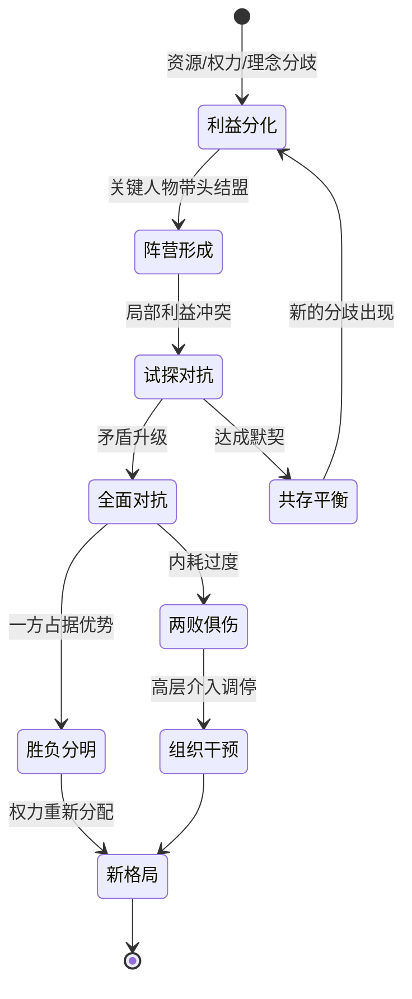

## 七、办公室政治的常见模式

办公室政治虽然千变万化，但剥开表象，其底层运行逻辑可以归纳为六种典型模式。每种模式都有清晰的触发条件、可识别的行为信号和相对成熟的应对策略。掌握这六种模式，你就能在复杂的组织环境中快速判断"正在发生什么"，并选择恰当的沟通与行动方案。

这六种模式并非彼此独立——在真实的组织场景中，它们往往交织出现、相互转化。一个资源争夺的场景可能迅速演变为联盟对抗，而联盟对抗的结果又可能催生新的边缘化现象。因此，学习的重点不仅是识别单一模式，更是理解模式之间的转化逻辑。

### 7.1 信息垄断模式

#### 模式本质

信息是组织中最重要的非正式权力资源。谁掌握了关键信息的获取渠道和分发权，谁就拥有了远超其正式职位的影响力。信息垄断模式的核心逻辑是：**通过控制信息的流动来巩固自身地位、影响他人决策、获取不对称优势。**

哈佛大学信息社会学研究发现，组织中约 70% 的关键决策信息通过非正式渠道传播，而非正式渠道的控制权往往掌握在少数"信息中介人"手中。这意味着，即使你拥有足够的正式权力，如果被排除在信息网络之外，你的决策质量也会大打折扣。

信息垄断之所以比其他模式更具隐蔽性，是因为它不需要任何对抗行为。信息垄断者不必打压你，只需要"忘记通知"你——而这种"遗忘"几乎无法被追溯或追责。

#### 典型表现

信息垄断模式在组织中有以下典型行为信号：

**信息截流**。某些人充当信息的"看门人"，决定哪些信息传递给谁、以什么形式传递、在什么时机传递。例如，部门经理在参加完高层会议后，只向下级传达对自己有利的部分信息，而选择性地忽略可能削弱自身权威的内容。

**信息延迟**。通过控制信息的传递时间来制造优势。比如，某个关键项目的决策已经做出，但相关负责人故意延迟通知利益相关方，使其错过最佳应对窗口。

**信息扭曲**。在传递信息的过程中添加主观解读或选择性强调，使接收者形成有利于信息传递者的认知。例如，将"公司可能进行组织调整"放大为"公司即将大规模裁员"，借此操纵他人的行为。

**信息套利**。利用信息差在不同群体之间进行"交易"——用从A处获得的信息换取B处的信任和资源，再用从B处获得的信息巩固与A的关系。这种人往往在组织中人缘极好，但其影响力完全建立在信息不对称的基础上。

**建立排他性信息网络**。通过私人聚餐、小群聊天、一对一沟通等方式建立只对特定成员开放的信息交流圈，圈外人被系统性地屏蔽在关键信息之外。

#### 真实场景还原

> **场景：技术总监的信息茧房**
>
> 张明是某互联网公司的后端工程师，入职半年表现优异。但他发现一个奇怪的现象：部门的技术方案评审会，他总是事后才收到会议纪要；产品路线图的调整，他要等正式公告才知道；甚至连团队聚餐，他都是在朋友圈看到照片后才得知。
>
> 根源在于技术总监的"信息管理"方式。总监习惯在茶歇时间与核心成员非正式讨论技术决策，正式会议只是走过场。而张明因为不抽烟、不参加午间篮球，完全被排除在这个非正式信息圈之外。总监并非有意针对张明，只是在用自己最习惯的方式运作——但客观效果是，张明对团队方向的理解永远比别人慢半拍，他的方案也因此频繁与团队方向脱节。
>
> **破解之道：** 张明开始主动创造信息接触点。每周主动找总监做15分钟的1对1沟通（"我想确认一下本周的优先级是否还正确"），主动在Slack上分享行业技术动态（建立信息互惠），加入团队的技术分享小组（创造非正式接触机会）。三个月后，他从"信息孤岛"变成了团队技术讨论的核心参与者。

#### 识别信号

以下信号表明你可能正处于他人的信息垄断结构中：

| 信号 | 具体表现 | 严重程度 |
|------|----------|----------|
| 事后才知道 | 重要决策、人事变动、项目方向等关键信息，你总是最后一个知道 | ⚠️ 中等 |
| 信息不一致 | 从不同渠道获得的同一事件信息存在明显差异，说明有人在选择性传递 | 🔴 严重 |
| 依赖单一来源 | 你获取关键信息的渠道高度集中于某一个人，此人成为你唯一的"信息窗口" | 🔴 严重 |
| 被建议"不要问" | 当你试图从其他渠道获取信息时，有人暗示或明示你"不需要知道" | 🔴 严重 |
| 会议后补通知 | 关键会议结束后才收到纪要或通知，而你在会议发生时完全不知情 | ⚠️ 中等 |
| 信息与权力匹配异常 | 某些职级不高但信息掌握量异常丰富的人，往往在实际决策中有超出其职位的影响力 | ⚠️ 中等 |
| "我也是刚知道" | 当你质问为何没有提前通知时，对方常用"我也刚知道"来搪塞，但你事后发现此人早已知情 | 🔴 严重 |

#### 应对策略

**建立多元信息网络。** 不要依赖单一信息来源。有意识地在组织的不同层级、不同部门建立信息触点。具体做法包括：定期与其他部门的同事共进午餐，参加跨部门的项目或活动，保持与前同事的联系。社会学家格兰诺维特的"弱关系理论"表明，那些不太亲密但处于不同社交圈的人，往往能为你带来最有价值的新信息。

**成为信息提供者。** 打破信息垄断最有效的方式不是索取，而是给予。主动分享有价值的信息（不涉及机密），建立"信息互惠"的关系。当你成为信息网络中的一个重要节点时，信息自然会向你汇聚。具体做法：发现一篇行业报告，分享给可能感兴趣的同事；了解到一个跨部门的项目进展，主动告知相关方。

**直接验证关键信息。** 对于影响重大决策的信息，不要仅依赖二手传递。在条件允许时，通过直接参与会议、阅读原始文件、与信息源直接沟通等方式进行验证。可以用以下话术自然地实现信息直达：

- "这个项目的最新进展我想了解一下细节，方便我直接跟X总确认一下吗？"
- "关于这次组织调整，我想从HR那边了解一下正式的口径，你有联系方式吗？"
- "我看到会议纪要里提到几个关键决策，有几个细节想跟参会的同事当面确认一下。"

**减少对信息垄断者的依赖。** 如果你发现自己高度依赖某一个人获取信息，要有意识地降低这种依赖。方法是逐步拓展其他信息渠道，同时在与信息垄断者的互动中保持独立判断——不因其掌握信息就对其言听计从。

**利用组织正式机制。** 善用组织中的正式信息渠道：定期的一对一会议（与上级）、部门周报、公司内部通讯、公告板、知识管理系统等。当正式信息渠道畅通时，非正式信息垄断的空间会被压缩。

#### 信息垄断的反制话术模板

| 场景 | 话术 | 目的 |
|------|------|------|
| 被排除在会议外 | "这个议题我也很关注，下次会议能拉上我吗？我可以从XX角度提供输入。" | 以价值贡献换取参与权 |
| 发现信息延迟 | "这个信息我之前不知道，以后类似的重要事项能提前同步我吗？这样我能更早做好准备。" | 建立提前通知的预期 |
| 信息来源单一 | "我想多了解几个角度，除了你的版本，还有哪些同事参与了这个项目？" | 拓展信息渠道 |
| 被要求"不要多问" | "理解，不过这个决策影响到我负责的XX工作，我需要了解足够的信息来做好配合。" | 以工作需要为正当理由 |

---

### 7.2 资源争夺模式

#### 模式本质

组织中的资源永远是有限的——预算、人力、晋升名额、优质项目、展示机会、培训资源、办公空间，甚至包括领导的注意力和时间。当多方对有限资源产生需求时，资源争夺模式就会自然出现。

资源争夺是职场政治中最常见、最直接的模式，也是最容易被感知到的。它的核心逻辑是：**在零和或接近零和的条件下，各方通过正式和非正式手段争取稀缺资源的分配权。**

需要特别注意的是，资源争夺不一定是"你死我活"的。博弈论的研究表明，大多数资源争夺场景都可以通过创造性思维从"零和博弈"转化为"正和博弈"——关键在于是否能够"做大蛋糕"而不仅仅是"争抢现有蛋糕"。

#### 典型表现

**预算争夺。** 每年的预算分配季是资源争夺最集中的时期。各部门为了争取更多预算，会动用各种手段——夸大本部门项目的ROI、强调不投入的风险、利用与高层的关系施加影响、甚至通过贬低其他部门的项目来为自己腾出空间。

**晋升名额竞争。** 当组织中高级职位空缺有限时，符合条件的候选人之间会形成激烈的竞争。这种竞争不仅体现在工作成果的比拼上，更体现在谁能获得更多关键人物的支持、谁能在关键时刻展现领导力、谁的"被看见度"更高。

**项目资源争夺。** 优质项目（高曝光度、高层关注、好出成果的项目）是有限的。谁获得了这些项目，谁就拥有了快速晋升的跳板。围绕项目分配的博弈，往往在项目正式立项之前就已经开始。

**人力争夺。** 核心人才是稀缺资源。部门之间争夺优秀员工、项目经理争夺骨干成员，是组织中常见的资源博弈场景。这种争夺有时会以"借调""轮岗""项目支援"等名义出现。

**注意力资源争夺。** 高层管理者的时间和注意力是极度稀缺的资源。谁能在高管面前获得更多"露脸"机会、谁的汇报能占据更多议程时间，谁就在组织中拥有更多的话语权。

#### 真实场景还原

> **场景：两个产品线争夺同一个数据团队**
>
> 某电商公司的A产品线和B产品线同时启动了数据驱动项目，都需要公司唯一的数据分析团队支持。A产品线总监直接找到数据团队负责人，用"CEO亲自关注"的名义争取优先排期；B产品线经理则采取迂回策略，先帮数据团队解决了一个他们长期头疼的数据质量问题，建立了信任后再提出需求。
>
> 最终结果出人意料：数据团队负责人向CEO建议组建一个"数据中台"，同时服务两条产品线，由A和B各出一半人力共建。这个方案不仅解决了眼前的争夺，还为公司建立了长期的数据能力。
>
> **启示：** 纯粹的"争抢"往往导致零和结果；而有能力"重新定义问题"的人，可以将资源争夺转化为组织能力的建设。

#### 资源争夺的博弈分析

用博弈论的视角来看，资源争夺存在以下几种典型博弈结构：

| 博弈类型 | 特征 | 典型场景 | 最优策略 |
|----------|------|----------|----------|
| 纯零和博弈 | 一方所得即另一方所失 | 唯一的晋升名额 | 差异化竞争，扩大自身优势 |
| 重复博弈 | 争夺反复发生，有长期关系 | 年度预算分配 | 建立互惠记录，长期合作 |
| 多方博弈 | 多于两方参与竞争 | 跨部门项目主导权 | 建立联盟，寻找共同利益 |
| 信息不对称博弈 | 各方掌握的信息量不同 | 并购重组中的人事安排 | 获取信息优势，保持灵活 |

#### 应对策略

**做大蛋糕——将零和转化为正和。** 这是资源争夺中最高级的策略。当两个部门争夺同一笔预算时，能否找到一个让双方都受益的方案？例如，A部门需要预算做产品开发，B部门需要预算做市场推广——如果能找到一个"联合项目"，将产品开发与市场推广打包，以更大的商业价值向高层争取，就可能获得超过双方分别争取的总预算。

**展示不可替代的独特价值。** 在资源竞争中，说服决策者的最有力论据不是"我也应该得到"，而是"如果我不得到，组织会损失什么"。将自己的价值主张与组织的核心目标绑定，让决策者意识到资源分配给你不是"公平"问题，而是"效率"问题。

**建立联盟扩大影响力。** 一个人的声音容易被忽略，但一个群体的声音难以忽视。在资源争夺中，与利益一致的同事或部门建立联盟，可以显著提高话语权。但联盟的建立必须基于真诚的共同利益，而非临时的利益交换。

**用数据和事实替代情绪和主张。** 在资源争夺中，最具说服力的不是"我觉得很重要"，而是"数据显示这是最值得投入的"。准备充分的数据支持——ROI分析、风险评估、对标案例、历史数据——能让你的资源争取从主观判断升级为客观论证。

**接受合理的妥协。** 不是每一场资源争夺都值得全力以赴。学会评估投入产出比：争取这个资源需要投入多少政治资本？失败的代价是什么？有时候，战略性地"让步"某次资源争夺，把政治资本保留到更重要的战场，是更明智的选择。

#### 资源争取的汇报模板

在正式的资源争取场景（如预算评审会、项目立项会）中，使用以下结构化的汇报框架：

1. 背景与痛点（1分钟）
   - 用一个具体的业务痛点开场，而非泛泛而谈
   - "上季度因XX问题导致的直接损失是XXX万元"

2. 方案与价值（3分钟）
   - 明确资源需求（具体到人/钱/时间）
   - 量化预期收益（ROI、效率提升百分比、风险降低幅度）
   - 对比：不投入的代价是什么？

3. 竞争力分析（1分钟）
   - 与替代方案的对比（为什么这个方案优于其他选项）
   - 与行业标杆的对比（竞品在做什么）

4. 风险与缓释（1分钟）
   - 主动提出风险点（增加可信度）
   - 配套的风险缓释措施

5. 明确诉求（30秒）
   - 具体需要什么资源、什么时间到位
   - 决策者需要做什么（签批、拨款、协调）

---

### 7.3 联盟对抗模式

#### 模式本质

当组织中的利益冲突不是发生在个体之间，而是发生在群体之间时，就会出现联盟对抗模式。联盟对抗是资源争夺的升级版本——个体的零散竞争演化为有组织的阵营对垒。

联盟对抗的核心逻辑是：**通过结盟来增强自身的博弈筹码，同时形成对对立阵营的相对优势。** 在这种模式下，个人的立场和行为往往不由个人意志决定，而是由其所属联盟的集体利益所驱动。

组织行为学研究表明，联盟对抗在以下条件下最容易出现：（1）组织面临重大变革或重组；（2）高层权力出现真空或分裂；（3）核心资源分配规则发生改变；（4）组织文化中存在强烈的"忠诚"导向。

#### 典型表现

**以核心人物为中心的辐射型联盟。** 某位高管或资深经理成为"盟主"，围绕其形成一个由直接下属、门生故旧、利益相关方组成的联盟网络。联盟成员通过忠诚换取保护、资源和晋升机会。典型信号：某位领导的下属在组织中形成了一个相对封闭的"圈子"，圈内人获得更多资源和机会。

**基于共同利益的松散型联盟。** 没有明确的"盟主"，但一群人因为共同的利益诉求（如反对某项改革、支持某个方案）而形成临时性的合作。这种联盟结构松散，但一旦共同利益受到威胁，能够迅速凝聚力量。

**理念驱动的对立型联盟。** 组织中形成两种截然不同的发展方向主张，支持者自然分化为两个阵营。例如，"激进创新派"与"稳健保守派"之间的路线之争。这种联盟对抗的持续时间最长、影响最深远，因为理念分歧不像利益分歧那样容易通过妥协来化解。

**跨层级的隐性联盟。** 表面上不存在联盟结构，但通过非正式关系网络（校友、前同事、老乡、共同爱好等）形成了跨越层级和部门的利益共同体。这种联盟最难识别，但其影响力往往超过正式组织结构所能解释的范围。

#### 真实场景还原

> **场景：技术派vs业务派的路线之争**
>
> 某金融科技公司的CTO和COO之间存在持续的理念分歧。CTO主张"技术驱动"——投入大量资源做底层架构升级、引入微服务、建设数据中台；COO主张"业务驱动"——所有技术投入必须有明确的业务回报，优先做能快速变现的功能。
>
> 两人各自形成了阵营：CTO阵营以技术团队为主，强调技术债务的积累会"迟早爆发"；COO阵营以产品和销售团队为主，强调"不赚钱的技术投入是浪费"。每次预算会议都变成两个阵营的角力场。
>
> 最终破局的是一位新任CFO。他没有站任何一方，而是引入了一个"技术投入产出评估框架"——所有技术项目必须回答"这个投入在12个月内如何产生可衡量的业务价值"。这个框架迫使CTO阵营用业务语言表达技术价值，也让COO阵营认识到某些技术投入虽然短期无回报但长期不可或缺。
>
> **启示：** 联盟对抗的最高级解法不是选边站，而是建立让双方都能"有面子"的游戏规则。

#### 派系斗争的动态演化

联盟对抗并非静止状态，而是一个不断演化的动态过程：

#### 联盟类型的特征对比

| 联盟类型 | 凝聚力 | 持续性 | 识别难度 | 典型信号 |
|----------|--------|--------|----------|----------|
| 辐射型（盟主制） | 高 | 长 | 低 | 某领导的下属形成了封闭圈子 |
| 松散型（利益制） | 中 | 短 | 中 | 特定议题上总有一群人立场一致 |
| 理念型（路线制） | 高 | 极长 | 低 | 组织中存在明显的"路线之争" |
| 隐性型（关系制） | 中 | 长 | 高 | 某些决策结果无法用正式结构解释 |

#### 应对策略

**不轻易站队——保持战略性模糊。** 在联盟对抗的早期阶段，不要急于选择阵营。过早站队意味着你放弃了灵活性，一旦所选阵营失势，你将面临被清洗的风险。更明智的做法是保持"战略性模糊"——让各方都认为你可能是潜在盟友，但又不确定你会完全倒向哪一边。

**与各方保持专业关系。** 即使组织中存在明显的派系对立，也不意味着你必须在人际层面与对立阵营断绝往来。保持与各方的专业关系和基本礼貌，不是"两面三刀"，而是维护职业素养。具体做法：在工作场合保持对所有同事的尊重，不参与针对特定阵营的负面议论，拒绝成为任何一方攻击另一方的"工具人"。

**用工作成果作为护身符。** 在派系斗争激烈的组织中，最可靠的保护不是站队，而是不可替代的工作能力。当你在自己的专业领域建立了足够的壁垒，无论哪个阵营掌权，都需要你的能力来推动业务。因此，在政治动荡期间，更要专注于把本职工作做到极致。

**掌握信息优势。** 联盟对抗中，信息是最重要的战略资源。了解各方的诉求、底线和策略，能帮助你做出更明智的判断。但要注意：获取信息是为了保护自己和做出正确决策，而不是为了"卖情报"或"两头通吃"。

**知道何时离开。** 如果联盟对抗已经严重到影响组织正常运转，或者你发现自己无法在各方之间保持平衡，那么"离开"可能是最明智的选择。离开不一定是辞职——调到其他部门、申请其他项目、暂时降低曝光度，都可以是"战略性撤退"的方式。

#### 联盟对抗中的自保话术

| 场景 | 话术 | 策略意图 |
|------|------|----------|
| 被某阵营拉拢 | "我很认同你说的方向，不过在这件事上我想先听听其他同事的看法，毕竟最终还是要看数据。" | 延迟表态，争取时间 |
| 被要求表态支持某方 | "这个问题我还在思考，我觉得双方都有道理。我能做的是把XX数据整理好，大家用事实说话。" | 转移到事实层面 |
| 被施压"你到底站哪边" | "我站业务结果这一边。谁能帮公司把这件事做好，我就支持谁的方案。" | 用组织利益为立场辩护 |
| 一方要求你透露另一方的信息 | "这个我不太方便说，毕竟是别人私下聊的。不过如果你关心XX议题，我可以分享一些公开的数据。" | 守住底线，提供替代价值 |

---

### 7.4 向上竞争模式

#### 模式本质

向上竞争模式发生在平级同事之间，争夺的核心资源是**上级的关注、信任和资源倾斜**。表面上大家各做各的工作，暗地里都在争取成为上级心目中的"第一人选"。

这种模式的特殊性在于：竞争的胜负往往不取决于工作成果的客观优劣，而取决于谁能更好地理解上级的需求、谁能更有效地展示自己的价值、谁能在关键时刻提供上级最需要的支持。

管理学家彼得·德鲁克（Peter Drucker）曾指出："管理上级是下属最重要的责任之一。"向上竞争模式的本质，就是多个下属在"管理上级"这个维度上展开的隐性竞赛。

向上竞争与其他模式的根本区别在于：**它几乎不可避免。** 只要你有上级，只要你的上级有多个下属，向上竞争就必然存在。区别只是程度——健康的向上竞争推动团队进步，恶性的向上竞争导致内耗崩塌。

#### 典型表现

**"露脸"竞争。** 争相在高层面前展示自己的工作成果——主动承接高曝光度的汇报任务、在重要会议上抢着发言、在上级面前强调自己的贡献。典型行为：某个项目明明是团队合作完成的，但某人在汇报时大量使用"我"而非"我们"。

**信息投喂竞争。** 竞相成为上级的"信息源"——主动向领导汇报各种动态、八卦、行业信息，以此建立与领导的亲密关系。这种竞争的极端形式是"告密文化"——通过向上级打小报告来获取信任。

**"第一响应"竞争。** 对上级的每一个需求、指示或暗示做出最快、最积极的响应。例如，领导在群里提了一个想法，有人立刻回复详细的执行方案；领导提了一个需求，有人加班到深夜就交出初稿。

**能力展示竞争。** 通过各种方式向领导展示自己的专业能力——撰写深度分析报告、提出创新方案、在跨部门会议中展现行业洞察。与"露脸"竞争不同，能力展示竞争更侧重于用实质内容赢得认可。

**"解题助手"竞争。** 竞相帮助上级解决棘手问题——主动承担困难任务、在领导遇到瓶颈时提供解决方案、在关键时刻为领导"救火"。这种竞争的核心逻辑是：谁帮领导解决了最关键的问题，谁就赢得了最大的信任。

#### 真实场景还原

> **场景：三个产品经理争夺总监的"首席幕僚"位置**
>
> 某SaaS公司的产品总监手下有三个产品经理：小王、小李、小陈。总监即将升任VP，需要从三人中选一个接任产品总监。
>
> 小王的策略是"勤奋路线"——任何需求都最快响应，经常加班到最晚，汇报频率最高。但他犯了一个错误：过度响应导致他的汇报质量不高，经常是"还没想清楚就先汇报"，给总监留下"执行强但缺乏深度"的印象。
>
> 小李的策略是"情报路线"——她善于收集各方面的信息，总能第一时间告诉总监"发生了什么"。但她的信息有时不够准确，偶尔传递了未经验证的消息，损害了她在总监心中的可信度。
>
> 小陈的策略是"解题路线"——她不抢着汇报，但每次总监遇到棘手问题（如客户投诉升级、跨部门协调僵局）时，她总能拿出有深度的分析和可行的方案。她的汇报频率不高，但"命中率"极高。
>
> 最终，小陈获得了晋升。总监的评价是："小陈不给我添麻烦，而是帮我解决问题。"
>
> **启示：** 向上竞争的核心不是"谁最勤奋"或"谁最会说话"，而是"谁能真正帮上级成功"。

#### 向上竞争的恶性循环与良性循环

向上竞争可以走向两个截然不同的方向：

**恶性循环**：竞争者之间互相提防→信息封锁和资源内耗→团队协作崩溃→整体绩效下降→上级对所有人失去信任→竞争更加激烈。最终结果是所有人都输了。

**良性循环**：竞争者之间形成默契→各自发挥独特优势→整体绩效提升→上级对团队更加信任→更多资源流入团队→每个人都有更大的发展空间。最终结果是所有人都赢了。

作为竞争者，你需要做的是推动竞争走向良性循环。方法是：在展现自身价值的同时，不贬低他人、不封锁信息、不破坏协作。

#### 应对策略

**深度理解上级的需求地图。** 向上竞争的本质是"谁能更好地满足上级的需求"。因此，第一步是真正理解上级的需求——不仅是表面的工作需求，更包括深层的个人需求。你的上级面临什么压力？他的上级对他有什么期望？他在意什么样的下属？他的雷区是什么？理解得越深，你的"投喂"就越精准。

**建立差异化的价值定位。** 不要在同一维度上与所有人竞争。如果同事A擅长数据分析，同事B擅长客户关系，那么你应该找到自己的独特优势——比如战略思考、危机处理或跨部门协调。差异化的价值定位让你在竞争中拥有不可替代性，而不是陷入同质化的内卷。

**成为上级的"解题助手"而非"传声筒"。** 向上管理的最高境界不是"听话照做"，而是"帮上级成功"。当上级遇到难题时，你能提供有洞察力的分析和可行的解决方案，这比任何"讨好"行为都更有价值。具体做法：在汇报问题时，永远带着至少两个解决方案和你的建议。

**建立"向上信任"的长期资产。** 向上竞争不是一次性博弈，而是长期的信任积累过程。关键行为包括：承诺的事情一定做到（可靠性）、犯错时主动承担责任（诚信度）、在上级不在时代为维护团队利益（忠诚度）、关键时刻给予真实但建设性的反馈（专业度）。

#### 向上汇报的"金字塔原则"

在向上竞争中，汇报质量直接决定你被"看见"的方式。使用以下结构确保每次汇报都高效有力：

结论先行（5秒内让上级知道你要说什么）
├── 核心论点1（数据支撑）
│   ├── 具体事实
│   └── 对业务的影响
├── 核心论点2（数据支撑）
│   ├── 具体事实
│   └── 对业务的影响
└── 行动建议（你想让上级做什么决定）
    ├── 方案A（推荐）
    └── 方案B（备选）

**反面案例：** "领导，关于XX项目，我调研了一下，发现市场上有好几家供应商，每家的报价都不太一样，有的便宜但售后不好，有的贵但质量好，我还问了几个同行，他们的意见也不统一……"——上级听了30秒还不知道你要说什么。

**正面案例：** "领导，XX项目建议选供应商A。三个原因：一、性价比最高，比B便宜30%但质量相当；二、售后响应速度行业前三；三、已有两个同行在用，口碑不错。如果同意，我明天就启动合同谈判。"——10秒内结论清晰，30秒内信息完整。

---

### 7.5 边缘化模式

#### 模式本质

边缘化模式是指某些个体或群体被系统性地排除在组织的核心信息流、决策过程和资源分配之外。边缘化可能是有意识的政治手段（如通过"冷冻"某个竞争对手来削弱其影响力），也可能是无意识的群体行为（如"圈内人"自然形成的排外倾向）。

边缘化模式的核心逻辑是：**通过切断某人与组织核心网络的连接，削弱其影响力和发展空间，最终迫使其主动退出或接受降级。** 这种模式的危险之处在于，它往往以"温和"的方式进行——不直接冲突、不公开对抗，但效果却非常致命。

边缘化是六种模式中**最具破坏性**的，因为它直接威胁职业生存。其他模式可能让你"赢少一点"或"赢慢一点"，但边缘化会让你"彻底出局"。

#### 典型表现

**信息隔离。** 被边缘化的人逐渐被排除在重要信息流之外——会议不被邀请、邮件抄送列表中被移除、关键决策不再事先通知。当一个人发现自己总是"事后才知道"的时候，往往意味着边缘化已经在发生。

**决策旁路。** 原本由你负责的事务被逐渐转移给他人，或者在做出与你相关的决策时跳过你的参与。例如，你的下属开始绕过你直接向更高层汇报，或者与你相关的项目决策不再征求你的意见。

**社交隔离。** 被排除在团队的非正式社交活动之外——午餐不再被邀请、下班后的聚会无人通知、团队内部的微信群聊中你越来越沉默。社交隔离是边缘化的早期信号，也是最容易被忽视的信号。

**能力质疑。** 通过持续的、微妙的方式质疑你的能力——对你的工作成果提出不合理的要求、在公开场合暗示你的不足、将你的成功归因于运气而将失败归因于能力。这种质疑往往不是直接的批评，而是通过比较、暗示和选择性强调来实现的。

**发展冻结。** 你的晋升、加薪、培训机会被持续搁置。不是明确拒绝，而是永远处于"再等等""下次优先考虑""需要更多时间评估"的状态。这种"温水煮青蛙"式的边缘化，让被边缘化的人难以找到明确的反抗理由。

**资源缩减。** 你管辖的预算、人员、项目被逐步削减，或者被分配越来越不重要的工作。从核心项目调到边缘项目，从关键岗位调到辅助岗位——每一次调整看起来都有"合理"的理由，但累积效果是系统性地削弱你的影响力。

#### 真实场景还原

> **场景：被"温柔地"请出核心圈**
>
> 刘芳是某快消公司的区域销售经理，连续三年业绩前三。但在新任销售VP上任后，她开始经历一系列微妙的变化：
>
> 第一个月：原本每周参加的销售策略会议，改成了"仅限总监级以上参加"（她只是经理级）。第二个月：她负责的华东大区被拆分为两个小区，其中一个划给了VP的前同事。第三个月：公司的年度销售大会，她没有获得演讲机会，取而代之的是另一位业绩不如她的经理。第四个月：她申请参加行业峰会，被告知"预算有限，优先安排其他同事"。
>
> 每一次调整都有"合理"的解释，但累积效果是：刘芳从公司的"销售明星"变成了一个"普通经理"。她花了几个月才意识到自己被边缘化了——而此时，VP已经用自己人替换掉了她的大部分核心资源。
>
> **破解之道：** 刘芳做了两件事。第一，她直接找VP进行了一次坦诚的对话："我注意到最近的工作安排有一些调整，我想了解一下您的期望，看看我如何能更好地配合。"这次对话让她了解到VP并非针对她个人，而是有自己的战略布局。第二，她开始用业绩数据说话——连续两个季度超额完成目标，用事实证明自己的价值。最终，VP虽然没有恢复她之前的全部权限，但给了她一个更有挑战性的新区域。

#### 边缘化的阶段特征

边缘化通常不是一蹴而就的，而是经历一个渐进的过程：

| 阶段 | 特征 | 持续时间 | 可逆性 |
|------|------|----------|--------|
| **信号期** | 开始出现被排除在小范围社交和非正式信息流之外的迹象 | 1-3个月 | 高——及时调整关系即可 |
| **加剧期** | 被排除在重要会议和决策过程之外，工作成果开始被质疑 | 3-6个月 | 中——需要主动改变策略 |
| **固化期** | 组织中形成"此人不太重要"的共识，资源和发展机会被系统性切断 | 6-12个月 | 低——在现有岗位内很难逆转 |
| **淘汰期** | 被明确降级、调岗或面临劝退 | 12个月以上 | 极低——通常需要换环境 |

#### 边缘化自测清单

如果你对以下问题的回答中，有4个以上是"是"，你可能正在经历边缘化：

- [ ] 最近3个月，你被邀请参加的重要会议数量是否明显减少？
- [ ] 你的上级是否减少了与你的1对1沟通频率？
- [ ] 你是否发现某些工作安排是"事后通知"而非"事先商量"？
- [ ] 团队的非正式社交活动是否越来越少地包含你？
- [ ] 你的工作成果是否比以前更容易受到质疑或挑战？
- [ ] 你是否感到自己在团队中的影响力在下降？
- [ ] 你的下属或同事是否开始绕过你直接找更高层？
- [ ] 你最近是否没有获得任何新的发展机会（培训、项目、晋升提名）？

#### 应对策略

**早期识别，快速响应。** 边缘化最重要的应对原则是"越早发现越好"。保持对以下信号的敏感度：被邀请的会议是否减少了？重要邮件是否还抄送你？同事的非正式社交是否还包含你？一旦发现早期信号，立即采取行动——主动找相关人沟通、主动承担更多可见度高的工作、主动重建社交连接。

**找到边缘化的根源。** 边缘化很少是无缘无故的。你需要冷静分析：是得罪了某个关键人物？是你的工作表现出了问题？是组织政治格局的变化使你成为牺牲品？还是你在某个关键时刻做出了错误的选择？找到根源，才能对症下药。

**重建连接。** 如果边缘化的原因是可以改变的，那么重建连接是首要任务。具体方法包括：主动与关键人物进行一对一沟通（了解对方的关切并表达合作意愿）、主动承担对方需要帮助的工作（用行动证明价值）、通过共同的信任第三方进行调解（借助中间人的力量修复关系）。

**提升不可替代性。** 在边缘化期间，最重要的是防止自己变得"可有可无"。专注于提升自己在关键领域的不可替代性——掌握核心技术、维护关键客户关系、成为某个专业领域的权威。当组织意识到"没有你不行"的时候，边缘化就会失去基础。

**战略性转移。** 如果在现有组织内无法逆转边缘化趋势，考虑"战略转移"——申请内部转岗、争取新的项目机会、甚至在合适的时机选择离开。记住：在一个已经边缘化你的环境中继续消耗，机会成本远高于在新环境中重新开始。

#### 边缘化逆转的行动清单

按优先级排列，从发现边缘化信号到恢复核心位置的行动步骤：

第一周（信号期应对）：
1. 自我诊断——用上述自测清单确认是否真的在被边缘化
2. 收集证据——记录所有"异常"事件（时间、场景、涉及人物）
3. 寻找一个信任的第三方，客观验证你的判断

第二周（根源分析）：
4. 分析可能的原因——是得罪了人？能力问题？政治变局？
5. 如果能确定"关键人物"，准备一次坦诚的对话

第三-四周（主动重建）：
6. 与直接上级进行1对1沟通，了解其对你的真实期望
7. 主动承担一个高可见度的工作任务
8. 重建社交连接——主动约同事午餐、参与团队活动

第二个月（价值证明）：
9. 用一个具体的成果证明自己的价值
10. 在团队中主动分享知识或帮助同事，重建影响力

第三个月（评估与决策）：
11. 评估边缘化趋势是否逆转
12. 如果逆转成功，继续保持；如果没有，考虑战略转移

---

### 7.6 变革博弈模式

#### 模式本质

当组织面临重大变革时——战略转型、组织重组、并购整合、领导层更替、新技术引入——原有的权力格局、利益分配和关系网络都会被打破，形成一个充满不确定性的"权力真空期"。变革博弈模式就是在这种真空期中，各方势力争夺新的权力位置和利益格局的政治博弈。

变革博弈模式的核心逻辑是：**在旧秩序瓦解、新秩序尚未建立的窗口期，通过策略性的行动来获取有利位置，影响新秩序的规则制定。** 这是六种模式中赌注最大、机会最多、风险也最高的。

变革博弈的独特之处在于：**它是唯一一种"洗牌"模式。** 其他模式都在现有格局内博弈，而变革博弈打破了格局本身——这意味着，平时处于弱势的人可能借此翻身，而平时处于强势的人也可能因此失势。

#### 典型表现

**旧势力的防守。** 原有的权力受益者试图维护既得利益——抵制变革方案、拖延执行、在新框架中为自己保留核心位置。他们的策略通常是强调变革的风险、质疑变革的必要性、在执行层面设置障碍。

**新势力的进攻。** 变革的受益者或推动者积极扩大战果——推动更大范围的变革、争取更多的资源和权力、试图在新格局中确立主导地位。他们的策略通常是强调变革的紧迫性、展示变革的早期成果、争取更多人的支持。

**中间派的观望。** 大多数人处于观望状态——不确定变革会走多远、不确定哪一方会最终胜出、不确定自己的最佳立场是什么。中间派的行为模式是"不主动、不反对、不出头"，等待局势明朗后再做选择。

**利益重分配的暗战。** 变革意味着利益的重新分配。围绕"谁得到什么、谁失去什么"的博弈，在正式的变革方案之下暗流涌动。例如，组织重组时谁获得新部门的领导权、业务转型时哪个团队获得最多的资源投入、技术变革时哪些岗位被保留哪些被淘汰。

**规则制定权的争夺。** 变革不仅是利益的重分配，更是规则的重写。谁有权制定新的绩效考核标准、谁有权决定新的汇报关系、谁有权定义新的业务流程——这些"规则制定权"的争夺，往往比可见的资源争夺更加关键。

#### 真实场景还原

> **场景：并购后的权力真空**
>
> A公司并购了B公司。按照并购协议，A公司的CEO继续担任新公司的CEO，B公司的CEO担任联席CEO（过渡期一年）。接下来的六个月，一场典型的变革博弈上演了：
>
> **旧势力防守：** A公司的几位VP联名上书董事会，反对B公司管理层进入核心决策层，理由是"文化不兼容"。他们在执行层面消极配合——"整合方案需要更多时间评估""这个流程在我们公司运行得很好，不建议改变"。
>
> **新势力进攻：** B公司的CTO主动提出了一份"技术整合方案"，将两个公司的技术栈统一为B公司的方案（这让B公司的技术团队成为整合后的核心力量）。他同时积极接触A公司的中层技术管理者，用"更大的技术舞台"和"更多的发展机会"来争取支持。
>
> **中间派观望：** 两个公司的大多数中层管理者选择"按兵不动"——不主动参与整合，但也不公开反对。他们通过观察CEO和联席CEO的互动来判断"谁说了算"，然后决定自己倒向哪边。
>
> **最终结果：** 一年后，联席CEO退出，B公司的核心管理层大部分离开了。但在整合过程中，有几位B公司的中层管理者因为主动参与整合、展示了跨文化管理能力，反而获得了比在B公司时更高的职位。
>
> **启示：** 变革博弈中，最有价值的策略不是"守"或"攻"，而是"成为整合的桥梁"——在两个阵营之间建立连接的人，往往获得最大的回报。

#### 变革博弈的时机分析

在变革的不同阶段，博弈的特征和策略窗口截然不同：

| 变革阶段 | 博弈特征 | 策略窗口 | 最佳策略 |
|----------|----------|----------|----------|
| **酝酿期** | 变革信号出现但方案未定 | 影响变革方向的最佳时机 | 主动参与方案讨论，提供专业意见 |
| **推进期** | 变革方案公布，利益格局开始调整 | 争取有利位置的关键期 | 积极展示价值，争取在新框架中的位置 |
| **震荡期** | 新旧势力交锋，局势不明朗 | 风险最高的时期 | 保持灵活，不要过早押注 |
| **稳定期** | 新格局逐渐确立 | 巩固成果的窗口期 | 快速适应新规则，建立新关系 |
| **深化期** | 变革进入深水区，二次调整可能出现 | 二次机会的窗口期 | 保持警觉，准备应对新一轮调整 |

#### 应对策略

**尽早获取信息，理解变革的真实意图。** 变革背后的真实驱动力是什么？是高层的战略判断？是外部竞争压力？是某个关键人物的推动？理解变革的真实意图，才能判断变革的走向和深度。信息获取渠道：正式的变革沟通会、与高层的私下交流、对行业趋势的分析、对组织内部权力格局的观察。

**评估变革对你的影响。** 用冷静、客观的态度评估：这次变革对你意味着什么？是机遇还是威胁？你目前的位置和能力在新格局中是否还有价值？如果价值会降低，你需要补强什么？如果价值会上升，你如何最大化这个机遇？

**主动参与而非被动等待。** 在变革中，最危险的策略是"等尘埃落定再说"。变革期的观望意味着你放弃了影响变革方向的权力，只能被动接受他人的安排。即使你对变革的方向有不同意见，也应该通过正式渠道表达——参与变革讨论本身就是建立影响力的行为。

**保持核心能力的输出。** 无论政治格局如何变化，组织永远需要能解决问题、创造价值的人。在变革期间，更要注意保持核心能力的输出——这是你在任何新格局中都拥有"座位"的根本保障。

**建立跨阵营的关系网。** 变革期是关系网络重组的最佳时期。旧的联盟可能因变革而瓦解，新的联盟正在形成。在这个窗口期，主动与不同阵营的人建立联系，特别是与变革的推动者建立对话渠道，能为你在新格局中争取到更有利的位置。

#### 变革期的个人行动框架

酝酿期（变革信号出现）：
├── 信息收集：理解变革的驱动力、方向和可能范围
├── 自我评估：我在新格局中的位置和价值
└── 初步布局：参与变革讨论，提供专业意见

推进期（方案公布）：
├── 快速响应：第一时间理解方案细节和对自己的影响
├── 价值展示：主动承担与变革相关的工作任务
└── 关系重建：与变革推动者建立对话渠道

震荡期（新旧交锋）：
├── 保持灵活：不要过早押注任何一方
├── 持续输出：用工作成果证明自己的价值
└── 信息收集：密切关注各方动态和力量对比

稳定期（新格局形成）：
├── 快速适应：学习新规则、新流程、新关系
├── 巩固位置：在新框架中建立自己的影响力
└── 关系投资：与新的权力核心建立信任关系

深化期（二次调整）：
├── 保持警觉：关注可能出现的新一轮调整
├── 持续提升：确保自己的能力跟上变革要求
└── 弹性准备：为可能的进一步变化做好心理和能力准备

---

### 7.7 六种模式的综合应用

#### 模式识别的优先级

在真实的组织场景中，你往往会同时面对多种政治模式。以下决策矩阵可以帮助你判断应该优先关注哪种模式：

| 模式 | 对你的直接威胁 | 你能施加的影响 | 优先级建议 |
|------|----------------|----------------|------------|
| 信息垄断 | 取决于你是否被排除在外 | 建立多元信息网络 | 被排除时高，否则低 |
| 资源争夺 | 取决于你是否在争夺中 | 展示价值+做大蛋糕 | 涉及核心资源时高 |
| 联盟对抗 | 取决于你是否被迫站队 | 保持灵活+专业中立 | 被迫站队时高 |
| 向上竞争 | 高——几乎必然涉及 | 差异化价值定位 | 持续高 |
| 边缘化 | 极高——威胁职业生存 | 早期识别+快速响应 | 一旦出现信号即为最高 |
| 变革博弈 | 取决于变革幅度 | 主动参与+保持价值输出 | 变革期高，稳定期低 |

#### 模式转化的预警

六种模式之间存在转化关系。识别转化信号，能帮助你提前做好准备：

- **信息垄断 → 资源争夺**：当信息垄断者开始利用信息优势在资源分配中获取不对称优势时，说明模式正在转化。
- **资源争夺 → 联盟对抗**：当个体之间的资源争夺升级为群体对群体的竞争时，说明联盟正在形成。
- **联盟对抗 → 边缘化**：当某一方联盟取得压倒性优势后，失败方的成员可能面临被边缘化的风险。
- **任何模式 → 变革博弈**：当组织宣布重大变革时，原有的政治格局都会被打破，所有模式都会重新洗牌。

#### 复合场景演练

在真实组织中，多种模式常常同时发生。以下三个复合场景展示了如何综合运用应对策略：

**场景一：信息垄断 + 向上竞争**

> 你的同事A垄断了与上级的信息通道，同时在向上竞争中占据优势。你发现很多关键信息只有通过A才能获得，而A利用这种信息垄断在上级面前建立了不可替代的位置。
>
> **破解策略：** 不要试图正面打破A的信息垄断（这会引发对抗）。绕过信息垄断的关键是"绕道而行"——通过跨部门合作、行业交流、正式汇报机制等渠道直接获取信息。同时，在向上竞争中建立差异化定位——找到A不擅长的领域（如战略分析、危机处理），在这个维度上建立你与上级的直接信任关系。

**场景二：联盟对抗 + 边缘化**

> 组织中存在两个阵营的对抗，你因为曾与失败方有过合作，被胜利方的联盟开始边缘化。
>
> **破解策略：** 首先，不要试图"洗白"——过度解释反而会强化"你是对方的人"的标签。正确做法是"用工作说话"——在当前岗位上做出不可忽视的成果。同时，主动与胜利方中的理性派（而非激进派）建立工作层面的合作关系。关键是让胜利方认识到：你的能力对组织有价值，而你不是任何一方的"死忠"。

**场景三：变革博弈 + 资源争夺**

> 公司正在经历组织重组，同时你所在的部门正在争夺新成立的创新实验室的主导权。
>
> **破解策略：** 变革期的资源争夺与平时不同——决策者通常更看重"谁能在新格局中创造最大价值"，而非"谁的资历更深"或"谁的关系更硬"。因此，关键策略是：（1）用面向未来的方案而非面向过去的成就来争取资源；（2）主动与变革推动者对话，了解他们对新部门的期望；（3）在方案中纳入跨部门协作的元素，展示"做大蛋糕"的能力。

#### 通用应对原则

无论面对哪种政治模式，以下原则始终适用：

1. **理解先于行动**。在做出任何政治判断之前，先充分理解当前的模式类型、各方的利益诉求和博弈结构。冲动的行动往往比不行动更糟糕。

2. **长期声誉优于短期利益**。在政治博弈中，你的长期职业声誉是最有价值的资产。任何以损害声誉为代价获取的短期利益都是不划算的。

3. **保持道德底线**。理解政治规则不等于不择手段。在任何博弈中，都不应采取欺骗、造谣、陷害等违背基本道德的行为。这些行为即使能带来短期收益，长期来看一定会反噬。

4. **专注于可控因素**。 你无法控制他人的政治行为，但你可以控制自己的策略、能力和关系网络。把精力投入到你能影响的事情上，而不是对无法控制的事情感到焦虑。

5. **知道何时退出**。 不是每一场政治博弈都值得参与。学会评估博弈的风险和收益，在必要时选择"不参与"或"退出"。有时候，最好的政治策略就是专注于做好自己的本职工作。

#### 道德边界判断框架

理解办公室政治不等于"玩政治"。以下框架帮助你在行动前判断道德边界：

| 维度 | 可接受 | 灰色地带 | 不可接受 |
|------|--------|----------|----------|
| 信息行为 | 主动获取公开信息、建立信息网络 | 选择性分享信息、利用信息差 | 故意散布虚假信息、窃取机密 |
| 关系行为 | 建立互惠关系、寻求支持 | 利益交换、结盟对抗 | 背后中伤、造谣诽谤 |
| 竞争行为 | 展示自身价值、差异化竞争 | 强调他人不足、争取曝光 | 破坏他人工作、恶意抢功 |
| 沟通行为 | 主动汇报、寻求反馈 | 选择性汇报、美化成果 | 告密、挑拨离间 |

**判断原则：** 在采取任何政治行动之前，问自己三个问题：（1）如果我的行动被公开，我能否坦然面对？（2）如果别人对我做同样的事，我能否接受？（3）这个行动是否创造价值，还是只是转移价值？如果任何一个问题的答案是否定的，就不要采取这个行动。

> **本节核心要义：** 办公室政治的六种常见模式——信息垄断、资源争夺、联盟对抗、向上竞争、边缘化、变革博弈——是组织中利益博弈的不同表现形式。识别模式、理解逻辑、选择策略，是从政治"小白"成长为政治"高手"的核心能力路径。记住，理解政治模式不是为了成为政治玩家，而是为了在复杂的组织环境中保护自己、实现目标。
