# 第二十九章：沟通工具与技术

## 章节概览

### 引言：工具重塑沟通

2020年，全球远程办公人数在数周内从不足5%飙升至近40%。Zoom的日活跃用户从1000万暴增到3亿，Slack的消息量增长了200%，飞书和钉钉成为中国企业的"数字办公室"。这不是一次临时的应急措施，而是一场不可逆转的沟通范式迁移。

然而，工具的普及并不等同于沟通质量的提升。Gartner的一项调查显示，67%的员工认为公司使用的沟通工具过多，导致信息碎片化；Harvard Business Review的研究指出，知识工作者平均每天花28%的时间处理邮件，另20%的时间用于内部沟通和信息搜索——真正用于深度工作的时间不足40%。工具本应是沟通的加速器，却常常沦为效率的绊脚石。

本章的核心命题是：**不是"用什么工具"的问题，而是"如何用对工具"的问题。** 我们将从理论框架出发，经过工具实践，抵达组织层面的系统优化，构建一套完整的数字化沟通能力体系。

### 为什么需要学习沟通工具

在深入具体内容之前，有必要回答一个根本问题：沟通工具不是"会用就行"吗？为什么需要专门学习？

**原因一：工具选择本身就是一种沟通决策。** 选择视频会议还是异步文档，选择即时消息还是邮件，选择Slack还是钉钉——每一个选择都在传递信息：你如何看待这个话题的紧急程度、复杂度和重要性。媒体丰富度理论（Media Richness Theory）告诉我们，不同媒介的信息传递能力存在本质差异。用一封简短的邮件处理一个需要深度讨论的战略问题，等于用螺丝刀敲钉子——工具本身没问题，但选错了场景。

**原因二：工具使用方式决定了信息质量。** 同样是视频会议，有的团队能做到高效决策、会后即执行；有的团队却陷入冗长低效的"会议地狱"。差异不在工具，而在使用方法。一份结构清晰的会议议程、一套明确的发言规则、一个有效的会后跟进机制——这些"软技能"才是决定工具效能的关键变量。

**原因三：数字化沟通能力已成为职场核心竞争力。** McKinsey Global Institute的研究表明，高效使用社交技术的团队，知识工作者的生产力可以提升20-25%。在混合办公成为常态的今天，能否熟练运用各类沟通工具、在同步与异步之间灵活切换、在信息洪流中保持专注，已成为区分优秀从业者和普通从业者的重要标志。

### 学习目标

通过本章学习，读者将能够：

1. **理解数字沟通的理论基础**：掌握媒体丰富度理论、媒体同步性理论、技术接受模型、计算机中介沟通理论、分布式团队沟通理论和注意力管理框架，建立系统的理论认知
2. **掌握视频会议的全生命周期管理**：从会前准备、会中主持到会后跟进，熟练运用Zoom、Teams、腾讯会议等平台，掌握远程会议的完整流程
3. **善用即时协作与异步沟通工具**：高效使用Slack、飞书、钉钉等即时协作工具，以及文档协作、录屏、邮件等异步沟通方式，在同步与异步之间做出最优选择
4. **拥抱AI辅助沟通**：利用ChatGPT、Claude等大语言模型以及Grammarly、DeepL等专业工具提升沟通效率与质量，同时规避AI工具的风险
5. **运用数字白板与项目管理工具**：通过Miro、FigJam、Notion、Jira等可视化和管理工具提升团队协作效率
6. **构建混合办公沟通策略**：在远程与线下并存的办公模式中，建立清晰的信息同步机制和沟通规范
7. **规避数字沟通的典型误区**：识别工具滥用、会议万能化、信息过载、数字礼仪缺失等常见问题，并掌握纠正方法
8. **培养数字素养与安全意识**：在数字化沟通中保护信息安全，维护良好的数字沟通文化，建立可持续的数字健康习惯

### 核心内容框架

本章按照"道法术器"的逻辑层层递进，从理论到实践，从工具到策略，构建完整的知识体系：

```mermaid
graph TD
    A[第二十九章：沟通工具与技术] --> B[第一节：理论基础]
    A --> C[第二节：核心技巧]
    A --> D[第三节：实战案例]
    A --> E[第四节：常见误区]
    A --> F[第五节：练习方法]
    A --> G[第六节：本章小结]
    A --> H[深度拓展]

    B --> B1[媒体丰富度理论]
    B --> B2[媒体同步性理论]
    B --> B3[技术接受模型]
    B --> B4[CMC理论]
    B --> B5[分布式团队理论]
    B --> B6[注意力管理框架]
    B --> B7[数字化沟通伦理]

    C --> C1[视频会议沟通]
    C --> C2[远程协作工具]
    C --> C3[异步沟通规范]
    C --> C4[AI辅助沟通]
    C --> C5[数字白板协作]
    C --> C6[项目管理沟通]
    C --> C7[混合办公策略]

    D --> D1[企业远程协作案例]
    D --> D2[工具选型决策清单]

    E --> E1[工具过多 / 会议万能化]
    E --> E2[即时通讯替代深度沟通]
    E --> E3[异步规范缺失]
    E --> E4[AI过度依赖]
    E --> E5[数字礼仪 / 信息安全]

    F --> F1[视频会议主持训练]
    F --> F2[异步文档写作训练]
    F --> F3[即时通讯效率训练]
    F --> F4[录屏沟通训练]
    F --> F5[AI工具使用训练]
    F --> F6[数字白板协作训练]
    F --> F7[工具选择与整合训练]
    F --> F8[信息安全意识训练]

    H --> H1[沟通技术发展史]
    H --> H2[AI对沟通的深远影响]
    H --> H3[元宇宙中的沟通]
    H --> H4[脑机接口与未来沟通]
    H --> H5[数字素养教育]
```

各节内容定位如下：

| 节次 | 主题 | 知识层级 | 核心要点 | 预计阅读时间 |
|------|------|----------|----------|-------------|
| 第一节 | 理论基础 | 道（Why） | 媒体丰富度理论、媒体同步性理论、技术接受模型、CMC理论、分布式团队沟通理论、信息过载与注意力管理、数字化沟通伦理 | 30分钟 |
| 第二节 | 核心技巧 | 法+术（How） | 视频会议全生命周期、即时协作工具规范、异步沟通体系、AI辅助沟通、数字白板、项目管理、混合办公策略 | 45分钟 |
| 第三节 | 实战案例 | 术+器（Practice） | 企业远程协作成功案例、工具选型决策清单与评估矩阵 | 20分钟 |
| 第四节 | 常见误区 | 术（Pitfalls） | 工具过多、会议万能化、即时通讯滥用、异步规范缺失、AI过度依赖、数字礼仪缺失、信息安全薄弱、忽视远程团队建设 | 20分钟 |
| 第五节 | 练习方法 | 术（Training） | 八大刻意练习体系：视频会议主持、异步文档写作、即时通讯效率、录屏沟通、AI工具使用、数字白板协作、工具选择整合、信息安全意识 | 25分钟 |
| 第六节 | 本章小结 | 道（Review） | 核心要点回顾、工具体系总览、核心原则提炼、行动指南与学习资源 | 10分钟 |
| 深度拓展 | 前沿视野 | 道（Horizon） | 沟通技术发展史、AI对沟通的深远影响、元宇宙沟通、脑机接口、数字素养教育 | 40分钟 |

### 本章知识脉络

本章的内容编排遵循以下逻辑主线：

**从理论到实践。** 第一节建立理论框架，为后续的工具选择和使用方法提供判断依据。例如，理解了媒体丰富度理论，就能在面对具体沟通场景时，快速判断该用视频会议还是异步文档。理论不是装饰，而是决策的底层逻辑。

**从单点到系统。** 第二节逐一介绍各类工具的使用技巧，第三节通过案例展示工具如何在组织层面系统运作，第四节反面印证系统性思维的重要性——孤立地看待单个工具是数字沟通中最常见的错误。

**从学习到内化。** 第五节提供八套刻意练习方案，将知识转化为能力。每个练习都包含明确的目标、步骤、评估标准和进阶路径，确保读者不只是"知道"，而是"做到"。

**从当下到未来。** 深度拓展部分将视野拉长到沟通技术的整个人类发展史，并前瞻AI、元宇宙、脑机接口等前沿技术对沟通的颠覆性影响，帮助读者建立面向未来的认知框架。

### 工具全景图

在进入具体内容之前，先建立对本章涉及的工具生态的全景认知：

| 工具类别 | 代表工具 | 核心价值 | 同步/异步 | 适用场景 |
|----------|----------|----------|-----------|----------|
| 视频会议 | Zoom、Teams、腾讯会议、飞书会议 | 实时互动、视觉交流、情感传递 | 同步 | 战略讨论、冲突调解、创意头脑风暴、1对1沟通 |
| 即时协作 | Slack、飞书、钉钉、企业微信 | 快速沟通、频道管理、信息流转 | 同步为主 | 日常协调、快速问答、状态更新、团队建设 |
| 文档协作 | Notion、飞书文档、腾讯文档、Google Docs | 深度思考、异步协作、知识沉淀 | 异步 | 方案讨论、需求文档、会议纪要、知识库 |
| 录屏工具 | Loom、OBS Studio、钉钉/飞书录屏 | 视觉演示、异步讲解 | 异步 | 操作演示、代码审查、Bug报告、工作交接 |
| 邮件 | Gmail、Outlook、Foxmail | 正式沟通、外部联络、信息存档 | 异步 | 正式通知、客户沟通、跨组织协作 |
| AI辅助 | ChatGPT、Claude、Grammarly、DeepL | 效率提升、质量保证、语言转换 | 异步 | 邮件草拟、翻译、文案润色、会议纪要整理 |
| 数字白板 | Miro、FigJam、飞书白板 | 可视化协作、创意激发 | 同步/异步 | 头脑风暴、流程设计、用户旅程、决策矩阵 |
| 项目管理 | Jira、Notion、飞书项目、Trello | 进度跟踪、任务分配、知识管理 | 异步 | 项目规划、任务分配、进度跟踪、复盘总结 |

### 沟通工具选择决策框架

面对一个具体的沟通场景，如何快速选择合适的工具？以下决策框架可以作为起点：

```mermaid
flowchart TD
    START[沟通需求] --> Q1{需要实时互动？}
    Q1 -->|否| ASYNC[异步工具]
    Q1 -->|是| Q2{需要视觉/情感交流？}
    Q2 -->|否| Q3{信息复杂度？}
    Q3 -->|低| IM[即时消息]
    Q3 -->|高| PHONE[电话/语音通话]
    Q2 -->|是| VIDEO[视频会议]

    ASYNC --> Q4{信息复杂度？}
    Q4 -->|简单通知| EMAIL[邮件]
    Q4 -->|需要讨论| DOC[协作文档]
    Q4 -->|需要演示| SCREEN[录屏]

    style VIDEO fill:#2d5a27,stroke:#4a8
    style DOC fill:#2d5a27,stroke:#4a8
    style IM fill:#3a3a5c,stroke:#668
    style EMAIL fill:#3a3a5c,stroke:#668
    style PHONE fill:#4a3a2a,stroke:#a86
    style SCREEN fill:#3a3a5c,stroke:#668
```

这个决策框架的理论依据来自媒体丰富度理论和媒体同步性理论的交叉应用：高复杂度+高情感需求的沟通选择高丰富度、高同步性的工具（视频会议）；低复杂度+低情感需求的沟通选择低丰富度、高异步性的工具（邮件/文档）。详细理论解析见第一节。

### 适用读者

本章内容适用于所有需要在数字化环境中工作的专业人士，尤其是：

- **远程工作者和分布式团队成员**：需要掌握跨时空沟通的全套工具和方法，解决"不在同一间办公室"带来的信息断层和信任缺失问题
- **跨国企业员工和跨境协作人员**：需要应对时区差异、语言障碍、文化差异等多重挑战，异步沟通能力和跨文化沟通工具的使用尤为关键
- **项目经理和团队管理者**：需要在团队层面建立沟通规范、选择和推广工具、设计信息流转机制，对"沟通系统"而非"单个工具"有全局视角
- **希望提升数字化沟通能力的职场新人**：需要从零建立数字沟通的基本素养，避免常见的工具使用误区，快速融入团队的沟通文化
- **创业团队和技术团队负责人**：需要在资源有限的情况下，选择最合适的工具组合，建立高效的团队沟通基础设施

### 本章特色

- **理论与实践并重**：每个工具技巧都以理论为支撑，确保读者不仅知道"怎么做"，更理解"为什么这样做"
- **完整生命周期覆盖**：从工具选型、规范建立、日常使用到定期评估，覆盖工具管理的完整生命周期
- **同类工具横向对比**：视频会议、即时协作、文档协作等每个类别都提供主流工具的功能对比和选型建议
- **反面案例警示**：通过八大常见误区的深度剖析，帮助读者避免"踩坑"
- **可落地的练习体系**：八大练习方案配有明确的评估标准和进阶路径，确保学习成果可衡量、可转化
- **安全与伦理贯穿始终**：信息安全意识和数字伦理不是独立章节，而是贯穿全章的底层考量
- **面向未来**：深度拓展部分覆盖AI、元宇宙、脑机接口等前沿趋势，帮助读者建立前瞻性认知

### 学习路径建议

不同背景的读者可以采用不同的学习路径：

**快速路径（2小时）**：第一节（理论基础）→ 第二节（核心技巧中与自身工作相关的部分）→ 第四节（常见误区）→ 第六节（本章小结）。适合已有丰富工具使用经验、希望查漏补缺的读者。

**标准路径（5小时）**：完整阅读第一节至第六节，并选择1-2个练习进行实操。适合希望系统提升数字沟通能力的职场人士。

**深度路径（8小时）**：完整阅读所有内容，包括深度拓展，并完成全部八项练习。适合团队管理者、数字化转型负责人，以及希望成为团队"沟通教练"的读者。

**按需路径**：根据下方的场景索引，直接跳转到与当前工作最相关的部分：

| 我正在面临的问题 | 建议阅读 |
|-----------------|----------|
| 团队视频会议总是低效冗长 | 第二节·视频会议沟通 + 第四节·误区二 + 练习一 |
| 不知道该选哪个协作工具 | 第三节·工具选型决策清单 + 第二节·工具对比 |
| 跨时区团队沟通困难 | 第二节·异步沟通 + 第三节·实战案例 |
| 想用AI提升沟通效率但不知从何入手 | 第二节·AI辅助沟通 + 练习五 + 深度拓展·AI影响 |
| 团队消息太多，信息过载严重 | 第四节·误区一 + 第一节·注意力管理 + 第五节·信息安全 |
| 刚接手远程团队管理 | 第一节（全部）+ 第二节·混合办公 + 第四节·误区八 |
| 需要制定团队沟通规范 | 第二节·各工具使用规范 + 第三节 + 第六节·行动指南 |

***

> **导读提示**：建议读者先通读本章概览，建立全局认知，然后根据自身需求选择学习路径。第一节的理论基础虽然不是"实操干货"，但它是后续所有内容的判断依据——理解了理论，才能在面对新工具、新场景时做出正确决策，而不是机械地套用固定流程。实践练习是掌握工具的关键，请务必配合第五节的练习方法进行实操训练。
